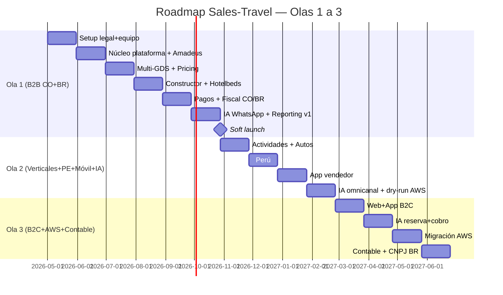

# Roadmap por Olas — Sales-Travel

**Versión:** 1.0
**Fecha:** 2026-04-24
**Inicio estimado:** Mayo 2026 (Mes 0)
**Lanzamiento Ola 1:** Noviembre 2026 (Mes 6)

> Cada ola es **producción completa**, no MVP. Los sprints son de 2 semanas. Las dependencias críticas están marcadas con ⚠️.

---

## 🌊 Ola 1 — Mes 0 a 6 — "B2B Colombia + Brasil con aéreo, hotel y asistencia"

**Objetivo:** Lanzar la plataforma B2B operando con 5-10 agencias piloto en Colombia y Brasil, vendiendo aéreo (consolidador existente + Amadeus), hoteles (HotelDo + Hotelbeds), asistencia (Assist Card), con cobro Stripe+MP, facturación electrónica CO+BR, white-label básico y WhatsApp para cotización con IA.

**Métricas de éxito Ola 1:**

- 10 agencias activas con login mensual
- 500 cotizaciones/mes, 100 reservas/mes mínimo
- Uptime ≥ 99.5%
- Tiempo medio de cotización < 3 minutos

---

### 📅 Mes 0 — Setup (sprints S0.1, S0.2)

**Objetivo:** Fundación legal, equipo arrancando, contratos firmados.

| Track     | Tarea                                                 | Dependencia       | Criterio de aceptación            |
| --------- | ----------------------------------------------------- | ----------------- | --------------------------------- |
| Legal     | Constitución SAS Colombia + RUT + matrícula mercantil | —                 | Documento de constitución firmado |
| Legal     | Inicio CADASTUR (Brasil), DPA LGPD borrador           | —                 | Solicitud enviada                 |
| Legal     | Decisión holding (Uruguay/Delaware/único CO)          | Asesor legal      | Documento de decisión             |
| Equipo    | Contratación CTO ⚠️                                   | Headhunter activo | Oferta firmada                    |
| Equipo    | Contratación PM, UX Designer                          | CTO en sitio      | Ofertas firmadas                  |
| Comercial | Firma contrato Travelport/Amadeus (productivo)        | IATA, BSP         | Contrato firmado                  |
| Comercial | Firma contrato HotelDo + Assist Card                  | —                 | Contratos firmados                |
| Comercial | KYC Stripe Connect + Mercado Pago Marketplace         | RUT empresa       | Cuentas activas en sandbox        |
| Tech      | Repositorio monorepo (Turborepo) inicial              | CTO               | Repo creado, CI básico            |
| Tech      | Decisión nombre comercial + dominios                  | Founder           | Dominios registrados              |

**Entregables Mes 0:** entidad legal viva, CTO en sitio, 4 personas contratadas, contratos firmados con proveedores críticos, repo arrancado.

---

### 📅 Mes 1 — Núcleo plataforma (sprints S1.1, S1.2)

**Objetivo:** Esqueleto cloud-ready funcionando, primer adapter GDS leyendo búsquedas reales.

| Track           | Tarea                                                                    | Dependencia           | Criterio de aceptación                    |
| --------------- | ------------------------------------------------------------------------ | --------------------- | ----------------------------------------- |
| Equipo          | Onboarding 2 backend sr + 2 frontend sr + 1 DevOps + 1 integraciones     | CTO                   | Equipo trabajando                         |
| Tech / Infra    | Provisionar 3 VPS Hostinger + Cloudflare + Backblaze B2                  | Decisión proveedor    | Infra activa, monitoreo básico            |
| Tech / Infra    | Caddy con SSL on-demand multi-tenant + dominio dev/staging               | Hostinger arriba      | `app.dev.salestravel.io` responde con SSL |
| Tech / Core     | Definir 15 puertos de `core/ports` con stubs                             | Equipo onboarded      | Interfaces compiladas, tests unitarios    |
| Tech / Core     | Modelo canónico (`Offer`, `Itinerary`, `Segment`, `Pax`, …)              | —                     | Tipos TS + validaciones Zod               |
| Tech / Core     | Multi-tenant con RLS forzada en Postgres + middleware de tenant resolver | Postgres provisionado | Test de aislamiento cross-tenant pasa     |
| Tech / Adapters | Adapter Amadeus self-service (search vuelos) end-to-end ⚠️               | Credenciales Amadeus  | Búsqueda LIM-MIA devuelve oferta canónica |
| Tech / Auth     | Auth (BetterAuth/Lucia) con superadmin + multi-tenant                    | Schema users          | Login superadmin funciona                 |
| Tech / CI/CD    | GitHub Actions con dev → staging deploy automático                       | Repo + Hostinger      | Push a `develop` deploya a dev            |
| Tech / Obs      | OpenTelemetry + Grafana stack en VPS obs                                 | VPS obs activo        | Traces y logs visibles                    |
| Producto        | Wireframes lo-fi de búsqueda + constructor + checkout                    | UX onboarded          | Figma compartido                          |

**Entregables Mes 1:** stack completo activo en dev, primer flujo de búsqueda Amadeus end-to-end, multi-tenant validado, CI/CD operativo.

---

### 📅 Mes 2 — Búsqueda + Pricing (S2.1, S2.2)

| Track                | Tarea                                                                  | Dependencia                                     | Criterio de aceptación                            |
| -------------------- | ---------------------------------------------------------------------- | ----------------------------------------------- | ------------------------------------------------- |
| Equipo               | Contratación QA + IA engineer                                          | CTO                                             | Onboarding completado                             |
| Tech / Adapters      | Adapter Travelport y Sabre (search) ⚠️                                 | Credenciales productivas, certificación inicial | Search desde 3 GDS en paralelo con scatter-gather |
| Tech / Adapters      | Adapter HotelDo (search hoteles)                                       | Credenciales                                    | Búsqueda Cancún devuelve hoteles canónicos        |
| Tech / Pricing       | Motor de pricing rules (markup % / fijo, por categoría/tenant/destino) | Multi-tenant listo                              | Test: cambiar markup recalcula totales            |
| Tech / Cache         | Redis cache con TTL por categoría + stampede protection                | Redis activo                                    | Repetir search no llama a proveedor antes del TTL |
| Tech / Search engine | Typesense para catálogo destinos + hoteles deduplicados                | —                                               | Autocomplete < 50ms                               |
| Tech / UI Web        | UI búsqueda B2B (filtros, lista de ofertas) — desktop first            | Wireframes aprobados                            | Página `/search` funcional                        |
| Tech / UI Web        | UI panel admin tenant (config branding, dominios, pricing)             | Wireframes                                      | Tenant puede subir logo, definir markup           |
| Producto             | Diseño hi-fi del constructor drag-and-drop                             | UX                                              | Figma aprobado                                    |
| Tech / Workflow      | Temporal self-hosted + primera saga (search timeout)                   | Docker                                          | Saga ejecuta y compensa correctamente             |

**Entregables Mes 2:** búsqueda multi-GDS + hoteles funcional con pricing parametrizable y cache, panel admin de tenant operativo, Temporal arriba.

---

### 📅 Mes 3 — Constructor + Reservas (S3.1, S3.2)

| Track           | Tarea                                                          | Dependencia        | Criterio de aceptación                                  |
| --------------- | -------------------------------------------------------------- | ------------------ | ------------------------------------------------------- |
| Equipo          | Contratación Data engineer                                     | CTO                | Onboarding                                              |
| Tech / UI       | Constructor drag-and-drop (vuelo + hotel + asistencia)         | Diseño hi-fi       | Itinerario armado en pantalla con totales en vivo       |
| Tech / Domain   | Servicio de Quote (cotización persistida con expiración)       | Búsqueda + pricing | Cotización guardada, share link funcional               |
| Tech / Adapters | Adapter Hotelbeds APITUDE (búsqueda + pre-book)                | Credenciales       | Hotel devuelto con TTL de tarifa                        |
| Tech / Adapters | Adapter Assist Card (cotización + emisión póliza)              | Contrato firmado   | Póliza generada en sandbox                              |
| Tech / Workflow | Saga de reserva multi-proveedor con compensación               | Temporal listo     | Test: hold vuelo + hotel, fallar pago, todo se revierte |
| Tech / Adapters | Mapping Giata para deduplicar hoteles (HotelDo + Hotelbeds) ⚠️ | Licencia Giata     | Mismo hotel aparece 1 vez en search                     |
| Tech / Domain   | Roles (superadmin, admin tenant, vendedor) + permisos          | Auth               | Vendedor solo ve sus cotizaciones                       |
| Tech / Notifs   | Email transaccional con remitente del tenant (DKIM)            | Resend cuenta      | Email confirmación llega con dominio del tenant         |

**Entregables Mes 3:** constructor visual operativo, primera reserva end-to-end (sin pago aún), Hotelbeds activo, Giata deduplicando.

---

### 📅 Mes 4 — Pagos + Fiscal (S4.1, S4.2)

| Track               | Tarea                                                            | Dependencia               | Criterio de aceptación                                        |
| ------------------- | ---------------------------------------------------------------- | ------------------------- | ------------------------------------------------------------- |
| Tech / Pagos        | Integración Stripe Connect + MP Marketplace (hosted checkout) ⚠️ | KYC completado            | Pago real (modo test) crea PaymentIntent y Booking confirmado |
| Tech / Pagos        | Webhook normalizer + outbox pattern + idempotency                | —                         | Webhook duplicado no crea doble booking                       |
| Tech / Pagos        | Split payments con application fee + payout a agencia            | Stripe Connect            | Comisión visible en dashboard de agencia                      |
| Tech / Fiscal       | Adapter Alegra para DIAN (Colombia): emisión FEV + nota crédito  | Cuenta Alegra productiva  | Factura emitida y validada por DIAN                           |
| Tech / Fiscal       | Adapter dLocal/Ebanx como MoR para Brasil (Ola 1)                | Contrato MoR firmado      | Cobro BR funciona, MoR emite NFS-e                            |
| Tech / Pagos        | Pagos por créditos prepagos (saldo de agencia)                   | —                         | Agencia recarga, paga con saldo, saldo decrece                |
| Tech / Contabilidad | Asientos automáticos por evento (booking, payment, refund)       | Modelo contable           | Asiento creado al confirmar reserva                           |
| Tech / Post-venta   | Cancelación + reembolso vía proveedor                            | Saga reservas             | Cancelar reserva genera refund automatizado                   |
| Tech / UI           | Checkout B2B (selección método pago, créditos, link al cliente)  | Pagos integrados          | Vendedor cierra venta en < 2 min                              |
| Seguridad           | PCI SAQ-A documentado + primer ASV scan                          | Stripe/MP hosted checkout | AOC firmado                                                   |

**Entregables Mes 4:** pagos productivos en CO y BR, facturación electrónica funcionando, saldo prepago, contabilidad básica.

---

### 📅 Mes 5 — IA WhatsApp + Reporting (S5.1, S5.2)

| Track            | Tarea                                                                       | Dependencia              | Criterio de aceptación                                     |
| ---------------- | --------------------------------------------------------------------------- | ------------------------ | ---------------------------------------------------------- |
| Tech / IA        | Channel Gateway (WhatsApp Cloud API + webchat)                              | WhatsApp BSP del cliente | Mensaje WA llega al sistema y responde                     |
| Tech / IA        | LLM router multi-modelo (Claude / GPT-4o-mini) con LiteLLM o gateway propio | API keys                 | Test A/B: clasificación con Haiku, conversación con Sonnet |
| Tech / IA        | Tool-calling: search, quote, share                                          | Servicios de dominio     | Por WA: "vuelo BOG-MIA julio" → cotización en chat         |
| Tech / IA        | Conversation state (Redis short-term, Postgres long-term + pgvector)        | Redis + pgvector         | Memoria de conversación funciona                           |
| Tech / Reporting | Dashboards v1 (GMV, reservas, conversión, top destinos)                     | Data engineer            | Dashboard founder con datos reales                         |
| Tech / Reporting | Dashboard agencia (sus reservas, comisiones, vendedores top)                | Roles                    | Admin agencia ve solo lo suyo                              |
| Producto         | Programa de pilotaje: contactar 10 agencias, NDAs firmados                  | Comercial                | 10 agencias listas para onboarding                         |
| Soporte          | Setup Helpdesk básico (Crisp/Intercom o propio) + base de conocimiento      | UI lista                 | Tickets entran y se asignan                                |

**Entregables Mes 5:** IA WA cotizando, reporting v1, programa piloto definido, soporte básico.

---

### 📅 Mes 6 — Soft Launch (S6.1, S6.2)

| Track              | Tarea                                                             | Dependencia         | Criterio de aceptación       |
| ------------------ | ----------------------------------------------------------------- | ------------------- | ---------------------------- |
| Tech / Hardening   | Hardening completo VPS (UFW, fail2ban, sops, backups cifrados)    | Checklist seguridad | Pentest interno OK           |
| Tech / Hardening   | Cloudflare WAF + rate limiting + bot fight mode                   | Cloudflare Pro      | Reglas activas               |
| Tech / Performance | Load testing (k6) — 500 reservas/día, 50 cotizaciones simultáneas | Plataforma estable  | p95 < 2s para search         |
| Tech / DR          | Backups diarios + restore drill                                   | Backblaze           | Restore probado              |
| Operación          | Onboarding 5 agencias piloto (capacitación + soporte dedicado)    | Programa pilotaje   | 5 agencias activas           |
| Operación          | Runbook de incidentes, on-call schedule (CTO + DevOps)            | —                   | Documentado                  |
| Comercial          | Material de venta + landing page B2B                              | Branding            | Landing live                 |
| Producto           | Bug bash interno + correcciones críticas                          | Plataforma          | Sin P0/P1 abiertos           |
| 🚀 GO LIVE         | **Soft launch B2B Colombia + Brasil**                             | Todo lo anterior    | Primera reserva real cobrada |

**Entregables Mes 6:** plataforma en producción con 5+ agencias activas, primera reserva real cobrada, métricas siendo capturadas.

---

## 🌊 Ola 2 — Mes 6 a 10 — "Verticales completos + Perú + móvil + IA omnicanal"

**Objetivo:** Sumar actividades, autos, abrir Perú, lanzar app móvil para vendedores y expandir IA a IG/TG/voz/webchat. Empezar dry-run de migración AWS.

**Métricas Ola 2:**

- 50 agencias activas
- 1.500 reservas/mes
- 3 países operativos
- App vendedor con DAU > 30
- IA en 4 canales (WA + IG + webchat + voz)

### Sprints clave

**Mes 7 — Actividades + Autos**

- Adapter Civitatis + GetYourGuide
- Adapter CarTrawler
- Sumar al constructor drag-and-drop estos verticales
- Reglas de pricing extendidas a estas categorías
- Equipo: +1 backend, +1 frontend, +1 mobile dev

**Mes 8 — Perú**

- Constitución SAC Perú + RUC + DIRCETUR
- Adapter Nubefact (SUNAT) para boletas y facturas
- Localización portugués/inglés revisada
- Onboarding primeras agencias peruanas
- Equipo: +1 PM B2C (preparando Ola 3)

**Mes 9 — App vendedor**

- App React Native + Expo iOS+Android
- Funcionalidades: cotizar, compartir WA, link de pago, comisiones, modo offline
- Beta interno con 5-10 vendedores
- Push notifications (Expo)

**Mes 10 — IA omnicanal + dry-run AWS**

- Conectores IG Messenger, Telegram Bot, webchat embebido
- Twilio Voice + Deepgram Nova-3 (STT) + ElevenLabs Flash (TTS)
- Dashboards reporting v2 (BI embebido, segmentación avanzada)
- ⚙️ **Dry-run AWS:** Aurora desde Postgres Hostinger (DMS), ECS staging, primer benchmark de costos reales
- Equipo: +1 IA engineer, +1 DevOps, +1 designer

**Entregables Ola 2:** 4 países, 5 verticales, app vendedor en stores, IA en 4 canales, plan de migración AWS validado.

---

## 🌊 Ola 3 — Mes 10 a 14 — "B2C completo + IA con reservas + AWS productivo"

**Objetivo:** Abrir B2C masivo (web + app cliente final), IA con capacidad de reservar y cobrar autónomamente, migración productiva a AWS, módulo contable completo, transición de MoR a CNPJ propio en BR.

**Métricas Ola 3:**

- 200 agencias B2B activas
- 1.000 clientes finales B2C activos
- 5.000 reservas/mes total (B2B + B2C)
- Uptime ≥ 99.9%
- Plataforma operando en AWS multi-región

### Sprints clave

**Mes 11 — Web + App B2C**

- Sitio público B2C con SEO (Next.js SSR, sitemaps, Schema.org)
- App cliente final React Native (marca única) + PWA white-label por tenant
- Onboarding cliente final (signup, perfil, pasajeros frecuentes)
- Equipo: +1 customer success, +1 marketing/growth

**Mes 12 — IA reserva + cobro autónomo**

- Tool-calling extendido: hold + payment link + confirmación + voucher por chat
- Guardrails: límites de monto, validación de identidad para montos altos, human-in-the-loop opcional por tenant
- Cross-sell IA: sugerir asistencia / actividades / auto basado en perfil
- Sistema de feedback para mejora continua del agente

**Mes 13 — Migración AWS ⚠️**

- Re-platform incremental (8 semanas con 2 DevOps + soporte de equipo)
- Aurora Global DB (`sa-east-1` primary, `us-east-1` DR)
- ECS Fargate, ElastiCache, OpenSearch, EventBridge, Step Functions
- Traffic shifting Route53 weighted (10/50/100)
- Cierre de Hostinger una vez estable

**Mes 14 — Contable + CNPJ BR + Compliance**

- Cierre mensual completo, conciliación avanzada, reportes contables (estado de resultados, flujo)
- Constitución Ltda. brasileña + inscripción municipal + CADASTUR titular
- Migración de Ebanx (MoR) a Pix directo + Focus NFe
- Auditoría ISO 27001 ligera (o equivalente) para clientes enterprise
- Equipo: +1 contador, +1 legal/compliance

**Entregables Ola 3:** plataforma B2C live, IA autónoma con guardrails, AWS productivo, CNPJ BR operando directo, contabilidad completa, lista para escalar.

---

## Olas Posteriores (Año 2+)

### 🌊 Ola 4 — Año 2 — Expansión LATAM + NDC directo + Marketplace

- México, Argentina, Chile (entidades locales + fiscalización)
- NDC directo con LATAM, Avianca, Aeroméxico (sustituir Duffel donde volumen justifique)
- Marketplace de actividades con operadores locales (model B2B2C)
- Programa de afiliados (influencers, blogs)

### 🌊 Ola 5 — Año 2-3 — Estados Unidos + Europa

- Onboarding al mercado USA (turistas hispanos, marca consolidada)
- Europa (turistas hacia LATAM)
- Localización EN reforzada, soporte multilenguaje

---

## Mapa de Dependencias Críticas (vista rápida)

---

## Criterios de Salida por Ola (Definition of Done)

### Ola 1 — DoD

- [ ] 5+ agencias B2B activas con login mensual y reservas reales
- [ ] Uptime últimos 30 días ≥ 99.5%
- [ ] Stripe + MP en producción, conciliación nocturna automatizada
- [ ] Facturación electrónica DIAN + BR (vía MoR) funcionando
- [ ] WhatsApp cotizando con IA en español
- [ ] Reporting v1 con datos reales (GMV, reservas, conversión)
- [ ] PCI SAQ-A AOC firmado
- [ ] Runbooks de incidentes y on-call rotation activos
- [ ] Backups diarios cifrados con restore drill exitoso

### Ola 2 — DoD

- [ ] 50+ agencias activas en 3 países (CO, BR, PE)
- [ ] 5 verticales operativos (vuelo, hotel, actividad, asistencia, auto)
- [ ] App vendedor en App Store + Play Store con rating ≥ 4.0
- [ ] IA en 4 canales (WA, IG, webchat, voz)
- [ ] Plan de migración AWS validado con dry-run exitoso
- [ ] Reporting v2 (BI embebido) con segmentación

### Ola 3 — DoD

- [ ] B2C live (web + app marca única + PWA white-label)
- [ ] IA con capacidad de reservar y cobrar autónomamente con guardrails
- [ ] Plataforma corriendo 100% en AWS multi-región
- [ ] CNPJ BR propio + Pix directo + Focus NFe
- [ ] Módulo contable propio cerrando mes con conciliación
- [ ] Uptime ≥ 99.9% últimos 30 días
- [ ] 5.000 reservas/mes total
- [ ] Auditoría ISO 27001 ligera (o equivalente) firmada

---

## Riesgos del Roadmap (específicos del cronograma)

| #   | Riesgo                                        | Impacto en cronograma       | Mitigación                                                                 |
| --- | --------------------------------------------- | --------------------------- | -------------------------------------------------------------------------- |
| RR1 | Homologación GDS más lenta de lo esperado     | +4-8 semanas Ola 1          | Empezar Mes 0, usar Self-Service Amadeus en paralelo a contrato Enterprise |
| RR2 | KYC Stripe Connect / MP demora en BR          | +2-4 semanas                | Iniciar Mes 0, usar dLocal/Ebanx como respaldo                             |
| RR3 | CTO no contratado en Mes 0                    | +6-8 semanas todo el plan   | Headhunter activo desde día 1, plan B con CTO interim                      |
| RR4 | Mapping Giata caro o lento                    | Calidad de search degradada | Usar TGX o Hotelbeds mapping si Giata bloquea                              |
| RR5 | Migración AWS con downtime                    | Reputación golpeada         | Re-platform incremental (no big-bang), traffic shifting                    |
| RR6 | Reforma Tributária BR cambia reglas mid-Ola 3 | Re-trabajo facturación      | Diseñar adapter país agnóstico al motor fiscal                             |
| RR7 | Adopción agencias piloto baja                 | Ola 1 sin métricas reales   | Programa de incentivos + acompañamiento 1-on-1 las primeras 4 semanas      |

---

## Próximos pasos inmediatos

1. **Founder valida el roadmap** y ajusta prioridades / fechas si es necesario.
2. **Ir al documento `08-organizacion-equipo.md`** con perfiles, salarios y plan de contratación detallado.
3. **Iniciar Mes 0:** activar headhunter para CTO, abogado para constitución, contactar Travelport/Amadeus/HotelDo/Stripe/MP para arranque de procesos.
