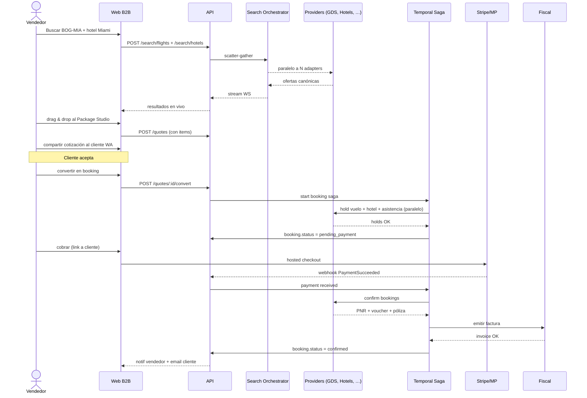
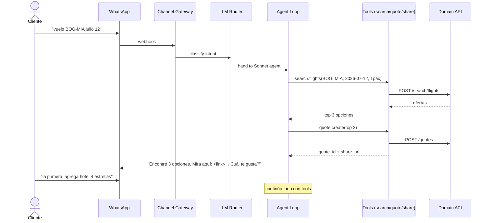
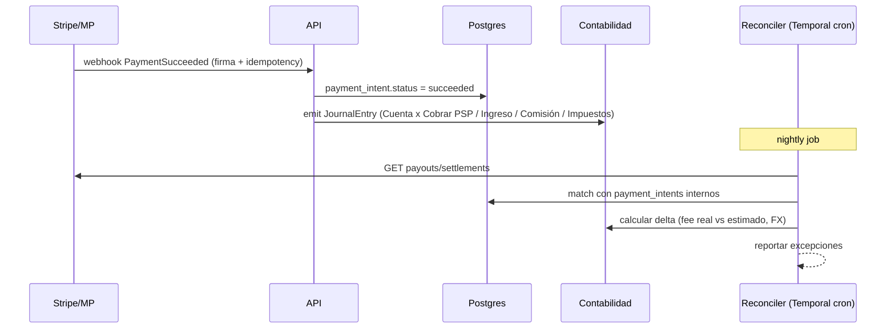

# Mapa Completo de la Plataforma — Sales-Travel

**Versión:** 1.0
**Fecha:** 2026-04-24
**Propósito:** Vista única y exhaustiva de TODO lo que se construye. Es la fuente de verdad técnica para Sprint 0 en adelante. Todo lo que no es construcción de plataforma vive en `11-manual-operativo.md`.

---

## Índice

1. [Principios de diseño](#1-principios-de-diseño-no-negociables)
2. [Mapa jerárquico de módulos](#2-mapa-jerárquico-de-módulos)
3. [Módulo de Identidad y Seguridad](#3-módulo-de-identidad-y-seguridad-detalle)
4. [Modelo de datos completo](#4-modelo-de-datos-completo)
5. [Mapa de pantallas (sitemap UI por rol)](#5-mapa-de-pantallas-sitemap-ui)
6. [Endpoints API por dominio](#6-endpoints-api-por-dominio)
7. [Flujos críticos end-to-end](#7-flujos-críticos-end-to-end)
8. [Sistema de diseño (Design System)](#8-sistema-de-diseño-design-system)
9. [Matriz módulo × ola](#9-matriz-módulo--ola)
10. [Estructura del repositorio](#10-estructura-del-repositorio)

---

## 1. Principios de diseño NO NEGOCIABLES

Toda decisión de construcción se valida contra estos:

1. **Tiempo a venta < 2 minutos.** Cualquier flujo que tarde más es bug, no feature.
2. **Mobile-first siempre.** Vendedor en ruta y cliente final usan móvil. Desktop es complemento.
3. **UX limpia tipo Linear/Stripe/Notion.** Tablas densas con jerarquía clara, no formularios estilo ERP 2012.
4. **Drag-and-drop como verbo central.** El constructor de paquetes es el corazón del producto.
5. **Conversacional first.** WhatsApp es ciudadano de primera clase, no un add-on.
6. **Multi-tenant white-label nativo.** Cada decisión técnica debe respetar aislamiento de tenant.
7. **Cloud-ready día 1.** 15 abstracciones de infra detrás de ports (ver `research/05`).
8. **Eventos antes que estado.** Todo cambio de negocio relevante emite domain event.
9. **Fail loud, recover gracefully.** Circuit breakers, sagas con compensación, kill-switches por proveedor.
10. **Accesibilidad WCAG AA mínimo.** Contraste, keyboard nav, screen readers.

---

## 2. Mapa Jerárquico de Módulos

```
SALES-TRAVEL PLATFORM
│
├── 🔐 M0 — Identidad, Seguridad y Multi-tenant (transversal)
│   ├── M0.1 Auth (login, signup, MFA, SSO, magic link)
│   ├── M0.2 Roles y Permisos (RBAC + ABAC)
│   ├── M0.3 Tenant management (creación, branding, dominios)
│   ├── M0.4 Audit log (event sourcing parcial)
│   ├── M0.5 Secrets vault (cifrado credenciales proveedores)
│   ├── M0.6 Rate limiting y abuse protection
│   └── M0.7 Compliance helpers (PCI SAQ-A, LGPD, Ley 1581 export/delete)
│
├── 🔍 M1 — Búsqueda y Catálogo
│   ├── M1.1 Buscador unificado (form universal pax/fechas/destino)
│   ├── M1.2 Search Orchestrator (scatter-gather a N proveedores)
│   ├── M1.3 Provider Adapters (Amadeus, Travelport, Sabre, NDC LATAM, HotelDo, Hotelbeds, …)
│   ├── M1.4 Canonical Domain Model (Offer, Itinerary, Segment, Pax, Fare, …)
│   ├── M1.5 Cache distribuida (Redis con TTL granular + stampede protection)
│   ├── M1.6 Mapping Giata (deduplicación hoteles)
│   ├── M1.7 Catálogo enriquecido (destinos, fotos, descripciones, geo)
│   ├── M1.8 Filtros avanzados (precio, escalas, estrellas, régimen, cancelación, valoraciones)
│   └── M1.9 Search analytics (qué buscan, qué no encuentran)
│
├── 🧱 M2 — Package Studio (Constructor drag-and-drop) ⭐ CORAZÓN
│   ├── M2.1 Lienzo de itinerario (canvas tipo Notion/Figma)
│   ├── M2.2 Tarjetas arrastrables (vuelo, hotel, actividad, asistencia, auto)
│   ├── M2.3 Validación de coherencia (fechas, ciudad, pax)
│   ├── M2.4 Cálculo en tiempo real (precio, markup, impuestos, FX, comisiones)
│   ├── M2.5 Sugerencias IA (cross-sell contextual)
│   ├── M2.6 Templates de paquetes (favoritos, recurrentes)
│   ├── M2.7 Compartir cotización (link público, WhatsApp, PDF, email)
│   └── M2.8 Conversión a reserva (1 click)
│
├── 💬 M3 — Cotizador Inteligente
│   ├── M3.1 Generador de cotizaciones (PDF + link web responsive)
│   ├── M3.2 Plantillas con branding tenant
│   ├── M3.3 Generación asistida IA (lenguaje natural → 3 opciones)
│   ├── M3.4 Tracking de cotización (enviada/vista/aceptada/expirada)
│   ├── M3.5 Conversión a reserva
│   └── M3.6 Negociación (ajustar precios, agregar/quitar items)
│
├── 📋 M4 — Reservas y Emisión
│   ├── M4.1 Saga de reserva multi-proveedor (Temporal)
│   ├── M4.2 Compensación automática (revertir holds en fallo)
│   ├── M4.3 Confirmación PNR (vuelos)
│   ├── M4.4 Voucher hoteles / actividades / autos
│   ├── M4.5 Póliza asistencia
│   ├── M4.6 Cola de tickets pendientes + reintentos
│   ├── M4.7 Modificaciones (cambio pax/fecha/ruta)
│   ├── M4.8 Cancelaciones (recálculo de penalidades)
│   └── M4.9 Trazabilidad completa (audit log por reserva)
│
├── 💰 M5 — Pagos y Cobranza
│   ├── M5.1 Payment Router (Stripe / MP por tenant/país/moneda/BIN)
│   ├── M5.2 Hosted checkout (SAQ-A: Stripe + MP Checkout Pro)
│   ├── M5.3 Métodos locales (PIX, PSE, Boleto, Yape, Plin, OXXO)
│   ├── M5.4 Split payments (Stripe Connect + MP Marketplace)
│   ├── M5.5 Wallet B2B (créditos prepagos por agencia)
│   ├── M5.6 Cash en plataforma (registro de pagos manuales)
│   ├── M5.7 Webhooks normalizer + idempotency + outbox
│   ├── M5.8 Conciliación nocturna automatizada
│   ├── M5.9 Refunds y reembolso anticipado (doble libro)
│   └── M5.10 Antifraude (reglas + score + 3DS challenge)
│
├── 💵 M6 — Pricing & Comisiones (motor parametrizable)
│   ├── M6.1 Reglas por tenant (markup % / fijo)
│   ├── M6.2 Reglas por categoría / destino / temporada / proveedor
│   ├── M6.3 Reglas por tipo de cliente final
│   ├── M6.4 Override manual por reserva (con permiso)
│   ├── M6.5 Comisiones internas (vendedor → agencia → plataforma)
│   ├── M6.6 Versionado de reglas + simulador "what-if"
│   └── M6.7 Audit de cambios de reglas
│
├── 🏢 M7 — Multi-tenant & White-label
│   ├── M7.1 Tenant resolver (host → tenant)
│   ├── M7.2 RLS forzada en Postgres
│   ├── M7.3 Dominio custom (CNAME) + SSL on-demand (Caddy)
│   ├── M7.4 Branding editor (logo, colores, tipografía, favicon)
│   ├── M7.5 Theming engine (CSS variables inyectadas)
│   ├── M7.6 Email branding (DKIM por dominio del tenant)
│   ├── M7.7 PWA white-label generador
│   └── M7.8 Tenant lifecycle (onboarding, suspensión, baja)
│
├── 👥 M8 — Roles, Permisos y Equipos
│   ├── M8.1 Jerarquía: superadmin → admin plataforma → admin tenant → vendedor → cliente final
│   ├── M8.2 RBAC granular (acciones por recurso)
│   ├── M8.3 ABAC (reglas dinámicas: "vendedor solo ve sus clientes")
│   ├── M8.4 Equipos / squads dentro de agencia
│   ├── M8.5 Metas y comisiones por vendedor
│   └── M8.6 Auditoría de acciones sensibles
│
├── 🤖 M9 — IA Omnicanal (Conversacional)
│   ├── M9.1 Channel Gateway (normalizador de mensajes)
│   ├── M9.2 Conector WhatsApp Business API (Meta Cloud API)
│   ├── M9.3 Conector Instagram Messenger
│   ├── M9.4 Conector Telegram Bot
│   ├── M9.5 Conector Webchat embedeable (SDK propio)
│   ├── M9.6 Conector Voz (Twilio + Deepgram + ElevenLabs)
│   ├── M9.7 LLM Router multi-modelo (Claude / GPT / Haiku) — LiteLLM
│   ├── M9.8 Agent Loop (LangGraph) con tool-calling
│   ├── M9.9 Tools: search, quote, hold, book, refund, escalate
│   ├── M9.10 State management (Redis short-term + Postgres+pgvector long-term)
│   ├── M9.11 Guardrails (límites monto, validación identidad, human-in-the-loop)
│   ├── M9.12 Evals y feedback loop (mejora continua)
│   └── M9.13 Cost observability (budget por tenant, alertas)
│
├── 📊 M10 — Contabilidad Propia
│   ├── M10.1 Plan de cuentas configurable (por tenant + multi-país)
│   ├── M10.2 Asientos automáticos por evento (booking, payment, refund, comisión)
│   ├── M10.3 Asientos manuales (con doble validación)
│   ├── M10.4 Cuentas por cobrar / pagar (proveedores y agencias)
│   ├── M10.5 Multi-moneda con FX por fecha de transacción
│   ├── M10.6 Cierre mensual automatizado
│   └── M10.7 Reportes contables (P&L, flujo de caja, balance)
│
├── 🧾 M11 — Facturación Electrónica (multi-país)
│   ├── M11.1 Adapter Colombia (DIAN vía Alegra/Factory HKA)
│   ├── M11.2 Adapter Brasil (NFS-e Nacional vía Focus NFe / dLocal MoR)
│   ├── M11.3 Adapter Perú (SUNAT vía Nubefact)
│   ├── M11.4 Notas crédito/débito
│   ├── M11.5 Documentos soporte (proveedores no obligados)
│   ├── M11.6 Reglas fiscales por país (IVA, ISS, IGV, exenciones turistas)
│   └── M11.7 Reforma Tributária BR (IBS/CBS roadmap 2027+)
│
├── 📈 M12 — Reporting & BI Propio
│   ├── M12.1 Dashboards por rol (founder, admin tenant, vendedor)
│   ├── M12.2 KPIs (GMV, reservas, ticket promedio, conversión, cancelación, LTV, márgenes)
│   ├── M12.3 Filtros avanzados (país, tenant, vendedor, producto, periodo)
│   ├── M12.4 Drill-down y comparativas
│   ├── M12.5 Export CSV/Excel/PDF
│   ├── M12.6 Suscripción a reportes por email
│   ├── M12.7 Embeds (compartir dashboard como link autenticado)
│   └── M12.8 Anomalías IA (alertas automáticas: caída de conversión, spike de cancelaciones)
│
├── 📱 M13 — Apps Móviles
│   ├── M13.1 App Vendedor iOS+Android (React Native + Expo)
│   │   ├── Cotización rápida
│   │   ├── Compartir por WhatsApp
│   │   ├── Cierre con link de pago
│   │   ├── Comisiones y metas
│   │   └── Modo offline
│   ├── M13.2 App Cliente Final iOS+Android (marca única)
│   │   ├── Mi viaje (itinerario, vouchers, check-in)
│   │   ├── Asistencia 24/7
│   │   ├── Reembolsos
│   │   └── Loyalty (Ola 4+)
│   └── M13.3 PWA white-label por tenant (cliente final)
│
├── 🛟 M14 — Soporte 24/7
│   ├── M14.1 Sistema de tickets integrado
│   ├── M14.2 Niveles N1 (BPO) / N2 (interno) / N3 (ingeniería on-call)
│   ├── M14.3 Runbooks por tipo de incidente
│   ├── M14.4 Escalamiento automático
│   ├── M14.5 SLA tracking + alertas
│   └── M14.6 Base de conocimiento (interna + clientes)
│
├── 🔌 M15 — Plataforma de Integraciones (transversal)
│   ├── M15.1 Provider Registry (catálogo de adapters)
│   ├── M15.2 Health checks por proveedor
│   ├── M15.3 Circuit breakers + kill switches (feature flags)
│   ├── M15.4 Retry policies + DLQ
│   ├── M15.5 Latency budget enforcement
│   └── M15.6 Sandbox/prod toggle por tenant
│
└── 🔧 M16 — Plataforma Operacional (DevEx + Ops)
    ├── M16.1 CI/CD (GitHub Actions, dev/staging/prod)
    ├── M16.2 Feature flags (Unleash → LaunchDarkly)
    ├── M16.3 Observabilidad (OTel + Grafana stack → Datadog)
    ├── M16.4 Error tracking (Sentry)
    ├── M16.5 Backups + DR drills
    ├── M16.6 Performance budgets (Core Web Vitals, p95 API)
    └── M16.7 Cost observability (infra + LLM por tenant)
```

---

## 3. Módulo de Identidad y Seguridad (DETALLE)

Sub-módulo crítico que el usuario destacó. Por eso lo expando aquí.

### 3.1 M0.1 — Auth

**Métodos de autenticación soportados:**

- Email + password (con políticas de seguridad: 12+ chars, sin dictionary words)
- **Magic link** (default para B2C: sin contraseña, link al email)
- **Passkeys/WebAuthn** (Ola 2+, biométrico nativo)
- **OAuth/SSO** (Google, Microsoft, Apple — para B2C)
- **SAML 2.0** (Ola 3+, para tenants enterprise)
- **MFA obligatorio** para roles admin+ (TOTP via apps tipo Authy / Google Authenticator)
- **Session management** con refresh tokens rotatorios (15min access / 30d refresh)
- Detección de **anomalías** (login desde nueva geo/dispositivo → email + reto MFA)

**Stack técnico:**

- Fase 1: **BetterAuth** o **Lucia** (PG-backed, code-owned, sin lock-in).
- Fase 2 opción: migrar a **Clerk** (mejor DX, MFA, organizations) o **Cognito** (más barato a escala, peor DX).
- JWT firmado con **EdDSA** (Ed25519), rotación de claves trimestral con KID en header.

### 3.2 M0.2 — Roles y Permisos

**Modelo:** RBAC + ABAC.

```
RBAC (rol → conjunto de permisos):
  - superadmin           → todo
  - platform_admin       → gestión multi-tenant, billing, soporte
  - tenant_admin         → su tenant: usuarios, branding, pricing, reportes
  - tenant_supervisor    → ver todas las cotizaciones/reservas del tenant
  - tenant_seller        → solo sus clientes/cotizaciones/reservas
  - tenant_accountant    → solo módulos contable, pagos, facturación
  - end_customer         → solo sus reservas/itinerarios/perfil

ABAC (políticas dinámicas evaluadas en runtime):
  - "tenant_seller puede ver cotización X solo si X.assigned_seller_id = current_user.id"
  - "tenant_admin puede emitir refund solo si refund.amount < tenant.refund_limit"
  - "todo usuario solo puede acceder a recursos de su tenant_id"
```

**Implementación:** middleware de Express/NestJS que carga `current_tenant + current_user + roles + policies` en cada request. Tests de aislamiento cross-tenant en CI.

### 3.3 Hardening de Seguridad

| Capa             | Medida                                                                                                                                                                                                                                    |
| ---------------- | ----------------------------------------------------------------------------------------------------------------------------------------------------------------------------------------------------------------------------------------- |
| **Red**          | Cloudflare (WAF + DDoS + Bot Fight Mode + Rate Limiting + Geo Block opcional). UFW en VPS solo 80/443/22. SSH key-only (Ed25519), puerto custom, fail2ban.                                                                                |
| **Aplicación**   | Helmet headers (CSP, HSTS, X-Frame-Options, Referrer-Policy). Input validation con Zod en cada endpoint. SQL injection: ORM (Prisma) + queries parametrizadas. XSS: React escape default + CSP estricto. CSRF: same-site cookies + token. |
| **Datos**        | At-rest: pgcrypto para PII sensible (documentos, fechas nacimiento). Backups cifrados con GPG. In-transit: TLS 1.3, HSTS preload.                                                                                                         |
| **Secretos**     | sops + age en repo (sin secretos planos). En AWS: Secrets Manager + KMS. Rotación trimestral mínima.                                                                                                                                      |
| **Auditoría**    | Event sourcing parcial: cada acción sensible (login, cambio permisos, refund, modificación reserva, edición pricing) genera `domain_event` append-only en TimescaleDB.                                                                    |
| **Pagos**        | Hosted Checkout únicamente (SAQ-A). Nunca PAN/CVV en servidor. Webhooks con signature verification + idempotency keys.                                                                                                                    |
| **Dependencias** | Dependabot/Renovate semanal. Snyk o GitHub Advanced Security. Lockfile inmutable.                                                                                                                                                         |
| **Pentesting**   | Pentest interno antes de Ola 1 launch. Pentest externo anual desde Ola 2. Bug bounty privado en Ola 3.                                                                                                                                    |
| **Compliance**   | LGPD/Ley 1581/Ley 29733: endpoints de export y delete de datos personales. Cookie consent. Retención configurable por tipo de dato. DPO designado (puede ser tercerizado).                                                                |

### 3.4 Threat Model resumido

| Amenaza                                 | Vector                             | Mitigación                                                                    |
| --------------------------------------- | ---------------------------------- | ----------------------------------------------------------------------------- |
| Robo de cuenta                          | Phishing, credential stuffing      | MFA obligatorio admins, magic link B2C, detección anomalías                   |
| Filtración cross-tenant                 | Bug en query                       | RLS forzada, tests CI con doble tenant, fuzz testing                          |
| Fraude de pago                          | Card testing, BIN attack           | 3DS challenge, score Stripe Radar / MP, rate limiting checkout                |
| Compromiso credenciales proveedor (GDS) | Leak en logs/git                   | Vault sops, NEVER log secrets, scanner pre-commit                             |
| Webhook spoofing                        | Endpoint público sin verificación  | Signature verification (Stripe/MP firma HMAC), IP whitelist                   |
| Inyección en search                     | Input malicioso pasado a proveedor | Sanitizer + Zod schema en cada endpoint                                       |
| Insider threat                          | Empleado malintencionado           | Audit log inmutable, principio mínimo privilegio, revisión accesos trimestral |
| Ransomware                              | Compromiso VPS                     | Backups inmutables Backblaze B2, restore drills mensuales, DR plan            |

---

## 4. Modelo de Datos Completo

> Diagrama lógico. El esquema físico (índices, particiones, FKs exactas) se diseña en Sprint 0 con el equipo de backend.

### 4.1 Core entities

```
TENANT
  id (uuid, pk)
  slug (unique)                    -- "agencia-acme"
  legal_name
  display_name
  country (CO|BR|PE|...)
  currency_default (COP|BRL|PEN|USD)
  language_default (es|pt|en)
  status (active|suspended|trial)
  created_at
  └── 1:1 BRANDING_CONFIG
  └── 1:N PRICING_RULE
  └── 1:N PAYMENT_ACCOUNT
  └── 1:N FISCAL_CONFIG
  └── 1:N USER (vía MEMBERSHIP)
  └── 1:N CUSTOMER

BRANDING_CONFIG
  tenant_id (fk, pk)
  logo_url, favicon_url
  primary_color, secondary_color, accent_color
  font_family
  custom_domain (nullable)
  email_from_domain
  pwa_manifest (jsonb)

USER
  id (uuid, pk)
  email (unique)
  password_hash (nullable, magic-link users no tienen)
  mfa_secret (nullable)
  mfa_enabled (bool)
  preferred_language
  status (active|locked|deleted)
  last_login_at, last_login_ip, last_login_user_agent
  created_at

MEMBERSHIP
  id (pk)
  user_id (fk)
  tenant_id (fk)
  role (superadmin|platform_admin|tenant_admin|tenant_supervisor|tenant_seller|tenant_accountant|end_customer)
  status (active|invited|suspended)
  unique(user_id, tenant_id)

ROLE_POLICY (ABAC overrides)
  tenant_id (fk)
  role (string)
  resource_type (quote|booking|customer|...)
  rule_expression (jsonb)         -- p. ej. {"field": "assigned_seller_id", "op": "eq", "value": "$user.id"}
```

### 4.2 Customer & Quote/Booking

```
CUSTOMER
  id (uuid, pk)
  tenant_id (fk)
  type (person|company)
  document_type, document_number (cifrados)
  full_name / company_name
  email, phone, whatsapp_id
  preferences (jsonb: airline, seat, meal, …)
  loyalty_tier
  created_at, last_activity_at

QUOTE
  id (uuid, pk)
  tenant_id (fk)
  customer_id (fk)
  assigned_seller_id (fk user)
  status (draft|sent|viewed|accepted|expired|converted)
  expires_at
  shareable_token (para link público)
  total_breakdown (jsonb: net, markup, taxes, fx, fees, total)
  currency
  created_at
  └── 1:N QUOTE_ITEM

QUOTE_ITEM
  id (pk)
  quote_id (fk)
  type (flight|hotel|activity|insurance|car|transfer|package)
  provider_code (amadeus|hoteldo|...)
  provider_offer_id
  canonical_payload (jsonb)        -- snapshot de la oferta canónica
  pricing (jsonb)                  -- net, markup_applied, fees, total
  position (int)                   -- orden en el itinerario

BOOKING
  id (uuid, pk)
  tenant_id (fk)
  quote_id (fk, nullable: puede haber bookings sin quote)
  customer_id (fk)
  assigned_seller_id (fk)
  status (pending|confirmed|partial|cancelled|refunded)
  total_amount, currency
  emission_status (pending|emitted|failed)
  saga_id (Temporal workflow id)
  created_at, confirmed_at
  └── 1:N BOOKING_ITEM
  └── 1:N PAYMENT_INTENT
  └── 1:N INVOICE
  └── 1:N COMMISSION
  └── 1:N AUDIT_EVENT (vía DOMAIN_EVENT)

BOOKING_ITEM
  id (pk)
  booking_id (fk)
  type (flight|hotel|...)
  provider_code
  provider_booking_ref          -- PNR, voucher number, policy id
  status (held|confirmed|emitted|cancelled|refunded)
  voucher_url
  cancellation_policy (jsonb)
  pricing_snapshot (jsonb)
```

### 4.3 Pricing, Pagos, Contabilidad

```
PRICING_RULE
  id (pk)
  tenant_id (fk)
  scope (jsonb: {"category": "hotel", "destination": "CTG", "season": "high", "provider": null})
  type (markup_pct|markup_fixed|commission|fee)
  value (decimal)
  priority (int)
  active (bool)
  valid_from, valid_to
  created_by_user_id

PAYMENT_INTENT
  id (uuid, pk)
  tenant_id (fk)
  booking_id (fk)
  psp (stripe|mercadopago|wallet|cash)
  psp_intent_id
  amount, currency
  fees_breakdown (jsonb)
  status (requires_action|processing|succeeded|failed|refunded)
  payment_method_type (card|pix|pse|boleto|yape|...)
  customer_country
  created_at, succeeded_at

WALLET (créditos B2B)
  tenant_id (fk, pk)
  balance, currency
  └── 1:N WALLET_TRANSACTION (recargas, débitos, reversas)

REFUND
  id (pk)
  payment_intent_id (fk)
  amount, currency
  reason
  status (pending|processed|failed)
  type (full|partial)
  receivable_from_provider (bool)   -- si hubo refund anticipado al cliente
  processed_at

CHART_OF_ACCOUNTS
  id (pk)
  tenant_id (fk)
  code, name, type (asset|liability|equity|income|expense)
  parent_id (self-fk)

JOURNAL_ENTRY
  id (pk)
  tenant_id (fk)
  date
  description
  source_event_id (fk domain_event)
  └── 1:N JOURNAL_LINE (debit/credit, account_id, amount)

INVOICE
  id (pk)
  tenant_id (fk)
  booking_id (fk)
  fiscal_country (CO|BR|PE)
  fiscal_provider (alegra|focus_nfe|nubefact|...)
  external_doc_id              -- CUFE en CO, NFS-e number en BR
  status (draft|emitted|cancelled)
  pdf_url, xml_url
  emitted_at
```

### 4.4 Providers, IA, Auditoría

```
PROVIDER
  id (pk)
  code (amadeus|hoteldo|stripe|...)
  type (gds|ndc|hotel|activity|insurance|car|payment|fiscal|messaging|llm)
  status (active|sandbox|disabled)
  credentials_vault_id           -- referencia al secret en sops/Secrets Manager
  config (jsonb)

PROVIDER_HEALTH
  provider_id (fk)
  timestamp
  latency_p50, latency_p95
  error_rate
  status (up|degraded|down)

CONVERSATION (IA)
  id (pk)
  tenant_id (fk)
  customer_id (fk, nullable)
  channel (whatsapp|instagram|telegram|webchat|voice)
  external_thread_id            -- WhatsApp wa_id, IG conversation, etc.
  state (jsonb: short-term)
  language
  status (open|escalated|closed)
  created_at, last_message_at
  └── 1:N MESSAGE
  └── 1:N TOOL_CALL              -- log de tool-calling de la IA

DOMAIN_EVENT (TimescaleDB hypertable, append-only)
  id (uuid, pk)
  timestamp (time, partition key, mes)
  tenant_id (fk)
  actor_user_id (fk, nullable)
  aggregate_type (booking|payment|user|...)
  aggregate_id
  event_type (BookingConfirmed|PaymentSucceeded|UserLoggedIn|...)
  payload (jsonb)
  meta (jsonb: ip, user_agent, …)
  -- nunca update/delete: audit inmutable
```

---

## 5. Mapa de Pantallas (Sitemap UI)

### 5.1 Web B2B (panel agencia)

```
/login
/signup (invitación)
/forgot-password
/mfa-challenge

/dashboard                       -- KPIs del rol
/search                          -- buscador unificado
/search/results                  -- lista ofertas con filtros
/quotes                          -- mis cotizaciones (vendedor) / todas (admin)
/quotes/new                      -- Package Studio (M2) ⭐
/quotes/:id                      -- detalle + edición + share
/quotes/:id/share/:token         -- vista pública para cliente final

/bookings                        -- lista
/bookings/:id                    -- detalle (ítems, pagos, vouchers, audit log)
/bookings/:id/modify
/bookings/:id/cancel
/bookings/:id/refund

/customers                       -- CRM básico
/customers/:id                   -- perfil, historial, preferencias

/conversations                   -- bandeja IA omnicanal (WA, IG, …)
/conversations/:id               -- chat con cliente + acciones agente

/team
/team/users
/team/roles
/team/commissions

/finance/wallet                  -- saldo B2B y movimientos
/finance/payouts                 -- liquidaciones recibidas
/finance/invoices                -- facturas emitidas
/finance/reports                 -- P&L, flujo, balance (M10)

/reports                         -- dashboards M12 (drill-down)
/reports/sales
/reports/conversion
/reports/providers

/settings/branding               -- logo, colores, dominio (M7)
/settings/pricing                -- reglas markup (M6)
/settings/payment-accounts       -- Stripe Connect / MP setup
/settings/fiscal                 -- DIAN/NF-e/SUNAT config
/settings/integrations           -- providers activos
/settings/security               -- MFA, sessions, audit log
/settings/notifications

/help                            -- KB + tickets
/help/new-ticket
/help/tickets/:id
```

### 5.2 Web B2C (cliente final, marca única)

```
/                                -- landing pública
/search                          -- buscador
/results                         -- ofertas
/package/:id                     -- vista paquete armado
/checkout
/login | /signup | /magic-link

/account
/account/trips                   -- mis viajes
/account/trips/:id               -- itinerario, vouchers, check-in
/account/profile
/account/payments
/account/preferences
/account/loyalty (Ola 4+)

/help (24/7 chat + KB)
```

### 5.3 Web superadmin / platform admin

```
/admin/tenants                   -- lista tenants
/admin/tenants/:id               -- detalle, métricas, suspender
/admin/tenants/new               -- creación manual de tenant (Ola 1)
/admin/billing                   -- facturación a tenants
/admin/providers                 -- gestión global de proveedores
/admin/incidents                 -- monitoreo + status page
/admin/users                     -- usuarios cross-tenant
/admin/feature-flags             -- Unleash UI embed
/admin/audit                     -- log global
/admin/reports                   -- métricas de plataforma
```

### 5.4 App Vendedor (móvil)

```
[Splash] → [Login + biometric]
[Home: cotizaciones recientes + buscador rápido]
[Buscar: form simplificado]
[Resultados: cards swipeable]
[Package Studio móvil: stack vertical de items]
[Cotización: vista + acciones]
  → Compartir WhatsApp
  → Generar link de pago
  → Convertir en reserva
[Mis clientes]
[Comisiones y metas]
[Notificaciones]
[Modo offline: borradores]
[Perfil + ajustes]
```

### 5.5 App Cliente Final (móvil)

```
[Splash] → [Login con magic link / biometric]
[Home: mi próximo viaje + ofertas sugeridas]
[Buscar]
[Resultados]
[Reservar]
[Mis viajes: timeline]
[Detalle viaje: itinerario, mapa, vouchers, check-in, contacto SOS]
[Asistencia 24/7 chat]
[Perfil + pasajeros frecuentes + métodos de pago]
```

---

## 6. Endpoints API por Dominio

> REST principal + WebSocket para search/cotización en vivo. GraphQL gateway opcional Ola 2 para B2C.

### Auth & Identity

```
POST   /auth/signup
POST   /auth/login
POST   /auth/magic-link
POST   /auth/mfa/setup
POST   /auth/mfa/verify
POST   /auth/refresh
POST   /auth/logout
GET    /auth/me
```

### Tenant

```
GET    /tenants/me                       -- mi tenant info
PATCH  /tenants/me/branding
GET    /tenants/me/users
POST   /tenants/me/users/invite
DELETE /tenants/me/users/:id
PATCH  /tenants/me/users/:id/role
```

### Search

```
POST   /search/flights                   -- crea search session, devuelve session_id
POST   /search/hotels
POST   /search/activities
POST   /search/cars
POST   /search/insurance
GET    /search/sessions/:id              -- lee resultados (poll o WS)
WS     /search/sessions/:id/stream       -- stream de resultados llegando
```

### Quote (Package Studio)

```
POST   /quotes                           -- crea draft
GET    /quotes/:id
PATCH  /quotes/:id
POST   /quotes/:id/items                 -- agregar item al paquete
DELETE /quotes/:id/items/:item_id
POST   /quotes/:id/share                 -- genera token público
GET    /public/quotes/:token             -- vista pública para cliente
POST   /quotes/:id/convert               -- convierte en booking
POST   /quotes/:id/ai/suggest            -- pide sugerencia IA
```

### Booking

```
POST   /bookings                         -- crea booking (inicia saga)
GET    /bookings/:id
GET    /bookings/:id/status              -- estado de saga
POST   /bookings/:id/modify
POST   /bookings/:id/cancel
POST   /bookings/:id/refund
GET    /bookings/:id/audit               -- timeline de eventos
```

### Payment

```
POST   /payments/intents                 -- crea payment intent
GET    /payments/intents/:id
POST   /payments/intents/:id/capture
POST   /webhooks/stripe                  -- webhook (signature verify)
POST   /webhooks/mercadopago
POST   /payments/wallet/charge           -- carga saldo B2B
POST   /payments/wallet/debit            -- usa saldo
GET    /payments/wallet/balance
GET    /payments/wallet/transactions
```

### Pricing

```
GET    /pricing/rules
POST   /pricing/rules
PATCH  /pricing/rules/:id
DELETE /pricing/rules/:id
POST   /pricing/simulate                 -- simula precios con cambio de regla
GET    /pricing/preview                  -- aplica reglas a una oferta
```

### Conversation (IA)

```
POST   /webhooks/whatsapp                -- inbound de Meta Cloud API
POST   /webhooks/instagram
POST   /webhooks/telegram
WS     /webchat/:tenant_id               -- webchat embedeable
GET    /conversations
GET    /conversations/:id
POST   /conversations/:id/messages       -- enviar manual desde panel
POST   /conversations/:id/take-over      -- humano toma control
POST   /conversations/:id/escalate
```

### Reporting / BI

```
GET    /reports/dashboards/:slug         -- dashboard pre-armado
POST   /reports/queries                  -- query ad-hoc (con guardrails)
GET    /reports/exports/:id              -- estado export
POST   /reports/subscriptions            -- suscribir a reporte recurrente
```

### Admin (superadmin)

```
GET    /admin/tenants
POST   /admin/tenants                    -- creación manual
PATCH  /admin/tenants/:id/status
GET    /admin/incidents
GET    /admin/audit
GET    /admin/feature-flags
PATCH  /admin/feature-flags/:key
```

---

## 7. Flujos críticos end-to-end

### 7.1 Search → Quote → Booking → Payment → Emission (B2B)



**Latencias objetivo:**

- Search: p95 < 4s (vuelos), < 6s (hoteles)
- Quote create: < 500ms
- Booking saga (hold + payment + confirm): < 90s p95
- Emission factura: < 30s

### 7.2 IA conversacional WhatsApp (Ola 1: cotizar; Ola 3: reservar+cobrar)



### 7.3 Migración pago → contabilidad → conciliación



---

## 8. Sistema de Diseño (Design System)

### 8.1 Principios visuales

- **Limpio**: mucho whitespace, jerarquía tipográfica clara, sin decoración innecesaria.
- **Denso pero respirado**: tablas B2B con info densa, pero bien spaced (8px grid base).
- **Mobile-first**: todo flujo viable en pantalla 375px.
- **Modo claro y oscuro**: ambos desde Ola 1.
- **Microinteracciones**: feedback inmediato en cada acción (skeleton, optimistic UI, animaciones < 200ms).

### 8.2 Stack visual recomendado (consolidaré con el agente de skills)

- **Framework**: Next.js 15 (App Router)
- **Componentes base**: **shadcn/ui** (no es lib instalada, son componentes copiados al repo — control total)
- **Estilos**: **Tailwind CSS 4** + design tokens (CSS variables por tenant)
- **Iconos**: **Lucide React**
- **Charts**: **Tremor** o **Recharts** para dashboards
- **Drag & drop**: **dnd-kit** o **@hello-pangea/dnd** (para Package Studio)
- **Forms**: **react-hook-form** + **Zod** validation
- **Tables**: **TanStack Table** (alta densidad, virtualizada)
- **Animation**: **Framer Motion** (microinteracciones)
- **Accesibilidad**: **Radix UI** (baseline para shadcn)
- **Storybook 8**: catálogo vivo del design system
- **Figma**: source of truth para tokens (sincronizado vía Style Dictionary)

### 8.3 Design tokens (multi-tenant)

```json
{
  "color": {
    "brand-primary": "var(--tenant-primary, #4F46E5)",
    "brand-accent": "var(--tenant-accent, #06B6D4)",
    "neutral-0..900": "...",
    "semantic-success|warning|danger|info": "..."
  },
  "spacing": { "0..96": "..." },
  "radius": { "sm|md|lg|xl|full": "..." },
  "typography": {
    "font-family-sans": "var(--tenant-font, 'Inter Variable')",
    "font-size-xs..6xl": "...",
    "line-height": "..."
  },
  "shadow": { "sm|md|lg|xl": "..." }
}
```

### 8.4 Patrones UI clave

- **Comando palette** (Ctrl/Cmd + K) — saltar entre cualquier vista, buscar reservas, abrir cotización
- **Notificaciones** Toast (radix) + Inbox persistente
- **Modales** y **drawers** (sheets) para edición sin perder contexto
- **Empty states** ilustrados (no tablas vacías sin guía)
- **Loading states** con skeletons (no spinners genéricos)
- **Error states** específicos con acción de retry
- **Onboarding** guiado (primera vez en cada módulo, dismissable)

---

## 9. Matriz Módulo × Ola

| Módulo                       | Ola 1 (Mes 0-6)                                                        | Ola 2 (Mes 6-10)                | Ola 3 (Mes 10-14)                       |
| ---------------------------- | ---------------------------------------------------------------------- | ------------------------------- | --------------------------------------- |
| M0 Identidad/Seguridad       | ✅ Auth + RBAC + MFA + Audit + Hardening                               | ✅ Passkeys + SSO Google        | ✅ SAML enterprise + Bug bounty         |
| M1 Búsqueda                  | ✅ Vuelos GDS + Hoteles HotelDo+Hotelbeds + Asistencia + Mapping Giata | ✅ Actividades + Autos + Perú   | ✅ NDC directo + B2C público            |
| M2 Package Studio            | ✅ Drag & drop core (vuelo+hotel+asistencia)                           | ✅ Sumar actividades+autos      | ✅ IA sugerencias contextuales          |
| M3 Cotizador                 | ✅ PDF + link público + IA básica                                      | ✅ IA avanzada + tracking       | ✅ Negociación interactiva              |
| M4 Reservas/Emisión          | ✅ Saga + compensación                                                 | ✅ Modificaciones               | ✅ Cancelaciones complejas              |
| M5 Pagos                     | ✅ Stripe + MP + Wallet B2B + Refund básico                            | ✅ dLocal + más métodos locales | ✅ Antifraude IA + reembolso anticipado |
| M6 Pricing                   | ✅ Motor parametrizable básico                                         | ✅ Reglas avanzadas + simulador | ✅ ML pricing optimization              |
| M7 Multi-tenant              | ✅ White-label básico (logo+colores+dominio)                           | ✅ Email branding + PWA         | ✅ DB dedicada para enterprise          |
| M8 Roles                     | ✅ RBAC core                                                           | ✅ ABAC políticas               | ✅ Equipos/squads                       |
| M9 IA Omnicanal              | ✅ WhatsApp cotización                                                 | ✅ IG+TG+Voz+Webchat            | ✅ Reserva+cobro autónomo               |
| M10 Contabilidad             | ✅ Asientos básicos                                                    | ✅ Cierre mensual               | ✅ Multi-país completo                  |
| M11 Facturación              | ✅ DIAN + BR via MoR                                                   | ✅ SUNAT Perú                   | ✅ CNPJ propio BR + Pix directo         |
| M12 Reporting                | ✅ Dashboards core                                                     | ✅ BI embebido + drill-down     | ✅ Anomalías IA + embeds                |
| M13 Apps Móviles             | (diseño Figma)                                                         | ✅ App Vendedor                 | ✅ App Cliente Final + PWA              |
| M14 Soporte                  | ✅ Tickets básicos                                                     | ✅ BPO N1 + runbooks            | ✅ SLA enterprise                       |
| M15 Plataforma Integraciones | ✅ Provider Registry + circuit breakers                                | ✅ Health monitoring            | ✅ Failover automático                  |
| M16 Plataforma Operacional   | ✅ CI/CD + OTel + Sentry + Backups                                     | ✅ Feature flags + Datadog      | ✅ Migración AWS productiva             |

---

## 10. Estructura del Repositorio

```
sales-travel/
├── package.json               # workspace root (Turborepo + pnpm)
├── turbo.json
├── pnpm-workspace.yaml
├── .github/workflows/         # CI/CD
├── infrastructure/            # Terraform (Hostinger DNS + Cloudflare; AWS Ola 3)
├── docs/                      # ADRs, runbooks, onboarding
│
├── packages/                  # código compartido
│   ├── core/                  # 15 ports + utilidades cross-cutting
│   │   ├── ports/             # IObjectStorage, IQueue, ICache, IAuth, IPaymentProcessor, …
│   │   ├── domain-events/     # tipos de eventos
│   │   ├── errors/
│   │   └── utils/
│   ├── domain/                # entidades + lógica de negocio (sin I/O)
│   │   ├── booking/
│   │   ├── quote/
│   │   ├── payment/
│   │   ├── pricing/
│   │   ├── tenant/
│   │   ├── customer/
│   │   └── conversation/
│   ├── canonical/             # modelo canónico (Offer, Itinerary, Segment, …)
│   ├── ui/                    # design system (shadcn-based)
│   │   ├── components/
│   │   ├── tokens/
│   │   ├── hooks/
│   │   └── styles/
│   ├── validation/            # Zod schemas compartidos web/mobile/back
│   ├── i18n/                  # ES/PT/EN
│   └── sdk/                   # SDK cliente para nuestra API (web+mobile usan)
│
├── providers/                 # Anti-Corruption Layer por proveedor
│   ├── amadeus/
│   ├── travelport/
│   ├── sabre/
│   ├── ndc-latam/
│   ├── hoteldo/
│   ├── hotelbeds/
│   ├── ratehawk/
│   ├── civitatis/
│   ├── getyourguide/
│   ├── assist-card/
│   ├── universal-assistance/
│   ├── cartrawler/
│   ├── stripe/
│   ├── mercadopago/
│   ├── alegra/                # facturación CO
│   ├── focus-nfe/             # facturación BR
│   ├── nubefact/              # facturación PE
│   ├── whatsapp-cloud/
│   ├── twilio-voice/
│   ├── deepgram/
│   ├── elevenlabs/
│   └── litellm/               # LLM routing
│
├── apps/
│   ├── api/                   # NestJS modular monolith
│   │   └── src/modules/
│   │       ├── auth/
│   │       ├── tenant/
│   │       ├── search/
│   │       ├── quote/
│   │       ├── booking/
│   │       ├── payment/
│   │       ├── pricing/
│   │       ├── customer/
│   │       ├── conversation/
│   │       ├── reporting/
│   │       └── admin/
│   ├── ai-sidecar/            # FastAPI + LangGraph
│   │   └── agents/
│   ├── temporal-worker/       # workers de sagas
│   ├── web-b2b/               # Next.js 15 panel agencia
│   ├── web-b2c/               # Next.js 15 sitio público
│   ├── web-admin/             # Next.js 15 superadmin
│   └── mobile/                # React Native + Expo (vendedor + cliente)
│
└── tools/                     # scripts (db migrations, seeds, codegen, …)
    ├── db/
    ├── codegen/               # OpenAPI → SDK, GraphQL gen
    └── scripts/
```

---

## 11. Próximos pasos

1. **Revisar este mapa con el founder** y ajustar si algo falta.
2. **Esperar reporte de skills UI/UX** (en curso) para cerrar el design stack definitivo.
3. **Empezar Sprint 0** del equipo de ingeniería con:
   - Setup repo Turborepo según §10
   - Definir interfaces de los 15 ports
   - Provisión Hostinger + Cloudflare + DNS
   - CI/CD GitHub Actions con dev deploy
   - Primer adapter (Amadeus self-service) end-to-end
   - Auth + tenant resolver + RLS Postgres
4. **Manual operativo paralelo** (`11-manual-operativo.md`) con todo lo no constructivo.
