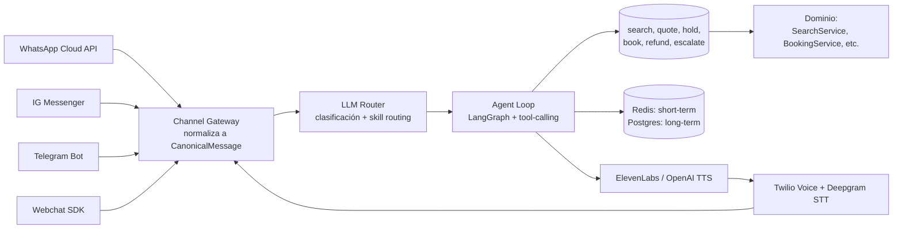
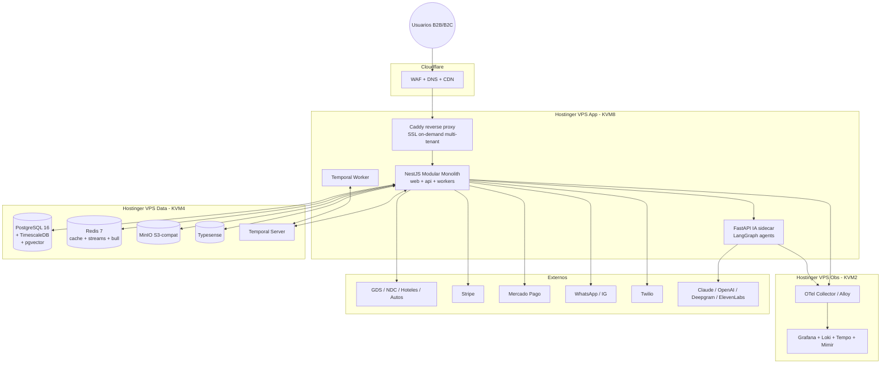
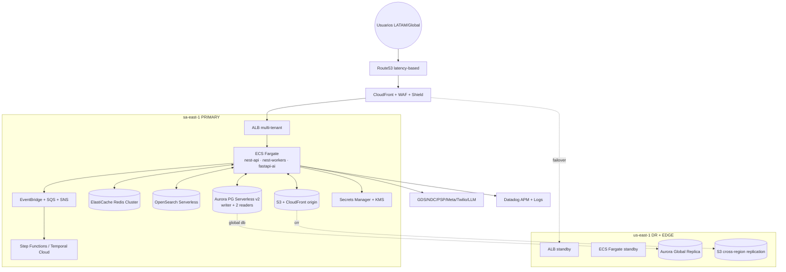

# Arquitectura de Referencia: Plataforma Consolidadora de Turismo B2B/B2C LATAM

> **Nota de fuente:** Reporte generado por agente de investigación con conocimiento de entrenamiento (cutoff enero 2026). Pricing AWS y de SaaS son orientativos. Validar con quotes reales antes de presupuestar.

Fecha: 2026-04-24

---

## Resumen Ejecutivo

Diseñar para Hostinger VPS hoy y AWS mañana exige una sola disciplina: **escribir código que no sepa dónde corre**. Toda la propuesta gira alrededor de tres principios:

1. **Modular Monolith con bounded contexts** (no microservicios prematuros) desplegable como múltiples procesos cuando llegue el dolor.
2. **Hexagonal + Anti-Corruption Layer (ACL)** para que GDS, NDC, hoteleros, pagos y mensajería sean intercambiables.
3. **Abstracciones de infra desde el día 1** (storage, queue, secrets, cache, auth, observability) detrás de interfaces que en fase 1 apuntan a binarios self-hosted y en fase 2 a servicios gestionados de AWS.

---

## 1. Arquitectura de Referencia para Travel-Tech

### 1.1 Patrones probados en consolidadores reales

Los consolidadores serios (Hotelbeds, Travelfusion, Travix, Despegar internamente) convergen en una arquitectura **event-driven con bounded contexts** alrededor del *itinerary lifecycle*: `Search → Quote → Hold → Book → Ticket/Voucher → PostSale → Refund/Void`. Cada estado emite eventos de dominio (`OfferSelected`, `BookingConfirmed`, `TicketIssued`, `RefundRequested`) que alimentan proyecciones (analítica, contabilidad, notificaciones) sin acoplamientos sincrónicos.

**Recomendación arquitectónica:** **Modular Monolith hexagonal** (a la Shopify, GitHub, Basecamp) con **event bus interno** (in-process + outbox a Redis Streams). Razones:

- 500 reservas/día = ~21 reservas/hora. Microservicios añaden latencia distribuida sin beneficio real a esa escala.
- Cuando llegue 5000 reservas/día (~200/hora pico), los módulos `search`, `booking`, `payments`, `messaging`, `accounting` ya estarán delimitados y se pueden extraer como servicios **sin refactor de dominio**, solo cambiando el transporte (in-process call → HTTP/gRPC + event sourcing).
- El equipo en fase 1 es pequeño; un monolito modular se debuggea, despliega y razona mejor.

### 1.2 Inventory Aggregation con modelos heterogéneos

Cada proveedor (Amadeus, Sabre, Travelport, LATAM NDC, HotelDo, Mevuelo, etc.) habla "su" idioma. La solución estándar:

```
Cliente → SearchOrchestrator → [N x ProviderAdapter (ACL)] → CanonicalOffer → Aggregator → Cache → UI
```

- **Canonical Domain Model** propio: `Offer`, `Itinerary`, `Segment`, `Fare`, `Pax`, `AncillaryRule`. *Nunca* exponer estructuras de proveedor al dominio.
- **ProviderAdapter** por proveedor implementa `ISearchProvider`, `IBookingProvider`, `IPostSaleProvider`. Traduce SOAP/XML/REST/GraphQL → modelo canónico.
- **Scatter-Gather** paralelo con `Promise.allSettled` y *deadline budget* (e.g. 4s para vuelos, 6s para hoteles). Lo que no llega en tiempo se descarta o se sirve "stale" desde cache.
- **Normalización fiscal y de fees** en el agregador (no en el adapter), para que los markups multi-tenant se apliquen consistentemente.

### 1.3 Cache Strategy

Búsquedas turísticas son volátiles pero costosas. TTL granular por categoría:

| Recurso | TTL | Key strategy |
|---|---|---|
| Búsqueda vuelos por OD+fecha | 2-5 min | `search:flights:{tenant}:{origin}:{dest}:{date}:{pax_hash}` |
| Búsqueda hoteles | 10-15 min | `search:hotels:{tenant}:{city}:{checkin}:{checkout}:{rooms_hash}` |
| Catálogo destinos/imágenes | 24h | `catalog:dest:{id}` |
| Tarifas de cambio | 1h | `fx:{base}:{quote}` |
| Disponibilidad puntual (post-click) | 30s o no-cache | `avail:{provider}:{offer_id}` |

**Patrón:** Redis con `SETEX` + *cache stampede protection* (`single-flight` lock por key) + *stale-while-revalidate* para UX. Revalidación en background con BullMQ.

### 1.4 Anti-Corruption Layer

Cada proveedor vive en su propio paquete `providers/{name}/` con:

```
providers/amadeus/
  ├── client/        (HTTP/SOAP cliente, manejo de tokens)
  ├── dto/           (tipos del proveedor)
  ├── mappers/       (proveedor → canónico y viceversa)
  ├── adapter.ts     (implementa interfaces de dominio)
  └── errors.ts      (mapea errores proveedor → dominio)
```

El dominio **nunca** importa de `providers/*`. La inyección se hace por configuración (`ProviderRegistry` resuelve el adapter activo por tenant/ruta).

---

## 2. Stack Tecnológico Recomendado

### 2.1 Backend

| Opción | Pros travel-tech | Contras |
|---|---|---|
| **NestJS (Node 20+)** | Ecosistema integrationes (npm), DX excelente, TypeScript end-to-end, ideal para I/O-bound (que es el 95% de travel) | CPU-bound (parsing XML masivo) menos eficiente que Go/Java |
| **FastAPI (Python)** | IA/ML nativo, libs maduras de NDC y GDS en Python | Async menos maduro que Node, GIL limita CPU |
| **Go** | Performance, baja memoria, perfecto para adapters de alto QPS | Ecosistema travel pobre, menos devs LATAM, DX más verboso |
| **Spring Boot (Java)** | Maduro en travel enterprise (Amadeus SDK oficial Java), tooling sólido | Mayor footprint, ciclo de desarrollo más lento, hostinger-unfriendly |

**Recomendación:** **NestJS como núcleo** + **FastAPI como sidecar de IA** (embeddings, orquestación de agentes, batch ML). Justificación: 80% del trabajo es I/O orquestando APIs externas, donde Node con `worker_threads` para parsing XML pesado es óptimo. NestJS aporta DI, módulos, decoradores y testing que mapean naturalmente al modular monolith hexagonal.

### 2.2 Frontend

**Next.js 15 (App Router) + React Server Components.** SvelteKit es más liviano pero el ecosistema travel (mapas, calendarios, date-pickers, i18n para 3 idiomas + RTL futuro, Stripe Elements) es masivamente React. Remix se fusionó en React Router v7; Next.js sigue siendo el default empresarial con mejor edge support para Cloudflare/CloudFront.

### 2.3 Móvil

**React Native + Expo (con prebuild)**. Justificación:
- **Code sharing** con web (modelos, validaciones zod, lógica de cotización).
- Offline-first viable con WatermelonDB o RxDB + sync.
- Vendedores en ruta necesitan compartir lógica de negocio idéntica a web.
- Flutter es técnicamente superior en performance gráfica, pero perderías reuso de tipos TS y devs full-stack.

### 2.4 Datos

- **PostgreSQL 16** como source of truth.
- **TimescaleDB** (extensión PG) para events, búsquedas, métricas de pricing y BI sin servidor adicional.
- **Redis 7** (cache + streams + rate-limit + sessions + pub/sub).
- **Search:** **Typesense** en fase 1 (single-binary, RAM-efficient, ideal para catálogos de destinos y hoteles hasta ~5M docs). Migración a **OpenSearch** en AWS si llega multi-region search complejo.
- **Object storage:** MinIO en Hostinger → S3 en AWS (mismo SDK).

### 2.5 Queues y Workflows

- **BullMQ** (Redis) para jobs cortos: emails, webhooks, sync de cache, reintentos de notificación.
- **Temporal.io self-hosted** (Docker en VPS, ~1GB RAM) para **flujos largos críticos**: reserva multi-proveedor con compensación (saga), conciliación de pagos, tickets pendientes de emisión, reembolsos asíncronos.

Temporal es no-negociable para travel: una reserva puede tardar minutos en confirmar (NDC), requerir compensación si pago falla tras hold, y necesitar retries con visibilidad. BullMQ no resuelve sagas; RabbitMQ/Kafka requieren que tú implementes la máquina de estados. Temporal te da *durable execution* gratis.

### 2.6 Resumen del Stack

```
Backend principal:   NestJS 10 + TypeScript 5 (Node 20 LTS)
IA sidecar:          FastAPI + Pydantic v2 + LangGraph
Frontend web:        Next.js 15 (App Router, RSC)
Mobile:              React Native + Expo SDK 52
DB:                  PostgreSQL 16 + TimescaleDB
Cache/Queues:        Redis 7 (Cluster en fase 2)
Search:              Typesense → OpenSearch
Workflows:           Temporal.io self-hosted → Temporal Cloud
Object storage:      MinIO → S3
ORM:                 Prisma (CRUD) + Kysely (queries complejas)
Validación:          Zod (compartido web/mobile/back)
Auth:                BetterAuth/Lucia → Cognito o Clerk
Observabilidad:      OpenTelemetry → Grafana stack → Datadog (fase 2)
```

---

## 3. Multi-Tenancy

### 3.1 Estrategia de aislamiento de datos

| Estrategia | Aislamiento | Costo | Complejidad migración | Recomendación |
|---|---|---|---|---|
| Shared DB + `tenant_id` + RLS | Lógico (Postgres Row-Level Security) | Bajo | Trivial | **Fase 1 default** |
| Schema-per-tenant | Medio | Medio (cada migración × N) | Compleja | Solo si tenant exige por contrato |
| DB-per-tenant | Físico | Alto | Cara | Tenants enterprise top-tier |

**Recomendación:** Modelo **híbrido**: shared DB con `tenant_id` + **PostgreSQL RLS forzada** (`FORCE ROW LEVEL SECURITY`) + `SET app.current_tenant` por request en un middleware. Para tenants enterprise (>1000 reservas/mes) ofrecer plan premium con DB dedicada. Esto se logra abstrayendo el `DataSourceResolver(tenant)` desde día 1.

### 3.2 White-label: dominios, SSL y branding

- **DNS:** tenant agrega `CNAME` a `tenants.tu-plataforma.com`. Detectas el host en un middleware y resuelves tenant.
- **SSL:** **Caddy server** como reverse proxy delante de Node. Caddy emite certificados Let's Encrypt automáticamente bajo demanda (`on-demand TLS`) con validación contra tu API (`ask` endpoint que confirma "este host es tenant válido"). Cero ops. En AWS migras a **CloudFront + ACM con SAN dinámico** o **CloudFront multi-tenant distribution** (GA 2024).
- **Theming engine:** tokens de diseño en JSON (`colors`, `typography`, `logo_url`, `favicon_url`) servidos como CSS variables inyectadas en `<head>` por SSR. Nunca rebuilds por tenant.
- **Assets:** bucket por convención (`tenants/{slug}/...`) en MinIO/S3 detrás de CDN.

---

## 4. Diseño Cloud-Ready en Hostinger

### 4.1 Las 8 abstracciones obligatorias del día 1

Cada una vive como interface en `core/ports/` con dos implementaciones:

| Port | Hostinger (fase 1) | AWS (fase 2) |
|---|---|---|
| `IObjectStorage` | MinIO (S3 SDK) | S3 |
| `IQueue` | Redis Streams + BullMQ | SQS / EventBridge |
| `ISecretStore` | `.env` cifrado + sealed-secrets en repo | Secrets Manager / Parameter Store |
| `IEmail` | Resend / Postmark | SES (o seguir Resend) |
| `IPushNotifications` | Expo Push | SNS + Expo |
| `ICache` | Redis local | ElastiCache |
| `IAuth` | BetterAuth/Lucia (PG-backed) | Cognito / Clerk |
| `IObservability` | OpenTelemetry → Grafana stack | OTel → Datadog o ADOT |
| `IFeatureFlags` | Unleash self-hosted | Unleash o LaunchDarkly |

**Regla de oro:** ningún módulo de dominio importa AWS-SDK ni Redis directamente. Solo `core/ports/*`.

### 4.2 Observabilidad

Fase 1: **OpenTelemetry SDK** + **Grafana stack** (Loki logs, Tempo traces, Mimir metrics, Alloy collector) en VPS aparte. Cuesta ~$15/mes, es portable. Fase 2: mismo SDK, cambias el `OTLP exporter endpoint` a Datadog o ADOT en AWS. Cero refactor de código.

---

## 5. Orquestación IA Omnicanal

### 5.1 Patrón general



### 5.2 Multi-LLM Router

Router por intención + costo + latencia:

| Tarea | Modelo | Razón |
|---|---|---|
| Clasificación de intención, extracción de entidades | GPT-4o-mini / Haiku 4.5 | Latencia <300ms, $0.15/1M tokens |
| Conversación general, multi-turno | Claude Sonnet 4.5 | Mejor instrucción + tool-use |
| Razonamiento complejo (cotizaciones multi-tramo, políticas tarifarias) | Claude Opus 4.7 | Mejor planificación |
| Voz tiempo real | OpenAI Realtime / Gemini Live | Streaming bidireccional |
| Embeddings | `text-embedding-3-small` o `voyage-3` | Semantic search de catálogo |

Implementar como `ILLMProvider` con fallback chain (`primary → secondary → cached_response`). Usar **LiteLLM** o gateway propio para abstracción.

### 5.3 State Management

- **Short-term (turno actual):** Redis con TTL de 1h, key `conv:{tenant}:{channel}:{user_id}`.
- **Long-term (perfil cliente, historial reservas, preferencias):** Postgres con embeddings en `pgvector`.
- **Tool execution log:** event sourcing en TimescaleDB (`agent_events` hypertable) para auditoría y mejora.

### 5.4 Conectores

- **WhatsApp:** Cloud API oficial de Meta (no third-parties que se rompen). Webhook → Channel Gateway.
- **Voz:** Twilio Programmable Voice + media streams a Deepgram (STT) y ElevenLabs Flash v2.5 (TTS, ~75ms latency). Para LATAM, Deepgram Nova-3 maneja español neutro y portugués brasileño bien.
- **IG/FB:** Messenger Platform API.
- **Webchat:** SDK propio embed-able (iframe + postMessage), reusa el Channel Gateway.

---

## 6. Pagos y Conciliación

### 6.1 Stripe Connect + Mercado Pago Marketplace simultáneos

Modelo de dominio independiente del PSP:

```
PaymentIntent (interno)
  ├── psp: 'stripe' | 'mercadopago'
  ├── psp_intent_id
  ├── tenant_id (subcuenta Connect / collector_id MP)
  ├── amount, currency, fees_breakdown
  └── status: requires_action|processing|succeeded|failed|refunded
```

- **Stripe Connect Express** para tenants con cuenta Stripe (mejor en Brasil/global).
- **Mercado Pago Marketplace** con `application_fee` para Colombia/Perú donde MP es dominante.
- **Routing por tenant + país + moneda**: el `PaymentRouter` decide el PSP en función de `tenant.preferred_psp`, BIN del tarjetahabiente, costo de procesamiento y disponibilidad.
- Webhooks normalizados a eventos de dominio (`PaymentAuthorized`, `PaymentCaptured`, `PaymentRefunded`, `ChargebackOpened`).

### 6.2 Conciliación

Job nocturno con Temporal:
1. Descarga payouts/settlements de Stripe (Reports API) y MP (Payments API + Releases).
2. Match con `payment_intents` internos por `psp_intent_id`.
3. Calcula deltas (fees reales vs estimados, FX, retenciones).
4. Genera asientos contables en módulo propio (partida doble: `Cuenta por cobrar PSP` ↔ `Ingresos` + `Comisiones` + `Impuestos`).
5. Reporte de excepciones para finanzas.

### 6.3 Reembolso "anticipado" (cliente vs proveedor)

Patrón de **doble libro**:
- Crédito al cliente desde tu *balance* (refund inmediato).
- `RefundReceivable` registrado contra el proveedor (aerolínea).
- Saga Temporal monitorea hasta cobrar al proveedor (puede tardar 60-120 días en aerolíneas).
- Política de riesgo por tenant: solo reembolso anticipado si `chargeback_risk < threshold` y `provider_refund_history > 0.9`.

---

## 7. Compliance y Seguridad

### 7.1 PCI-DSS SAQ-A en Hostinger

SAQ-A aplica si **nunca tocas datos de tarjeta** (Stripe Hosted Checkout y MP Checkout Pro cumplen via redirect/iframe servido por el PSP). Requisitos clave:

- Página de checkout servida via HTTPS.
- No loguear, almacenar ni proxiar PAN, CVV ni datos sensibles.
- Política de seguridad documentada, revisión anual.
- Gestión de proveedores PCI compliant (Stripe ✓, MP ✓, Hostinger declara compliance de infra).
- Escaneo ASV trimestral (puedes usar Trustwave o similar, ~$200/año).
- AOC (Attestation of Compliance) firmado y disponible para tenants.

### 7.2 Cifrado en Postgres Hostinger

Hostinger VPS no provee TDE nativo. Mitigaciones:
- **At-rest:** cifrado a nivel de columna para PII sensible (documentos, fecha nacimiento, teléfono) usando `pgcrypto` con clave en vault (no en DB). Backups cifrados con `gpg` antes de subir a MinIO/B2.
- **In-transit:** Postgres con `ssl=on` y `sslmode=verify-full`, cert propio o Let's Encrypt.
- En AWS: RDS con KMS (transparente) + IAM auth.

### 7.3 Auditoría y trazabilidad

**Event sourcing parcial:** todas las operaciones financieras y de reserva escriben a `domain_events` (TimescaleDB hypertable, append-only, particionado por mes). El estado actual vive en tablas relacionales (CRUD), pero el log es la fuente de verdad legal. Esto cubre Ley de Habeas Data (Colombia), LGPD (Brasil), Ley 29733 (Perú).

### 7.4 Hardening VPS

Checklist obligatorio:
- UFW: solo 22 (rate-limited), 80, 443.
- SSH: deshabilitar root login, solo claves Ed25519, puerto custom, fail2ban (bantime 1h, maxretry 3).
- Usuario non-root con sudo, `auditd` activo.
- Actualizaciones automáticas de seguridad (`unattended-upgrades`).
- Cloudflare como WAF (rate limiting, bot fight mode, OWASP rules).
- Docker rootless donde posible.
- Secrets vía `sops` + age, nunca en git plano.
- Backups automáticos cifrados a Backblaze B2 (multi-región, $6/TB).
- IDS ligero: `wazuh-agent` o `osquery`.

---

## 8. Plan de Migración a AWS

### 8.1 Servicios target

| Componente | Servicio AWS | Justificación |
|---|---|---|
| Compute | **ECS Fargate** | Sin EKS overhead; tu monolito modular + sidecars caben perfecto. EKS solo si llegas a >50 servicios. |
| DB primaria | **Aurora PostgreSQL Serverless v2** | Auto-scale, Multi-AZ, replicas cross-region. |
| Cache | **ElastiCache Redis (cluster mode)** | Compatible con Redis 7. |
| Streams | **MSK Serverless** o **Kinesis** | MSK si ya usas Kafka; Kinesis para volumen menor. |
| Object | **S3** + **CloudFront** | Trivial desde MinIO. |
| Auth | **Cognito** o seguir con **Clerk** | Cognito barato; Clerk mejor DX. |
| API edge | **CloudFront + ALB** (skip API Gateway) | API Gateway caro a alto QPS. |
| Eventos | **EventBridge** | Reemplazo natural de Redis Streams cross-service. |
| Workflows | **Step Functions** o seguir con Temporal | Temporal Cloud es más portable. |
| Search | **OpenSearch Serverless** | Si Typesense no escala. |
| Secrets | **Secrets Manager** + **Parameter Store** | Rotación automática. |
| Observabilidad | **Managed Grafana + Prometheus** o Datadog | OTel ya está en código. |

### 8.2 Estrategia: Re-platform incremental

Lift-and-shift es trampa: heredas malas decisiones. Re-platform módulo a módulo:

1. **Semana 1-2:** Aurora migration (DMS desde PG Hostinger), ElastiCache, S3 (sync MinIO), CloudFront. App sigue en Hostinger leyendo Aurora vía VPN/PrivateLink.
2. **Semana 3-4:** Deploy ECS Fargate del monolito, traffic shifting con Route53 weighted (10/50/100).
3. **Semana 5-6:** EventBridge, Step Functions / Temporal Cloud, observabilidad.
4. **Semana 7-8:** Multi-región: réplica Aurora en `us-east-1` (DR + global edge para webchat), Route53 latency routing.

Tiempo total: 6-8 semanas con 2 ingenieros DevOps. Costo de migración (consultoría + horas internas + paralelo de infra): **~USD 25-40k**.

### 8.3 Multi-región

- **Primary:** `sa-east-1` (São Paulo) — latencia óptima para BR/CO/PE.
- **DR + edge:** `us-east-1` — Aurora Global Database (RPO < 1s, RTO < 1min), CloudFront global, fallback automático.
- Datos por residencia: tenants con requisito de soberanía (LGPD estricta) → bucket y RDS instance dedicado en `sa-east-1`, `replication: false`.

### 8.4 Estimaciones AWS

**Escenario A — 500 reservas/día (~año 1):**

| Servicio | Configuración | USD/mes |
|---|---|---|
| ECS Fargate | 4 tasks × 2vCPU/4GB, 24/7 | 175 |
| Aurora Serverless v2 | 0.5–4 ACU + storage 100GB | 280 |
| ElastiCache Redis | cache.t4g.medium × 2 | 110 |
| S3 + CloudFront | 500GB + 2TB egress | 200 |
| OpenSearch Serverless | 2 OCU baseline | 360 |
| EventBridge + Step Functions | Volumen moderado | 50 |
| Cognito | 50k MAU | 275 |
| Secrets Manager + KMS | 50 secrets | 30 |
| Managed Grafana + Prometheus | base | 120 |
| Data transfer + NAT GW | promedio | 200 |
| Backups + snapshots | retención 30d | 80 |
| **Total estimado** | | **~USD 1,880/mes** |

**Escenario B — 5000 reservas/día (~año 2):**

| Servicio | Configuración | USD/mes |
|---|---|---|
| ECS Fargate | 12 tasks × 4vCPU/8GB + autoscale | 1,400 |
| Aurora Serverless v2 + replicas | 2–16 ACU, 1 reader | 1,800 |
| ElastiCache Cluster | r7g.large × 3 | 700 |
| S3 + CloudFront | 5TB + 20TB egress | 1,900 |
| OpenSearch | 6 OCU + storage | 1,100 |
| EventBridge + Step Functions | 10× volumen | 400 |
| Cognito | 250k MAU | 1,200 |
| Multi-región (Aurora Global, CF) | replica `us-east-1` | 1,500 |
| Observability (Datadog full) | 30 hosts + APM | 1,200 |
| Data transfer + NAT GW | inter-AZ + cross-region | 900 |
| WAF + Shield Advanced (opcional) | | 300 |
| Backups | | 250 |
| **Total estimado** | | **~USD 12,650/mes** |

Optimizaciones aplicables: Savings Plans (-25%), Graviton (-20% en compute), reserved capacity OpenSearch (-30%). Realista post-optimización: **~USD 9,500/mes** en escenario B.

### 8.5 Estimación Hostinger Fase 1

| Componente | Configuración | USD/mes |
|---|---|---|
| Hostinger KVM 8 (app principal) | 8vCPU/32GB/400GB NVMe | 30 |
| Hostinger KVM 4 (DB + Redis) | 4vCPU/16GB/200GB | 18 |
| Hostinger KVM 2 (observability + workers) | 2vCPU/8GB | 10 |
| Cloudflare Pro | WAF + analytics | 25 |
| Backblaze B2 (backups) | 500GB | 3 |
| Resend / Postmark | 50k emails | 20 |
| Twilio (voz + WhatsApp) | uso bajo | 100 |
| Dominio + certificados | (Let's Encrypt gratis) | 5 |
| Sentry / OTel cloud (opcional) | tier dev | 30 |
| ASV scan PCI | trimestral prorrateado | 20 |
| **Total estimado** | | **~USD 260/mes** |

---

## 9. CI/CD y Entornos

- **GitHub Actions** (mejor integración con tu PR workflow). Reusable workflows + composite actions por stack.
- Entornos: `dev` (rama `develop`, deploy continuo), `staging` (rama `main`, manual approval, datos sintéticos + sandbox de PSPs), `prod` (release tags, approval doble).
- **Feature flags:** **Unleash self-hosted** (fase 1, $0) → mismo Unleash en EKS o Flagsmith Cloud (fase 2). Toggles obligatorios para cada nuevo proveedor (kill-switch instantáneo cuando un GDS se cae).
- **Deploy:** **Blue-green** via Caddy/nginx upstream switch en fase 1; **canary 5/25/100** con CodeDeploy + ECS en fase 2.
- **Migrations:** Prisma Migrate con `--create-only` + revisión humana, nunca `db push` en prod.
- **DB seeds y test data:** Snapshots scrubbed para staging.

---

## 10. Diagramas de Arquitectura

### Fase 1 — Hostinger



### Fase 2 — AWS Multi-Región



---

## 11. Riesgos Arquitectónicos y Mitigaciones

| # | Riesgo | Probabilidad | Impacto | Mitigación |
|---|---|---|---|---|
| 1 | Caída de un GDS durante pico (Amadeus/Sabre) | Alta | Alto | Multi-provider con failover automático, circuit breaker (opossum), cache stale-while-revalidate, kill-switch por feature flag |
| 2 | Stripe/MP webhooks duplicados o perdidos | Media | Alto | Idempotency keys, outbox pattern, conciliación nocturna independiente, alertas de drift |
| 3 | Escalado de Hostinger antes de migrar | Alta | Alto | Plan claro de gates: >70% CPU sostenido o >300 reservas/día acelera migración. Dry-run de Aurora desde mes 4 |
| 4 | Filtración de datos cross-tenant | Baja | Crítico | RLS forzada, tests de aislamiento en CI, fuzz testing con tenant rotation |
| 5 | Deuda en ACL (acoplamiento a un proveedor) | Media | Alto | Code review específico para `providers/*`, tests de contrato canónico, ningún tipo de proveedor en `core/` |
| 6 | LLM cost runaway (loops infinitos de tool-calling) | Media | Medio | Hard limits por conversación (max tokens, max steps), budget por tenant, observabilidad de cost por convo |
| 7 | Compliance fiscal multi-país (e-invoicing CO/BR/PE) | Alta | Alto | Adapter por país (DIAN, NF-e, SUNAT), partner local de e-invoicing (Sovos, Edicom), no construir in-house |
| 8 | Onboarding de proveedor lento (semanas de SOAP) | Alta | Medio | Plantilla scaffold para nuevo provider, sandbox antes de prod, contratos de prueba con cada proveedor |
| 9 | Soporte 24/7 desde día 1 | Alta | Alto | PagerDuty/Opsgenie + runbooks por incidente, partner BPO LATAM nivel 1, equipo interno solo nivel 2/3 |
| 10 | Vendor lock con Cloudflare/Hostinger | Baja | Medio | DNS portable, código sin dependencias propietarias, IaC con Terraform desde día 1 |

---

## 12. Lista Final de Abstracciones Cloud-Ready (Día 1)

1. `IObjectStorage` — wrapper sobre S3 SDK (apunta a MinIO).
2. `IQueue` y `IEventBus` — interfaces genéricas, impl Redis Streams + BullMQ.
3. `ISecretStore` — `.env` + sops + age en fase 1.
4. `ICache` — Redis con namespace por tenant.
5. `IEmail`, `ISMS`, `IPush` — providers intercambiables.
6. `ISearchIndex` — Typesense → OpenSearch sin tocar dominio.
7. `IAuth` — sesión, JWT, OAuth, MFA detrás de interfaz.
8. `IObservability` — solo OTel, nunca SDK propietario.
9. `IFeatureFlags` — Unleash via SDK estándar.
10. `IPaymentProcessor` — Stripe y MP detrás del mismo contrato.
11. `IMessagingChannel` — WhatsApp/IG/TG/Web/Voz unificados como `CanonicalMessage`.
12. `ILLMProvider` — multi-modelo via LiteLLM o gateway propio.
13. `IFileSigner` — URLs firmadas portables.
14. `IClock` y `IIdGenerator` — testabilidad y portabilidad.
15. **Terraform desde día 1** — incluso para Hostinger (DNS, Cloudflare, scripts de provisioning).

---

## 13. Conclusión

La diferencia entre una plataforma turística que sobrevive 5000 reservas/día y una que colapsa no es el cloud, sino las **fronteras de dominio bien dibujadas y las abstracciones de infra disciplinadas**. Si arrancas en Hostinger respetando las 15 abstracciones listadas, escribes hexagonal con ACL por proveedor, usas Temporal para sagas y eventos para auditoría, la migración a AWS será un ejercicio de DevOps de 6-8 semanas, no una reescritura.

**Costos consolidados:**
- **Fase 1 (Hostinger + Cloudflare + SaaS mínimos):** ~USD 260/mes infra + ~USD 100-300/mes uso variable (Twilio/LLM/email).
- **Fase 2 año 1 (AWS, 500 res/día):** ~USD 1,880/mes optimizado.
- **Fase 2 año 2 (AWS, 5000 res/día):** ~USD 9,500-12,650/mes según optimizaciones.

**Próximos pasos recomendados (semanas 1-4):**
1. Setup repo monorepo (Turborepo), módulos `core`, `providers`, `apps/api`, `apps/web`, `apps/mobile`.
2. Definir `core/ports` con las 15 interfaces.
3. Implementar 1 provider GDS end-to-end (e.g. Amadeus self-service) para validar ACL.
4. Setup Hostinger con Caddy on-demand TLS y primer tenant white-label.
5. Stripe Hosted Checkout + MP Checkout Pro detrás de `IPaymentProcessor`.
6. Temporal local + primera saga (booking con compensación).
7. CI/CD GitHub Actions con dev/staging/prod.
8. PCI SAQ-A documentación y primer ASV scan.
