# Gestión de reserva en Sabre: `getBooking`, `modifyBooking`, `cancelBooking`

Alcance: área 05 — recuperación, modificación y cancelación. No cubre `createBooking`,
`fulfillFlightTickets` ni `void/refundFlightTickets` (áreas 04, 06, 07).

## 0. Cómo leer este documento

Marcado según `00-fuentes.md` §4: **VERIFICADO** (de la colección), **VERIFICADO-SPEC** (del
contrato OpenAPI o de la documentación oficial), **[INFERIDO]**, **DESCONOCIDO**.

> **Cambio de estado respecto de la primera pasada.** La primera pasada se escribió sin los
> contratos oficiales y por eso su regla operativa era *"ningún mapper de respuesta se escribe
> contra este documento"*. **Esa regla ya no aplica a la forma.** Con `booking-management-v1.yml`
> (Swagger 2.0, v1.33, 274 definiciones) y las 81 páginas de documentación oficial tenemos el
> contrato completo de las tres operaciones, incluidos el árbol `Booking` entero y las listas
> exhaustivas de errores. Lo que **sigue faltando** es evidencia de *comportamiento* real en CERT:
> qué secciones se pueblan realmente por tipo de contenido, qué warnings salen en la práctica, y
> los tiempos. La regla revisada: **se pueden escribir los mappers contra el spec; hay que validar
> los tests de contrato contra capturas de CERT antes de producción.**

**Métricas duras de la colección** (contadas programáticamente sobre `requests.jsonl`):

| Métrica | Valor |
| --- | --- |
| Requests totales | 1.077 |
| Requests a `getBooking` | 204 |
| Requests a `modifyBooking` | 105 |
| Requests a `cancelBooking` | 43 |
| Requests dentro de la carpeta `ModifyBooking (various workflows)` | 690 |
| …de ellas, a `{{soap_endpoint}}` | **201** (ver §6) |
| `modifyBooking` que envían `bookingSignature` | 105 / 105 (100 %) |
| `modifyBooking` precedidos por un `getBooking` en las 7 requests anteriores | 105 / 105 (100 %) |
| `modifyBooking` que envían `cardSecurityCode` | 21 / 105 |
| `modifyBooking` / `getBooking` que envían `targetPcc` | **0 / 105** y **0 / 204** |
| `modifyBooking` / `getBooking` que envían `extraFeatures` | **0 / 105** y **0 / 204** |
| Respuestas de ejemplo guardadas en toda la colección | 4 (todas de `/v1/orders/view`, 16.479 B cada una) |

> **Corrección de procedencia.** La primera pasada afirmó en varios puntos que las 4 respuestas
> guardadas "están vacías". **Es falso.** Tienen cuerpo completo y están extraídas en
> `slices/responses/*.json`. Son la única evidencia de forma de respuesta que salió de la
> colección y se explotan en §11.

---

## 1. Superficie del API y contexto de llamada

**VERIFICADO-SPEC** — `booking-management-v1.yml:1-38`: Swagger 2.0, `info.version: '1.33'`,
`host: api.cert.platform.sabre.com`, `basePath: /v1/trip/orders`, `schemes: [https]`,
`consumes/produces: application/json`. Seguridad: `oauth2_authentication`, `flow: application`
(client credentials), `tokenUrl: https://api.cert.platform.sabre.com/v2/auth/token`,
`x-base64-encode-client-credentials: true`.

| Operación | Ruta (`booking-management-v1.yml`) | operationId |
| --- | --- | --- |
| Recuperar reserva | `POST /v1/trip/orders/getBooking` (`:165`) | `getBooking` |
| Modificar reserva | `POST /v1/trip/orders/modifyBooking` (`:214`) | `modifyBooking` |
| Cancelar reserva | `POST /v1/trip/orders/cancelBooking` (`:39`) | `cancelBooking` |

**VERIFICADO** — La colección declara auth bearer a nivel raíz con `{{token}}`, obtenido de
`POST {{rest_endpoint}}/v2/auth/token` (`Content-Type: application/x-www-form-urlencoded`,
`Authorization: Basic {{secret}}`, body `grant_type=client_credentials`; fuente:
`Authentication / REST Authorize`). Es el **mismo patrón OAuth client_credentials** que ya
implementamos en `providers/latam-ndc/src/auth/token.service.ts`.

### 1.1 Solo existe HTTP 200 — el error viaja en el cuerpo

**VERIFICADO-SPEC** — las tres operaciones declaran **una sola** respuesta, `'200': Successful
response` (`booking-management-v1.yml:58-62`, `:184-188`, `:233-237`). No hay 4xx ni 409 en el
contrato. Corroborado por la colección (**VERIFICADO**): incluso los requests llamados
`ModifyBooking - throws error but works and adds infant` y `ModifyBooking - returns error but work`
asertan `pm.response.to.have.status(200)` y `pm.response.to.be.json`.

> Esto responde la pregunta abierta nº 15 de la primera pasada y **condiciona el cliente HTTP**:
> el adapter de Sabre **no puede** decidir éxito/fracaso por código HTTP. La decisión se toma
> leyendo `errors[]` y clasificando por `category` (§9). Un cliente que trate 200 como éxito
> silencioso se comerá cancelaciones fallidas sin enterarse.

### 1.2 Stateless por diseño, ATK o ATH indistintamente

**VERIFICADO-SPEC** (`help/booking-management-api-v1/help-documentation-get-booking.txt`,
`…-modify-booking-0.txt`, `…-cancel-booking.txt`, sección *Technical overview* de las tres):

> "This API is designed to operate in a stateless way, and accepts both sessionless (ATK) and
> session-based (ATH) tokens. When a call is made to this API via a session-based token, the
> session (AAA) is cleared before and after execution."

Es decir: **las tres operaciones REST no necesitan sesión**, y si se les pasa un token ATH la
propia API limpia la sesión antes y después. Esto es la base de la refutación del §6.

Internamente sí orquestan servicios LLS/SOAP, pero eso es responsabilidad de Sabre, no nuestra
(**VERIFICADO-SPEC**, secciones *Internal orchestration*):

| Operación | Servicios que orquesta por dentro |
| --- | --- |
| `getBooking` | `GetReservationRQ`, Order Management, `VerifyFlightDetailsLLSRQ`, `OTA_VehLocDetailLLSRQ`, `StructureFareRulesRQ`, `GetAncillaryOffersRQ`, `TKT_ElectronicDocumentServicesRQ`, Leg Detection |
| `modifyBooking` | `ContextChangeLLSRQ`, `AirSeatLLSRQ`, `AirSeatCancelLLSRQ`, `GetReservationRQ`, `UpdateReservationRQ`, `EnhancedEndTransactionRQ`, Order Management |
| `cancelBooking` | `ContextChangeLLSRQ`, `DesignatePrinterLLSRQ`, Order Management, `GetReservationRQ`, `OTA_CancelLLSRQ`, `UpdateReservationRQ`, `EnhancedEndTransactionRQ`, `SabreCommandLLSRQ`, `QueuePlaceLLSRQ`, `FullCancelDeleteRQ` |

**Consecuencia de arquitectura:** una llamada REST nuestra dispara entre 2 y 9 llamadas internas de
Sabre. Eso explica por qué `returnOnly` da un "significant performance boost" (§2.2) y por qué el
presupuesto de latencia de estas operaciones no se parece al de una búsqueda.

### 1.3 Cabeceras `X-Sabre-Group` / `X-Sabre-Current-City` — resuelto

**VERIFICADO** — cabeceras observadas en los 352 requests de estos tres endpoints:

| Header | Ocurrencias | Comentario |
| --- | --- | --- |
| `Content-Type: application/json` | 352 | siempre |
| `accept: application/json` | 303 | |
| `X-Sabre-Group` | 181 | valores vistos: `U9PK` (138), `G7RE` (76) |
| `X-Sabre-Current-City` | 181 | mismos valores, siempre igual a `X-Sabre-Group` en la colección |
| `Conversation-ID: {{conv_id}}` | 49 | trazabilidad |

La primera pasada marcó su significado como [INFERIDO]. **Ahora es VERIFICADO-SPEC**
(`help/booking-management-api-v1/help-documentation-create-booking-error-list.txt:1170`):

```
HEADER_DATA_MISSING_TARGET_PCC | BAD_REQUEST |
Target PCC was defined but header data is missing.
Please complete X-Sabre-Group (ATK) or X-Sabre-Current-City (ATH).
```

Lecturas duras:

1. Son el **PCC de contexto**, y son **obligatorias cuando se envía `targetPcc`**.
2. **Cuál de las dos se manda depende del tipo de token**: `X-Sabre-Group` con ATK (sessionless),
   `X-Sabre-Current-City` con ATH (session-based). La colección manda las dos siempre con el mismo
   valor, que es la vía segura y la que copiaremos.
3. Que la colección alterne `U9PK` y `G7RE` sobre el mismo PNR ya no es un misterio: es el juego
   normal de PCC de origen/destino en escenarios `targetPcc`, no una capacidad mágica de
   lectura cruzada. **Lo que sigue sin verificar es qué autorización hace falta**: el error
   `UNABLE_TO_CHANGE_CONTEXT_UNAUTHORIZED` existe en las tres listas de errores, luego el cambio de
   PCC está sujeto a permisos del EPR. Sigue abierto para el modelo consolidador (§Preguntas).

---

## 2. `getBooking` — contrato completo

### 2.1 Request

**VERIFICADO-SPEC** — `GetBookingRequest` (`booking-management-v1.yml:240-293`). Único campo
obligatorio: `confirmationId`.

| Campo | Tipo / patrón | Notas |
| --- | --- | --- |
| `confirmationId` **(req.)** | `string`, `^[A-Z0-9]{6,}$` | PNR Locator **o Sabre Order ID**. El patrón es `6 o más`, no exactamente 6: un order id NDC de 32 hex también entra. |
| `bookingSource` | enum `SABRE` \| `SABRE_ORDER` (`:9041`) | Default `SABRE`. |
| `targetPcc` | `string`, `^[A-Z0-9]{3,4}$` | Cambia el contexto de PCC. |
| `givenName`, `middleName` | `string` | El spec los marca `#source: Unused`. |
| `surname` | `string` | **Sí se usa**: `#source: Used for first line validation. If @surname ... is different than in @confirmationId, UNAUTHORIZED_ACCESS error is returned.` Es un control de acceso ligero: útil para un portal B2C donde el pasajero teclea su apellido. |
| `returnOnly` | array de `ReturnOnlyEnum` | Proyección. Vacío o ausente ⇒ estructura completa. |
| `extraFeatures` | `ExtraFeatures` (`:7401`) | Ver §2.3. |
| `unmaskPaymentCardNumbers` | `boolean` | Desenmascara tarjetas. **Requiere el keyword `CCVIEW` en el EPR.** |

### 2.2 `returnOnly` — los 31 valores

La primera pasada solo conocía `FLIGHTS`, `HOTELS`, `TICKETS` y marcaba `CARS` como DESCONOCIDO.
**VERIFICADO-SPEC** — `ReturnOnlyEnum` (`booking-management-v1.yml:9049-9088`) tiene 31 valores:

```
FLIGHTS · FLIGHT_PENALTY · BAGGAGE_POLICY · JOURNEYS · HOTELS · HOTEL_ADDRESS
CARS · CAR_RENTAL_ADDRESS · CAR_RENTAL_PENALTY · TRAINS · CRUISES · ALL_SEGMENTS
TRAVELERS · TICKETS · PAYMENTS · PENALTIES · REMARKS · IS_CANCELABLE · IS_TICKETED
CONTACT_INFO · OTHER_SERVICES · SPECIAL_SERVICES · FARES · CREATION_DETAILS
ANCILLARIES · FORMS_OF_PAYMENT · RETENTION_DATE · ACCOUNTING_ITEMS
NON_ELECTRONIC_TICKETS · TRAVELERS_EMPLOYERS · PROFILES
```

Sí existe `CARS` (pregunta abierta nº 3 de la primera pasada: **resuelta**).

**Semántica: VERIFICADO-SPEC, ya no [INFERIDO].** Es una proyección real y además un optimizador de
orquestación: *"The returnOnly option may cause the application to exclude or simplify calls of
downline APIs, which usually results in a significant performance boost"*
(`help-documentation-get-booking.txt`). El ejemplo oficial con `returnOnly: ["TICKETS"]`
(`help-documentation-get-booking-examples.txt:70-120`) devuelve un documento cuya única clave de
nivel raíz es `flightTickets[]`.

> ### La trampa de `returnOnly` — confirmada por el fabricante
> **VERIFICADO-SPEC** (`help-documentation-modify-booking-0.txt`):
> *"To obtain a valid bookingSignature value, you must make a Get Booking call **without** the
> returnOnly parameter."*
>
> Esto era la pregunta abierta nº 2 de la primera pasada y ahora es un **hecho de diseño**:
> **la lectura filtrada NO sirve como paso previo de un `modifyBooking`.** De aquí sale una regla
> dura para el ACL: dos rutas físicamente distintas, `retrieveForDisplay()` (con `returnOnly`,
> barata, cacheable) y `retrieveForModification()` (sin `returnOnly`, cara, nunca cacheada).
> Ver §12 y Riesgo 8.

### 2.3 `extraFeatures` — el detalle que rompe la firma

**VERIFICADO-SPEC** — `ExtraFeatures` (`:7401`) = `CommonExtraFeatures` (`:7420`) más dos campos:

| Flag | Default | Qué hace | Dónde vale |
| --- | --- | --- | --- |
| `returnFrequentRenter` | `false` | Habilita el tipo de fidelización `FREQUENT_RENTER`. | get + modify |
| `returnWalletFormsOfPayment` | `false` | Habilita las FOP `DOCKET`, `GOVERNMENT_TRAVEL_REQUEST`, `INVOICE`, `ON_ACCOUNT`. | get + modify |
| `returnFiscalId` | `false` | Habilita el documento de identidad `FISCAL_ID`. | get + modify |
| `returnEmptySeatObjects` | **`true`** | Si `true`, la falta de asiento se marca como objeto `Seat` vacío; si `false`, se sustituye por null. Solo NDC. | **solo get** |
| `forceHotelUpdate` | `false` | Fuerza refresco del estado del hotel contra el proveedor. Aumenta la latencia. | **solo get** |

Tres consecuencias, todas VERIFICADO-SPEC y ninguna presente en la primera pasada:

1. **`extraFeatures` debe ser idéntico en el `getBooking` y en el `modifyBooking` siguiente.**
   `booking-management-v1.yml:884-889`: *"The same `extraFeatures` data should be sent in the
   preceding Get Booking request to avoid issues with `bookingSignature` verification."*
   Nuestro ACL debe llevar el juego de flags en el mismo objeto de contexto que el `versionToken`.
2. **Para NDC hay que pedir `returnEmptySeatObjects: false`** en el `getBooking` previo:
   *"Empty objects are not allowed within the Modify Booking service."* Con el default (`true`) el
   documento leído no es reenviable como `before`. Es un pie de banana garantizado.
3. **`returnWalletFormsOfPayment: true` es obligatorio** si queremos ver/mover FOP tipo `INVOICE`
   u `ON_ACCOUNT` — típicas de cuentas corporativas y de crédito de agencia, justo lo que el
   modelo consolidador va a necesitar.

`returnFiscalId` merece mirada aparte: es el documento de identidad fiscal, que en LATAM es
CPF/CNPJ (BR), RUC (PE) y NIT (CO). **Hay que activarlo siempre en nuestro perfil** o perdemos el
dato que necesita la facturación DIAN/SUNAT/NF-e.

### 2.4 Response

**VERIFICADO-SPEC** — `GetBookingResponse` (`:296-322`) es `allOf`:

```
GetBookingResponse = Booking  (todo el árbol, §3)
                   + timestamp: string(date-time)        // UTC, YYYY-MM-DDTHH:MM:SSZ
                   + bookingSignature: string            // ~128 hex
                   + request: GetBookingRequest          // eco del request
                   + errors: Error[]                     // ausente si todo fue bien
```

Nota del contrato sobre `bookingSignature`: *"Available only if obtaining the booking state does
not result in any errors."* Es decir: **un `getBooking` que devuelve `errors[]` puede no traer
firma**, y sin firma no hay modify. Hay que tratar la ausencia de firma como fallo duro del paso
de lectura-para-modificar, no como campo opcional.

La primera pasada dedicaba una tabla a inferir campos de respuesta desde los scripts de test
(`travelers[]`, `flights[].seats[]`, `hotels[].room.productCode`, `flightTickets[].ticketStatusCode`,
`journeys[]`, `allSegments[]`, `remarks[]`, `accountingItems[]`, `fares[]`…). **Esa tabla era
correcta**: todos y cada uno de esos campos aparecen en el contrato. Se mantiene como corroboración
cruzada, pero la fuente de verdad pasa a ser §3.

---

## 3. El modelo `Booking` — lo que hay que mapear a nuestro dominio

**VERIFICADO-SPEC** — `Booking` (`booking-management-v1.yml:1053-1254`). Es el modelo normalizado
de reserva de Sabre: fusiona la vista PNR clásica y la vista Order NDC en un solo documento. Tiene
**32 propiedades de nivel raíz**. Esto es lo que el ACL tiene que traducir a `packages/canonical/`.

### 3.1 Cabecera y estado

| Campo | Tipo | Contenido | Nota de mapeo |
| --- | --- | --- | --- |
| `bookingId` | `string`, `^[A-Z0-9]{6,14}$` | "PNR Locator **or** NDC `orderId`, depending on content type" | ⚠️ **El patrón tope 14 no admite un order id NDC de 32 hex.** Ver §4. |
| `startDate` / `endDate` | `date` | Calculados de `allSegments` | Ventana del viaje. Directo a nuestro `Itinerary`. |
| `isCancelable` | `boolean` | Calculado de `StructureFareRuleRQ`: la regla debe existir y al menos una ser reembolsable | **Es el flag que apaga el botón "Cancelar" en la UI.** |
| `isTicketed` | `boolean` | `true` si al menos un billete fue emitido | Junto con `isCancelable`, es el estado agregado que la primera pasada dio por inexistente. |
| `agencyCustomerNumber` | `string`, `^[0-9A-Z]{6}([1-9A-Z*]{1}\|[0-9A-Z]{4})?$` | DK number. 6, 7 o 10 caracteres | Clave del modelo consolidador: identifica al cliente de la agencia. |
| `creationDetails` | `CreationDetails` | `creationUserSine`, `creationDate/Time`, `purchaseDeadlineDate/Time`, `agencyIataNumber`, **`userWorkPcc`**, **`userHomePcc`**, `primeHostId`, `lastUpdateDate/Time`, **`numberOfUpdates`** | Oro puro: `userWorkPcc`/`userHomePcc` dicen **qué agencia de la red creó la reserva**; `numberOfUpdates` es un contador de versión legible. |
| `retentionEndDate` / `retentionLabel` | `date` / `string` ≤215 ch. | Retención OTH | Estado "PNR vivo sin contenido". |

### 3.2 Personas

| Campo | Contenido relevante |
| --- | --- |
| `contactInfo` | `ContactInformation` a nivel de reserva. |
| `travelers[]` | `Traveler`: nombres, `passengerCode`, `birthDate`, `emails[]`, `phones[]`, `remarks[]`, `address`, `identityDocuments[]`, `loyaltyPrograms[]`, `ancillaries[]`, `isGrouped`, `nameReferenceCode`. Fusionado de `GetReservationRS` + Order. |
| `travelersGroup` | Datos del bloque de grupo (`itemId`, `name`, `numberOfTravelers`, `numberOfTravelersRemaining`). |
| `travelersEmployers[]` | `order.passengers[n].employer`. Relevante para corporate. |
| `profiles[]` | Perfiles (TPF) usados en la reserva. `minItems: 1`. |

`identityDocuments[]` incluye `documentNumber`, `documentType`, `passportType`, `visaType`,
`expiryDate`, `issuingCountryCode`, `residenceCountryCode`, `placeOfIssue`, `placeOfBirth`,
`hostCountryCode`, `issueDate`, nombre/apellido/fecha/género propios del documento,
`isPrimaryDocumentHolder`, `isLapChildDocument`, `residenceDestinationAddress`,
`citizenshipCountryCode`. **Todo esto es PII de categoría alta** — ver Riesgo 5.

### 3.3 Contenido de viaje

| Campo | Modelo | Estado por ítem |
| --- | --- | --- |
| `flights[]` | `FlightReference` (`itemId`) + `FlightItem` | **`flightStatusCode`** (`^[A-Z]{2}$`, p.ej. `HK`) + **`flightStatusName`** (`StatusNameEnum`) |
| `journeys[]` | 1 elemento si one-way, 2 si ida y vuelta, >2 si multidestino | — |
| `hotels[]` | `Hotel` con `itemId`, `confirmationId` propio del hotel, `chainCode/chainName`, `propertyId`, `sabrePropertyId`, `room`, `guaranteeTypeCode`, `paymentPolicy`, `isRefundable`, `refundPenalties[]` | **`hotelStatusCode`** + **`hotelStatusName`** |
| `cars[]` | `Car` con `itemId` | idem patrón |
| `trains[]` / `cruises[]` | `Train` / `Cruise` con `itemId` | idem patrón |
| `allSegments[]` | `SegmentBasics` = `SegmentReference{id}` + `SegmentBasicAttributes{type, text, vendorCode, …}` | Vista genérica; incluye segmentos no-producto (ARNK, OTH). |

> **Corrección importante a la primera pasada.** La primera pasada afirmó (§7 y Riesgo 11) que *"no
> hay evidencia de un campo único de estado de la reserva"* y que "cancelada" solo se deduce de que
> **desaparezca** la clave `flights`. **El spec lo desmiente en dos niveles**:
> 1. **Estado agregado:** `isCancelable` + `isTicketed` (§3.1) son campos booleanos de nivel raíz.
> 2. **Estado por ítem:** `flights[].flightStatusCode/Name`, `hotels[].hotelStatusCode/Name`,
>    `specialServices[].statusCode/statusName`, todos tipados con `StatusNameEnum`
>    (`booking-management-v1.yml:9058-9076`):
>    `Confirmed · Waitlisted · On Request · Pending · Cancelled · Infant/No Seat ·
>    Priority Waitlist · Quote · Space Available · Unconfirmed · Pending Quote · No Seat`.
>
> La observación de `Workflows / 14` (`pm.expect(response).not.to.have.property('flights')`) sigue
> siendo **VERIFICADO** y sigue siendo cierta — pero es una *consecuencia* (Sabre purga el array
> cuando queda vacío), no el mecanismo. **El detector de estado se construye sobre
> `flightStatusName === 'Cancelled'` y `isCancelable`/`isTicketed`, no sobre la ausencia de claves.**
> Esto degrada el Riesgo 11 de Media a Baja.

### 3.4 Dinero, billetes y reglas

| Campo | Contenido |
| --- | --- |
| `fares[]` | `Fare`: `airlineCode` validador, `fareCalculationLine`, `tourCode`, `isNegotiatedFare`, `travelerIndices[]`, `commission`, `fareConstruction[]`, `taxBreakdown[]`, `creationDetails`. Origen: Price Quote activo (ATPCO) u `orderItems` (NDC). |
| `fareRules[]` | Reglas más restrictivas al momento de compra. `isRefundable` por `passengerCode`. |
| `fareOffers[]` | Ofertas de ancillaries para vuelos concretos (`GetAncillaryOffersRS`). |
| `flightTickets[]` | `FlightTicket`: `number`, `date`, `travelerIndex`, `flightCoupons[]`, `payment`, **`ticketStatusCode`** (`^[A-Z]{1,2}$`), **`ticketStatusName`** (`TicketStatusEnum`), **`ticketingPcc`**, `commission`. |
| `nonElectronicTickets[]` | Billetes en papel. Solo ATPCO. |
| `payments` | `TotalPayments`: `flightTotals[]`, `flightCurrentTotals[]`, y equivalentes por producto, **uno por divisa**. |
| `accountingItems[]` | Líneas contables ligadas a documentos emitidos. Solo ATPCO. Incluye `cardNumber` enmascarado. |

Enumeraciones de estado de billete (**VERIFICADO-SPEC**):

- `TicketStatusEnum` (`:8004` ss.): `Issued`, `Voided`, `Refunded/Exchanged`. **Solo tres.**
  Los códigos `TE`/`ME`/`TR`/`MR`/`OV` que la primera pasada extrajo de los scripts son los
  `ticketStatusCode` correspondientes: la letra 1 es el tipo de documento (`T` billete, `M` EMD) y
  la 2 el estado (`E` emitido, `R` reembolsado/canjeado, `V` anulado). Coherente.
- `CouponStatusCodeEnum` (IATA PADIS 4405): `AL, BD, CK, E, B, I, RF, V, PR, IO, P, PE, T, S, XX`.
  `CouponStatusEnum`: `Airport Control, Lifted, Checked In, Exchanged, Flown, …`.
  El `couponStatusCode: "I"` = *Not Flown* que veíamos en Workflows 26/27 encaja.

### 3.5 Todo lo demás

`remarks[]` (`RemarkTypeEnum`: `GENERAL, HISTORICAL, CLIENT_ADDRESS, ALPHA_CODED,
DELIVERY_ADDRESS, ITINERARY, INVOICE, HIDDEN, CORPORATE, FORM_OF_PAYMENT, PRINT_ON_TICKET,
FILLER_STRIP`), `otherServices[]` (OSI), `specialServices[]` (SSR), `futureTicketingPolicy`.

### 3.6 Nota de mapeo a `packages/canonical/`

`Value` (`booking-management-v1.yml`, def. `Value`) es `{amount: string, currencyCode: string}` con
patrón `^[0-9]+(\.[0-9]{1,3})?$` — **decimal en string, hasta 3 decimales**. Nuestro
`packages/canonical/src/money.ts` trabaja en enteros de unidad menor. El mapper debe parsear con
precisión decimal explícita (`Decimal`/`bigint` sobre el string), **nunca `parseFloat`**, y contemplar
divisas de 0 y 3 decimales (CLP, JPY, KWD, TND) que aparecen en LATAM y Oriente Medio.

---

## 4. Los identificadores — cinco cosas distintas

| Identificador | Qué es | Evidencia |
| --- | --- | --- |
| `confirmationId` | **PNR / record locator.** Input de `getBooking`, `modifyBooking`, `cancelBooking`, `checkFlightTickets`, `fulfillFlightTickets`. Patrón `^[A-Z0-9]{6,}$`: **acepta también un Sabre Order ID**, con `bookingSource: SABRE_ORDER`. | VERIFICADO-SPEC `:246-256`. VERIFICADO: `postman.setEnvironmentVariable("pnr", jsonData.confirmationId)` en `CreateBooking - book hotel`; `{{pnr}}` se usa en 402 requests. |
| `bookingId` | **Campo de salida** de `getBooking`. "PNR Locator **or** NDC orderId, depending on content type". Se reenvía como `orderId` a `/v2/offers/getAncillaries`. | VERIFICADO-SPEC `:1057-1062`. VERIFICADO: `pm.environment.set("bookingId", jsonData.bookingId)` en `NDC modifications flows / Modify ancillaries / Add ancillaries / GetBooking`. |
| `bookingSignature` | **Token de concurrencia optimista.** Solo en `GetBookingResponse`; obligatorio en `ModifyBookingRequest`. ~128 hex. | VERIFICADO-SPEC `:309-313`, `:840-844`. VERIFICADO en 105/105. |
| `bookingKey` | **Token de re-shop de contenido CSL** (hotel/coche). Sale de `HotelPriceCheckRS`. Va en `hotels[].bookingKey`. `minLength 1`, `maxLength 240`. **Nada que ver con concurrencia.** | VERIFICADO-SPEC (`HotelDetailsToModify.bookingKey`). VERIFICADO: `result.Envelope.Body[0].HotelPriceCheckRS[0].PriceCheckInfo[0].$.BookingKey` en `Hotel modification flows / modify common fields / HotelPriceCheckRQ`. |
| `itemId` | **Id de un ítem dentro de la reserva** (vuelo, hotel, coche, tren, crucero, ancillary). **Es `string` con patrón `^[A-Z0-9]+$`, no número.** | VERIFICADO-SPEC `FlightReference:1868-1880`, `SegmentReference`. |
| `offerItemId` | **Id de una oferta NDC** (cancelación, asiento, ancillary). No identifica la reserva. | VERIFICADO-SPEC `CancelBookingRequest.offerItemId:415-419`. VERIFICADO: `checkFlightTickets` devuelve `cancelOffers[0].offerItemId`. |

Dos correcciones respecto de la primera pasada:

- **`itemId` es string, no number.** La primera pasada lo dejó como "number/string, hay que
  capturarlo". Resuelto: `type: string, pattern: '^[A-Z0-9]+$', example: '12'`. Los bodies de la
  colección que mandan `{"itemId": 9}` sin comillas son laxitud del sandbox; **nuestro builder debe
  emitir string siempre.** `Segment.sequence`, en cambio, sí es `integer` (`:4117-4122`).
- **Contradicción interna del propio contrato sobre `bookingId`:** su patrón es `^[A-Z0-9]{6,14}$`
  (máx. 14) pero su descripción dice que puede ser un `orderId` NDC, y el `order.id` real de
  `/v1/orders/view` es de 32 caracteres hex minúsculas (`4e54071d6c2d483c808f8a09f38f6bbc`, §11),
  que **no** casa ni por longitud ni por caso. O el patrón está mal, o `bookingId` devuelve un
  identificador NDC distinto del `order.id`. **Sigue abierto**, pero ahora la pregunta es concreta.

> **Sobre "sabre_order_id":** ese nombre no existe en ninguna fuente. Si el equipo tiene un campo
> así, mapea a `bookingId` (getBooking) o a `order.id` (`/v1/orders/view`), y hay que decidir a
> cuál. Ver Decisiones.

---

## 5. `modifyBooking` — bloqueo optimista y diff `before`/`after`

### 5.1 El contrato del `bookingSignature`

**VERIFICADO-SPEC** — `ModifyBookingRequest` (`booking-management-v1.yml:831-889`) tiene cuatro
campos obligatorios: `confirmationId`, `bookingSignature`, `before`, `after`.

El mecanismo, del user guide oficial (`help-documentation-modify-booking-0.txt`), palabra por
palabra:

> "Prior to applying any changes to a booking, the service verifies the booking status using the
> value specified under the bookingSignature parameter. **It is a mandatory step that requires you
> to execute a Get Booking call to obtain this information.** The purpose of the bookingSignature
> property is to check if any unexpected updates have been made to the booking in the short
> timeframe between the reading call (Get Booking) and the modification request (Modify Booking).
> This guarantees that the API introduces requested changes only on the condition that it is
> working with an up-to-date booking."

Esto es **optimistic locking clásico (compare-and-swap sobre un hash de versión)**, ya no
[INFERIDO]. Sus cuatro reglas duras, todas VERIFICADO-SPEC:

1. **La firma se obtiene solo de un `getBooking` sin `returnOnly`.**
2. **`extraFeatures` debe coincidir** entre el get y el modify o la verificación falla
   (`:884-889`).
3. **El error de firma obsoleta tiene nombre.** Pregunta abierta nº 7 de la primera pasada:
   **resuelta**. `help-documentation-modify-booking-error-list-0.txt`:
   ```
   UNABLE_TO_MODIFY_BOOKING_WRONG_SIGNATURE | APPLICATION_ERROR |
   Booking signature is different than specified in the request.
   Verify current booking status by the means of Get Booking method.
   ```
   Y su hermano de fallo interno:
   ```
   UNABLE_TO_RETRIEVE_BOOKING_SIGNATURE | APPLICATION_ERROR |
   A general problem with internal Get Booking call. Booking signature verification was not successful.
   ```
   El primero es **el disparador del retry read-modify-write**. El segundo es un fallo transitorio
   de Sabre, también reintentable pero con backoff. Ver §9.
4. **`modifyBooking` NO devuelve una firma nueva.** `ModifyBookingResponse` (`:890-914`) es
   `{timestamp, booking: Booking, errors[], request}`. `bookingSignature` está declarado **solo**
   en `GetBookingResponse` (`allOf` de `Booking` + extras), no en `Booking`. Pregunta abierta nº 5:
   **resuelta, y con mala noticia** — cada modificación encadenada exige un `getBooking` nuevo.
   `retrieveBooking: true` ahorra el get de *verificación*, pero **no** el get de *firma* del
   siguiente cambio.

### 5.2 El diff `before` / `after`

**VERIFICADO-SPEC** — `before` y `after` son ambos del tipo `BookingToModify` (`:1255-1325`):
*"Based on the difference between the `before` and `after` properties, appropriate add, update, or
delete operations are performed on the booking."* Confirma lo que la primera pasada infirió
correctamente.

El ejemplo canónico (**VERIFICADO**, `Flight modification flows / Seat modifications / Add seat -
one way - single traveler`) sigue siendo la mejor ilustración:

```js
// script del GetBooking previo
const jsonData = JSON.parse(responseBody);
jsonData.flights[0].seats = [{ "number": pm.environment.get('seat_passenger') }];  // muta UNA cosa
pm.environment.set('getBookingWithSeatsAdded', JSON.stringify(jsonData));          // documento mutado
postman.setEnvironmentVariable("getBookingResponseBody", responseBody);            // documento original
postman.setEnvironmentVariable("bookingSignature", jsonData.bookingSignature);
```

```jsonc
{
    "bookingSignature": "{{bookingSignature}}",
    "confirmationId": "{{pnr}}",
    "before": {{getBookingResponseBody}},   // la respuesta ÍNTEGRA de getBooking
    "after":  {{getBookingWithSeatsAdded}}, // la misma, con seats[] cambiado
    "retrieveBooking": true,
    "receivedFrom": "Booking Management API testing"
}
```

Distribución de las 105 modificaciones según cómo llenan `before` (**VERIFICADO**, conteo
programático — se conserva de la primera pasada, sigue siendo exacto):

| Forma de `before` | Nº | Interpretación |
| --- | --- | --- |
| `{}` (vacío) | 42 | La colección de `after` reemplaza a la existente. |
| `{{getBookingResponseBody}}` (documento completo) | 30 | Diff completo contra el estado leído. |
| Fragmento parcial | 33 | Diff acotado a una sección. |

Borrado por omisión, ejemplo más nítido (**VERIFICADO**, `Stored Price Quote Deletion (ATPCO)`):

```jsonc
"before": { "fares": [{ "recordId": "1" }, { "recordId": "2" }, { "recordId": "3" }] },
"after":  { "fares": [{ "recordId": "2" }] }
```

Se borran los PQ 1 y 3 por no listarlos.

### 5.3 `BookingToModify` — la superficie modificable es MUCHO menor que `Booking`

Este es el hallazgo estructural que la primera pasada no podía tener. **`Booking` tiene 32
propiedades raíz; `BookingToModify` tiene 12** (`booking-management-v1.yml:1255-1325`):

```
agencyCustomerNumber · creationDetails · flights · remarks · hotels · payments
specialServices · travelers · retentionEndDate · retentionLabel · otherServices · fares
```

**Lo que NO se puede tocar por `modifyBooking`, por ausencia en el tipo:**

| Ausente | Consecuencia |
| --- | --- |
| `cars`, `trains`, `cruises` | **No se pueden modificar coches, trenes ni cruceros.** Solo cancelarlos (`cancelBooking` sí los acepta). Límite duro para el Package Studio multi-producto. |
| `contactInfo` | El contacto de nivel reserva no se modifica; los teléfonos y emails se cambian **dentro de `travelers[]`** (`TravelerToModify.emails[]` / `.phones[]`). |
| `travelersGroup` | El bloque de grupo no se redefine; solo se marcan travelers con `isGrouped`. |
| `journeys`, `allSegments`, `fareRules`, `fareOffers`, `flightTickets`, `accountingItems`, `nonElectronicTickets`, `travelersEmployers`, `profiles`, `futureTicketingPolicy` | Derivados o de solo lectura. |

> **Discrepancia colección ↔ contrato, señalada explícitamente.** El body de
> `Group booking modification flows / Add (ADT + INF) / ModifyBooking` (**VERIFICADO**) envía
> `after.contactInfo` y `after.travelersGroup`, y los bodies NDC envían `travelers[].id`
> (`{{price_passenger_id3}}`). **Ninguno de los tres existe en el contrato v1.33**
> (`BookingToModify` no los declara; `TravelerToModify:6267-6343` no tiene `id`). Como el spec es
> Swagger 2.0 sin `additionalProperties: false`, lo más probable es que el servidor los **ignore
> en silencio**. Nuestro builder **no debe emitirlos** y **no debe depender de ellos**; si algún
> flujo de grupo los necesita, hay que probarlo en CERT antes de asumir que funcionan.

Campos obligatorios dentro de las sub-estructuras que hay que respetar siempre
(**VERIFICADO-SPEC**):

- `HotelDetailsToModify` exige **siempre** `room`, `numberOfGuests`, `leadTravelerIndex` y
  `paymentPolicy`, aunque solo cambies una instrucción especial. No es un PATCH.
- `HotelDetailsToModify.bookingKey` es *"a mandatory value to provide in case of changes to the
  room type, number of guests, and check-in or check-out dates outside of the original date range"*.
- `PaymentToModify.formsOfPayment` tiene `minItems: 1, maxItems: 10`.
- `ModifyIdentityDocument` permite asociar un documento a varios vuelos vía `flights[].itemId`.

### 5.4 Otros campos de control

**VERIFICADO-SPEC** (`:831-889`) cruzado con conteos **VERIFICADO** sobre los 105:

| Campo | Spec | Uso en colección | Nota |
| --- | --- | --- | --- |
| `bookingSignature` | obligatorio | 105/105 | |
| `confirmationId` | obligatorio, `^[A-Z0-9]{6,}$` | 105/105 | |
| `before` / `after` | obligatorios | 105/105 | |
| `bookingSource` | enum, default `SABRE` | 0/105 | |
| `retrieveBooking` | boolean, **default `false`** | 104/105 con `true` | El default del spec es `false`: hay que mandarlo explícito. |
| `receivedFrom` | string, **default `'Modify Booking'`** | 104/105 | Firma del cambio en el historial del PNR. **Aquí va la identidad de la agencia/vendedor** — es nuestra traza de auditoría dentro de Sabre. |
| `targetPcc` | `^[A-Z0-9]{3,4}$` — **SÍ EXISTE** | **0/105** | Ver recuadro. |
| `unmaskPaymentCardNumbers` | boolean | 0/105 | *"unmasks payment card information **during the bookingSignature verification step**"*. Requiere `CCVIEW` en el EPR. |
| `extraFeatures` | `CommonExtraFeatures` (3 flags) | 0/105 | Debe igualar el del get. **Ojo: en modify es `CommonExtraFeatures`, sin `returnEmptySeatObjects` ni `forceHotelUpdate`.** |

> ### `targetPcc` en `modifyBooking`: la primera pasada se equivocó, y la corrección es buena noticia
> La primera pasada escribió: *"`modifyBooking` **NUNCA** usa `targetPcc` en la colección […]
> **Puede que no lo soporte**"*, y elevó eso a la pregunta abierta nº 8 y al Riesgo 7
> ("sin `targetPcc` el modelo consolidador se rompe a medias").
>
> **VERIFICADO-SPEC — sí lo soporta.** `booking-management-v1.yml:873-878`:
> `targetPcc: type: string, pattern: '^[A-Z0-9]{3,4}$', example: 'AAA'`,
> *"Specifies the desired pseudo city code value. **The API does not revert context after
> completing the booking.**"* Y el user guide lo recomienda: *"targetPcc changes the context to a
> desired pseudo city code (PCC). It may be particularly useful for agencies that separate their
> booking flow across different PCCs."* — que es literalmente la descripción de un consolidador.
>
> **Las tres operaciones aceptan `targetPcc`.** El riesgo 7 baja de Media-Alta a Baja.
>
> Queda una **advertencia operativa nueva y seria**: el contexto **no se revierte** al terminar
> (idéntica frase en `CancelBookingRequest.targetPcc:397-402`). Con token ATH, eso significa que la
> sesión queda apuntando al PCC ajeno para la siguiente llamada. Nuestro cliente debe usar **ATK
> sessionless** para todo lo que lleve `targetPcc`, o cerrar y recrear el contexto. Y en cualquier
> caso mandar `X-Sabre-Group`/`X-Sabre-Current-City` (§1.3), sin lo cual sale
> `HEADER_DATA_MISSING_TARGET_PCC`.

### 5.5 Consecuencias para nuestra arquitectura

1. **No se puede modificar sin leer antes, y la lectura es la cara.** Toda modificación es
   `getBooking` (sin `returnOnly`, con `extraFeatures` idénticos) → `modifyBooking`. Con
   `retrieveBooking: true` son **2 llamadas**; con `false`, 3. **Cambios encadenados cuestan 2 por
   cambio**, porque el modify no devuelve firma nueva (§5.1.4).
2. **El `bookingSignature` no se puede cachear**, y el `getBooking` que lo produce tampoco.
   Dos rutas con dos políticas: `retrieveForDisplay()` (con `returnOnly`, TTL 30-60 s, **nunca**
   alimenta un modify — de hecho *no puede*, porque no trae firma) y `retrieveForModification()`
   (sin `returnOnly`, TTL 0). El propio contrato hace imposible confundirlas si tipamos bien.
3. **El estado autoritativo vive en Sabre.** No podemos reconstruir `before` desde nuestra BD.
   `creationDetails.numberOfUpdates` nos da un contador legible para detectar deriva, pero no
   sustituye a la lectura.
4. **Lock a nivel aplicación por `confirmationId`.** Redis lock con TTL corto vía port, envolviendo
   el par get+modify, para no depender solo del rechazo de Sabre y no quemar transacciones.
5. **Temporal.io es el sitio natural.** `ModifyBookingWorkflow`: `retrieve → build diff → modify →
   verify`, con reintento del `retrieve` ante `UNABLE_TO_MODIFY_BOOKING_WRONG_SIGNATURE`.
6. **El diff se construye en el ACL, nunca en el dominio.** El dominio dice "cambia el teléfono del
   pax 2"; `providers/sabre/src/modify/request.builder.ts` clona, muta y emite `{before, after}`.
7. **Riesgo de fuga de PII.** `before`/`after` llevan `identityDocuments[]` completos y
   `payments.formsOfPayment[].cardNumber`. Redacción obligatoria antes de cualquier log o span.

---

## 6. Qué familias exigen sesión ATH — y por qué la respuesta es "ninguna"

Esta sección responde al hallazgo más grave de la crítica: *"201 de las 690 requests de
ModifyBooking van al `soap_endpoint` y el documento las trata como REST puro"*.

**El conteo del crítico es exacto y lo confirmo**: 201 de 690 requests de la carpeta
`ModifyBooking (various workflows)` apuntan a `{{soap_endpoint}}`. La primera pasada, en efecto,
ignoró ese carril. **Pero la conclusión del crítico —que estas familias "exigen sesión ATH" y que
el capítulo subestima el esfuerzo por omitir "cliente SOAP + parser XML + pool de sesiones"— es
incorrecta, y la evidencia la refuta en tres niveles.**

### 6.1 Qué son realmente esas 201 requests

Desglose por tipo de mensaje SOAP (**VERIFICADO**, conteo sobre `requests.jsonl`):

| Mensaje SOAP | Nº | Para qué |
| --- | --- | --- |
| `SessionCloseRQ` | 52 | Cerrar la sesión de laboratorio |
| `SessionCreateRQ` (+ `SessionCreateRQ 1.0.0`) | 43 + 14 | Abrir la sesión de laboratorio |
| `OTA_AirAvailRQ` | 28 | **Buscar un vuelo para fabricar el PNR de prueba** |
| `HotelPriceCheckRQ` | 24 | **Obtener `bookingKey`** |
| `GetHotelAvailRQ` | 23 | **Buscar un hotel para fabricar la reserva de prueba** |
| `PassengerDetailsRQ` | 4 | Fabricar el PNR de grupo |
| `OTA_AirBookRQ` | 4 | Fabricar el PNR de grupo |
| `EnhancedEndTransactionRQ` | 4 | Cerrar el PNR de grupo |
| `UpdatePassengerNameRecordRQ` | 3 | Fabricar el PNR híbrido |
| `GetAncillaryOffersRQ` | 2 | Preparar datos de ancillary |

**Ninguna de ellas es la modificación.** La secuencia real de un flujo cualquiera lo deja a la
vista (**VERIFICADO**, `Flight modification flows / Seat modifications / Add seat - one way -
single traveler`, las 9 requests en orden):

```
1. SessionCreateRQ 1.0.0                       SOAP   ← laboratorio
2. OTA_AirAvailLLSRQ - get flight number       SOAP   ← laboratorio (busca un vuelo real)
3. Offers GetSeats                             REST   /v1/offers/getseats
4. createBooking                               REST   /v1/trip/orders/createBooking
5. GetBooking - prepare test data for seats    REST   /v1/trip/orders/getBooking
6. ModifyBooking - add seats                   REST   /v1/trip/orders/modifyBooking   ← EL CAMBIO
7. getBooking                                  REST   /v1/trip/orders/getBooking
8. Cancel Booking - cancelAll                  REST   /v1/trip/orders/cancelBooking
9. SessionCloseRQ (Stateful ATH)               SOAP   ← laboratorio
```

Y el mismo patrón en NDC (`NDC modifications flows / Modify Loyalty / Add`): `SessionCreateRQ` →
BFM REST → Offers Price REST → `createBooking` REST → `getBooking` REST → `modifyBooking` REST →
`getBooking` REST → `SessionCloseRQ`. **El par Session*RQ envuelve el montaje del escenario, no la
modificación.**

### 6.2 Tres evidencias que refutan "exige sesión ATH"

1. **El fabricante lo dice explícitamente.** Las tres operaciones *"accept both sessionless (ATK)
   and session-based (ATH) tokens"* y, con ATH, *"the session (AAA) is cleared before and after
   execution"* (§1.2). Una API que **borra** la sesión antes de ejecutar no puede estar exigiéndola.
2. **Hay familias con SOAP y sin sesión alguna.** `Hotel modification flows / modify common fields`
   (6 requests) usa `GetHotelAvailRQ` y `HotelPriceCheckRQ` **sin ningún `SessionCreateRQ`**
   (**VERIFICADO**, conteo por subcarpeta: 2 SOAP, 0 sesiones). Lo mismo en `modify checkin/checkout
   dates`, `modify lead guest`, `modify number of guests` y `modify hotel room productCode`. Si el
   SOAP fuera stateful obligatorio, esos flujos no funcionarían.
3. **`ATH_TOKEN_FAILURE` es un error *interno* de Sabre, no nuestro.**
   `help-documentation-modify-booking-error-list-0.txt`:
   `ATH_TOKEN_FAILURE | APPLICATION_ERROR | Unable to create ATH session token. Please retry the
   transaction.` Es `modifyBooking` **creándose a sí mismo** una sesión ATH para poder llamar a
   `ContextChangeLLSRQ` / `UpdateReservationRQ` / `EnhancedEndTransactionRQ` por dentro. La sesión
   la gestiona Sabre; nosotros solo vemos el error si falla. **Es reintentable** (§9).

### 6.3 Lo que el crítico sí acierta y hay que documentar: el re-shop de hotel

Detrás del SOAP hay **un requisito de producción real**, distinto del que señalaba la crítica:
**ciertas modificaciones de hotel exigen un paso previo de re-cotización para obtener un
`bookingKey` nuevo.** Y eso **no es SOAP obligatorio** (**VERIFICADO-SPEC**,
`help-documentation-modify-booking-0.txt`):

> "Modification of the bolded data above requires an additional re-shop step. **Use one of the CSL
> shopping APIs, REST or SOAP, followed by the Hotel Price Check API, REST or SOAP.** Once you
> obtain a new booking key, provide it in your call to Modify Booking."

Tenemos los contratos REST de ambos: `get-hotel-avail-v4.yml` / `-v3.yml` y
`hotel-price-check-v5.yml` / `-v4.yml` (`00-fuentes.md` §2). La colección usa
`GetHotelAvailRQ v5.0.0` SOAP porque no existe todavía el REST v5 — pero v4 REST está disponible.
**Decisión de implementación: hacer el re-shop por REST y no introducir un cliente SOAP en el
área 05.** (Otras áreas del proyecto sí pueden necesitarlo; aquí no.)

### 6.4 Tabla: preparación necesaria por familia de modificación

Esta es la tabla que la crítica pedía, con la interpretación corregida. "Preparación" = lo que hay
que hacer **antes** del par `getBooking → modifyBooking`. La columna "En producción" dice qué
sobrevive fuera del laboratorio.

| Subcarpeta (nivel 3) | Reqs | SOAP | Qué es ese SOAP | En producción |
| --- | --- | --- | --- | --- |
| `Flight / Seat modifications` | 95 | 30 | `OTA_AirAvail` + Session\* de laboratorio | **Nada.** Además: `Offers GetSeats` REST para obtener `offerItemId` de asiento (NDC). |
| `Hotel / Modify Form of Payment` | 86 | 45 | `GetHotelAvail` + `HotelPriceCheck` + Session\* | **Nada** para cambiar FOP: el `bookingKey` no es obligatorio si no cambian habitación/fechas/huéspedes. |
| `NDC / Modify seats` | 56 | 10 | Session\* | **Nada.** `Offers GetSeats` REST previo. |
| `NDC / Modify Loyalty` | 48 | 12 | Session\* | **Nada.** |
| `NDC / Modify identityDocuments` | 36 | **0** | — | Nada. |
| `Flight / Traveler modifications` | 31 | 3 | `OTA_AirAvail` de laboratorio | Nada. |
| `Flight / FOP (Hybrid)` | 31 | 15 | `GetHotelAvail` + `HotelPriceCheck` + `UpdatePassengerNameRecordRQ` + Session\* | **Nada**, pero ver §7.3: híbrido ATPCO+NDC+hotel está **prohibido** por contrato. |
| `Flight / SSR modifications` | 28 | 16 | `OTA_AirAvail` + Session\* | Nada. |
| `NDC / Modify ancillaries` | 28 | 4 | Session\* + `GetAncillaryOffers` | `/v2/offers/getAncillaries` REST (con `bookingId` como `orderId`). |
| `NDC / Modify OTH segment` | 24 | 6 | Session\* | Nada. |
| `NDC / Modify phone` | 21 | **0** | — | Nada. |
| `NDC / Form of Payment` | 21 | 6 | Session\* | Nada. |
| `Flight / FOP (LCC)` | 20 | 6 | Session\* | Nada. |
| `Flight / FOP (ATPCO)` | 17 | 5 | `OTA_AirAvail` + Session\* | Nada. |
| `Flight / Loyalty-DK number` | 16 | **0** | — | Nada. |
| `Flight / Ancillary Modifications` | 14 | 6 | `OTA_AirAvail` + `GetAncillaryOffers` + Session\* | `GetAncillaryOffers` para ATPCO. |
| `Flight / E-mail modifications` | 12 | **0** | — | Nada. |
| `Flight / Phone modifications` | 12 | **0** | — | Nada. |
| `NDC / Modify email` | 12 | **0** | — | Nada. |
| `Hotel / modify number of guests` | 8 | 4 | `GetHotelAvail` + `HotelPriceCheck` | **RE-SHOP OBLIGATORIO** → `bookingKey` nuevo. |
| `Hotel / modify hotel room productCode` | 8 | 4 | `GetHotelAvail` + `HotelPriceCheck` | **RE-SHOP OBLIGATORIO** → `bookingKey` nuevo. |
| `Group / Add (ADT + INF)` | 8 | 5 | `SessionCreate` + `PassengerDetails` + `OTA_AirBook` + `EnhancedEndTransaction` + `SessionClose` | **Nada** (todo eso es fabricar el PNR de grupo). |
| `Group / Update (Name ADT + INF)` | 8 | 5 | idem | Nada. |
| `Group / Update (Type ADT + INF)` | 8 | 5 | idem | Nada — y además la operación **no está permitida** (§7.2). |
| `Group / Delete (ADT + INF)` | 8 | 5 | idem | Nada. |
| `NDC / Modify Travelers - birthdate` | 7 | **0** | — | Nada. |
| `Hotel / modify common fields` | 6 | 2 | `GetHotelAvail` + `HotelPriceCheck` | Solo si además cambia habitación/fechas/huéspedes. |
| `Hotel / modify checkin/checkout dates` | 6 | 2 | idem | **RE-SHOP OBLIGATORIO si la nueva ventana sale del rango original.** Dentro del rango, no. |
| `Hotel / modify lead guest` | 6 | 2 | idem | No requiere `bookingKey`. |
| `Flight / Stored Price Quote Deletion` | 6 | **0** | — | Nada. |
| `Flight / data preparation` | 2 | 2 | `OTA_AirAvail` | Laboratorio. |
| `Group / data preparation (flight)` | 1 | 1 | `OTA_AirAvail` | Laboratorio. |
| **Total** | **690** | **201** | | |

Esta tabla es también el **índice de la carpeta que faltaba** (segundo hallazgo de la crítica): son
**32 subcarpetas de nivel 3** repartidas en **4 familias de nivel 2**, no 5. Ver §7.

### 6.5 Presupuesto de latencia y coste, recalculado

La primera pasada afirmó "2 round-trips a Sabre por cada cambio de un teléfono". **Se corrige y se
matiza por familia** — y sigue siendo 2 para el caso simple, pero hay casos de 4:

| Escenario | Llamadas facturables a Sabre | Detalle |
| --- | --- | --- |
| Cambiar teléfono/email/loyalty/DK/documento/SSR/remark (ATPCO o NDC) | **2** | `getBooking` (completo) + `modifyBooking(retrieveBooking:true)` |
| Cambiar asiento NDC | **3** | `Offers GetSeats` + `getBooking` + `modifyBooking` |
| Añadir/quitar ancillary | **3** | `getAncillaries` (u `Offers`) + `getBooking` + `modifyBooking` |
| Cambiar FOP de hotel, instrucciones especiales, lead guest | **2** | Sin re-shop |
| Cambiar habitación, nº de huéspedes, o fechas fuera de rango | **4** | `GetHotelAvail` (REST) + `HotelPriceCheck` (REST) + `getBooking` + `modifyBooking` |
| N cambios encadenados sobre la misma reserva | **2N** | El modify no devuelve firma nueva |
| Cancelación total | **1** | `cancelBooking` |
| Cancelación con void/refund NDC | **2** | `checkFlightTickets` + `cancelBooking` |

Con `retrieveBooking: false` súmese un `getBooking` de verificación a cada fila. **Recomendación:
`retrieveBooking: true` siempre** — es gratis en llamadas y es además la única forma de ver el
estado resultante cuando la respuesta trae warnings.

**Coste de laboratorio ≠ coste de producción.** Los `SessionCreateRQ`/`SessionCloseRQ` de la
colección no entran en el presupuesto porque no existen en nuestro flujo. Lo que sí entra, y la
primera pasada omitía, es el **par de re-shop de hotel**: dos llamadas más, a APIs distintas, con
sus propias cuotas. El Riesgo de coste (§Riesgos nº 6) se actualiza en consecuencia.

---

## 7. Taxonomía de modificaciones — matriz oficial

### 7.1 Estructura real de la carpeta (corrección)

La primera pasada escribió *"5 grandes familias — Hotel, Flight, Group booking, NDC, y las
carpetas transversales"*. **El crítico tiene razón: son 4, y no hay carpetas transversales**
(**VERIFICADO**, `tree.txt`):

| Familia (nivel 2) | Requests |
| --- | --- |
| `Flight modification flows` | 284 |
| `NDC modifications flows` | 253 |
| `Hotel modification flows` | 120 |
| `Group booking modification flows` | 33 |
| **Total** | **690** |

El desglose de las 32 subcarpetas de nivel 3 está en la tabla de §6.4.

### 7.2 Matriz de capacidades — ahora del fabricante, no de los nombres de carpeta

La matriz de la primera pasada se dedujo de los nombres de carpeta. **Ahora hay tres tablas
oficiales de capacidades** (`help-documentation-modify-booking-0.txt`). Se reproducen fusionadas.
**A** = add, **U** = update, **D** = delete, **—** = N/A por contrato.

#### Contenido CSL (hoteles)

| Información | A | U | D | Requiere re-shop |
| --- | --- | --- | --- | --- |
| flight arrival/departure details (`associatedFlightDetails`) | A | U | D | no |
| check-in/checkout **dentro** del rango original | — | U | — | no |
| check-in/checkout **fuera** del rango original | — | U | — | **sí** |
| corporate ID number | A | U | D | no |
| form of payment | A | U | — | no |
| frequent traveler number | A | U | D | no |
| guest loyalty ID | A | U | D | no |
| **guest number** (`numberOfGuests`) | — | U | — | **sí** |
| IATA number | — | U | — | no |
| lead guest | — | U | — | no |
| special instructions | A | U | D | no |
| **room product code** | — | U | — | **sí** |

#### Contenido tradicional (ATPCO / grupo / LCC)

| Información | A | U | D |
| --- | --- | --- | --- |
| traveler details | — | U | — |
| traveler details: **group bookings** | A | U | D |
| associated phones/emails | A | U | D |
| frequent traveler number | A | U | D |
| identity documents | A | U | D |
| **DK number** (`agencyCustomerNumber`) | A | U | **—** |
| remarks | A | U | D |
| seats | A | U | D |
| special services | A | U | D |
| retention date | A | U | D |
| form of payment | A | U | D |
| **fares** (price quotes) | — | — | D |
| ancillaries | A | **—** | D |

Nota del fabricante: *"Modification of the bolded details above may be limited due to airline
policies. NOTE: Ancillaries can be added and deleted for low-cost carrier bookings as well."*

#### Contenido NDC

| Información | A | U | D |
| --- | --- | --- | --- |
| traveler details (p.ej. fecha de nacimiento) | A | U | D |
| associated phones/emails | A | U | D |
| loyalty programs | A | U | D |
| identity documents | A | U | D |
| remarks | A | U | D |
| seats | A | U | D |
| form of payment | A | U | D |
| ancillaries | A | **—** | D |

*"Modification of NDC orders may be limited due to specific airline policies."*

#### Formas de pago, por tipo de contenido

| FOP | NDC | ATPCO | CSL (hotel) |
| --- | --- | --- | --- |
| Payment card | A/U/D | A/U/D | — |
| Cash | A/U/D | A/U/D | — |
| Check | — | A/U/D | — |
| Miscellaneous | — | A/U/D | — |
| Installments (*parcelado*, BSP Brasil) | — | A/U/D | — |
| Docket / Invoice / On account | — | A/U/D | — |
| Agency name / Agency IATA / Corporate / Company name | — | — | A/U/D |
| **Virtual card** | — | — | **— (restringido)** |

`INSTALLMENTS` es **"used for BSP Brazil customers only"** (`FormOfPaymentTypeResponseEnum`,
`booking-management-v1.yml`). Para nuestro mercado brasileño eso es relevante: el *parcelado* está
soportado por contrato en ATPCO. Y `DOCKET`, `GOVERNMENT_TRAVEL_REQUEST`, `INVOICE`, `ON_ACCOUNT`
requieren `extraFeatures.returnWalletFormsOfPayment: true` (§2.3).

Enum completo de `type` (**VERIFICADO-SPEC**, 15 valores): `PAYMENTCARD, CASH, CHECK,
MISCELLANEOUS, INSTALLMENTS, VIRTUAL_CARD, AGENCY_NAME, AGENCY_IATA, CORPORATE, COMPANY_NAME,
VOUCHER, DOCKET, GOVERNMENT_TRAVEL_REQUEST, INVOICE, ON_ACCOUNT`.
`HotelPaymentPolicyEnum`: `DEPOSIT`, `GUARANTEE`, `LATE`. El contrato precisa: *"`DEPOSIT` can only
be used with a credit card, agency, or corporate. `GUARANTEE` can only be used with a credit card,
agency, IATA, company, or corporate. When using `LATE` payment, do not indicate a
`formOfPaymentIndex`."*

### 7.3 Límites duros — ahora con fuente oficial

Los tres "no soportados" que la primera pasada dedujo de nombres de carpeta **quedan confirmados
por el catálogo de errores**, y se les suman siete más que la colección no mostraba:

| Límite | Error oficial | Fuente de la primera pasada |
| --- | --- | --- |
| Borrar el DK number | tabla de capacidades: D = N/A | carpeta `delete DKNumber… - not supported` ✔ |
| Cambiar el tipo de pasajero (ADT↔INF) | `UNABLE_TO_MODIFY_BOOKING_TRAVELER_TYPE_MISMATCH` / BAD_REQUEST | carpeta `update traveler type is not permitted` ✔ |
| Cambiar nombre si la aerolínea no lo permite | `UNABLE_TO_MODIFY_BOOKING_NAME_CHANGE_NOT_ALLOWED` / APPLICATION_ERROR — *"restricted by the airline"* | carpeta `update name - not suported by the airline` ✔ |
| **Borrar travelers de una reserva no-grupo** | `UNABLE_TO_MODIFY_BOOKING_MISSING_TRAVELER` — *"Travelers stored in the booking cannot be deleted"* | — |
| **Modificar travelers de una reserva no-grupo** | `UNABLE_TO_MODIFY_BOOKING_TRAVELER_CHANGE` / `MODIFICATION_NOT_SUPPORTED` | — |
| **Hotel con huéspedes niño/infante** | `UNABLE_TO_MODIFY_BOOKING_GUEST_TYPE_NOT_SUPPORTED` — *"currently not supported. The guest association should be limited to adult guests only"* | — |
| **Híbrido ATPCO + NDC + hotel CSL** | `HYBRID_CONTENT_NOT_SUPPORTED` / BAD_REQUEST | — |
| **Borrado de ancillaries NDC combinado con otros cambios** | `OPERATION_NOT_SUPPORTED` — *"NDC ancillaries deletion cannot be combined with other updates"* | — |
| **`changeOfGaugeSeats` en vuelo NDC** | `INVALID_USAGE` / BAD_REQUEST | — |
| **Reemisión de price quote (PQR)** | `PRICE_QUOTE_REISSUE_NOT_SUPPORTED` | — |
| **Cambio a virtual card en hotel** | *"Form of payment changes to a virtual payment are currently restricted"* | — |
| **Contenido hotelero legacy (no CSL)** | `UNABLE_TO_MODIFY_BOOKING_INVALID_CONTENT_TYPE` | — |
| **Modificar coches / trenes / cruceros** | ausencia de `cars`/`trains`/`cruises` en `BookingToModify` (§5.3) | — |
| **Reservas no confirmadas por el hotel** | `BOOKING_NOT_CONFIRMED` — *"It is possible to modify only those bookings that have been previously committed and confirmed"* | — |

Además, dos reglas de comportamiento que hay que codificar en la UI:

- **INFT automático:** *"When infant traveler information is modified, the API automatically creates
  an associated INFT SSR."* No aplica a infantes con asiento (`INST`), que exigen SSR manual.
  Esto **explica** los dos requests `ModifyBooking - throws error but works and adds infant` /
  `- returns error but work` (**VERIFICADO**): el infante se añade y además se dispara el SSR
  automático, cuya confirmación llega tarde y produce un warning.
- **Warnings de "se hizo pero no lo puedo confirmar"** (**VERIFICADO-SPEC**, categoría `WARNING`):
  `UNABLE_TO_CONFIRM_MODIFICATION_STATUS` — *"Modification request was sent successfully but could
  not be confirmed. Verify current booking status by the means of Get Booking method"* — y
  `UNABLE_TO_RETRIEVE_BOOKING` — *"Booking was modified successfully but could not be retrieved."*

> **La regla de la primera pasada se confirma y se refina:** el adapter no puede inferir el
> resultado del código HTTP (siempre 200, §1.1) **ni de la mera presencia de `errors[]`**, porque
> ese array mezcla errores y warnings. La discriminación se hace **por `category`** (§9). Y en las
> dos categorías de warning citadas arriba, **la verificación con `getBooking` posterior es
> obligatoria** — es exactamente lo que hacen todos los flujos de la colección.

### 7.4 Ejemplos de request (VERIFICADOS, se conservan)

**Modificar teléfonos de un pax NDC** — `NDC modifications flows / Modify phone / Add phone / ModifyBooking`:

```jsonc
{
    "bookingSignature": "{{bookingSignature}}",
    "confirmationId": "{{pnr}}",
    "before": {},
    "after": {
        "creationDetails": { "agencyIataNumber": "12344321" },
        "travelers": [
            {
                "id": "{{price_passenger_id3}}",           // ⚠ no existe en TravelerToModify (§5.3)
                "givenName": "John", "surname": "Smith",
                "birthDate": "1970-01-23", "passengerCode": "ADT",
                "phones": [
                    { "number": "1-111-123-123",   "label": "M" },
                    { "number": "+12-222-234-234", "label": "H" },
                    { "number": "+12-555-555-555", "label": "C" }
                ]
            },
            { "id": "{{price_passenger_id2}}", "givenName": "Jill", "surname": "Smith", "birthDate": "1971-02-23", "passengerCode": "ADT" },
            { "id": "{{price_passenger_id1}}", "givenName": "Jack", "surname": "Smith", "birthDate": "1972-03-23", "passengerCode": "ADT" }
        ]
    },
    "retrieveBooking": true,
    "receivedFrom": "Booking Management API testing"
}
```

Hay que **reenviar los tres travelers** aunque solo cambie uno: con `before: {}`, `after.travelers`
reemplaza la colección entera. Omitir a Jill y Jack los borraría — y como borrar travelers de una
reserva no-grupo está prohibido, saldría `UNABLE_TO_MODIFY_BOOKING_MISSING_TRAVELER`.

**Añadir asiento NDC comprado** — `NDC modifications flows / Modify seats / Single traveler one way`:

```jsonc
{
  "bookingSignature": "{{bookingSignature}}", "confirmationId": "{{pnr}}",
  "retrieveBooking": true, "receivedFrom": "Booking Management API testing",
  "before": {},
  "after": { "flights": [ { "seats": [ { "number": "{{seat_row_passenger_1}}{{seat_column_passenger_1}}",
                                        "offerItemId": "{{seat_offer1}}" } ] } ] }
}
```

Sin `offerItemId` en NDC sale `SEATS_OFFER_ID_MISSING`. Para **borrar** el asiento, `after` es
`{"flights": [ {} ]}` con el `before` llevando el asiento actual — y por eso el `getBooking` previo
debe pedir `extraFeatures.returnEmptySeatObjects: false` (§2.3).

**Cambio de FOP NDC (tarjeta → efectivo)**:

```jsonc
{
    "bookingSignature": "{{bookingSignature}}", "confirmationId": "{{pnr}}",
    "before": { "payments": { "formsOfPayment": [ { "type": "PAYMENTCARD", "cardTypeCode": "VI", "cardNumber": "…" } ] } },
    "after":  { "payments": { "formsOfPayment": [ { "type": "CASH" } ] } },
    "retrieveBooking": true, "receivedFrom": "Booking Management API testing"
}
```

**Error real capturado en la colección** (**VERIFICADO**, script de test de
`NDC modifications flows / Modify ancillaries / Add ancillaries / ModifyBooking`):

```js
const expectedErrors = [{
    "category": "BAD_REQUEST",
    "type": "UNABLE_TO_MODIFY_BOOKING_EXTRA_TRAVELER",
    "description": "The number of travelers does not equal the number of booked space. Operation is not supported.",
    "fieldPath": "ModifyBookingRequest.after",
    "fieldName": "travelers[]"
}];
pm.expect(jsonData.errors).to.eql(expectedErrors);
```

Ese error figura textualmente en la lista oficial. La forma del sobre queda **VERIFICADO-SPEC**
(`Error`, `booking-management-v1.yml:4271-4302`): `{category, type, description?, fieldPath?,
fieldName?, fieldValue?}`, con `category` y `type` **obligatorios**.

---

## 8. `cancelBooking` — contrato completo

### 8.1 Request

**VERIFICADO-SPEC** — `CancelBookingRequest` (`booking-management-v1.yml:323-438`). Único
obligatorio: `confirmationId` (aunque la variante NDC por `offerItemId` no lo lleva, ver §8.2).

| Campo | Tipo | Default | Nota |
| --- | --- | --- | --- |
| `confirmationId` **(req.)** | `^[A-Z0-9]{6,}$` | — | |
| `bookingSource` | `SABRE` \| `SABRE_ORDER` | `SABRE` | |
| `retrieveBooking` | boolean | **`false`** | |
| `receivedFrom` | string | **`'LW CANCEL API'`** | Firma del cambio en el historial. |
| `flightTicketOperation` | `VOID` \| `REFUND` | — | Ausente ⇒ no se toca el billete. |
| `errorHandlingPolicy` | `HALT_ON_ERROR` \| `ALLOW_PARTIAL_CANCEL` | **`HALT_ON_ERROR`** | Ver recuadro. |
| `cancelAll` | boolean | **`false`** | |
| `flights[]` / `hotels[]` / `cars[]` / **`trains[]`** / **`cruises[]`** | `{itemId: string}` | — | Cancelación selectiva por producto. |
| `segments[]` | `{sequence?: int, id?: string}` | — | Por posición en el PNR o por id de producto. |
| `targetPcc` | `^[A-Z0-9]{3,4}$` | — | *"Context is not reverted after the booking has been completed."* |
| **`notification`** | `Notification` | — | `email` (`DEFAULT`\|`INVOICE`\|`ETICKET`\|`ITINERARY`) o `queuePlacement`. **Excluyentes entre sí.** |
| `designatePrinters[]` | `PrinterAddress` | — | `profileNumber` \| `hardcopy` \| `invoiceItinerary` \| `ticket`. |
| `offerItemId` | string | — | Oferta de void/refund NDC de `checkFlightTickets`. **No combinable con `flightTicketOperation`.** |
| `retentionEndDate` / `retentionLabel` | `date` / `^[a-zA-Z0-9 ,.*?\-\/]{0,215}$` | — | Segmento OTH de retención. |
| **`voidNonElectronicTickets`** | boolean | `false` | Incluye billetes de papel en el void. |
| **`refundDocumentsType`** | `Tickets` \| `EMDs` \| `Tickets and EMDs` | **`Tickets`** | Qué documentos reembolsar. |

Regla de combinación (**VERIFICADO-SPEC**): *"If `cancelAll=false`, then at least one from the
following properties must be provided: flights, hotels, cars, trains, cruises, or segments."*
Y `INVALID_FLAGS_COMBINATION`: *"CancelAll flag and list of flights/hotels/cars/cruises/trains/
segments cannot be combined."* — es decir, **`cancelAll: true` es excluyente con las listas**.

Cuatro campos que la primera pasada no conocía: `trains`, `cruises`, `notification`,
`voidNonElectronicTickets`, `refundDocumentsType`. `notification` es especialmente útil para
nosotros: **Sabre puede mandar el correo de cancelación al pasajero** y **encolar el PNR** en una
cola de la agencia, sin que nosotros orquestemos nada. Ojo con la restricción:
*"Flag cancelAll cannot be combined with notification email"*.

> ### `HALT_ON_ERROR` hace rollback — corrección a la primera pasada
> La primera pasada catalogó `ALLOW_PARTIAL_CANCEL` como Riesgo Alto ("deja reservas a medias") y
> recomendó `HALT_ON_ERROR` por defecto. **La recomendación era correcta; la razón, incompleta.**
> **VERIFICADO-SPEC** (`help-documentation-cancel-booking.txt`):
>
> - `HALT_ON_ERROR` **(default)**: *"Execution is stopped when an error is encountered. **A rollback
>   is executed if some products were successfully executed to ensure the original state of the
>   reservation is preserved.**"*
> - `ALLOW_PARTIAL_CANCEL`: *"Execution continues even when some products failed to cancel."*
>
> Es decir: `HALT_ON_ERROR` **sí es transaccional**. La cancelación multi-producto del Package
> Studio es atómica si no tocamos el default. El riesgo baja de Alta a Media, y solo aplica si
> alguien pide `ALLOW_PARTIAL_CANCEL` explícitamente.
>
> Y hay un **cambio de categoría dependiente de la política** que hay que codificar:
> *"The error type `UNABLE_TO_CANCEL` can be returned with the category `CANCELLATION_ERROR`, as
> well as with a `WARNING`. […] For `HALT_ON_ERROR`, `CANCELLATION_ERROR` displays, and for
> `ALLOW_PARTIAL_CANCEL`, `WARNING` displays."* Un mismo `type` significa cosas distintas según lo
> que pedimos. El clasificador de errores debe leer `category`, nunca `type` a secas.

### 8.2 Las 12 variantes de la colección — se conservan, con contexto de spec

**VERIFICADO** — 43 requests `cancelBooking`; la carpeta `Cancel Booking` tiene 11 y la 12.ª
variante (`flightTicketOperation: "REFUND"`) solo aparece en los Workflows 21 y 22.

| # | Variante | Body (recortado) | Cuándo |
| --- | --- | --- | --- |
| 1 | Cancel All | `{"confirmationId","retrieveBooking":true,"cancelAll":true,"errorHandlingPolicy":"ALLOW_PARTIAL_CANCEL"}` | Cancelación total antes de emitir. Variante por defecto de casi todos los workflows. |
| 2 | Cancel All + Change PCC | `{"targetPcc":"{{pcc}}","confirmationId","cancelAll":true}` | Cancelar una reserva de otro PCC. Clave del modelo consolidador. |
| 3 | Cancel by Item Id — Flights | `{…,"bookingSource":"SABRE","cancelAll":false,"errorHandlingPolicy":"HALT_ON_ERROR","flights":[{"itemId":9}]}` | Único sitio donde aparece `bookingSource`. |
| 4 | Cancel by Item Id — Hotels | `{…,"hotels":[{"itemId":42},{"itemId":43},{"itemId":44}]}` | Noches/hoteles de un paquete. |
| 5 | Cancel by Item Id — Flights, Hotels, Cars | `{…,"cars":[…],"flights":[…],"hotels":[…]}` | **La variante que necesita el Package Studio.** |
| 6 | Cancel by Segment Sequence | `{…,"segments":[{"sequence":1},{"sequence":3}]}` | Por número de línea del PNR. |
| 7 | Cancel by Segment Id | `{…,"segments":[{"id":38},{"id":26}]}` | Por id de producto. Más robusto (la secuencia se renumera). |
| 8 | Cancel All + Void | `{…,"cancelAll":true,"flightTicketOperation":"VOID","errorHandlingPolicy":"HALT_ON_ERROR"}` | Reserva emitida, dentro de la ventana de void. |
| 9 | Cancel Flights + Void | `{…,"cancelAll":false,"flightTicketOperation":"VOID","flights":[…]}` | Void parcial. |
| 10 | Cancel NDC vía oferta | `{"retrieveBooking":true,"offerItemId":"cb7778589bcbklg7tkkp8sdo50"}` — **sin `confirmationId`** | Precedido de `checkFlightTickets`. Única variante sin PNR. |
| 11 | Cancel + retención OTH | `{…,"cancelAll":true,"retentionEndDate":"…","retentionLabel":"Retention OTH text"}` | Vaciar la reserva y mantener el PNR vivo. |
| 12 | Cancel All + REFUND | `{…,"flightTicketOperation":"REFUND","errorHandlingPolicy":"ALLOW_PARTIAL_CANCEL","cancelAll":true}` (+ `designatePrinters` en WF-22) | Fuera de ventana de void. Solo WF 21 (LCC) y 22 (LCC+ATPCO). |

Sobre la variante 10: el contrato marca `confirmationId` como `required` en `CancelBookingRequest`,
pero la descripción de `offerItemId` dice *"available based on checkFlightTicketsResponse for the
tickets belonging to the requested confirmationId"*. La colección envía la variante 10 **sin** PNR
y aserta 200. **Discrepancia contrato ↔ colección: mandar siempre el `confirmationId` junto al
`offerItemId`**, que satisface a ambos.

**`cancelBooking` NO usa `bookingSignature`** — 0 de 43 requests, y no está en
`CancelBookingRequest`. **VERIFICADO + VERIFICADO-SPEC.** Cancelar no requiere bloqueo optimista;
modificar sí. Esto simplifica mucho la cancelación.

### 8.3 Response — pregunta abierta nº 4 resuelta

**VERIFICADO-SPEC** — `CancelBookingResponse` (`booking-management-v1.yml:440-487`):

```
{
  timestamp:        string(date-time),
  request:          CancelBookingRequest,       // eco
  booking:          Booking,                    // solo si retrieveBooking:true — lo que QUEDA vivo
  tickets:          Ticket[],                   // elegibilidad y REEMBOLSABLES por billete
  errors:           Error[],                    // errores Y warnings mezclados
  voidedTickets:    string[],                   // números de billete anulados con éxito
  refundedTickets:  string[],                   // números reembolsados con éxito
  flightRefunds:    FlightRefund[]              // reembolsos por reserva de aerolínea (LCC/NDC)
}
```

`Ticket` (`:6533-6588`) es exactamente lo que necesitábamos para
`OrderCancelResult.refundAmount`:

| Campo | Contenido |
| --- | --- |
| `number` | número del billete |
| `isVoidable` | cumple requisitos de void. **No soportado para NDC.** |
| `isRefundable` | total o parcialmente reembolsable. *"If the penalty source parameter indicates Category 16, refundability is not guaranteed."* |
| `isAutomatedRefundsEligible` | apto para reembolso automatizado |
| `refundPenalties[]` | `PenaltyItem` — *"Estimates assume the highest possible refund penalty is applied"* |
| `refundTaxes[]` | impuestos reembolsables (solo Automated Refunds) |
| **`refundTotals`** | `TotalValues`: `total`, `baseAmount`, `taxes`, `fees`, `netRemit`, `currencyCode` |
| `isChangeable` / `exchangePenalties[]` | canjeabilidad |

Ejemplos reales de respuesta (**VERIFICADO-SPEC**,
`help-documentation-cancel-booking-examples.txt`):

```jsonc
// Cancelación total + void, éxito: solo eco de request y billetes anulados
{
  "request": { "confirmationId": "MFKUYN", "retrieveBooking": false,
               "flightTicketOperation": "VOID", "cancelAll": true },
  "voidedTickets": ["6071237703374", "6071237560445", "6071237560446"]
}
```

```jsonc
// Cancelación parcial fallida con HALT_ON_ERROR: nada se canceló, y el warning lo dice
{
  "request": { … },
  "errors": [
    { "category": "WARNING", "type": "NO_ITEMS_CANCELLED",
      "description": "Nothing was cancelled - cancellation was interrupted due to errors" },
    { "category": "CANCELLATION_ERROR", "type": "UNABLE_TO_VOID_TICKET",
      "description": "The ticket does not match the segments selected for cancellation. …",
      "fieldPath": "cancelBookingRequest.flights", "fieldName": "itemId",
      "fieldValue": "[1251237703376, 6071237703375]" }
  ]
}
```

```jsonc
// Cancelación + refund de LCC: importe reembolsado por reserva de aerolínea
{ "flightRefunds": [ { "airlineCode": "U2", "confirmationId": "K9HZQ2S",
                       "refundTotals": { "total": "66.00", "currencyCode": "PLN" } } ] }
```

**Nota crítica de diseño:** una cancelación **exitosa** puede devolver un cuerpo que solo contiene
`request`. No hay campo booleano de éxito. **El criterio de éxito es: `errors[]` ausente, vacío, o
conteniendo únicamente entradas con `category: "WARNING"`** — literalmente lo que dice el
fabricante: *"Errors and warnings (if applicable). If not present (empty or contains warnings only)
then execution is successful."*

### 8.4 Límites de `cancelBooking`

**VERIFICADO-SPEC** (`help-documentation-cancel-booking.txt`, *Limitations*):

- **Los segmentos NDC solo se cancelan en bloque.** *"you cannot cancel individual NDC segments and
  leave other NDC segments."* Errores: `NDC_ORDER_PARTIAL_CANCEL`, `MISSING_NDC_SEGMENTS`.
- **Void/refund de reservas híbridas fulfilled (Sabre tradicional + oferta NDC) no está soportado.**
  Error `CANCEL_OPERATION_NOT_SUPPORTED`.
- **Para aerolíneas low-cost (no ATPCO) solo existe refund**, no void.
- La retención solo se puede añadir si no existe ya (`RETENTION_CONDITION_ISSUE`).

Y una capacidad que nos ahorra trabajo (**VERIFICADO-SPEC**): *"The Cancel Booking has retry logic
in place for the scenarios where simultaneous changes error is returned by downstream services. The
application will perform verification of the booking up to three times with progressive delays
(1, 2 and 3 seconds)."* **Sabre ya reintenta por dentro ante cambios simultáneos.** Nuestro
reintento debe ir por encima de eso, no duplicarlo: si `cancelBooking` falla, ya se intentó 3 veces
y esperar más es tirar dinero.

---

## 9. Modelo de errores de las tres operaciones

Todas las respuestas son HTTP 200 (§1.1). La única señal es `errors[]`, y su **`category`** es lo
que decide el comportamiento. Las tres listas oficiales suman ~180 entradas; aquí va la
clasificación operativa que el adapter debe implementar.

### 9.1 Categorías y qué hacer con cada una

| `category` | Semántica | Acción del adapter |
| --- | --- | --- |
| `WARNING` | Algo no se pudo poblar/confirmar, **la operación puede haber tenido éxito**. | **No es fallo.** Registrar, y **verificar con `getBooking`** si toca una modificación o cancelación. |
| `BAD_REQUEST` | Nuestro payload está mal. | **No reintentar.** Error de programación o de validación Zod. Debe fallar el test de contrato. |
| `INVALID_DATA` | Referencia inválida (itemId de tipo equivocado, segmento inexistente). | **No reintentar** con el mismo payload; releer la reserva y recalcular ids. |
| `REQUEST_NOT_ALLOWED` | Operación prohibida por reglas de contenido (NDC parcial, etc.). | **No reintentar.** Mensaje de producto al vendedor. |
| `APPLICATION_ERROR` | Fallo de un servicio downstream de Sabre, o conflicto de estado. | **Depende del `type`** — ver §9.2. |
| `CANCELLATION_ERROR` | Fallo de cancelación bajo `HALT_ON_ERROR`. | **No reintentar automáticamente.** Se hizo rollback; el estado es el original. Escalar al vendedor. |
| `UNAUTHORIZED` / `FORBIDDEN` / `RESOURCE_RESTRICTED` | Credenciales, EPR o permisos de PCC. | **No reintentar.** Alarma de configuración BYOC. |
| `RESOURCE_NOT_FOUND` | La reserva o el billete no existe. | **No reintentar.** 404 de dominio. |
| `INTERNAL_SERVER_ERROR` | Excepción de Sabre. | Reintento con backoff, máximo 1. |

### 9.2 Errores reintentables (los que disparan retry en el saga)

| `type` | Op. | `category` | Estrategia |
| --- | --- | --- | --- |
| **`UNABLE_TO_MODIFY_BOOKING_WRONG_SIGNATURE`** | modify | `APPLICATION_ERROR` | **Read-modify-write:** releer con `getBooking`, reconstruir el diff sobre el estado nuevo, reintentar. **Máximo 2 intentos**, luego error explícito al vendedor. Es *el* retry de este módulo. |
| `UNABLE_TO_RETRIEVE_BOOKING_SIGNATURE` | modify | `APPLICATION_ERROR` | Fallo del get interno de Sabre. Reintentar la operación completa con backoff (1 intento). |
| `ATH_TOKEN_FAILURE` | modify | `APPLICATION_ERROR` | *"Please retry the transaction."* El propio mensaje lo pide. Backoff, 2 intentos. |
| `TIMEOUT` / `INTERNAL_SERVER_TIMEOUT` / `INTERNAL_PROCESSING_TIMEOUT` | las 3 | `APPLICATION_ERROR` | Timeout de servicio interno. **Peligroso en modify/cancel**: puede haberse aplicado. Reintentar **solo tras verificar con `getBooking`**. |
| `SYSTEM_SLOW_DOWN` | cancel | `APPLICATION_ERROR` | *"…operation can be potentially partially completed. Please verify ticket(s) status."* Verificar antes de nada. |
| `DOWNLINE_SERVICE_FAILURE` / `FAULT_RESPONSE` | las 3 | `APPLICATION_ERROR` | Circuit breaker por proveedor (principio 9 del CLAUDE.md). Backoff exponencial. |
| `UNABLE_TO_REFUND_BOOKING` (*"Refund operation is currently pending with the airline. Please retry the transaction later."*) | cancel | `CANCELLATION_ERROR` | Reintento **diferido** (minutos/horas), vía Temporal timer. No en línea. |
| `QUEUE_PLACE_FAILED` | cancel | `APPLICATION_ERROR` | La cancelación sí ocurrió; falló el encolado. Reintentar solo el encolado. |
| `BOOKING_DETAILS_UNAVAILABLE` | cancel | `WARNING` | Reintentar la lectura, no la cancelación. |

### 9.3 Errores NO reintentables — cada uno es un mensaje de producto

Agrupados por lo que el vendedor tiene que ver en pantalla:

| Grupo | `type` representativos | Mensaje al vendedor |
| --- | --- | --- |
| **Operación prohibida** | `MODIFICATION_NOT_SUPPORTED`, `OPERATION_NOT_SUPPORTED`, `ADD/UPDATE/DELETE_OPERATION_NOT_SUPPORTED`, `UNABLE_TO_MODIFY_BOOKING_TRAVELER_CHANGE`, `UNABLE_TO_MODIFY_BOOKING_MISSING_TRAVELER`, `PRICE_QUOTE_REISSUE_NOT_SUPPORTED`, `HYBRID_CONTENT_NOT_SUPPORTED`, `NDC_ORDER_PARTIAL_CANCEL`, `NDC_NOT_SUPPORTED` | "Esta reserva no permite ese cambio." La UI debería haberlo impedido; cada aparición es un bug de capacidades. |
| **Regla de aerolínea** | `UNABLE_TO_MODIFY_BOOKING_NAME_CHANGE_NOT_ALLOWED`, `SEATS_UPDATE_NOT_SUPPORTED` (*"The airline: %s does not support seat modification"*), `SEATS_UPDATE_WITHOUT_TICKETING`, `UNABLE_TO_UPDATE_RESERVATION_LOYALTY_NOT_ACCEPTED`, `UNABLE_TO_UPDATE_RESERVATION_NO_LOYALTY_AGREEMENT`, `UNABLE_TO_MODIFY_BOOKING_SPECIAL_SERVICE_CODE_NOT_SUPPORTED` | "La aerolínea X no permite esto." **Registrar por aerolínea** para construir con el tiempo una tabla empírica de capacidades. |
| **Re-shop de hotel requerido** | `UNABLE_TO_MODIFY_BOOKING_WRONG_NUMBER_OF_GUESTS`, `…_WRONG_DATE_RANGE`, `…_INVALID_BOOKING_KEY`, `…_DATE_RANGE_MISMATCH`, `…_HOTEL_ROOM_TYPE_MISMATCH`, `…_ACCOMMODATION_NOT_CHANGED` | El flujo debió pasar por `GetHotelAvail` + `HotelPriceCheck`. **Recuperable en un paso**: hacer el re-shop y reintentar. |
| **Disponibilidad / oferta caducada** | `UNABLE_TO_MODIFY_BOOKING_NO_AVAILABILITY`, `SEATS_NOT_AVAILABLE`, `SEATS_OFFER_EXPIRED`, `SEATS_OFFER_UNAVAILABLE`, `SEATS_DUPLICATE_ASSOCIATION` | "Ya no está disponible." Volver a cotizar y reofrecer. |
| **Validación de datos** | `INVALID_VALUE`, `MANDATORY_DATA_MISSING`, `INVALID_COMBINATION`, `INVALID_CHARACTERS_OR_WRONG_FORMAT`, `TEXT_INPUT_TOO_LONG`, `UNABLE_TO_MODIFY_BOOKING_TRAVELER_NAME_TOO_LONG` (61/60 ch.), `BIRTHDATE_MISMATCH`, `INVALID_PAYMENT_CARD_NUMBER`, `INVALID_RETENTION_DATE`, `INVALID_RETENTION_DATE_RANGE` | Debería no llegar nunca: son validaciones que **Zod tiene que replicar en el borde** (los patrones están en el spec). |
| **Sin cambios** | `NO_CHANGES_FOUND` — *"No changes were determined within the provided request."* | Nuestro diff fue vacío. **Bug del builder**, no del usuario. |
| **Contexto / PCC** | `UNABLE_TO_CHANGE_CONTEXT_UNAUTHORIZED`, `…_NOT_ALLOWED`, `…_FINISH_IGNORE`, `…_PLEASE_WAIT`, `CONTEXT_CHANGE_FAILED`, `HEADER_DATA_MISSING_TARGET_PCC` | **Alarma de configuración BYOC**, no error de usuario. Los dos últimos (`FINISH_IGNORE`, `PLEASE_WAIT`) avisan de que la sesión quedó en un PCC ajeno: hay que sanear el contexto. |
| **Reserva ya en otro estado** | `BOOKING_ALREADY_CANCELED`, `BOOKING_NOT_CONFIRMED`, `BOOKING_CONTENT_MISMATCH`, `BOOKING_NOT_FOUND`, `TICKET_NOT_FOUND` | Releer y refrescar la vista; no reintentar la escritura. |

### 9.4 Los warnings que **obligan** a verificar

Estos tres son la parte más peligrosa del modelo, porque **la operación probablemente sí ocurrió**:

| `type` | Op. | Texto |
| --- | --- | --- |
| `UNABLE_TO_CONFIRM_MODIFICATION_STATUS` | modify | "Modification request was sent successfully but could not be confirmed. Verify current booking status by the means of Get Booking method (confirmationId: %id)." |
| `UNABLE_TO_RETRIEVE_BOOKING` | modify / cancel | "Booking was modified successfully but could not be retrieved." |
| `END_TRANSACTION_PROBLEM` | cancel | "The cancellation was sent to the vendor. Confirmation is pending. Redisplay the booking to verify the status." |

**Regla:** ante cualquiera de los tres, **prohibido reintentar la escritura**. Hay que hacer
`getBooking` y comparar. Es exactamente el escenario del `ModifyBooking - throws error but works and
adds infant`: reintentar duplicaría el infante.

### 9.5 Errores heredados de servicios downstream (solo `cancelBooking`)

**VERIFICADO-SPEC** — `cancelBooking` reescribe los errores de sus servicios internos, **siempre
como `WARNING`**, con estos `type`: `CONTEXT_CHANGE_PROBLEM`, `OTA_CANCEL_PROBLEM`,
`CSL_CANCEL_PROBLEM`, `NDC_CANCEL_PROBLEM`, `END_TRANSACTION_PROBLEM`,
`UNABLE_TO_RETRIEVE_BOOKING_WARNING`, `UNABLE_TO_CALL_ORDER_VIEW`, **`CLOSE_SESSION_WARNING`**
(de `SessionCloseRQ`), `QUEUE_PLACE_FAILED`, `AIR_PRICE_PROBLEM`, `NDC_RESHOP_PROBLEM`,
`SEND_SABRE_COMMAND_WARNING`. Y la regla: *"If a downstream API returns only warnings (no errors),
then they are not rewritten into the Cancel Booking response. If a downstream API returns any
error, then all errors, as well as warnings, are rewritten."*

`CLOSE_SESSION_WARNING` es la prueba visible de que Sabre gestiona sesiones ATH por dentro (§6.2).

---

## 10. Ciclo de vida de una reserva

Estados y transiciones, ahora **corregidos contra el contrato**. Señales de estado:

| Señal | Origen | Marca |
| --- | --- | --- |
| `isTicketed` / `isCancelable` (raíz) | `Booking` `:1075-1084` | VERIFICADO-SPEC |
| `flights[].flightStatusCode` / `flightStatusName` | `StatusNameEnum` (incl. `Cancelled`) | VERIFICADO-SPEC |
| `hotels[].hotelStatusCode` / `hotelStatusName` | idem | VERIFICADO-SPEC |
| `flightTickets[].ticketStatusName` | `TicketStatusEnum`: `Issued` / `Voided` / `Refunded/Exchanged` | VERIFICADO-SPEC |
| `flightTickets[].flightCoupons[].couponStatusCode` | `CouponStatusCodeEnum` (PADIS 4405) | VERIFICADO-SPEC |
| `retentionEndDate` / `retentionLabel` | raíz | VERIFICADO-SPEC |
| `creationDetails.purchaseDeadlineDate/Time` | `CreationDetails` | VERIFICADO-SPEC |
| `specialServices[].statusCode` (`PN` pendiente → `HK` confirmado) | scripts de la colección | VERIFICADO |
| Desaparición del array `flights` al cancelar todo | `Workflows / 14 / 10. getBooking` | VERIFICADO — **consecuencia, no mecanismo** |

```mermaid
stateDiagram-v2
    direction TB

    [*] --> Reservada : createBooking devuelve confirmationId (PNR)

    state Reservada {
        [*] --> ContenidoActivo
        ContenidoActivo : isTicketed false, isCancelable true
        ContenidoActivo : flightStatusName Confirmed / hotelStatusName Confirmed
        ContenidoActivo : creationDetails.purchaseDeadlineDate vigente
        ContenidoActivo --> ContenidoActivo : modifyBooking (getBooking sin returnOnly, firma, diff)
        ContenidoActivo --> Pendiente : ancillary o SSR con statusCode PN
        Pendiente --> ContenidoActivo : statusCode pasa a HK
    }

    Reservada --> Emitida : fulfillFlightTickets
    Reservada --> Cancelada : cancelBooking (cancelAll)
    Reservada --> ParcialmenteCancelada : cancelBooking por itemId / segments
    Reservada --> CanceladaConRetencion : cancelBooking + retentionEndDate/Label
    Reservada --> Purgada : vence purchaseDeadline sin emitir

    ParcialmenteCancelada --> ContenidoActivoRestante
    ContenidoActivoRestante : los items cancelados quedan con flightStatusName Cancelled
    ContenidoActivoRestante : el resto sigue Confirmed
    ContenidoActivoRestante --> Cancelada : cancelBooking (cancelAll)

    state Emitida {
        [*] --> BilletesEmitidos
        BilletesEmitidos : isTicketed true
        BilletesEmitidos : ticketStatusName Issued, codigo TE billete / ME EMD
        BilletesEmitidos : couponStatusCode I (Not Flown)
        BilletesEmitidos --> BilletesEmitidos : modifyBooking (asientos, ancillaries, SSR, FOP, remarks)
    }

    Emitida --> Anulada : cancelBooking + flightTicketOperation VOID
    Emitida --> Reembolsada : cancelBooking + flightTicketOperation REFUND
    Emitida --> AnuladaNDC : checkFlightTickets, luego cancelBooking con offerItemId

    Anulada : ticketStatusName Voided, ticketStatusCode OV
    Anulada : respuesta trae voidedTickets con los numeros
    Reembolsada : ticketStatusName Refunded/Exchanged, codigo TR o MR
    Reembolsada : respuesta trae refundedTickets y/o flightRefunds con refundTotals
    AnuladaNDC : equivalente a Anulada, via oferta NDC

    Cancelada : flightStatusName Cancelled; al quedar vacio, Sabre omite el array flights
    CanceladaConRetencion : PNR vivo hasta retentionEndDate, con retentionLabel
    Purgada : el PNR desaparece

    Anulada --> Purgada : sin retencion, tras vencer
    Reembolsada --> Purgada : sin retencion, tras vencer
    AnuladaNDC --> Purgada
    Cancelada --> Purgada
    CanceladaConRetencion --> Purgada : al pasar retentionEndDate
```



**Correcciones respecto del diagrama de la primera pasada:**

- El estado `Expirada` era [INFERIDO]. **Ahora es VERIFICADO-SPEC y se llama `Purgada`**: el
  contrato lo dice dos veces, en `retentionEndDate` (`Booking:1217` y `CancelBookingRequest:420`):
  *"Used optionally to keep the booking active past the date of the last itinerary item […]
  **After this date, the booking is set for purging.**"* La retención OTH existe precisamente para
  retrasar la purga. Lo que sigue DESCONOCIDO es el plazo exacto tras el último ítem.
- Se sustituye `ticketingTimeLimit` (nombre del modelo `/v1/orders/view`) por
  `creationDetails.purchaseDeadlineDate/Time`, que es el campo equivalente en el modelo `Booking`.
- Se añaden los estados intermedios `Pendiente` (`statusCode PN` de ancillaries/SSR) y las
  transiciones a `Purgada`.
- Se sustituye "getBooking ya NO trae la propiedad flights" por la señal correcta
  (`flightStatusName: Cancelled`), dejando la omisión del array como nota.

---

## 11. La evidencia dura de respuesta que salió de la colección

Las 4 respuestas guardadas (16.479 B cada una, `slices/responses/*.json`) están en
`ModifyBooking (various workflows) / NDC modifications flows` — 3 en `Modify phone` (add/delete/
update) y 1 en `Modify Travelers - birthdate / update birthdate` — y **no son de `getBooking`**:
son de un request llamado `Orders View`:

```
POST {{rest_endpoint}}/v1/orders/view
Content-Type: application/json
{ "id": "{{pnr}}" }
```

Es un endpoint **distinto** (`/v1/orders/view`, no `/v1/trip/orders/getBooking`), con **modelo de
datos distinto** — `order.orderItems[]`, `order.passengers[]`, `order.products[]`, vocabulario NDC
puro — frente al de `getBooking` (`flights[]`, `hotels[]`, `travelers[]`, vocabulario mixto GDS).
**No confundirlos.** Y no está en `booking-management-v1.yml`: pertenece a otro producto.

Forma real (**VERIFICADO**, recortada; las 4 son casi idénticas):

```jsonc
{
  "order": {
    "id": "4e54071d6c2d483c808f8a09f38f6bbc",
    "pnrLocator": "TOSGCZ",
    "orderOwner": "1S",
    "orderItems": [
      { "id": "1",
        "externalId": "PoP98BD9F8A-6BD3-4A7D-953E-1-1",
        "externalOrderRefId": "beb6cb29-77ae-4233-90a7-f307f7d099a6",
        "creationDateTime": "2019-03-27T15:37:06",
        "ticketingTimeLimit": "2019-04-19T20:37:00",
        "fareDetails": [ { "fareIndicatorCode": "0", "paxRefIds": ["Passenger1"],
            "price": { "baseAmount": { "amount": "109.77", "code": "USD" },
                       "totalTaxAmount": { "amount": "36.83", "code": "USD" },
                       "taxBreakdowns": [ { "amount": { "amount": "5.60", "code": "USD" },
                         "countryCode": "US", "taxCode": "AY",
                         "description": "US September 11th Security Fee" } ] },
            "fareComponents": [ { "fareBasisCode": "GAA7TCBN", "fareBasisCityPair": "DENDFWUA",
                                  "cabinTypeCode": "Y", "type": "X" } ] } ],
        "price": { "totalAmount": { "amount": "146.60", "code": "USD" } },
        "services": [ { "id": "1", "passengerRefId": "Passenger1", "segmentRefId": "Isgm52C70" } ],
        "offerItemId": "cg05grt8njtq6dou00-1-1" } ],
    "contactInfos": [ { "id": "CI-1", "phones": [ { "number": "6069871234" } ],
                        "emailAddresses": [ { "address": "test@sabre.com" } ] } ],
    "products": [ { "id": "4e413d3d", "airSegment": {
        "marketingCarrier": { "airlineCode": "UA" },
        "departureDateTime": "2019-04-20T20:36:00", "arrivalDateTime": "2019-04-20T23:28:00",
        "departureAirport": "DEN", "arrivalAirport": "DFW", "actionCode": "HK" } } ],
    "passengers": [ { "id": "Passenger1", "typeCode": "ADT", "contactInfoRefId": "CI-1",
                      "birthdate": "1977-03-01", "givenName": "PAM", "surname": "THOMPSON" } ],
    "journeys": [ { "id": "FGTIDRXRQS020NBX…", "segmentRefIds": ["Isgm52C50"] } ],
    "segments": [ { "id": "Isgm52C50",
        "departure": { "locationCode": "DEN", "stationName": "Denver Intl Apt, US",
                       "scheduledDateTime": "2019-04-20T20:36:00" },
        "arrival": { "locationCode": "DFW", "scheduledDateTime": "2019-04-20T23:28:00" },
        "marketingCarrier": { "carrierCode": "UA", "carrierName": "United Airlines",
                              "flightNumber": 338 } } ],
    "priceClasses": [ { "id": "BasicEconomy", "code": "1_basiceco", "name": "Basic Economy" } ],
    "customerNumber": { "number": "123456" },
    "paymentTimeLimit": "2019-04-19T20:37:00",
    "externalOrders": [ { "id": "beb6cb29-77ae-4233-90a7-f307f7d099a6", "systemId": "UAD",
        "externalOrderId": "1337155P2",
        "bookingReferences": [ { "id": "L4D79U", "carrierCode": "F1" },
                               { "id": "MFFPXC", "carrierCode": "UAD" } ] } ],
    "totalPrice": { "totalAmount": { "amount": "146.60", "code": "USD" } }
  }
}
```

**Lecturas de valor (todas VERIFICADAS por ser el JSON real):**

1. `order.id` (32 hex minúsculas) y `order.pnrLocator` (6 ch.) **coexisten**: el order id NDC no es
   el PNR. Y **no casa con el patrón de `Booking.bookingId`** (`^[A-Z0-9]{6,14}$`), lo que deja
   abierta la pregunta de §4.
2. `externalOrders[].bookingReferences[]` expone los **locators de la aerolínea** (`L4D79U`/`F1`,
   `MFFPXC`/`UAD`) — lo que el pasajero necesita para el check-in. Dato de oro para la UI y para
   los mensajes de WhatsApp. **Ojo:** en el modelo `Booking` este dato **no tiene equivalente
   evidente** en las 32 propiedades de raíz. Si lo queremos, puede que haya que llamar también a
   `/v1/orders/view`. Verificar en CERT.
3. El modelo `journeys / segments / products / orderItems / passengers` con `*RefIds` es
   **isomorfo al canónico que ya tenemos** (`packages/canonical/src/{offer,itinerary,segment}.ts`).
   El ACL de Sabre NDC debería reutilizar buena parte de los mappers de `providers/latam-ndc/`.
4. `price.taxBreakdowns[]` trae `taxCode` + `countryCode` + `description` — suficiente para la
   facturación DIAN/SUNAT sin llamadas extra.
5. **Aquí `Money` es `{amount, code}`; en `booking-management-v1.yml` es `{amount, currencyCode}`.**
   Dos vocabularios distintos para lo mismo en dos endpoints del mismo proveedor. El ACL necesita
   dos mappers de dinero, y un test que verifique que ambos producen el mismo `Money` canónico.
6. Las fechas son de **2019**: tratar el contenido como orientación de forma, no de comportamiento
   actual (Riesgo 10).

---

## 12. Mapeo al puerto de dominio

### 12.1 Estado actual

```ts
// packages/domain/src/ports/order-manage.port.ts
export interface OrderManagePort {
  retrieveOrder(orderId: string, ctx: SearchContext): Promise<OrderRetrieveResult>;
  cancelOrder(orderId: string, ctx: SearchContext): Promise<OrderCancelResult>;
  cancelBnplOrder(orderId: string, ctx: SearchContext): Promise<OrderCancelResult>;
  payOrder(request: OrderPayRequest, ctx: SearchContext): Promise<OrderPayResult>;
  listServices(request: ServiceListRequest, ctx: SearchContext): Promise<ServiceListResult>;
  reshopWithTickets(request: OrderReshopRequest, ctx: SearchContext): Promise<OrderReshopResult>;
}
```

### 12.2 Encaje operación por operación

| Operación Sabre | ¿Cabe? | Diagnóstico |
| --- | --- | --- |
| `getBooking` (lectura) | `retrieveOrder(orderId)` | **A medias.** `OrderRetrieveResult` es `{found, orderId, status, ticketNumbers, warnings}`; `Booking` tiene 32 propiedades raíz multi-producto. Y **no hay dónde guardar `bookingSignature`**. |
| `getBooking` con `returnOnly` | ✗ | No hay parámetro de proyección — y ahora sabemos que **debe ser una operación distinta**, porque la versión filtrada no devuelve firma. |
| `getBooking` con `extraFeatures` | ✗ | No hay dónde llevar los 5 flags, que además deben viajar acoplados a la firma. |
| `cancelBooking` cancelAll | `cancelOrder(orderId)` | **Encaja**, y ahora `refundAmount` **sí se puede rellenar**: `tickets[].refundTotals` / `flightRefunds[].refundTotals` (§8.3). |
| `cancelBooking` parcial (itemId / segments) | ✗ | **No existe.** Es lo que necesita el Package Studio. |
| `cancelBooking` + VOID / REFUND | ✗ | **No existe.** |
| `cancelBooking` con retención OTH | ✗ | **No existe.** |
| `cancelBooking` con `notification` | ✗ | **No existe** — y es una capacidad regalada (email al pax + encolado). |
| `cancelBooking`/`getBooking`/`modifyBooking` con `targetPcc` | ✗ | **No existe** — y las tres lo soportan (§5.4). Es el gancho del modelo consolidador. |
| **`modifyBooking` (todo)** | ✗ | **No existe ningún concepto de modificación en el port.** El hueco grande. |
| `checkFlightTickets` | ✗ | No existe. Prerequisito de la cancelación NDC y del refund. |

### 12.3 Propuesta

**Port nuevo, `OrderModifyPort`**, en `packages/domain/src/ports/order-modify.port.ts`. LATAM NDC
no soporta modificaciones; forzar métodos vacíos en su adapter viola segregación de interfaces.
`OrderManagePort` se queda; quien soporte modificación implementa además `OrderModifyPort`. El
fan-out (`apps/api/src/search/provider-fanout.ts`) ya sabe trabajar con capacidades degradadas.

El `bookingSignature` va **explícito pero opaco**: el dominio lo transporta sin interpretarlo. Y
**junto a él viaja el juego de `extraFeatures`**, porque el contrato exige que coincidan.

```ts
// packages/domain/src/ports/order-modify.port.ts  [PROPUESTA]

/** Token opaco de versión del pedido. En Sabre es bookingSignature. */
export type OrderVersionToken = string & { readonly __brand: 'OrderVersionToken' };

/**
 * Sabre exige que el getBooking previo y el modifyBooking lleven los mismos extraFeatures
 * o la verificación de firma falla. Por eso el token y el perfil viajan juntos e inseparables.
 */
export interface OrderVersionStamp {
  token: OrderVersionToken;
  providerFlags: Readonly<Record<string, boolean>>;
  readAt: Date;
}

export type OrderModificationKind =
  | 'CONTACT_EMAIL' | 'CONTACT_PHONE'
  | 'SEAT' | 'IDENTITY_DOCUMENT' | 'SPECIAL_SERVICE' | 'OTHER_SERVICE' | 'REMARK'
  | 'TRAVELER_NAME' | 'TRAVELER_BIRTHDATE' | 'TRAVELER_ADD' | 'TRAVELER_REMOVE'
  | 'LOYALTY' | 'AGENCY_CUSTOMER_NUMBER'
  | 'FORM_OF_PAYMENT' | 'ANCILLARY'
  | 'RETENTION_SEGMENT' | 'STORED_PRICE_QUOTE'
  | 'HOTEL_DATES' | 'HOTEL_GUESTS' | 'HOTEL_ROOM' | 'HOTEL_LEAD_GUEST'
  | 'HOTEL_SPECIAL_INSTRUCTIONS' | 'HOTEL_CORPORATE_CODE';

export interface OrderModificationRequest {
  orderId: string;                 // confirmationId / PNR
  version: OrderVersionStamp;      // firma + flags del retrieve inmediatamente anterior
  kind: OrderModificationKind;
  changes: unknown;                // payload canónico por kind, validado con Zod
  receivedFrom?: string;           // traza: quién pide el cambio (agencia/vendedor)
  targetPcc?: string;              // BYOC: PCC de la agencia o del consolidador
  /** Token de re-cotización cuando el cambio lo exige (Sabre: bookingKey de HotelPriceCheck). */
  reshopToken?: string;
}

export type OrderModificationOutcome =
  | 'APPLIED'              // sin errores ni warnings
  | 'APPLIED_UNVERIFIED'   // warnings del tipo "se hizo pero no lo confirmo" -> re-leer, NO reintentar
  | 'REJECTED'             // no reintentable: regla de negocio o de aerolínea
  | 'STALE_VERSION'        // UNABLE_TO_MODIFY_BOOKING_WRONG_SIGNATURE -> releer y reconstruir
  | 'RESHOP_REQUIRED'      // falta bookingKey / caducó -> re-cotizar y reintentar
  | 'TRANSIENT';           // timeouts, downline -> backoff, verificando antes si hubo escritura

export interface OrderModificationResult {
  outcome: OrderModificationOutcome;
  errors: ProviderIssue[];    // category + type + description + fieldPath/Name/Value
  warnings: ProviderIssue[];
  /** Sabre NUNCA devuelve firma nueva: el siguiente cambio exige otro retrieve. */
  newVersion?: OrderVersionStamp;
}

export interface OrderModifyPort {
  /** Capacidades reales del proveedor para esta reserva: la UI oculta lo que no se puede hacer. */
  supportedModifications(orderId: string, ctx: SearchContext): Promise<OrderModificationKind[]>;
  modifyOrder(req: OrderModificationRequest, ctx: SearchContext): Promise<OrderModificationResult>;
}

export const ORDER_MODIFY_PORT = 'ORDER_MODIFY_PORT';
```

Extensiones a lo existente:

```ts
// packages/domain/src/ports/order-manage.port.ts  [PROPUESTA de extensión]

/** Lectura barata y cacheable. NO produce versionStamp: no sirve para modificar. */
retrieveOrderForDisplay(
  req: { orderId: string; sections?: OrderSection[]; targetPcc?: string },
  ctx: SearchContext,
): Promise<OrderView>;

/** Lectura cara, nunca cacheada. Es la ÚNICA que produce versionStamp. */
retrieveOrderForModification(
  req: { orderId: string; targetPcc?: string },
  ctx: SearchContext,
): Promise<OrderView & { version: OrderVersionStamp }>;

export interface OrderView {
  found: boolean;
  orderId?: string;
  providerOrderId?: string;                       // bookingId de Sabre
  isTicketed?: boolean;
  isCancelable?: boolean;
  airlineLocators?: { carrierCode: string; locator: string }[];
  items?: { itemId: string; kind: 'FLIGHT'|'HOTEL'|'CAR'|'TRAIN'|'CRUISE'|'ANCILLARY';
            status?: OrderItemStatus }[];
  ticketNumbers?: string[];
  retentionEndDate?: string;
  warnings: string[];
}

export interface OrderCancelRequest {          // reemplaza el string suelto
  orderId?: string;
  offerItemId?: string;                        // cancelación NDC (mandar TAMBIÉN orderId, §8.2)
  scope: 'ALL' | 'ITEMS' | 'SEGMENTS';
  items?: { itemId: string; kind: 'FLIGHT'|'HOTEL'|'CAR'|'TRAIN'|'CRUISE' }[];
  segments?: { id?: string; sequence?: number }[];
  ticketOperation?: 'VOID' | 'REFUND';
  refundDocuments?: 'TICKETS' | 'EMDS' | 'BOTH';
  partialPolicy?: 'ALLOW_PARTIAL' | 'HALT_ON_ERROR';   // default HALT_ON_ERROR (= default Sabre)
  retention?: { endDate: string; label: string };
  targetPcc?: string;
  notify?: { email?: 'DEFAULT'|'INVOICE'|'ETICKET'|'ITINERARY' } | { queue: string };
}

export interface OrderCancelResult {
  succeeded: boolean;                          // errors[] vacío o solo WARNING
  voidedTickets: string[];
  refundedTickets: string[];
  refunds: { ticketNumber?: string; airlineCode?: string; amount: Money;
             penalties?: Money[] }[];          // de tickets[].refundTotals / flightRefunds[]
  remaining?: OrderView;                       // lo que quedó vivo (retrieveBooking:true)
  warnings: ProviderIssue[];
}
```

**Dónde vive la construcción del diff:** en `providers/sabre/src/modify/` siguiendo la estructura
de `providers/latam-ndc/src/<area>/` — `request.builder.ts` (recibe el documento del retrieve + el
`OrderModificationRequest` canónico y emite `{before, after}`) y `response.mapper.ts`
(clasifica `errors[]` por `category` y produce el `OrderModificationOutcome`). **El dominio nunca
ve `before`/`after`.**

---

## Preguntas abiertas

Se han retirado las preguntas 2, 3, 4, 5, 7, 8 y 15 de la primera pasada, resueltas por el contrato
(§2.2, §2.2, §8.3, §5.1, §5.1, §5.4, §1.1 respectivamente). Quedan estas:

1. **¿Qué secciones de `Booking` se pueblan realmente por tipo de contenido?** El contrato dice qué
   *puede* venir; la orquestación decide qué *viene*. Hay que capturar en CERT: solo-vuelo ATPCO,
   solo-vuelo NDC, LCC, solo-hotel CSL, paquete vuelo+hotel+coche, reserva emitida, cancelada, y con
   retención OTH. Es lo que alimenta los fixtures de los tests de contrato.
2. **`bookingId`: ¿patrón o descripción?** `^[A-Z0-9]{6,14}$` no admite el `order.id` de 32 hex
   minúsculas de `/v1/orders/view`. ¿Devuelve otra cosa para NDC, o el patrón está mal? Determina si
   `bookingId` sirve como clave universal en nuestra tabla de órdenes.
3. **¿`Booking` expone los locators de la aerolínea?** `externalOrders[].bookingReferences[]` existe
   en `/v1/orders/view` pero no tiene homólogo obvio entre las 32 propiedades de `Booking`. Si no
   está, todo pasajero NDC obliga a una segunda llamada para poder hacer check-in. Impacta la UI y
   los mensajes de WhatsApp.
4. **¿Qué autorización de EPR hace falta para `targetPcc`?** Existen
   `UNABLE_TO_CHANGE_CONTEXT_UNAUTHORIZED` y `..._NOT_ALLOWED` en las tres operaciones. **Es la
   pregunta nº 1 del modelo consolidador**: determina si un consolidador puede operar reservas de
   las agencias de su red con sus propias credenciales, o si hace falta BYOC estricto.
5. **¿Cómo se sanea el contexto tras un `targetPcc`?** El contrato dice que no se revierte, y hay
   dos errores dedicados (`..._FINISH_IGNORE`, `..._PLEASE_WAIT`). ¿Basta con usar ATK sessionless?
   ¿Hay que hacer un `ContextChange` de vuelta?
6. **¿Se puede evitar mandar el PAN?** `cardNumber` acepta patrón enmascarado
   (`[0-9]X{7,14}[0-9]{4}`) para *lectura*, pero el error *"Payment card must meet ^[0-9]{12,19}$"*
   sugiere que **cambiar** de tarjeta exige el PAN completo. ¿Acepta Sabre un token (Sabre
   Tokenization / network token) en `formsOfPayment`? De aquí depende SAQ-A. Ver Riesgo 4.
7. **¿Cuándo exige `cardSecurityCode`?** Solo 21 de 105 modificaciones lo mandan, y el campo es
   opcional en `BasicFormOfPayment`; los ejemplos oficiales de hotel **no lo incluyen**. Si nunca
   hace falta para modificar, el Riesgo 4 se reduce a solo-PAN.
8. **¿Hay límite de tamaño de payload?** `before: {{getBookingResponseBody}}` de un grupo de 30 pax
   son cientos de KB. No hay tope declarado en el contrato. ¿Hay tope real? ¿Timeout asociado?
9. **¿Cuánto cuesta cada operación?** Sabre factura por transacción. 2 llamadas por cambio simple,
   4 por cambio de habitación. Impacta el margen y el diseño (batching de cambios en un solo modify).
10. **¿Cuál es el plazo real de purga tras el último ítem del itinerario?** Determina si necesitamos
    un job de vigilancia y con qué frecuencia, y cuánto podemos estirar con `retentionEndDate`
    (el error `INVALID_RETENTION_DATE_RANGE` sugiere que hay un máximo, pero no lo publica).
11. **¿`extraFeatures.returnFiscalId` devuelve CPF/CNPJ/RUC/NIT?** Es la vía natural para el dato
    fiscal LATAM, pero el contrato solo dice "`FISCAL_ID` document". Verificar con un pax brasileño.
12. **¿`notification.queuePlacement` puede apuntar a colas por agencia?** Si sí, es un mecanismo de
    notificación entre nodos de la red del consolidador que nos sale gratis.
13. **¿Cuál es la latencia real de `getBooking` completo vs. filtrado?** El fabricante promete un
    "significant performance boost" con `returnOnly` pero no da números. Necesario para dimensionar
    el presupuesto de la UI de post-venta.

## Riesgos

| # | Riesgo | Severidad | Mitigación |
| --- | --- | --- | --- |
| 1 | **Operaciones que devuelven warning pero se aplican** (`UNABLE_TO_CONFIRM_MODIFICATION_STATUS`, `UNABLE_TO_RETRIEVE_BOOKING`, `END_TRANSACTION_PROBLEM`, y el caso `throws error but works and adds infant`). Si tratamos el warning como fallo y reintentamos, **duplicamos el infante**. | **Alta** | Outcome `APPLIED_UNVERIFIED` en el port (§12.3): prohíbe el reintento por tipo. Toda modificación se cierra con `getBooking` de verificación. Idempotencia a nivel de saga Temporal. |
| 2 | **HTTP siempre 200.** Un cliente HTTP genérico dará por buena toda respuesta, incluidas cancelaciones fallidas. | **Alta** | El cliente de Sabre **no puede** ser el `latam-http.client.ts` tal cual. Necesita un interceptor que parsee `errors[]`, clasifique por `category` y **lance** ante `BAD_REQUEST`/`CANCELLATION_ERROR`/`APPLICATION_ERROR`. Test de CI con fixtures de respuesta-200-con-error. |
| 3 | **Fuga de PII/PAN en logs.** `before`/`after` llevan `identityDocuments[]` completos (pasaporte, visa, lugar de nacimiento, ciudadanía) y `payments.formsOfPayment[].cardNumber`. Y `getBooking` con `unmaskPaymentCardNumbers` devuelve el PAN en claro. | **Alta** | Redacción obligatoria en el cliente HTTP de Sabre antes de cualquier log o span de OTel: `travelers[].identityDocuments`, `cardNumber`, `cardSecurityCode`, `birthDate`. Test de CI que falle si un payload de Sabre aparece sin redactar. **Nunca activar `unmaskPaymentCardNumbers` salvo para un flujo concreto y auditado.** |
| 4 | **Colisión PCI**: cambiar de tarjeta parece exigir PAN completo, contra el principio SAQ-A del CLAUDE.md. | **Alta** | Preguntas 6 y 7. La lectura ya viene enmascarada por defecto (mitiga la mitad del problema). Si no hay tokenización: excluir la *modificación* de FOP del alcance de fase 1 (se puede seguir cobrando por hosted checkout y usar `CASH`/`AGENCY_IATA` en el PNR), o asumir SAQ-D. **Decisión de negocio.** |
| 5 | **Carrera entre agencias de la red.** Varios vendedores/agencias tocando el mismo PNR. La firma protege contra escritura sucia pero produce `UNABLE_TO_MODIFY_BOOKING_WRONG_SIGNATURE` visible al usuario. | **Alta** | Lock distribuido por `confirmationId` (Redis, vía port) alrededor del par get+modify. Retry read-modify-write automático, máximo 2 intentos, luego error explícito. `creationDetails.numberOfUpdates` como señal de deriva. |
| 6 | **Coste por transacción.** 2 llamadas por cambio simple, 4 por cambio de habitación, 2N por N cambios encadenados (el modify no devuelve firma nueva). Con volumen de post-venta se nota. | **Media-Alta** | Medir en CERT (pregunta 9). **Agrupar cambios**: un `modifyBooking` puede llevar varios dominios a la vez — la colección lo hace (`multiple changes update name + delete infant`). UI de "guardar cambios" en bloque, nunca campo a campo. `retrieveBooking: true` siempre. |
| 7 | **Escribir mappers contra el spec sin validar comportamiento.** El contrato dice qué *puede* venir; la orquestación decide qué *viene*, y las secciones opcionales sin datos simplemente no aparecen. Un mapper que asuma presencia se rompe. | **Media** | Todo campo opcional del spec se mapea como opcional en el canónico, con `noUncheckedIndexedAccess` haciendo su trabajo. Fixtures de CERT para los 8 escenarios de la pregunta 1 antes de producción. Modo mock con fixtures, igual que `isMockMode()` en LATAM NDC. |
| 8 | **`returnOnly` como trampa silenciosa.** Un `getBooking` filtrado no trae `bookingSignature`; si alguien reutiliza esa lectura para modificar, el fallo no será obvio. | **Media** | Dos métodos distintos con dos tipos de retorno distintos en el port (§12.3): solo `retrieveOrderForModification` devuelve `OrderVersionStamp`. **Que el sistema de tipos impida el error**, no la disciplina. |
| 9 | **`extraFeatures` desincronizado entre get y modify** rompe la verificación de firma, con un error (`WRONG_SIGNATURE`) que apunta a la causa equivocada. Y con el default `returnEmptySeatObjects: true`, **los flujos NDC de asientos fallan siempre**. | **Media** | El `OrderVersionStamp` lleva los flags junto al token y el builder los reenvía sin que nadie los pueda tocar por el camino. Perfil de flags fijo por proveedor, definido en un solo sitio, con `returnEmptySeatObjects: false` y `returnFiscalId: true` de serie. |
| 10 | **`ALLOW_PARTIAL_CANCEL` deja reservas a medias**, y cambia la `category` de `UNABLE_TO_CANCEL` de `CANCELLATION_ERROR` a `WARNING` — un fallo real se disfraza de aviso. | **Media** | `HALT_ON_ERROR` es el default de Sabre **y hace rollback**: no tocarlo. `ALLOW_PARTIAL_CANCEL` solo con confirmación explícita del vendedor, y en ese modo el clasificador debe tratar `UNABLE_TO_CANCEL/WARNING` como fallo parcial, no como aviso. Registrar en `domain_events` qué quedó vivo. |
| 11 | **`targetPcc` no revierte el contexto.** Con token ATH, la sesión queda apuntando al PCC ajeno para la llamada siguiente — riesgo de operar sobre el tenant equivocado. | **Media** | **Usar ATK sessionless para todo el área 05.** Mandar siempre `X-Sabre-Group` y `X-Sabre-Current-City`. Tratar `UNABLE_TO_CHANGE_CONTEXT_FINISH_IGNORE` / `..._PLEASE_WAIT` como incidente de saneamiento, no como error de usuario. Tests de aislamiento cross-tenant obligatorios (CLAUDE.md §Seguridad). |
| 12 | **Cambio de nombre y de asiento dependen de la aerolínea** y no se puede saber a priori (`NAME_CHANGE_NOT_ALLOWED`, `SEATS_UPDATE_NOT_SUPPORTED: The airline %s does not support…`). El vendedor promete algo que puede fallar. | **Media** | UI que avise "sujeto a aprobación de la aerolínea". **Construir una tabla empírica de capacidades por aerolínea** a partir de estos errores: `supportedModifications()` del port se alimenta de ella y va mejorando sola. |
| 13 | **Coches, trenes y cruceros no son modificables** (ausentes de `BookingToModify`). El Package Studio multi-producto solo puede cancelarlos y rebookearlos. | **Media** | Reflejarlo en `supportedModifications()` y en la UI desde el día 1. Para el Package Studio, diseñar el flujo "cambiar coche" como cancelar+rebookear con saga de compensación, no como modificación. |
| 14 | **Discrepancias contrato ↔ colección** (`travelers[].id`, `after.contactInfo`, `after.travelersGroup`, `cancelBooking` sin `confirmationId`, `itemId` numérico). Copiar los bodies de la colección tal cual puede producir requests que el servidor ignora en silencio. | **Baja-Media** | Construir los requests **desde el spec**, con Zod generado del contrato, no desde los bodies de la colección. La colección se usa como catálogo de escenarios, no como plantilla. |
| 15 | **Ausencia de un estado explícito único de reserva.** Sigue habiendo que componer el estado de `isTicketed`, `isCancelable` y los `*StatusName` por ítem. | **Baja** | Un mapper de estado en un solo sitio (`providers/sabre/src/booking-status.ts`) con tests de tabla contra los 13 valores de `StatusNameEnum`. **Ya no depende de la ausencia de claves**, que era lo frágil. |
| 16 | **Las respuestas guardadas de la colección son de 2019** y de un endpoint distinto (`/v1/orders/view`). | **Baja** | Tratarlas como orientación de forma para el mundo NDC, nunca como contrato de `getBooking`. El contrato de `getBooking` es `booking-management-v1.yml`. |

---

## Anexo A — Correcciones respecto de la primera pasada

Registro explícito de lo que cambió, para quien conociera la versión anterior.

| # | Afirmación anterior | Estado | Evidencia |
| --- | --- | --- | --- |
| 1 | "Las 4 respuestas guardadas están vacías" | **Falso, corregido** | 16.479 B cada una, `slices/responses/*.json` |
| 2 | Front-matter citaba `EXTERNAL_AGENCY.postman_collection.json` | **Falso, corregido** | Esa es la colección de LATAM NDC; ver `00-fuentes.md` §1 |
| 3 | "5 familias de modificación, incluidas carpetas transversales" | **Falso, corregido** | 4 familias, 32 subcarpetas; `tree.txt` (§7.1) |
| 4 | El carril SOAP de 201 requests, ignorado | **Añadido y explicado** | §6 — son andamiaje de laboratorio, no producción |
| 5 | "`modifyBooking` puede que no soporte `targetPcc`" | **Falso, corregido** | `booking-management-v1.yml:873-878` (§5.4) |
| 6 | "No hay campo de estado global de la reserva" | **Falso, corregido** | `isTicketed`, `isCancelable`, `*StatusName` (§3.3) |
| 7 | "Cancelada se detecta porque desaparece `flights`" | **Impreciso, corregido** | `flightStatusName: 'Cancelled'`; la omisión es consecuencia (§3.3) |
| 8 | "`itemId` puede ser number o string" | **Resuelto** | `string`, `^[A-Z0-9]+$` (§4) |
| 9 | "`returnOnly` solo tiene 3 valores conocidos; `CARS` desconocido" | **Resuelto** | 31 valores, `CARS` incluido (§2.2) |
| 10 | "No sabemos qué devuelve `cancelBooking`" | **Resuelto** | `CancelBookingResponse` con `tickets[].refundTotals` (§8.3) |
| 11 | "No sabemos si `returnOnly` omite `bookingSignature`" | **Resuelto: sí lo omite** | user guide oficial (§2.2) |
| 12 | "No conocemos el error de firma obsoleta" | **Resuelto** | `UNABLE_TO_MODIFY_BOOKING_WRONG_SIGNATURE` (§5.1) |
| 13 | "Solo conocemos un `errors[].type`" | **Resuelto** | ~180 tipos en tres listas oficiales (§9) |
| 14 | Regla "ningún mapper de respuesta contra este documento" | **Revisada** | Ver §0 |
| 15 | `ALLOW_PARTIAL_CANCEL` catalogado como riesgo Alto | **Degradado a Media** | `HALT_ON_ERROR` es default y hace rollback (§8.1) |
| 16 | Riesgo 7 anterior ("sin `targetPcc` el consolidador se rompe") | **Retirado** | Las tres operaciones lo soportan |
| 17 | Riesgo 11 anterior (detección de estado frágil) | **Degradado a Baja** | Hay campos de estado tipados (§3.3) |
