# Sabre — Workflows end-to-end

> **Para que sirve este documento.** Es la referencia operativa "para hacer X, la secuencia de llamadas es esta".
> Complementa al mapa de endpoints; aqui esta el **orden**, los **identificadores que se propagan** entre pasos,
> las **diferencias estructurales** entre NDC, ATPCO y LCC, y el **carril SOAP/LLS stateful** que la primera pasada
> habia ignorado.

---

## 0. Como leer este documento

### 0.1 Marcado

Se usa la convencion de `00-fuentes.md`, con una precision extra dentro de **VERIFICADO**:

| Marca                 | Significado                                                                                                                                                                                                              |
| --------------------- | ------------------------------------------------------------------------------------------------------------------------------------------------------------------------------------------------------------------------ |
| **VERIFICADO**        | Sale de un body, header, URL o script real de la coleccion Postman. Se cita la ruta del request.                                                                                                                         |
| **VERIFICADO-script** | El **path del campo de respuesta** aparece literalmente en un script de la coleccion (p. ej. `jsonData.response.offers[0].id`). Prueba que el campo existe, **no** que sea el unico ni describe tipos ni cardinalidades. |
| **VERIFICADO-SPEC**   | Sale del contrato OpenAPI/Swagger oficial o de una pagina de documentacion oficial. Se cita `archivo:linea`. Es la evidencia mas fuerte disponible sin sandbox.                                                          |
| **[INFERIDO]**        | Deduccion por convencion NDC/OTA o por nombre de variable. Confirmar contra el sandbox.                                                                                                                                  |
| **DESCONOCIDO**       | No esta en ninguna fuente disponible. Solo se resuelve con acceso a CERT.                                                                                                                                                |

### 0.2 Correccion de procedencia respecto de la primera pasada

Tres afirmaciones de la primera pasada eran falsas y quedan retiradas:

1. **"Las 4 respuestas guardadas estan vacias" — FALSO.** Las cuatro existen y pesan ~16,5 KB cada una
   (`evidence/responses/*.json`). Todas son de `/v1/orders/view` dentro de `ModifyBooking / NDC modifications flows`.
   **Matiz honesto y nuevo:** las cuatro son **el mismo documento repetido**. Comparadas campo a campo tienen el
   mismo `order.id` (`4e54071d6c2d483c808f8a09f38f6bbc`), el mismo `pnrLocator` (`TOSGCZ`), el mismo `contactInfos`
   y el mismo `birthdate` — pese a estar pegadas en requests llamados "Add phone", "Delete phone", "Update phone" y
   "update birthdate". Es decir: **prueban la forma de la respuesta de `/v1/orders/view`, no el efecto de cada
   modificacion.** Se explotan en §3.
2. **`EXTERNAL_AGENCY.postman_collection.json` NO es la fuente.** Esa es la coleccion de LATAM NDC. La fuente Sabre
   es `sabre/Booking Management API v2026.04.postman_collection.json`. Todo front-matter de fuente se sustituye por
   la remision a `00-fuentes.md`.
3. **El carril SOAP/LLS stateful existe y es grande.** 243 de 1.077 requests van a `{{soap_endpoint}}`. La primera
   pasada solo documento los 15 que caen dentro de la carpeta `Workflows`. Los otros 228 estan en `ModifyBooking`,
   `Create Booking` y `FulfillFlightTickets`, y son justamente donde vive la mecanica de sesion. Ver §2.

### 0.3 Endpoints base — VERIFICADO

| Variable        | Valor (entorno CERT)                          |
| --------------- | --------------------------------------------- |
| `rest_endpoint` | `https://api.cert.platform.sabre.com`         |
| `soap_endpoint` | `https://webservices.cert.platform.sabre.com` |
| `lls_endpoint`  | `https://webservices.cert.platform.sabre.com` |

De las **425 variables del entorno, solo 6 traen valor** y ninguna es una credencial: `username={{epr}}`,
`rest_endpoint`, `soap_endpoint`, `lls_endpoint`, `pcc_tkt={{your_target_pcc}}`, `ptrta={{atpco_printer_address}}`.
Las 419 restantes las rellena el dev (ver §8.1). VERIFICADO.

### 0.4 Los dos carriles de autenticacion — y por que importan al orden de llamadas

Este es el hallazgo que reordena todo el documento. Sabre tiene **un solo header de autorizacion** pero **dos
formas de conseguir el token**:

| Carril              | Como se obtiene                                   | Valor                                                                                      | Se usa en                                                                             |
| ------------------- | ------------------------------------------------- | ------------------------------------------------------------------------------------------ | ------------------------------------------------------------------------------------- |
| **ATK (stateless)** | `POST /v2/auth/token`, OAuth `client_credentials` | `access_token`                                                                             | Todo REST, y como `BinarySecurityToken` en SOAP _stateless_                           |
| **ATH (stateful)**  | `SessionCreateRQ` SOAP con `UsernameToken` (EPR)  | `Envelope.Header.Security.BinarySecurityToken`, con forma `Shared/IDL:IceSess...!380374!0` | SOAP stateful **y tambien REST**: se manda igual como `Authorization: Bearer <token>` |

VERIFICADO-SPEC: `specs/help/hotel-price-check-v5/v5-index.txt:33-73` documenta las dos rutas y muestra
literalmente `Authorization: Bearer Shared/IDL:IceSess...!380374!0` para el caso ATH.

Y las guias de **todos** los metodos de Booking Management dicen lo mismo:

> _"This API is designed to operate in a stateless way, and accepts both sessionless (ATK) and session-based (ATH)
> tokens. When a call is made to this API via a session-based token, the session (AAA) is cleared before and after
> execution."_
> VERIFICADO-SPEC: `specs/help/booking-management-api-v1/help-documentation-create-booking.txt:28` (y las
> equivalentes en `get-booking.txt:14`, `cancel-booking.txt:11`, `fulfill-flight-tickets.txt:16`,
> `check-flight-tickets.txt:11`, `void-flight-tickets.txt:11`, `refund-flight-tickets.txt:11`,
> `modify-booking-0.txt:28`).

**Tres consecuencias practicas que no estaban en la primera pasada:**

1. **Esto explica WF-20.** El unico workflow que no llama nunca a `/v2/auth/token` es el 20 (LCC + ancillaries):
   abre `SessionCreateRQ` y el token de sesion sirve para el `/v3/offers/shop` y el `createBooking` REST. VERIFICADO
   (dump de `Workflows / 20`: 6 requests, ninguno a `/v2/auth/token`).
2. **La frase "the session (AAA) is cleared before and after execution" es una advertencia, no un detalle.** Si
   dentro de una sesion ATH intercalamos una llamada REST de Booking Management, **Sabre limpia el area de trabajo
   de la sesion**. Cualquier PNR "en curso" no confirmado en esa AAA se pierde. Es exactamente lo que hacen WF-20,
   WF-21, WF-26 y WF-27, y es la razon por la que esos flujos cierran con `SessionCloseRQ` al final y no antes.
3. **El script de la coleccion normaliza el token**: `token.replace(/^ATH:/, '')` — el prefijo `ATH:` que devuelven
   algunos gateways **no es aceptado** por las pasarelas 2SG de Sabre y hay que quitarlo. VERIFICADO (script
   `prerequest` a nivel coleccion).

---

## 1. Tabla maestra: los 28 workflows

Notacion: `AUTH` = `POST /v2/auth/token`; `SHOP vN` = `POST /vN/offers/shop` (Bargain Finder Max);
`PRICE` = `POST /v1/offers/price`; `SEATS` = `POST /v1/offers/getseats`; `CB` = `POST /v1/trip/orders/createBooking`;
`GB` = `getBooking`; `CANCEL` = `cancelBooking`; `FULFILL` = `fulfillFlightTickets`;
`TICKET` = `POST /v1.3.0/air/ticket` (wrapper de `AirTicketRQ`); `CHECK` = `checkFlightTickets`;
`VOID` = `voidFlightTickets`; `REFUND` = `refundFlightTickets`; `SOAP:*` = llamada a `soap_endpoint`.

Las secuencias de esta tabla se regeneraron **request a request** desde `requests.jsonl` (no desde los nombres de
carpeta), asi que el orden y los conteos son exactos. VERIFICADO.

| #     | Nombre (carpeta Postman)                                   | Reqs | Contenido                                         | Secuencia de endpoints (en orden real)                                                                                                                                              | Caso de negocio                                                                                                                                                  |
| ----- | ---------------------------------------------------------- | ---- | ------------------------------------------------- | ----------------------------------------------------------------------------------------------------------------------------------------------------------------------------------- | ---------------------------------------------------------------------------------------------------------------------------------------------------------------- |
| 1     | Air NDC Shop, Price Check, Book, Cancel                    | 6    | **NDC**                                           | AUTH → SHOP **v5** → PRICE → CB → GB → CANCEL                                                                                                                                       | **Venta NDC minima end-to-end.** El camino feliz canonico.                                                                                                       |
| 2     | Profiles, Air NDC Shop, Price Check, Book, Cancel          | 9    | NDC + Profiles (EPS SOAP)                         | SOAP:SessionCreateRQ → SOAP:Sabre_OTA_ProfileCreateRQ (filtro) → SOAP:Sabre_OTA_ProfileCreateRQ (perfil) → SOAP:SessionCloseRQ ‖ AUTH → SHOP v5 → PRICE → CB(`profiles[]`) → CANCEL | Reservar NDC usando un **perfil de viajero** ya almacenado en Sabre.                                                                                             |
| 3     | Air Shop, Book, Cancel                                     | 4    | **ATPCO**                                         | AUTH → SHOP **v4** → CB(`flightDetails`) → CANCEL                                                                                                                                   | Venta GDS clasica sin emision. **No hay paso PRICE.**                                                                                                            |
| 4     | Profiles, Air Shop, Book, Cancel                           | 8    | ATPCO + Profiles                                  | Igual que 2 pero SHOP v4 y el CB combina `profiles[]` + `flightDetails`                                                                                                             | ATPCO con perfil.                                                                                                                                                |
| 5     | Air LCC Shop, Book, Cancel                                 | 6    | **LCC** (`U2` easyJet)                            | AUTH → SHOP **v4** (`LCC:Enable`) → CB(`flights[].source="LCC"`) → TICKET **‖** FULFILL → CANCEL                                                                                    | Venta de low-cost dentro del PNR de Sabre.                                                                                                                       |
| 6     | Air Shop, Book, Fulfill, Cancel + Void                     | 9    | ATPCO                                             | AUTH → SHOP **v3** → CB → TICKET ‖ FULFILL → CHECK → GB → CANCEL(`flightTicketOperation:"VOID"`) → GB                                                                               | **Emision + anulacion (void) el mismo dia.**                                                                                                                     |
| 7     | Air Shop, Book, Fulfill, Void, Display, Cancel             | 10   | ATPCO                                             | AUTH → SHOP **v4** → CB → TICKET ‖ FULFILL → GB → CHECK → **VOID** → GB → CANCEL                                                                                                    | Void **explicito** de tickets, separado del cancel del PNR.                                                                                                      |
| 8     | Air Shop, Book, Fulfill, Refund, Display, Cancel           | 15   | ATPCO (+ variante AA con `/v1/offers/flightShop`) | AUTH → SHOP v4 → `/v1/offers/flightShop` → CB ×2 → TICKET → FULFILL ×2 → GB → CHECK ×2 → **REFUND ×2** → GB → CANCEL                                                                | **Reembolso.** La carpeta contiene **dos ramas paralelas** (estandar y "refundable AA"): por eso los pasos van duplicados. Unico uso de `/v1/offers/flightShop`. |
| 9     | Hotel Shop, Book, Cancel                                   | 8    | **Hotel**                                         | AUTH → `/v5/get/hotelavail` (×4 variantes) → `/v5/hotel/pricecheck` → CB(`hotel.bookingKey`) → CANCEL                                                                               | Reserva de hotel GDS / Booking.com dentro del mismo PNR.                                                                                                         |
| 10    | Vehicle Shop, Book, Cancel                                 | 5    | **Auto**                                          | AUTH → `/v2.0.0/get/vehavail` → `/v1.0.0/veh/pricecheck` → CB(`car.bookingKey`) → CANCEL                                                                                            | Reserva de auto.                                                                                                                                                 |
| 11    | NDC Multi Adult Travelers — 3 pax + vuelo de vuelta        | 5    | NDC                                               | AUTH → SHOP **v5** → PRICE → CB(3 travelers) → GB                                                                                                                                   | **Multi-pax NDC.** Mapea `passengers[i].id` del price a cada traveler.                                                                                           |
| 12    | Idem 11 + extra contact information                        | 5    | NDC                                               | AUTH → SHOP **v5** → PRICE → CB(+`travelers[].emails/phones[]`) → GB                                                                                                                | Contacto por pasajero (obligatorio en varias aerolineas NDC).                                                                                                    |
| 13    | NDC — Extra contact info + identity documents DOCO         | 5    | NDC                                               | AUTH → SHOP **v5** → PRICE → CB(`identityDocuments[]`) → GB                                                                                                                         | PASSPORT / VISA / KNOWN_TRAVELER_NUMBER / REDRESS_NUMBER / SECURE_FLIGHT_PASSENGER_DATA.                                                                         |
| 14    | NDC Cancel order and void corresponding flight tickets     | 9    | NDC                                               | AUTH → SHOP **v4** → PRICE → CB → FULFILL → GB → **CHECK** → CANCEL(`offerItemId`) → GB                                                                                             | **Cancelacion NDC correcta:** el `offerItemId` sale de `checkFlightTickets`.                                                                                     |
| 15    | NDC All supported airlines (AA, QF, UA, QR, SQ)            | 25   | NDC (con una excepcion, ver §6)                   | 5 subcarpetas: AUTH → SHOP (v4, v4, v5, v5, v5) → PRICE → CB → GB                                                                                                                   | Smoke test por aerolinea.                                                                                                                                        |
| 16    | ATPCO — Check if ticket is refundable and/or exchangeable  | 7    | ATPCO                                             | AUTH → SHOP v4 → CB → FULFILL → GB → CHECK → CANCEL                                                                                                                                 | **Consultar reglas de reembolso/cambio** de un ticket emitido.                                                                                                   |
| 17    | ATPCO — Check refundable + override refund commission      | 7    | ATPCO                                             | Igual que 16, con `refundQualifiers.overrideCancelFee` + `commissionAmount` en el CHECK                                                                                             | Forzar comision/penalidad al calcular el reembolso.                                                                                                              |
| 18    | NDC Multiple traveler types (Adult + Child)                | 5    | NDC                                               | AUTH → SHOP **v4** → PRICE → CB(2 `selectedOfferItems`: ADT y CNN) → GB                                                                                                             | **Familias.** Un `offerItem` por tipo de pasajero.                                                                                                               |
| 19    | ATPCO — Air search, Ancillaries, Book                      | 5    | ATPCO + ancillaries                               | AUTH → SHOP v4 → **SOAP:GetAncillaryOffersRQ 3.1.0 (sin sesion)** → CB(`travelers[].ancillaries[]`) → GB                                                                            | Vender equipaje/asiento ATPCO como EMD. **SOAP stateless.**                                                                                                      |
| 20    | LCC — Air Search, Ancillaries, Book                        | 6    | LCC + ancillaries                                 | **SOAP:SessionCreateRQ** → SHOP v3 → SOAP:GetAncillaryOffersRQ → CB → GB → **SOAP:SessionCloseRQ**                                                                                  | **No hay AUTH REST.** El token ATH sirve para todo.                                                                                                              |
| 21    | LCC — Check, Refund Booking                                | 10   | LCC                                               | AUTH → SOAP:SessionCreateRQ → SHOP v3 → CB → TICKET → GB → CHECK → CANCEL(`flightTicketOperation:"REFUND"`) → GB → SOAP:SessionCloseRQ                                              | Reembolso de LCC.                                                                                                                                                |
| 22    | LCC + ATPCO — Check, Refund Booking                        | 10   | **Mixto LCC+ATPCO**                               | AUTH → SHOP v3 (ida, LCC) → SHOP v3 (vuelta, ATPCO) → CB → TICKET → GB → CHECK → CANCEL → GB → **SOAP:SessionCloseRQ sin SessionCreateRQ**                                          | Un PNR con dos fuentes. **Ver aviso de §5.2: el fulfill oficial no soporta hibridos.**                                                                           |
| 23    | NDC — OSI remarks — Shop, Price Check, Book                | 6    | NDC (QF)                                          | AUTH → SHOP **v5** → PRICE → CB(`otherServices[]`) → GB → CANCEL                                                                                                                    | Remarks OSI por pasajero.                                                                                                                                        |
| 24    | NDC — Citizenship country code + traveler title            | 4    | NDC (**BA**)                                      | AUTH → SHOP **v5** → PRICE → CB(`travelers[].title`, `identityDocuments[].citizenshipCountryCode`)                                                                                  | Requisito British Airways.                                                                                                                                       |
| 25    | NDC — Agency phone number                                  | 4    | NDC (**AF**)                                      | AUTH → SHOP **v4** → PRICE → CB(`agency.contactInfo.phones[]`)                                                                                                                      | Requisito Air France.                                                                                                                                            |
| 26    | ATPCO — Refund ancillaries with list of tickets            | 11   | ATPCO + EMD                                       | AUTH → SHOP v3 → SOAP:SessionCreateRQ → SOAP:GetAncillaryOffersRQ → CB → GB → FULFILL(`ancillaryIds`) → GB → REFUND(`documentsType:"EMDs"`) → GB → SOAP:SessionCloseRQ              | Reembolsar **solo los EMD**.                                                                                                                                     |
| 27    | ATPCO — Refund ancillaries and tickets with confirmationId | 10   | ATPCO + EMD                                       | Igual que 26 pero REFUND usa `confirmationId` + `documentsType:"Tickets and EMDs"` y **nunca cierra la sesion**                                                                     | Reembolsar **todo el PNR de una**.                                                                                                                               |
| 28–33 | NDC — Assign seats at order creation (multiple airlines)   | 41   | NDC + asientos                                    | 6 subcarpetas: AUTH [→ SOAP:SessionCreateRQ en 5 de 6] → SHOP **v3 ×5 / v5 ×1** → PRICE → **SEATS** → CB(`flightOffer.seatOffers[]`) → GB. **Ninguna cierra sesion.**               | **Asientos asignados en la creacion del pedido** (QR / LO / AY, incl. infante con asiento).                                                                      |

**Total: 255 requests.** VERIFICADO (conteo programatico sobre `requests.jsonl`).

> Nota sobre 28–33: en la coleccion es **una sola carpeta** llamada `28 -33 NDC - Assign seats at order creation
(multiple airlines)` con 6 subcarpetas. La numeracion 28–33 es de Sabre; no hay carpetas 29..33 separadas.

### 1.1 Correcciones a la tabla de la primera pasada

| Fila          | Decia                                                               | Dice ahora                                                                                                                                                                  | Evidencia                                                                 |
| ------------- | ------------------------------------------------------------------- | --------------------------------------------------------------------------------------------------------------------------------------------------------------------------- | ------------------------------------------------------------------------- |
| WF-4          | el CB usa `profiles[].profileName`                                  | El CB usa `profiles[].uniqueId` + `profileTypeCode:"TVL"` + `domainId:{{pcc}}`. `profileName` solo existe como variable de log que el script pre-request genera con un UUID | VERIFICADO: body de `Workflows / 2 / 3. createBooking - ProfileId`        |
| WF-8          | secuencia lineal de 15 pasos                                        | Son **dos ramas paralelas** de ~7 pasos (estandar y "refundable AA"), no una cadena                                                                                         | VERIFICADO: dos `createBooking`, dos `fulfill`, dos `check`, dos `refund` |
| WF-20         | AUTH → SessionCreateRQ                                              | **No hay AUTH REST.** El primer request del flujo es `SessionCreateRQ`                                                                                                      | VERIFICADO: dump completo de la carpeta (6 requests)                      |
| WF-28–33      | `Domain: AA`                                                        | **Falso: `Domain: DEFAULT`**, y ademas usan otra forma de `SessionCreateRQ` (§2.2)                                                                                          | VERIFICADO: `<Domain>DEFAULT</Domain>` en las 5 subcarpetas               |
| WF-26 / WF-27 | ausentes de la tabla de `Domain`                                    | Usan **`Domain: AA`**, igual que WF-20 y WF-21                                                                                                                              | VERIFICADO                                                                |
| §0            | "solo 4 respuestas guardadas, ninguna en Workflows, y estan vacias" | Ninguna esta en `Workflows` (eso era correcto), pero **no estan vacias**: son 4 copias del mismo `/v1/orders/view` de ~16,5 KB                                              | VERIFICADO: `evidence/responses/*.json`                                   |

---

## 2. El carril SOAP/LLS stateful (lo que faltaba)

### 2.1 Cuanto hay, y donde esta

243 de los 1.077 requests van a `{{soap_endpoint}}` / `{{lls_endpoint}}`. Reparto real por mensaje
(VERIFICADO, conteo programatico sobre el body de cada request, no sobre el nombre de la carpeta):

| Mensaje SOAP                        |  Total | En `Workflows` | En `ModifyBooking` | En `Create Booking` | En `FulfillFlightTickets` | En `Authentication` |
| ----------------------------------- | -----: | -------------: | -----------------: | ------------------: | ------------------------: | ------------------: |
| `SessionCreateRQ`                   | **73** |              9 |                 61 |                   0 |                         2 |                   1 |
| `SessionCloseRQ`                    | **61** |              6 |                 52 |                   0 |                         3 |                   0 |
| `OTA_AirAvailRQ` 2.4.0              |     30 |              0 |                 28 |                   0 |                         2 |                   0 |
| `GetHotelAvailRQ` 5.0.0             |     26 |              0 |                 23 |                   3 |                         0 |                   0 |
| `HotelPriceCheckRQ` 5.0.0           |     25 |              0 |                 24 |                   1 |                         0 |                   0 |
| `GetAncillaryOffersRQ` 3.1.0        |      6 |              4 |                  2 |                   0 |                         0 |                   0 |
| `PassengerDetailsRQ` 3.4.0          |      4 |              0 |                  4 |                   0 |                         0 |                   0 |
| `OTA_AirBookRQ` 2.2.0               |      4 |              0 |                  4 |                   0 |                         0 |                   0 |
| `EnhancedEndTransactionRQ` 1.0.0    |      4 |              0 |                  4 |                   0 |                         0 |                   0 |
| `Sabre_OTA_ProfileCreateRQ` 6.55    |      4 |              4 |                  0 |                   0 |                         0 |                   0 |
| `UpdatePassengerNameRecordRQ` 1.1.0 |      3 |              0 |                  3 |                   0 |                         0 |                   0 |
| `GetVehAvailRQ` 2.0.0               |      2 |              0 |                  0 |                   2 |                         0 |                   0 |
| `VehPriceCheckRQ` 1.0.0             |      1 |              0 |                  0 |                   1 |                         0 |                   0 |

> **Correccion al brief de esta pasada.** El conteo que circulaba (`SessionCreateRQ 50`) esta bajo: son **73**. La
> diferencia son 23 requests cuyo body usa la forma `<sws:SessionCreateRQ …>` con prefijo de namespace, que un
> `grep` ingenuo por `<SessionCreateRQ` no captura. Ver §2.2. Tambien: los mensajes se llaman
> `OTA_AirAvailRQ` / `OTA_AirBookRQ` en el body, aunque el request de Postman se llame `OTA_AirAvailLLSRQ` /
> `OTA_AirBookLLSRQ` (el sufijo `LLS` es el nombre del servicio, no del elemento XML). VERIFICADO.

**El balance de sesiones no cuadra: 73 aperturas contra 61 cierres.** 12 sesiones se abren y no se cierran.
Desglose de los desbalances (VERIFICADO):

| Carpeta                                     | Abre | Cierra |  Delta |
| ------------------------------------------- | ---: | -----: | -----: |
| `Workflows / 28-33 (asientos NDC)`          |    5 |      0 | **+5** |
| `ModifyBooking / Flight modification flows` |   24 |     21 |     +3 |
| `ModifyBooking / NDC modifications flows`   |   20 |     18 |     +2 |
| `Authentication / SessionCreateRQ`          |    1 |      0 |     +1 |
| `FulfillFlightTickets / Basic flow NDC`     |    2 |      1 |     +1 |
| `Workflows / 27`                            |    1 |      0 |     +1 |
| `Workflows / 22`                            |    0 |      1 | **−1** |

### 2.2 Hay DOS formas distintas de `SessionCreateRQ`, y una filtra credenciales

VERIFICADO. No son equivalentes y conviene no mezclarlas:

**Forma A — 50 usos.** Namespace por defecto, sin `Version`, `returnContextID="true"`,
`ConversationId 2019.09.DevStudio`, `PseudoCityCode={{pcc}}`.

```xml
<SOAP-ENV:Envelope xmlns:SOAP-ENV="http://schemas.xmlsoap.org/soap/envelope/">
  <SOAP-ENV:Header>
    <MessageHeader xmlns="http://www.ebxml.org/namespaces/messageHeader">
      <From><PartyId>Agency</PartyId></From>
      <To><PartyId>Sabre_API</PartyId></To>
      <ConversationId>2019.09.DevStudio</ConversationId>
      <Action>SessionCreateRQ</Action>
    </MessageHeader>
    <Security xmlns="http://schemas.xmlsoap.org/ws/2002/12/secext">
      <UsernameToken>
        <Username>{{username}}</Username>
        <Password>{{password}}</Password>
        <Organization>{{pcc}}</Organization>
        <Domain>DEFAULT</Domain>   <!-- o AA -->
      </UsernameToken>
    </Security>
  </SOAP-ENV:Header>
  <SOAP-ENV:Body>
    <SessionCreateRQ returnContextID="true">
      <POS><Source PseudoCityCode="{{pcc}}"/></POS>
    </SessionCreateRQ>
  </SOAP-ENV:Body>
</SOAP-ENV:Envelope>
```

**Forma B — 23 usos.** `<sws:SessionCreateRQ … Version="1.0.0">`, `ConversationId STX_2019_Postman`,
`PseudoCityCode="U9PK"` **hardcodeado**, y — esto es lo grave — **`ClientId` y `ClientSecret` en claro dentro del
`UsernameToken`**:

```xml
<UsernameToken>
  <Username>{{username}}</Username>
  <Password>{{password}}</Password>
  <Organization>{{pcc}}</Organization>
  <ClientId>SBR-BMAPI</ClientId>
  <ClientSecret>{{soap_client_secret}}</ClientSecret>   <!-- saneado en la copia versionada -->
  <Domain>DEFAULT</Domain>
</UsernameToken>
...
<sws:SessionCreateRQ xmlns:sws="http://webservices.sabre.com" Version="1.0.0">
  <POS><Source PseudoCityCode="U9PK"/></POS>
</sws:SessionCreateRQ>
```

Las 23 son: 9 de `ModifyBooking / Seat modifications`, 5 de `ModifyBooking / NDC modifications / Modify seats`,
4 de `FulfillFlightTickets` y **las 5 de `Workflows / 28-33`**. VERIFICADO.

**Implicaciones:**

- El par `SBR-BMAPI` / el valor fijo original es un secreto de aplicacion de Sabre publicado en un fichero de ejemplo. **No lo
  copiamos a nuestro codigo ni a ningun fixture.** Si hace falta un `ClientId`/`ClientSecret` de aplicacion, se pide
  a Sabre el nuestro. Va a Riesgos.
- El `U9PK` hardcodeado significa que esos 23 requests **no respetan `{{pcc}}`**. En un modelo BYOC donde el PCC es
  la credencial de cada agencia, copiar ese patron rompe el aislamiento por tenant.
- Como **WF-28–33 usa la forma B**, la afirmacion de la primera pasada de que esos flujos usan `Domain: AA` era
  incorrecta: usan `DEFAULT`.

### 2.3 El flujo stateful completo: `SessionCreate → AirAvail → AirBook → PassengerDetails → EndTransaction → SessionClose`

**Donde vive:** `ModifyBooking (various workflows) / Group booking modification flows`, en cuatro variantes
(`Add (ADT + INF)`, `Update (Name ADT + INF)`, `Update (Type ADT + INF)`, `Delete (ADT + INF)`). Es el unico sitio
de la coleccion donde aparece la cadena LLS clasica completa. Los `OTA_AirAvailRQ` de preparacion estan en la
subcarpeta hermana `Flight modification flows / data preparation`. VERIFICADO.

```mermaid
sequenceDiagram
    autonumber
    participant C as Cliente (nuestro API)
    participant W as Sabre SOAP/LLS
    participant R as Sabre REST (Booking Mgmt)

    C->>W: SessionCreateRQ (UsernameToken: username/password/Organization=PCC/Domain)
    W-->>C: Header.Security.BinarySecurityToken  →  token ATH
    Note over C: OJO: quitar el prefijo "ATH:" si viene<br/>token.replace(/^ATH:/, "")

    rect rgb(240,240,240)
    Note over C,W: --- todo lo siguiente comparte la MISMA area de trabajo (AAA) ---
    C->>W: OTA_AirAvailRQ 2.4.0 (OriginDestinationInformation + VendorPrefs.Airline)
    W-->>C: OriginDestinationOptions.OriginDestinationOption[i].FlightSegment[0].@FlightNumber
    Note over C: flight_number (+ validar Origin/DestinationLocation)
    C->>W: OTA_AirBookRQ 2.2.0 (FlightSegment con FlightNumber, ResBookDesigCode, Status="GK", NumberInParty)
    W-->>C: segmento vendido en la AAA (aun sin PNR)
    C->>W: PassengerDetailsRQ 3.4.0 (AgencyInfo.Ticketing@TicketType, CustomerInfo.PersonName[], ContactNumbers)
    W-->>C: nombres asociados
    C->>W: EnhancedEndTransactionRQ 1.0.0 (EndTransaction@Ind=true, Source@ReceivedFrom)
    W-->>C: EnhancedEndTransactionRS.ItineraryRef.@ID  →  PNR
    end

    C->>W: SessionCloseRQ (POS.Source@PseudoCityCode)
    Note over C,W: obligatorio: libera la AAA del pool del PCC

    opt Lectura normalizada posterior
    C->>R: POST /v1/trip/orders/getBooking {confirmationId: PNR}
    Note over C,R: se puede llamar con el token ATK normal;<br/>si se llama con el ATH, Sabre limpia la AAA antes y despues
    end
```

Cuerpos reales (recortados) — VERIFICADO, `slices/09-soap-lls-stateful.txt`:

```xml
<!-- 1. OTA_AirAvailLLSRQ - get flight number  (linea 425) -->
<OTA_AirAvailRQ Version="2.4.0" xmlns="http://webservices.sabre.com/sabreXML/2011/10" ReturnHostCommand="true">
  <OptionalQualifiers>
    <FlightQualifiers><VendorPrefs><Airline Code='{{airline_code}}'/></VendorPrefs></FlightQualifiers>
  </OptionalQualifiers>
  <OriginDestinationInformation>
    <FlightSegment DepartureDateTime="{{start_date}}">
      <DestinationLocation LocationCode="{{to_airport_code}}"/>
      <OriginLocation LocationCode="{{from_airport_code}}"/>
    </FlightSegment>
  </OriginDestinationInformation>
</OTA_AirAvailRQ>

<!-- 2. OTA_AirBookLLSRQ  (linea 899) -->
<OTA_AirBookRQ Version="2.2.0" xmlns="http://webservices.sabre.com/sabreXML/2011/10">
  <OriginDestinationInformation>
    <FlightSegment DepartureDateTime="{{start_date}}T11:50" ArrivalDateTime="{{start_date}}T12:10"
                   FlightNumber="{{flight_number}}" NumberInParty="3" ResBookDesigCode="Y" Status="GK">
      <DestinationLocation LocationCode="{{to_airport_code}}"/>
      <MarketingAirline Code="{{airline_code}}" FlightNumber="{{flight_number}}"/>
      <OperatingAirline Code="{{airline_code}}"/>
      <OriginLocation LocationCode="{{from_airport_code}}"/>
    </FlightSegment>
  </OriginDestinationInformation>
</OTA_AirBookRQ>

<!-- 3. PassengerDetailsRQ 3.4.0  (linea 863) -->
<PassengerDetailsRQ haltOnError="true" ignoreOnError="true" version="3.4.0"
                    xmlns="http://services.sabre.com/sp/pd/v3_4">
  <TravelItineraryAddInfoRQ>
    <AgencyInfo><Ticketing TicketType="7TAW"/></AgencyInfo>
    <CustomerInfo>
      <ContactNumbers><ContactNumber NameNumber="1.1" Phone="817-555-1212" PhoneUseType="H"/></ContactNumbers>
      <PersonName><GroupInfo Name="GROUP A" NumSeatsRemaining="3"/></PersonName>
      <PersonName NameNumber="2.1" PassengerType="ADT"><GivenName>JOE</GivenName><Surname>DOE</Surname></PersonName>
      <PersonName NameNumber="3.1" PassengerType="ADT"><GivenName>JANE</GivenName><Surname>DOE</Surname></PersonName>
      <PersonName NameNumber="4.1" PassengerType="INF" Infant="true"><GivenName>JILL</GivenName><Surname>DOE</Surname></PersonName>
    </CustomerInfo>
  </TravelItineraryAddInfoRQ>
</PassengerDetailsRQ>

<!-- 4. EnhancedEndTransactionRQ 1.0.0  (linea 926) -->
<EnhancedEndTransactionRQ version="1.0.0" xmlns="http://services.sabre.com/sp/eet/v1">
  <EndTransaction Ind="true"/>
  <Source ReceivedFrom="SWS TEST"/>
</EnhancedEndTransactionRQ>

<!-- 5. SessionCloseRQ  (linea 264) -->
<SessionCloseRQ><POS><Source PseudoCityCode="{{pcc}}"/></POS></SessionCloseRQ>
```

Captura del PNR — VERIFICADO-script (script `test` a nivel coleccion, `case 'EnhancedEndTransactionRQ'`):

```js
const pnr = result.Envelope.Body[0].EnhancedEndTransactionRS[0].ItineraryRef[0].$.ID;
pm.environment.set('pnr', pnr);
```

### 2.4 La pregunta que de verdad importa: ¿tenemos que implementar este carril?

**Respuesta corta: NO para vender. SI, quiza, para modificar.** El contrato oficial lo dice explicitamente:
`createBooking` **ya orquesta internamente esa misma cadena LLS**. Su lista de servicios internos es

> `ContextChangeLLSRQ`, `EPS_EXT_ProfileToPNRRQ`, `EPS_EXT_ProfileReadRQ`, `GetReservationRQ`, `Order Management`,
> `UpdateReservationRQ`, **`PassengerDetailsRQ`**, `SabreCommandLLSRQ`, **`OTA_AirBookLLSRQ`**, `OTA_AirPriceLLSRQ`,
> `EnhancedHotelBookRQ`, `EnhancedVehBookRQ`, **`EnhancedEndTransactionRQ`**
>
> VERIFICADO-SPEC: `specs/help/booking-management-api-v1/help-documentation-create-booking.txt:52-78`.

Es decir: el REST `createBooking` es **exactamente** `OTA_AirBookLLSRQ + PassengerDetailsRQ +
EnhancedEndTransactionRQ` envuelto, con manejo de contexto y reintentos incluidos (ver §5.3, "flight status retry
logic"). Escribir nosotros ese carril para vender seria reimplementar peor lo que ya nos dan.

**Donde el carril stateful sigue siendo inevitable** (VERIFICADO, por presencia en la coleccion y ausencia de
equivalente REST):

| Necesidad                                 | Por que no hay REST                                  | Mensajes                                                            |
| ----------------------------------------- | ---------------------------------------------------- | ------------------------------------------------------------------- |
| Grupos (`GroupInfo`, `NumSeatsRemaining`) | `createBooking` no expone bloque de grupo            | `PassengerDetailsRQ` + `OTA_AirBookRQ` + `EnhancedEndTransactionRQ` |
| Perfiles de viajero (crear/leer)          | El REST solo los **consume** (`profiles[].uniqueId`) | `Sabre_OTA_ProfileCreateRQ 6.55`                                    |
| Ancillaries ATPCO/LCC                     | No hay endpoint REST equivalente en esta coleccion   | `GetAncillaryOffersRQ 3.1.0`                                        |
| FoP hibrido CSL+aire                      | `modifyBooking` no lo cubre                          | `UpdatePassengerNameRecordRQ 1.1.0`                                 |

**Recomendacion:** en fase 1 **no** construimos el carril stateful. El unico que podria colarse antes de tiempo es
`GetAncillaryOffersRQ` si queremos vender equipaje; y ese, ademas, obliga al segundo juego de credenciales (§5.4).

---

### 2.5 Deriva de version: lo que llama la coleccion vs lo que declara el contrato

Revision endpoint por endpoint contra los 20 `.yml` disponibles. **Esta es la tabla que hay que mirar antes de
copiar cualquier request de la coleccion.**

| Paso del flujo                          | La coleccion llama                                                       | El contrato oficial declara                                                                                                                                                                                                                                 | Veredicto                                                                                                                                                              |
| --------------------------------------- | ------------------------------------------------------------------------ | ----------------------------------------------------------------------------------------------------------------------------------------------------------------------------------------------------------------------------------------------------------- | ---------------------------------------------------------------------------------------------------------------------------------------------------------------------- |
| Auth                                    | `POST /v2/auth/token`                                                    | `tokenUrl: https://api.cert.platform.sabre.com/v2/auth/token` — VERIFICADO-SPEC `booking-management-v1.yml:22`                                                                                                                                              | **Coincide.**                                                                                                                                                          |
| Shop                                    | `/v3` (26), `/v4` (49), `/v5` (13) `/offers/shop`                        | 3 specs vivos: `bargain-finder-max-v3.yml:16`, `-v4.yml:9`, `-v5.yml:13`                                                                                                                                                                                    | **Los tres siguen publicados.** Fijar **v5** para lo nuevo.                                                                                                            |
| Shop — campo `Version` del body         | `/v3` → `"1"`; `/v4` → `"4"`; `/v5` → `"4"` (11 veces) y `"1"` (2 veces) | v3 documenta `Version: '3'` (`bargain-finder-max-v3.yml:423`); v5 usa `"Version": "5"` en sus 3 ejemplos (`bargain-finder-max-v5.yml:71, 613, 1381`)                                                                                                        | **Deriva real.** La coleccion manda un `Version` de body que no corresponde a la URL. WF-1 postea `Version:"1"` a `/v5/offers/shop`. Usar el que dice el spec.         |
| Price                                   | `/v1/offers/price`                                                       | server `…/v1/offers` + path `/price` — VERIFICADO-SPEC `offer-price-ndc-v1.yml:13,18`. Version del contrato: **1.5**                                                                                                                                        | **Coincide.**                                                                                                                                                          |
| Seats                                   | `/v1/offers/getseats` (32 usos) con `requestType:"offerId"`              | **`/v3/offers/getseats/byNdcOfferId`** (y `byNdcOrderId`, `byReservationPayload`) — VERIFICADO-SPEC `get-seats-agency-3.0.yml:25-26, 49`                                                                                                                    | **DERIVA GRAVE.** El v1 con discriminador `requestType` fue sustituido por tres rutas separadas en v3. Cambia URL **y** forma del request. Ver §2.6.                   |
| Ancillaries REST                        | `/v2/offers/getAncillaries` (3 usos, fuera de `Workflows`)               | **`/v3/offers/getAncillaries/byReservationPayload`** y `…/byPnrLocator` — VERIFICADO-SPEC `get-ancillaries-airline-3.0.yml:19-20, 30, 68`                                                                                                                   | **DERIVA.** Igual patron que getseats.                                                                                                                                 |
| Booking (crear/leer/cancelar/modificar) | `/v1/trip/orders/*`                                                      | `basePath: /v1/trip/orders` con 8 metodos — VERIFICADO-SPEC `booking-management-v1.yml:15, 39-215`. Version del contrato: **1.33**                                                                                                                          | **Coincide.** Los 8 endpoints de la coleccion son exactamente los 8 del spec.                                                                                          |
| Emision legacy                          | `/v1.3.0/air/ticket` (6 usos)                                            | **No hay spec publicado.** El contrato dice que `fulfillFlightTickets` orquesta `AirTicketRQ` internamente — VERIFICADO-SPEC `help-documentation-fulfill-flight-tickets.txt:65-72`                                                                          | **Legacy.** Ver §7.2: usar `fulfillFlightTickets`.                                                                                                                     |
| Hotel avail                             | `/v5/get/hotelavail`                                                     | `/v5/get/hotelavail` — VERIFICADO-SPEC `get-hotel-avail-v5.0.yml:19`                                                                                                                                                                                        | **Coincide.** (`00-fuentes.md` lo daba por ausente; el spec v5 ya esta descargado.)                                                                                    |
| Hotel price check                       | `/v5/hotel/pricecheck`                                                   | `/v5/hotel/pricecheck` — VERIFICADO-SPEC `hotel-price-check-v5.yml:19`                                                                                                                                                                                      | **Coincide.**                                                                                                                                                          |
| Auto avail                              | `/v2.0.0/get/vehavail`                                                   | `/v2.0.0/get/vehavail` — VERIFICADO-SPEC `get-vehicle-availability-v2.yml:16`                                                                                                                                                                               | **Coincide.**                                                                                                                                                          |
| Auto price check                        | `/v1.0.0/veh/pricecheck`                                                 | **No hay spec publicado** de vehicle price check                                                                                                                                                                                                            | **DESCONOCIDO.** Solo tenemos el contrato del avail.                                                                                                                   |
| Shopping "moderno"                      | `/v1/offers/flightShop` (1 uso, WF-8)                                    | **No hay spec publicado** con ese path                                                                                                                                                                                                                      | **DESCONOCIDO.** Puede ser preview o retirado. No apoyarse en el.                                                                                                      |
| Orders NDC crudo                        | `/v1/orders/view` (4), `/v1/orders/change` (1)                           | Sin spec propio, pero el contrato de Booking Mgmt los cita como fuente interna: `#source: … /v1/offers/reshop/cancelOrder`, `orders/change OrderChangeResponse.order.ticketingDocumentInfo…` — VERIFICADO-SPEC `booking-management-v1.yml:6516, 7983, 8013` | **Capa interna.** Sabre la usa por debajo de Booking Mgmt. Preferir siempre `/v1/trip/orders/*`.                                                                       |
| Reshop / FlightCheck                    | **no se usan en la coleccion**                                           | `/v1/offers/flightReshop` (`flight-reshop-api-1.0.yml:9,16,25`) y `/v1/offers/flightCheck` (`flightcheck-api-v1.yml:8,16,23`)                                                                                                                               | **Capacidad no ejercitada.** `flightCheck` es el revalidador de oferta multi-fuente; es candidato serio a sustituir al `price` para ATPCO/LCC. Ver Preguntas abiertas. |

### 2.6 Que cambia exactamente en `getseats` v1 → v3

Es la unica deriva que rompe un diagrama de este documento (§3.11), asi que se detalla.

|               | Coleccion (v1)                                                                           | Contrato oficial (v3.1)                                                                                                                                                                                          |
| ------------- | ---------------------------------------------------------------------------------------- | ---------------------------------------------------------------------------------------------------------------------------------------------------------------------------------------------------------------- |
| URL           | `POST /v1/offers/getseats`                                                               | `POST /v3/offers/getseats/byNdcOfferId`                                                                                                                                                                          |
| Discriminador | `"requestType": "offerId"` en el body                                                    | Va en la **ruta**                                                                                                                                                                                                |
| Oferta        | `request.offer.offerId`                                                                  | `offerId` en la raiz                                                                                                                                                                                             |
| Agencia       | `party.sender.travelAgency{iataNumber, pseudoCityID, agencyID, name, type, agentUserID}` | **Ya no hace falta**: _"it is no longer required to provide PCC in travelAgency element as this information is read from ATK/ATH session"_ — VERIFICADO-SPEC `specs/help/get-seats-agency-3.0/3.0-index.txt:102` |
| Pasajeros     | no se mandan                                                                             | `passengers[]` opcional con `id`/`passengerType`/`givenName`/`surname`, "which allows for a more accurate seat offer retrieval" — VERIFICADO-SPEC `get-seats-agency-3.0.yml:113-119`                             |

Request v3 real (VERIFICADO-SPEC, `specs/help/get-seats-agency-3.0/get-seats-v3-get-seats-ndc-offer-id.txt:6-16`):

```json
{
  "offerId": "ih5d79946bb5sp4lsmlj89kj27-1",
  "passengers": [
    { "id": "Passenger1", "passengerType": "ADT", "givenName": "Edmunt", "surname": "Kolodziej" }
  ]
}
```

---

## 3. Diagramas de secuencia, revisados contra el contrato

Cada diagrama lleva ahora el resultado del contraste con el `.yml`. Donde el contrato **contradice** lo que decia
la primera pasada, esta marcado con **CORRECCION**.

### 3.1 WF-1 — NDC: Shop → Price → Book → Cancel

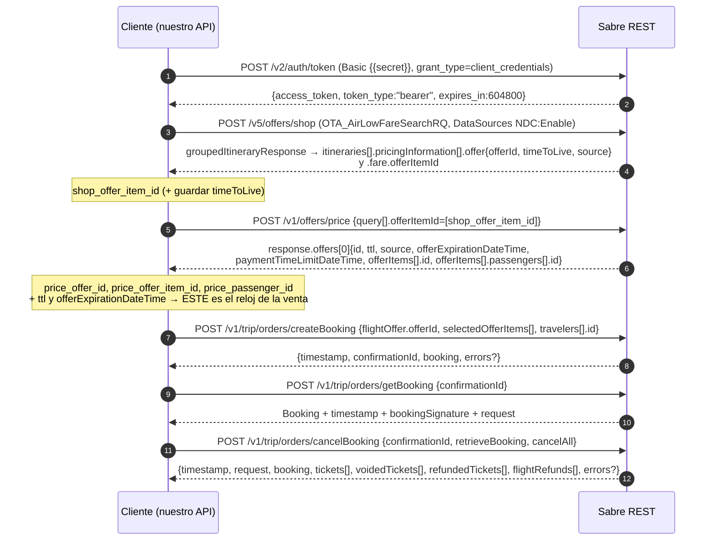

**Lo que el contrato cierra en este diagrama:**

- `CreateBookingResponse` = `timestamp` + `confirmationId` (`pattern ^[A-Z0-9]{6,}$`, ejemplo `GLEBNY`) + `booking`
  - `errors[]` + `request`. **Nada mas.** VERIFICADO-SPEC `booking-management-v1.yml:804-829`.
- **CORRECCION:** `createBooking` **no devuelve `bookingSignature`**. Solo `getBooking` lo hace. VERIFICADO-SPEC
  `booking-management-v1.yml:295-312`. Si el flujo va a modificar, hace falta un `getBooking` intermedio.
- `CancelBookingResponse` incluye ademas `voidedTickets[]`, `refundedTickets[]` y `flightRefunds[]`, campos que la
  primera pasada no conocia. VERIFICADO-SPEC `booking-management-v1.yml:440-486`.

Body real del PRICE — `Workflows / 1 / 2. Offers Price /v1`. VERIFICADO:

```json
{
  "query": [{ "offerItemId": ["{{shop_offer_item_id}}"] }],
  "params": { "formOfPayment": [{ "binNumber": "545251", "subCode": "FDA", "cardType": "MC" }] }
}
```

Body real del CB (447 bytes, el mas pequeno de la coleccion) — `Workflows / 1 / 3. createBooking`. VERIFICADO:

```json
{
  "flightOffer": {
    "offerId": "{{price_offer_id}}",
    "selectedOfferItems": ["{{price_offer_item_id}}"]
  },
  "travelers": [
    {
      "id": "{{price_passenger_id}}",
      "givenName": "John",
      "surname": "Kowalski",
      "birthDate": "1970-01-23",
      "passengerCode": "ADT",
      "customerNumber": "1234567"
    }
  ],
  "contactInfo": { "emails": ["travel@sabre.com"], "phones": ["123456"] }
}
```

> **Deriva a corregir antes de copiarlo:** el shop de WF-1 postea `"OTA_AirLowFareSearchRQ": {"Version": "1"}` a
> `/v5/offers/shop`. Los tres ejemplos del contrato v5 usan `"Version": "5"`. VERIFICADO-SPEC
> `bargain-finder-max-v5.yml:71`.

### 3.2 WF-3 — ATPCO: Shop → Book → Cancel (sin PRICE)

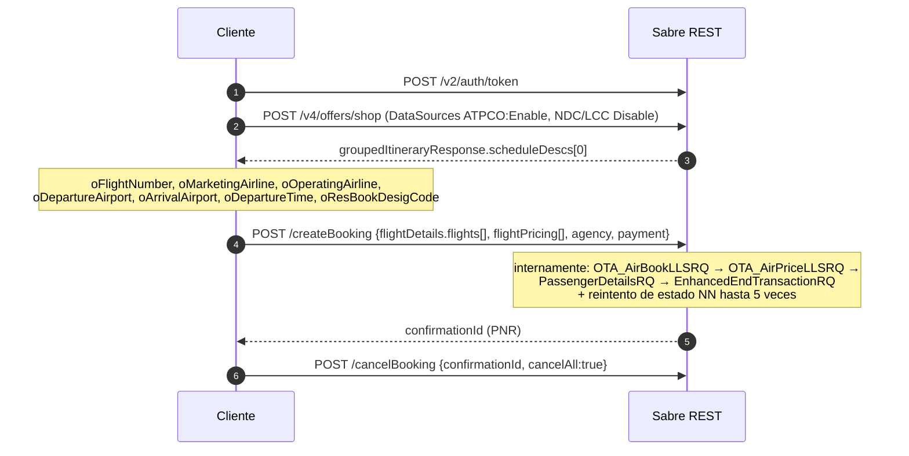

**Diferencia clave:** ATPCO **no usa `offerId`**; se re-declara el vuelo por atributos.
Fuente: `Workflows / 3 / 2. createBooking - ATPCO payload`. VERIFICADO:

```json
"flightDetails": {
  "flights": [{
    "flightNumber": "{{oFlightNumber}}", "airlineCode": "{{oMarketingAirline}}",
    "fromAirportCode": "{{oDepartureAirport}}", "toAirportCode": "{{oArrivalAirport}}",
    "departureDate": "{{start_date}}", "departureTime": "{{oDepartureTime}}",
    "bookingClass": "Y", "isMarriageGroup": false, "flightStatusCode": "NN"
  }],
  "flightPricing": [{}]
}
```

**Nuevo, VERIFICADO-SPEC** (`help-documentation-create-booking.txt:34-40`): ese `flightStatusCode: "NN"` no es
cosmetico. Sabre verifica el estado del segmento antes de continuar; si sigue en `NN` espera 1.000 ms y reintenta,
**hasta 5 veces con retardo progresivo** (1s, 2s, 3s, 4s, 5s). En el peor caso el `createBooking` ATPCO puede
tardar **15 segundos extra**. Los LCC quedan excluidos de esa logica. Esto tiene consecuencia directa sobre el
principio de "tiempo a venta < 2 minutos": el timeout de nuestro cliente HTTP contra `createBooking` **no puede ser
de 10 s**.

### 3.3 WF-5 — LCC: Shop → Book → Emision → Cancel

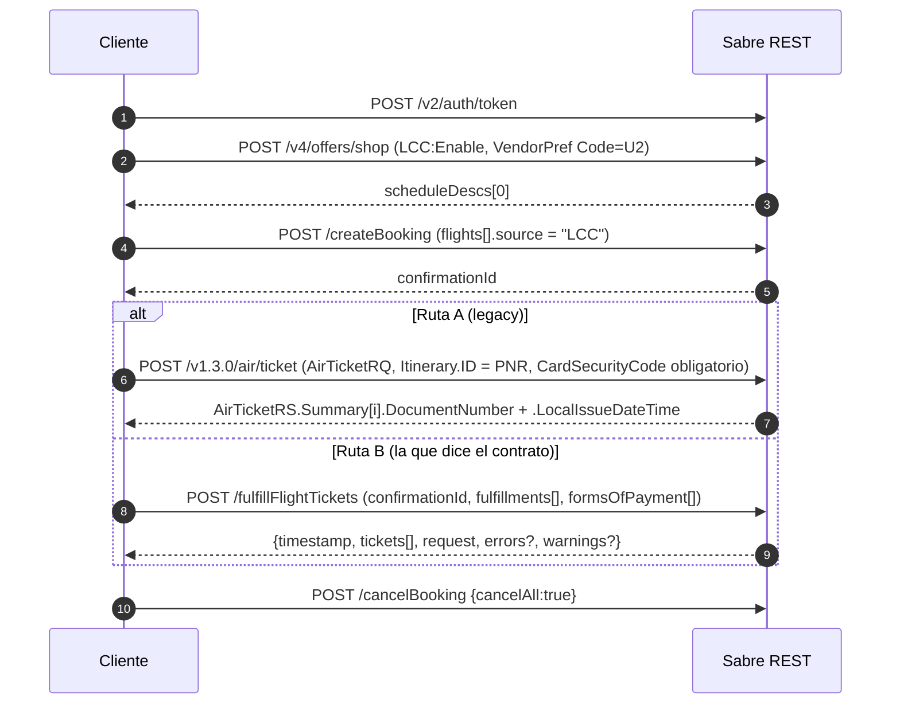

> **CORRECCION / respuesta a la pregunta abierta 9 de la primera pasada.** No son dos alternativas de igual rango.
> El contrato dice que `fulfillFlightTickets` **orquesta `AirTicketRQ` por dentro**
> (VERIFICADO-SPEC `help-documentation-fulfill-flight-tickets.txt:65-72`: _"The APIs orchestrated by Fulfill Flight
> Tickets are: ContextChangeLLSRQ, GetReservationRQ, AirTicketRQ, Order Management"_). `/v1.3.0/air/ticket` es la
> LLS cruda; `fulfillFlightTickets` es la envoltura oficial y ademas es la unica que cubre **NDC**. Usamos
> `fulfillFlightTickets`.

### 3.4 WF-6 y WF-7 — ATPCO con emision y anulacion (void)

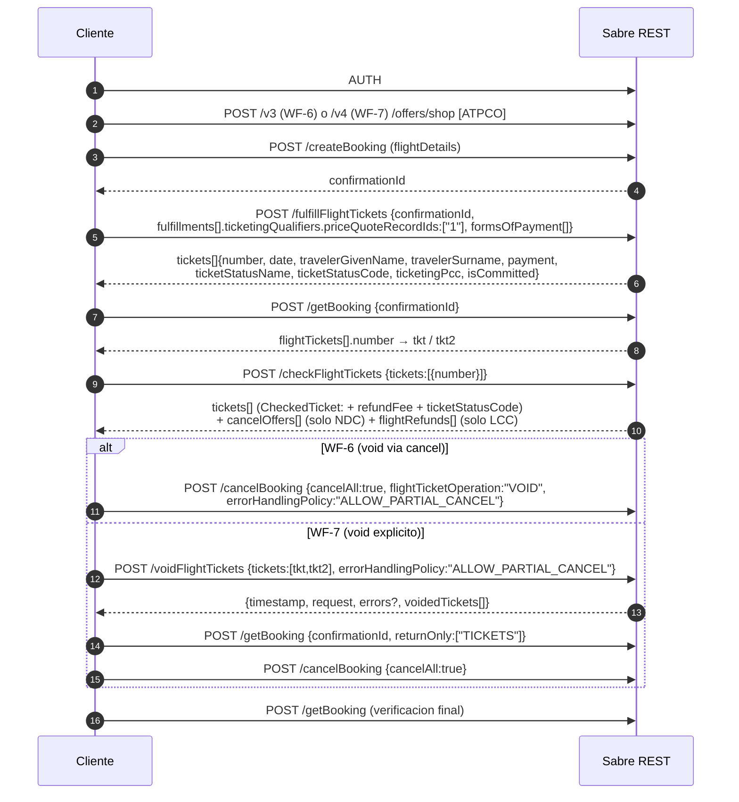

**Lo que el contrato cierra aqui** (era la "pregunta abierta 4", la mas grande de la primera pasada):

`CheckTicketsResponse` = `timestamp` + `request` + **`tickets[]`** + `errors[]` + **`cancelOffers[]`** +
**`flightRefunds[]`**. VERIFICADO-SPEC `booking-management-v1.yml:660-692`. Y cada elemento:

| Campo             | Forma                                                                                                   | Para que sirve                               | Cita                                  |
| ----------------- | ------------------------------------------------------------------------------------------------------- | -------------------------------------------- | ------------------------------------- |
| `tickets[]`       | `CheckedTicket` = `Ticket` + `refundFee` (`RefundFee`: importe, moneda, impuestos) + `ticketStatusCode` | Refundabilidad y coste por billete **ATPCO** | `booking-management-v1.yml:8496-8513` |
| `cancelOffers[]`  | `{offerType: VOID\|REFUND, offerItemId, offerExpirationDate, offerExpirationTime, refundTotals}`        | Cancelacion **NDC**                          | `booking-management-v1.yml:6504-6531` |
| `flightRefunds[]` | `{airlineCode, confirmationId, refundTotals}` (`refundTotals` obligatorio)                              | Refund **LCC** (non-ATPCO)                   | `booking-management-v1.yml:4148-4167` |

Y el proposito declarado de WF-16/17 (¿es reembolsable/cambiable?) ya no es un hueco: el contrato dice que
`checkFlightTickets` _"checks tickets … for void, refund and exchange conditions"_ y que calcula el coste de cambio
(_"Potential exchange cost (exchange penalties, no-show cost – if applicable)"_). VERIFICADO-SPEC
`help-documentation-check-flight-tickets.txt:5, 19-23`.

**Limites que hay que respetar** (VERIFICADO-SPEC `help-documentation-check-flight-tickets.txt:85-97`):

- Maximo **12 documentos** por llamada, y **todos del mismo PNR**.
- De una orden NDC **solo se puede comprobar la orden entera**: no hay void/refund parcial.
- Si el PNR mezcla ATPCO con una reserva LCC (non-ATPCO), devuelve `SCENARIO_NOT_SUPPORTED`.
- Si un PNR hibrido NDC+ATPCO se pide por **order id** en vez de por PNR locator, tambien
  `SCENARIO_NOT_SUPPORTED`. **Siempre por PNR locator.**

`FulfillTicketsResponse` tambien queda cerrado: `timestamp` + `tickets[]` (`FulfillTicket`: `number`, `date`,
`payment`, `travelerGivenName/Surname`, `ticketStatusName`, `ticketStatusCode`, `ticketingPcc`, `isCommitted`) +
`request` + `errors[]` + `warnings[]`. VERIFICADO-SPEC `booking-management-v1.yml:1022-1051` y `7965-8019`.

> **Contradiccion abierta entre coleccion y contrato.** El script de `Workflows / 14 / 4. fulfillFlightTickets`
> hace `pm.environment.set('bookingSignature', jsonData.bookingSignature)`. Pero `FulfillTicketsResponse` **no
> declara `bookingSignature`**. O el campo esta sin documentar, o el script arrastra un copy-paste de `getBooking`.
> **Hasta capturarlo del sandbox, nuestro codigo debe leer `bookingSignature` solo de `getBooking`.** VERIFICADO
> (script) vs VERIFICADO-SPEC (`booking-management-v1.yml:1022-1051`).

### 3.5 WF-8 — ATPCO con reembolso

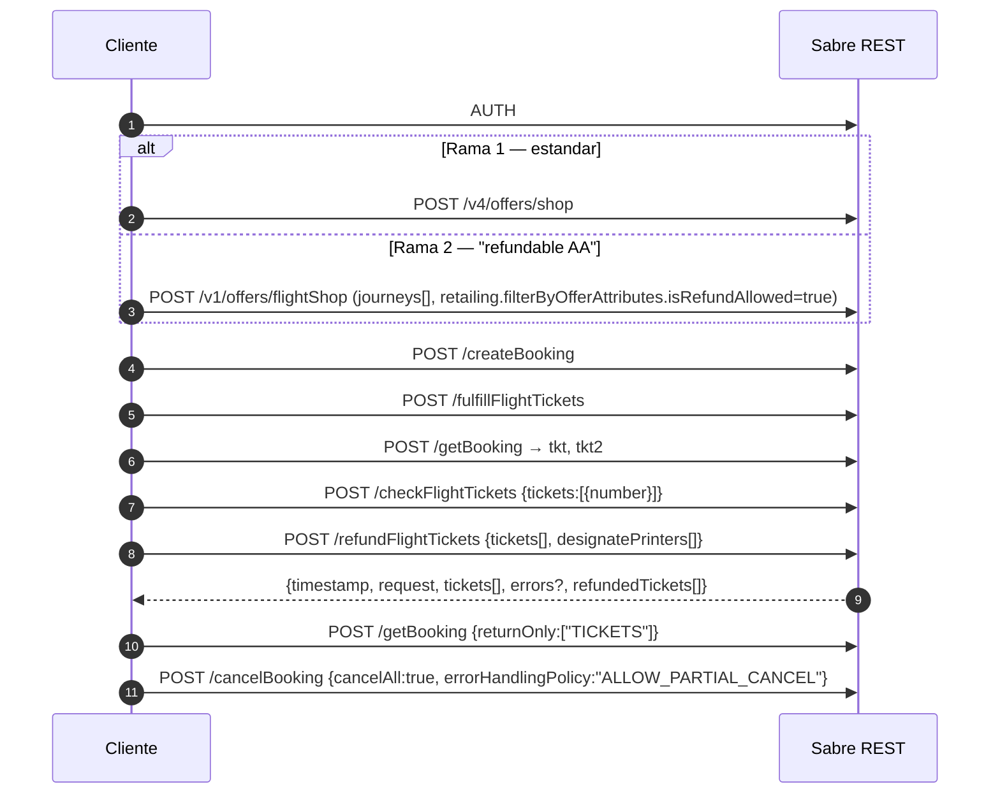

Body real de la rama 2 — `Workflows / 8 / 1a Flight Shop - refundable AA`. VERIFICADO:

```json
{
  "journeys": [
    {
      "departureLocation": { "airportCode": "JFK" },
      "arrivalLocation": { "airportCode": "MIA" },
      "departureDate": "2026-09-01"
    },
    {
      "departureLocation": { "airportCode": "MIA" },
      "arrivalLocation": { "airportCode": "JFK" },
      "departureDate": "2026-09-08"
    }
  ],
  "travelers": [{ "passengerTypeCode": "ADT" }],
  "airlines": { "marketingAirlinesFilter": { "airlineCodes": ["AA"] } },
  "fare": { "brandedFareFilters": [{ "brandCodes": ["MAINFL"] }] },
  "retailing": {
    "filterByOfferAttributes": { "isRefundAllowed": true },
    "returnOfferAttributes": ["Flexibility", "Baggage"]
  },
  "sources": { "distributionModels": ["ATPCO"] },
  "processingOptions": { "limitNumberOfOffers": 5 }
}
```

> **Dos avisos.** (a) Las fechas estan **hardcodeadas** (`2026-09-01`); corriendolo hoy, 2026-08-25, aun sirve,
> pero caduca en dias. (b) `/v1/offers/flightShop` **no tiene contrato publicado** entre los 21 specs descargados.
> No construimos nada encima de el.

`RefundTicketsResponse` = `timestamp` + `request` + `tickets[]` + `errors[]` + **`refundedTickets[]`** (lista plana
de numeros de documento efectivamente reembolsados). VERIFICADO-SPEC `booking-management-v1.yml:606-636`.
`documentsType` acepta exactamente `Tickets` (default) | `EMDs` | `Tickets and EMDs`. VERIFICADO-SPEC
`booking-management-v1.yml:9422-9430`.

### 3.6 WF-9 — Hotel

```mermaid
sequenceDiagram
    autonumber
    participant C as Cliente
    participant S as Sabre REST
    C->>S: AUTH
    C->>S: POST /v5/get/hotelavail (GeoRef por codigo IATA o lat/lon; RateSource 100=GDS, 113=Booking.com)
    S-->>C: GetHotelAvailRS.HotelAvailInfos.HotelAvailInfo[].HotelRateInfo.RateInfos.RateInfo[].RateKey
    Note over C: rate_key, hotel_code
    C->>S: POST /v5/hotel/pricecheck {HotelPriceCheckRQ.RateInfoRef.RateKey}
    S-->>C: PriceCheckInfo{BookingKey, PriceChange, PriceDifference, CurrencyCode,<br/>ConvertedPriceChange, ConvertedPriceDifference, HotelInfo, HotelRateInfo}
    Note over C: booking_key, guarantee_type (GUAR→GUARANTEE, DEP→DEPOSIT)<br/>Y SOBRE TODO: PriceChange
    C->>S: POST /createBooking {hotel.bookingKey, hotel.paymentPolicy, hotel.rooms[], payment.formsOfPayment[]}
    S-->>C: confirmationId
    C->>S: POST /cancelBooking {cancelAll:true, errorHandlingPolicy:"ALLOW_PARTIAL_CANCEL"}
```

**Lo nuevo que aporta el contrato:** `PriceCheckInfo` tiene como **obligatorios** `BookingKey`, **`PriceChange`
(booleano)**, **`PriceDifference`**, `CurrencyCode`, `HotelInfo` y `HotelRateInfo`. VERIFICADO-SPEC
`hotel-price-check-v5.yml:262-291`.

> **El script de la coleccion ignora `PriceChange`.** Solo saca `BookingKey` y `GuaranteeType`. Un ACL que copie
> ese script venderia al cliente un precio distinto del que le mostro sin enterarse. **`PriceChange === true` tiene
> que interrumpir el flujo y volver al vendedor.** Ese es, ademas, el proposito declarado del endpoint:
> _"validates whether the price returned when shopping for a chosen product is still valid. This API is called
> between the shopping and booking steps."_ VERIFICADO-SPEC `hotel-price-check-v5.yml:4`.

Mapeo `GuaranteeType` → `hotel.paymentPolicy`. VERIFICADO-script (`Workflows / 9 / 2. Hotel Price Check /v5`):

```js
const guaranteeMap = { GUAR: 'GUARANTEE', DEP: 'DEPOSIT' };
pm.environment.set('guarantee_type', guaranteeMap[rawGuaranteeType] || rawGuaranteeType);
```

El contrato confirma que `Guarantee.GuaranteeType` es un string libre con ejemplo `"GUAR"`, y que junto a el vienen
`GuaranteesAccepted.GuaranteeAccepted[].GuaranteeTypeCode` (entero OTA PMT, ej. `5` = "Credit Card") y
`DepositPolicies`. VERIFICADO-SPEC `hotel-price-check-v5.yml:1501-1540`. El `guaranteeMap` de dos entradas de la
coleccion **no es exhaustivo**; hay que tratar el valor desconocido como error, no como passthrough.

`payment.formsOfPayment[]` acepta 6 tipos en el ejemplo de hotel: `PAYMENTCARD`, `VIRTUAL_CARD`, `AGENCY_NAME`,
`AGENCY_IATA`, `CORPORATE`, `COMPANY_NAME`. VERIFICADO.

Error relevante para la saga: `UNABLE_TO_BOOK_HOTEL_EXPIRED_BOOKING_KEY` — _"The hotel booking key is expired."_
VERIFICADO-SPEC `help-documentation-create-booking-error-list.txt:207-211`. El `bookingKey` tiene TTL propio.

### 3.7 WF-10 — Auto

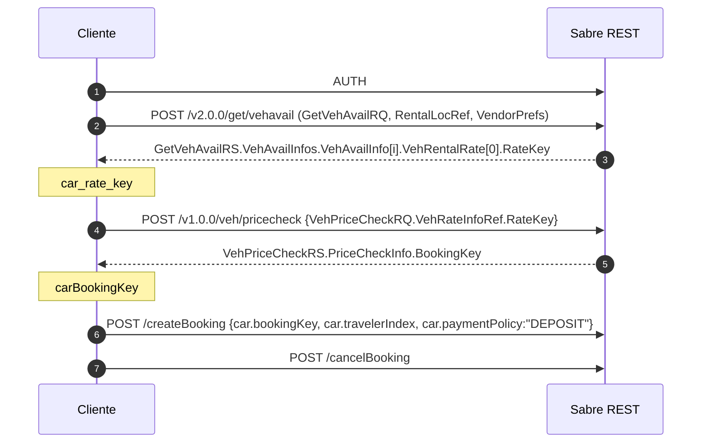

Los paths de `GetVehAvailRS` estan confirmados por el contrato (`get-vehicle-availability-v2.yml:536-552, 742-802`).
El de `veh/pricecheck` **no tiene spec publicado**: sigue siendo VERIFICADO-script, no VERIFICADO-SPEC.

> El script toma el indice `[2]` del array de disponibilidad, no el `[0]`. Es un detalle del ejemplo, no una regla.

### 3.8 WF-11 y WF-18 — NDC multi-pax y familias

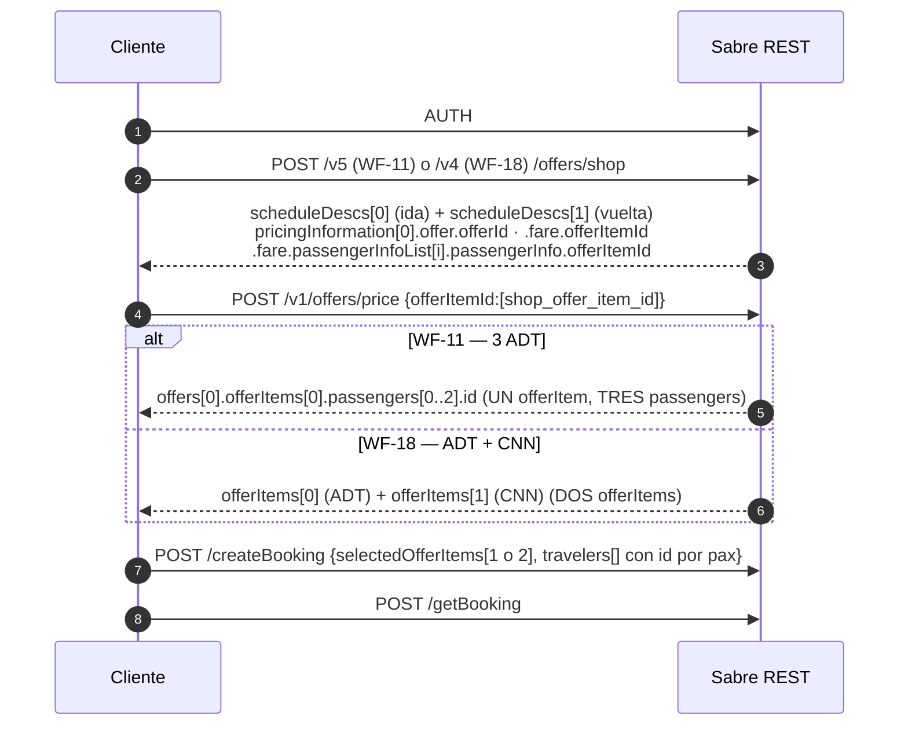

**La regla:** el numero de `selectedOfferItems` que manda el `createBooking` lo determina el **tipo de pasajero**,
no la cantidad. Un `offerItem` por PTC. VERIFICADO-script + confirmado por el contrato del price, donde `OfferItem`
lleva `passengers[]` con `ptc` y `requestedPtc` (VERIFICADO-SPEC, ejemplo `offer-price-ndc-v1.yml:2116-2124`) y la
guia de BFM dice _"For each of our passengers, pricing information is returned. You can identify the applicable
passenger by inspecting the `passengerInfo.passengerType`"_ (VERIFICADO-SPEC `bargain-finder-max-v5.yml:672`).

### 3.9 WF-14 — NDC: cancelar orden y anular tickets

Este es el flujo de cancelacion correcto para NDC y es distinto del de ATPCO.

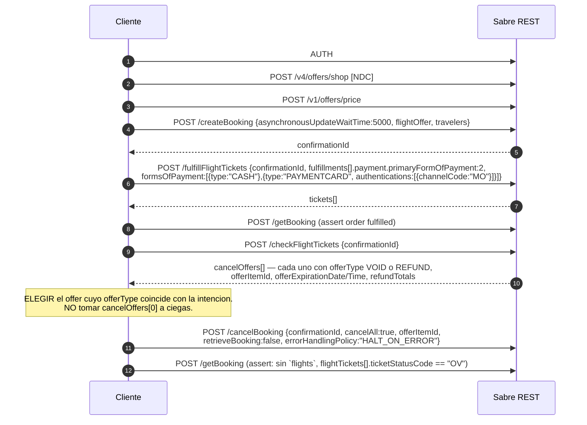

**Tres cosas que el contrato anade y que cambian el codigo:**

1. **`cancelOffers` es una lista con tipo.** `CancelOfferTypeEnum = {VOID, REFUND}`. VERIFICADO-SPEC
   `booking-management-v1.yml:8890-8896`. El script de la coleccion hace
   `let offerItemId = response.cancelOffers[0].offerItemId` — **eso es un bug latente**: si el primer elemento es el
   `REFUND` y lo que queriamos era un `VOID` (o al reves), cancelamos con la economia equivocada. Nuestro ACL debe
   filtrar por `offerType`.
2. **La oferta de cancelacion caduca.** `offerExpirationDate` + `offerExpirationTime` (UTC, `^[0-9]{2}:[0-9]{2}$`).
   VERIFICADO-SPEC `booking-management-v1.yml:6517-6528`. Es decir: `checkFlightTickets` → `cancelBooking` es una
   ventana, no un par de llamadas cualquiera.
3. **`offerItemId` y `flightTicketOperation` son mutuamente excluyentes.** El error oficial lo dice literal:
   _"Unable to cancel the booking. Combination of offerItemId and flightTicketOperation is not supported. Change
   request to use either offerItemId or flightTicketOperation."_ VERIFICADO-SPEC
   `help-documentation-cancel-booking-error-list.txt:43`. NDC → `offerItemId`. ATPCO/LCC → `flightTicketOperation`.

Assertions del getBooking final. VERIFICADO-script (`Workflows / 14 / 10. getBooking`):

```js
pm.expect(response).not.to.have.property('flights');
response.flightTickets.forEach((t) => {
  pm.expect(t.ticketStatusName).to.eql('Voided');
  pm.expect(t.ticketStatusCode).to.eql('OV');
});
```

El contrato confirma el vocabulario: `TicketStatusEnum = {Issued, Voided, "Refunded/Exchanged"}` para
`ticketStatusName`, y `ticketStatusCode` como `^[A-Z]{1,2}$` con ejemplo `TE`. VERIFICADO-SPEC
`booking-management-v1.yml:9195-9202` y `8008-8013`. El bug de etiqueta del script ("should have TV status code"
comparando con `'OV'`) sigue siendo solo eso, una etiqueta mal escrita; el valor correcto es **`OV`**.

**`asynchronousUpdateWaitTime` — pregunta abierta 8 de la primera pasada, CERRADA:** es **opcional**, entero,
`minimum 0`, `maximum 10000`, **`default 0`**, y su descripcion es _"The maximum wait time in milliseconds applied
to asynchronous updates related to booking creation. Mainly used for the redisplay operation of NDC bookings."_
VERIFICADO-SPEC `booking-management-v1.yml:714-722`. O sea: no mandarlo es legal y equivale a 0; lo que se pierde
es el _redisplay_ sincronico del pedido NDC, no la reserva. Se sigue sin saber que pasa si la aerolinea tarda mas
que el valor pedido: eso queda en Preguntas abiertas.

### 3.10 WF-19 y WF-20 — ancillaries: el mismo mensaje, dos regimenes

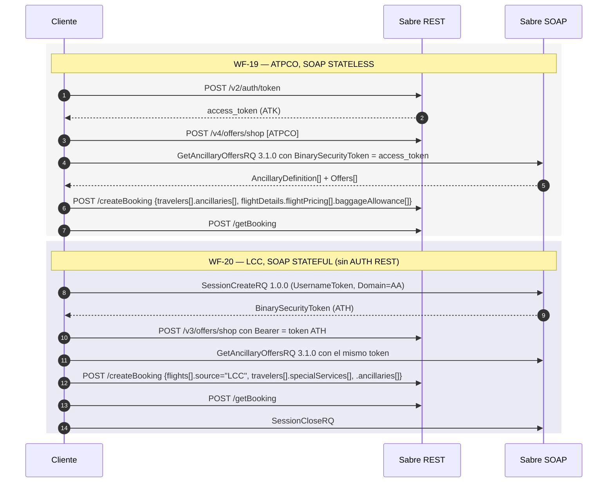

Captura del token de sesion. VERIFICADO-script (script `test` a nivel coleccion):

```js
case 'SessionCreateRQ':
  parseString(responseBody, parseOptions, (err, result) => {
    const token = result.Envelope.Header[0].Security[0].BinarySecurityToken[0]._;
    pm.environment.set('token', token);
  });
```

Captura de los ancillaries. VERIFICADO-script (`Workflows / 20 / GetAncillaryOffersRQ`):

```js
const BASE_ANCILLARY =
  result.Envelope.Body[0].GetAncillaryOffersRS[0].AncillaryDefinition[ancillarySeqNum];
const ancillarySubCode = BASE_ANCILLARY.SubCode[0];
const ancillaryVendor = BASE_ANCILLARY.Vendor[0];
const ancillaryGroup = BASE_ANCILLARY.Group[0];
const ancillaryBasePrice =
  result.Envelope.Body[0].GetAncillaryOffersRS[0].Offers[ancillarySeqNum].AncillaryFee[0]
    .TotalBaseEquiv[0].Amount[0]._;
```

> **Restriccion del contrato que la primera pasada no tenia:** _"Ancillary services are currently not supported for
> NDC bookings."_ VERIFICADO-SPEC `help-documentation-create-booking.txt:97`. Es decir: `travelers[].ancillaries[]`
> vale para ATPCO y LCC, **no para NDC**. Para NDC, lo unico vendible en la creacion son **asientos**
> (`flightOffer.seatOffers[]`). Eso reordena el backlog: si queremos vender equipaje NDC, no es un campo mas del
> `createBooking`, es otro producto.

### 3.11 WF-28–33 — NDC con asientos asignados en la creacion

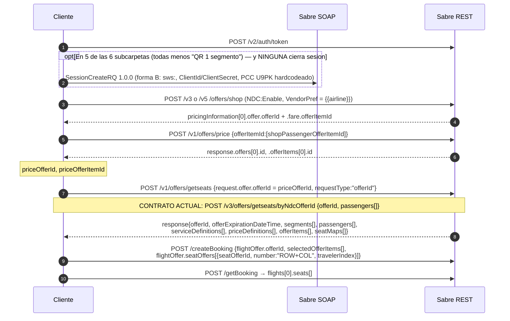

**Pregunta abierta 6 de la primera pasada — CERRADA por el contrato.** La primera pasada declaraba desconocido el
mapeo `seatMaps → (row, columns[], paxSegmentRefID)` porque los scripts lo resolvian con `sharedFunctions.*` que
Sabre no entrego. El spec de Get Seats lo describe entero:

```
response
├── offerId                       ← una sola oferta por respuesta, con offerExpirationDateTime
├── offerItems[]                  ← el precio y el "que se puede comprar"
│   ├── id                        ← esto es el seatOfferId del createBooking
│   ├── serviceDefinitionRef      → serviceDefinitions[].id
│   ├── priceDefinitionRef        → priceDefinitions[].id  (currencyCode + totalPrice.amount)
│   ├── segmentRefs[]             → segments[].id
│   ├── passengerRefs[]           → passengers[].id
│   ├── purchaseByDateTime        ← caducidad del item
│   └── paymentType               ← p.ej. "Deferred"
└── seatMaps[]
    ├── segmentRef                → segments[].id
    └── cabinCompartments[]
        ├── firstRow / lastRow / cabinCode / cabinName
        ├── cabinLayout{ columns[{id, position:[A|C|W]}], rows{firstRow,lastRow},
        │                exitRowPosition[], wingRowPosition[], missingSeats[], facilities[] }
        └── seatRows[]
            ├── row               ← el NUMERO de fila
            └── seats[]
                ├── column        ← la LETRA
                ├── occupationStatusCode   ← PADIS 9865: F=libre, O=ocupado, Q=no hay asiento, …
                ├── isOperative
                ├── characteristics[]      ← PADIS 9825
                └── offerItemRefIds[]      ← EL ENLACE: apunta a offerItems[].id
```

VERIFICADO-SPEC `get-seats-agency-3.0.yml:210-263` (respuesta), `265-320` (offerItems), `833-1010` (seatMaps,
cabinCompartments, seatRows, seats). Ejemplo real completo en
`specs/help/get-seats-agency-3.0/get-seats-v3-get-seats-ndc-offer-id.txt:266+`.

**Traduccion directa del algoritmo que faltaba:** para un pasajero P y un segmento S,
`getRandomSeatRowWithColumnByOfferItemRefIDAndPaxSegmentRefID` es simplemente:

1. filtrar `offerItems[]` por `passengerRefs ∋ P` y `segmentRefs ∋ S` → conjunto de `offerItemId` validos;
2. en `seatMaps[]` con `segmentRef == S`, recorrer `cabinCompartments[].seatRows[].seats[]` y quedarse con los que
   tengan `occupationStatusCode == "F"` y `offerItemRefIds ∩ {offerItemId validos} ≠ ∅`;
3. el numero de asiento es `seatRow.row + seat.column` — exactamente lo que el `createBooking` manda como
   `seatOffers[].number: "{{row}}{{column}}"`.

Esto ya no depende de ningun fichero de _globals_ de Postman. **Se puede escribir el mapper.**

**Y el contrato explica por que el orden es shop → price → getseats y no shop → getseats:**

> _"The seat map may be displayed using the OfferID from a shopping response, but the seats are not bookable
> because the prices displayed on the map are not guaranteed until the Offer for the air fare has been priced.
> Therefore, the seat map is displayed with a view only indicator (`sellable: false`). If an attempt is made to book
> a seat at this stage, an error about 'invalid or expired offer' is returned. Seats will be bookable from a seat
> map displayed after pricing."_
> VERIFICADO-SPEC `specs/help/get-seats-agency-3.0/3.0-index.txt:52-56`.

Body real de `getseats` en la coleccion (v1) — `Workflows / 28-33 / … / Offers (seats)`. VERIFICADO:

```json
{
  "request": { "offer": { "offerId": "{{priceOfferId}}" } },
  "pointOfSale": { "agentDutyCode": "*", "location": { "countryCode": "PL", "cityCode": "KRK" } },
  "requestType": "offerId",
  "party": {
    "sender": {
      "travelAgency": {
        "iataNumber": "99999999",
        "pseudoCityID": "B4T0",
        "agencyID": "99999999",
        "name": "SABRE",
        "type": "TravelAgency",
        "agentUserID": "xmluser001"
      }
    }
  }
}
```

Fragmento de `createBooking` con asientos. VERIFICADO:

```json
"flightOffer": {
  "offerId": "{{priceOfferId}}",
  "selectedOfferItems": ["{{priceOfferItemId}}"],
  "seatOffers": [
    { "seatOfferId": "{{segment1Passenger1OfferItemId}}",
      "number": "{{segment1Passenger1Row}}{{segment1Passenger1Column}}",
      "travelerIndex": 1 }
  ]
}
```

> **Lo que sigue sin resolverse de esta carpeta.** Los scripts llaman a `sharedFunctions.getItineraryBasedOnId`,
> `getPaxSegmentRefIDs`, `getPtcByPaxID`, `getRandomOfferItemIdForPassenger`, y a
> `assertions.assertThatArrayLengthIsAsExpected` / `assertThatSessionAuthenticationIsUsed`. **Ninguna esta en el
> collection JSON.** Ya no bloquean el diseno (el contrato de v3 da el modelo entero), pero **la carpeta sigue sin
> ser ejecutable tal cual en Postman**. Y `assertThatSessionAuthenticationIsUsed` es la pista de que el
> `SessionCreateRQ` de estas subcarpetas **no es basura heredada**: alguien queria comprobar que la llamada iba con
> token ATH. Ver Preguntas abiertas.

---

## 4. La cadena de estado: que identificador nace donde y cuanto vive

### 4.1 Evidencia primaria: el script `test` a nivel coleccion

La coleccion tiene un unico script `test` global que, segun el 6.º segmento de la URL resuelta
(`request.url.split("/")[5]`), guarda variables. Reproducido literalmente. VERIFICADO:

```js
switch (URI_ID) {
  case 'token':
    pm.environment.set('token', jsonData.access_token);
    break;
  case 'shop':
    pm.environment.set(
      'shop_offer_item_id',
      jsonData.groupedItineraryResponse.itineraryGroups[0].itineraries[0].pricingInformation[0].fare
        .offerItemId,
    );
    break;
  case 'price':
    pm.environment.set('price_offer_id', jsonData.response.offers[0].id);
    pm.environment.set('price_offer_item_id', jsonData.response.offers[0].offerItems[0].id);
    pm.environment.set(
      'price_passenger_id',
      jsonData.response.offers[0].offerItems[0].passengers[0].id,
    );
    break;
  case 'create': // endpoint /v1/orders/create
    pm.environment.set('sabre_order_id', jsonData.order.id);
    pm.environment.set('pnr', jsonData.order.pnrLocator);
    break;
  case 'ticket':
    pm.environment.set('tkt', jsonData.AirTicketRS.Summary[0].DocumentNumber);
    pm.environment.set('tkt2', jsonData.AirTicketRS.Summary[1].DocumentNumber);
    break;
  case 'hotelavail':
    pm.environment.set(
      'hotel_code',
      jsonData.GetHotelAvailRS.HotelAvailInfos.HotelAvailInfo[0].HotelInfo.HotelCode,
    );
    pm.environment.set(
      'rate_key',
      jsonData.GetHotelAvailRS.HotelAvailInfos.HotelAvailInfo[0].HotelRateInfo.RateInfos.RateInfo[0]
        .RateKey,
    );
    break;
  case 'orders':
    if (request.url.split('/')[6] === 'createBooking')
      pm.environment.set('pnr', jsonData.confirmationId);
    break;
}
```

Dos lineas comentadas en ese mismo `case 'shop'` revelan las alternativas que Sabre probo y descarto:
`pricingInformation[0].offer.offerId` y `pricingInformation[0].fare.passengerInfoList[0].passengerInfo.offerItemId`.
VERIFICADO.

### 4.2 `orderId` vs `confirmationId` — matiz corregido

La primera pasada afirmaba: _"en el modelo actual el identificador de negocio es `confirmationId` (el PNR), no un
`orderId`"_ y que _"el `orderItemId` de los flujos NDC no es un identificador de linea de la orden"_. **La primera
mitad es correcta; la segunda es falsa, y ahora hay prueba dura.**

Las 4 respuestas guardadas de `/v1/orders/view` muestran el objeto orden real. VERIFICADO
(`evidence/responses/01-Add_phone_Orders_View.json`):

```
order
├── id             = "4e54071d6c2d483c808f8a09f38f6bbc"   ← ID de orden NDC, 32 hex, NO es el PNR
├── pnrLocator     = "TOSGCZ"                             ← el PNR / confirmationId
├── orderOwner     = "1S"
├── paymentTimeLimit = "2019-04-19T20:37:00"              ← limite de pago a nivel ORDEN
├── orderItems[]
│   ├── id                  = "1"                         ← linea de la orden
│   ├── offerItemId                                       ← ENLACE a la oferta que se compro
│   ├── externalId, externalOrderRefId, externalOfferItemId
│   ├── creationDateTime, ticketingTimeLimit              ← limite de emision por LINEA
│   ├── fareDetails[] { fareIndicatorCode, paxRefIds[], price{baseAmount, totalTaxAmount, taxBreakdowns[]} }
│   ├── price, services
├── externalOrders[] { id, systemId:"UAD", externalOrderId, bookingReferences[{id, carrierCode}] }
├── contactInfos[]  { id:"CI-1", phones[], emailAddresses[] }
├── passengers[]    { id:"Passenger1", typeCode:"ADT", contactInfoRefId:"CI-1", birthdate, givenName, surname }
├── products[]      { id, airSegment{ marketingCarrier, departure/arrivalDateTime, departure/arrivalAirport, actionCode:"HK" } }
├── journeys[], segments[] { id:"Isgm52C50", departure{locationCode, stationName, scheduledDateTime}, arrival{}, marketingCarrier{} }
├── priceClasses[], customerNumber{number}
└── totalPrice { totalAmount{ amount, code } }
```

**Redaccion corregida:**

1. **La clave de negocio de la API de Booking Management sigue siendo `confirmationId` (= `pnrLocator`).** Todos
   los endpoints `/v1/trip/orders/*` la piden. Eso no cambia.
2. **Pero la orden NDC existe y tiene su propio `order.id` y sus `orderItems[].id`.** El campo
   `orderItems[].offerItemId` es literalmente el puente entre la oferta cotizada y la linea comprada. Nuestro
   modelo canonico deberia guardar **ambos**: `providerBookingRef = confirmationId` y, cuando exista,
   `providerOrderRef = order.id`.
3. **El `offerItemId` que WF-14 mete en `cancelBooking` es otra cosa**: es
   `checkFlightTickets.cancelOffers[].offerItemId`, un identificador de **oferta de cancelacion**. Que se llamen
   igual es una colision de nombres de Sabre, no una identidad. VERIFICADO-SPEC `booking-management-v1.yml:6511`
   (_"Offer ID referencing the cancel option for a NDC order"_).
4. `/v1/orders/create` ya no existe en esta coleccion; `case 'create'` del script global es codigo muerto que
   sobrevive porque `/v1/orders/view` comparte el prefijo. Los usos vivos son `/v1/orders/view` (4) y
   `/v1/orders/change` (1). El contrato de Booking Management confirma que esa capa es **interna**: cita
   `orders/change OrderChangeResponse.order.ticketingDocumentInfo…` como _fuente_ de sus propios campos.
   VERIFICADO-SPEC `booking-management-v1.yml:7983, 8013`.

### 4.3 Diagrama de la cadena

```mermaid
flowchart LR
    A["/v2/auth/token<br/>access_token · expires_in 604800"] --> B

    subgraph SHOP["/vN/offers/shop  (Bargain Finder Max)"]
      B["groupedItineraryResponse<br/>.itineraryGroups[0].itineraries[0]<br/>.pricingInformation[0]"]
      B --> B1["offer.offerId + offer.timeToLive + offer.source<br/><b>shop_offer_id</b>"]
      B --> B2["fare.offerItemId<br/><b>shop_offer_item_id</b>"]
      B --> B3["fare.passengerInfoList[i]<br/>.passengerInfo.offerItemId + .passengerType"]
      B --> B4["scheduleDescs[i]<br/>(ATPCO/LCC: vuelo, aerolinea,<br/>aeropuertos, hora, RBD)"]
      B --> B5["fare.lastTicketDate + .lastTicketTime"]
    end

    B2 -->|"query[].offerItemId"| P
    subgraph PRICE["/v1/offers/price"]
      P["response.offers[0]"]
      P --> P1["id<br/><b>price_offer_id</b>"]
      P --> P2["offerItems[j].id<br/><b>price_offer_item_id</b>"]
      P --> P3["offerItems[j].passengers[k].id + .ptc<br/><b>price_passenger_id</b>"]
      P --> P4["<b>ttl</b> (segundos) + <b>offerExpirationDateTime</b><br/>+ paymentTimeLimitDateTime<br/>+ purchaseTimeLimitDateTime"]
    end

    P1 -->|"offerId"| SE
    subgraph SEATS["getseats  (opcional)"]
      SE["response"]
      SE --> SE1["offerItems[].id<br/><b>seatOfferId</b>"]
      SE --> SE2["seatMaps[].cabinCompartments[]<br/>.seatRows[].row + .seats[].column<br/>+ .seats[].offerItemRefIds[]"]
      SE --> SE3["offerId + offerExpirationDateTime"]
    end

    P1 --> CB
    P2 --> CB
    P3 --> CB
    B4 --> CB
    SE1 --> CB
    subgraph CREATE["/v1/trip/orders/createBooking"]
      CB["respuesta"]
      CB --> CB1["<b>confirmationId</b> = PNR<br/>^[A-Z0-9]{6,}$"]
      CB --> CB2["booking (eco normalizado)"]
      CB --> CB3["errors[] parciales"]
    end

    CB1 --> GB
    subgraph GET["/v1/trip/orders/getBooking"]
      GB["respuesta"]
      GB --> GB1["<b>bookingSignature</b><br/>UNICA fuente"]
      GB --> GB2["flightTickets[].number<br/><b>tkt / tkt2</b>"]
      GB --> GB3["flightTickets[].ticketStatusCode<br/>TE / ME / OV / TR / MR"]
      GB --> GB4["travelers[].ancillaries[].itemId"]
      GB --> GB5["flights[].seats[]"]
    end

    CB1 --> FU["/fulfillFlightTickets<br/>tickets[]{number,date,payment,<br/>ticketStatusCode,ticketingPcc}"]
    GB2 --> CK
    CB1 --> CK
    subgraph CHECK["/v1/trip/orders/checkFlightTickets"]
      CK["respuesta"]
      CK --> CK1["cancelOffers[]{offerType VOID|REFUND,<br/><b>offerItemId</b>, offerExpirationDate/Time,<br/>refundTotals}  — NDC"]
      CK --> CK2["tickets[] CheckedTicket + refundFee — ATPCO"]
      CK --> CK3["flightRefunds[]{airlineCode,<br/>confirmationId, refundTotals} — LCC"]
    end

    CK1 --> CN["/cancelBooking {confirmationId, cancelAll, offerItemId}"]
    CK2 --> VD["/voidFlightTickets → voidedTickets[]"]
    CK2 --> RF["/refundFlightTickets → refundedTickets[]"]
    GB1 --> MD["/modifyBooking<br/>{bookingSignature, confirmationId, before, after}"]
```

### 4.4 Tabla operativa: que persistir, con que TTL

Los TTL que la primera pasada marcaba como **desconocidos** ya no lo son. Cambios marcados **[NUEVO]**.

| Identificador                           | Nace en                                                                                                                                  | Path                                                                                                                                                    | Consumido por                                                    | Confianza                                                                   | TTL                                                                                                                                                                                                                                                              |
| --------------------------------------- | ---------------------------------------------------------------------------------------------------------------------------------------- | ------------------------------------------------------------------------------------------------------------------------------------------------------- | ---------------------------------------------------------------- | --------------------------------------------------------------------------- | ---------------------------------------------------------------------------------------------------------------------------------------------------------------------------------------------------------------------------------------------------------------- |
| `access_token`                          | `POST /v2/auth/token`                                                                                                                    | `access_token`                                                                                                                                          | Todo REST + `BinarySecurityToken` en SOAP stateless              | VERIFICADO-SPEC                                                             | **[NUEVO] `expires_in: 604800` = 7 dias exactos**, `token_type: "bearer"`. Refrescar al 80 % (≈5,6 dias). Cita: `specs/help/get-hotel-avail-v5.0/v5.0-index.html:76-78`                                                                                          |
| `token` ATH (sesion)                    | `SessionCreateRQ`                                                                                                                        | `Envelope.Header.Security.BinarySecurityToken`                                                                                                          | SOAP stateful **y** REST (`Authorization: Bearer`)               | VERIFICADO-SPEC                                                             | Vida de la sesion AAA. **Quitar prefijo `ATH:` si aparece.** Cerrar SIEMPRE con `SessionCloseRQ`                                                                                                                                                                 |
| `shop_offer_id`                         | `/vN/offers/shop`                                                                                                                        | `…pricingInformation[0].offer.offerId`                                                                                                                  | — (se usa el `offerItemId`)                                      | VERIFICADO-SPEC                                                             | **[NUEVO] `offer.timeToLive`, en segundos, campo obligatorio** junto a `offerId` y `source`. Cita: `bargain-finder-max-v5.yml:8226-8244`                                                                                                                         |
| `shop_offer_item_id`                    | idem                                                                                                                                     | `…pricingInformation[0].fare.offerItemId`                                                                                                               | `POST /v1/offers/price` → `query[].offerItemId`                  | VERIFICADO-SPEC                                                             | igual. Cita: `bargain-finder-max-v5.yml:3622-3624`                                                                                                                                                                                                               |
| `lastTicketDate` / `lastTicketTime`     | idem                                                                                                                                     | `…pricingInformation[0].fare.lastTicketDate` / `.lastTicketTime`                                                                                        | politica de emision                                              | VERIFICADO-SPEC                                                             | **[NUEVO]** _"deadline date to purchase the ticket for this fare"_. Cita: `bargain-finder-max-v5.yml:3608-3616`                                                                                                                                                  |
| `scheduleDescs[i]`                      | `/vN/offers/shop`                                                                                                                        | `…scheduleDescs[i].carrier.marketingFlightNumber`, `.ResBookDesigCode`, `.departure.time/.airport`, `.arrival.airport`, `.carrier.marketing/.operating` | `createBooking.flightDetails.flights[]` (ATPCO, LCC)             | VERIFICADO-script + VERIFICADO-SPEC (`bargain-finder-max-v5.yml:3869-3873`) | mientras dure la disponibilidad                                                                                                                                                                                                                                  |
| `price_offer_id`                        | `POST /v1/offers/price`                                                                                                                  | `response.offers[0].id` (`^[a-zA-Z0-9]+(-[0-9]+)$`)                                                                                                     | `createBooking.flightOffer.offerId`                              | VERIFICADO-SPEC                                                             | **[NUEVO] `offers[0].ttl` en segundos (obligatorio) + `offerExpirationDateTime` ISO 8601 (obligatorio).** En el ejemplo oficial: `ttl: 1200` (20 min) y expiracion 1200 s despues del `timeStamp`. Cita: `offer-price-ndc-v1.yml:383-408` y ejemplo `:2104-2108` |
| `price_offer_item_id`                   | idem                                                                                                                                     | `response.offers[0].offerItems[j].id`                                                                                                                   | `createBooking.flightOffer.selectedOfferItems[]`                 | VERIFICADO-SPEC                                                             | ligado al `ttl` de la oferta                                                                                                                                                                                                                                     |
| `price_passenger_id`                    | idem                                                                                                                                     | `response.offers[0].offerItems[j].passengers[k].id` (+ `.ptc`, `.requestedPtc`)                                                                         | `createBooking.travelers[].id`                                   | VERIFICADO-SPEC                                                             | idem                                                                                                                                                                                                                                                             |
| `paymentTimeLimitDateTime`              | idem                                                                                                                                     | `response.offers[0].paymentTimeLimitDateTime` (o `paymentTimeLimitText` si el proveedor manda formato libre)                                            | politica de cobro                                                | VERIFICADO-SPEC                                                             | **[NUEVO]** distinto y normalmente **mas largo** que el `ttl` de la oferta. Cita: `offer-price-ndc-v1.yml:410-421`                                                                                                                                               |
| `seatOfferId` + `row` + `column`        | getseats                                                                                                                                 | `response.offerItems[].id`; `response.seatMaps[].cabinCompartments[].seatRows[].row` + `.seats[].column` + `.seats[].offerItemRefIds[]`                 | `createBooking.flightOffer.seatOffers[]`                         | VERIFICADO-SPEC                                                             | **[NUEVO]** `response.offerExpirationDateTime` y `offerItems[].purchaseByDateTime`. Cita: `get-seats-agency-3.0.yml:222-224, 315-317`                                                                                                                            |
| **`confirmationId` (PNR)**              | `POST /createBooking`                                                                                                                    | `confirmationId`, raiz, `^[A-Z0-9]{6,}$`                                                                                                                | **todo lo post-venta**                                           | VERIFICADO-SPEC (`booking-management-v1.yml:814-818`)                       | **persistente** (clave de negocio)                                                                                                                                                                                                                               |
| `order.id` (orden NDC)                  | `/v1/orders/view`                                                                                                                        | `order.id` (32 hex)                                                                                                                                     | trazabilidad NDC                                                 | VERIFICADO (respuesta guardada)                                             | **[NUEVO]** persistente. `order.paymentTimeLimit` y `orderItems[].ticketingTimeLimit` acompanan                                                                                                                                                                  |
| `bookingSignature`                      | **solo `getBooking`**                                                                                                                    | `bookingSignature`                                                                                                                                      | `modifyBooking.bookingSignature` (**obligatorio**)               | VERIFICADO-SPEC                                                             | **por operacion.** Token de concurrencia optimista: se relee inmediatamente antes de cada `modifyBooking`. **No cachear.** Cita: `booking-management-v1.yml:295-312` y `831-843`                                                                                 |
| `tkt`, `tkt2`                           | `getBooking → flightTickets[i].number`; `fulfillFlightTickets → tickets[i].number`; `air/ticket → AirTicketRS.Summary[i].DocumentNumber` | `^[0-9A-Z/-]+$`                                                                                                                                         | `checkFlightTickets`, `voidFlightTickets`, `refundFlightTickets` | VERIFICADO-SPEC                                                             | persistente (documento fiscal)                                                                                                                                                                                                                                   |
| `ticketStatusCode` / `ticketStatusName` | `getBooking`, `fulfill`, `check`                                                                                                         | `^[A-Z]{1,2}$` / enum `{Issued, Voided, Refunded/Exchanged}`                                                                                            | maquina de estados de la venta                                   | VERIFICADO-SPEC + VERIFICADO-script                                         | derivado. Codigos observados en la coleccion: `TE` ticket emitido, `ME` EMD emitido, `OV` voided, `TR` ticket reembolsado, `MR` EMD reembolsado                                                                                                                  |
| `couponStatus` / `couponStatusCode`     | `getBooking`                                                                                                                             | `flightTickets[i].flightCoupons[].couponStatus` / `.couponStatusCode`; `allCoupons[]`                                                                   | logica de negocio                                                | VERIFICADO-script                                                           | derivado. Valores vistos: `"Not Flown"` / `"I"`, `"Refunded"`                                                                                                                                                                                                    |
| `offerItemId` (**cancelacion NDC**)     | `checkFlightTickets`                                                                                                                     | `cancelOffers[i].offerItemId`, **filtrando por `offerType`**                                                                                            | `cancelBooking.offerItemId`                                      | VERIFICADO-SPEC                                                             | **[NUEVO] caduca**: `offerExpirationDate` + `offerExpirationTime` (UTC). Pedirlo justo antes de cancelar                                                                                                                                                         |
| `refundTotals`                          | `checkFlightTickets`                                                                                                                     | `cancelOffers[].refundTotals`, `flightRefunds[].refundTotals`, `tickets[].refundFee`                                                                    | mostrar el importe al vendedor                                   | VERIFICADO-SPEC                                                             | por operacion                                                                                                                                                                                                                                                    |
| `ancillaryId`                           | `getBooking`                                                                                                                             | `travelers[i].ancillaries[j].itemId`                                                                                                                    | `fulfillFlightTickets.fulfillments[].ancillaryIds[]`             | VERIFICADO-script                                                           | por operacion. **Solo ATPCO/LCC: NDC no soporta ancillaries**                                                                                                                                                                                                    |
| `rate_key` (hotel)                      | `/v5/get/hotelavail`                                                                                                                     | `GetHotelAvailRS.HotelAvailInfos.HotelAvailInfo[0].HotelRateInfo.RateInfos.RateInfo[0].RateKey`                                                         | `/v5/hotel/pricecheck`                                           | VERIFICADO-SPEC (`get-hotel-avail-v5.0.yml:1163-1172, 2714`)                | corto                                                                                                                                                                                                                                                            |
| `booking_key` (hotel)                   | `/v5/hotel/pricecheck`                                                                                                                   | `HotelPriceCheckRS.PriceCheckInfo.BookingKey` (obligatorio)                                                                                             | `createBooking.hotel.bookingKey`                                 | VERIFICADO-SPEC (`hotel-price-check-v5.yml:262-275`)                        | corto. Error al vencer: `UNABLE_TO_BOOK_HOTEL_EXPIRED_BOOKING_KEY`                                                                                                                                                                                               |
| `PriceChange` / `PriceDifference`       | `/v5/hotel/pricecheck`                                                                                                                   | `PriceCheckInfo.PriceChange` (bool, **obligatorio**)                                                                                                    | **decidir si se sigue vendiendo**                                | VERIFICADO-SPEC                                                             | **[NUEVO]** por operacion. No ignorarlo                                                                                                                                                                                                                          |
| `guarantee_type`                        | `/v5/hotel/pricecheck`                                                                                                                   | `…HotelRateInfo.Rooms.Room[0].RatePlans.RatePlan[0].RateInfo.Guarantee.GuaranteeType`                                                                   | `createBooking.hotel.paymentPolicy`                              | VERIFICADO-script + VERIFICADO-SPEC (`hotel-price-check-v5.yml:1501-1510`)  | corto                                                                                                                                                                                                                                                            |
| `car_rate_key`                          | `/v2.0.0/get/vehavail`                                                                                                                   | `GetVehAvailRS.VehAvailInfos.VehAvailInfo[i].VehRentalRate[0].RateKey`                                                                                  | `/v1.0.0/veh/pricecheck`                                         | VERIFICADO-SPEC (`get-vehicle-availability-v2.yml:742-802`)                 | corto                                                                                                                                                                                                                                                            |
| `carBookingKey`                         | `/v1.0.0/veh/pricecheck`                                                                                                                 | `VehPriceCheckRS.PriceCheckInfo.BookingKey`                                                                                                             | `createBooking.car.bookingKey`                                   | VERIFICADO-script (**sin spec**)                                            | corto                                                                                                                                                                                                                                                            |
| `profileId` / `filterId`                | `Sabre_OTA_ProfileCreateRQ`                                                                                                              | `…ProfileCreateRS.Profile[0].@UniqueID` / `.Filter[0].@FilterID`                                                                                        | `createBooking.profiles[].uniqueId`                              | VERIFICADO-script                                                           | persistente por cliente                                                                                                                                                                                                                                          |

### 4.5 Que significa esto para nuestra arquitectura

1. **Ya podemos fijar el TTL del cache de venta sin inventarlo.** El registro efimero
   `sabre_shopping_session { tenantId, searchId, shopOfferItemId, priceOfferId, priceOfferItemId, passengerIds[],
seatOffers[], expiresAt }` toma `expiresAt` **de `offers[0].offerExpirationDateTime`**, no de una constante.
   `offers[0].ttl` sirve para calcular el aviso al vendedor ("te quedan N minutos"). Encaja con
   `apps/api/src/search/memory-cache.adapter.ts`; lo que cambia es que el TTL **entra como dato, no como config**.
2. **Hay dos relojes distintos y no hay que confundirlos.** `ttl` / `offerExpirationDateTime` es cuando muere la
   oferta (ya no se puede reservar). `paymentTimeLimitDateTime` y `orderItems[].ticketingTimeLimit` son cuando muere
   la reserva por falta de pago. El primero afecta al buscador; el segundo, al CRM y a las tareas de seguimiento.
3. **`bookingSignature` es concurrencia optimista y solo lo da `getBooking`.** Nunca cachearlo. Y el contrato anade
   un detalle facil de romper: _"The same `extraFeatures` data should be sent in the preceding Get Booking request
   to avoid issues with `bookingSignature` verification."_ VERIFICADO-SPEC `booking-management-v1.yml:895-899`. Es
   decir, el par `getBooking`/`modifyBooking` tiene que compartir opciones.
4. **La cancelacion NDC necesita un round-trip extra y una eleccion.** `checkFlightTickets` → elegir el
   `cancelOffers[]` cuyo `offerType` coincide → `cancelBooking`. Con ventana de expiracion. Es un paso obligatorio
   de la saga.
5. **Persistimos dos referencias de proveedor, no una.** `providerBookingRef = confirmationId` y, para NDC,
   `providerOrderRef = order.id`. Los `orderItems[].offerItemId` permiten reconciliar linea a linea contra lo
   cotizado, que es justo lo que el pricing waterfall del consolidador va a necesitar para auditar margenes.

---

## 5. NDC vs ATPCO vs LCC — comparativa paso a paso

### 5.1 Tabla comparativa

| Paso                                       | **NDC** (WF 1, 11–14, 18, 23–25, 28–33)                                                                                                                                                                                                                                      | **ATPCO** (WF 3, 6–8, 16, 17, 19, 26, 27)                                                                                                                                               | **LCC** (WF 5, 20, 21)                                                                                        |
| ------------------------------------------ | ---------------------------------------------------------------------------------------------------------------------------------------------------------------------------------------------------------------------------------------------------------------------------- | --------------------------------------------------------------------------------------------------------------------------------------------------------------------------------------- | ------------------------------------------------------------------------------------------------------------- |
| **Auth**                                   | `POST /v2/auth/token` (ATK)                                                                                                                                                                                                                                                  | igual                                                                                                                                                                                   | igual, **o directamente ATH** cuando hay ancillaries o refund (WF-20 no llama a `/v2/auth/token` en absoluto) |
| **Shop**                                   | `/v3\|v4\|v5/offers/shop` con `DataSources { NDC:"Enable", ATPCO:"Disable", LCC:"Disable" }` y opcionalmente `PreferNDCSourceOnTie`                                                                                                                                          | mismo endpoint con `ATPCO:"Enable"`                                                                                                                                                     | mismo endpoint con `LCC:"Enable"` + `VendorPref[].Code` obligatorio (`U2`, `FR`)                              |
| **Que se guarda del shop**                 | `pricingInformation[0].offer.offerId` + `.fare.offerItemId` (**identificadores opacos**) + `offer.timeToLive`                                                                                                                                                                | `scheduleDescs[i]` (**atributos del vuelo**)                                                                                                                                            | igual que ATPCO                                                                                               |
| **Price**                                  | **OBLIGATORIO** `POST /v1/offers/price`. Sin el, `createBooking` responde `UNABLE_TO_CREATE_ORDER_OFFER_NOT_PRICED` — _"The offerId has not been priced. Use offers/price to reprice the offer."_ VERIFICADO-SPEC `help-documentation-create-booking-error-list.txt:718-722` | **NO EXISTE.** Se va directo al `createBooking`, que internamente llama `OTA_AirPriceLLSRQ`                                                                                             | **NO EXISTE**                                                                                                 |
| **Ancillaries**                            | **NO SOPORTADO.** _"Ancillary services are currently not supported for NDC bookings"_ — VERIFICADO-SPEC `help-documentation-create-booking.txt:97`. Solo asientos, via getseats + `flightOffer.seatOffers[]`                                                                 | **SOAP `GetAncillaryOffersRQ 3.1.0` stateless** (WF-19) o dentro de sesion (WF-26/27)                                                                                                   | **SOAP `GetAncillaryOffersRQ` dentro de sesion stateful** (WF-20)                                             |
| **createBooking: identificar el vuelo**    | `flightOffer.offerId` + `selectedOfferItems[]` (+ `seatOffers[]`)                                                                                                                                                                                                            | `flightDetails.flights[]` con `flightNumber`/`airlineCode`/`fromAirportCode`/`toAirportCode`/`departureDate`/`departureTime`/`bookingClass`/`flightStatusCode:"NN"` + `flightPricing[]` | igual que ATPCO **+ `flights[].source: "LCC"`**                                                               |
| **createBooking: identificar al pasajero** | `travelers[].id` = `price_passenger_id` (**vinculo obligatorio con la oferta**)                                                                                                                                                                                              | `travelers[]` sin `id`                                                                                                                                                                  | igual que ATPCO                                                                                               |
| **createBooking: `agency`**                | Opcional en el minimo (WF-1 no lo manda); AF exige `agency.contactInfo.phones[]`                                                                                                                                                                                             | Presente en todos los ejemplos (`agency.address`, `agencyCustomerNumber`, `ticketingPolicy:"TODAY"`)                                                                                    | igual que ATPCO                                                                                               |
| **createBooking: pago**                    | Normalmente **sin** `payment`; el pago va en el `fulfillFlightTickets`                                                                                                                                                                                                       | `payment.billingAddress` (+ `formsOfPayment[]` opcional)                                                                                                                                | `payment.billingAddress`; con ancillaries se anade `formsOfPayment[]`                                         |
| **`asynchronousUpdateWaitTime`**           | Recomendado 3000–5000 ms (**opcional**, default 0, max 10000)                                                                                                                                                                                                                | No aplica                                                                                                                                                                               | No aplica                                                                                                     |
| **Emision**                                | `fulfillFlightTickets`. **FoP obligatoria** y, con tarjeta, `authentications[].channelCode` obligatorio                                                                                                                                                                      | `fulfillFlightTickets` con `ticketingQualifiers.priceQuoteRecordIds:["1"]`                                                                                                              | igual que ATPCO; el ejemplo LCC usa `AirTicketRQ` con `CardSecurityCode`                                      |
| **Cancelacion**                            | `checkFlightTickets` → elegir `cancelOffers[]` por `offerType` → `cancelBooking { cancelAll, offerItemId }`                                                                                                                                                                  | `cancelBooking { cancelAll, flightTicketOperation:"VOID"\|"REFUND" }`                                                                                                                   | igual que ATPCO                                                                                               |
| **Reembolso**                              | via `cancelBooking` con la oferta de cancelacion (`offerType: REFUND`)                                                                                                                                                                                                       | `refundFlightTickets { tickets[] }` o `{ confirmationId, documentsType }`                                                                                                               | `cancelBooking { flightTicketOperation: "REFUND" }`; el importe sale de `checkFlightTickets.flightRefunds[]`  |
| **Cierre**                                 | —                                                                                                                                                                                                                                                                            | —                                                                                                                                                                                       | **`SessionCloseRQ` obligatorio** cuando se abrio sesion                                                       |

### 5.2 Emision: lo que el contrato exige y que significa para PCI

VERIFICADO-SPEC `help-documentation-fulfill-flight-tickets.txt:27-63`:

- **Los hibridos no se pueden emitir.** _"The fulfillment operation is currently not supported for hybrid bookings
  that contain both traditional ATPCO and NDC flights."_ Esto pone en duda directa a **WF-22** (LCC + ATPCO en el
  mismo PNR): ese flujo emite con `/v1.3.0/air/ticket`, no con `fulfillFlightTickets`. Si migramos WF-22 a la ruta
  moderna, **puede que simplemente no se pueda**. Va a Preguntas abiertas.
- **En NDC, la FoP es obligatoria** y Sabre calcula el total del pedido solo: _"the application automatically
  obtains information about the total price of the order and uses this information during fulfillment."_
- **Los `channelCode` de tarjeta son tres, y elegir mal es un problema de cumplimiento, no de sintaxis:**
  `MO` (Mail Order) / `TO` (Telephone Order) para puntos de venta que **no** procesan 3DSv2, y `EC` (eCommerce)
  para los que **si** lo hacen, en cuyo caso _"the fulfillment request is populated with the additional values"_.
  La coleccion usa siempre `MO`.

**Consecuencia para nosotros.** `CLAUDE.md` fija hosted checkout y PCI SAQ-A: nunca tocamos PAN/CVV. Los ejemplos
de la coleccion mandan `cardNumber` y `cardSecurityCode` en el body de `createBooking`/`fulfill` en WF-3, 5, 9, 10,
20 y 22. Las salidas posibles son tres y hay que **elegir una explicitamente**:

1. **Formas de pago que no pasan por nuestro servidor**: `type:"CASH"`, `AGENCY_IATA`, `AGENCY_NAME`, `CORPORATE`,
   `COMPANY_NAME`, o liquidacion BSP. Es lo compatible con SAQ-A y con el modelo consolidador.
2. **Tarjeta virtual** (`VIRTUAL_CARD`, presente en el ejemplo de hotel): el PAN lo genera un emisor y nosotros
   solo lo reenviamos. Sigue siendo PAN en nuestro servidor → **no es SAQ-A**.
3. **Aceptar el cambio de alcance PCI** y montar el canal `EC` con 3DSv2.

Es una decision de negocio. Ver la lista de decisiones al final.

### 5.3 Lo que `createBooking` hace por dentro (y que no hay que reimplementar)

VERIFICADO-SPEC `help-documentation-create-booking.txt:30-78, 100-140`:

- **Orquesta la cadena LLS completa** (ver §2.4): `ContextChangeLLSRQ`, `OTA_AirBookLLSRQ`, `OTA_AirPriceLLSRQ`,
  `PassengerDetailsRQ`, `EnhancedEndTransactionRQ`, `EnhancedHotelBookRQ`, `EnhancedVehBookRQ`,
  `EPS_EXT_ProfileToPNRRQ`, `EPS_EXT_ProfileReadRQ`, `GetReservationRQ`, `Order Management`,
  `UpdateReservationRQ`, `SabreCommandLLSRQ`.
- **Reintenta el estado `NN`** hasta 5 veces con retardo progresivo (ver §3.2). Solo ATPCO; los LCC quedan fuera.
- **Crea la SSR de infante sola:** _"When infant traveler information is provided, the API automatically creates an
  associated INFT or INST SSR."_ No hay que mandarla.
- **Tiene un prerequisito de configuracion de cuenta:** _"the 'Store Passenger Type In PNR' option in your Travel
  Journal Record (TJR) must be enabled."_ VERIFICADO-SPEC `specs/help/index.txt` (seccion Create Booking). **Esto
  es un item de onboarding por PCC**: en BYOC, cada agencia de la red tiene que tenerlo activado o su
  `createBooking` fallara de formas raras.
- **`errorHandlingPolicy` de `createBooking` NO es el enum de dos valores de `cancelBooking`.** Tiene ocho:
  `HALT_ON_ERROR` (default), `DO_NOT_HALT_ON_IDENTITY_DOCUMENT_WARNING` (solo NDC),
  `DO_NOT_HALT_ON_FLIGHT_PRICING_ERROR` (solo ATPCO), `DO_NOT_HALT_ON_HOTEL_BOOKING_ERROR`,
  `DO_NOT_HALT_ON_CAR_BOOKING_ERROR`, `DO_NOT_HALT_ON_ANCILLARY_BOOKING_ERROR`,
  `DO_NOT_HALT_ON_SEAT_BOOKING_ERROR`, `HALT_ON_INVALID_MINIMUM_CONNECTING_TIME_ERROR`. En `cancelBooking` el enum
  es `CancelErrorPolicyEnum = {HALT_ON_ERROR (default), ALLOW_PARTIAL_CANCEL}`. VERIFICADO-SPEC
  `booking-management-v1.yml:8942-8952`.
  **Esto cierra la pregunta abierta 14:** `ALLOW_PARTIAL_CANCEL` significa "no pares ante el primer error de un
  item"; el resultado se lee en `CancelBookingResponse.booking` (_"information about the remaining booking after
  cancellation"_, `booking-management-v1.yml:453-455`) y en `voidedTickets[]` / `refundedTickets[]`. O sea: la
  compensacion de la saga **compara lo pedido contra esas tres listas**, no confia en el codigo HTTP.
- **`targetPcc` esta pensado para nuestro caso de uso exacto:** _"changes the context to a desired pseudo city code.
  This is particularly useful for agencies that separate their booking, fulfillment, and shopping across different
  pseudo city codes (PCCs)."_ Es la palanca del modelo consolidador. Y viene con obligacion de cabecera:
  si mandas `targetPcc` y no mandas la cabecera, error `HEADER_DATA_MISSING_TARGET_PCC` — _"Target PCC was defined
  but header data is missing. Please complete X-Sabre-Group (ATK) or X-Sabre-Current-City (ATH)."_ VERIFICADO-SPEC
  `help-documentation-create-booking-error-list.txt:1166-1170`.
  **Esto cierra la pregunta abierta 10** sobre esas dos cabeceras: `X-Sabre-Group` acompana a los tokens **ATK**,
  `X-Sabre-Current-City` a los **ATH**, y solo hacen falta cuando se cambia de PCC. (WF-14 manda las dos a la vez
  con valor `U9PK`, que es redundante.)

### 5.4 Sesiones SOAP y credenciales: que exige realmente el modelo BYOC

Donde se abre sesion dentro de `Workflows` (VERIFICADO):

| Workflow                     | Abre                                       | Cierra     | Forma | `Domain`  | Motivo                                                                                   |
| ---------------------------- | ------------------------------------------ | ---------- | ----- | --------- | ---------------------------------------------------------------------------------------- |
| WF-2 / WF-4 (Profiles)       | Si                                         | Si         | A     | `DEFAULT` | Las APIs EPS de perfiles son stateful                                                    |
| WF-5 (LCC simple)            | No                                         | No         | —     | —         | El flujo puro REST no la necesita                                                        |
| WF-19 (ATPCO ancillaries)    | **No**                                     | No         | —     | —         | `GetAncillaryOffersRQ` **stateless** con el ATK                                          |
| WF-20 (LCC ancillaries)      | Si, **primer** request y **sin AUTH REST** | Si, ultimo | A     | `AA`      | Contenido LCC requiere contexto de sesion                                                |
| WF-21 (LCC refund)           | Si, tras el AUTH                           | Si, ultimo | A     | `AA`      | idem                                                                                     |
| WF-22 (LCC+ATPCO refund)     | **No**                                     | **Si**     | A     | —         | **Inconsistencia de la coleccion**                                                       |
| WF-26 (ATPCO refund EMD)     | Si                                         | Si         | A     | `AA`      | El `GetAncillaryOffersRQ` va en sesion                                                   |
| WF-27 (ATPCO refund EMD+tkt) | Si                                         | **No**     | A     | `AA`      | **Fuga de sesion**                                                                       |
| WF-28–33 (asientos NDC)      | Si en 5 de 6                               | **Nunca**  | **B** | `DEFAULT` | Ver §3.11: hay un `assertThatSessionAuthenticationIsUsed` que sugiere que es intencional |

**El `Domain` no es decorativo.** `DEFAULT` para perfiles y para la forma B; `AA` para los flujos con contenido
LCC / ancillaries. Es un parametro del `UsernameToken`, no del PCC, y hay que modelarlo aparte.

**Consecuencia BYOC (se mantiene y se refuerza).** El SOAP stateful usa **usuario / contrasena / PCC (EPR)**, no el
`client_id`/`client_secret` de OAuth. Ademas, la construccion del `secret` REST v2 **tambien** parte del EPR:

```
clientId = base64("V1:" + username + ":" + pcc + ":AA")
secret   = base64( clientId + ":" + base64(password) )
```

VERIFICADO (script `prerequest` a nivel coleccion). Es decir, en **v2 el PCC va dentro de la credencial**. En
`/v3/auth/token` en adelante, el secret es `base64(client_id + ":" + client_secret)` y el PCC deja de estar
embebido — **esta coleccion usa `/v2`**.

Para la boveda de credenciales de `apps/api/src/provider-credentials/provider-credentials.service.ts` eso significa
guardar, por nodo del arbol consolidador→agencia→sub-agencia:

| Campo                                   | Uso                                       | Obligatorio para                                |
| --------------------------------------- | ----------------------------------------- | ----------------------------------------------- |
| `epr` (username)                        | v2 secret + `UsernameToken`               | todo                                            |
| `password`                              | v2 secret + `UsernameToken`               | todo                                            |
| `pcc`                                   | v2 secret + `Organization` + `POS.Source` | todo                                            |
| `domain`                                | `UsernameToken.Domain` (`DEFAULT` / `AA`) | SOAP stateful                                   |
| `targetPcc` (opcional)                  | `createBooking.targetPcc` + cabecera      | agencias que separan shopping/booking/ticketing |
| `printerAddress` / `country_code`       | `designatePrinters[]`                     | emision ATPCO                                   |
| flag `TJR: Store Passenger Type In PNR` | prerequisito de cuenta                    | `createBooking`                                 |

Y un aviso operativo del contrato que afecta al _pricing waterfall_: en `getseats` y en hotel, _"the underlying
session or token used to authenticate or call this API remains unchanged"_ cuando se hace shopping en el PCC de una
sucursal — _"This is different from how AAA branch shopping worked before in the legacy versions."_ VERIFICADO-SPEC
`specs/help/hotel-price-check-v5/v5-index.txt:78-80`. Traducido: **el PCC de la busqueda y el PCC del token pueden
diferir**, y hay un error dedicado a que no cuadren en NDC: _"The Pseudo City Code (PCC) information from the NDC
offer does not match Pseudo City Code (PCC) information used for NDC order creation."_ VERIFICADO-SPEC
`help-documentation-create-booking-error-list.txt:1160-1163`.

> **Regla dura para el ACL:** el `shop`, el `price` y el `createBooking` de una misma venta NDC **tienen que
> ejecutarse con el mismo PCC**. En una red de agencias con fan-out esto no es gratis: si el buscador cotiza con el
> PCC del consolidador y la reserva la hace la agencia con el suyo, la venta falla. Hay que decidirlo.

---

## 6. Requisitos por aerolinea

| Aerolinea              | Workflow                                        | Contenido               | Que exige (respecto del payload base NDC)                                                                                                                                                                                 | Confianza  |
| ---------------------- | ----------------------------------------------- | ----------------------- | ------------------------------------------------------------------------------------------------------------------------------------------------------------------------------------------------------------------------- | ---------- |
| **AA** American        | WF-15 / AA airline                              | **ATPCO** (ver nota)    | `loyaltyPrograms[]` con `supplierCode:"AA"`, `programType:"FREQUENT_FLYER"`, `tierLevel`, `receiverCode`; `identityDocuments` con PASSPORT + VISA + KNOWN_TRAVELER_NUMBER + REDRESS_NUMBER + SECURE_FLIGHT_PASSENGER_DATA | VERIFICADO |
| **AA** American        | WF-8 / ramas 1a, 2a                             | ATPCO                   | Tarifa reembolsable via `/v1/offers/flightShop` con `retailing.filterByOfferAttributes.isRefundAllowed=true` y `fare.brandedFareFilters[].brandCodes:["MAINFL"]`                                                          | VERIFICADO |
| **QF** Qantas          | WF-15 / QF; WF-23                               | NDC                     | `VendorPref.Code = QF`, ruta SIN↔SYD, 3 ADT. En WF-23 admite `otherServices[]` (OSI) con `travelerIndex` + `serviceMessage`                                                                                              | VERIFICADO |
| **UA** United          | WF-15 / UA                                      | NDC (`/v5/offers/shop`) | Igual al base; su ejemplo **no manda VISA** (solo PASSPORT, KTN, REDRESS)                                                                                                                                                 | VERIFICADO |
| **QR** Qatar           | WF-15 / QR; WF-28–33 (2 subcarpetas)            | NDC                     | Soporta asientos en creacion, 1 y 2 segmentos. En WF-15 solo pone documentos a 2 de los 3 pax                                                                                                                             | VERIFICADO |
| **SQ** Singapore       | WF-15 / SQ                                      | NDC (`/v5/offers/shop`) | Igual al base (PASSPORT + VISA + KTN + REDRESS)                                                                                                                                                                           | VERIFICADO |
| **LO** LOT             | WF-28–33 (2 subcarpetas)                        | NDC                     | Asientos en creacion, 1 y 2 adultos, 1 segmento. Abre `SessionCreateRQ` (forma B) antes                                                                                                                                   | VERIFICADO |
| **AY** Finnair         | WF-28–33 (2 subcarpetas)                        | NDC                     | **Infante CON asiento**: `passengerCode: "INS"` (no `INF`) y un `seatOffers[]` propio con su `travelerIndex`. Caso 2 ADT + 1 INS sobre 2 segmentos = **6 `seatOffers`**                                                   | VERIFICADO |
| **BA** British Airways | WF-24                                           | NDC                     | `travelers[].title` y `identityDocuments[].citizenshipCountryCode` **ademas de** `issuingCountryCode` y `residenceCountryCode`. Ruta LHR↔CDG                                                                             | VERIFICADO |
| **AF** Air France      | WF-25                                           | NDC                     | `agency.contactInfo.phones[]` (formato `"11234+15551239999789"`) **+ `agency.contactInfo.includePhoneLabel: true`**. Tambien `travelers[].nameReferenceCode`. Ruta ARN→PAR                                                | VERIFICADO |
| **U2** easyJet         | WF-5, 20, 21, 22                                | LCC                     | `VendorPref.Code = U2`, `flights[].source = "LCC"`, tarjeta con `cardSecurityCode` obligatorio en la emision                                                                                                              | VERIFICADO |
| **FR** Ryanair         | solo `lcc_second_airline_code` en ModifyBooking | LCC                     | No aparece en la carpeta `Workflows`                                                                                                                                                                                      | VERIFICADO |

> **Inconsistencia en WF-15 / AA airline.** Pese a estar dentro de "NDC All supported airlines", esa subcarpeta
> manda `DataSources { NDC:"Disable", ATPCO:"Enable", LCC:"Disable" }`, un `PseudoCityCode` hardcodeado (`G7HE`) en
> vez de `{{pcc}}`, y `VendorPref.Code = "AS"` (Alaska) en vez de `AA`. Es un copy-paste sin corregir. **No usar esa
> subcarpeta como referencia de NDC AA.** VERIFICADO.

> Las 5 subcarpetas de WF-15 comparten el mismo `createBooking` de 3 adultos con `loyaltyPrograms` `AA`/`OM`.
> **El valor de WF-15 es la matriz de rutas y flags del shop, no el payload de booking.**

**Y la pregunta que ninguna de estas filas responde:** no hay **ni un solo ejemplo de aerolinea latinoamericana** en
toda la coleccion, y los 21 contratos oficiales tampoco enumeran carriers NDC por region. La cobertura de Avianca,
LATAM, Copa, GOL y Azul sigue siendo **DESCONOCIDA** y es la pregunta comercial numero uno.

---

## 7. Recomendacion: el camino feliz minimo

### 7.1 Camino feliz #1 — WF-1 (Air NDC Shop, Price Check, Book, Cancel)

```
POST /v2/auth/token
POST /v5/offers/shop        (DataSources: NDC Enable / ATPCO Disable / LCC Disable, body "Version":"5")
POST /v1/offers/price
POST /v1/trip/orders/createBooking
POST /v1/trip/orders/getBooking
POST /v1/trip/orders/cancelBooking
```

**Por que este primero:**

1. **Es isomorfo a lo que ya tenemos.** `providers/latam-ndc/` implementa exactamente esta forma:
   AirShopping → OfferPrice → OrderCreate → OrderManage. El ACL de Sabre puede copiar la estructura
   (`airshopping/`, `offerprice/`, `ordercreate/`, `ordermanage/` con `request.builder.ts` + `response.mapper.ts`)
   y reusar los ports de `packages/domain/src/ports/` sin abstracciones nuevas.
2. **Solo 6 llamadas y solo REST.** Cero SOAP, cero sesiones, cero `xml2js`, cero credenciales EPR para SOAP. Se
   conecta con lo que ya modela `apps/api/src/provider-credentials/provider-credentials.service.ts` (aunque el
   `secret` v2 exige `epr`+`password`+`pcc`, no `client_id`/`client_secret` — ver §5.4).
3. **El paso `price` encaja con el fan-out.** `apps/api/src/search/provider-fanout.ts` llama solo al `shop` para
   poblar resultados; el `price` se ejecuta cuando el vendedor selecciona. Mantiene el principio de "tiempo a venta
   < 2 minutos" sin pagar el coste del price en cada busqueda.
4. **Cancelar es un solo POST** mientras no haya billete emitido.
5. **Es el `createBooking` mas pequeno de la coleccion** (447 bytes). Todos los demas NDC son variaciones que anaden
   campos al mismo esqueleto.
6. **[NUEVO] Ahora se puede escribir el mapper sin adivinar.** El contrato da la respuesta completa de `price`
   (incluido `ttl`, `offerExpirationDateTime`, `offerItems[].passengers[].ptc`, `totalPrice`, `penalties`,
   `baggage[]`) y de `createBooking`. Lo que en la primera pasada bloqueaba la escritura del ACL ya no bloquea.

**Limite honesto:** WF-1 **no emite billete**. Es "reserva sin emitir". Sirve si el modelo es "reservar y luego
emitir por el flujo existente de la agencia"; **no** cierra una venta B2C con pago.

### 7.2 Camino feliz #2 — WF-14 (emitir, verificar y cancelar con void)

```
... WF-1 hasta createBooking ...
POST /v1/trip/orders/fulfillFlightTickets
POST /v1/trip/orders/getBooking            (verificar emision + capturar bookingSignature)
POST /v1/trip/orders/checkFlightTickets    -> cancelOffers[] (filtrar por offerType)
POST /v1/trip/orders/cancelBooking         {cancelAll, offerItemId}
POST /v1/trip/orders/getBooking            (verificar OV)
```

**Por que este segundo, y no WF-6/7/8 (ATPCO):**

1. **Cierra el ciclo de dinero sobre la misma base NDC.** Anade 3 llamadas al camino #1.
2. **Descubre el paso que mas facil se olvida:** el `offerItemId` de cancelacion NDC, **y ahora sabemos que ademas
   hay que elegirlo por `offerType` y que caduca**. Si no se implementa, la cancelacion NDC falla en produccion con
   un billete emitido de por medio. Es el bug caro.
3. **Trae la maquina de estados de billetes** (`ticketStatusCode` `TE`/`ME`/`OV`/`TR`/`MR`, `ticketStatusName`
   `Issued`/`Voided`/`Refunded/Exchanged`, `couponStatus`), que es lo que necesita el CRM.
4. **Ejercita `bookingSignature`,** que habilita `modifyBooking` despues.
5. **Usa `fulfillFlightTickets`, no `/v1.3.0/air/ticket`.** El contrato zanja el empate: fulfill orquesta
   `AirTicketRQ` por dentro y es la unica ruta con soporte NDC (§3.3).

**Por que NO empezamos por ATPCO** aunque parezca "mas simple" (no tiene price): el `createBooking` de ATPCO exige
**reconstruir el vuelo a mano** desde `scheduleDescs`. Eso es exactamente el anti-patron de "tipos de proveedor
filtrandose al dominio" que prohibe `CLAUDE.md`, obliga a mapear ida y vuelta un modelo propietario, y anade el
riesgo de que la clase ya no este disponible entre shop y book — con hasta 15 s de reintentos `NN` encima (§3.2).
NDC con `offerId` opaco es estructuralmente mas seguro.

**Por que NO hotel (WF-9) ni auto (WF-10) en fase 1:** ya tenemos `providers/despegar-hotels/` y
`providers/agent-cars/`. Sabre hotel/auto es duplicacion de cobertura, no de capacidad.

### 7.3 Orden sugerido despues

| Prioridad | Workflow                                 | Motivo                                                                                                                                                                                                                     | Cambio respecto de la primera pasada |
| --------- | ---------------------------------------- | -------------------------------------------------------------------------------------------------------------------------------------------------------------------------------------------------------------------------- | ------------------------------------ |
| 3         | WF-18 (ADT + CNN)                        | Familias es el caso #1 de LATAM; cambia la forma de `selectedOfferItems`                                                                                                                                                   | —                                    |
| 4         | WF-13 (identity documents)               | Requisito legal para internacionales. El contrato trae los errores exactos (`MANDATORY_DATA_MISSING`: pais de validez de VISA, fecha de emision de VISA, `identityDocumentExpiryDate` no puede ser pasado)                 | Ahora hay lista de errores           |
| 5         | **WF-28–33 (asientos)**                  | **Sube de la posicion 6 a la 5.** El contrato de Get Seats v3 da el modelo entero de `seatMaps` y ya no dependemos de los `sharedFunctions` que faltaban. Es diferenciador comercial y el Package Studio lo puede explotar | **Se desbloquea**                    |
| 6         | WF-3 (ATPCO)                             | Amplia cobertura a aerolineas sin NDC                                                                                                                                                                                      | Baja de 5 a 6                        |
| 7         | WF-20/21 (LCC)                           | El mas caro: sesiones SOAP + segundo juego de credenciales + `Domain: AA`                                                                                                                                                  | —                                    |
| —         | `flightCheck` (`/v1/offers/flightCheck`) | **Candidato nuevo a evaluar**: revalida una oferta _"across content sources"_. Si funciona para ATPCO/LCC, nos da el equivalente al `price` de NDC en las otras fuentes y elimina la asimetria de §5.1                     | **Nuevo**                            |

---

## 8. Plan de prueba contra el sandbox CERT — guion ejecutable

**Objetivo.** Ya no es "descubrir la forma de las respuestas" (el contrato la da). Es **(a)** validar credenciales y
permisos del PCC, **(b)** medir lo que el contrato no dice (TTL reales observados, latencias, cobertura LATAM),
**(c)** capturar fixtures para el modo mock, y **(d)** cerrar las Preguntas abiertas que quedan, marcadas en cada
paso.

### 8.1 Variables a rellenar antes de empezar

De las 425 variables del entorno solo 6 traen valor y **ninguna es una credencial**. Estas son las que hay que
rellenar para los caminos #1 y #2. Las demas se pueden dejar vacias.

| Variable de entorno del guion         | Que es                                                                                                                       | Quien la da | Obligatoria para     |
| ------------------------------------- | ---------------------------------------------------------------------------------------------------------------------------- | ----------- | -------------------- |
| `SABRE_EPR`                           | El EPR / usuario Sabre. En el entorno Postman `username` esta definido como `{{epr}}` y **`epr` no existe**: hay que crearla | Sabre       | todo                 |
| `SABRE_PASSWORD`                      | Contrasena del EPR                                                                                                           | Sabre       | todo                 |
| `SABRE_PCC`                           | Pseudo City Code. En BYOC **es la credencial por tenant**                                                                    | Sabre       | todo                 |
| `SABRE_HOST`                          | `https://api.cert.platform.sabre.com`                                                                                        | fijo        | todo                 |
| `SABRE_SOAP`                          | `https://webservices.cert.platform.sabre.com`                                                                                | fijo        | solo carril stateful |
| `SABRE_APPID`                         | Application ID (para `header_appid` SOAP)                                                                                    | Sabre       | opcional             |
| `ROUTE_FROM` / `ROUTE_TO`             | Ruta. **Para LATAM probar `BOG`→`MDE`, `LIM`→`CUZ`, `GRU`→`GIG`, y una internacional `BOG`→`MIA`**                           | nosotros    | todo                 |
| `AIRLINE`                             | Codigo de aerolinea para el `VendorPref`                                                                                     | nosotros    | pasos 1b y 7         |
| `DEP_DATE` / `RET_DATE`               | La coleccion usa hoy+30 y hoy+37. Con `today = 2026-08-25` → `2026-09-24` y `2026-10-01`                                     | nosotros    | todo                 |
| `TARGET_PCC`                          | Solo si se prueba `targetPcc` (modelo consolidador)                                                                          | Sabre       | paso 9               |
| `PRINTER_ADDRESS` / `COUNTRY_CODE`    | Impresora hardcopy (`{{atpco_printer_address}}`)                                                                             | Sabre       | emision ATPCO        |
| `NDC_CARD_NUMBER` / `NDC_CARD_EXPIRY` | Tarjeta de prueba NDC                                                                                                        | Sabre       | emision (paso 6)     |

**`secret` y `token` NO se rellenan a mano.** El `secret` se calcula. VERIFICADO (script `prerequest` a nivel
coleccion):

```bash
# Construccion del secret v2 — reproducible fuera de Postman
b64() { printf '%s' "$1" | base64 -w0; }
CLIENT_ID=$(b64 "V1:${SABRE_EPR}:${SABRE_PCC}:AA")
SABRE_SECRET=$(b64 "${CLIENT_ID}:$(b64 "${SABRE_PASSWORD}")")
export SABRE_SECRET
```

> `/v3/auth/token` en adelante usa `base64(client_id + ":" + client_secret)` y el PCC deja de ir embebido, pero
> **esta coleccion y este guion usan `/v2`**.

### 8.2 Preparacion

```bash
export SABRE_HOST=https://api.cert.platform.sabre.com
export SABRE_SOAP=https://webservices.cert.platform.sabre.com
export SABRE_EPR='...'  SABRE_PASSWORD='...'  SABRE_PCC='...'
export ROUTE_FROM=BOG   ROUTE_TO=MIA
export DEP_DATE=2026-09-24  RET_DATE=2026-10-01
export CONV='2021.01.DevStudio'
mkdir -p fixtures requests
# (y el bloque b64 de arriba)
```

Convencion: cada paso guarda su respuesta **completa** en `fixtures/NN-*.json` y **anonimiza antes de commitear**.

---

**Paso 0 — Auth.** _Cierra: nada (el contrato ya dice `expires_in: 604800`). Confirma: que las credenciales y el
PCC estan vivos._

```bash
curl -sS -D fixtures/00-auth.headers -X POST "$SABRE_HOST/v2/auth/token" \
  -H "Authorization: Basic $SABRE_SECRET" \
  -H "Content-Type: application/x-www-form-urlencoded" \
  -H "Conversation-ID: $CONV" \
  -d 'grant_type=client_credentials' | tee fixtures/00-auth.json
export TOK=$(jq -r .access_token fixtures/00-auth.json)
```

**Se espera:** `{"access_token":"T1RLAQ...","token_type":"bearer","expires_in":604800}`.
**Comprobar:** que `expires_in` es efectivamente 604800 en CERT (el valor documentado es de la guia de Hotel Avail,
no de un spec de auth). Si difiere, ese es el numero real para la politica de refresco.

---

**Paso 1 — Shop NDC.** _Cierra la pregunta abierta 11 (¿hay contenido LATAM?) y mide el `timeToLive` real del shop._

```bash
cat > requests/01-shop-ndc.json <<JSON
{"OTA_AirLowFareSearchRQ":{
  "Version":"5",
  "POS":{"Source":[{"PseudoCityCode":"$SABRE_PCC",
    "RequestorID":{"Type":"1","ID":"1","CompanyName":{"Code":"TN"}}}]},
  "OriginDestinationInformation":[
    {"RPH":"1","DepartureDateTime":"${DEP_DATE}T00:00:00",
     "OriginLocation":{"LocationCode":"$ROUTE_FROM"},"DestinationLocation":{"LocationCode":"$ROUTE_TO"}},
    {"RPH":"2","DepartureDateTime":"${RET_DATE}T00:00:00",
     "OriginLocation":{"LocationCode":"$ROUTE_TO"},"DestinationLocation":{"LocationCode":"$ROUTE_FROM"}}],
  "TravelPreferences":{"TPA_Extensions":{
    "NumTrips":{"Number":10},
    "DataSources":{"NDC":"Enable","ATPCO":"Disable","LCC":"Disable"},
    "PreferNDCSourceOnTie":{"Value":true}}},
  "TravelerInfoSummary":{"AirTravelerAvail":[{"PassengerTypeQuantity":[{"Code":"ADT","Quantity":1}]}]},
  "TPA_Extensions":{"IntelliSellTransaction":{"RequestType":{"Name":"200ITINS"}}}}}
JSON

curl -sS -X POST "$SABRE_HOST/v5/offers/shop" \
  -H "Authorization: Bearer $TOK" -H "Content-Type: application/json" \
  -H "Conversation-ID: $CONV" \
  -d @requests/01-shop-ndc.json | tee fixtures/01-shop-ndc.json

export SHOP_ITEM=$(jq -r '.groupedItineraryResponse.itineraryGroups[0].itineraries[0].pricingInformation[0].fare.offerItemId' fixtures/01-shop-ndc.json)
jq '.groupedItineraryResponse.itineraryGroups[0].itineraries[0].pricingInformation[0].offer' fixtures/01-shop-ndc.json
```

**Se espera:** `groupedItineraryResponse` con `itineraryGroups[]`, `scheduleDescs[]`, `statistics`, `messages[]`.
El objeto `offer` debe traer **`offerId`, `timeToLive` (segundos) y `source`** — los tres obligatorios en el
contrato (`bargain-finder-max-v5.yml:8226-8244`).
**Que anotar:** el valor de `timeToLive`, el de `fare.lastTicketDate`/`lastTicketTime`, y **si `source` sale `NDC`
para rutas colombianas/peruanas/brasilenas**. Si con `NDC:Enable` no vuelve nada en `BOG→MIA` ni en `GRU→GIG`, esa
es la respuesta comercial que buscamos.
**Variante obligatoria:** repetir con `DataSources {NDC:"Disable", ATPCO:"Enable"}` para comparar cobertura.

---

**Paso 2 — Price.** _Cierra: el TTL observado frente al `ttl` declarado. Confirma el reloj de la venta._

```bash
curl -sS -X POST "$SABRE_HOST/v1/offers/price" \
  -H "Authorization: Bearer $TOK" -H "Content-Type: application/json" -H "Conversation-ID: $CONV" \
  -d "{\"query\":[{\"offerItemId\":[\"$SHOP_ITEM\"]}],
       \"params\":{\"formOfPayment\":[{\"binNumber\":\"545251\",\"subCode\":\"FDA\",\"cardType\":\"MC\"}]}}" \
  | tee fixtures/02-price.json

export OFFER_ID=$(jq -r '.response.offers[0].id'                        fixtures/02-price.json)
export ITEM_ID=$( jq -r '.response.offers[0].offerItems[0].id'          fixtures/02-price.json)
export PAX_ID=$(  jq -r '.response.offers[0].offerItems[0].passengers[0].id' fixtures/02-price.json)
jq '{ttl:.response.offers[0].ttl,
     exp:.response.offers[0].offerExpirationDateTime,
     pay:.response.offers[0].paymentTimeLimitDateTime,
     payText:.response.offers[0].paymentTimeLimitText,
     purchase:.response.offers[0].purchaseTimeLimitDateTime,
     total:.response.offers[0].totalPrice}' fixtures/02-price.json
```

**Se espera:** `response.offers[0]` con los 6 campos obligatorios `id`, `ttl`, `source`, `offerExpirationDateTime`,
`offerItems`, `totalPrice` (`offer-price-ndc-v1.yml:383-390`). En el ejemplo oficial `ttl: 1200`.
**Que anotar:** el `ttl` real en CERT, y si `offerExpirationDateTime − timeStamp == ttl`. **Ese numero es el TTL de
`sabre_shopping_session`.**

---

**Paso 3 — createBooking.** _Cierra: cuanto tarda de verdad, y que trae `booking`._

```bash
cat > requests/03-createbooking-ndc.json <<JSON
{"flightOffer":{"offerId":"$OFFER_ID","selectedOfferItems":["$ITEM_ID"]},
 "travelers":[{"id":"$PAX_ID","givenName":"John","surname":"Kowalski",
   "birthDate":"1970-01-23","passengerCode":"ADT"}],
 "contactInfo":{"emails":["travel@sabre.com"],"phones":["123456"]},
 "asynchronousUpdateWaitTime":5000}
JSON

time curl -sS -X POST "$SABRE_HOST/v1/trip/orders/createBooking" \
  -H "Authorization: Bearer $TOK" -H "Content-Type: application/json" -H "accept: application/json" \
  -d @requests/03-createbooking-ndc.json | tee fixtures/03-createbooking.json

export PNR=$(jq -r .confirmationId fixtures/03-createbooking.json)
```

**Se espera:** `{timestamp, confirmationId, booking, request}` y **sin** `errors`.
**Que anotar:** el `time` real (para dimensionar el timeout HTTP: recordar los reintentos `NN` de ATPCO), y si
`booking` trae ya los `orderItems` o hay que ir a `getBooking`.

---

**Paso 4 — getBooking.** _Cierra: la unica fuente de `bookingSignature`._

```bash
curl -sS -X POST "$SABRE_HOST/v1/trip/orders/getBooking" \
  -H "Authorization: Bearer $TOK" -H "Content-Type: application/json" \
  -d "{\"confirmationId\":\"$PNR\"}" | tee fixtures/04-getbooking.json
jq 'keys' fixtures/04-getbooking.json
jq '.bookingSignature' fixtures/04-getbooking.json
```

**Se espera:** un `Booking` + `timestamp` + `bookingSignature` + `request`. Verificar presencia y forma de
`travelers[]`, `flights[]`, `journeys[]`, `allSegments[]`, `specialServices[]`, `accountingItems[]`, `remarks[]`,
`flightTickets[]`, `flights[].seats[]`, `travelers[].ancillaries[].itemId`.

---

**Paso 5 — cancelBooking.** _Deja el sandbox limpio._

```bash
curl -sS -X POST "$SABRE_HOST/v1/trip/orders/cancelBooking" \
  -H "Authorization: Bearer $TOK" -H "Content-Type: application/json" \
  -d "{\"confirmationId\":\"$PNR\",\"retrieveBooking\":true,\"cancelAll\":true}" \
  | tee fixtures/05-cancelbooking.json
```

**Se espera:** `{timestamp, request, booking, tickets[], voidedTickets[], refundedTickets[], flightRefunds[]}`.
Sin billetes emitidos, las tres listas de documentos deberian venir vacias o ausentes.

---

**Paso 6 — (solo si el dia 1 va bien) emision y cancelacion NDC.** _Cierra: la forma real de `cancelOffers[]`._

```bash
# 6a fulfill (repetir 3 y 4 antes para tener un PNR nuevo)
curl -sS -X POST "$SABRE_HOST/v1/trip/orders/fulfillFlightTickets" \
  -H "Authorization: Bearer $TOK" -H "Content-Type: application/json" \
  -d "{\"confirmationId\":\"$PNR\",
       \"fulfillments\":[{\"payment\":{\"primaryFormOfPayment\":2}}],
       \"formsOfPayment\":[{\"type\":\"CASH\"},
         {\"cardTypeCode\":\"AX\",\"cardNumber\":\"$NDC_CARD_NUMBER\",
          \"expiryDate\":\"$NDC_CARD_EXPIRY\",\"type\":\"PAYMENTCARD\",
          \"authentications\":[{\"channelCode\":\"MO\"}]}]}" | tee fixtures/06a-fulfill.json

# ¿Trae bookingSignature aunque el spec no lo declare?  <-- contradiccion de §3.4
jq 'has("bookingSignature")' fixtures/06a-fulfill.json

# 6b checkFlightTickets -> aqui sale el offerItemId de cancelacion
curl -sS -X POST "$SABRE_HOST/v1/trip/orders/checkFlightTickets" \
  -H "Authorization: Bearer $TOK" -H "Content-Type: application/json" \
  -d "{\"confirmationId\":\"$PNR\"}" | tee fixtures/06b-check.json
jq '.cancelOffers' fixtures/06b-check.json

# 6c cancelar eligiendo el offer por tipo — NO cancelOffers[0] a ciegas
export CANCEL_ITEM=$(jq -r '.cancelOffers[] | select(.offerType=="VOID") | .offerItemId' fixtures/06b-check.json)
curl -sS -X POST "$SABRE_HOST/v1/trip/orders/cancelBooking" \
  -H "Authorization: Bearer $TOK" -H "Content-Type: application/json" \
  -d "{\"confirmationId\":\"$PNR\",\"cancelAll\":true,
       \"offerItemId\":\"$CANCEL_ITEM\",
       \"retrieveBooking\":false,\"errorHandlingPolicy\":\"HALT_ON_ERROR\"}" | tee fixtures/06c-cancel.json

# 6d verificar OV
curl -sS -X POST "$SABRE_HOST/v1/trip/orders/getBooking" \
  -H "Authorization: Bearer $TOK" -H "Content-Type: application/json" \
  -d "{\"confirmationId\":\"$PNR\"}" | jq '[.flightTickets[]|{number,ticketStatusCode,ticketStatusName}]'
```

**Se espera en 6b:** `cancelOffers[]` con **uno o mas** elementos, cada uno con `offerType` (`VOID` o `REFUND`),
`offerItemId`, `offerExpirationDate`, `offerExpirationTime` y `refundTotals`.
**Que anotar:** **cuantos** elementos vienen y con que `offerType`. Si viene mas de uno, queda demostrado que
`cancelOffers[0]` del script de la coleccion es un bug. Si viene uno solo, seguimos filtrando por tipo igualmente.
**Y anotar la ventana** `offerExpirationDate/Time − now`: ese es el plazo de la saga de cancelacion.

---

**Paso 7 — Get Seats: v1 vs v3.** _Cierra la deriva de §2.6._

```bash
# 7a la ruta que usa la coleccion
curl -sS -o fixtures/07a-getseats-v1.json -w '%{http_code}\n' \
  -X POST "$SABRE_HOST/v1/offers/getseats" \
  -H "Authorization: Bearer $TOK" -H "Content-Type: application/json" \
  -d "{\"request\":{\"offer\":{\"offerId\":\"$OFFER_ID\"}},\"requestType\":\"offerId\"}"

# 7b la ruta del contrato oficial
curl -sS -o fixtures/07b-getseats-v3.json -w '%{http_code}\n' \
  -X POST "$SABRE_HOST/v3/offers/getseats/byNdcOfferId" \
  -H "Authorization: Bearer $TOK" -H "Content-Type: application/json" \
  -d "{\"offerId\":\"$OFFER_ID\",\"passengers\":[{\"id\":\"$PAX_ID\",\"passengerType\":\"ADT\"}]}"

jq '{offerId:.response.offerId, exp:.response.offerExpirationDateTime,
     items:(.response.offerItems|length), maps:(.response.seatMaps|length)}' fixtures/07b-getseats-v3.json
```

**Decision que produce este paso:** si 7b responde 200, **fijamos v3 en el ACL y el diagrama de §3.11 se reescribe
sobre v3**. Si solo responde 7a, documentamos que CERT aun sirve v1 y que v3 esta pendiente de habilitacion por PCC.

---

**Paso 8 — Pruebas negativas.** _Cada una tiene ya un codigo de error esperado del contrato: se trata de
confirmarlo, no de descubrirlo._

| #   | Prueba                                             | Como                                                       | Error esperado (VERIFICADO-SPEC)                                                                                                                                                                                                                                           |
| --- | -------------------------------------------------- | ---------------------------------------------------------- | -------------------------------------------------------------------------------------------------------------------------------------------------------------------------------------------------------------------------------------------------------------------------- |
| 8a  | **Oferta vencida**                                 | Esperar `ttl + 60 s` entre el `price` y el `createBooking` | `UNABLE_TO_CREATE_ORDER_EXPIRED_OFFER` / `BAD_REQUEST` / _"Invalid or Expired Offer. Use offers/price to reprice the offer."_ — `help-documentation-create-booking-error-list.txt:690-694`. **La remediacion la dicta Sabre: re-price con el mismo `shop_offer_item_id`.** |
| 8b  | **Saltarse el price**                              | `createBooking` con el `offerId` del shop                  | `UNABLE_TO_CREATE_ORDER_OFFER_NOT_PRICED` — `…:718-722`                                                                                                                                                                                                                    |
| 8c  | **Token invalido**                                 | Reusar un `access_token` viejo o basura                    | `UNAUTHORIZED_ACCESS` / `UNAUTHORIZED` / _"When invalid/expired ATK token is used."_ — `…:1298-1303`                                                                                                                                                                       |
| 8d  | **PCC cruzado**                                    | Cotizar con un PCC y reservar con otro                     | _"The Pseudo City Code (PCC) information from the NDC offer does not match Pseudo City Code (PCC) information used for NDC order creation."_ — `…:1160-1163`. **Critico para BYOC.**                                                                                       |
| 8e  | **`targetPcc` sin cabecera**                       | `createBooking` con `targetPcc` y sin `X-Sabre-Group`      | `HEADER_DATA_MISSING_TARGET_PCC` — `…:1166-1170`                                                                                                                                                                                                                           |
| 8f  | **`offerItemId` + `flightTicketOperation` juntos** | `cancelBooking` con ambos                                  | _"Combination of offerItemId and flightTicketOperation is not supported."_ — `help-documentation-cancel-booking-error-list.txt:43`                                                                                                                                         |
| 8g  | **Check de PNR hibrido por order id**              | `checkFlightTickets` con order id sobre PNR NDC+ATPCO      | `SCENARIO_NOT_SUPPORTED` — `help-documentation-check-flight-tickets-error-list.txt:60`                                                                                                                                                                                     |
| 8h  | **Mas de 12 documentos**                           | `checkFlightTickets` con 13 tickets                        | rechazo por limite — `help-documentation-check-flight-tickets.txt:87`                                                                                                                                                                                                      |
| 8i  | **`offerItemId` inventado en price**               | `query[].offerItemId` basura                               | forma del array `errors` (los scripts hacen `pm.response.to.not.have.property("errors")`)                                                                                                                                                                                  |
| 8j  | **PCC sin permiso NDC**                            | Usar un PCC sin contrato con la aerolinea                  | DESCONOCIDO: **capturarlo**. Es el fallo que mas veremos en la red de agencias                                                                                                                                                                                             |

---

**Paso 9 — (opcional, alto valor para el modelo consolidador) `targetPcc`.**

```bash
curl -sS -X POST "$SABRE_HOST/v1/trip/orders/createBooking" \
  -H "Authorization: Bearer $TOK" -H "Content-Type: application/json" \
  -H "X-Sabre-Group: $TARGET_PCC" \
  -d "$(jq --arg p "$TARGET_PCC" '. + {targetPcc:$p}' requests/03-createbooking-ndc.json)" \
  | tee fixtures/09-createbooking-targetpcc.json
```

**Que responde esto:** si podemos **cotizar en el PCC del consolidador y reservar en el PCC de la agencia**. Si
funciona, el pricing waterfall multinivel de `docs/platform/12-modelo-consolidador-y-plan.md` es viable sin
duplicar busquedas. Si no, cada agencia necesita su propio fan-out de shopping y el coste se multiplica.
**Es la prueba con mas impacto de negocio de todo el guion.**

---

**Paso 10 — (solo si vamos a por LCC) el carril stateful.**

```bash
# 10a abrir sesion
cat > requests/10-session-create.xml <<XML
<SOAP-ENV:Envelope xmlns:SOAP-ENV="http://schemas.xmlsoap.org/soap/envelope/">
 <SOAP-ENV:Header>
  <MessageHeader xmlns="http://www.ebxml.org/namespaces/messageHeader">
   <From><PartyId>Agency</PartyId></From><To><PartyId>Sabre_API</PartyId></To>
   <ConversationId>${CONV}</ConversationId><Action>SessionCreateRQ</Action>
  </MessageHeader>
  <Security xmlns="http://schemas.xmlsoap.org/ws/2002/12/secext">
   <UsernameToken><Username>${SABRE_EPR}</Username><Password>${SABRE_PASSWORD}</Password>
    <Organization>${SABRE_PCC}</Organization><Domain>AA</Domain></UsernameToken>
  </Security>
 </SOAP-ENV:Header>
 <SOAP-ENV:Body>
  <SessionCreateRQ returnContextID="true"><POS><Source PseudoCityCode="${SABRE_PCC}"/></POS></SessionCreateRQ>
 </SOAP-ENV:Body>
</SOAP-ENV:Envelope>
XML

curl -sS -X POST "$SABRE_SOAP" -H "Content-Type: text/xml" \
  --data-binary @requests/10-session-create.xml | tee fixtures/10a-session-create.xml

export ATH=$(sed -n 's/.*<[^>]*BinarySecurityToken[^>]*>\([^<]*\)<.*/\1/p' fixtures/10a-session-create.xml | head -1)
export ATH=${ATH#ATH:}     # quitar el prefijo, igual que hace la coleccion

# 10b usar el token ATH en una llamada REST — esto es lo que hay que demostrar
curl -sS -o fixtures/10b-shop-con-ath.json -w '%{http_code}\n' \
  -X POST "$SABRE_HOST/v5/offers/shop" \
  -H "Authorization: Bearer $ATH" -H "Content-Type: application/json" \
  -d @requests/01-shop-ndc.json

# 10c CERRAR SIEMPRE — aunque 10b falle
curl -sS -X POST "$SABRE_SOAP" -H "Content-Type: text/xml" --data-binary @- <<XML
<SOAP-ENV:Envelope xmlns:SOAP-ENV="http://schemas.xmlsoap.org/soap/envelope/">
 <SOAP-ENV:Header>
  <MessageHeader xmlns="http://www.ebxml.org/namespaces/messageHeader">
   <From><PartyId>Agency</PartyId></From><To><PartyId>SWS</PartyId></To>
   <ConversationId>${CONV}</ConversationId><Action>SessionCloseRQ</Action>
  </MessageHeader>
  <Security xmlns="http://schemas.xmlsoap.org/ws/2002/12/secext">
   <BinarySecurityToken EncodingType="Base64Binary" valueType="String">${ATH}</BinarySecurityToken>
  </Security>
 </SOAP-ENV:Header>
 <SOAP-ENV:Body><SessionCloseRQ><POS><Source PseudoCityCode="${SABRE_PCC}"/></POS></SessionCloseRQ></SOAP-ENV:Body>
</SOAP-ENV:Envelope>
XML
```

**Que cierra este paso:** confirma (o desmiente) que el token ATH sirve como `Bearer` en REST — la base de todo
§0.4 — y da la primera medida de **cuantas sesiones concurrentes tolera el PCC** si se repite 10a en paralelo sin
cerrar. **Ejecutarlo con un limite y cerrando todas al final**: agotar el pool tumba la venta de la agencia entera.

### 8.3 Que hacer con los fixtures

Guardar en `providers/sabre/src/__fixtures__/` siguiendo el patron de `providers/latam-ndc/src/fixtures.ts`, y
usarlos para el modo mock (`isMockMode()`), igual que ya hace el proveedor LATAM.
**Nunca commitear una respuesta con PAN, CVV, tokens ni PII real** — anonimizar antes. Los `RateKey` de hotel del
contrato oficial son cadenas cifradas de ~1 KB: no hace falta conservarlas enteras en los fixtures de test.

---

## 9. Que cerro el contrato (registro de cambios de esta pasada)

De las 14 preguntas abiertas de la primera pasada, **10 quedan cerradas** con evidencia del contrato oficial.

| # original | Pregunta                                                      | Estado                | Respuesta y cita                                                                                                                                                                                                                                                                                                                                                    |
| ---------- | ------------------------------------------------------------- | --------------------- | ------------------------------------------------------------------------------------------------------------------------------------------------------------------------------------------------------------------------------------------------------------------------------------------------------------------------------------------------------------------- |
| 1          | ¿TTL real de una oferta NDC?                                  | **CERRADA**           | `offers[0].ttl` en segundos y `offerExpirationDateTime` ISO 8601, **ambos obligatorios**. Ejemplo oficial: `ttl: 1200`. Ademas `paymentTimeLimitDateTime`, `purchaseTimeLimitDateTime`, `priceGuaranteeTimeLimitDateTime`. `offer-price-ndc-v1.yml:383-408`, ejemplo `:2104-2108`. El shop trae su propio `offer.timeToLive`: `bargain-finder-max-v5.yml:8226-8244` |
| 2          | ¿Que devuelve `/v2/auth/token`?                               | **CERRADA**           | `{access_token, token_type:"bearer", expires_in: 604800}` = 7 dias. `specs/help/get-hotel-avail-v5.0/v5.0-index.html:76-78`                                                                                                                                                                                                                                         |
| 3          | ¿Forma completa de `createBooking`?                           | **CERRADA (parcial)** | `{timestamp, confirmationId, booking, errors[], request}`. `booking-management-v1.yml:804-829`. **Sigue abierto** que devuelve cuando la aerolinea tarda mas que `asynchronousUpdateWaitTime`                                                                                                                                                                       |
| 4          | ¿Que devuelve `checkFlightTickets`?                           | **CERRADA**           | `{timestamp, request, tickets[], errors[], cancelOffers[], flightRefunds[]}` con las tres estructuras detalladas. `booking-management-v1.yml:660-692`, `6504-6531`, `8496-8513`, `4148-4167`                                                                                                                                                                        |
| 5          | ¿Que devuelven void / refund / fulfill?                       | **CERRADA**           | void: `+voidedTickets[]` (`:535-560`); refund: `+tickets[] +refundedTickets[]` (`:606-636`); fulfill: `+tickets[] +warnings[]` (`:1022-1051`, `7965-8019`)                                                                                                                                                                                                          |
| 6          | ¿Estructura de `seatMaps`?                                    | **CERRADA**           | Modelo completo `seatMaps[] → cabinCompartments[] → seatRows[] → seats[] → offerItemRefIds[]`. `get-seats-agency-3.0.yml:210-263, 265-320, 833-1010`. Ver §3.11                                                                                                                                                                                                     |
| 7          | ¿Por que las carpetas de asientos abren sesion?               | **Reducida**          | Sigue sin respuesta directa, pero hay dos pistas nuevas: GetSeats _"supports ATK and ATH session tokens"_ (`3.0-index.txt:22`) y los scripts llaman a `assertions.assertThatSessionAuthenticationIsUsed` — era **intencional**, no basura                                                                                                                           |
| 8          | ¿`asynchronousUpdateWaitTime` es obligatorio?                 | **CERRADA (parcial)** | **Opcional.** `minimum 0`, `maximum 10000`, `default 0`. `booking-management-v1.yml:714-722`                                                                                                                                                                                                                                                                        |
| 9          | ¿`fulfillFlightTickets` vs `/v1.3.0/air/ticket`?              | **CERRADA**           | No son alternativas: fulfill **orquesta `AirTicketRQ` por dentro** y es la unica con soporte NDC. `help-documentation-fulfill-flight-tickets.txt:65-72`                                                                                                                                                                                                             |
| 10         | ¿Cuando hacen falta `X-Sabre-Group` / `X-Sabre-Current-City`? | **CERRADA**           | Cuando se manda `targetPcc`. `X-Sabre-Group` para ATK, `X-Sabre-Current-City` para ATH. `help-documentation-create-booking-error-list.txt:1166-1170`                                                                                                                                                                                                                |
| 13         | ¿El bloque `agency` es obligatorio en NDC?                    | **Reducida**          | El contrato **no lo marca `required`** en `CreateBookingRequest`; los requisitos son por aerolinea (AF exige `contactInfo.phones[]`). Queda como asunto de matriz por carrier, no de contrato                                                                                                                                                                       |
| 14         | ¿`ALLOW_PARTIAL_CANCEL` vs `HALT_ON_ERROR`?                   | **CERRADA**           | `CancelErrorPolicyEnum = {HALT_ON_ERROR (default), ALLOW_PARTIAL_CANCEL}`. El resultado se audita en `booking` (_"remaining booking after cancellation"_) + `voidedTickets[]` + `refundedTickets[]`, no en el codigo HTTP. `booking-management-v1.yml:8942-8952`, `440-486`                                                                                         |

---

## Preguntas abiertas

Solo las que **siguen** abiertas tras el contrato. Cada una indica quien la responde.

1. **¿Sabre da contenido LATAM (Avianca, LATAM, Copa, GOL, Azul) por NDC en este API?** Ni la coleccion ni los 20
   contratos enumeran carriers por region. La coleccion solo ejercita AA/QF/UA/QR/SQ/LO/AY/BA/AF/U2 y **no tiene ni
   un ejemplo latinoamericano**. Es la pregunta comercial numero uno y no se responde desde papel.
   → **Paso 1 del guion (§8)** (`BOG→MIA`, `GRU→GIG`, `LIM→CUZ` con `NDC:Enable` vs `ATPCO:Enable`) + confirmacion del
   account manager de Sabre.
2. **¿Cuantas sesiones SOAP concurrentes tolera un PCC?** Define si podemos vender LCC en paralelo o hay que
   serializar por tenant. → **Paso 10** del guion, con limite y cerrando todas.
3. **¿CERT sirve ya `/v3/offers/getseats/*` y `/v3/offers/getAncillaries/*`, o solo las versiones v1/v2 que usa la
   coleccion?** Determina si el ACL nace en la version correcta o nace deprecado. → **Paso 7** del guion.
4. **¿`fulfillFlightTickets` devuelve `bookingSignature`?** El script de WF-14 lo lee; `FulfillTicketsResponse` no
   lo declara. Contradiccion abierta entre coleccion y contrato. → **Paso 6a** del guion (`jq 'has(...)'`).
5. **¿Se puede emitir un PNR hibrido LCC + ATPCO (WF-22) con `fulfillFlightTickets`?** El contrato prohibe los
   hibridos **NDC+ATPCO**; no dice nada de LCC+ATPCO, y WF-22 emite con la LLS antigua. Si no se puede, WF-22 no es
   migrable y el "PNR con dos fuentes" deja de ser una capacidad.
6. **¿`flightCheck` (`/v1/offers/flightCheck`) sirve como equivalente del `price` para ATPCO y LCC?** El contrato
   dice que _"revalidates the price of an offer, checks availability, and provides upsell capabilities across
   content sources"_ (`flightcheck-api-v1.yml:4`). Si funciona, elimina la asimetria de §5.1, donde ATPCO y LCC van
   al `createBooking` sin revalidar precio. **Ninguno de los 1.077 requests lo usa.**
7. **¿Que devuelve `createBooking` cuando la aerolinea NDC tarda mas que `asynchronousUpdateWaitTime`?** ¿PNR
   creado sin datos? ¿`errors[]` parciales? ¿`UNABLE_TO_RETRIEVE_BOOKING` (que el contrato clasifica como
   **WARNING**, no error: _"Booking was created successfully but could not be retrieved"_,
   `help-documentation-create-booking-error-list.txt:1310-1314`)? Es el caso que define la compensacion de la saga.
8. **¿Como se ve el fallo de un PCC sin permiso NDC para una aerolinea?** Es el error que mas veremos en una red de
   agencias con BYOC, y no esta en ninguna lista de errores. → **Paso 8j**.
9. **¿`targetPcc` permite cotizar en un PCC y reservar en otro?** El contrato lo describe justo para ese caso, pero
   tambien existe el error de PCC cruzado en NDC. Si no se puede, cada agencia necesita su propio fan-out de
   shopping. → **Paso 9**, el de mas impacto de negocio.
10. **¿Cuantos `cancelOffers[]` vuelven y con que `offerType`?** Define si `cancelOffers[0]` de la coleccion es un
    bug real o solo un atajo. → **Paso 6b**.
11. **¿Existe contrato publicado de `/v1.0.0/veh/pricecheck` y de `/v1/offers/flightShop`?** Son los dos unicos
    endpoints activos de la coleccion sin spec. Pedirlos a Sabre o tratarlos como no soportados.
12. **¿El flag TJR "Store Passenger Type In PNR" esta activado en los PCC que vamos a usar?** Es prerequisito
    documentado de `createBooking` y, en BYOC, un item de onboarding **por agencia**.

---

## Riesgos

1. **[Alto] Vencimiento de ofertas NDC entre `price` y `createBooking`.** Es el fallo mas probable en produccion:
   el vendedor cotiza, se va a WhatsApp, vuelve, la oferta murio. **Lo que cambia respecto de la primera pasada:**
   ya no es un riesgo sin datos. Sabemos que hay `ttl` (ejemplo 1200 s) y `offerExpirationDateTime`, y sabemos que
   la remediacion que dicta Sabre es _"Use offers/price to reprice the offer"_
   (`UNABLE_TO_CREATE_ORDER_EXPIRED_OFFER`). **Mitigacion concreta:** guardar `expiresAt` en
   `sabre_shopping_session`, avisar al vendedor al 75 % del `ttl`, y re-price automatico con el
   `shop_offer_item_id` original mostrando el delta de precio antes de confirmar. **Sigue abierta la decision de
   producto**: re-cotizar en silencio o mostrar el cambio.
2. **[Alto] BYOC necesita DOS juegos de credenciales Sabre, y el PCC va dentro del secret.** REST v2 deriva el
   `secret` de `epr + password + pcc`; el SOAP stateful usa `UsernameToken` con `Organization` + `Domain`
   (`DEFAULT` o `AA`). `apps/api/src/provider-credentials/provider-credentials.service.ts` tiene que modelar ambos,
   mas `targetPcc`, `printerAddress` y el flag TJR, con herencia consolidador → agencia → sub-agencia. Ver la tabla
   de §5.4.
3. **[Alto] Coherencia de PCC a lo largo de la venta NDC.** El error oficial _"The PCC information from the NDC
   offer does not match PCC information used for NDC order creation"_ significa que `shop`, `price` y
   `createBooking` deben ir con el mismo PCC. En una red con fan-out multi-agencia esto no es gratis y puede obligar
   a buscar por agencia en vez de por consolidador. → depende del **Paso 9**.
4. **[Alto] Fuga de sesiones SOAP — cuantificada.** La coleccion abre **73** sesiones y cierra **61**: 12 fugas,
   de las cuales **5 son las subcarpetas de asientos NDC** y 1 es WF-27. Si copiamos ese patron, agotamos el pool
   de sesiones del PCC y tumbamos la venta de toda la agencia. **Mitigacion:** la sesion SOAP vive dentro de una
   saga Temporal con compensacion garantizada, nunca en un handler HTTP; y un watchdog que cierre sesiones
   huerfanas por tenant.
5. **[Alto] Secreto de terceros publicado en la fuente.** 23 requests traían `<ClientId>SBR-BMAPI</ClientId>` y un
   `<ClientSecret>` fijo en claro, junto a un PCC `U9PK` hardcodeado. **No copiar a codigo, fixtures ni tests.** La
   copia versionada ya lo sustituye por `{{soap_client_secret}}`; si hacen falta credenciales de aplicación, se
   piden las nuestras.
6. **[Medio] Timeout del cliente HTTP contra `createBooking`.** El contrato documenta reintentos de estado `NN`
   hasta 5 veces con retardo progresivo (1+2+3+4+5 = **15 s extra**) en ATPCO, mas `asynchronousUpdateWaitTime`
   hasta 10 s en NDC. Un timeout de 10 s produciria "fallos" que en realidad son reservas creadas. **Mitigacion:**
   timeout ≥ 45 s en la llamada de creacion, y **idempotencia por `confirmationId`** en el reintento.
7. **[Medio] `PriceChange` del hotel ignorado.** El script de la coleccion solo lee `BookingKey` y `GuaranteeType`;
   el contrato marca `PriceChange` y `PriceDifference` como obligatorios. Copiar el script vende un precio que no
   es. **Mitigacion:** `PriceChange === true` corta el flujo. Y el `guaranteeMap {GUAR, DEP}` de la coleccion no es
   exhaustivo: valor desconocido = error, no passthrough.
8. **[Medio] `cancelOffers[0]` a ciegas.** `CancelOfferTypeEnum` tiene `VOID` y `REFUND`. Tomar el primero puede
   cancelar con la economia equivocada. **Mitigacion:** filtrar por `offerType` y validar `offerExpirationDate/Time`
   antes de usarlo.
9. **[Medio] Deriva de version del ACL.** Si escribimos el proveedor copiando la coleccion, nacemos en
   `getseats v1` y `getAncillaries v2` cuando el contrato publica **v3** de ambos, y mandando `"Version":"1"` a
   `/v5/offers/shop`. **Mitigacion:** la tabla de §2.5 es la fuente de verdad de versiones; el Paso 7 decide.
10. **[Medio] Pagos y PCI.** WF-3, 5, 9, 10, 20 y 22 mandan `cardNumber` + `cardSecurityCode` en el body. Choca con
    el principio de hosted checkout / SAQ-A de `CLAUDE.md`. El contrato ademas obliga a `authentications[].channelCode`
    en NDC (`MO`/`TO` sin 3DSv2, `EC` con 3DSv2). **Es una decision de negocio, no tecnica.** Ver §5.2.
11. **[Medio] Ancillaries NDC no existen.** _"Ancillary services are currently not supported for NDC bookings."_
    Si el roadmap comercial promete venta de equipaje sobre contenido NDC, la promesa no se puede cumplir hoy por
    esta via. Solo asientos.
12. **[Medio] Cero contenido LATAM en la coleccion.** Podriamos integrar Sabre completo y descubrir que no aporta
    cobertura sobre CO/PE/BR. **Mitigacion:** el Paso 1 del guion va **antes** de escribir una linea del ACL.
13. **[Medio] WF-28–33 no es reproducible tal cual.** `sharedFunctions.*` y `assertions.*` no estan en el JSON. El
    **diseno** ya no esta bloqueado (el contrato v3 da el modelo), pero la carpeta no se puede correr en Postman.
14. **[Bajo] Datos caducos en la coleccion.** `Workflows / 8 / 1a` usa fechas fijas (`2026-09-01`), varios requests
    usan PCC fijos (`G7HE`, `U9PK`, `N87F`, `B4T0`), y WF-15/AA usa `VendorPref "AS"` en un flujo llamado "NDC AA".
    **Mitigacion:** parametrizar todo antes de convertirlo en fixture.
15. **[Bajo] Endpoints sin contrato.** `/v1/offers/flightShop` y `/v1.0.0/veh/pricecheck` estan vivos en la
    coleccion y no tienen spec publicado. No construir capacidades encima de ellos.
