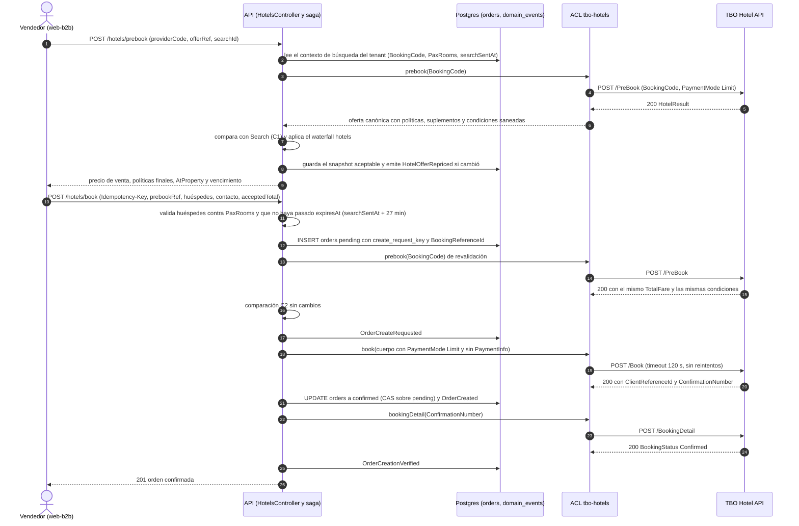

# TBO Hotels — PreBook y Book

Este documento cubre el tramo con dinero del flujo TBO: `PreBook` (revalidación de precio, disponibilidad y condiciones finales) y `Book` (confirmación y voucher), incluido el protocolo obligatorio de recuperación con `BookingDetail` cuando el `Book` no contesta. También explica cómo encaja cada paso en el flujo de hoteles actual del repo y en la saga de órdenes.

Las fuentes y su procedencia están en [00-fuentes.md](./00-fuentes.md). Lo que no se repite aquí está en:

| Tema                                                                                                   | Documento                                                                                                    |
| ------------------------------------------------------------------------------------------------------ | ------------------------------------------------------------------------------------------------------------ |
| Transporte, Basic Auth, `Status.Code` frente a HTTP, redacción de logs, breaker por cuenta             | [01-autenticacion-conectividad-y-errores.md](./01-autenticacion-conectividad-y-errores.md)                   |
| Search, contexto de búsqueda, `BookingCode`, oferta canónica, dinero, mapeo de políticas y suplementos | [02-search-y-oferta-canonica.md](./02-search-y-oferta-canonica.md)                                           |
| Respuesta completa de `BookingDetail`, `Cancel`, HCN, conciliación por fecha                           | [04-post-venta-detalle-cancelacion-y-conciliacion.md](./04-post-venta-detalle-cancelacion-y-conciliacion.md) |
| Registry, factory, módulo y contrato neutral de hoteles                                                | [06-seams-integracion-repo.md](./06-seams-integracion-repo.md)                                               |
| Casos 1 a 8 y entrega de RQ/RS                                                                         | [07-certificacion.md](./07-certificacion.md)                                                                 |
| Decisiones consolidadas                                                                                | [08-requisitos-maestro.md](./08-requisitos-maestro.md)                                                       |
| Tareas y orden                                                                                         | [09-plan-implementacion.md](./09-plan-implementacion.md)                                                     |
| Preguntas abiertas a TBO                                                                               | [10-preguntas-para-tbo.md](./10-preguntas-para-tbo.md)                                                       |

**Convención de evidencia.** "(p. N)" es la página física del PDF V2.1. Cada afirmación sobre una fuente lleva una etiqueta: **VERIFICADO-PDF**, **VERIFICADO-POSTMAN**, **VERIFICADO-CERT**, **VERIFICADO-CODIGO** o **INFERIDO**. Los bloques marcados **Postura** son decisiones de diseño nuestras: no son hechos sobre el contrato y no llevan etiqueta de evidencia. Los ejemplos marcados **PROPUESTA** son código o JSON que todavía no existe.

---

## 0. Resumen

1. `PreBook` recibe solo `BookingCode` y `PaymentMode` (p. 19) VERIFICADO-PDF. Nosotros enviamos siempre `"PaymentMode": "Limit"`. `NewCard` y `SavedCard` quedan fuera por D1 (§7).
2. La respuesta de `PreBook` trae las **políticas de cancelación y las normas finales** del itinerario (Key Points, p. 71) VERIFICADO-PDF. No trae indicador de cambio de precio, id propio ni vencimiento (p. 20–32) VERIFICADO-PDF. La detección de cambio de precio es nuestra (§2.9).
3. `RateConditions` llega como texto libre con HTML escapado como entidades (p. 25–26, 30–32) VERIFICADO-PDF. Nunca se renderiza como HTML. Se convierte a texto plano estructurado (§2.4).
4. La restricción "solo se vende con billete aéreo como parte de un paquete" existe **solo como texto** dentro de `RateConditions` (p. 25, 30) VERIFICADO-PDF. La detectamos por heurística y bloqueamos la venta suelta mientras el founder no decida otra cosa (§2.11).
5. `Book` confirma y emite voucher en un solo paso (`BookingType` solo admite `Voucher`, p. 33, 70) VERIFICADO-PDF. No hay reserva en espera.
6. La respuesta de `Book` solo trae `Status`, `ClientReferenceId` y `ConfirmationNumber` (p. 40–41) VERIFICADO-PDF.
7. Si el `Book` falla por timeout, error de red, error HTTP u otra falla, es **obligatorio** llamar a `BookingDetail` con `BookingReferenceId` pasados 120 s (p. 42) VERIFICADO-PDF. Por eso el `BookingReferenceId` se genera y se **persiste antes** del `Book`, y el `Book` nunca se reintenta de forma automática (§3.3, §4).
8. `OrdersService.recordExternalOrder` (`apps/api/src/orders/orders.service.ts:278-322`) no sirve para TBO: persiste después de que el proveedor confirma, sin intent previo. TBO necesita el patrón de intent de vuelos (`insertCreateIntent`, `orders.service.ts:694-799`) VERIFICADO-CODIGO.
9. El timeout de 120 s del `Book` (p. 8) no cabe en una petición HTTP síncrona detrás de Cloudflare. La postura es un `Book` híbrido que responde `202` y sigue en segundo plano (§4.5).
10. La regla ESLint D1 (`eslint.config.mjs:50-75`) cubre archivos `*.request.builder.ts`, pero su lista de claves es camelCase y **no reconocería** los campos PascalCase de TBO (`CardNumber`, `CvvNumber`, `PaymentInfo`) aunque el archivo esté bien nombrado VERIFICADO-CODIGO. Hay que extenderla (§7.3).
11. **Tarifas no reembolsables (decisión del founder del 2026-09-29, APLICADO).** El servidor decide de forma conservadora qué tarifa es no reembolsable (declarada, contradictoria o con el 100 % ya vigente), el checkout la avisa con el monto exacto y el Book exige `nonRefundableAcknowledged`, que queda en la orden y en la auditoría. Quien financia a cada agencia puede bloquearlas (0055) (§2.13).

---

## 1. Alcance y lugar en el flujo

El flujo que exige la certificación es "Search > Prebook > Book> BookingDetails>Cancel(If Required)" (Cert) VERIFICADO-CERT. Todo el recorrido de Search a Book tiene un límite de 30 minutos (p. 8) VERIFICADO-PDF.

| Método                                                             | URL                     | HTTP   | Timeout recomendado | Evidencia                                                             |
| ------------------------------------------------------------------ | ----------------------- | ------ | ------------------- | --------------------------------------------------------------------- |
| `PreBook`                                                          | `BaseURL/PreBook`       | `POST` | 23 s                | (p. 7, 8, 19) VERIFICADO-PDF; (Postman: PreBook) VERIFICADO-POSTMAN   |
| `Book` (en la tabla de endpoints figura como `HotelBook`)          | `BaseURL/Book`          | `POST` | 120 s               | (p. 7, 8, 32) VERIFICADO-PDF; (Postman: HotelBook) VERIFICADO-POSTMAN |
| `BookingDetail` (solo como paso de recuperación en este documento) | `BaseURL/BookingDetail` | `POST` | No documentado      | (p. 8, 42) VERIFICADO-PDF                                             |

Este documento no cubre la respuesta completa de `BookingDetail` ni el `Cancel`: ver [04](./04-post-venta-detalle-cancelacion-y-conciliacion.md).

---

## 2. PreBook

### 2.1 Request

La tabla del PDF tiene solo tres columnas (`Parameter`, `Type`, `Description`). No declara obligatoriedad ni longitudes (p. 19) VERIFICADO-PDF.

| Campo         | Tipo (PDF)  | Descripción (PDF)                                                                          | Lo que enviamos                                                                                                                                                                 | Evidencia              |
| ------------- | ----------- | ------------------------------------------------------------------------------------------ | ------------------------------------------------------------------------------------------------------------------------------------------------------------------------------- | ---------------------- |
| `BookingCode` | String      | "A unique booking code for the selected bookable unit, as received in the search response" | El `BookingCode` del contexto de búsqueda que el servidor guardó para ese tenant ([02](./02-search-y-oferta-canonica.md)). Nunca un valor que llegue suelto desde el navegador. | (p. 19) VERIFICADO-PDF |
| `PaymentMode` | Enumeration | "Possible Value: Limit, Saved Card and New Card." "Default value; Limit."                  | Siempre el literal `"Limit"`, explícito aunque sea el valor por defecto.                                                                                                        | (p. 19) VERIFICADO-PDF |

- La tabla escribe "Saved Card" y "New Card" con espacio. Los ejemplos y la enumeración usan `SavedCard` y `NewCard` (p. 19–20, 70) VERIFICADO-PDF. No nos afecta: nunca enviamos esos valores.
- `PreBook` no recibe fechas, ocupación, nacionalidad ni moneda (p. 19) VERIFICADO-PDF. Todo eso queda fijado por el `BookingCode` de Search INFERIDO.
- Los ejemplos 7.1.2 y 7.1.3 usan el mismo `BookingCode` con distinto `PaymentMode` (p. 19–20) VERIFICADO-PDF. El modo de pago no está codificado en el `BookingCode` INFERIDO.

Ejemplo de request (Postman: PreBook) VERIFICADO-POSTMAN, JSON válido. Es exactamente la forma que emite nuestro builder:

```json
{
  "BookingCode": "1160804!TB!10!TB!6110a41c-558c-405c-a0d3-6bdd3e131146",
  "PaymentMode": "Limit"
}
```

**Postura.** El builder vive en `providers/tbo-hotels/src/prebook/prebook.request.builder.ts`. Ese nombre cae bajo el glob `**/*.request.builder.ts` de la regla D1 (`eslint.config.mjs:51`) VERIFICADO-CODIGO. El cuerpo se valida con un schema Zod `.strict()` antes de salir (§7.2).

### 2.2 Response: estructura

La tabla del PDF es plana. El anidamiento se reconstruye con los ejemplos 7.2.1 y 7.2.2 (p. 24–32) VERIFICADO-PDF. La página 22 está en blanco (p. 22) VERIFICADO-PDF.

```text
Status { Code, Description }
HotelResult[]                     (1 elemento en los ejemplos)
  HotelCode, Currency
  Rooms[]                         (1 elemento = la unidad reservable; la tabla lo rotula "Room(s);")
    Name[]                        (un nombre por habitación, en orden)
    BookingCode, Inclusion
    DayRates[][] { BasePrice }
    TotalFare, TotalTax
    ExtraGuestCharges             (string en los ejemplos)
    RecommendedSellingRate        (string; opcional)
    RoomPromotion[]
    CancelPolicies[] { Index?, FromDate, ChargeType, CancellationCharge }
    MealType, IsRefundable
    Supplements[][] { Index, Type, Description, Price, Currency }   (opcional)
    WithTransfers
    Amenities[]
  RateConditions[]                (hermano de Rooms, no dentro)
  CreditCardBillingOptions[]      (solo en el ejemplo con NewCard)
```

Qué hacemos con cada campo:

| Ruta                                                                                | Tipo real en el ejemplo        | Tratamiento                                                                                                                                                                                                                                              | Evidencia                                                   |
| ----------------------------------------------------------------------------------- | ------------------------------ | -------------------------------------------------------------------------------------------------------------------------------------------------------------------------------------------------------------------------------------------------------- | ----------------------------------------------------------- |
| `Status.Code`                                                                       | number                         | Fuente de verdad del resultado. Solo `200` es éxito. Ver §2.12.                                                                                                                                                                                          | (p. 20, 24) VERIFICADO-PDF                                  |
| `HotelResult[]`                                                                     | array                          | Exigimos exactamente 1 elemento con el `HotelCode` del contexto. Otra cosa es respuesta inválida.                                                                                                                                                        | (p. 20, 24, 28) VERIFICADO-PDF; la regla es Postura         |
| `HotelResult[].Currency`                                                            | string                         | "Configured currency in the API profile of the client". La moneda sale de la respuesta, nunca de la configuración del tenant.                                                                                                                            | (p. 20) VERIFICADO-PDF                                      |
| `Rooms[]`                                                                           | array                          | Exigimos exactamente 1 elemento. Es la unidad reservable que agrupa todas las habitaciones pedidas.                                                                                                                                                      | (p. 20, 24, 28) VERIFICADO-PDF; cardinalidad INFERIDO       |
| `Rooms[].BookingCode`                                                               | string                         | Es el código que se reenvía al `Book`. En el único par comparable es igual al de Search. Si llega distinto, usamos el de PreBook y emitimos una alerta. → [Q-30](./10-preguntas-para-tbo.md#q-30)                                                        | (p. 17, 28) VERIFICADO-PDF                                  |
| `Rooms[].Name[]`                                                                    | array de string                | Un nombre por habitación, en el orden de `PaxRooms` de Search. Validamos que la longitud sea igual al número de habitaciones.                                                                                                                            | (p. 20) VERIFICADO-PDF                                      |
| `Rooms[].TotalFare`                                                                 | number                         | **Neto** de la unidad completa. Se conserva como decimal exacto (string normalizado), no como float. Es el valor que se reenvía al `Book` (§3.4).                                                                                                        | (p. 21, 24, 28) VERIFICADO-PDF; "neto" INFERIDO             |
| `Rooms[].TotalTax`                                                                  | number                         | Informativo. En los ejemplos `TotalFare ≈ Σ BasePrice + TotalTax`.                                                                                                                                                                                       | (p. 24, 28) VERIFICADO-PDF; la suma es INFERIDO por cálculo |
| `Rooms[].DayRates[][]`                                                              | array de arrays                | Desglose. No se usa para calcular el total.                                                                                                                                                                                                              | (p. 20, 24, 28) VERIFICADO-PDF                              |
| `Rooms[].ExtraGuestCharges`                                                         | string (la tabla dice Decimal) | Coerción tolerante a string o número. Informativo. Ver [02](./02-search-y-oferta-canonica.md).                                                                                                                                                           | (p. 21, 24, 28) VERIFICADO-PDF                              |
| `Rooms[].RecommendedSellingRate`                                                    | string, opcional               | Piso del precio de venta al viajero, recalculado con el valor de PreBook. Con la opción recomendada de D-TBO-16 aplica en todo canal, no solo en B2C ([08](./08-requisitos-maestro.md) RF-12, §9 C-18). Ver [02](./02-search-y-oferta-canonica.md) §9.5. | (p. 21, 28) VERIFICADO-PDF                                  |
| `Rooms[].CancelPolicies[]`                                                          | array de objetos               | Políticas **finales**. Se persisten en el snapshot y se muestran antes de confirmar (§2.5).                                                                                                                                                              | (p. 21, 24, 28, 71) VERIFICADO-PDF                          |
| `Rooms[].MealType`, `IsRefundable`, `WithTransfers`, `Inclusion`, `RoomPromotion[]` | varios                         | Atributos de la oferta. Mapeo en [02](./02-search-y-oferta-canonica.md). Entran en la comparación de condiciones (§2.9).                                                                                                                                 | (p. 20–21, 24) VERIFICADO-PDF                               |
| `Rooms[].Supplements[][]`                                                           | array de arrays                | Un sub-array por habitación. Los `AtProperty` se muestran antes o en el paso de reserva (§2.6).                                                                                                                                                          | (p. 23, 28–29, 71) VERIFICADO-PDF                           |
| `Rooms[].Amenities[]`                                                               | array de string                | La tabla dice "del hotel", pero el ejemplo lo pone dentro de la habitación. Se muestra como lista (§2.7).                                                                                                                                                | (p. 23, 24–25) VERIFICADO-PDF                               |
| `HotelResult[].RateConditions[]`                                                    | array de string                | Saneo obligatorio (§2.4). Detección de "solo paquete" (§2.11).                                                                                                                                                                                           | (p. 23, 25–26, 30–32) VERIFICADO-PDF                        |
| `HotelResult[].CreditCardBillingOptions[]`                                          | array de objetos               | No se modela, no se persiste, no se loguea (§2.8).                                                                                                                                                                                                       | (p. 23, 26–27) VERIFICADO-PDF                               |

**Postura sobre el schema Zod de la respuesta.** Es tolerante donde el contrato se contradice (montos como número o string, `Supplements` ausente, `Index` como string o número, enums abiertos con valor de reserva). Es estricto donde nos jugamos dinero: `Status.Code` numérico, exactamente un `HotelResult` y un elemento en `Rooms`, `TotalFare` decimal no negativo, `Currency` de 3 letras. Las claves no declaradas no pasan al resultado del mapper; solo sus nombres se registran, nunca sus valores ([08](./08-requisitos-maestro.md) RNF-12). Así `CreditCardBillingOptions` no llega nunca al dominio.

### 2.3 Ejemplo de respuesta (7.2.2, modo Limit, recortado)

JSON válido tal como aparece en el PDF (p. 27–32) VERIFICADO-PDF. Las comillas de "Tourism Dirham" son tipográficas dentro de un string, así que no rompen el JSON. Se recortó `Amenities`, se omitieron varios ítems de `RateConditions` (entre ellos el de "Tourism Dirham") y se cortó el de "Mandatory Fees":

```json
{
  "Status": { "Code": 200, "Description": "Successful" },
  "HotelResult": [
    {
      "HotelCode": "1120548",
      "Currency": "USD",
      "Rooms": [
        {
          "Name": ["Luxury Room, 2 Twin Beds", "Luxury Room, 2 Twin Beds"],
          "BookingCode": "1120548!TB!4!TB!9a47646b-1bba-4746-91d5-969149db1185",
          "Inclusion": "Free WiFi",
          "DayRates": [[{ "BasePrice": 124.756485 }], [{ "BasePrice": 124.756485 }]],
          "TotalFare": 305.75,
          "TotalTax": 56.24,
          "ExtraGuestCharges": "6.45",
          "RecommendedSellingRate": "321.34",
          "RoomPromotion": ["Private sale", "Private sale"],
          "CancelPolicies": [
            {
              "FromDate": "05-05-2022 00:00:00",
              "ChargeType": "Percentage",
              "CancellationCharge": 100.0
            }
          ],
          "MealType": "Room_Only",
          "IsRefundable": false,
          "Supplements": [
            [
              {
                "Index": 1,
                "Type": "AtProperty",
                "Description": "mandatory_tax",
                "Price": 20.0,
                "Currency": "AED"
              }
            ],
            [
              {
                "Index": 2,
                "Type": "AtProperty",
                "Description": "mandatory_tax",
                "Price": 20.0,
                "Currency": "AED"
              }
            ]
          ],
          "WithTransfers": false,
          "Amenities": ["Non-Smoking", "Free bottled water"]
        }
      ],
      "RateConditions": [
        "Early check out will attract full cancellation charge unless otherwise specified.",
        "Please note that this a special rate which should be sold only with an airline ticket as part of a package.",
        "CheckIn Time-Begin: 3:00 PM ",
        "Mandatory Fees: &lt;p&gt;You'll be asked to pay the following charges at the property:&lt;/p&gt; &lt;ul&gt;&lt;li&gt;A tax is imposed by the city: AED 20.00 per accommodation, per night&lt;/li&gt;&lt;/ul&gt; "
      ]
    }
  ]
}
```

El ejemplo 7.2.1 (p. 23–27) no sirve como fixture de precio: su `CreditCardBillingOptions` dice 85.822 USD con `TotalFare` 17.10 USD y coincide con el `Book` 8.1.1, que es otra reserva (p. 24, 26, 35) VERIFICADO-PDF. Ninguno de los dos pares request/response del capítulo 7 se corresponde entre sí (p. 19, 24, 28) VERIFICADO-PDF.

### 2.4 `RateConditions`: saneo y presentación

**Lo que dice el contrato.** Es una lista de strings, "Hotel/Room norms associated with the bookable unit" (p. 23) VERIFICADO-PDF. En los ejemplos trae:

- prefijos informales con espacios inconsistentes (`"CheckIn Time-Begin: 3:00 PM "`, `" CheckIn Time-End: 3:00 AM"`, `"Minimum CheckIn Age : 15"`) (p. 26, 30) VERIFICADO-PDF;
- HTML escapado como entidades (`&lt;ul&gt;&lt;li&gt;…`) (p. 26, 30–31) VERIFICADO-PDF;
- ítems que mezclan HTML escapado con listas separadas por comas (p. 31–32) VERIFICADO-PDF;
- un enlace externo en texto (`http://mytravelagent.online/termsofuse.pdf`) (p. 26, 30) VERIFICADO-PDF;
- en `BookingDetail`, caracteres de reemplazo (`�`) en lugar de un apóstrofo (p. 51) VERIFICADO-PDF.

Por el Key Point 3, estas "Norms" de PreBook son finales (p. 71) VERIFICADO-PDF. Que "Norms" sea `RateConditions` es INFERIDO por la descripción de p. 23.

**Postura: el HTML del proveedor nunca se renderiza.** El ACL convierte cada ítem a texto plano estructurado, en este orden:

1. Si el campo falta o es `null`, se toma `[]`. Cada ítem se procesa por separado.
2. Normalización Unicode NFC. Los espacios no separables se convierten en espacios.
3. Decodificación de entidades HTML **una sola vez** (nombradas y numéricas). Nunca de forma recursiva: una segunda pasada convertiría `&amp;lt;script&amp;gt;` en marcado activo.
4. Conversión de estructura a texto: `<li>` pasa a línea que empieza con `• `; `<br>`, `</p>` y `</ul>` pasan a salto de línea. Cualquier otra etiqueta se elimina con su contenido si es `script` o `style`, y sin su contenido en los demás casos. No se conserva ningún atributo.
5. Espacios colapsados y bordes recortados. No se parte por comas: rompería frases.
6. Las URLs quedan como texto, no como enlaces.
7. Clasificación heurística por prefijo en `checkIn`, `checkOut`, `minCheckInAge`, `mandatoryFees`, `optionalFees`, `cardsAccepted`, `specialInstructions` u `other`. Los valores extraídos (hora de check-in, edad mínima) son ayuda visual. El texto completo se conserva siempre.
8. Detección de señales críticas: tarifa solo paquete (§2.11), "No Name change allowed" (p. 51), restricciones de mercado ("NOT VALID FOR Germany Market", p. 51) VERIFICADO-PDF. Cada señal se guarda como código cerrado en la oferta.
9. Se persisten las dos versiones en el snapshot de la reserva: el original tal como llegó (auditoría y disputas, KP-3) y la versión saneada (lo que se muestra).

Presentación por canal:

| Canal             | Regla                                                                                                                                                                                                                 |
| ----------------- | --------------------------------------------------------------------------------------------------------------------------------------------------------------------------------------------------------------------- |
| web-b2b / web-b2c | Texto plano en componentes React con escape por defecto. Prohibido `dangerouslySetInnerHTML` con este contenido. Bloque colapsable. Las señales críticas y los cargos en destino van arriba, fuera del colapsable.    |
| WhatsApp          | Texto plano. Antes de confirmar, el bot enuncia siempre las políticas de cancelación, los suplementos `AtProperty` y las señales críticas. El resto de las condiciones se ofrece como enlace al detalle en el portal. |
| Voucher y email   | Texto plano, completo.                                                                                                                                                                                                |

**Postura sobre la duplicación.** "Mandatory Fees" en `RateConditions` repite en texto el suplemento `AtProperty` (p. 29, 31) VERIFICADO-PDF. Se muestran los dos (el texto puede traer detalle que el suplemento no tiene), pero nunca se suman al total cobrado.

### 2.5 Políticas de cancelación finales

- "Cancellation Policy and Norms received in the PreBook response will be considered as final for the booking itinerary." (p. 71) VERIFICADO-PDF.
- Search solo trae las políticas detalladas ("detailed cancel policies") con `IsDetailedResponse: true` (p. 11), y TBO recomienda enviarlo en `False` (p. 71) VERIFICADO-PDF. En el flujo recomendado, PreBook es el primer momento en que se conocen las políticas INFERIDO.
- Cada tramo trae `FromDate` (formato `DD-MM-YYYY HH:mm:ss` sin zona horaria: la tabla solo dice "Cancel policy start date" y el formato sale de los ejemplos, donde `15-10-2021` en p. 50 descarta `MM-DD`), `ChargeType` (`Fixed` o `Percentage` en los ejemplos) y `CancellationCharge`. `Index` identifica la habitación y, si falta, la política aplica a toda la reserva (p. 21, 24, 28, 50) VERIFICADO-PDF.

**Postura.** Las políticas del PreBook que precede inmediatamente al `Book` se guardan en `orders.selected_offer` como parte del snapshot. Se muestran antes de confirmar con el aviso de que las fechas corresponden a la hora del hotel. La conversión al modelo canónico (inicio de tramo a fin de tramo, porcentaje a importe, zona horaria, margen de seguridad) está en [02](./02-search-y-oferta-canonica.md). El cálculo del cargo al cancelar está en [04](./04-post-venta-detalle-cancelacion-y-conciliacion.md). Desde el 2026-09-29, con esas mismas políticas el servidor decide si la tarifa es no reembolsable en los hechos, y una reembolsable cuyo 100 % ya rige se trata como no reembolsable (§2.13).

### 2.6 Suplementos y cargos en destino

- `Type`: `Included` ("price included in total") o `AtProperty` ("charges need to be paid at the hotel") (p. 23) VERIFICADO-PDF.
- "Please ensure same are visible to end customer." (p. 23) y "Kindly display the mandatory supplements i.e, AtProperty before/at the booking step" (p. 71) VERIFICADO-PDF.
- La moneda del suplemento puede diferir de la de la reserva (AED frente a USD en 7.2.2) (p. 28–29) VERIFICADO-PDF.
- La certificación exige un caso con suplementos, el caso 7 (Cert) VERIFICADO-CERT.

**Postura.** La pantalla de confirmación, el mensaje de WhatsApp previo a confirmar y el voucher muestran cada `AtProperty` con su importe y moneda originales, como "a pagar en el hotel". Nunca se suman al precio cobrado. El `Book` se rechaza en el servidor si el snapshot aceptado tiene `AtProperty` y la petición no declara que se mostraron (`atPropertyAcknowledged: true`). Así la regla KP-4 no depende solo de la interfaz. El modelo canónico de cargos en destino está en [02](./02-search-y-oferta-canonica.md).

### 2.7 Otros campos de la oferta

- `Amenities`: lista de textos libres dentro de la habitación. Se agregó en v1.5 (p. 5, 23–25) VERIFICADO-PDF. Se muestra como lista. El límite de largo por ítem del canónico se trata en [02](./02-search-y-oferta-canonica.md).
- `Inclusion` es un string único; `RoomPromotion` es un texto por habitación; `WithTransfers` es booleano (p. 20–21) VERIFICADO-PDF.
- `MealType` usa la enumeración de p. 70. La tabla de PreBook solo lista tres valores y el ejemplo usa `Room_Only`, que no está entre ellos (p. 21, 24, 70) VERIFICADO-PDF. Mapeo tolerante en [02](./02-search-y-oferta-canonica.md).

### 2.8 `CreditCardBillingOptions`: no aplica

- "Applicable in case of mode of payment is Credit Card. Provides a list of supported currencies with equivalent Booking Amount and convenience charges" (p. 23) VERIFICADO-PDF.
- Los subcampos `Amount`, `Currency` y `ConvenienceCharges` solo aparecen en el ejemplo NewCard (p. 26–27) VERIFICADO-PDF. El ejemplo Limit no lo trae (p. 27–32) VERIFICADO-PDF.
- En `Book` con `NewCard`, `BillingAmount` y `BillingCurrency` coinciden con una de esas opciones (61.93 GBP, p. 26 y 35) VERIFICADO-PDF. La semántica es INFERIDO.

**Postura.** Con `Limit` no se usa. El schema de respuesta no lo declara, así que Zod lo descarta. Si alguna vez llega con `Limit`, se registra una métrica de conteo, sin contenido, porque delataría un perfil de cuenta mal configurado.

### 2.9 Detección de cambio de precio

**Contrato.** El propósito de PreBook es "request up-to-date availability and prices" (p. 19) VERIFICADO-PDF. No existe ningún campo de cambio de precio ni precio anterior (p. 20–23) VERIFICADO-PDF. Tampoco se documenta qué hace el `Book` si el `TotalFare` enviado difiere del vigente (p. 33) VERIFICADO-PDF.

Único par comparable del PDF, mismo `BookingCode` (Search 6.2.2 en p. 17, PreBook 7.2.2 en p. 28) VERIFICADO-PDF:

| Campo                    | Search   | PreBook  |
| ------------------------ | -------- | -------- |
| `TotalFare`              | 305.75   | 305.75   |
| `TotalTax`               | 56.24    | 56.24    |
| `ExtraGuestCharges`      | "17.22"  | "6.45"   |
| `RecommendedSellingRate` | "321.34" | "321.34" |

No se sabe si la diferencia de `ExtraGuestCharges` es un cambio real o un error de edición del documento INFERIDO.

**Postura: comparamos nosotros, en dos momentos.**

| Momento                                                               | Qué se compara                                                                                                                             | Contra qué                                                                                                       |
| --------------------------------------------------------------------- | ------------------------------------------------------------------------------------------------------------------------------------------ | ---------------------------------------------------------------------------------------------------------------- |
| C1: PreBook de la pantalla de confirmación                            | `TotalFare` y `Currency`; `IsRefundable`, `MealType`, conjunto de `Supplements` `AtProperty` (`Index`, `Description`, `Price`, `Currency`) | El resultado de Search guardado en el contexto de búsqueda del servidor ([02](./02-search-y-oferta-canonica.md)) |
| C2: PreBook de revalidación dentro de la saga, justo antes del `Book` | Lo mismo que C1, más `CancelPolicies`, señales críticas de `RateConditions` y el hash del texto saneado                                    | El snapshot que el vendedor aceptó en C1                                                                         |

Reglas:

1. Los importes se comparan como decimales exactos, sin tolerancia. `305.75` y `305.750` son iguales; `305.75` y `305.76` no.
2. El resultado es `UNCHANGED`, `DECREASED`, `INCREASED` o `CONDITIONS_CHANGED`. Si cambian a la vez el precio y las condiciones, prevalece `CONDITIONS_CHANGED`.
3. Todo resultado distinto de `UNCHANGED` emite el evento de dominio `HotelOfferRepriced`. El payload lleva código de proveedor, importes en unidades menores, moneda y categoría. No lleva PII ni texto del proveedor (misma regla que `apps/api/src/orders/order-events.ts:3-14`) VERIFICADO-CODIGO.
4. En C1, cualquier resultado distinto de `UNCHANGED` se muestra de forma visible antes de continuar.
5. En C2, el servidor recalcula el **precio de venta** con el waterfall `hotels` sobre el neto nuevo y lo compara con el precio de venta que el vendedor aceptó (`acceptedTotal`). Si sube o si cambian las condiciones, responde `409` con los valores nuevos y no llama al `Book`. Es el mismo principio que vuelos: "La verificación de la pantalla es UX; ésta es la puerta de integridad" y "Nunca se confía en `offer.pricing` recibido del navegador" (`apps/api/src/orders/orders.service.ts:362-365`) VERIFICADO-CODIGO. Qué hacer si baja es la decisión D-03-C (§12).
6. El `TotalFare` que viaja al `Book` es siempre el del PreBook de C2 (§3.4).

### 2.10 Ventana de 30 minutos

- "To complete the entire booking process i.e., from search to book, the timeout is 30 minutes." (p. 8) VERIFICADO-PDF.
- `BOOKINGCODE_EXPIRED` = `315`, "Session expired between search to book." (p. 9) VERIFICADO-PDF.
- No hay campo de vencimiento en la respuesta de PreBook, ni se dice si PreBook reinicia el reloj (p. 20–32) VERIFICADO-PDF. → [Q-29](./10-preguntas-para-tbo.md#q-29)

**Postura** (la de [01](./01-autenticacion-conectividad-y-errores.md) §6.3, [08](./08-requisitos-maestro.md) RF-09 y §9 C-17).

1. El reloj corre desde el envío del Search, no desde el PreBook. `searchSentAt` se guarda en el contexto de búsqueda del servidor.
2. `expiresAt = searchSentAt + 27 min`: los 30 minutos de p. 8 menos los 120 s del `Book` y 60 s de margen. Es un solo vencimiento visible para el vendedor, que ya incluye el margen del `Book`. La interfaz lo muestra como cuenta regresiva y avisa a los 20 minutos.
3. Pasado `expiresAt` no se llama a PreBook ni se encola el `Book`: el adapter lanza `TboOfferExpiredError` sin llamar a TBO y se pide volver a buscar.
4. Un `315` recibido invalida el contexto de búsqueda de ese `BookingCode`.
5. Qué pasa si la sesión vence mientras un `Book` está en vuelo no está documentado. → [Q-29](./10-preguntas-para-tbo.md#q-29). Mientras tanto, el margen del punto 2 lo evita.

### 2.11 Tarifas "solo paquete con aéreo"

**Contrato.** En los dos ejemplos de PreBook aparece: "Please note that this a special rate which should be sold only with an airline ticket as part of a package." (p. 25, 30) VERIFICADO-PDF. No existe ningún campo estructurado con esa restricción (p. 20–23) VERIFICADO-PDF. Search no trae `RateConditions`, así que la restricción recién se conoce en el PreBook INFERIDO.

**Postura.**

1. El ACL detecta la restricción sobre el texto saneado, sin distinguir mayúsculas, con un patrón conservador: frases con "sold only with" y "airline ticket", "flight ticket" o "air ticket", o bien "as part of a package". Si detecta, la oferta lleva la restricción `PACKAGE_WITH_FLIGHT_ONLY`.
2. Con la restricción, el servidor rechaza el `Book` de una reserva de hotel suelta con un error tipado (`TboPackageOnlyRateError`). Solo se permitiría dentro de una orden o cotización que incluya un vuelo del mismo viaje. Hoy el repo no tiene reservas de paquete que vinculen vuelo y hotel, así que en la práctica la tarifa no se vende. Ver D-03-D (§12).
3. La detección es heurística: puede fallar si TBO cambia la redacción o el idioma. Cada detección y cada texto que contenga "package" sin haber disparado la regla se cuentan como métrica, para revisar falsos negativos.
4. → [Q-31](./10-preguntas-para-tbo.md#q-31): si hay un indicador estructurado y cuál es la consecuencia contractual de vender la tarifa sin aéreo.

### 2.12 Errores de PreBook

El capítulo 7 no incluye ningún ejemplo de error (p. 18–32) VERIFICADO-PDF. La tabla de códigos no asigna códigos a métodos (p. 8–10) VERIFICADO-PDF. Qué códigos devuelve PreBook es INFERIDO.

| `Status.Code`                                  | Tratamiento en PreBook                                                                                                                                                                           |
| ---------------------------------------------- | ------------------------------------------------------------------------------------------------------------------------------------------------------------------------------------------------ |
| `200`                                          | Éxito si el cuerpo pasa el schema (§2.2).                                                                                                                                                        |
| `201`, `207`                                   | Oferta ya no disponible. Se invalida la oferta y se pide volver a buscar.                                                                                                                        |
| `315`                                          | Ventana vencida (§2.10).                                                                                                                                                                         |
| `300`, `402`                                   | Problema de la cuenta TBO del titular de la credencial (§6).                                                                                                                                     |
| `400`, `401`                                   | Error nuestro o de credenciales. Alerta. No se reintenta.                                                                                                                                        |
| `429`, `500` o conexión rechazada              | Como PreBook no mueve dinero, se permite **un** reintento solo si el primer fallo fue rápido y el total no pasa de 23 s ([08](./08-requisitos-maestro.md) §9 C-24). Si falla, error al vendedor. |
| Timeout o error de red a mitad de la respuesta | Sin reintento: dos intentos de 23 s serían demasiada espera. Error al vendedor, que puede volver a pedir el PreBook.                                                                             |

La relación entre `Status.Code` y el código HTTP, y la forma del cuerpo de error, están en [01](./01-autenticacion-conectividad-y-errores.md).

### 2.13 Tarifas no reembolsables (APLICADO, 2026-09-29)

**Decisión del founder del 2026-09-29.** Pedido explícito: máxima claridad, para las agencias y para todos, sobre las
tarifas de hotel que no se reembolsan. Quedó registrado como
[D-TBO-39](./08-requisitos-maestro.md#d-tbo-39--cómo-se-venden-las-tarifas-no-reembolsables), con el requisito
[RF-41](./08-requisitos-maestro.md#rf-41--tarifas-no-reembolsables-aviso-confirmación-obligatoria-y-permiso-por-agencia).
Commits `5956426` (resultados) y `415ef53` (API, checkout, post-venta y permiso), en la rama `feat/hotels-redesign`.
El modelo del permiso, visto desde la red, está en
[platform/12 §11](../platform/12-modelo-consolidador-y-plan.md#11--tarifas-no-reembolsables-aviso-confirmación-obligatoria-y-control-por-agencia-2026-09-29).

**Qué es "no reembolsable".** Lo decide el servidor (`apps/api/src/hotels/hotel-non-refundable.ts`, sin I/O) con la
política FINAL del PreBook y la hora de ahora, siempre del lado que cuesta menos equivocarse. La web usa la misma
lectura (`rate-refundability.ts`) con la hora del servidor, para que la pantalla y el servidor no discrepen sobre si
una tarifa exige la confirmación.

- **Declarada no reembolsable** (`refundable: false` o `status: 'non_refundable'`), digan lo que digan los tramos.
  Ante la contradicción de TBO, `IsRefundable=false` con tramos a 0 (p. 50) VERIFICADO-PDF, gana lo conservador: no
  reembolsable (→ [Q-26](./10-preguntas-para-tbo.md#q-26)). El ACL guarda los dos datos sin derivar uno del otro
  (RF-11).
- **Reembolsable con el cargo del 100 % ya vigente**: cancelar cuesta lo mismo, así que se trata igual. Los tramos
  están en hora local del hotel sin zona (§2.5; → [Q-24](./10-preguntas-para-tbo.md#q-24)) y se comparan contra la
  hora local más adelantada del planeta (UTC+14): si el 100 % puede estar rigiendo, rige. Con tramos por habitación,
  cuenta cuando todas cobran el 100 %. Un importe fijo es el total sólo si es de toda la reserva, en la moneda del
  neto y no menor que él. Un tramo sin fecha local no se puede ubicar y no cuenta.
- **El 100 % es el precio de VENTA**, no el neto de TBO: es lo que se retiene de la cartera de la agencia (RF-23) y lo
  que la agencia le responde a su cliente.

**Resultados y detalle.** La etiqueta "No reembolsable" va con el color de advertencia en la tarjeta y en cada
tarifa. Hay un filtro "Solo reembolsables", que también deja afuera las que ya cobran el 100 %, y la tarjeta avisa
"Este hotel no tiene tarifas reembolsables para estas fechas" cuando no hay ninguna. En el detalle, cada no
reembolsable dice el 100 % con su monto y su moneda. Si la agencia las tiene bloqueadas, la tarifa se ve como "No
disponible para tu agencia" y no se ofrece reservarla.

**PreBook.**

- Con el permiso de la agencia bloqueado (abajo), el PreBook responde 403 `NON_REFUNDABLE_BLOCKED`. Si la búsqueda ya
  mostró la tarifa como no reembolsable, lo hace sin llamar a TBO. Si recién lo es con la política final (o con el
  100 % ya vigente), lo hace sin guardar el snapshot, así que no queda con qué reservarla.
- Si no está bloqueado, la respuesta lleva `nonRefundable`: `reason` (`declared` o `full-penalty-in-force`), `penalty`
  en el precio de venta y, si aplica, `fullPenaltySinceLocal`.
- El paso 1 del checkout muestra el aviso grande "Tarifa no reembolsable", con el monto como protagonista: si se
  cancela, se modifica o el pasajero no se presenta, se cobra el 100 %; no se recupera; se descuenta de la cartera o
  del crédito de la agencia en esa moneda; y la agencia responde ante su cliente. Debajo va la política completa en
  hora local del hotel, tal como la confirma el PreBook (§2.5).

**Book.**

- El cuerpo neutral de `POST /hotels/book` suma `nonRefundableAcknowledged` (Zod, opcional). El paso 2 del checkout lo
  manda sólo con la casilla OBLIGATORIA marcada: "Entiendo que esta tarifa no es reembolsable: si se cancela,
  modifica o el pasajero no se presenta, se cobra el 100 % (321,34 US$)", con el monto exacto de la tarifa. Al lado va
  el recordatorio de revisar nombres y fechas, porque un error sólo se corrige cancelando. Si el monto cambia (un
  precio nuevo aceptado en ese paso), la casilla vuelve a quedar sin marcar.
- El servidor lo decide otra vez con el snapshot y la hora de ahora, antes de abrir la orden. Con el permiso bloqueado
  responde 403 `NON_REFUNDABLE_BLOCKED`. Sin el reconocimiento, 400 `NON_REFUNDABLE_NOT_ACKNOWLEDGED`, con `penalty`,
  `nonRefundableReason` y `fullPenaltySinceLocal` en `details` para que la web pinte el aviso.
- Después del PreBook de revalidación (C2, §2.9) lo comprueba de nuevo con la tarifa revalidada: si pasó a cobrar el
  100 % en el medio, exige lo mismo. En ninguno de esos casos sale nada a TBO.
- La orden guarda en `selected_offer.nonRefundable` el motivo, el 100 %, la política aceptada (tramos en hora local
  del hotel y su origen) y la confirmación: quién (`acknowledgedBy`), cuándo (`acknowledgedAt`) y sobre qué monto
  (`acknowledgedAmount`).
- El evento `HotelNonRefundableAcknowledged` va sobre la orden, antes de `OrderCreateRequested` y del Book: actor,
  proveedor, hotel, referencia de reserva, motivo, el 100 % en unidades menores con su moneda, momento, huella de las
  condiciones y la política como tramos. No lleva PII ni texto del proveedor. `OrderCreateRequested` suma
  `nonRefundable` con el motivo.

**Después de reservar.** _Mis Reservas_ dice "No reembolsable" en la lista y en el detalle, con el momento en que el
vendedor lo confirmó. El voucher lo dice sin importes. El correo de confirmación de hotel tiene su propia plantilla,
con el recuadro "Tarifa no reembolsable" y el monto exacto con centavos, y lo repite en el asunto. Cancelar una no
reembolsable (o una cuyo cargo vigente ya es el total) dice que cuesta el 100 % con el monto y pide doble
confirmación: la casilla que nombra el monto y, después, un último paso que lo repite antes de enviar.

**Permiso por agencia ([0055](../../db/migrations/0055_non_refundable_rates_permission.sql)).** "Puede reservar
tarifas no reembolsables" lo fija quien financia al nodo, con el mismo modelo que las carteras (`can_finance_tenant`,
0052): el superadmin desde _Gestión de Agencias_ → nodo → _Carteras_, y el consolidador o la agencia desde _Mi Red_ →
nodo → _Carteras_. Nunca el propio nodo.

- `allowed` es lo de siempre, con la confirmación obligatoria, y rige sin fila. `blocked` rige para el nodo y para
  todo lo que cuelga de él (`non_refundable_rates_block` dice si es propio o heredado).
- Cada cambio pide motivo (Zod) y deja `booking.permissions.non_refundable_rates.changed` en la misma transacción.
  `tenant_booking_permissions` tiene RLS forzada: la escribe sólo quien financia, firmada por el usuario que actúa, y
  `app_user` no borra filas.
- API: `GET` y `PUT /tenants/:tenantId/booking-permissions` para quien financia (403
  `BOOKING_PERMISSIONS_FINANCIER_REQUIRED` a cualquier otro). `GET /hotels/booking-permissions` y `nonRefundableRates`
  en el sobre de `POST /hotels/availability` son para la pantalla: marcan, no filtran.
- Si el permiso no se puede leer, el PreBook y el Book de una no reembolsable fallan: no se reserva sin saberlo. La
  búsqueda, en cambio, sale igual, sin `nonRefundableRates`.

**Flujo directo de Despegar** (`choiceId` / `prebookId`, sólo por API). No informa la política antes de reservar.
Con el permiso bloqueado se rechaza entero con 403 `NON_REFUNDABLE_BLOCKED`; con el permiso permitido no puede exigir
la casilla porque no sabe qué tarifa lo es. Se cierra cuando Despegar pase al contrato neutral con órdenes (D-TBO-08).

**Pendientes.** No hay cotización de hotel para el cliente en la web (sólo la de vuelos): cuando exista, tiene que
decir "No reembolsable" como el voucher. Cuando WhatsApp venda hoteles, el bot tiene que enunciar el 100 % con su
monto y pedir la confirmación antes del Book: el servidor ya la exige a cualquier canal.

**Tests.** API: `hotel-non-refundable.test.ts`, `hotel-prebook.service.test.ts`, `hotel-booking.service.test.ts`,
`hotels.controller.test.ts`, `templates.hotel.test.ts` y `booking-permissions.integration.test.ts`, que corre como
`app_user`. Web: `rate-refundability.test.ts`, `non-refundable-view.test.ts`, `hotel-cancellation-view.test.ts`,
`hotel-order-view.test.ts`, `hotel-voucher.test.ts` y `booking-permissions.test.ts`.

---

## 3. Book

### 3.1 Request completo

Tipos y descripciones: (p. 32–34) VERIFICADO-PDF. No hay columna de obligatoriedad. La columna "Origen en la plataforma" es Postura.

| Campo                               | Tipo (PDF)  | Descripción (PDF)                                                       | Origen en la plataforma                                                                        |
| ----------------------------------- | ----------- | ----------------------------------------------------------------------- | ---------------------------------------------------------------------------------------------- |
| `BookingCode`                       | String      | "same as received in the search response"                               | `Rooms[0].BookingCode` del PreBook de C2.                                                      |
| `CustomerDetails[]`                 | Array       | "Array of object"                                                       | Un elemento por habitación, en el orden de `PaxRooms` del contexto de búsqueda (§3.2).         |
| `CustomerDetails[].CustomerNames[]` | Array       | "Array of number of guests per room."                                   | Todos los huéspedes de esa habitación, adulto líder primero.                                   |
| `…CustomerNames[].Title`            | String      | "Possible Values; 'Mr', 'Mrs', 'Ms'"                                    | Se captura de forma explícita en el formulario. No se deriva del género.                       |
| `…CustomerNames[].FirstName`        | String      | "Lead guest first name"                                                 | Normalizado (§3.2).                                                                            |
| `…CustomerNames[].LastName`         | String      | "Lead guest last name"                                                  | Normalizado (§3.2).                                                                            |
| `…CustomerNames[].Type`             | String      | "Possible Values: 'Adult', 'Child'"                                     | Sale del hueco de `PaxRooms` que ocupa el huésped: adulto a `Adult`, niño o infante a `Child`. |
| `ClientReferenceId`                 | String      | "Client reference number."                                              | Generado por el servidor (§3.3).                                                               |
| `BookingReferenceId`                | String      | "Booking Reference number"                                              | Generado y persistido en el intent **antes** del `Book` (§3.3).                                |
| `TotalFare`                         | Decimal     | "Total fare for the booking."                                           | `TotalFare` del PreBook de C2, decimal exacto (§3.4).                                          |
| `EmailId`                           | String      | "Email id of the guest"                                                 | Según D-03-E (§3.5).                                                                           |
| `PhoneNumber`                       | String      | "Phone number of the guest"                                             | Según D-03-E, solo dígitos con prefijo de país (§3.5).                                         |
| `BookingType`                       | Enumeration | "Default Value : Voucher"                                               | Constante `"Voucher"`.                                                                         |
| `PaymentMode`                       | Enumeration | "Possible Values; Limit, SavedCard and NewCard." "Default Value: Limit" | Constante `"Limit"`.                                                                           |
| `PaymentInfo` y sus hijos           | Object      | Datos de tarjeta                                                        | **Nunca.** El tipo lo declara `?: never` (§7).                                                 |

El request del `Book` no lleva edad de los niños, nacionalidad, fechas, hotel, observaciones ni datos fiscales (p. 32–34) VERIFICADO-PDF. Todo eso queda fijado por el `BookingCode` INFERIDO. Por eso el contexto de búsqueda del servidor es obligatorio y no puede venir del navegador.

### 3.2 `CustomerDetails` y `CustomerNames`: reglas e inconsistencias

Lo que muestra el contrato:

| Hecho                                                                                                                                                     | Evidencia                               |
| --------------------------------------------------------------------------------------------------------------------------------------------------------- | --------------------------------------- |
| Los ejemplos "MULTIPLE ROOM" traen 2 elementos en `CustomerDetails` y el "SINGLE ROOM" trae 1                                                             | (p. 34–40) VERIFICADO-PDF               |
| Los ejemplos nombran a **todos** los huéspedes, niños incluidos: 8.1.1 manda 1 adulto y 1 niño; 8.1.4 manda 2 habitaciones con 1 adulto y 1 niño cada una | (p. 34, 39–40) VERIFICADO-PDF           |
| Las columnas dicen "Lead guest first name" y "Lead guest last name" aunque se envían por cada huésped                                                     | (p. 32–33) VERIFICADO-PDF               |
| Los niños llevan `Mr` o `Ms` en los ejemplos                                                                                                              | (p. 34, 39) VERIFICADO-PDF              |
| Postman usa `"Title": "Dr"`, fuera de la lista del PDF                                                                                                    | (Postman: HotelBook) VERIFICADO-POSTMAN |
| No hay campo que marque al huésped líder. En todos los ejemplos el primero de cada habitación es `Adult`                                                  | (p. 34–40) VERIFICADO-PDF               |
| No hay reglas de largo, caracteres, acentos ni duplicados                                                                                                 | (p. 32–33) VERIFICADO-PDF, por ausencia |
| Las edades de los niños solo van en Search (`ChildrenAges`, 0 a 18; `Children` 1 a 4 por habitación; `Adults` 1 a 8)                                      | (p. 10–11) VERIFICADO-PDF               |
| Un ejemplo de condiciones de un hotel dice "No Name change allowed any time of the year"                                                                  | (p. 51) VERIFICADO-PDF                  |
| La certificación exige casos con niños y con dos habitaciones asimétricas (casos 2, 3, 5 y 6)                                                             | (Cert) VERIFICADO-CERT                  |

**Postura: validación en el servidor antes de insertar el intent.**

1. `CustomerDetails.length` es igual al número de habitaciones de `PaxRooms`. El elemento `i` corresponde a la habitación `i`.
2. En cada habitación, la cantidad de `Adult` es igual a `Adults` y la de `Child` es igual a `Children` del contexto. El primer huésped es `Adult`.
3. Se envían los nombres de todos los huéspedes, niños incluidos, como en los ejemplos y en los casos de certificación.
4. `Title` solo acepta `Mr`, `Mrs` y `Ms`. `Dr` no se acepta hasta que TBO lo confirme. → [Q-41](./10-preguntas-para-tbo.md#q-41). En la interfaz: Sr. a `Mr`, Sra. a `Mrs` y la opción neutra femenina a `Ms`. Para niños se aplica la misma elección, como en los ejemplos.
5. Normalización de nombres: recorte, espacios colapsados, sin dígitos, al menos 2 letras. Según D-03-H, transliteración a ASCII (`José Muñoz` pasa a `Jose Munoz`) conservando el original en `orders.passengers` para el voucher. Se permiten espacio, guion y apóstrofo.
6. Largo máximo provisorio de 40 caracteres por campo, hasta que TBO lo confirme. → [Q-43](./10-preguntas-para-tbo.md#q-43). No se reutilizan los límites de Despegar (`firstName` 28, `lastName` 29 en `apps/api/src/hotels/hotels.schemas.ts:74-75`) VERIFICADO-CODIGO, porque son de otro proveedor.
7. Se rechazan dos huéspedes con el mismo nombre y apellido en la misma reserva, con un mensaje que pide distinguirlos (segundo nombre o sufijo). → [Q-43](./10-preguntas-para-tbo.md#q-43)
8. La interfaz advierte antes de confirmar que el hotel puede no admitir cambios de nombre. El dato sale de la señal de §2.4 si está, y si no, como aviso general.

### 3.3 `ClientReferenceId` y `BookingReferenceId`

**Contrato.**

| Aspecto                              | `ClientReferenceId`                                                             | `BookingReferenceId`                                                                             | Evidencia                                                                                                                                                                   |
| ------------------------------------ | ------------------------------------------------------------------------------- | ------------------------------------------------------------------------------------------------ | --------------------------------------------------------------------------------------------------------------------------------------------------------------------------- |
| Quién lo genera                      | El cliente                                                                      | El cliente                                                                                       | (p. 33) VERIFICADO-PDF                                                                                                                                                      |
| Vuelve en la respuesta del `Book`    | Sí                                                                              | No                                                                                               | (p. 40) VERIFICADO-PDF                                                                                                                                                      |
| Sirve para buscar en `BookingDetail` | No                                                                              | Sí                                                                                               | (p. 43–44) VERIFICADO-PDF                                                                                                                                                   |
| Vuelve en la conciliación por fecha  | Sí, como `ClientReferenceNumber`                                                | No                                                                                               | (p. 64) VERIFICADO-PDF; que `ClientReferenceNumber` sea nuestro `ClientReferenceId` es INFERIDO: el nombre difiere y solo coincide la descripción "Client reference number" |
| Unicidad                             | No documentada                                                                  | "Unique booking reference ID" (p. 43), pero `"AVw123218"` se repite en 8.1.3 y 8.1.4 (p. 37, 40) | VERIFICADO-PDF                                                                                                                                                              |
| Formato y largo                      | No documentados. Ejemplos de hasta 24 caracteres (`"1626135861wq4415-5686105"`) | No documentados. Ejemplos `"AVw12118"` (PDF) y `"742955723103628"` (Postman)                     | (p. 35–40) VERIFICADO-PDF; (Postman: HotelBook) VERIFICADO-POSTMAN                                                                                                          |
| Idempotencia del `Book`              | No documentada                                                                  | No documentada. El único uso escrito es la recuperación                                          | (p. 5, 42) VERIFICADO-PDF                                                                                                                                                   |

El `BookingReferenceId` se agregó en v1.4 "which can be further used in Booking details method to retrieve the booking details" (p. 5) VERIFICADO-PDF.

**Postura: un `BookingReferenceId` corresponde a un solo request de `Book`, siempre.** Es la regla que hace que `BookingDetail(BookingReferenceId)` identifique sin ambigüedad el resultado de ese intento concreto.

| Propiedad                        | Cómo se obtiene                                                                                                                                                                                                                                                                                                                                                                                                                   |
| -------------------------------- | --------------------------------------------------------------------------------------------------------------------------------------------------------------------------------------------------------------------------------------------------------------------------------------------------------------------------------------------------------------------------------------------------------------------------------- |
| Único                            | Se genera en el servidor con un generador criptográfico: `ST` + un carácter de entorno (`T` para test y certificación, `P` para producción) + 17 caracteres Crockford base32 (85 bits aleatorios). Total: 20 caracteres, solo `[0-9A-Z]`, sin `I`, `L`, `O` ni `U`. Un índice único en Postgres lo garantiza entre **todos** los tenants, porque las subagencias que heredan la credencial del consolidador comparten cuenta TBO. |
| Estable ante reintentos nuestros | Se escribe en la misma transacción que inserta el intent `pending`. Cualquier relectura (verificación, barrido, operador) lo lee de la base. Nunca se recalcula.                                                                                                                                                                                                                                                                  |
| Clave de recuperación            | Se persiste **antes** de enviar el `Book`. Si el proceso muere con el `Book` en vuelo, el intent ya tiene la clave para `BookingDetail`.                                                                                                                                                                                                                                                                                          |
| No se reutiliza                  | Si una verificación concluye que no hubo reserva y el vendedor vuelve a intentar, se crea otro intent con otro `BookingReferenceId`. Reusar el valor dependería de una idempotencia que TBO no documenta. → [Q-35](./10-preguntas-para-tbo.md#q-35)                                                                                                                                                                               |
| No sale del cliente              | No se deriva del `Idempotency-Key` del navegador. Ese valor es único por tenant (`uq_orders_create_request_key` sobre `(tenant_id, create_request_key)`, `db/migrations/0038_order_create_idempotency.sql:11-13`) VERIFICADO-CODIGO, no entre tenants. Dos tenants de la misma cuenta TBO podrían mandar el mismo UUID.                                                                                                           |

Ejemplo ilustrativo (PROPUESTA): `STP7K2M9QX4D8R1VZ6AB`.

`ClientReferenceId`: la postura base es enviar el mismo valor que `BookingReferenceId`. Es la única referencia nuestra que TBO devuelve en la conciliación por fecha (`ClientReferenceNumber`, p. 64) VERIFICADO-PDF, con la equivalencia de nombres como INFERIDO. Tener una sola clave simplifica la conciliación de [04](./04-post-venta-detalle-cancelacion-y-conciliacion.md). Si TBO exige que sean distintos, `ClientReferenceId` pasa a ser el mismo valor con el sufijo `C`. → [Q-34](./10-preguntas-para-tbo.md#q-34)

Por qué no usar el `orders.id`: es un UUID de 36 caracteres con guiones, y el largo y los caracteres admitidos por TBO son desconocidos. La relación entre la referencia y la orden se guarda igual en nuestra base.

### 3.4 `TotalFare`

- Es "Total fare for the booking." (p. 33) VERIFICADO-PDF. Que deba ser igual al `TotalFare` del PreBook es INFERIDO: el PDF no dice contra qué se valida ni qué pasa si difiere (p. 33) VERIFICADO-PDF. → [Q-33](./10-preguntas-para-tbo.md#q-33)
- El PDF mezcla precisiones: 85.822 en PreBook (`CreditCardBillingOptions[].Amount`, no `TotalFare`) frente a 85.82 en el `TotalFare` del `Book` (p. 26, 35) y 107.14000000000000 en `BookingDetail` (p. 49) VERIFICADO-PDF.

**Postura.**

1. El ACL guarda el `TotalFare` del PreBook de C2 como string decimal normalizado. Nunca lo reconstruye desde unidades menores. `Money.fromMajor` multiplica por 100 y redondea (`packages/canonical/src/money.ts:41-46`) VERIFICADO-CODIGO, así que 85.822 volvería como 85.82.
2. Al serializar se emite como número JSON solo si `Number(valor)` reproduce exactamente el decimal normalizado. Si no, el builder falla cerrado con un error tipado y no se llama a TBO.
3. Monedas con 3 decimales (por ejemplo KWD) se rechazan en el ACL mientras el canónico no soporte exponentes ISO 4217. Ver [02](./02-search-y-oferta-canonica.md).
4. `orders.total_amount` guarda el precio de **venta** en unidades menores (como hace vuelos, `apps/api/src/orders/orders.service.ts:787`) VERIFICADO-CODIGO. El neto va en `selected_offer.pricing.netMinor`, como en autos (`apps/api/src/cars/cars.service.ts:216-221`) VERIFICADO-CODIGO.

### 3.5 `EmailId` y `PhoneNumber`

- Son "Email id of the guest" y "Phone number of the guest" (p. 33) VERIFICADO-PDF.
- En los ejemplos el teléfono va solo con dígitos, con prefijo de país y sin `+` (`"918448780621"`, `"919999999999"`), y los emails son direcciones de TBO: el buzón `apisupport@tboholidays.com` y el de una persona (p. 35–36; Postman: HotelBook) VERIFICADO-PDF, VERIFICADO-POSTMAN.
- No se documenta si TBO o el hotel usan esos datos para contactar al huésped. → [Q-44](./10-preguntas-para-tbo.md#q-44)

**Postura.** Es una decisión de marca blanca (D-03-E, §12). Postura base: se envía el contacto operativo de la agencia (email y teléfono de la mesa de reservas, configurables por tenant). El contacto del huésped queda en `orders.contact_info`. El teléfono se normaliza de E.164 a solo dígitos quitando el `+`. El email se valida con Zod.

### 3.6 `BookingType` y `PaymentMode`

- `BookingType` tiene un único valor, `Voucher` (p. 33, 70) VERIFICADO-PDF. No hay reserva en espera ni "on request" documentada.
- `PaymentMode` admite `Limit`, `SavedCard` y `NewCard`, con `Limit` por defecto (p. 33) VERIFICADO-PDF. El ejemplo 8.1.2 lo omite (p. 35–36) VERIFICADO-PDF; Postman lo envía explícito (Postman: HotelBook) VERIFICADO-POSTMAN.
- El PDF no dice si el `PaymentMode` del `Book` debe coincidir con el del PreBook VERIFICADO-PDF, por ausencia.

**Postura.** Los dos se envían siempre explícitos y constantes: `"BookingType": "Voucher"` y `"PaymentMode": "Limit"`. El mismo `"Limit"` va en PreBook, `Book` y `BookingDetail`. `PaymentInfo` no existe en nuestro tipo de salida (§7).

### 3.7 Ejemplos

**8.1.2, varias habitaciones con Limit (p. 35–36).** JSON válido VERIFICADO-PDF:

```json
{
  "BookingCode": "1120548!TB!4!TB!8bd7a82e-439a-4b2d-869d-09de4456e482",
  "CustomerDetails": [
    {
      "CustomerNames": [
        { "Title": "Mr", "FirstName": "TestGuest", "LastName": "One", "Type": "Adult" }
      ]
    },
    {
      "CustomerNames": [
        { "Title": "Mr", "FirstName": "TestGuest", "LastName": "second", "Type": "Adult" }
      ]
    }
  ],
  "ClientReferenceId": "1626135861wq4415-5686105",
  "BookingReferenceId": "AVw12118",
  "TotalFare": 360.13,
  "EmailId": "<email-de-ejemplo-del-PDF>",
  "PhoneNumber": "919999999999",
  "BookingType": "Voucher"
}
```

**Postman "HotelBook".** JSON válido, con `PaymentMode` explícito y `Title` fuera de contrato (Postman: HotelBook) VERIFICADO-POSTMAN:

```json
{
  "BookingCode": "1345320!TB!3!TB!af78e57f-a8f7-4316-afaa-705e86b507d3",
  "CustomerDetails": [
    {
      "CustomerNames": [
        { "Title": "Dr", "FirstName": "TestGuest", "LastName": "One", "Type": "Adult" }
      ]
    }
  ],
  "ClientReferenceId": "2070936111404-097445232",
  "BookingReferenceId": "742955723103628",
  "TotalFare": 164.65,
  "EmailId": "<email-de-ejemplo-del-PDF>",
  "PhoneNumber": "919999999999",
  "BookingType": "Voucher",
  "PaymentMode": "Limit"
}
```

**Ejemplos del PDF que no son JSON válido.** 8.1.1 (p. 34–35) usa comillas tipográficas en `"Adult"`, `"Child"`, `"Voucher"` y `"NewCard"`. 8.1.4 (p. 40) no tiene coma después de `"BookingType": "Voucher"` VERIFICADO-PDF. Además 8.1.3 se titula "BOOKING BY LIMIT" pero usa `NewCard` con datos de tarjeta (p. 36–38) VERIFICADO-PDF. Ninguno sirve como fixture sin corregirlo, y los tres usan modos de tarjeta.

**Cuerpo que emite nuestro builder (PROPUESTA, ilustrativo).** Dos habitaciones: la primera con un adulto y un niño, la segunda con un adulto:

```json
{
  "BookingCode": "<BookingCode del PreBook de revalidación>",
  "CustomerDetails": [
    {
      "CustomerNames": [
        { "Title": "Mr", "FirstName": "Juan", "LastName": "Perez", "Type": "Adult" },
        { "Title": "Ms", "FirstName": "Sofia", "LastName": "Perez", "Type": "Child" }
      ]
    },
    {
      "CustomerNames": [
        { "Title": "Mrs", "FirstName": "Ana", "LastName": "Munoz", "Type": "Adult" }
      ]
    }
  ],
  "ClientReferenceId": "STP7K2M9QX4D8R1VZ6AB",
  "BookingReferenceId": "STP7K2M9QX4D8R1VZ6AB",
  "TotalFare": 305.75,
  "EmailId": "reservas@agencia.example",
  "PhoneNumber": "573001234567",
  "BookingType": "Voucher",
  "PaymentMode": "Limit"
}
```

### 3.8 Response

| Campo                | Tipo    | Descripción (PDF)                           | Evidencia              |
| -------------------- | ------- | ------------------------------------------- | ---------------------- |
| `Status.Code`        | Integer | "Internal code to denote response status"   | (p. 40) VERIFICADO-PDF |
| `Status.Description` | String  | "Descriptive message."                      | (p. 40) VERIFICADO-PDF |
| `ClientReferenceId`  | String  | "Client reference number."                  | (p. 40) VERIFICADO-PDF |
| `ConfirmationNumber` | String  | "Unique TBOH generated confirmation number" | (p. 40) VERIFICADO-PDF |
| (fila vacía)         | —       | La tabla termina con una fila en blanco     | (p. 40) VERIFICADO-PDF |

Ejemplo 8.2.1 (p. 41), JSON válido VERIFICADO-PDF. Su `ClientReferenceId` no coincide con ningún request de ejemplo:

```json
{
  "Status": { "Code": 200, "Description": "Successful" },
  "ClientReferenceId": "1625733337375-78767296",
  "ConfirmationNumber": "FL1IMA"
}
```

- Un `200` en `Book` significa "Booking is Confirmed or Voucher" (p. 8–9) VERIFICADO-PDF.
- La respuesta no trae importes, políticas, estado detallado ni `BookingReferenceId` (p. 40) VERIFICADO-PDF. El detalle se obtiene con `BookingDetail`.
- No hay ejemplos de error del `Book` en el PDF, y Postman no guarda respuestas (p. 32–41; Postman: HotelBook) VERIFICADO-PDF, VERIFICADO-POSTMAN. Que un error tenga la forma `{"Status":{"Code":…,"Description":…}}`, sin `ClientReferenceId`, es INFERIDO por el único ejemplo de error del documento, que es de Search (p. 18).

### 3.9 Clasificación del resultado del `Book`

**Postura.** La saga clasifica cada resultado en uno de tres desenlaces. Es la misma distinción que usa vuelos: "Una excepción NO es un `FAILED`. Un `FAILED` es el proveedor diciendo 'no reservé nada'; un timeout es el proveedor no diciendo nada" (`apps/api/src/orders/orders.service.ts:659-660`) VERIFICADO-CODIGO.

| Resultado observado                                                                                       | Desenlace                | Acción                                                                                                |
| --------------------------------------------------------------------------------------------------------- | ------------------------ | ----------------------------------------------------------------------------------------------------- |
| `Status.Code` = `200`, `ConfirmationNumber` no vacío y `ClientReferenceId` igual al enviado               | `CONFIRMED`              | Consolidar el intent como `confirmed`, verificar con `BookingDetail` por `ConfirmationNumber` (§5.1). |
| `200` sin `ConfirmationNumber`, o con un `ClientReferenceId` distinto del enviado                         | Incierto                 | Protocolo de recuperación (§4) y alerta.                                                              |
| `207`, `315`, `300`, `402`, `400`, `401`, `201`                                                           | `FAILED` definitivo      | Cerrar el intent como `failed`, liberar `create_request_key`, sin `BookingDetail` obligatorio (§6).   |
| `405`                                                                                                     | Incierto hasta verificar | Protocolo de recuperación (§4 y §6).                                                                  |
| `500`, `429`, respuesta no JSON, cuerpo que no pasa el schema, error HTTP, error de red, timeout de 120 s | Incierto                 | Protocolo de recuperación (§4).                                                                       |

---

## 4. Timeout de 120 s y recuperación con `BookingDetail`

### 4.1 Lo que dice el contrato

- Timeout recomendado del `Book`: 120 s (p. 8) VERIFICADO-PDF.
- "Note- In case of timeout/failure/http/network related error in book response then it is mandatory to call the BookingDetail method by using BookingReferenceId after 120 seconds of book response." (p. 42) VERIFICADO-PDF.
- Request de recuperación (10.1.2, p. 44) VERIFICADO-PDF:

```json
{
  "BookingReferenceId": "AVw12118",
  "PaymentMode": "Limit"
}
```

- El PDF **no** documenta (p. 42–51) VERIFICADO-PDF, por ausencia:
  - qué devuelve `BookingDetail` si la reserva no existe;
  - si hay que reintentar `BookingDetail` y con qué frecuencia (el calendario de 1 hora con 3 reintentos de p. 43 es solo para el HCN);
  - si reenviar el `Book` con el mismo `BookingReferenceId` es seguro;
  - si una reserva puede aparecer en TBO después de que `BookingDetail` dijo que no existía;
  - desde cuándo se cuentan los 120 s ("after 120 seconds of book response").

### 4.2 Protocolo que adoptamos

**Postura.**

1. **Antes del `Book`.** El intent `pending` ya está en `orders`, con `create_request_key`, `BookingReferenceId` y el marcador de conciliación pendiente. Se emite `OrderCreateRequested` (§8.3).
2. **`Book`.** Timeout de cliente de 120 s con `AbortSignal`. Cero reintentos. Logging solo de path, `Status.Code`, duración y `BookingReferenceId`.
3. **Fallo observado en el instante `tf`** (timeout, red, HTTP, `405`, `500`, `429`, cuerpo inválido). Se emite `OrderCreateFailed` con `uncertain: true` y el nombre de la clase de error, nunca su mensaje (como `orders.service.ts:662-678`) VERIFICADO-CODIGO. La orden queda `pending`.
4. **Espera.** Se toma la interpretación más conservadora de "after 120 seconds of book response": la primera `BookingDetail` se hace a `tf + 120 s`. En el caso de timeout son 240 s desde el envío. → [Q-38](./10-preguntas-para-tbo.md#q-38)
5. **Primera verificación.** `BookingDetail` con `{ "BookingReferenceId": …, "PaymentMode": "Limit" }`. Es una lectura, así que se puede reintentar ante errores de transporte.
6. **Calendario si no aparece la reserva.** Nuevas consultas a `tf + 5 min`, `tf + 15 min` y `tf + 60 min`. El calendario es provisorio. → [Q-38](./10-preguntas-para-tbo.md#q-38)
7. **Sin reserva tras el calendario.** Si después del último intento la reserva sigue sin aparecer, la orden **no** pasa a `failed`: queda `pending` con el subestado `create-not-found-yet`, se emite `OrderEscalated` con motivo `create-not-found` y la cierra la conciliación diaria por fecha, que solo la da por fallida con una respuesta válida que cubra su día de creación ([04](./04-post-venta-detalle-cancelacion-y-conciliacion.md) §7.3, §9.4 R5). Operaciones puede forzar esa conciliación. Es la opción recomendada de D-TBO-24 ([08](./08-requisitos-maestro.md) §7.5; §9 C-07), que consolida D-03-F (§12).
8. **Nunca** se reenvía el `Book` de forma automática (§4.4).

### 4.3 Desenlaces de `BookingDetail`

| Respuesta de `BookingDetail`                                                                                                                                | Decisión                                                                                                                                              |
| ----------------------------------------------------------------------------------------------------------------------------------------------------------- | ----------------------------------------------------------------------------------------------------------------------------------------------------- |
| `200` con `BookingDetail.BookingStatus` = `Confirmed` (o `Vouchered`, que aparece en p. 64 fuera de la enumeración)                                         | Consolidar como `confirmed` con `BookingDetail.ConfirmationNumber` (p. 45, 49) VERIFICADO-PDF. Emitir `OrderCreationVerified`. Notificar al vendedor. |
| `200` con un estado de cancelación (`Cancelled`, `CancellationInProgress`, `CancelPending`, `CxlRequestSentToHotel`, `CancelledAndRefundAwaited`, p. 70–71) | No se esperaba. `OrderEscalated`. Revisión manual.                                                                                                    |
| `200` con un `BookingStatus` fuera de la enumeración                                                                                                        | `OrderEscalated`. Se conserva el valor como código, sin texto libre.                                                                                  |
| Respuesta que indica "no existe" (forma desconocida)                                                                                                        | Siguiente paso del calendario de §4.2.                                                                                                                |
| Timeout, 5xx, `429` o red en el propio `BookingDetail`                                                                                                      | Reintento con backoff dentro del mismo paso del calendario. Si se agota, `OrderEscalated`.                                                            |
| `401` o `402`                                                                                                                                               | Problema de cuenta (§6). La orden queda `pending` con escalamiento: no se puede concluir que no haya reserva.                                         |

### 4.4 Por qué nunca se reintenta el `Book` automáticamente

- No se sabe si TBO deduplica por `BookingReferenceId` (§3.3) VERIFICADO-PDF, por ausencia.
- Un segundo `Book` con otra referencia podría crear una segunda reserva cargada al crédito de la cuenta TBO del titular.
- El cliente HTTP de Sabre sigue la misma regla: solo reintenta si la llamada es idempotente y el path no está en la lista de operaciones con dinero (`providers/sabre/src/http/sabre-http.client.ts:35-61`, `:181`) VERIFICADO-CODIGO.
- **Advertencia sobre la cola.** `PostSaleQueueService.add` fija `attempts: 5` con backoff para todo job (`apps/api/src/queue/post-sale-queue.service.ts:110-119`) VERIFICADO-CODIGO. El `Book` **nunca** puede ejecutarse como job de esa cola tal como está: BullMQ lo ejecutaría hasta cinco veces (`attempts` cuenta también el primer intento). Solo las lecturas de verificación pasan por la cola.

### 4.5 Restricción de transporte: el `Book` no puede ser síncrono de punta a punta

- La infraestructura de la fase 1 es "Hostinger VPS + Cloudflare" (`CLAUDE.md`) VERIFICADO-CODIGO.
- Cloudflare corta con `524` las respuestas del origen que tardan más de 100 s en su configuración por defecto. Es INFERIDO: es comportamiento conocido de Cloudflare, no está verificado en el repo.
- La web ya trata el `524` como "puede haberse creado igual": "La operación tardó más de lo permitido y se cortó antes de terminar. NO la repitas sin verificar antes en Mis Reservas" (`apps/web-b2b/src/lib/read-json.ts:35-36`) VERIFICADO-CODIGO.
- Con un `Book` de hasta 120 s, más el PreBook de revalidación (hasta 23 s, p. 8), una petición síncrona puede superar ese límite.

**Postura (D-03-A, §12): `Book` híbrido.**

1. `POST /hotels/book` inserta el intent y lanza la saga dentro del proceso, desacoplada de la petición HTTP.
2. El handler espera hasta un tope configurable (propuesta: 25 s). Si la saga termina antes, responde `201` con la orden. Si no, responde `202` con `{ orderId, status: "pending" }`.
3. La web consulta `GET /orders/:id` hasta que la orden salga de `pending`.
4. La saga sigue en el proceso hasta el timeout de 120 s. Si el proceso muere (despliegue, caída), el intent `pending` con su `BookingReferenceId` lo recoge el barrido de §4.6.
5. Para que un despliegue normal no corte `Book` en vuelo, el contenedor `api` necesita un periodo de gracia de parada de al menos 130 s y un apagado ordenado. Hoy no tiene ninguno de los dos: el servicio `api` no declara `stop_grace_period` (`infrastructure/hostinger/docker-compose.prod.yml:88-144`), el proceso es `node dist/main.js` como PID 1 sin init (`apps/api/Dockerfile:43`), `main.ts` no llama a `enableShutdownHooks` (`apps/api/src/main.ts:8-26`) y cada despliegue recrea el contenedor con `docker compose up -d` (`.github/workflows/deploy.yml:178`) VERIFICADO-CODIGO. Con el valor por defecto de Docker (10 s, comportamiento conocido de Docker, INFERIDO), esos casos terminan en el protocolo de recuperación, que es correcto pero más lento.
6. La web llama al API desde el servidor de Next (`apps/web-b2b/src/lib/api.ts:27-60`). Ese helper devuelve solo el cuerpo en éxito, así que la ruta proxy responde `200` también ante un `202` (`apps/web-b2b/src/app/api/orders/route.ts:10-22`), y en error conserva solo `message` (`api.ts:45-56`), con lo que se pierden los valores nuevos de un `409` y los indicadores `retryForbidden` y `reconciliationRequired`. La ruta proxy de orders tampoco reenvía `Idempotency-Key`; solo lo hacen las de carteras (`apps/web-b2b/src/app/api/portfolios/deposit/route.ts:6-9`) VERIFICADO-CODIGO. La ruta proxy de reserva de hotel tiene que reenviar esa cabecera y el cuerpo de error completo, y el desenlace pendiente tiene que viajar también en el cuerpo (`status: "pending"`).

### 4.6 Red de seguridad

El job diferido de la cola es la vía rápida. No alcanza solo:

- Sin Redis, `enqueue*` devuelve `false` y no encola nada (`apps/api/src/queue/post-sale-queue.service.ts:60-67`, `:110-111`) VERIFICADO-CODIGO.
- `add()` solo acepta `jobId` como opción extra, no `delay` (`post-sale-queue.service.ts:110`) VERIFICADO-CODIGO.
- El job existente `verify-creation` no sirve: `verifyCreationById` sale sin hacer nada si la orden no tiene `provider_order_id` y resuelve el adapter con el registry de vuelos (`apps/api/src/orders/orders.service.ts:1577-1584`) VERIFICADO-CODIGO. En el caso incierto de TBO todavía no hay `ConfirmationNumber`: hay que buscar por `BookingReferenceId`.

**Postura.**

1. Job nuevo `verify-hotel-booking` con `delay` de 120 s, `jobId` determinista `verify-hotel-booking:<orderId>:<paso>` y payload `{ tenantId, orderId, step, actorUserId }`. Sin datos personales en el job.
2. `add()` gana la opción `delay`. El worker enruta el nombre nuevo como los demás (`apps/api/src/orders/post-sale.worker.ts:27-51`) VERIFICADO-CODIGO.
3. Barrido periódico: busca órdenes `provider = 'tbo-hotels'` en `pending`, con el marcador de conciliación, cuyo último intento sea anterior a `now() - 120 s` y sin job vivo, y ejecuta el paso que les toque. Es la garantía durable, con o sin Redis. `orders` tiene RLS forzada (`db/migrations/0005_orders.sql:41-43`, `db/migrations/0029_rls_hardening.sql:49`) y `DatabaseService.withTenant` fija un solo tenant por transacción (`apps/api/src/database/database.service.ts:41-46`) VERIFICADO-CODIGO: el barrido recorre los tenants uno por uno o usa un rol de mantenimiento explícito, como la conciliación de [04](./04-post-venta-detalle-cancelacion-y-conciliacion.md).
4. Conciliación diaria con `BookingDetailsBasedOnDate` por `ClientReferenceNumber` para detectar reservas que aparecieron tarde o duplicadas ([04](./04-post-venta-detalle-cancelacion-y-conciliacion.md)).
5. Si `enqueue` devuelve `false`, el `OrderEscalated` lo deja escrito con `queued: false`, como hace hoy vuelos: allí el motivo `verification-unavailable` se emite siempre y `queued` dice si quedó job (`apps/api/src/orders/orders.service.ts:993-1018`) VERIFICADO-CODIGO. El barrido lo recoge igual.

---

## 5. Diagramas de secuencia

### 5.1 Camino feliz



El `BookingDetail` posterior a un `Book` exitoso es la lectura de cierre (el mismo papel que `closeCreation` en vuelos, `apps/api/src/orders/orders.service.ts:910`) VERIFICADO-CODIGO. También cubre el caso 8 de certificación (Cert) VERIFICADO-CERT.

### 5.2 Camino de timeout

```mermaid
sequenceDiagram
    autonumber
    actor V as Vendedor (web-b2b)
    participant API as API (saga)
    participant DB as Postgres (orders, domain_events)
    participant Q as BullMQ (post-sale-retry)
    participant TBO as TBO Hotel API

    Note over API,DB: intent pending ya persistido con BookingReferenceId
    API->>TBO: POST /Book
    API-->>V: 202 orden pendiente (tope de espera síncrona alcanzado)
    Note over API,TBO: sin respuesta en 120 s, error de red, HTTP 5xx o Status 405 o 500
    API->>DB: OrderCreateFailed con uncertain true, la orden sigue pending
    API->>Q: encola verify-hotel-booking con delay de 120 s
    Q->>API: ejecuta verify-hotel-booking pasados 120 s del fallo
    API->>TBO: POST /BookingDetail (BookingReferenceId, PaymentMode Limit)
    alt Reserva encontrada con BookingStatus Confirmed
        TBO-->>API: 200 con BookingDetail.ConfirmationNumber
        API->>DB: UPDATE a confirmed y OrderCreationVerified
        API-->>V: notificación de reserva confirmada
    else No existe todavía
        TBO-->>API: respuesta sin reserva
        API->>Q: siguiente paso del calendario (5, 15 y 60 min)
        API->>DB: tras el último paso, sigue pending (create-not-found-yet) y OrderEscalated create-not-found; la cierra la conciliación (D-TBO-24 A)
    else BookingDetail falla
        TBO-->>API: timeout o 5xx
        API->>Q: reintento con backoff (lectura sin riesgo)
    end
    Note over API,DB: barrido de pending mayores a 120 s y conciliación diaria por fecha como red de seguridad
```

---

## 6. Errores específicos: 207, 315, 300, 402 y 405

Nombres, códigos y descripciones: (p. 8–10) VERIFICADO-PDF. En qué método aparece cada código es INFERIDO, porque la tabla no lo asigna. La clasificación y las acciones son Postura. Los mensajes al vendedor siguen la convención del repo (voseo, como en `apps/api/src/hotels/despegar-hotels-errors.ts:26-59`) VERIFICADO-CODIGO. Aquí se describe su intención, no su texto final.

| Código | Nombre (PDF)           | Remarks (PDF)                                                                   | Dónde puede aparecer                    | Clasificación                | Acción                                                                                                                                                                                                                                                               | Mensaje al vendedor (intención)                                                                                                                                  | Evento o alerta                                                                                                                                              |
| ------ | ---------------------- | ------------------------------------------------------------------------------- | --------------------------------------- | ---------------------------- | -------------------------------------------------------------------------------------------------------------------------------------------------------------------------------------------------------------------------------------------------------------------- | ---------------------------------------------------------------------------------------------------------------------------------------------------------------- | ------------------------------------------------------------------------------------------------------------------------------------------------------------ |
| `207`  | `RATE_UNAVAILABLE`     | "Given rate is not Available for booking anymore."                              | PreBook y `Book`                        | Definitivo, sin reserva      | PreBook: se invalida la oferta. `Book`: intent a `failed` y se libera `create_request_key`.                                                                                                                                                                          | La tarifa dejó de estar disponible. Volver a buscar.                                                                                                             | En `Book`: `OrderCreated` con desenlace `FAILED` y `reason: rate-unavailable`                                                                                |
| `315`  | `BOOKINGCODE_EXPIRED`  | "Session expired between search to book."                                       | PreBook y `Book`                        | Definitivo, sin reserva      | Igual que `207`, y se invalida el contexto de búsqueda.                                                                                                                                                                                                              | La cotización venció porque pasaron más de 30 minutos desde la búsqueda. Volver a buscar.                                                                        | En `Book`: `OrderCreated` con desenlace `FAILED` y `reason: session-expired`                                                                                 |
| `300`  | `INSUFFICIENT_BALANCE` | "Agency does not have sufficient funds for the requested booking."              | `Book` (posible en PreBook con `Limit`) | Definitivo, sin reserva      | Intent a `failed`. Sin reintento. Alerta al **dueño de la credencial**: el consolidador si la cuenta es heredada, la agencia si es propia.                                                                                                                           | La cuenta TBO que usa la agencia no tiene crédito suficiente. Avisar al titular de la cuenta. No se muestra el saldo ni el nombre de la cuenta a una subagencia. | En `Book`: `OrderCreated` con desenlace `FAILED`; además `ProviderAccountIssueDetected` con `reason: insufficient-balance` y el id de la cuenta de proveedor |
| `402`  | `AGENT_BLOCKED`        | Remarks vacío; la columna Description dice "Agency blocked at TBO end." (p. 10) | Cualquier método                        | Definitivo a nivel de cuenta | Intent a `failed`. Se abre solo el circuito de esa cuenta por un periodo configurable (propuesta: 15 min) para no seguir llamando ([01](./01-autenticacion-conectividad-y-errores.md) §12.3). No cambia `provider_accounts.status` de forma automática (D-TBO-32 A). | La cuenta TBO está bloqueada por TBO. Contactar al administrador.                                                                                                | En `Book`: `OrderCreated` con desenlace `FAILED`; además `ProviderAccountIssueDetected` con `reason: agent-blocked` y alerta a operaciones y al dueño        |
| `405`  | `BOOKING_FAIL`         | "Cannot create booking"                                                         | `Book`                                  | **Incierto hasta verificar** | Protocolo de §4. La nota de p. 42 incluye "failure" entre los casos que obligan a llamar a `BookingDetail`.                                                                                                                                                          | TBO no confirmó la reserva. Se está verificando que no haya quedado registrada: no repetir hasta ver el resultado.                                               | `OrderCreateFailed` con `uncertain: true` y luego `OrderCreationVerified` u `OrderEscalated`                                                                 |

Notas:

- **Vocabulario de eventos.** Se usa el de vuelos: `OrderCreated` significa "el proveedor contestó", también con un rechazo definitivo (desenlace `FAILED`), y `OrderCreateFailed` queda para cuando el proveedor lanzó y puede haber reserva del otro lado (`uncertain: true`) (`apps/api/src/orders/order-events.ts:18-21`, VERIFICADO-CODIGO; [08](./08-requisitos-maestro.md) §9 C-19).
- **300 y 402 son por cuenta, no por proveedor.** El breaker de hoy es por `providerCode` y el kill-switch lee `PROVIDERS_DISABLED` (`apps/api/src/search/circuit-breaker.service.ts:33-41`, `:63-68`) VERIFICADO-CODIGO. Un `402` de la cuenta de una agencia BYOC no puede apagar TBO para toda la red. El bloqueo por cuenta está en [01](./01-autenticacion-conectividad-y-errores.md).
- **`405` como incierto** es una postura defensiva. Si TBO confirma que `405` garantiza que no se creó nada, pasa a definitivo y se ahorran 120 s en esos casos. → [Q-36](./10-preguntas-para-tbo.md#q-36)
- **Errores tipados.** El ACL traduce cada código a un `TboApiError` con `name`, `status` (HTTP), `path`, `tboCode` (`Status.Code`) y un `failure.kind` cerrado (`RATE_UNAVAILABLE`, `OFFER_EXPIRED`, `INSUFFICIENT_BALANCE`, `ACCOUNT_BLOCKED`, `BOOKING_FAILED`). [01](./01-autenticacion-conectividad-y-errores.md) §9.1 descarta una subclase por código. Los definitivos exponen `retryable: false`. La política de reintentos de cancelación ya clasifica por esas propiedades (`apps/api/src/orders/cancel-retry-policy.ts:25-34`, `:63-75`, `:84-136`) VERIFICADO-CODIGO. Detalle en [01](./01-autenticacion-conectividad-y-errores.md) §9.2.
- **`500` `UNEXPECTED_ERROR`** pide enviar "complete logs (JSON request and response)" a soporte (p. 9) VERIFICADO-PDF. El RQ/RS crudo del `Book` tiene PII: va al almacén cifrado de payloads de proveedor, nunca al log de aplicación ([01](./01-autenticacion-conectividad-y-errores.md), [07](./07-certificacion.md)).

---

## 7. PCI: por qué solo `Limit` y cómo lo garantizamos

### 7.1 Qué exige cada modo

| `PaymentMode` | Datos que exige en el `Book`                                                                                                                                                                                                                 | Compatible con D1 y SAQ-A                                                                 | Evidencia                                                                                                                                                                                                                                               |
| ------------- | -------------------------------------------------------------------------------------------------------------------------------------------------------------------------------------------------------------------------------------------- | ----------------------------------------------------------------------------------------- | ------------------------------------------------------------------------------------------------------------------------------------------------------------------------------------------------------------------------------------------------------- |
| `NewCard`     | `PaymentInfo` con `CardNumber` (PAN), `CvvNumber`, `CardExpirationMonth`, `CardExpirationYear`, `CardHolderFirstName`, `CardHolderLastName` (en los ejemplos `CardHolderlastName`), `BillingAmount`, `BillingCurrency` y `CardHolderAddress` | **No.** PAN y CVV pasarían por nuestro servidor.                                          | (p. 33–35, 38) VERIFICADO-PDF                                                                                                                                                                                                                           |
| `SavedCard`   | `PaymentInfo.CvvNumber` en cada reserva (es lo que envía el ejemplo 8.1.4; el PDF no dice qué campos de `PaymentInfo` exige cada modo)                                                                                                       | **No.** El CVV es dato sensible de autenticación, aunque la tarjeta esté guardada en TBO. | (p. 39–40) VERIFICADO-PDF                                                                                                                                                                                                                               |
| `Limit`       | Ningún dato de tarjeta. Se carga al crédito o saldo de la agencia en TBO (el error asociado es `300`)                                                                                                                                        | **Sí**                                                                                    | Sin tarjeta: (p. 33, 35–36) VERIFICADO-PDF; (Postman: HotelBook) VERIFICADO-POSTMAN. Que se cargue al crédito de la agencia y que `300` sea su error es INFERIDO: el PDF no define `Limit` y la tabla de códigos no liga `300` a ningún modo (p. 9, 33) |

D1, cerrada el 2026-08-26, dice que nunca manejamos PAN ni CVV (`docs/sabre/10-requisitos-maestro.md` §9) VERIFICADO-CODIGO. PreBook nunca transporta tarjetas en ningún modo (p. 19–20) VERIFICADO-PDF: el riesgo está entero en el `Book`.

### 7.2 Las barreras

| #   | Barrera                                                                                                                                                                                                                | Qué impide                                                                      | Precedente en el repo                                                                                                       |
| --- | ---------------------------------------------------------------------------------------------------------------------------------------------------------------------------------------------------------------------- | ------------------------------------------------------------------------------- | --------------------------------------------------------------------------------------------------------------------------- |
| 1   | **Tipo literal.** El tipo de salida declara `PaymentMode: 'Limit'`, `BookingType: 'Voucher'` y `PaymentInfo?: never`. La entrada pública del builder no tiene ningún campo de pago: el builder escribe las constantes. | Que el código compile si alguien intenta enviar otro modo o un `PaymentInfo`.   | Los siete campos de tarjeta `?: never` de `providers/sabre/src/booking/create.request.builder.ts:326-332` VERIFICADO-CODIGO |
| 2   | **Zod de salida.** El cuerpo se parsea con un schema `.strict()` (`PaymentMode: z.literal('Limit')`, sin clave `PaymentInfo`) justo antes de `fetch`. Si falla, no se envía nada.                                      | Que un objeto construido por otra vía (cast, spread) llegue al cable.           | Regla de Zod en todo borde de `CLAUDE.md` VERIFICADO-CODIGO                                                                 |
| 3   | **Regla ESLint D1.** Los builders se nombran para quedar cubiertos (§7.3) y la regla se extiende a las claves de TBO.                                                                                                  | Que alguien escriba una clave de tarjeta en un builder de salida.               | `eslint.config.mjs:50-75` VERIFICADO-CODIGO                                                                                 |
| 4   | **Guards en la suite del paquete.** Un barrido de bytes de salida con `fetch` inyectado y un test que ejecuta ESLint de verdad contra un archivo de sonda con claves PascalCase de TBO.                                | Que la barrera 3 se afloje o deje de cubrir los archivos sin que nadie lo note. | `providers/sabre/src/pan-egress.guard.test.ts` y `providers/sabre/src/pan-lint-rule.guard.test.ts` VERIFICADO-CODIGO        |
| 5   | **Respuesta sin modelar.** Ni `CreditCardBillingOptions` (PreBook) ni `CreditCardOptions` (`BookingDetail`, p. 48–49) se declaran en los schemas de respuesta.                                                         | Que datos del carril de tarjeta lleguen al dominio o a los logs.                | —                                                                                                                           |

Nombres de archivo que quedan cubiertos por el glob `['**/request.builder.ts', '**/*.request.builder.ts', '**/*.serializer.ts']` (`eslint.config.mjs:51`) VERIFICADO-CODIGO:

- `providers/tbo-hotels/src/prebook/prebook.request.builder.ts`
- `providers/tbo-hotels/src/booking/book.request.builder.ts`
- `providers/tbo-hotels/src/detail/booking-detail.request.builder.ts`

Son los nombres del plan ([09](./09-plan-implementacion.md) PR-4.1 y PR-4.2) y del árbol de [06](./06-seams-integracion-repo.md) §4.2. Cualquier otro archivo que arme un cuerpo de salida hacia TBO debe terminar en `.request.builder.ts` o `.serializer.ts`.

Las barreras 3 y 4 solo corren en CI si el paquete las declara. CI ejecuta `pnpm lint` y `pnpm test` vía turbo (`.github/workflows/ci.yml:46`, `:135`), que solo llegan a los paquetes con esos scripts. `providers/despegar-hotels/package.json` declara `lint` pero no `test`; Sabre declara los dos (`providers/sabre/package.json:23`, `:25`) VERIFICADO-CODIGO. `providers/tbo-hotels/package.json` tiene que declarar `"lint": "eslint src"` y `"test": "vitest run"`.

### 7.3 Hallazgo: la regla D1 no reconocería los campos de TBO

La regla prohíbe claves que coincidan con `^(cardNumber|cardSecurityCode|cardTypeCode|cardHolder|authentications|virtualCard|cvv|cvc|securityCode|unmaskPaymentCardNumbers)$` en tres selectores: `Property[key.name=…]`, `Property[key.value=…]` y `MemberExpression[property.name=…]` (`eslint.config.mjs:57`, `:63`, `:69`) VERIFICADO-CODIGO. La expresión no tiene indicador de mayúsculas y minúsculas, y todas sus alternativas son camelCase. Las claves de TBO son PascalCase: `PaymentInfo`, `CardNumber`, `CvvNumber`, `CardHolderFirstName` (p. 33–34) VERIFICADO-PDF. Ninguna coincide. Un `book.request.builder.ts` que escribiera `{ PaymentInfo: { CardNumber: pan, CvvNumber: cvv } }` pasaría el lint INFERIDO, por lectura de la expresión.

**Cambio propuesto a `eslint.config.mjs` (PROPUESTA, no aplicado).** Extender la alternancia de los tres selectores con las claves de TBO:

```text
|PaymentInfo|CardNumber|CvvNumber|CardExpirationMonth|CardExpirationYear|CardHolderFirstName|CardHolderLastName|CardHolderlastName|CardHolderAddress
```

Y agregar un bloque solo para `providers/tbo-hotels/**/*.request.builder.ts` con el selector `Literal[value=/^(NewCard|SavedCard)$/]`. Ese bloque tiene que repetir los tres selectores D1, por ejemplo desde una constante compartida: en la configuración plana, las opciones de `no-restricted-syntax` de un bloque posterior reemplazan a las del anterior, así que un bloque con solo el selector `Literal` apagaría la prohibición de claves justo en los builders de TBO. Se comprobó ejecutando el ESLint 9.39.4 del repo sobre una configuración de sonda VERIFICADO-CODIGO. El selector `Literal` también dispara sobre literales de tipo, lo cual es deseable aquí: los builders de TBO no deben nombrar esos valores ni en un tipo. La barrera `PaymentInfo?: never` sigue permitida porque es un `TSPropertySignature`, que el selector `Property` no cubre (`eslint.config.mjs:38-42`) VERIFICADO-CODIGO.

El test de sonda de la barrera 4 debe probar las tres propiedades que prueba el de Sabre: la regla dispara con las claves de TBO, no dispara sobre la declaración `?: never`, y no dispara fuera del alcance (`providers/sabre/src/pan-lint-rule.guard.test.ts:6-24`) VERIFICADO-CODIGO.

### 7.4 Consecuencia financiera de `Limit`

- `Limit` consume el crédito o saldo de la cuenta TBO asociada a la credencial (p. 9, 33) INFERIDO. Con BYOC, la agencia consume su propio crédito. Con credencial heredada, consume el del consolidador.
- TBO solo ve una cuenta. Si varias subagencias heredan la credencial del consolidador, el control de crédito por subagencia tiene que ser nuestro, antes del `Book`.
- El orden entre el cobro al cliente final (checkout alojado del PSP) y el `Book`, y el control interno de crédito, se deciden en [08](./08-requisitos-maestro.md) (D-03-G, §12).

---

## 8. Mapeo al flujo actual del repo

### 8.1 Rutas actuales de `hotels.controller.ts` frente a TBO

| Ruta actual                              | Qué hace hoy (Despegar)                                                                                                                                                 | Evidencia                                                                                                                  | Con TBO                                  | Veredicto                                                                                                                                                                                                                                                                                                        |
| ---------------------------------------- | ----------------------------------------------------------------------------------------------------------------------------------------------------------------------- | -------------------------------------------------------------------------------------------------------------------------- | ---------------------------------------- | ---------------------------------------------------------------------------------------------------------------------------------------------------------------------------------------------------------------------------------------------------------------------------------------------------------------- |
| `POST /hotels/prebook`                   | `PrebookSchema { choiceId, lang, include }` y paso directo a `adapter.prebook`                                                                                          | `apps/api/src/hotels/hotels.controller.ts:86-93`; `hotels.schemas.ts:54-58`; `hotels.service.ts:165-168` VERIFICADO-CODIGO | `PreBook` con `BookingCode` y `Limit`    | **Se conserva y cambia.** Cuerpo neutral `{ providerCode, offerRef, searchId }` ([08](./08-requisitos-maestro.md) RF-08, §9 C-11; [09](./09-plan-implementacion.md) PR-4.5). Resolución del contexto de búsqueda. Breaker. Comparación C1. Waterfall (hoy el prebook devuelve el neto). Snapshot en el servidor. |
| `GET /hotels/payments`                   | Modalidades de pago de Despegar (`prebookId`, `planId`)                                                                                                                 | `hotels.controller.ts:95-102`; `hotels.service.ts:170-173` VERIFICADO-CODIGO                                               | Sin equivalente: el pago es `Limit` fijo | **Sobra para TBO.** Capacidad `paymentOptions: false`. Una oferta TBO en esa ruta responde `400`.                                                                                                                                                                                                                |
| `POST /hotels/book`                      | `BookSchema` de Despegar (`prebookId`, `externalBookingReference`, `payment.units[].secureToken`) y paso directo a `adapter.book` sin `userId`, sin orden y sin eventos | `hotels.controller.ts:104-111`; `hotels.schemas.ts:128-144`; `hotels.service.ts:175-178` VERIFICADO-CODIGO                 | `Book` dentro de la saga                 | **Se conserva y se reescribe.** Header `Idempotency-Key` (como `apps/api/src/orders/orders.controller.ts:86`). Cuerpo discriminado por `providerCode` ([06](./06-seams-integracion-repo.md)). Recibe `userId`. Responde `201`, `202` o `409`.                                                                    |
| `GET /hotels/reservations/:id`           | `adapter.getReservation(id)` con `:id` sin validar                                                                                                                      | `hotels.controller.ts:113-120` VERIFICADO-CODIGO                                                                           | `BookingDetail`                          | **Se reemplaza** por `GET /orders/:id` y `POST /orders/:id/retrieve`, enrutados por `orders.provider` ([04](./04-post-venta-detalle-cancelacion-y-conciliacion.md)).                                                                                                                                             |
| `POST /hotels/reservations/:id/cancel`   | `adapter.cancelReservation`                                                                                                                                             | `hotels.controller.ts:122-130` VERIFICADO-CODIGO                                                                           | `Cancel`                                 | **Se reemplaza** por `POST /orders/:id/cancel` ([04](./04-post-venta-detalle-cancelacion-y-conciliacion.md)).                                                                                                                                                                                                    |
| `POST /hotels/reservations/:id/recovery` | Confirmación de "price-jump" de Despegar                                                                                                                                | `hotels.controller.ts:132-145`; `providers/despegar-hotels/src/index.ts:146-154` VERIFICADO-CODIGO                         | Sin equivalente                          | **Sobra para TBO.** La "recuperación" de TBO es interna (`BookingDetail` tras un fallo) y no se expone como ruta. Mismo nombre, concepto distinto: no reutilizarlo.                                                                                                                                              |

Cuerpo propuesto de `POST /hotels/book` para TBO (PROPUESTA; el contrato neutral completo está en [06](./06-seams-integracion-repo.md)):

```json
{
  "providerCode": "tbo-hotels",
  "prebookRef": "<id del snapshot aceptado>",
  "acceptedTotal": { "amountMinor": 34012, "currency": "USD" },
  "atPropertyAcknowledged": true,
  "nonRefundableAcknowledged": true,
  "rooms": [
    {
      "guests": [
        { "title": "Mr", "firstName": "Juan", "lastName": "Pérez", "paxType": "ADT" },
        { "title": "Ms", "firstName": "Sofía", "lastName": "Pérez", "paxType": "CHD" }
      ]
    }
  ],
  "contact": { "email": "cliente@example.com", "phone": "+573001234567" }
}
```

`nonRefundableAcknowledged` existe desde el 2026-09-29 y es obligatorio sólo si la tarifa es no reembolsable (§2.13).

### 8.2 `HotelsService`: qué cambia

| Hoy                                                                                                                  | Evidencia                                                         | Con TBO                                                                                                                                                                                                                                                                                                                          |
| -------------------------------------------------------------------------------------------------------------------- | ----------------------------------------------------------------- | -------------------------------------------------------------------------------------------------------------------------------------------------------------------------------------------------------------------------------------------------------------------------------------------------------------------------------- |
| `prebook`, `book` y los demás métodos de reserva son paso directo sin breaker, telemetría, waterfall ni persistencia | `apps/api/src/hotels/hotels.service.ts:165-196` VERIFICADO-CODIGO | PreBook pasa por breaker y waterfall. `Book` pasa por la saga con intent.                                                                                                                                                                                                                                                        |
| Solo `searchAvailability` pasa por el breaker                                                                        | `hotels.service.ts:105` VERIFICADO-CODIGO                         | PreBook y `Book` también. El rechazo del breaker (`ServiceUnavailableException` sin llamar al proveedor, por kill-switch o por circuito abierto, `circuit-breaker.service.ts:64-77`) se distingue de un fallo del proveedor: si ocurre después de insertar el intent, se cierra como fallo previo al envío y se libera la clave. |
| Inyecta `DespegarHotelsProviderFactory` y fija `PROVIDER_CODE = 'despegar-hotels'`                                   | `hotels.service.ts:21-29` VERIFICADO-CODIGO                       | Enrutado por `providerCode` a través del registry de hoteles ([06](./06-seams-integracion-repo.md)).                                                                                                                                                                                                                             |
| El controller no pasa `userId` a `book`                                                                              | `hotels.controller.ts:104-111` VERIFICADO-CODIGO                  | `userId` es obligatorio: `orders.user_id` y actor de los eventos.                                                                                                                                                                                                                                                                |

### 8.3 Saga de órdenes: intent antes del `Book`

**Por qué no sirve `recordExternalOrder`.** Inserta la orden cuando la reserva "YA fue confirmada por el proveedor", con `create_request_key: null` (`apps/api/src/orders/orders.service.ts:274-322`) VERIFICADO-CODIGO. Autos la usa después de confirmar y se traga los fallos de persistencia (`apps/api/src/cars/cars.service.ts:163-177`) VERIFICADO-CODIGO. Con TBO, un timeout del `Book` no dejaría ninguna fila con el `BookingReferenceId`, y el protocolo obligatorio de p. 42 sería imposible de cumplir. Tampoco sirve el patrón actual de Despegar, que no persiste nada (`hotels.service.ts:175-178`) VERIFICADO-CODIGO.

**Lo que se toma de vuelos** (`OrdersService.createOrder`, `orders.service.ts:343-492`) VERIFICADO-CODIGO:

| Paso de vuelos                                                                                                                                 | Evidencia                                                   | Equivalente hotel/TBO                                                                             |
| ---------------------------------------------------------------------------------------------------------------------------------------------- | ----------------------------------------------------------- | ------------------------------------------------------------------------------------------------- |
| `createRequestKey(quotationId, idempotencyKey)`: `q:<uuid>` o `c:<uuid>`, y `400` sin clave                                                    | `orders.service.ts:166-178`                                 | Igual.                                                                                            |
| Enrutado por el proveedor de la oferta, nunca por una constante                                                                                | `orders.service.ts:355-356`                                 | Por `providerCode` del snapshot, validado contra el registry de hoteles.                          |
| Intent `pending` antes del proveedor, con `CREATE_PENDING_RECONCILIATION_MARKER` y lock por tenant para `order_number`                         | `orders.service.ts:130-131`, `:694-799`                     | Igual, más `BookingReferenceId` en la misma transacción. `search_criteria.vertical = 'hotels'`.   |
| Colisión de clave: `409` con `duplicateRequest`, `retryForbidden` y `reconciliationRequired`                                                   | `orders.service.ts:701-735`                                 | Igual.                                                                                            |
| Revalidación en el servidor y recálculo del waterfall, sin confiar en el navegador                                                             | `orders.service.ts:362-365`, `:567-617`                     | PreBook de revalidación (C2) y waterfall `hotels`.                                                |
| `OrderCreateRequested` antes de llamar, después de la revalidación                                                                             | `orders.service.ts:366-391`                                 | Igual (después de C2), sin PII.                                                                   |
| Una excepción del proveedor lleva a `OrderCreateFailed` con `uncertain: true` y `409` `retryForbidden`                                         | `orders.service.ts:658-690`; `order-create.saga.ts:346-347` | Igual, pero con la verificación diferida de §4 y respuesta `202` en lugar de `409`.               |
| Consolidación con CAS (`status = 'pending'` y `provider_raw IS NULL`), con lista blanca en `provider_raw` y liberación de la clave en `FAILED` | `orders.service.ts:820-852`                                 | Igual. `provider_raw` en lista blanca: `ConfirmationNumber`, `Status.Code`, `BookingReferenceId`. |
| Verificación de cierre obligatoria                                                                                                             | `orders.service.ts:910-953`                                 | `BookingDetail` por `ConfirmationNumber` (§5.1).                                                  |

**Postura sobre dónde vive el código.** `createOrder` está tipado para vuelos: `CreateOrderDto` lleva `FlightSearchCriteria` y el adapter es `FlightProviderAdapter` (`orders.service.ts:193-199`, `:623-628`) VERIFICADO-CODIGO. La saga de hotel no se mete dentro de `createOrder`. Se extraen los primitivos de persistencia del intent (insertar, consolidar con CAS, fallar antes del proveedor, marcar pendiente) a un servicio que ambas sagas usan, y la saga de hotel vive junto a `HotelsService`. El detalle está en [06](./06-seams-integracion-repo.md).

**Guard de despacho de órdenes.** Un `apps/api/src/providers-tbo/tbo-hotels.factory.ts` que declare `const PROVIDER_CODE = 'tbo-hotels'` entra en el guard como si fuera de vuelos, salvo que se agregue a `NO_ES_VUELOS` (`apps/api/src/orders/order-provider-dispatch.guard.test.ts:50`, `:71`) VERIFICADO-CODIGO. Hay que agregarlo.

### 8.4 Persistencia y eventos

**Postura.**

- Migración M2 ([08](./08-requisitos-maestro.md) §9 C-10; número tentativo en [09](./09-plan-implementacion.md) §3.3): columna `orders.provider_booking_ref TEXT NULL` con índice único parcial `(provider, provider_booking_ref) WHERE provider_booking_ref IS NOT NULL`. El índice es entre tenants a propósito (§3.3).
- `orders.selected_offer` guarda el snapshot del PreBook de C2: `HotelCode`, `BookingCode`, `Name[]`, `MealType`, `IsRefundable`, `CancelPolicies` originales y normalizadas, `Supplements`, `RateConditions` original y saneada, señales críticas, `searchSentAt`, y `pricing` (`finalMinor`, `netMinor`, `totalMarkupMinor`, `currency`, como en autos).
- `orders.passengers` guarda los nombres originales (con acentos) y los enviados. `orders.contact_info` guarda el contacto del huésped. Ambos son JSONB bajo RLS, como hoy.
- Eventos: se reutiliza el vocabulario `ORDER_EVENTS` (`apps/api/src/orders/order-events.ts:15-30`) VERIFICADO-CODIGO con `vertical: 'hotels'` en el payload. Se agregan `HotelOfferRepriced` (§2.9) y `ProviderAccountIssueDetected` (§6). Ningún evento lleva nombres, email, teléfono ni texto de `RateConditions`.
- **Tarifa no reembolsable (desde el 2026-09-29).** `orders.selected_offer.nonRefundable` guarda el motivo, el 100 % en el precio de venta, la política aceptada y quién la aceptó, cuándo y sobre qué monto. El evento `HotelNonRefundableAcknowledged` lo audita sobre la orden antes del Book, sin PII ni texto del proveedor (§2.13).

### 8.5 Dónde cambiaría si se elige la alternativa

| Alternativa a la línea base                                | Qué cambia en este documento                                                                                                                                                                |
| ---------------------------------------------------------- | ------------------------------------------------------------------------------------------------------------------------------------------------------------------------------------------- |
| Módulo TBO paralelo en lugar de generalizar la vertical    | Solo el enrutado: rutas bajo otro prefijo (por ejemplo `/hotels/tbo/*`) y sin cuerpo discriminado. El intent, la referencia, la recuperación y las barreras PCI no cambian.                 |
| Patrón de autos (`recordExternalOrder` después del `Book`) | **No es viable** para TBO: incumple el protocolo obligatorio de p. 42 (§8.3).                                                                                                               |
| Patrón actual de Despegar (sin órdenes)                    | **No es viable**, por la misma razón.                                                                                                                                                       |
| Temporal en lugar de BullMQ                                | La espera de 120 s y el calendario de §4.2 pasan a ser timers de un workflow. D9 ya fijó BullMQ para esta etapa (`docs/sabre/10-requisitos-maestro.md` §9) VERIFICADO-CODIGO: no se reabre. |
| `Book` síncrono en lugar de híbrido (D-03-A en contra)     | Se quita el `202`. Hay que dejar de pasar el `Book` por Cloudflare o aceptar `524` como caso normal que termina en recuperación.                                                            |

---

## 9. Contradicciones y huecos del contrato

| #    | Contradicción o hueco                                                                                       | Evidencia                                                               | Postura defensiva                                                                                      | TBO                                       |
| ---- | ----------------------------------------------------------------------------------------------------------- | ----------------------------------------------------------------------- | ------------------------------------------------------------------------------------------------------ | ----------------------------------------- |
| H-01 | "Lead guest first/last name" contra ejemplos que nombran a todos los huéspedes                              | (p. 32–34, 39) VERIFICADO-PDF                                           | Se envían todos los huéspedes (§3.2).                                                                  | → [Q-42](./10-preguntas-para-tbo.md#q-42) |
| H-02 | `Title` solo `Mr`, `Mrs` y `Ms` en el PDF; Postman usa `Dr`; los niños llevan `Mr` o `Ms`                   | (p. 32, 34, 39) VERIFICADO-PDF; (Postman: HotelBook) VERIFICADO-POSTMAN | Solo los tres valores del PDF.                                                                         | → [Q-41](./10-preguntas-para-tbo.md#q-41) |
| H-03 | No hay reglas de nombres (largo, caracteres, acentos, duplicados)                                           | (p. 32–33) VERIFICADO-PDF                                               | ASCII, 2 a 40 caracteres, sin duplicados exactos (§3.2).                                               | → [Q-43](./10-preguntas-para-tbo.md#q-43) |
| H-04 | `BookingReferenceId` "Unique" pero repetido en los ejemplos; sin formato ni alcance de unicidad             | (p. 37, 40, 43) VERIFICADO-PDF                                          | 20 caracteres alfanuméricos, únicos entre tenants, uno por request (§3.3).                             | → [Q-34](./10-preguntas-para-tbo.md#q-34) |
| H-05 | Idempotencia del `Book` por `BookingReferenceId` no documentada                                             | (p. 5, 42) VERIFICADO-PDF                                               | Nunca se reintenta el `Book` automáticamente (§4.4).                                                   | → [Q-35](./10-preguntas-para-tbo.md#q-35) |
| H-06 | Respuesta de `BookingDetail` para una reserva inexistente no documentada                                    | (p. 42–51) VERIFICADO-PDF                                               | Calendario de verificación y cierre con escalamiento (§4.2–4.3).                                       | → [Q-37](./10-preguntas-para-tbo.md#q-37) |
| H-07 | "after 120 seconds of book response" no dice desde cuándo                                                   | (p. 42) VERIFICADO-PDF                                                  | 120 s desde el fallo observado (§4.2).                                                                 | → [Q-38](./10-preguntas-para-tbo.md#q-38) |
| H-08 | "failure" en la nota de p. 42 no dice si incluye `405`                                                      | (p. 9, 42) VERIFICADO-PDF                                               | `405` se trata como incierto (§6).                                                                     | → [Q-36](./10-preguntas-para-tbo.md#q-36) |
| H-09 | Qué pasa si `TotalFare` del `Book` difiere del vigente                                                      | (p. 33) VERIFICADO-PDF                                                  | Se envía siempre el del PreBook inmediato, con decimal exacto (§3.4).                                  | → [Q-33](./10-preguntas-para-tbo.md#q-33) |
| H-10 | Sin indicador de cambio de precio en PreBook                                                                | (p. 20–23) VERIFICADO-PDF                                               | Comparación propia en C1 y C2 (§2.9).                                                                  | —                                         |
| H-11 | No se dice si PreBook renueva la ventana de 30 min ni qué pasa si vence con un `Book` en vuelo              | (p. 8–9) VERIFICADO-PDF                                                 | El reloj corre desde el envío del Search, sin renovación; `expiresAt = searchSentAt + 27 min` (§2.10). | → [Q-29](./10-preguntas-para-tbo.md#q-29) |
| H-12 | No se dice si el `BookingCode` de PreBook puede diferir del de Search                                       | (p. 19, 20, 32) VERIFICADO-PDF                                          | Se usa el de PreBook y se alerta si difiere (§2.2).                                                    | → [Q-30](./10-preguntas-para-tbo.md#q-30) |
| H-13 | Tarifa "solo paquete con aéreo" sin campo estructurado                                                      | (p. 25, 30) VERIFICADO-PDF                                              | Detección por texto y bloqueo de venta suelta (§2.11).                                                 | → [Q-31](./10-preguntas-para-tbo.md#q-31) |
| H-14 | `RateConditions` con HTML escapado sin formato documentado; encoding roto en `BookingDetail`                | (p. 25–26, 30–32, 51) VERIFICADO-PDF                                    | Nunca se renderiza HTML; texto plano (§2.4).                                                           | → [Q-32](./10-preguntas-para-tbo.md#q-32) |
| H-15 | La tabla de códigos no asigna códigos a métodos; no hay ejemplos de error de PreBook ni de `Book`           | (p. 8–10, 18–41) VERIFICADO-PDF                                         | Tratamiento por código en cualquier método (§2.12, §6).                                                | → [Q-08](./10-preguntas-para-tbo.md#q-08) |
| H-16 | `EmailId` y `PhoneNumber` "of the guest" sin decir quién los usa                                            | (p. 33) VERIFICADO-PDF                                                  | Contacto de la agencia por defecto (§3.5, D-03-E).                                                     | → [Q-44](./10-preguntas-para-tbo.md#q-44) |
| H-17 | `BookingType` solo `Voucher` y el enum `Booking Status` sin estados pendientes o fallidos                   | (p. 33, 70–71) VERIFICADO-PDF                                           | Todo `200` sin `ConfirmationNumber` es incierto (§3.9).                                                | → [Q-39](./10-preguntas-para-tbo.md#q-39) |
| H-18 | El PDF no dice si `PaymentMode` debe coincidir entre PreBook, `Book` y `BookingDetail`                      | (p. 19, 33, 44) VERIFICADO-PDF                                          | `"Limit"` explícito en los tres (§3.6).                                                                | —                                         |
| H-19 | Ejemplos del PDF con JSON inválido (8.1.1 y 8.1.4) y 8.1.3 titulado "by limit" con `NewCard`                | (p. 34–40) VERIFICADO-PDF                                               | No se usan como fixtures; los fixtures salen del entorno de test ([07](./07-certificacion.md)).        | —                                         |
| H-20 | Precisión decimal mezclada (85.822, 85.82, 107.14000000000000)                                              | (p. 26, 35, 49) VERIFICADO-PDF                                          | Decimal exacto de extremo a extremo; rechazo de monedas de 3 decimales (§3.4).                         | → [Q-33](./10-preguntas-para-tbo.md#q-33) |
| H-21 | La fila vacía al final de la tabla de respuesta del `Book` puede ser un campo omitido                       | (p. 40) VERIFICADO-PDF                                                  | Schema de respuesta tolerante a claves extra.                                                          | → [Q-40](./10-preguntas-para-tbo.md#q-40) |
| H-22 | No se sabe si `300` puede aparecer en PreBook, ni si todas las cuentas (incluidas las BYOC) admiten `Limit` | (p. 9, 19, 33) VERIFICADO-PDF                                           | `300` tratado en cualquier método; el alta de una cuenta BYOC exige confirmar que opera con `Limit`.   | → [Q-90](./10-preguntas-para-tbo.md#q-90) |
| H-23 | `402` sin remarks: no se sabe qué lo causa ni cómo se levanta                                               | (p. 10) VERIFICADO-PDF                                                  | Bloqueo temporal por cuenta y alerta (§6).                                                             | → [Q-91](./10-preguntas-para-tbo.md#q-91) |

---

## 10. Requisitos derivados

| ID     | Requisito                                                                                                                                                                              | Origen                                       |
| ------ | -------------------------------------------------------------------------------------------------------------------------------------------------------------------------------------- | -------------------------------------------- |
| PB-01  | PreBook envía solo `BookingCode` y `"PaymentMode": "Limit"`, con un cuerpo validado con Zod `.strict()`.                                                                               | §2.1                                         |
| PB-02  | El `BookingCode` sale del contexto de búsqueda que el servidor guardó para ese tenant y esa cuenta de proveedor. Si la cuenta resuelta ya no es la que buscó, se pide volver a buscar. | §2.1, [02](./02-search-y-oferta-canonica.md) |
| PB-03  | El schema de respuesta exige un `HotelResult` y un elemento en `Rooms`, y descarta `CreditCardBillingOptions`.                                                                         | §2.2, §2.8                                   |
| PB-04  | `RateConditions` se convierte a texto plano con decodificación única de entidades. Se guardan el original y el saneado.                                                                | §2.4                                         |
| PB-05  | Las políticas, los suplementos `AtProperty` y las señales críticas se muestran antes de confirmar en web y WhatsApp. El servidor exige `atPropertyAcknowledged` si hay `AtProperty`.   | §2.5, §2.6                                   |
| PB-06  | Comparación de precio y condiciones en C1 y C2, con el evento `HotelOfferRepriced`.                                                                                                    | §2.9                                         |
| PB-07  | Vencimiento `searchSentAt + 27 min` ([08](./08-requisitos-maestro.md) RF-09): pasado ese instante no se llama a PreBook ni se encola el `Book`.                                        | §2.10                                        |
| PB-08  | Detección de tarifa solo paquete y bloqueo de venta suelta.                                                                                                                            | §2.11                                        |
| PB-09  | El servidor decide si la tarifa es no reembolsable con la política final y la hora de ahora. Bloqueada para la agencia: 403 `NON_REFUNDABLE_BLOCKED`.                                  | §2.13                                        |
| BK-01  | Validación de huéspedes contra `PaxRooms` (cantidad, tipo, orden, adulto primero) antes del intent.                                                                                    | §3.2                                         |
| BK-02  | `Title` en `Mr`, `Mrs` o `Ms`, capturado explícitamente. Nombres normalizados según D-03-H.                                                                                            | §3.2                                         |
| BK-03  | `BookingReferenceId` de 20 caracteres, aleatorio, único entre tenants, persistido en el intent antes del `Book`, uno por request.                                                      | §3.3                                         |
| BK-04  | `TotalFare` del PreBook de C2 como decimal exacto. El builder falla cerrado si la serialización no es exacta.                                                                          | §3.4                                         |
| BK-05  | `BookingType` y `PaymentMode` constantes. `PaymentInfo?: never`.                                                                                                                       | §3.6, §7.2                                   |
| BK-06  | Clasificación del resultado en confirmado, fallido definitivo o incierto, según §3.9.                                                                                                  | §3.9                                         |
| BK-07  | Timeout de cliente de 120 s y cero reintentos del `Book`. Nunca se ejecuta el `Book` como job de `post-sale-retry`.                                                                    | §4.2, §4.4                                   |
| BK-08  | El Book de una no reembolsable exige `nonRefundableAcknowledged` (400 si falta), también tras C2, y guarda la confirmación en la orden con su evento.                                  | §2.13                                        |
| RC-01  | Verificación con `BookingDetail` por `BookingReferenceId` a los 120 s del fallo, con el calendario de §4.2.                                                                            | §4.2                                         |
| RC-02  | Job `verify-hotel-booking` con `delay`, barrido durable de intents `pending` y conciliación diaria.                                                                                    | §4.6                                         |
| RC-03  | `Book` híbrido con respuesta `201` o `202` y consulta posterior de la orden.                                                                                                           | §4.5                                         |
| ER-01  | Errores tipados (`TboApiError` con `failure.kind` por código) con `name`, `status`, `path`, `tboCode` y `retryable`.                                                                   | §6                                           |
| ER-02  | `300` y `402` generan alertas al dueño de la credencial y bloqueo temporal por cuenta, no por proveedor.                                                                               | §6                                           |
| PCI-01 | Builders nombrados `*.request.builder.ts` dentro de `providers/tbo-hotels`.                                                                                                            | §7.2                                         |
| PCI-02 | Regla D1 extendida a las claves PascalCase de TBO y a los literales `NewCard` y `SavedCard`.                                                                                           | §7.3                                         |
| PCI-03 | Guards de bytes de salida y de la regla de lint en la suite del paquete, con scripts `lint` y `test` en `providers/tbo-hotels/package.json` para que CI los ejecute.                   | §7.2                                         |
| OR-01  | Intent en `orders` con `provider = 'tbo-hotels'`, `search_criteria.vertical = 'hotels'`, precio de venta en `total_amount` y neto en `selected_offer.pricing`.                         | §8.3, §8.4                                   |
| OR-02  | `tbo-hotels` en `NO_ES_VUELOS` del guard de despacho.                                                                                                                                  | §8.3                                         |

---

## 11. Preguntas para TBO surgidas en este documento

Las consolida [10-preguntas-para-tbo.md](./10-preguntas-para-tbo.md).

1. Si llega un segundo `Book` con un `BookingReferenceId` ya usado, ¿TBO devuelve la reserva existente, la rechaza o crea otra? (p. 33, 42)
2. ¿Qué devuelve `BookingDetail` (código y cuerpo) cuando no existe ninguna reserva para el `BookingReferenceId`? ¿Puede una reserva aparecer después de que `BookingDetail` dijo que no existía? ¿Cuántas veces y cada cuánto hay que consultar? (p. 42–44)
3. En "after 120 seconds of book response", ¿los 120 s se cuentan desde el envío del `Book` o desde el fallo observado? (p. 42)
4. Formato, largo máximo, caracteres admitidos y alcance de unicidad (por agencia o global) de `BookingReferenceId` y `ClientReferenceId`. ¿Pueden tener el mismo valor? (p. 33, 43)
5. ¿`BOOKING_FAIL` (405) garantiza que no se creó ninguna reserva, o también exige el protocolo de `BookingDetail`? ¿Y `500` y `429` recibidos en un `Book`? (p. 9, 42)
6. ¿Qué pasa si el `TotalFare` del `Book` no coincide con el precio vigente, hacia arriba o hacia abajo? ¿Qué código se devuelve? ¿Hay tolerancia de redondeo? (p. 33)
7. ¿El `BookingCode` que devuelve PreBook puede ser distinto del de Search? ¿Cuál se envía al `Book`? (p. 19, 20, 32)
8. ¿PreBook renueva la ventana de 30 minutos o tiene una validez propia? ¿Qué pasa si la sesión vence con un `Book` en curso? (p. 8, 9)
9. ¿Qué valores de `Status.Code` puede devolver PreBook y cuáles el `Book`? ¿Con qué código HTTP viajan? (p. 8–10, 18–41)
10. ¿Qué valores de `Title` se aceptan además de `Mr`, `Mrs` y `Ms` (Postman usa `Dr`)? ¿Qué título corresponde a los niños? (p. 32; Postman: HotelBook)
11. ¿Hay que enviar el nombre de todos los huéspedes, niños incluidos, o solo el del huésped líder de cada habitación? ¿Qué largo mínimo y máximo, qué caracteres (tildes, ñ) y qué regla de duplicados rigen? (p. 32–34, 39)
12. ¿TBO o el hotel usan `EmailId` y `PhoneNumber` para contactar al huésped? ¿Se puede enviar el contacto de la agencia? ¿El teléfono admite `+`? (p. 33, 35–36)
13. ¿Existe un indicador estructurado para las tarifas "should be sold only with an airline ticket as part of a package"? ¿Cuál es la consecuencia contractual de venderlas sin aéreo? (p. 25, 30)
14. ¿`RateConditions` llega siempre con el HTML escapado como entidades? ¿Qué etiquetas pueden aparecer? ¿En qué encoding se envía? (p. 25–26, 30–32, 51)
15. ¿Todas las cuentas, incluidas las de agencias que traen su propia credencial, operan con `Limit`? ¿Puede `INSUFFICIENT_BALANCE` (300) aparecer ya en PreBook? (p. 9, 19, 33)
16. ¿Qué dispara `AGENT_BLOCKED` (402) y cómo se levanta? (p. 10)
17. ¿Un `Book` con `200` puede dejar la reserva en un estado distinto de confirmado (por ejemplo, a pedido del hotel)? ¿Un `200` trae siempre `ConfirmationNumber`? (p. 8–9, 40, 70–71)
18. ¿Qué campo falta en la fila vacía del final de la tabla de respuesta del `Book`? (p. 40)
19. ¿Cómo debe enviarse `TotalFare` cuando el perfil de la cuenta usa una moneda con 3 decimales? (p. 26, 33, 35)

---

## 12. Decisiones para el founder

Cada decisión trae la postura base con la que está escrito este documento.

**Estado al 2026-09-25:** el founder firmó D-TBO-02 (B), D-TBO-03 (A), D-TBO-06 (A) y D-TBO-07 (A) y pidió aplicar
la opción recomendada en todas las demás hasta nuevo aviso; lo que manda es el
[Registro de decisiones](./08-requisitos-maestro.md#registro-de-decisiones) de 08. El 2026-09-29 sumó D-03-I, sobre
las tarifas no reembolsables.

- **D-03-A: `Book` síncrono o híbrido.** El `Book` puede tardar 120 s (p. 8) y Cloudflare corta a los 100 s por defecto (INFERIDO). (A) Híbrido: responde `201` si termina en menos de 25 s y `202` si no, y la web consulta la orden. (B) Síncrono: más simple, pero una parte de las reservas lentas termina en `524` y pasa al protocolo de recuperación. **Base: A.**
- **D-03-B: PreBook de revalidación antes de cada `Book`.** (A) Siempre, dentro de la saga, como hace vuelos con `revalidateForCreate`: suma hasta 23 s pero garantiza el precio y las políticas finales en el momento del `Book`. (B) Confiar en el snapshot de la pantalla si tiene menos de N minutos: más rápido, con más riesgo de que el `Book` se haga con un precio desactualizado, cuyo efecto TBO no documenta. **Base: A.**
- **D-03-C: Qué hacer cuando el precio cambia.** Si sube o cambian las condiciones, siempre se pide reconfirmar. Si baja: (A) se acepta en silencio con el precio nuevo, (B) se acepta y se avisa, (C) se pide reconfirmar igual. **Base: B.**
- **D-03-D: Tarifas "solo paquete con aéreo".** (A) Bloquear la venta suelta hasta que exista reserva de paquete que vincule vuelo y hotel. (B) Permitirla con advertencia al vendedor, con riesgo contractual con TBO. (C) Ocultar esas tarifas. **Base: A.**
- **D-03-E: Contacto que viaja a TBO en `EmailId` y `PhoneNumber`.** (A) El contacto operativo de la agencia, por marca blanca: el cliente final no queda expuesto a TBO. (B) El del huésped: el hotel puede contactarlo directamente, pero se pierde control de la relación. **Base: A.**
- **D-03-F: Qué puede hacer el vendedor cuando la verificación no encuentra la reserva.** (A) Volver a reservar con un intent nuevo, con aviso explícito; la conciliación diaria detecta un duplicado tardío y lo escala. (B) Bloquear esa reserva hasta la conciliación diaria o una revisión manual. **Base: B**, que es la recomendada de D-TBO-24 en [08](./08-requisitos-maestro.md) §7.5, donde esta decisión quedó consolidada (§9 C-07); (A) corresponde a su opción (B).
- **D-03-G: Orden entre cobro y `Book`, y control de crédito sobre `Limit`.** `Limit` consume el crédito de la cuenta TBO del titular de la credencial. Hay que decidir si el checkout alojado del cliente final se autoriza antes del `Book` o se cobra después, y si las subagencias que heredan la cuenta del consolidador tienen un límite interno. Se decide en [08](./08-requisitos-maestro.md).
- **D-03-H: Nombres con tildes y ñ.** (A) Transliterar a ASCII lo que se envía a TBO y conservar el original para el voucher: más compatible, y el PDF muestra problemas de encoding. (B) Enviar UTF-8 tal cual: más fiel, con riesgo de caracteres rotos en el hotel. **Base: A.**
- **D-03-I: Tarifas no reembolsables. CERRADA el 2026-09-29 por pedido explícito del founder.** Aviso visible en resultados, detalle y PreBook con el 100 % exacto; casilla obligatoria en el checkout, que el servidor exige; la confirmación queda en la orden y en la auditoría; "No reembolsable" en la orden, el voucher y los correos; cancelación con doble confirmación; y un permiso por agencia que fija quien la financia (permitido por defecto). Detalle en §2.13; registro en [08](./08-requisitos-maestro.md#d-tbo-39--cómo-se-venden-las-tarifas-no-reembolsables) (D-TBO-39).
