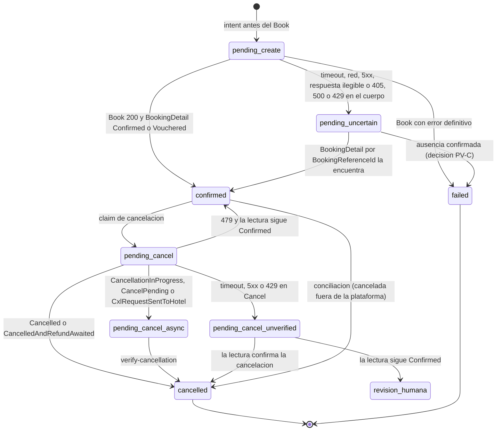

# TBO Hotels — Post-venta: detalle, cancelación y conciliación

Fuentes: ver [00-fuentes.md](./00-fuentes.md). Las preguntas a TBO que salen de aquí se consolidan en
[10-preguntas-para-tbo.md](./10-preguntas-para-tbo.md); las decisiones, en [08-requisitos-maestro.md](./08-requisitos-maestro.md).

## 0. Cómo leer este documento

**Alcance.** Los tres métodos que operan sobre una reserva ya creada (`BookingDetail`, `Cancel` y
`BookingDetailsBasedOnDate`), la máquina de estados que resulta de ellos, el seguimiento del Hotel Confirmation
Number (HCN), la conciliación diaria y los datos que hay que guardar para post-venta y soporte.

**Fuera de alcance.** Se enlaza, no se repite:

| Tema                                                                                                 | Documento                                                                                  |
| ---------------------------------------------------------------------------------------------------- | ------------------------------------------------------------------------------------------ |
| Basic Auth, base URLs test/live, `Status.Code` en el cuerpo, taxonomía de errores, redacción de logs | [01-autenticacion-conectividad-y-errores.md](./01-autenticacion-conectividad-y-errores.md) |
| Oferta canónica, normalización de `CancelPolicies`, moneda, `MealType`                               | [02-search-y-oferta-canonica.md](./02-search-y-oferta-canonica.md)                         |
| PreBook, Book, generación de `BookingReferenceId` y `ClientReferenceId`, intent previo, cobro        | [03-prebook-y-book.md](./03-prebook-y-book.md)                                             |
| `hotel_inventory`, zona horaria del hotel, `HotelCode`                                               | [05-contenido-estatico-e-inventario.md](./05-contenido-estatico-e-inventario.md)           |
| Inventario completo de seams, puerto neutral de hoteles, registry                                    | [06-seams-integracion-repo.md](./06-seams-integracion-repo.md)                             |
| Caso 8 de certificación y paquete de logs RQ/RS                                                      | [07-certificacion.md](./07-certificacion.md)                                               |

**Marcas de evidencia.**

| Marca                  | Significa                                                                                                                                                                                                                                 |
| ---------------------- | ----------------------------------------------------------------------------------------------------------------------------------------------------------------------------------------------------------------------------------------- |
| **VERIFICADO-PDF**     | Lo dice o lo muestra el PDF V2.1. "(p. N)" es la **página física**. Desde la p. 64 el pie impreso no coincide: la p. 64 imprime "59", la p. 70 imprime "65" y la p. 71 imprime "66". El índice (p. 2–4) tiene números de página erróneos. |
| **VERIFICADO-POSTMAN** | Lo muestra la colección. "(Postman: request)". La colección no trae respuestas guardadas.                                                                                                                                                 |
| **VERIFICADO-CERT**    | Documento de certificación. "(Cert)".                                                                                                                                                                                                     |
| **VERIFICADO-CODIGO**  | Código del repo, citado `ruta:línea`.                                                                                                                                                                                                     |
| **INFERIDO**           | Deducción o propuesta nuestra. No está escrito en ninguna fuente.                                                                                                                                                                         |

**Línea base de arquitectura que este documento asume** (08 la presenta como decisiones con opciones):

- Código de proveedor `tbo-hotels`; ACL en `providers/tbo-hotels`; wiring en `apps/api/src/providers-tbo/`.
- Vertical de hoteles multi-proveedor (`HotelProviderRegistry`); la post-venta se enruta por `orders.provider`.
- Las reservas de hotel son filas `orders` con **intent idempotente antes del Book** ([03](./03-prebook-y-book.md)).
- D1: solo `PaymentMode` `Limit`. D9: las sagas con dinero corren sobre BullMQ.
- Credenciales BYOC con herencia consolidador → agencia (`resolve_provider_account`).

**Qué cambia si se elige otra alternativa:**

- **Patrón Autos** (`recordExternalOrder` después del Book, sin `create_request_key`; VERIFICADO-CODIGO
  `apps/api/src/orders/orders.service.ts:278-322`): la recuperación a 120 s de §7 no tiene fila a la que
  asociarse. Un Book con timeout que sí se creó solo aparece en la conciliación diaria (§9), que pasa a ser la
  única red de seguridad y deja huérfanas visibles hasta 24 h.
- **Módulo TBO paralelo** en vez de registry: la cancelación desde `/orders/:id/cancel` necesita una rama
  `provider === 'tbo-hotels'` como la de autos (`orders.service.ts:1214-1215`) y el guard de despacho la marca
  (§12).
- **Reservas de hotel fuera de `orders`** (patrón Despegar actual, `apps/api/src/hotels/hotels.service.ts:175-178`):
  no hay dónde colgar el claim de cancelación, los eventos ni el HCN. Este documento no aplica tal cual.

---

## 1. Resumen ejecutivo

1. **`BookingDetail` es la única fuente del estado de una reserva.** Book devuelve solo `Status`,
   `ClientReferenceId` y `ConfirmationNumber` (VERIFICADO-PDF p. 40–41). El flujo de certificación pone
   BookingDetail después de un Book exitoso (caso 8: "Search > Prebook > Book> BookingDetails>Cancel(If
   Required)", VERIFICADO-CERT); llamarlo **siempre** es decisión nuestra (INFERIDO). Es **obligatorio** tras un
   fallo del Book ("timeout/failure/http/network"), por `BookingReferenceId` y 120 s después (VERIFICADO-PDF p. 42).
2. **Ninguno de los tres métodos tiene timeout recomendado** (VERIFICADO-PDF p. 8, por ausencia). Proponemos
   30 s para `BookingDetail` y 60 s para `Cancel` y `BookingDetailsBasedOnDate` (INFERIDO), y se pregunta a TBO ([Q-09](./10-preguntas-para-tbo.md#q-09)).
3. **`Cancel` no devuelve dinero ni estado final.** Recibe solo `ConfirmationNumber` y devuelve `Status` y
   `ConfirmationNumber` (VERIFICADO-PDF p. 41–42). No hay cargo, reembolso ni cancelación parcial por habitación.
4. **Un 200 en Cancel no alcanza para marcar la orden como cancelada.** La tabla de códigos dice que el 200
   significa "Booking is Cancelled" (VERIFICADO-PDF p. 9), pero el enum `Booking Status` tiene tres estados
   de cancelación en curso (`CancellationInProgress`, `CancelPending`, `CxlRequestSentToHotel`) además de
   `CancelledAndRefundAwaited` (VERIFICADO-PDF p. 70–71). Postura: **200 = cancelación aceptada**; el estado de la
   orden lo fija un `BookingDetail` posterior.
5. **El enum de estados es incompleto.** Tiene 6 valores y ninguno de fallo ni de pendiente de confirmación. El
   ejemplo por fecha devuelve `Vouchered`, que no está en el enum (VERIFICADO-PDF p. 64, 70–71). El parser
   acepta cualquier string y escala lo desconocido.
6. **HCN:** la primera consulta sale de una tabla de SLA P0–P5 según la ventana hasta el check-in; después hay
   hasta 3 reintentos cada hora y luego un ticket de operaciones. Solo hay HCN si el check-in cae dentro de los
   30 días posteriores a la reserva (VERIFICADO-PDF p. 42–43). El canal del ticket no está documentado.
7. **`BookingDetailsBasedOnDate`** tiene cinco nombres en el PDF y otro en Postman, dos grafías de campos y
   una ventana máxima de 60 días (VERIFICADO-PDF p. 3, 6, 62–64; VERIFICADO-POSTMAN). Usamos
   `{BaseURL}/BookingDetailsbasedondate` (casing del PDF, en la constante `TBO_OPERATIONS`; la sonda PR-04 prueba
   también el de Postman, §5.2) con `FromDate`/`ToDate`. Es la base de la conciliación diaria.
8. **El repo ya tiene casi todo el esqueleto:** claim durable de cancelación, política `UNVERIFIED` y
   vocabulario de eventos (VERIFICADO-CODIGO `orders.service.ts:1082-1132`, `cancel-retry-policy.ts:84-136`,
   `order-events.ts:15-30`). El path `/Cancel` de TBO ya casa con `CANCEL_WRITE_PATH`
   (`cancel-retry-policy.ts:36`).
9. **Faltan seis piezas** (VERIFICADO-CODIGO):
   - `delay` en la cola (`apps/api/src/queue/post-sale-queue.service.ts:110`);
   - verificar la creación por `BookingReferenceId`, porque hoy se exige `provider_order_id`
     (`orders.service.ts:1579`);
   - un subestado de "cancelación en curso", porque hoy `runCancel` marca `cancelled` directo
     (`orders.service.ts:1332-1336`);
   - los jobs `hcn-check` y de conciliación;
   - una vía para cerrar una cancelación `UNVERIFIED` con evidencia (`orders.service.ts:1809-1816`);
   - guardar la cuenta de credenciales con la que se creó cada reserva.

---

## 2. Superficie de post-venta

| Método                      | Path (sobre `{BaseURL}`)     | HTTP | Body mínimo que enviamos                                                                                      | Timeout TBO    | Timeout propuesto | ¿Escritura con dinero? | Reintento automático en el ACL                                | Evidencia                                                   |
| --------------------------- | ---------------------------- | ---- | ------------------------------------------------------------------------------------------------------------- | -------------- | ----------------- | ---------------------- | ------------------------------------------------------------- | ----------------------------------------------------------- |
| `BookingDetail`             | `/BookingDetail`             | POST | `{"ConfirmationNumber": "…", "PaymentMode": "Limit"}` o `{"BookingReferenceId": "…", "PaymentMode": "Limit"}` | No documentado | 30 s (INFERIDO)   | No (lectura)           | Sí: hasta 3 intentos con backoff ante red, timeout, 5xx o 429 | VERIFICADO-PDF p. 7–8, 42–44; Postman: BookingDetail        |
| `Cancel`                    | `/Cancel`                    | POST | `{"ConfirmationNumber": "…"}`                                                                                 | No documentado | 60 s (INFERIDO)   | **Sí**                 | **Ninguno**                                                   | VERIFICADO-PDF p. 8, 41–42; Postman: Cancel                 |
| `BookingDetailsBasedOnDate` | `/BookingDetailsbasedondate` | POST | `{"FromDate": "YYYY-MM-DD", "ToDate": "YYYY-MM-DD"}`                                                          | No documentado | 60 s (INFERIDO)   | No (lectura)           | Sí, igual que `BookingDetail`                                 | VERIFICADO-PDF p. 62–64; Postman: BookingDetailsBasedOnDate |

- Las columnas "Timeout propuesto" y "Reintento automático en el ACL" son diseño nuestro (INFERIDO); el resto
  de la tabla sale de las fuentes citadas.
- Los tres son `POST` con `Content-Type: application/json` y Basic Auth (VERIFICADO-PDF p. 7; el método de
  cada uno, p. 41, 42 y 62). Base URL de test
  `http://api.tbotechnology.in/TBOHolidays_HotelAPI`; de live, `{Live-URL}/HotelAPI` (VERIFICADO-PDF p. 7).
  Detalle en [01](./01-autenticacion-conectividad-y-errores.md).
- El éxito o el fallo lo dice `Status.Code` del cuerpo (VERIFICADO-PDF p. 8–10). Lo que devuelve el HTTP de
  transporte en los errores no está documentado → [01](./01-autenticacion-conectividad-y-errores.md).
- Las dos lecturas se pueden reintentar en el ACL. `Cancel` es una escritura con dinero y va con cero
  reintentos, igual que Book (salvaguarda heredada de `providers/sabre`, → [01](./01-autenticacion-conectividad-y-errores.md)).
- En Postman, `Cancel` y `BookingDetailsBasedOnDate` declaran su propio bloque Basic con usuario y contraseña
  vacíos, y `BookingDetail` lo hereda de la colección (VERIFICADO-POSTMAN). No tiene efecto en el contrato.

---

## 3. BookingDetail

### 3.1 Request

| Campo                | Tipo (PDF)                                                    | Uso nuestro                                    | Evidencia                                  |
| -------------------- | ------------------------------------------------------------- | ---------------------------------------------- | ------------------------------------------ |
| `ConfirmationNumber` | String, "Unique TBOH generated confirmation number"           | Consulta normal de una reserva con localizador | VERIFICADO-PDF p. 43                       |
| `BookingReferenceId` | String, "Unique booking reference ID"                         | Solo para recuperar un Book incierto (§7)      | VERIFICADO-PDF p. 43; changelog v1.4, p. 5 |
| `PaymentMode`        | Enumeration: `Limit`, `SavedCard`, `NewCard`; default `Limit` | Siempre `"Limit"` explícito (D1)               | VERIFICADO-PDF p. 44                       |

Ejemplos del PDF (p. 44), JSON válido:

```json
{ "ConfirmationNumber": "YOSUR8", "PaymentMode": "Limit" }
```

```json
{ "BookingReferenceId": "AVw12118", "PaymentMode": "Limit" }
```

Postman (Postman: BookingDetail). **No es JSON válido tal cual** por la línea comentada:

```text
{
    // "BookingReferenceId": "742955723103628",
    "ConfirmationNumber": "KOI5G4",
    "PaymentMode": "Limit"
}
```

Regla nuestra (INFERIDO): enviar **exactamente uno** de los dos identificadores. El PDF no dice qué pasa si
llegan los dos o ninguno (p. 43) → [Q-45](./10-preguntas-para-tbo.md#q-45). Nunca se copia un body de Postman sin limpiarlo.

### 3.2 Cuándo llamamos y con qué identificador

| #   | Situación                                                                                                                                            | Identificador        | Momento                                    | Disparador propuesto                                                                                                                     | Evidencia                                                                                             |
| --- | ---------------------------------------------------------------------------------------------------------------------------------------------------- | -------------------- | ------------------------------------------ | ---------------------------------------------------------------------------------------------------------------------------------------- | ----------------------------------------------------------------------------------------------------- |
| 1   | Cierre de la creación después de un Book 200                                                                                                         | `ConfirmationNumber` | Inmediato                                  | Paso de verificación obligatoria del saga (`closeCreation`, `orders.service.ts:910`; `planVerification`, `order-create.saga.ts:215-232`) | VERIFICADO-CERT (caso 8); VERIFICADO-CODIGO                                                           |
| 2   | Book con timeout, error de red, 5xx, respuesta ilegible o "failure" (`405`, `500` o `429` en el cuerpo: incierto según [03](./03-prebook-y-book.md)) | `BookingReferenceId` | 120 s o más después del fallo              | Job diferido `verify-hotel-booking` (§7)                                                                                                 | VERIFICADO-PDF p. 42 ("timeout/failure/http/network"); qué códigos cuentan como "failure" es INFERIDO |
| 3   | Antes y después de un `Cancel`                                                                                                                       | `ConfirmationNumber` | Inmediato; luego job `verify-cancellation` | §4.4                                                                                                                                     | INFERIDO (p. 70–71)                                                                                   |
| 4   | Seguimiento del HCN                                                                                                                                  | `ConfirmationNumber` | Según SLA                                  | Job `hcn-check` (§8)                                                                                                                     | VERIFICADO-PDF p. 42–43 (el identificador es INFERIDO: el PDF no dice cuál usar)                      |
| 5   | Confirmar una divergencia detectada por la conciliación                                                                                              | `ConfirmationNumber` | Durante la corrida                         | §9                                                                                                                                       | INFERIDO                                                                                              |
| 6   | Consulta manual desde el panel                                                                                                                       | `ConfirmationNumber` | A pedido                                   | `POST /orders/:id/retrieve` (`apps/api/src/orders/orders.controller.ts:202-215`), gateado por la capacidad `retrieve`                    | VERIFICADO-CODIGO                                                                                     |

`planVerification` escala con `verification-unavailable` si el proveedor no declara `retrieve`
(VERIFICADO-CODIGO `order-create.saga.ts:229`). El factory de TBO tiene que declarar `retrieve: true` y
`cancel: true`.

### 3.3 Response

Tabla del PDF (p. 44–49; **la p. 47 está en blanco**). El PDF no tiene columna de obligatoriedad. Las rutas se
reconstruyen con el ejemplo de p. 49–51.

| Ruta completa                                         | Tipo (PDF)     | Descripción                                                                                                                                   | ¿En el ejemplo?                                | Qué hacemos con el campo                                                                             |
| ----------------------------------------------------- | -------------- | --------------------------------------------------------------------------------------------------------------------------------------------- | ---------------------------------------------- | ---------------------------------------------------------------------------------------------------- |
| `Status.Code`                                         | Integer        | Código interno de estado                                                                                                                      | Sí (`200`)                                     | Decide éxito o fallo                                                                                 |
| `Status.Description`                                  | String         | Mensaje                                                                                                                                       | Sí (`"Successful"`)                            | Solo para soporte; nunca para lógica                                                                 |
| `BookingDetail.BookingStatus`                         | Enumeration    | "Please refer the enumeration table"                                                                                                          | Sí (`"Confirmed"`)                             | Máquina de estados (§6)                                                                              |
| `BookingDetail.VoucherStatus`                         | **Boolean**    | "Possible Value; Confirm, Voucher"                                                                                                            | Sí (`true`)                                    | Guardar; ver PV-02                                                                                   |
| `BookingDetail.ConfirmationNumber`                    | String         | Localizador de TBO                                                                                                                            | Sí (`"YOSUR8"`)                                | `orders.provider_order_id`                                                                           |
| `BookingDetail.HotelConfirmationNumber`               | String         | "Confirmation Number Provided by Hotel"                                                                                                       | **No**                                         | HCN (§8)                                                                                             |
| `BookingDetail.InvoiceNumber`                         | String         | "Unique TBOH generated invoice number"                                                                                                        | Sí (`"MW34325"`)                               | Guardar para conciliación financiera                                                                 |
| `BookingDetail.CheckIn` / `CheckOut`                  | String         | "Format: YYYY-MM-DD"                                                                                                                          | Sí, pero `"2021-10-16T00:00:00"`               | Parseo tolerante; comparar con lo reservado                                                          |
| `BookingDetail.BookingDate`                           | String         | "Format: YYYY-MM-DD"                                                                                                                          | Sí, **mal formado**: `"2021-07-1317T00:00:00"` | Solo informativo                                                                                     |
| `BookingDetail.NoOfRooms`                             | Integer        | Habitaciones reservadas                                                                                                                       | Sí (`1`)                                       | Validar contra la ocupación guardada                                                                 |
| `BookingDetail.HotelDetails.HotelName`                | String         | Nombre del hotel                                                                                                                              | Sí                                             | Voucher                                                                                              |
| `BookingDetail.HotelDetails.Rating`                   | Enumeration    | Estrellas (`OneStar`…`FiveStar`, p. 69–70)                                                                                                    | Sí (`"ThreeStar"`)                             | Voucher                                                                                              |
| `BookingDetail.HotelDetails.AddressLine1` (dos filas) | String         | La 2.ª fila dice "Address second line"                                                                                                        | No                                             | Aceptar `AddressLine1` y `AddressLine2` opcionales                                                   |
| `BookingDetail.HotelDetails.Map`                      | String         | Latitud y longitud                                                                                                                            | Sí (`"25.251559\|55.295027"`)                  | Voucher (mapa)                                                                                       |
| `BookingDetail.HotelDetails.City`                     | String         | Ciudad                                                                                                                                        | Sí (`"Dubai"`)                                 | Voucher                                                                                              |
| `BookingDetail.Rooms[]`                               | Array          | Habitaciones reservadas                                                                                                                       | Sí                                             | Ver PV-07                                                                                            |
| `Rooms[].Currency`                                    | String         | "Booking price currency"                                                                                                                      | Sí (`"USD"`)                                   | Validar contra la moneda guardada                                                                    |
| `Rooms[].Name`                                        | Array          | Nombre de la habitación                                                                                                                       | Sí (`["STUDIO STANDARD"]`)                     | Voucher                                                                                              |
| `Rooms[].Inclusion`                                   | String         | Inclusiones                                                                                                                                   | Sí (`"ROOM ONLY"`)                             | Voucher                                                                                              |
| `Rooms[].TotalFare` / `TotalTax`                      | Decimal        | Precio e impuestos de la habitación                                                                                                           | Sí (`107.14000000000000` / `0.00`)             | Comparar con el neto guardado; nunca `float` para cálculo (→ [02](./02-search-y-oferta-canonica.md)) |
| `Rooms[].RoomPromotion`                               | Array          | Promociones                                                                                                                                   | Sí                                             | Informativo                                                                                          |
| `Rooms[].CancelPolicies[]`                            | Array          | `Index` (**String**), `FromDate`, `ChargeType`, `CancellationCharge`                                                                          | Sí, sin `Index`                                | Solo comparación: la política final es la de PreBook (p. 71)                                         |
| `Rooms[].MealType`                                    | Enumeration    | La tabla lista 3 valores                                                                                                                      | Sí (`"Room_Only"`)                             | Voucher (→ [02](./02-search-y-oferta-canonica.md))                                                   |
| `Rooms[].IsRefundable`                                | Boolean        | Reembolsable o no                                                                                                                             | Sí (`false`)                                   | Informativo; ver PV-09                                                                               |
| `…Supplements[]` (ubicación sin confirmar)            | List of Object | "Please ensure same are visible to end customer"; `Index` (**Integer**), `Type` (`Included`/`AtProperty`), `Description`, `Price`, `Currency` | **No**                                         | Voucher: los `AtProperty` se muestran siempre (p. 48, 71)                                            |
| `Rooms[].CustomerDetails[].CustomerNames[]`           | Array          | `Title`, `FirstName`, `LastName`, `Type`                                                                                                      | Sí, **dentro de `Rooms[0]`**                   | **PII**: no se loguea ni se copia a `provider_raw` ni a eventos                                      |
| `BookingDetail.RateConditions`                        | List of String | "Hotel/Room norms applicable on the hotel booked"                                                                                             | Sí, a nivel `BookingDetail`                    | Voucher, sanitizado (→ [02](./02-search-y-oferta-canonica.md))                                       |
| `…CreditCardOptions` (ubicación sin confirmar)        | Array          | Solo para pago con tarjeta                                                                                                                    | No                                             | Se ignora (D1)                                                                                       |

Todo VERIFICADO-PDF (p. 44–51) salvo la columna "Qué hacemos", que es INFERIDO. Las rutas de los campos que no
están en el ejemplo (`HotelConfirmationNumber`, `AddressLine1`/`AddressLine2`, `CancelPolicies[].Index`,
`Supplements`, `CreditCardOptions`) salen de su posición en la tabla, no del ejemplo (INFERIDO; PV-06).

### 3.4 Ejemplo de respuesta (p. 49–51), recortado

En el PDF los valores `"Adult"` y `"Child"` están impresos con **comillas tipográficas** (p. 50–51): el
ejemplo copiado del PDF **no es JSON válido**. Abajo están normalizados, con `RateConditions` recortado.

```json
{
  "Status": { "Code": 200, "Description": "Successful" },
  "BookingDetail": {
    "BookingStatus": "Confirmed",
    "VoucherStatus": true,
    "ConfirmationNumber": "YOSUR8",
    "InvoiceNumber": "MW34325",
    "CheckIn": "2021-10-16T00:00:00",
    "CheckOut": "2021-10-17T00:00:00",
    "BookingDate": "2021-07-1317T00:00:00",
    "NoOfRooms": 1,
    "HotelDetails": {
      "HotelName": "Golden Sands Hotel Apartments",
      "Rating": "ThreeStar",
      "Map": "25.251559|55.295027",
      "City": "Dubai"
    },
    "Rooms": [
      {
        "Currency": "USD",
        "Name": ["STUDIO STANDARD"],
        "Inclusion": "ROOM ONLY",
        "TotalFare": 107.14,
        "TotalTax": 0.0,
        "RoomPromotion": ["Early Booking discount"],
        "CancelPolicies": [
          { "FromDate": "12-07-2021 00:00:00", "ChargeType": "Fixed", "CancellationCharge": 0.0 },
          { "FromDate": "11-10-2021 00:00:00", "ChargeType": "Fixed", "CancellationCharge": 0.0 },
          {
            "FromDate": "15-10-2021 00:00:00",
            "ChargeType": "Percentage",
            "CancellationCharge": 100.0
          }
        ],
        "MealType": "Room_Only",
        "IsRefundable": false,
        "CustomerDetails": [
          {
            "CustomerNames": [
              { "Title": "Mr", "FirstName": "Shubham", "LastName": "Gupta", "Type": "Adult" },
              { "Title": "Mr", "FirstName": "Kunal", "LastName": "Agrawal", "Type": "Child" }
            ]
          }
        ]
      }
    ],
    "RateConditions": [
      "Early check out will attract full cancellation charge unless otherwise specified",
      "…"
    ]
  }
}
```

Además, en p. 51 `RateConditions` trae un carácter de reemplazo en lugar del apóstrofo ("hotel�s time") y
mezcla impuestos a pagar en el hotel, horario de check-in, "No Name change allowed" y restricciones de mercado
(VERIFICADO-PDF).

### 3.5 Lo que BookingDetail no devuelve

VERIFICADO-PDF por ausencia en p. 44–51: `BookingReferenceId`, `ClientReferenceId`, `HotelCode`,
`BookingCode`, `GuestNationality`, ocupación por habitación (adultos, niños, edades), total a nivel de reserva
(solo hay `Rooms[].TotalFare`), `EmailId`, `PhoneNumber`, cargo o reembolso de una cancelación, fecha de
cancelación, documento de voucher (URL o PDF) y `DayRates`.

Consecuencia (INFERIDO): todo eso se guarda al reservar (§11). BookingDetail sirve para el estado, los
localizadores y el voucher, no para reconstruir la venta.

### 3.6 Contradicciones y huecos

| ID    | Hecho                                                                                                                                                                                                              | Evidencia                                  | Postura de diseño (defensiva)                                                                                                                                                                                                     | ¿Solo TBO lo resuelve?                    |
| ----- | ------------------------------------------------------------------------------------------------------------------------------------------------------------------------------------------------------------------ | ------------------------------------------ | --------------------------------------------------------------------------------------------------------------------------------------------------------------------------------------------------------------------------------- | ----------------------------------------- |
| PV-01 | No hay ejemplo ni código documentado para un identificador inexistente                                                                                                                                             | VERIFICADO-PDF (ausencia, p. 42–51)        | "No encontrada" = `Status.Code ≠ 200` o respuesta sin `BookingDetail.ConfirmationNumber`. Con eso solo **nunca** se concluye que la reserva no existe (§7.3)                                                                      | → [Q-37](./10-preguntas-para-tbo.md#q-37) |
| PV-02 | `VoucherStatus` es Boolean pero la descripción da "Confirm, Voucher"                                                                                                                                               | VERIFICADO-PDF p. 45; ejemplo `true` p. 49 | Aceptar boolean o string. `false` o `"Confirm"` junto a `Confirmed` = confirmada con alerta, porque `BookingType` solo admite `Voucher` (p. 33, 70)                                                                               | → [Q-47](./10-preguntas-para-tbo.md#q-47) |
| PV-03 | Fechas: la tabla dice `YYYY-MM-DD`; el ejemplo trae `YYYY-MM-DDT00:00:00` y un `BookingDate` imposible (`"2021-07-1317T00:00:00"`)                                                                                 | VERIFICADO-PDF p. 45, 49                   | Tomar los 10 primeros caracteres de `CheckIn`/`CheckOut` y validarlos. `BookingDate` es solo informativo: la fecha de reserva sale de nuestro intent                                                                              | → [Q-47](./10-preguntas-para-tbo.md#q-47) |
| PV-04 | `AddressLine1` aparece dos veces; la segunda dice "Address second line"                                                                                                                                            | VERIFICADO-PDF p. 45                       | Aceptar `AddressLine1` y `AddressLine2`, ambos opcionales                                                                                                                                                                         | No                                        |
| PV-05 | `HotelConfirmationNumber` está en la tabla y no en el ejemplo. No se sabe si falta, llega `null` o llega `""`                                                                                                      | VERIFICADO-PDF p. 45, 49                   | `nullish`; string vacío, solo espacios o un relleno (`NA`, `N/A`, `Pending`, `TBA`, `0`, `-`…) = sin HCN. La lista de rellenos vive en el ACL (`providers/tbo-hotels/src/detail/hotel-confirmation-number.ts`) y cada uno se mide | → [Q-47](./10-preguntas-para-tbo.md#q-47) |
| PV-06 | La tabla es plana. No se confirma dónde van `Supplements`, `CreditCardOptions` ni `HotelConfirmationNumber`. `RateConditions` sigue a `CustomerNames` en la tabla, pero está a nivel `BookingDetail` en el ejemplo | VERIFICADO-PDF p. 45–51                    | Buscar `Supplements` y `RateConditions` en `Rooms[]` y en `BookingDetail`. `CreditCardOptions` se ignora (D1)                                                                                                                     | → [Q-46](./10-preguntas-para-tbo.md#q-46) |
| PV-07 | Multi-habitación: no se sabe si `Rooms` trae un elemento por habitación o uno con `Name[]` de N entradas. El único ejemplo es de 1 habitación                                                                      | VERIFICADO-PDF p. 49–51                    | Aceptar las dos formas. La cantidad de habitaciones la dan `NoOfRooms` y la ocupación guardada                                                                                                                                    | → [Q-46](./10-preguntas-para-tbo.md#q-46) |
| PV-08 | `Index` es String en `CancelPolicies` e Integer en `Supplements`                                                                                                                                                   | VERIFICADO-PDF p. 46, 48                   | `z.coerce.number().int()` en ambos                                                                                                                                                                                                | No                                        |
| PV-09 | `IsRefundable: false` con dos tramos `Fixed 0.00` antes del 100 %                                                                                                                                                  | VERIFICADO-PDF p. 50                       | No derivar un dato del otro; mostrar los dos (→ [02](./02-search-y-oferta-canonica.md))                                                                                                                                           | → [Q-26](./10-preguntas-para-tbo.md#q-26) |
| PV-10 | `CancelPolicies[].FromDate` viene como `dd-MM-yyyy HH:mm:ss`, sin zona horaria                                                                                                                                     | VERIFICADO-PDF p. 46, 50                   | En post-venta manda el snapshot de PreBook (finales por KP-3, p. 71). Normalización en [02](./02-search-y-oferta-canonica.md)                                                                                                     | → [Q-24](./10-preguntas-para-tbo.md#q-24) |
| PV-11 | `MealType`: la tabla de p. 46 lista 3 valores y el ejemplo usa `Room_Only`, que no está en esa tabla pero sí en el enum `MealType` de p. 70 (10 valores)                                                           | VERIFICADO-PDF p. 46, 50, 70               | Enum abierto (→ [02](./02-search-y-oferta-canonica.md))                                                                                                                                                                           | No                                        |
| PV-12 | `PaymentMode` en el request, sin propósito explicado                                                                                                                                                               | VERIFICADO-PDF p. 44                       | Enviar siempre `"Limit"`                                                                                                                                                                                                          | → [Q-45](./10-preguntas-para-tbo.md#q-45) |
| PV-13 | `CreditCardOptions` (BookingDetail) contra `CreditCardBillingOptions` (PreBook)                                                                                                                                    | VERIFICADO-PDF p. 23, 48                   | Ignorar los dos (D1)                                                                                                                                                                                                              | No                                        |
| PV-14 | El ejemplo lleva comillas tipográficas: no es JSON válido                                                                                                                                                          | VERIFICADO-PDF p. 50–51                    | Fixtures corregidas a mano y test de contrato con capturas reales de certificación (→ [07](./07-certificacion.md))                                                                                                                | No                                        |
| PV-15 | No se documenta si BookingDetail responde por reservas creadas con **otras** credenciales                                                                                                                          | VERIFICADO-PDF (ausencia)                  | La post-venta usa siempre la cuenta con la que se creó la reserva (§11)                                                                                                                                                           | → [Q-59](./10-preguntas-para-tbo.md#q-59) |

### 3.7 Validación en el borde (propuesta)

Esquema tolerante en la respuesta: Zod en el borde, como exige `CLAUDE.md`. El borrador es INFERIDO; la forma
final del paquete la fija [06](./06-seams-integracion-repo.md).

```ts
// PROPUESTA — providers/tbo-hotels/src/booking/booking-detail.response.ts
const TboStatus = z.object({ Code: z.number().int(), Description: z.string().optional() });

const TboBookedRoom = z.object({
  Currency: z.string().optional(),
  Name: z.union([z.array(z.string()), z.string()]).optional(),
  TotalFare: z.union([z.number(), z.string()]).optional(),
  TotalTax: z.union([z.number(), z.string()]).optional(),
  CancelPolicies: z
    .array(
      z.object({
        Index: z.coerce.number().int().optional(),
        FromDate: z.string(),
        ChargeType: z.string(),
        CancellationCharge: z.union([z.number(), z.string()]),
      }),
    )
    .optional(),
  MealType: z.string().optional(), // enum abierto
  IsRefundable: z.boolean().optional(),
  Supplements: z.unknown().optional(), // lista o lista de listas: se normaliza aparte
  CustomerDetails: z.unknown().optional(), // PII: no se parsea en el camino de post-venta
});

const TboBookingDetail = z.object({
  BookingStatus: z.string().min(1), // nunca z.enum: `Vouchered` ya está fuera del enum
  VoucherStatus: z.union([z.boolean(), z.string()]).optional(),
  ConfirmationNumber: z.string().min(1),
  HotelConfirmationNumber: z.string().nullish(),
  InvoiceNumber: z.string().nullish(),
  CheckIn: z.string(),
  CheckOut: z.string(),
  BookingDate: z.string().optional(),
  NoOfRooms: z.number().int().optional(),
  Rooms: z.array(TboBookedRoom).default([]),
  RateConditions: z.array(z.string()).optional(),
});

export const TboBookingDetailResponse = z.object({
  Status: TboStatus,
  BookingDetail: TboBookingDetail.optional(), // ausente = "no encontrada" (PV-01)
});
```

Reglas:

- `Status.Code` decide. Un 200 sin `BookingDetail` es un error de mapeo, no una reserva vacía.
- `BookingStatus` pasa por una función pura de normalización (§6.3). Si el valor es desconocido, se escala y la
  orden no cambia de estado.
- El cuerpo nunca se loguea: `CustomerNames` es PII (VERIFICADO-PDF p. 48, 50). Se guarda cifrado en el
  almacén de payloads (→ [01](./01-autenticacion-conectividad-y-errores.md)).

---

## 4. Cancel

### 4.1 Contrato

| Ítem         | Valor                                                         | Evidencia                      |
| ------------ | ------------------------------------------------------------- | ------------------------------ |
| Descripción  | "This method used to request to cancel the existing booking"  | VERIFICADO-PDF p. 41           |
| URL          | `BaseURL/Cancel`, `POST`                                      | VERIFICADO-PDF p. 41; p. 8     |
| Request      | `ConfirmationNumber` (String). **Es el único campo**          | VERIFICADO-PDF p. 41           |
| Response     | `Status.Code`, `Status.Description`, `ConfirmationNumber`     | VERIFICADO-PDF p. 42           |
| Timeout      | No documentado                                                | VERIFICADO-PDF p. 8 (ausencia) |
| Error propio | `CANCEL_FAIL` = 479, "Cancel Failed", "Cannot cancel booking" | VERIFICADO-PDF p. 9            |

```json
{ "ConfirmationNumber": "FL1IMA" }
```

```json
{ "Status": { "Code": 200, "Description": "Cancelled" }, "ConfirmationNumber": "FL1IMA" }
```

Request p. 41, response p. 42 (VERIFICADO-PDF). Postman usa `{"ConfirmationNumber": "ANPWCS"}`
(VERIFICADO-POSTMAN). No se cancela por `BookingReferenceId` ni por `ClientReferenceId`. Tampoco hay motivo de
cancelación ni cancelación por habitación (VERIFICADO-PDF, ausencia en p. 41). No hay ejemplo de error.

### 4.2 Qué significa cada respuesta

| Respuesta                                        | Qué dice el contrato                                                        | Postura (INFERIDO)                                                                                                                                             |
| ------------------------------------------------ | --------------------------------------------------------------------------- | -------------------------------------------------------------------------------------------------------------------------------------------------------------- |
| `Status.Code` 200, `Description` `"Cancelled"`   | "Cancel Check: Booking is Cancelled" (p. 9); ejemplo (p. 42)                | Cancelación **aceptada**. Se lee `BookingDetail` enseguida para fijar el estado (§4.4)                                                                         |
| 479 `CANCEL_FAIL`                                | "Cannot cancel booking" (p. 9)                                              | Rechazo de negocio. Se lee `BookingDetail`: si ya figura cancelada, es un éxito idempotente; si no, es un rechazo definitivo                                   |
| 401 `UNAUTHORIZED`, 402 `AGENT_BLOCKED`          | Credenciales incorrectas; agencia bloqueada (p. 9–10)                       | **UNVERIFIED** (HARD-1, §4.3): alerta sobre la cuenta y kill-switch por cuenta (→ [01](./01-autenticacion-conectividad-y-errores.md)), sin cerrar como fallida |
| 400 `INVALID_REQUEST`                            | Parámetro inválido (p. 9)                                                   | Bug nuestro: alerta. **UNVERIFIED** (HARD-1, §4.3)                                                                                                             |
| 201, 207, 300, 315, 405 u otro código            | Códigos de otras operaciones (p. 8–10); el contrato de Cancel no los define | **UNVERIFIED** (HARD-1, §4.3): no prueban que TBO no haya cancelado                                                                                            |
| 500 `UNEXPECTED_ERROR` en el cuerpo              | Error no definido; enviar logs JSON completos a soporte (p. 9)              | **UNVERIFIED**: no sabemos si se aplicó. Se guardan RQ/RS para soporte                                                                                         |
| 429 `LIMIT_EXCEEDED`                             | QPS excedido (p. 9)                                                         | UNVERIFIED (la política del repo no distingue; ver §4.3)                                                                                                       |
| Timeout, error de red, HTTP 5xx, cuerpo ilegible | No documentado                                                              | UNVERIFIED                                                                                                                                                     |

### 4.3 Encaje con la política de cancelación del repo

`classifyCancelThrownFailure` clasifica **por la forma del error, no por el proveedor**, y en este orden
(VERIFICADO-CODIGO `apps/api/src/orders/cancel-retry-policy.ts:84-136`):

1. si el nombre termina en `Cancel(Booking)?MappingError`, el resultado es UNVERIFIED (`:37`, `:89-96`);
2. si es determinista, es FAILED sin reintento (`:63-75`, `:98-105`);
3. si `path` casa con `CANCEL_WRITE_PATH`, es UNVERIFIED (`:36`, `:110-117`);
4. si es transitorio y el `path` es otro, es FAILED reintentable (`:121-128`);
5. cualquier otro caso es UNVERIFIED (`:130-135`).

Un rechazo de negocio no lanza: `runCancel` lo recibe como `success: false` (VERIFICADO-CODIGO
`orders.service.ts:1185-1189`).

| Desenlace TBO                                           | Qué entrega el ACL (propuesta)                                                                               | Resultado en el repo                                                                                                                                                                                                 | Estado de la orden                                      | Siguiente paso                                       |
| ------------------------------------------------------- | ------------------------------------------------------------------------------------------------------------ | -------------------------------------------------------------------------------------------------------------------------------------------------------------------------------------------------------------------- | ------------------------------------------------------- | ---------------------------------------------------- |
| 200                                                     | `{ success: true }` más la lectura posterior (§4.4)                                                          | `CANCEL_SUCCESS_POLICY` (`cancel-retry-policy.ts:184-189`)                                                                                                                                                           | Según `BookingDetail` (decisión PV-A)                   | `verify-cancellation` si el estado es intermedio     |
| 479                                                     | `{ success: false, error: 'TBO_CANCEL_FAIL' }`, sin lanzar                                                   | `CANCEL_REJECTED_POLICY`: FAILED, sin reintento (`cancel-retry-policy.ts:191-196`)                                                                                                                                   | Vuelve al estado previo (`orders.service.ts:1332-1336`) | Leer `BookingDetail`: si ya está cancelada, es éxito |
| 401, 402 o 400 en el cuerpo (HARD-1)                    | Lanza `TboCancelOutcomeUnknownError` (un `TboApiError` con el mismo `kind`, `status`, `tboCode` y `failure`) | El nombre casa con `CANCEL_OUTCOME_UNKNOWN_ERROR` antes que la regla de los deterministas: UNVERIFIED. El breaker sigue leyendo `failure.circuit` (`OPEN_ACCOUNT`)                                                   | `pending`, `cancel-unverified`                          | `verify-cancellation` y alerta                       |
| 201, 207, 300, 315, 405 u otro código conocido (HARD-1) | Lanza `TboCancelOutcomeUnknownError`                                                                         | UNVERIFIED, por el nombre. Antes salía el `TboApiError` con `NO_RETRY` y la cancelación cerraba FAILED sin releer: si TBO sí había cancelado, la orden volvía a confirmada                                           | `pending`, `cancel-unverified`                          | `verify-cancellation`                                |
| 500 en el cuerpo, HTTP 5xx, timeout o red               | Lanza `TboCancelOutcomeUnknownError { status, path: '/Cancel' }` (`status: 0` para red y timeout; HARD-1)    | Por el nombre (antes, por el `path`, que casa con `CANCEL_WRITE_PATH`): UNVERIFIED y escalado (`orders.service.ts:1273-1278`)                                                                                        | Queda `pending` (`orders.service.ts:1252`)              | `verify-cancellation` de solo lectura (PV-B)         |
| 429 en el cuerpo                                        | `TboCancelOutcomeUnknownError { status: 429, path: '/Cancel' }` (HARD-1)                                     | Por el nombre: UNVERIFIED (el 429 ya estaba excluido de los deterministas, `cancel-retry-policy.ts:74`)                                                                                                              | `pending`                                               | Igual que la fila anterior                           |
| HTTP 200 con cuerpo ilegible                            | Lanza `TboCancelMappingError`                                                                                | Casa con `CANCEL_OUTCOME_UNKNOWN_ERROR` (`cancel-retry-policy.ts`): UNVERIFIED                                                                                                                                       | `pending`                                               | Igual que la fila anterior                           |
| Falla la lectura previa, antes de enviar el Cancel      | `TboApiError { status: 0 o 5xx, path: '/BookingDetail' }`                                                    | Path distinto del write y error transitorio: FAILED reintentable; se intenta encolar en BullMQ (`orders.service.ts:1484-1487`), pero hoy BullMQ rechaza el `jobId` `cancel:<orderId>` y no queda nada encolado (§10) | Estado previo                                           | Reintento automático (hoy, manual)                   |

Trampas que el ACL tiene que respetar (VERIFICADO-CODIGO; la consecuencia es INFERIDO):

- **Nombre del error de mapeo.** Un error de mapeo de la respuesta de Cancel tiene que llamarse
  `…CancelMappingError`. Un `TboMappingError` genérico casaría con `DETERMINISTIC_ERROR`
  (`cancel-retry-policy.ts:38-39`). Se clasificaría como FAILED, que significa "no se canceló", cuando en
  realidad no sabemos si se canceló.
- **`path` visible en el error.** El regex acepta el path relativo `/Cancel` y también la URL completa que
  termina en `/Cancel`, porque es case-insensitive y admite fin de cadena (`cancel-retry-policy.ts:36`). Si el
  error no expone `path` y no es determinista, cae igual en UNVERIFIED (`:130-135`): es seguro, pero pierde la
  distinción con la lectura previa.
- **El "cero reintentos" no va en el error.** `retryable: false`, `failure.retry: 'NO_RETRY'` o un `failure.kind`
  como `HUMAN_REVIEW` o `BUSINESS` cuentan como deterministas (`cancel-retry-policy.ts:41-48`, `:66-72`): un
  timeout de `/Cancel` marcado así saldría FAILED en vez de UNVERIFIED. El cero reintentos vive en el cliente
  HTTP, como en Sabre (`providers/sabre/src/http/sabre-http.client.ts:181-182`).
- **La lectura posterior nunca lanza.** Si el `BookingDetail` que sigue a un 200 falla y el adapter deja salir
  la excepción con `path: '/BookingDetail'`, la política la ve como `pre-write-transient` (`:121-128`): la
  operación queda FAILED reintentable y habilita un segundo Cancel, por la cola (`orders.service.ts:1484-1487`)
  o por el reintento manual (`:1809-1816`). El adapter devuelve el resultado del write y deja la lectura a
  `verify-cancellation`.
- **429 en Cancel.** Queda UNVERIFIED aunque probablemente TBO no lo procesó. Es conservador: la política del
  repo nunca reintenta un write (`cancel-retry-policy.ts:107-117`). Con la lectura `verify-cancellation`, el
  costo son unos minutos, no una persona → [Q-51](./10-preguntas-para-tbo.md#q-51) si un 429 garantiza que no se procesó.

#### Endurecimiento HARD-1 (2026-09-26, VERIFICADO-CODIGO)

- **Ningún código que no sea `200` ni `479` cierra la cancelación como fallida.** El mapper de Cancel
  (`providers/tbo-hotels/src/cancel/response.mapper.ts`) convierte todo `TboApiError` de `/Cancel` que no sea el
  `479` en `TboCancelOutcomeUnknownError`, un `TboApiError` con el mismo `kind`, `status`, `tboCode` y `failure`
  (el breaker y el log leen lo mismo) cuyo nombre la política reconoce antes que la naturaleza `NO_RETRY`
  (`CANCEL_OUTCOME_UNKNOWN_ERROR` en `cancel-retry-policy.ts`). Queda `UNVERIFIED`, `cancel-unverified` y con
  `verify-cancellation`. Reemplaza la fila "401, 402 o 400 → deterministas" de la versión anterior y de
  [08](./08-requisitos-maestro.md) §9 C-04 para `/Cancel`. Lo que no salió (limitador, body) sigue siendo previo
  al write.
- **Un claim que el proceso dejó en vuelo** (`order_operations` `cancel` en `pending` desde hace más de 15 min,
  medido por `updated_at`) lo vence el barrido de post-venta (`StaleCancelClaimService`): pasa a `UNVERIFIED` sin
  reenviar nada, escala `cancellation-unverified` con `staleClaim: true` y, en hoteles, abre `verify-cancellation`
  en la misma transacción. Vuelos y autos reciben el mismo cierre (es el estado que ya deja un timeout de su
  write), sin la lectura automática.
- **La petición HTTP tiene presupuesto** (`HOTEL_CANCEL_SYNC_BUDGET_MS`, 45 s; Cloudflare corta a los 100 s).
  Agotado, responde `{ success: true, settlement: 'in-progress', warnings: ['CANCELLATION_STILL_RUNNING'] }`
  ("Cancelación en curso", no un error) y la cancelación sigue en el proceso con su claim, registrada para el
  apagado ordenado. La lectura posterior hace un intento.
- **Un `200` cuya lectura posterior trae un estado fuera del enum** agenda `verify-cancellation`, que sigue
  leyendo sin repetir el aviso mientras el valor no cambie; si se agota el calendario, `cancellation-stuck`.

### 4.4 Secuencia de cancelación propuesta

1. **Confirmación en la UI.** La agencia pide cancelar. La UI muestra la penalidad **estimada**, calculada con
   el snapshot de políticas de PreBook y la hora actual en la zona del hotel, y pide confirmación (decisión PV-D).
2. **Claim.** `cancelOrder` rechaza si la orden ya está cancelada o si hay una cancelación previa sin conciliar
   (VERIFICADO-CODIGO `orders.service.ts:1501-1539`). Si no, adquiere el claim: `order_operations` `pending`,
   índice único de 0037 como CAS (`db/migrations/0037_cancel_operation_claim.sql:35-37`) y
   `orders.status = 'pending'` (`orders.service.ts:1108-1114`).
3. **Llamada al ACL.** El adapter de TBO ejecuta `cancel(confirmationNumber)`:
   1. **Lectura previa** `BookingDetail`. Si la reserva ya está en `Cancelled` o `CancelledAndRefundAwaited`,
      no envía el Cancel y devuelve éxito idempotente. Si está en un estado de cancelación en curso, no envía y
      devuelve "en curso". Un fallo de esta lectura es pre-write y se puede reintentar (§4.3).
   2. `POST /Cancel`, timeout 60 s, sin reintento.
   3. Si la respuesta es 200 o 479, **lectura posterior** `BookingDetail`, con un solo intento (HARD-1). Si esa
      lectura falla, un 200 no se vuelve UNVERIFIED: el resultado del write ya se conoce. Solo se agenda
      `verify-cancellation`. Cualquier otra respuesta de `/Cancel` es UNVERIFIED (HARD-1, §4.3).
4. **Estado final en `runCancel`:**

   - lectura `Cancelled` o `CancelledAndRefundAwaited`: `cancelled`;
   - lectura intermedia (`CancellationInProgress`, `CancelPending`, `CxlRequestSentToHotel`) o sin lectura: según
     la decisión PV-A. La recomendación es `pending`, con el subestado guardado y el job `verify-cancellation`;
   - 479 con lectura `Confirmed` o `Vouchered`: vuelve al estado previo.

   **Seam:** hoy `runCancel` fija `cancelled` ante cualquier éxito (VERIFICADO-CODIGO
   `orders.service.ts:1332-1336`), y `OrderCancelResult` solo tiene `success`, `refundAmount`, `warnings` y
   `error` (VERIFICADO-CODIGO `packages/domain/src/ports/order-manage.port.ts:79-84`). El adapter tiene que poder
   decir "aceptada, no final" → [06](./06-seams-integracion-repo.md).

5. **Eventos.** `OrderCancellationAttempted` (ya existe, `order-events.ts:28-29`) con payload cerrado
   `{ provider, success, tboStatusCode, providerStatus }`. Además, `OrderProviderStatusChanged` (nuevo, §6.5) en
   cada cambio observado.
6. **`verify-cancellation`.** Es solo lectura. Corre a los 2 min, 15 min, 1 h, 6 h y 24 h (INFERIDO: TBO no
   publica tiempos). Cuando llega a un estado terminal, pasa la orden a `cancelled`. Si después del último
   intento sigue en estado intermedio, emite `OrderEscalated` con motivo `cancellation-stuck` (código nuevo,
   vocabulario cerrado).
7. **HCN.** La cancelación detiene el seguimiento del HCN (§8).

### 4.5 Penalidad y reembolso: la API no los da

- `Cancel` no devuelve cargo ni reembolso (VERIFICADO-PDF p. 42), y BookingDetail tampoco trae un campo de cargo
  aplicado (VERIFICADO-PDF p. 44–51).
- Las políticas de PreBook "will be considered as final" (VERIFICADO-PDF p. 71). La **penalidad estimada** se
  calcula con ese snapshot: se toma el tramo vigente según `FromDate` en la zona horaria del hotel
  (→ [02](./02-search-y-oferta-canonica.md), [05](./05-contenido-estatico-e-inventario.md)), y ese tramo se
  aplica sobre el `TotalFare` de PreBook (INFERIDO).
- El cargo real aparece fuera de la API, en la facturación de TBO a la cuenta (`InvoiceNumber`, p. 45)
  (INFERIDO) → [Q-52](./10-preguntas-para-tbo.md#q-52) cómo obtenerlo por API.
- `OrderCancelResult.refundAmount` existe (VERIFICADO-CODIGO `order-manage.port.ts:81`). Para TBO **queda
  vacío**: no se presenta una estimación nuestra como dato del proveedor. La estimación va en su propio campo
  (§11).
- El reembolso al cliente final por hosted checkout es una decisión de producto (PV-D).

### 4.6 Contradicciones y huecos

| ID    | Hecho                                                                                                                       | Evidencia                            | Postura de diseño                                                                                                         | ¿Solo TBO?                                |
| ----- | --------------------------------------------------------------------------------------------------------------------------- | ------------------------------------ | ------------------------------------------------------------------------------------------------------------------------- | ----------------------------------------- |
| PV-16 | Un 200 significa "Booking is Cancelled", pero el enum tiene 3 estados de cancelación en curso y `CancelledAndRefundAwaited` | VERIFICADO-PDF p. 9, 70–71           | 200 = aceptada; `BookingDetail` decide el estado de la orden                                                              | → [Q-49](./10-preguntas-para-tbo.md#q-49) |
| PV-17 | No se sabe qué devuelve Cancel sobre una reserva ya cancelada, ni si es idempotente                                         | VERIFICADO-PDF (ausencia, p. 41–42)  | Lectura previa y posterior (§4.4)                                                                                         | → [Q-50](./10-preguntas-para-tbo.md#q-50) |
| PV-18 | Ni cargo ni reembolso en la respuesta                                                                                       | VERIFICADO-PDF p. 42                 | Snapshot de PreBook y decisión PV-D                                                                                       | → [Q-52](./10-preguntas-para-tbo.md#q-52) |
| PV-19 | No hay cancelación parcial ni motivo                                                                                        | VERIFICADO-PDF p. 41                 | La UI no ofrece cancelar una sola habitación. Cambiar la ocupación = cancelar y volver a reservar, con aviso de penalidad | → [Q-53](./10-preguntas-para-tbo.md#q-53) |
| PV-20 | Sin timeout recomendado                                                                                                     | VERIFICADO-PDF p. 8                  | 60 s configurable por entorno                                                                                             | → [Q-09](./10-preguntas-para-tbo.md#q-09) |
| PV-21 | No se sabe si un 429 en Cancel garantiza que no se procesó                                                                  | VERIFICADO-PDF p. 9                  | UNVERIFIED más lectura (§4.3)                                                                                             | → [Q-51](./10-preguntas-para-tbo.md#q-51) |
| PV-22 | No se documenta si se puede cancelar después del check-in o en un no-show                                                   | VERIFICADO-PDF (ausencia)            | La UI bloquea la cancelación desde la fecha de check-in; después, soporte manual                                          | → [Q-53](./10-preguntas-para-tbo.md#q-53) |
| PV-23 | Hay dos emails de soporte: `apisupport@tboholidays.com` (p. 9) y `apisupport@tbo.com` (Cert)                                | VERIFICADO-PDF p. 9; VERIFICADO-CERT | Ver [01](./01-autenticacion-conectividad-y-errores.md)                                                                    | → [Q-11](./10-preguntas-para-tbo.md#q-11) |

---

## 5. BookingDetailsBasedOnDate

### 5.1 Cinco nombres para un método

| Dónde                            | Forma literal                                | Evidencia            |
| -------------------------------- | -------------------------------------------- | -------------------- |
| Índice                           | `hotelbookingdetailsbasedondate`             | VERIFICADO-PDF p. 3  |
| Changelog v2.1 (27 Dec 2023)     | "Bookingdetails based on Date"               | VERIFICADO-PDF p. 6  |
| Título de la sección 15          | `HotelBookingDetailBasedOnDate`              | VERIFICADO-PDF p. 62 |
| URL qualifier                    | `BaseURL/BookingDetailsbasedondate`          | VERIFICADO-PDF p. 62 |
| `Status.Description` del ejemplo | `"HotelBookingDetailBasedOnDate Successful"` | VERIFICADO-PDF p. 64 |
| Nombre y path en Postman         | `BookingDetailsBasedOnDate`                  | VERIFICADO-POSTMAN   |

El documento de certificación no lo menciona (VERIFICADO-CERT). El caso 8 pide "HotelBookingDetail"; que sea
`BookingDetail` y no este método (cuyo título en p. 62 empieza igual) es INFERIDO por el flujo del mismo caso,
"Book> BookingDetails>Cancel(If Required)", y por "post successful booking".

### 5.2 Path que usamos

**`{BaseURL}/BookingDetailsbasedondate`**, el URL qualifier del PDF (p. 62), como todas las operaciones de
`TBO_OPERATIONS` ([01](./01-autenticacion-conectividad-y-errores.md) §3.1; regla de [08](./08-requisitos-maestro.md)
§9 C-03). Razones:

- El PDF es el contrato. Postman es el único artefacto de TBO que se ejecuta, pero el PDF se contradice a sí mismo
  (singular y plural, con y sin mayúsculas) y hace falta una regla única para todos los paths.
- La diferencia con el literal de Postman (`BookingDetailsBasedOnDate`) es solo de mayúsculas. Postman también usa
  `search` y `Hoteldetails` donde el PDF dice `Search` y `HotelDetails`, lo que sugiere que el enrutamiento no
  distingue mayúsculas (INFERIDO).
- El path es **una constante** del ACL. La sonda PR-04 de la certificación prueba las dos grafías
  ([07](./07-certificacion.md) §6.8) y la que funcione queda en la constante → [Q-05](./10-preguntas-para-tbo.md#q-05).

### 5.3 Request

| Campo      | Tipo (tabla, p. 62) | Formato      | Ejemplo PDF (p. 63) | Postman    |
| ---------- | ------------------- | ------------ | ------------------- | ---------- |
| `FromDate` | String              | `YYYY-MM-DD` | **`fromdate`**      | `FromDate` |
| `ToDate`   | String              | `YYYY-MM-DD` | **`todate`**        | `ToDate`   |

```json
{ "fromdate": "2023-11-09", "todate": "2023-11-10" }
```

```json
{ "FromDate": "2024-06-28", "ToDate": "2024-07-30" }
```

Ejemplo del PDF (p. 63) y Postman (VERIFICADO-POSTMAN). Postman usa un rango de 32 días.

- **Grafía.** Usamos PascalCase `FromDate`/`ToDate`, que coincide con la tabla y con Postman.
  - Riesgo (INFERIDO): si el servidor ignorara las claves con otra grafía y aplicara un rango por defecto, la
    respuesta sería plausible pero equivocada, y nadie lo notaría.
  - Salvaguarda: **toda fila devuelta tiene que tener `BookingDate` dentro de `[FromDate, ToDate]`.** Si alguna
    cae afuera, la corrida se descarta como inválida.
- **Ventana.** Máximo 60 días, "about 2 months" (VERIFICADO-PDF p. 62). No se documenta qué pasa si se excede.
  Postura: nunca enviar más de 60 días y partir los rangos largos en tramos.
- **Qué fecha filtra.** INFERIDO con evidencia fuerte: la **fecha de creación**. El ejemplo pide 09 y 10 de
  noviembre y devuelve reservas con `BookingDate` de esos días y check-in del 20-Nov y del 02-Dic (p. 63–64). El
  changelog dice "booking details made by the agency in the specified date" (p. 6).
- **Límite superior.** INFERIDO: `ToDate` es inclusivo, porque el ejemplo devuelve el día 10.
- **Zona horaria.** No documentada. Las ventanas se solapan un día hacia cada lado → [Q-57](./10-preguntas-para-tbo.md#q-57).

### 5.4 Response

Tabla leída en p. 63–64; tipos declarados contra tipos observados en el ejemplo de p. 64.

| Ruta                                           | Tipo (tabla)            | Observado                                            | Descripción (tabla)                                                         | Uso nuestro                                                          |
| ---------------------------------------------- | ----------------------- | ---------------------------------------------------- | --------------------------------------------------------------------------- | -------------------------------------------------------------------- |
| `Status.Code` / `Status.Description`           | Integer / String        | `200` / `"HotelBookingDetailBasedOnDate Successful"` | —                                                                           | Solo `Code`                                                          |
| `BookingDetail`                                | **Object**              | **Array**                                            | "Details of all the bookings"                                               | Aceptar array u objeto único                                         |
| `BookingDetail[].Index`                        | int                     | `1`, `2`                                             | "Count of the booking"                                                      | Se ignora                                                            |
| `BookingDetail[].BookingId`                    | String                  | `"264056"`                                           | "Unique booking id"                                                         | Se guarda para soporte; semántica desconocida                        |
| `BookingDetail[].ConfirmationNo`               | String                  | `"GOF05R"`                                           | "Unique confirmation number"                                                | Clave primaria de cruce. **Otro nombre** que en BookingDetail        |
| `BookingDetail[].BookingDate`                  | String                  | `"10-Nov-2023"`                                      | "(DD- MMM-YYYY)"                                                            | Validación de ventana; parseo con locale `en`                        |
| `BookingDetail[].Currency`                     | String                  | `"USD"`                                              | Moneda de `AgentMarkup` y `BookingPrice`                                    | Comparación de precio                                                |
| `BookingDetail[].AgentMarkup`                  | String                  | `"0.00"`                                             | "Amount which the agent has earned on the booking. i.e.Agency's commission" | Comparación de precio (decimal exacto)                               |
| `BookingDetail[].AgencyName`                   | String                  | `"ATravels"`                                         | Agencia que hizo la reserva                                                 | Reporte de reservas externas                                         |
| `BookingDetail[].BookingStatus`                | **No está en la tabla** | `"Vouchered"`                                        | —                                                                           | Máquina de estados; valor fuera del enum                             |
| `BookingDetail[].BookingPrice`                 | String                  | `"583.89"`                                           | "Booking Price including agency Commision"                                  | Comparación de precio                                                |
| `BookingDetail[].TripName`                     | String                  | `"Sharma_02Dec_Dubai"`                               | (sin descripción)                                                           | **Se descarta**: parece contener el apellido del huésped (INFERIDO)  |
| `BookingDetail[].TBOHotelCode`                 | String                  | `"1022623"`                                          | Código TBOH del hotel                                                       | Validar contra el hotel reservado                                    |
| `BookingDetail[].CheckInDate` / `CheckOutDate` | String                  | `"02-Dec-2023"` / `"10-Dec-2023"`                    | Inicio y fin de la estadía, sin formato declarado                           | Validar contra lo reservado                                          |
| `BookingDetail[].ClientReferenceNumber`        | String                  | `"123680"`, `"20230320978y8"`                        | "Client reference number"                                                   | Clave secundaria de cruce (≈ `ClientReferenceId` del Book, INFERIDO) |

### 5.5 Ejemplo de respuesta (p. 64)

Es JSON válido (VERIFICADO-PDF). Se recorta a una fila:

```json
{
  "Status": { "Code": 200, "Description": "HotelBookingDetailBasedOnDate Successful" },
  "BookingDetail": [
    {
      "Index": 1,
      "BookingId": "264056",
      "ConfirmationNo": "GOF05R",
      "BookingDate": "10-Nov-2023",
      "Currency": "USD",
      "AgentMarkup": "0.00",
      "AgencyName": "ATravels",
      "BookingStatus": "Vouchered",
      "BookingPrice": "583.89",
      "TripName": "Sharma_02Dec_Dubai",
      "TBOHotelCode": "1022623",
      "CheckInDate": "02-Dec-2023",
      "CheckOutDate": "10-Dec-2023",
      "ClientReferenceNumber": "123680"
    }
  ]
}
```

### 5.6 Contradicciones y huecos

| ID    | Hecho                                                                                                                                                                                            | Evidencia                                        | Postura de diseño                                                                                                                                               | ¿Solo TBO?                                |
| ----- | ------------------------------------------------------------------------------------------------------------------------------------------------------------------------------------------------ | ------------------------------------------------ | --------------------------------------------------------------------------------------------------------------------------------------------------------------- | ----------------------------------------- |
| PV-24 | Cinco nombres del método y dos casings de path                                                                                                                                                   | VERIFICADO-PDF p. 3, 6, 62, 64; Postman          | Constante única con el casing del PDF (`BookingDetailsbasedondate`) y sonda PR-04 con las dos grafías en certificación                                          | → [Q-05](./10-preguntas-para-tbo.md#q-05) |
| PV-25 | Claves del request: `FromDate`/`ToDate` en la tabla y en Postman; `fromdate`/`todate` en el ejemplo                                                                                              | VERIFICADO-PDF p. 62–63; Postman                 | PascalCase, con la validación de ventana de §5.3                                                                                                                | → [Q-56](./10-preguntas-para-tbo.md#q-56) |
| PV-26 | Qué pasa con más de 60 días; paginación o límite de filas; forma de la respuesta sin reservas                                                                                                    | VERIFICADO-PDF p. 62 (ausencia)                  | Tramos de 60 días o menos. Vacío = `BookingDetail` ausente, `null` o `[]` **con** `Status.Code` 200. Cualquier otro código es un error, nunca "no hay reservas" | → [Q-57](./10-preguntas-para-tbo.md#q-57) |
| PV-27 | `BookingDetail` se declara Object y llega como array                                                                                                                                             | VERIFICADO-PDF p. 63–64                          | Aceptar las dos formas                                                                                                                                          | No                                        |
| PV-28 | `BookingStatus` no está en la tabla (hay dos filas vacías: en p. 63 entre `BookingPrice` y `TripName`, y en p. 64 antes de `CheckOutDate`) y el ejemplo trae `Vouchered`, que no está en el enum | VERIFICADO-PDF p. 63–64, 70–71                   | Enum abierto; `Vouchered` se trata como `Confirmed` (§6)                                                                                                        | → [Q-48](./10-preguntas-para-tbo.md#q-48) |
| PV-29 | `ConfirmationNo` aquí; `ConfirmationNumber` en BookingDetail y en Cancel                                                                                                                         | VERIFICADO-PDF p. 41–42, 45, 63                  | Mapeo explícito en el ACL                                                                                                                                       | No                                        |
| PV-30 | Montos como string; fechas `DD-MMM-YYYY` (la tabla lo escribe "DD- MMM-YYYY"); check-in y check-out sin formato declarado                                                                        | VERIFICADO-PDF p. 63–64                          | Decimal exacto y parser de fecha con locale `en` fijo                                                                                                           | No                                        |
| PV-31 | No se sabe si `ClientReferenceNumber` es el `ClientReferenceId` del Book, ni qué es `BookingId` (formatos distintos a `BookingReferenceId`)                                                      | VERIFICADO-PDF p. 33, 63–64                      | Verificarlo en certificación: reservar con un `ClientReferenceId` conocido y buscarlo aquí (→ [07](./07-certificacion.md))                                      | → [Q-58](./10-preguntas-para-tbo.md#q-58) |
| PV-32 | Relación entre `BookingPrice`, `AgentMarkup` y el `TotalFare` del Book                                                                                                                           | VERIFICADO-PDF p. 33, 63                         | Solo se registra; no se alerta hasta que TBO lo confirme (§9.4 R6)                                                                                              | → [Q-89](./10-preguntas-para-tbo.md#q-89) |
| PV-33 | No se sabe si `BookingStatus` es el estado **actual** o el de creación                                                                                                                           | VERIFICADO-PDF (ausencia)                        | Toda divergencia se confirma con `BookingDetail` antes de actuar                                                                                                | → [Q-58](./10-preguntas-para-tbo.md#q-58) |
| PV-34 | Alcance: el método devuelve las reservas de la cuenta que llama, con `AgencyName`. No se dice si incluye las hechas en el portal web de TBO                                                      | VERIFICADO-PDF p. 6, 63 (INFERIDO en el alcance) | Conciliar **por cuenta** de credenciales (§9.2)                                                                                                                 | → [Q-59](./10-preguntas-para-tbo.md#q-59) |

---

## 6. Máquina de estados

### 6.1 Enum `Booking Status` de TBO

La tabla de enums lo escribe `Booking Status`, con espacio; el campo JSON es `BookingStatus`
(VERIFICADO-PDF p. 70–71).

| Valor TBO                   | Fuente                                          | Interpretación (INFERIDO)                                 | ¿Terminal para la orden? |
| --------------------------- | ----------------------------------------------- | --------------------------------------------------------- | ------------------------ |
| `Confirmed`                 | VERIFICADO-PDF p. 70; ejemplo p. 49             | Reserva vigente                                           | No                       |
| `Vouchered`                 | Solo en el ejemplo de p. 64, **fuera del enum** | Vigente con voucher emitido; equivale a `Confirmed`       | No                       |
| `CancellationInProgress`    | VERIFICADO-PDF p. 70                            | Cancelación en proceso en TBO                             | No                       |
| `CancelPending`             | VERIFICADO-PDF p. 71                            | Cancelación pendiente                                     | No                       |
| `CxlRequestSentToHotel`     | VERIFICADO-PDF p. 71                            | Pedido enviado al hotel, todavía sin respuesta            | No                       |
| `CancelledAndRefundAwaited` | VERIFICADO-PDF p. 71                            | Cancelada; el reembolso de TBO a la cuenta está pendiente | Sí                       |
| `Cancelled`                 | VERIFICADO-PDF p. 70                            | Cancelada                                                 | Sí                       |
| cualquier otro valor        | —                                               | Desconocido                                               | —                        |

No hay estado de fallo, de pendiente de confirmación ni _on request_ (VERIFICADO-PDF, ausencia en p. 70–71) →
[Q-48](./10-preguntas-para-tbo.md#q-48) la lista completa.

### 6.2 Estados del repo

- `OrderStatus = 'pending' | 'confirmed' | 'ticketed' | 'cancelled' | 'failed'` (VERIFICADO-CODIGO
  `apps/api/src/database/database.types.ts:231`). En la base es `TEXT` sin `CHECK`
  (`db/migrations/0005_orders.sql:12-13`).
- `OrderOperationType = 'cancel' | 'pay' | 'reshop' | 'retrieve'` y
  `OrderOperationStatus = 'pending' | 'success' | 'failed'` (`database.types.ts:445-446`). En la base, `type` es
  `TEXT` libre y `status` tiene `CHECK` (`db/migrations/0021_order_operations.sql:11-12`).
- La web muestra `Pendiente`, `Confirmada`, `Emitida`, `Cancelada` y `Fallida`
  (`apps/web-b2b/src/app/(app)/reservas/page.tsx:143-147`).
- **`ticketed` no se usa nunca en hoteles:** no hay emisión. Una orden `ticketed` bloquearía la cancelación
  genérica (`orders.service.ts:1850-1856`).

### 6.3 Mapeo de observaciones a estados

Postura recomendada: decisión PV-A, opción 1. `orders.status` se queda en el vocabulario actual y el detalle
de TBO vive en un **subestado** (`provider_status`, §11).

| Observación                                                                                                                        | `orders.status`                                                            | Subestado                          | Acción                                                                                                                                                    | Evento                                                                                |
| ---------------------------------------------------------------------------------------------------------------------------------- | -------------------------------------------------------------------------- | ---------------------------------- | --------------------------------------------------------------------------------------------------------------------------------------------------------- | ------------------------------------------------------------------------------------- |
| Intent creado; el Book no salió o está en vuelo                                                                                    | `pending`                                                                  | `create-pending`                   | —                                                                                                                                                         | `OrderCreateRequested`                                                                |
| Book 200 y `BookingDetail` en `Confirmed` o `Vouchered`                                                                            | `confirmed`                                                                | Valor crudo                        | Programar el HCN                                                                                                                                          | `OrderCreated`, `OrderCreationVerified`                                               |
| Book 200 y falla la lectura de cierre                                                                                              | `confirmed` (un 200 del Book es "Booking is Confirmed or Voucher", p. 8–9) | `unverified-read`                  | `verify-hotel-booking` por `ConfirmationNumber`; `verify-creation` (`orders.service.ts:998`) queda para vuelos ([08](./08-requisitos-maestro.md) §9 C-06) | `OrderEscalated` `verification-unavailable`                                           |
| Book con error definitivo (según [03](./03-prebook-y-book.md); `405`, `500` y `429` no lo son: la nota de p. 42 incluye "failure") | `failed`                                                                   | —                                  | Liberar la clave ([03](./03-prebook-y-book.md))                                                                                                           | `OrderCreated` (FAILED)                                                               |
| Book incierto                                                                                                                      | `pending`                                                                  | `create-uncertain`                 | `verify-hotel-booking` por `BookingReferenceId` a +120 s (§7)                                                                                             | `OrderCreateFailed` (`uncertain: true`)                                               |
| La recuperación encuentra la reserva                                                                                               | según el mapeo                                                             | Valor crudo                        | Consolidar el intent y programar el HCN                                                                                                                   | `OrderCreationVerified` (`recoveredBy: 'booking-reference'`)                          |
| La recuperación no la encuentra                                                                                                    | `pending`                                                                  | `create-not-found-yet`             | Relecturas y conciliación; decisión PV-C                                                                                                                  | `OrderEscalated` `create-not-found`                                                   |
| Claim de cancelación adquirido                                                                                                     | `pending` (`orders.service.ts:1108-1114`)                                  | `cancel-requested`                 | Cancel                                                                                                                                                    | —                                                                                     |
| `CancellationInProgress`, `CancelPending` o `CxlRequestSentToHotel`                                                                | `pending`                                                                  | Valor crudo                        | `verify-cancellation`                                                                                                                                     | `OrderProviderStatusChanged`                                                          |
| `CancelledAndRefundAwaited`                                                                                                        | `cancelled`                                                                | Valor crudo y `refundAwaited=true` | La conciliación sigue hasta `Cancelled`, sin bloquear nada                                                                                                | `OrderProviderStatusChanged`                                                          |
| `Cancelled`                                                                                                                        | `cancelled`                                                                | Valor crudo                        | Detener el HCN                                                                                                                                            | `OrderProviderStatusChanged`                                                          |
| Cancel 479 y lectura `Confirmed` o `Vouchered`                                                                                     | Estado previo                                                              | Valor crudo                        | —                                                                                                                                                         | `OrderCancellationAttempted` (`success: false`)                                       |
| Cancel UNVERIFIED                                                                                                                  | `pending`                                                                  | `cancel-unverified`                | `verify-cancellation` (decisión PV-B)                                                                                                                     | `OrderEscalated` `cancellation-unverified` (ya existe, `orders.service.ts:1350-1371`) |
| Conciliación: TBO en cancelación y la nuestra `confirmed`                                                                          | Según el mapeo, después de confirmar con `BookingDetail`                   | Valor crudo                        | Notificar a la agencia                                                                                                                                    | `OrderReconciliationDiscrepancy` y `OrderProviderStatusChanged`                       |
| Conciliación: TBO en `Confirmed` o `Vouchered` y la nuestra `cancelled`                                                            | **Sin cambio automático**                                                  | —                                  | Revisión humana urgente: la reserva sigue viva y cobrable                                                                                                 | `OrderReconciliationDiscrepancy` (`severity: 'critical'`)                             |
| `BookingStatus` desconocido                                                                                                        | Sin cambio                                                                 | `unknown`, con el valor crudo      | Revisión humana                                                                                                                                           | `OrderEscalated` `provider-status-unknown`                                            |
| `VoucherStatus` `false` o `"Confirm"` con `Confirmed`                                                                              | `confirmed`                                                                | Valor crudo                        | Alerta (PV-02)                                                                                                                                            | `OrderProviderStatusChanged`                                                          |

### 6.4 Diagrama

Todos los estados `pending_*` del diagrama se guardan como `orders.status = 'pending'`; se distinguen por el
subestado.



### 6.5 Eventos de dominio

Reglas vigentes (VERIFICADO-CODIGO `apps/api/src/orders/order-events.ts:3-14`):

- el payload usa un vocabulario cerrado, sin texto libre del proveedor, sin PII y sin datos de tarjeta;
- `domain_events` es append-only (`db/migrations/0015_domain_events.sql:23,27`);
- el PNR sí puede entrar porque es un localizador (`order-events.ts:50-55`). Con el mismo criterio entran
  `ConfirmationNumber` y HCN (INFERIDO).

`AuditService.emit` es **best-effort**: si falla, se traga el error (VERIFICADO-CODIGO
`apps/api/src/audit/audit.service.ts:37-62`). Por eso ningún job usa eventos como fuente de verdad; la fuente
son las filas de Postgres.

| Evento                                                                                                                               | Estado                            | Cuándo                                                                   | Payload (cerrado)                                                                                                       |
| ------------------------------------------------------------------------------------------------------------------------------------ | --------------------------------- | ------------------------------------------------------------------------ | ----------------------------------------------------------------------------------------------------------------------- |
| `OrderCreateRequested`, `OrderCreated`, `OrderCreateFailed`, `OrderCreationVerified`, `OrderEscalated`, `OrderCancellationAttempted` | Existen (`order-events.ts:15-30`) | Como en vuelos                                                           | Se agregan `providerStatus` (valor del enum o `'unknown'`) y `recoveredBy` (`'booking-reference'` o `'reconciliation'`) |
| `OrderProviderStatusChanged`                                                                                                         | Propuesto                         | Cada vez que una lectura observa un `BookingStatus` distinto al guardado | `{ provider, previous, current, source: 'book' \| 'cancel' \| 'verify' \| 'hcn' \| 'reconciliation' }`                  |
| `HotelConfirmationNumberReceived`                                                                                                    | Propuesto                         | Aparece el HCN                                                           | `{ provider, confirmationNumber, hcn, priority, attempt }`                                                              |
| `HotelConfirmationNumberMissing`                                                                                                     | Propuesto                         | Se agotan el SLA y los 3 reintentos                                      | `{ provider, confirmationNumber, priority, attempts }`                                                                  |
| `OrderReconciliationDiscrepancy`                                                                                                     | Propuesto                         | La conciliación detecta una divergencia                                  | `{ provider, accountId, kind: 'R1'…'R8', severity, confirmationNumber? }`                                               |
| `ProviderBookingUnmatched`                                                                                                           | Propuesto                         | Hay una reserva en TBO sin orden nuestra                                 | `{ provider, accountId, confirmationNumber }`. Se emite sobre el tenant dueño de la cuenta                              |

Los motivos nuevos de `OrderEscalated` son `create-not-found`, `cancellation-stuck` y
`provider-status-unknown`. Se suman al vocabulario cerrado.

---

## 7. Recuperación tras un Book incierto (lado lectura)

### 7.1 Regla del contrato

> "In case of timeout/failure/http/network related error in book response then it is mandatory to call the
> BookingDetail method by using BookingReferenceId after 120 seconds of book response."

VERIFICADO-PDF p. 42. El timeout recomendado del Book también es de 120 s (VERIFICADO-PDF p. 8).

Ambigüedad: "after 120 seconds of book response" no dice si se cuenta desde el envío o desde el fallo. Postura
(INFERIDO): contar **desde que observamos el fallo**, que es la lectura más tardía y por eso la más segura. En el
peor caso, la primera lectura sale unos 240 s después de enviar el Book → [Q-38](./10-preguntas-para-tbo.md#q-38).

### 7.2 Flujo

El intent se guarda antes del Book e incluye `BookingReferenceId` y `ClientReferenceId`
([03](./03-prebook-y-book.md)). El Book se envía sin reintento y con timeout de 120 s. Si el desenlace es
incierto:

1. Se emite `OrderCreateFailed` con `uncertain: true`, como hoy (VERIFICADO-CODIGO
   `orders.service.ts:658-690`).
2. **Diferencia con vuelos:** hoy ese camino responde 409 y **no encola nada**; queda para una persona
   (`orders.service.ts:681-689`). En TBO la lectura es obligatoria por contrato, así que se encola el job nuevo
   `verify-hotel-booking` con `delay: 120_000` y el primer paso del calendario de [03](./03-prebook-y-book.md) §4.2.
   No se extiende `verify-creation`: exige `provider_order_id` y resuelve por el registry de vuelos (§7.4;
   [08](./08-requisitos-maestro.md) §9 C-06).
3. El job llama a `BookingDetail` con `{ "BookingReferenceId": …, "PaymentMode": "Limit" }`.
4. Según el desenlace (§7.3), el job consolida el intent con el mismo CAS de hoy
   (`status = 'pending' AND provider_raw IS NULL`, `orders.service.ts:820-852`) o agenda el siguiente intento.
5. **Nunca se reenvía el Book automáticamente.** No está documentado si un segundo Book con el mismo
   `BookingReferenceId` es idempotente ([03](./03-prebook-y-book.md)).

### 7.3 Desenlaces de la lectura

| Desenlace de `BookingDetail`                                                                | Acción                                                                                                                                                                                                                                                                                                           |
| ------------------------------------------------------------------------------------------- | ---------------------------------------------------------------------------------------------------------------------------------------------------------------------------------------------------------------------------------------------------------------------------------------------------------------- |
| 200 con `BookingDetail.ConfirmationNumber`                                                  | Consolidar: `provider_order_id = ConfirmationNumber`, estado según §6.3, `OrderCreationVerified` con `recoveredBy: 'booking-reference'`. Después, HCN y cobro al cliente ([03](./03-prebook-y-book.md))                                                                                                          |
| Error de transporte (red, timeout, 5xx)                                                     | Lanzar para que BullMQ reintente (5 intentos con backoff exponencial de 10 s, `post-sale-queue.service.ts:113-118`). La lectura es idempotente                                                                                                                                                                   |
| "No encontrada" (`Status.Code ≠ 200` o sin `BookingDetail`; la forma es desconocida, PV-01) | **No lanzar.** Encolar el paso siguiente del calendario de [03](./03-prebook-y-book.md) §4.2: `tf` + 5 min, + 15 min y + 60 min (INFERIDO). Si sigue sin aparecer, subestado `create-not-found-yet`, `OrderEscalated` `create-not-found`, y la decisión la toma la conciliación (§9, R5) según PV-C (D-TBO-24 A) |
| 401 o 402                                                                                   | Escalado inmediato: sin credenciales válidas no hay forma de verificar                                                                                                                                                                                                                                           |

### 7.4 Seams

VERIFICADO-CODIGO:

- `verifyCreationById` sale sin hacer nada si falta `provider_order_id` (`orders.service.ts:1579`), y un Book
  incierto no lo tiene. Además resuelve el adapter con `flightProvider` (`orders.service.ts:1583`). Hace falta
  una variante de hotel que lea por `BookingReferenceId`, guardado en el intent: el job `verify-hotel-booking`.
- `VerifyCreationJob` no tiene `attempt` (`post-sale-queue.service.ts:26-31`) y `add()` no acepta `delay`
  (`post-sale-queue.service.ts:110`) → §10.

---

## 8. Hotel Confirmation Number (HCN)

### 8.1 Contrato

VERIFICADO-PDF p. 42–43:

- TBO anima a obtener el HCN con BookingDetail "instead of relying on emails".
- "HCN will only be provided if the check-in is within 30 days of the booking".
- **Paso 1:** identificar el SLA según la ventana hasta el check-in.

| Priority | Check-in Window            | HCN SLA (From Booking Time) |
| -------- | -------------------------- | --------------------------- |
| P0       | < 24 hours                 | 3 hours                     |
| P1       | 24–48 hours                | 4 hours                     |
| P2       | 48–72 hours (2–3 days)     | 6 hours                     |
| P3       | 72–120 hours (3–5 days)    | 12 hours                    |
| P4       | 120–192 hours (5–8 days)   | 48 hours                    |
| P4+      | 192–336 hours (8–14 days)  | 72 hours                    |
| P5       | 336–720 hours (14–30 days) | 120 hours                   |

- Ejemplo del PDF: "For a check-in in 2 days (P2), first API call should be made 6 hours after booking creation".
- **Paso 2:** "Initial API Call: After SLA time has passed, call the Booking Detail API". "If HCN is not
  available, Retry every 1 hour". "Maximum 3 retries can be made".
- **Paso 3:** "If the HCN is still not available after the SLA window and 3 retry attempts, raise an operations
  ticket with the relevant booking details".

### 8.2 Huecos y postura

| ID    | Hueco                                                                                                                                                                              | Evidencia                                                                                                  | Postura de diseño (INFERIDO)                                                                                                                                                                                                            | ¿Solo TBO?                                |
| ----- | ---------------------------------------------------------------------------------------------------------------------------------------------------------------------------------- | ---------------------------------------------------------------------------------------------------------- | --------------------------------------------------------------------------------------------------------------------------------------------------------------------------------------------------------------------------------------- | ----------------------------------------- |
| PV-35 | Los límites 48, 72, 120, 192 y 336 h aparecen en dos tramos a la vez. 24 h no es ambiguo (P0 es "< 24", así que 24 es P1). 720 h solo cierra P5: no se dice si W = 720 está dentro | VERIFICADO-PDF p. 43                                                                                       | Intervalos `[a, b)`: el límite pertenece al tramo superior. Así sale el ejemplo del PDF ("check-in in 2 days" = P2). Además evita leer antes del SLA de TBO y gastar los reintentos antes de tiempo, lo que abriría un ticket prematuro | → [Q-54](./10-preguntas-para-tbo.md#q-54) |
| PV-36 | La ventana va "hasta el check-in", pero `CheckIn` es solo una fecha                                                                                                                | VERIFICADO-PDF p. 43, 45                                                                                   | Instante de check-in = 00:00 del día `CheckIn` en la zona horaria del hotel (→ [05](./05-contenido-estatico-e-inventario.md)). Si no se conoce, 00:00 UTC; el error mueve a lo sumo un tramo                                            | → [Q-54](./10-preguntas-para-tbo.md#q-54) |
| PV-37 | "Maximum 3 retries": ¿3 además de la llamada inicial (4 en total) o 3 en total?                                                                                                    | VERIFICADO-PDF p. 43                                                                                       | 4 llamadas: en el SLA, +1 h, +2 h y +3 h. El ticket sale después de la cuarta                                                                                                                                                           | → [Q-54](./10-preguntas-para-tbo.md#q-54) |
| PV-38 | Con check-in a más de 30 días de la reserva no hay HCN. No se dice si llega cuando la fecha entra en la ventana                                                                    | VERIFICADO-PDF p. 42                                                                                       | Programar una "entrada en ventana" en check-in − 720 h y aplicar desde ahí el SLA de P5, como si la reserva se hubiera hecho en ese momento. Sin ticket automático para estas reservas hasta que TBO confirme                           | → [Q-54](./10-preguntas-para-tbo.md#q-54) |
| PV-39 | No hay canal ni formato para el "operations ticket"                                                                                                                                | VERIFICADO-PDF p. 43                                                                                       | Cola interna de operaciones; decisión PV-F                                                                                                                                                                                              | → [Q-55](./10-preguntas-para-tbo.md#q-55) |
| PV-40 | No se sabe si el HCN puede cambiar después de entregado, ni si es uno por reserva o uno por habitación                                                                             | VERIFICADO-PDF p. 45 (un solo campo; a nivel `BookingDetail` por su posición en la tabla, INFERIDO, PV-06) | Se guarda el primero. La conciliación no lo relee. Si una lectura posterior trae otro valor, se guarda el nuevo y se emite `OrderProviderStatusChanged` con `source: 'hcn'`                                                             | → [Q-47](./10-preguntas-para-tbo.md#q-47) |
| PV-41 | Cada consulta de HCN consume QPS, y el QPS no está publicado                                                                                                                       | VERIFICADO-PDF p. 9                                                                                        | Limitador propio para jobs de fondo, separado del de Search                                                                                                                                                                             | → [Q-10](./10-preguntas-para-tbo.md#q-10) |

### 8.3 Plan de consultas (función pura)

`hcnPlan(bookedAt, checkInInstant)` devuelve `{ priority, firstCheckAt, retryAt[3], ticketAt }` o
`{ outOfWindow, windowEntryAt }`. Es una función pura, fuera del worker. Esa separación es la condición de D9
para que migrar a Temporal sea barato (VERIFICADO-CODIGO `apps/api/src/orders/post-sale.worker.ts:15-26`).

| Prioridad | Ventana W (horas), regla nuestra `[a, b)` | Primera lectura | Reintentos             | Ticket |
| --------- | ----------------------------------------- | --------------- | ---------------------- | ------ |
| P0        | W < 24                                    | +3 h            | +4 h, +5 h, +6 h       | +6 h   |
| P1        | 24 ≤ W < 48                               | +4 h            | +5 h, +6 h, +7 h       | +7 h   |
| P2        | 48 ≤ W < 72                               | +6 h            | +7 h, +8 h, +9 h       | +9 h   |
| P3        | 72 ≤ W < 120                              | +12 h           | +13 h, +14 h, +15 h    | +15 h  |
| P4        | 120 ≤ W < 192                             | +48 h           | +49 h, +50 h, +51 h    | +51 h  |
| P4+       | 192 ≤ W < 336                             | +72 h           | +73 h, +74 h, +75 h    | +75 h  |
| P5        | 336 ≤ W < 720                             | +120 h          | +121 h, +122 h, +123 h | +123 h |
| Fuera     | W ≥ 720                                   | Postura PV-38   | —                      | —      |

W = `checkInInstant − bookedAt`. Todos los tiempos se miden desde `bookedAt`. SLA, reintentos y umbrales son
VERIFICADO-PDF p. 43; la asignación de los límites y el momento del ticket son INFERIDO (PV-35, PV-37).

Condiciones de corte: la reserva está cancelada o en cancelación, el check-in ya pasó, o el HCN ya llegó.

### 8.4 Ejemplos

Todos con reserva el 2026-10-01 a las 10:00 UTC (INFERIDO, cálculo propio):

| Caso | Check-in y zona del hotel     | Instante de check-in (UTC) | W      | Prioridad | Primera lectura (UTC)                                                               | Reintentos (UTC)      |
| ---- | ----------------------------- | -------------------------- | ------ | --------- | ----------------------------------------------------------------------------------- | --------------------- |
| E1   | 2026-10-02, Bogotá (UTC−5)    | 2026-10-02 05:00           | 19 h   | P0        | 2026-10-01 13:00                                                                    | 14:00, 15:00, 16:00   |
| E2   | 2026-10-04, Lima (UTC−5)      | 2026-10-04 05:00           | 67 h   | P2        | 2026-10-01 16:00                                                                    | 17:00, 18:00, 19:00   |
| E3   | 2026-10-20, São Paulo (UTC−3) | 2026-10-20 03:00           | 449 h  | P5        | 2026-10-06 10:00                                                                    | 11:00, 12:00, 13:00   |
| E4   | 2026-12-15, Cartagena (UTC−5) | 2026-12-15 05:00           | 1795 h | Fuera     | Entrada en ventana el 2026-11-15 05:00; primera lectura el 2026-11-20 05:00 (PV-38) | Sin ticket automático |

### 8.5 Implementación sobre BullMQ

- **Postgres manda y la cola despierta.** El plan se guarda en la fila de seguimiento del HCN (§11:
  `hcn_state`, `hcn_priority`, `hcn_next_check_at`, `hcn_attempts`). El job `hcn-check` es el mecanismo normal.
  Un barrido periódico (`post-sale-sweeper`, §10) re-encola cualquier fila con `hcn_next_check_at` vencido hace
  más de 15 minutos sin intento registrado. Así, perder un job en Redis cuesta minutos y no un HCN.
- **Job `hcn-check`.** Payload `{ tenantId, orderId, attempt }`, `delay` hasta `firstCheckAt` y `jobId`
  determinista `hcn-check:<orderId>:<attempt>`.
- **"Todavía sin HCN" no es un error.** El worker no lanza: encola `attempt + 1` con `delay` de 1 h. Si lanzara,
  BullMQ reintentaría a los 10 s, 20 s, 40 s… (`post-sale-queue.service.ts:113-116`) y gastaría el plan de
  TBO en un minuto.
- **Error de transporte.** Aquí sí se lanza. BullMQ reintenta con su backoff. La lectura es idempotente y no
  cuenta como intento del plan.
- **Retención de los jobs diferidos.** P5 deja jobs diferidos hasta 5 días. Redis de producción corre con AOF
  (VERIFICADO-CODIGO `infrastructure/hostinger/docker-compose.prod.yml:62`), así que los jobs sobreviven a un
  reinicio; el barrido cubre el resto. Este es el caso de "deadlines de días" que D9 llama frágil con BullMQ. La
  mitigación es que la fuente de verdad sea la fila de Postgres, no la cola.
- **Al recibir el HCN:** se guarda, se emite `HotelConfirmationNumberReceived`, se habilita el voucher con HCN
  ([03](./03-prebook-y-book.md)) y se notifica a la agencia. El canal de notificación queda fuera de alcance.

### 8.6 Ticket de operaciones

El PDF no documenta canal, email ni API para el ticket (VERIFICADO-PDF p. 43, ausencia). Propuesta (INFERIDO;
decisión PV-F):

- se emite `HotelConfirmationNumberMissing` y se crea una tarea en la cola interna de operaciones, con
  `order_operations.type = 'hcn-ticket'`;
- la tarea **no copia PII**: guarda `orderId`, `ConfirmationNumber`, `BookingReferenceId`, hotel, fechas y
  prioridad. Nombres y contacto se leen de `orders` cuando alguien abre la tarea, con RLS;
- la escalada a TBO la hace una persona por el canal comercial, hasta que TBO documente uno (PV-39);
- si el HCN llega después por cualquier lectura (la consulta manual, la conciliación, la cancelación o el propio
  seguimiento), la tarea se cierra sola en la misma transacción que guarda el número: pasa a `success` y su
  `result` gana `resolution` con el motivo (`hcn-received`), la lectura que lo trajo y la hora. Lo que la abrió no
  se toca, y el HCN no se copia a la tarea.

Solo siguen el HCN los proveedores de hoteles que declaran la capacidad `hcn` (hoy, TBO). Saber leer una reserva no
alcanza: Despegar la lee y no promete un HCN con SLA, así que sus órdenes no abren plan.

---

## 9. Conciliación diaria con BookingDetailsBasedOnDate

### 9.1 Qué detecta

1. **Reservas huérfanas.** Existen en TBO y no tenemos confirmadas: un Book que dio timeout y sí se creó, y cuya
   recuperación (§7) no llegó a correr o no la encontró.
2. **Divergencias de estado.** La reserva se canceló fuera de la plataforma (portal de TBO, hotel) o una
   cancelación nuestra quedó sin aplicar.
3. **Divergencias de precio y moneda** entre lo que TBO facturará y el neto que guardamos.
4. **Intents inciertos que TBO no tiene.** Hace falta evidencia de ausencia para liberarlos (PV-C).

### 9.2 Alcance: por cuenta de credenciales, no por tenant

- El método devuelve las reservas de la cuenta que llama (INFERIDO: incluye `AgencyName` y el changelog dice
  "made by the agency", VERIFICADO-PDF p. 6, 63).
- Con BYOC, una cuenta del consolidador heredada la usan varias agencias (`resolve_provider_account`), y una
  agencia con cuenta propia usa la suya ([01](./01-autenticacion-conectividad-y-errores.md)). La corrida es
  **una por cuenta** (`provider_accounts.id`). Si se decide permitir credenciales de plataforma por entorno,
  también se concilia esa cuenta.
- El cruce con órdenes necesita saber con qué cuenta se creó cada una: `provider_account_id` (§11). Hoy no se
  guarda.
  - `orders` tiene RLS forzada por tenant ([06](./06-seams-integracion-repo.md)). La consulta de las órdenes de
    una cuenta recorre los tenants del subárbol del dueño con `withTenant`, uno por uno, o usa un rol de
    mantenimiento explícito.
  - Un resultado de una cuenta nunca se muestra fuera del subárbol del tenant dueño.

### 9.3 Algoritmo

Todo el algoritmo es INFERIDO; las reglas del contrato que usa están citadas.

- **Tramo A, novedades.** Ventana `[D−2, D]`, con D = hoy en UTC: tres días calendario inclusivos. Absorbe la
  zona horaria desconocida de `BookingDate` y una corrida fallida. Repetir una ventana es idempotente.
- **Tramo B, reservas activas.** Para las órdenes de la cuenta con check-out posterior a hoy y estado
  `confirmed` o `pending`, se cubre el rango `[mín(fecha de creación), D]` en tramos de 60 días o menos
  (VERIFICADO-PDF p. 62). Cada tramo devuelve el `BookingStatus` de todas las reservas creadas en él.
  - Costo: `ceil(rango / 60)` llamadas por cuenta y por corrida. Una reserva con check-in a un año suma unas 7.
- **Cruce**, en este orden:
  1. `ConfirmationNo` = `orders.provider_order_id`, dentro de la misma cuenta.
  2. `ClientReferenceNumber` = el `ClientReferenceId` guardado en el intent. Así se encuentran los intents
     inciertos, que no tienen `provider_order_id`. La equivalencia de los dos campos es INFERIDO y se verifica
     en certificación (PV-31).
  3. Sin cruce: la reserva es **externa**.
- **Confirmación:** antes de cambiar cualquier estado se relee con `BookingDetail` por `ConfirmationNumber`
  (PV-33).

### 9.4 Clasificación de discrepancias

| Caso                        | Condición                                                                                                                                     | Acción automática                                                                       | Acción humana                                                    | Evento                                                          |
| --------------------------- | --------------------------------------------------------------------------------------------------------------------------------------------- | --------------------------------------------------------------------------------------- | ---------------------------------------------------------------- | --------------------------------------------------------------- |
| **R1** Recuperada           | Cruza por `ClientReferenceNumber` con un intent `pending` sin localizador                                                                     | `BookingDetail`; si la confirma, consolidar el intent (§7.3), programar el HCN y avisar | Ninguna (el cobro al cliente sigue [03](./03-prebook-y-book.md)) | `OrderCreationVerified` (`recoveredBy: 'reconciliation'`)       |
| **R2** Externa              | No cruza por ninguna clave                                                                                                                    | Registrar en el reporte del dueño de la cuenta                                          | Decisión PV-G                                                    | `ProviderBookingUnmatched`                                      |
| **R3** Cancelada fuera      | La orden está `confirmed` y TBO está en la familia de cancelación                                                                             | `BookingDetail`; si lo confirma, aplicar §6.3                                           | Notificar a la agencia; reembolso al cliente según PV-D          | `OrderReconciliationDiscrepancy` y `OrderProviderStatusChanged` |
| **R4** Resucitada           | La orden está `cancelled` y TBO sigue en `Confirmed` o `Vouchered`                                                                            | `BookingDetail`. **Nunca reenviar el Cancel**                                           | Revisión urgente: puede haber un cargo corriendo                 | `OrderReconciliationDiscrepancy` (`severity: 'critical'`)       |
| **R5** Intent ausente       | Intent `create-uncertain` o `create-not-found-yet` con más de 24 h, cuya fecha de creación ya se consultó con 200 válido (tramo A), sin cruce | Según PV-C                                                                              | Según PV-C                                                       | `OrderEscalated` `create-not-found`                             |
| **R6** Precio o moneda      | `BookingPrice − AgentMarkup` difiere del neto guardado, o `Currency` no coincide                                                              | Solo registrar (PV-32)                                                                  | Reporte semanal de finanzas                                      | `OrderReconciliationDiscrepancy` (`kind: 'R6'`)                 |
| **R7** Estado desconocido   | `BookingStatus` fuera del vocabulario de §6.1                                                                                                 | Guardar el valor crudo                                                                  | Revisión                                                         | `OrderEscalated` `provider-status-unknown`                      |
| **R8** Cancelación atascada | Estado intermedio de cancelación durante más de 72 h                                                                                          | —                                                                                       | Ticket a TBO                                                     | `OrderReconciliationDiscrepancy` (`kind: 'R8'`)                 |

#### Endurecimiento HARD-4 (2026-09-26, VERIFICADO-CODIGO)

- **Todo par (estado de la orden, estado de la fila) está decidido** (`classifyMatched` en
  `apps/api/src/reconciliation/reconciliation.plan.ts`). `PENDING` y `FAILED` del contrato neutral no existen en el
  enum de TBO (§6.1), así que una fila con ellos es **R7**: sobre una orden `confirmed` (el huésped puede llegar
  sin habitación) y, si es `PENDING`, sobre una `cancelled` o `failed` (todavía puede confirmarse y cobrarse). La
  lectura la confirma y la tabla de §6.3 sólo escala (`verified-status-unexpected`): la orden no cambia. `FAILED`
  sobre una orden cerrada coincide y no deja ítem. Una `failed` con un estado fuera del vocabulario también es R7.
- **R8 mira nuestra cancelación**, no la fila: pasadas 72 h es R8 aunque el listado traiga `PENDING` o `FAILED`.
- **El ítem guarda la clase que confirmó la lectura** (PV-33): un R7 del listado que se lee vivo sobre una orden
  cancelada o fallida queda como R4 crítico (el mismo ítem que deja un listado `CONFIRMED`); uno que se lee cancelado
  sobre una confirmada, como R3.
- **`resolvedBy` dice quién cerró de verdad** la operación `cancel` que había quedado `UNVERIFIED`:
  `verify-cancellation` cuando la cierra el job, `reconciliation` cuando la cierra la conciliación (§6.3 fila 14).
- **El día de conciliación empieza a las 04:30 UTC de la víspera** mientras no sean las 04:30 de hoy: un job que la
  cola entrega de madrugada ya no busca corridas en el futuro ni repite una cuenta conciliada.

### 9.5 Reglas de seguridad

1. **La conciliación solo lee.** Nunca crea ni cancela en TBO. Usa `BookingDetailsBasedOnDate` y
   `BookingDetail`, y nada más.
2. **La ausencia de una reserva solo se concluye con una respuesta válida:**

   - `Status.Code` 200;
   - cuerpo parseado sin errores;
   - todos los `BookingDate` dentro de la ventana pedida (§5.3).

   Cualquier otra respuesta invalida el tramo entero.

3. **Ventanas de 60 días o menos** (VERIFICADO-PDF p. 62).
4. **Deduplicación de eventos.** Repetir una ventana no duplica eventos: se deduplica por
   `(accountId, ConfirmationNo, kind, valor observado)`.
5. **Presupuesto de QPS propio** para los jobs de fondo, con backoff ante 429 (VERIFICADO-PDF p. 9; QPS no
   publicado). Implementado en el limitador por cuenta del ACL: cupos `verification` y `background` con techo
   propio ([01](./01-autenticacion-conectividad-y-errores.md) §7.2 punto 3). Una lectura del barrido que falla se
   reprograma con backoff, sin pasar el plazo siguiente del plan, para que las órdenes atascadas no tapen al resto.
6. **Datos que se descartan.** `TripName` no se guarda (INFERIDO: contiene el apellido del huésped).
   `AgencyName` y los montos son datos comerciales y quedan con RLS del dueño de la cuenta.

### 9.6 Programación y registro

- Una corrida diaria por cuenta con el job `reconcile-provider-account` (§10), más una ejecución a demanda desde
  el panel de operaciones. La hora es arbitraria. Proponemos 04:30 UTC, después del sync de inventario de las
  03:30 UTC (VERIFICADO-CODIGO `.github/workflows/sync-hotel-inventory.yml:4-6`). El lugar de ejecución es la
  decisión PV-E.
- Registro propuesto: `provider_reconciliation_runs` (cuenta, ventanas, filas leídas, cruzadas, discrepancias,
  estado, inicio y fin) y `provider_reconciliation_items` (una fila por discrepancia, con RLS del tenant dueño de
  la orden, o del dueño de la cuenta si es externa). Es la migración M3 de [08](./08-requisitos-maestro.md) §9 C-10;
  su número tentativo está en [09](./09-plan-implementacion.md) §3.3.

---

## 10. Cola y jobs: extensiones a `apps/api/src/queue`

**Situación actual** (VERIFICADO-CODIGO):

- Cola `post-sale-retry` (`apps/api/src/queue/post-sale-queue.service.ts:5`) con los jobs `cancel`,
  `verify-creation` y `compensate` (`:11-17`).
- `add(name, data, extra: { jobId?: string })`, **sin `delay`** (`:110`), con `attempts: 5`, backoff exponencial
  de 10 s, `removeOnComplete: 100` y `removeOnFail: 500` (`:113-118`).
- Sin Redis, `enqueue*` devuelve `false` (`:60-67`, `:111`).
- El worker enruta por nombre y **lanza ante un nombre desconocido** (`apps/api/src/orders/post-sale.worker.ts:32-50`).
  Concurrencia 4 (`:77-81`).
- La librería lo soporta: `apps/api/package.json:28` declara `bullmq` `^5.34.0` y la versión instalada es
  5.78.0. Esa versión trae `delay?: number` en las opciones de job
  (`node_modules/.pnpm/bullmq@5.78.0/node_modules/bullmq/dist/esm/interfaces/base-job-options.d.ts:24`) y
  `upsertJobScheduler` para jobs periódicos (`…/bullmq/dist/esm/classes/queue.d.ts:193`).

**Extensión propuesta** (INFERIDO):

| Job                                  | Disparador                                             | Payload                                     | `delay`                                                                                         | `jobId`                                   | Fuente de verdad               | Error de transporte       | "Todavía no" (negocio)                |
| ------------------------------------ | ------------------------------------------------------ | ------------------------------------------- | ----------------------------------------------------------------------------------------------- | ----------------------------------------- | ------------------------------ | ------------------------- | ------------------------------------- |
| `verify-hotel-booking` (nuevo)       | Book incierto, o Book 200 cuya lectura de cierre falló | `{ tenantId, orderId, step, actorUserId? }` | 120 s desde el fallo; luego `tf` + 5, + 15 y + 60 min ([03](./03-prebook-y-book.md) §4.2, §4.6) | `verify-hotel-booking:<orderId>:<paso>`   | Intent en `orders`             | Lanzar (BullMQ reintenta) | Encolar el paso siguiente, sin lanzar |
| `verify-cancellation` (nuevo)        | Cancel 200 con estado intermedio, o UNVERIFIED         | `{ tenantId, orderId, attempt }`            | 2 min, 15 min, 1 h, 6 h, 24 h                                                                   | `verify-cancellation:<orderId>:<attempt>` | Operación `cancel` y subestado | Lanzar                    | Encolar `attempt + 1`                 |
| `hcn-check` (nuevo)                  | Orden `confirmed`                                      | `{ tenantId, orderId, attempt }`            | Según §8.3                                                                                      | `hcn-check:<orderId>:<attempt>`           | Fila de seguimiento del HCN    | Lanzar                    | Encolar `attempt + 1`                 |
| `reconcile-provider-account` (nuevo) | Programador diario (PV-E)                              | `{ providerCode, accountId, legs }`         | —                                                                                               | `reconcile:<accountId>:<YYYY-MM-DD>`      | Tabla de corridas              | Lanzar                    | —                                     |
| `post-sale-sweeper` (nuevo)          | Programador cada 15 min (PV-E)                         | `{}`                                        | —                                                                                               | Id del programador                        | Filas vencidas en Postgres     | —                         | Re-encola los jobs perdidos           |

Reglas:

- `add()` gana `delay?: number` en `extra`. El `jobId` determinista por intento evita duplicar el mismo paso
  mientras BullMQ conserva el job. No sirve como clave de idempotencia de negocio; esa vive en Postgres (el
  mismo criterio del comentario en `post-sale-queue.service.ts:88-97`).
- **Formato del `jobId`.** BullMQ 5.78.0 rechaza un `jobId` con `:` salvo que tenga exactamente tres segmentos
  ("Custom Id cannot contain :", `node_modules/.pnpm/bullmq@5.78.0/node_modules/bullmq/dist/esm/classes/job.js:1044-1046`).
  Los ids de la tabla tienen tres. El `cancel:<orderId>` de hoy tiene dos (`post-sale-queue.service.ts:80`):
  `add()` atrapa el error y devuelve `false` (`:121-124`), y `attemptCancelAndMaybeQueue` ignora ese `false`
  (`orders.service.ts:1486`). El reintento automático de una cancelación pre-write no se encola nunca, y ningún
  test lo ve porque el doble `apps/api/src/queue/__fixtures__/recording-queue.service.ts` no pasa por BullMQ.
- Cada nombre nuevo necesita su `case` en `runPostSaleJob`, porque un nombre desconocido lanza (`post-sale.worker.ts:48-49`).
  La lógica de decisión (plan de HCN, mapeo de estados, clasificación de discrepancias) vive en funciones puras
  fuera del worker (D9).
- Sin Redis, ninguno de estos jobs corre y el barrido tampoco. La degradación tiene que verse: el panel muestra
  las órdenes con HCN o verificación pendientes y vencidas, leídas de Postgres.

---

## 11. Datos que persistimos para post-venta y soporte

Toda la tabla es INFERIDO en cuanto a "dónde". Los nombres de columnas y tablas son propuestas; los consolida
[08](./08-requisitos-maestro.md).

| Dato                                                                                                                                                        | Origen                                                                                                                        | Dónde (propuesta)                                                                                                                                                                                                                                                                                               | Para qué                                                                                                                         | Sensibilidad                                                                            |
| ----------------------------------------------------------------------------------------------------------------------------------------------------------- | ----------------------------------------------------------------------------------------------------------------------------- | --------------------------------------------------------------------------------------------------------------------------------------------------------------------------------------------------------------------------------------------------------------------------------------------------------------- | -------------------------------------------------------------------------------------------------------------------------------- | --------------------------------------------------------------------------------------- |
| `provider = 'tbo-hotels'`                                                                                                                                   | Constante                                                                                                                     | `orders.provider`                                                                                                                                                                                                                                                                                               | Enrutar la post-venta                                                                                                            | —                                                                                       |
| `ConfirmationNumber`                                                                                                                                        | Book (p. 40), BookingDetail (p. 45)                                                                                           | `orders.provider_order_id`                                                                                                                                                                                                                                                                                      | Cancel, BookingDetail, cruce de la conciliación                                                                                  | Localizador; puede ir en eventos                                                        |
| `BookingReferenceId`                                                                                                                                        | Generado por nosotros antes del Book ([03](./03-prebook-y-book.md) §3.3)                                                      | `orders.provider_booking_ref`, con índice único `(provider, provider_booking_ref)` entre tenants ([08](./08-requisitos-maestro.md) RF-19, §9 C-09)                                                                                                                                                              | Recuperación a 120 s (p. 42)                                                                                                     | Opaco; sin PII si lo generamos así                                                      |
| `ClientReferenceId`                                                                                                                                         | Generado por nosotros con el mismo valor que `BookingReferenceId` ([03](./03-prebook-y-book.md) §3.3); eco en el Book (p. 40) | La misma columna `orders.provider_booking_ref`; si TBO exigiera valores distintos, se deriva con el sufijo `C` ([03](./03-prebook-y-book.md) §3.3)                                                                                                                                                              | Cruce con `ClientReferenceNumber` (p. 63–64)                                                                                     | Ídem                                                                                    |
| `provider_account_id` y si era heredada                                                                                                                     | Bóveda BYOC al crear la reserva                                                                                               | `orders.provider_account_id` (genérico, sirve a todo proveedor)                                                                                                                                                                                                                                                 | La post-venta y la conciliación usan **la cuenta que creó la reserva**, aunque la agencia cambie de credenciales después (PV-15) | —                                                                                       |
| `BookingStatus` crudo, `VoucherStatus`, momento y fuente de la última lectura                                                                               | BookingDetail (p. 45), por fecha (p. 64)                                                                                      | Fila de seguimiento: `provider_status`, `provider_status_at`, `provider_status_source`                                                                                                                                                                                                                          | Máquina de estados, conciliación                                                                                                 | —                                                                                       |
| `InvoiceNumber`                                                                                                                                             | BookingDetail (p. 45)                                                                                                         | Fila de seguimiento                                                                                                                                                                                                                                                                                             | Conciliación financiera con la facturación de TBO                                                                                | Comercial                                                                               |
| HCN y su seguimiento (`hcn`, `hcn_received_at`, `hcn_state`, `hcn_priority`, `hcn_next_check_at`, `hcn_attempts`)                                           | BookingDetail (p. 45), plan §8.3                                                                                              | Fila de seguimiento                                                                                                                                                                                                                                                                                             | Voucher, check-in, ticket                                                                                                        | Localizador                                                                             |
| Contexto de venta: `HotelCode`, `CheckIn`/`CheckOut`, ocupación (`Adults`, `Children`, `ChildrenAges`), `GuestNationality`, `BookingCode`, moneda           | Search y PreBook ([02](./02-search-y-oferta-canonica.md), [03](./03-prebook-y-book.md))                                       | `orders.search_criteria`, `orders.selected_offer`                                                                                                                                                                                                                                                               | BookingDetail no los devuelve (§3.5)                                                                                             | Las edades de menores son dato personal: RLS, nunca en eventos                          |
| Snapshot de PreBook: `CancelPolicies` (crudo y normalizado), `RateConditions` sanitizadas, `Supplements` (sobre todo `AtProperty`), `TotalFare`, `TotalTax` | PreBook (p. 21–23; KP-3 y KP-4, p. 71)                                                                                        | `orders.selected_offer`                                                                                                                                                                                                                                                                                         | Penalidad estimada (Cancel no da montos), voucher, disputas                                                                      | —                                                                                       |
| Neto y precio de venta                                                                                                                                      | Waterfall                                                                                                                     | `orders.total_amount` (venta) y `selected_offer.total` (neto del proveedor, `orders.service.ts:785-787`). `selected_offer.pricing` es la vista del tenant (`costMinor`, `finalMinor`, `ownMarkupMinor`; `apps/api/src/pricing/pricing.service.ts:37-54`) y falta si no hay reglas (`orders.service.ts:604-614`) | Reembolso al cliente, R6                                                                                                         | Comercial                                                                               |
| Huéspedes y contacto                                                                                                                                        | Request del Book                                                                                                              | `orders.passengers`, `orders.contact_info` (JSONB con RLS)                                                                                                                                                                                                                                                      | Voucher, soporte, ticket                                                                                                         | **PII**: nunca en `domain_events`, logs ni `provider_raw` (`orders.service.ts:836-839`) |
| Cancelación: pedido, `Status.Code`, penalidad estimada con la política usada, estado final y momento                                                        | Nuestro y TBO                                                                                                                 | `order_operations.result` (vocabulario cerrado) y fila de seguimiento                                                                                                                                                                                                                                           | Disputa con TBO o con el cliente                                                                                                 | —                                                                                       |
| Última vez visto en la conciliación, `BookingId`, `BookingPrice`, `AgentMarkup`, `Currency`                                                                 | Por fecha (p. 63–64)                                                                                                          | Ítems de conciliación                                                                                                                                                                                                                                                                                           | R3–R8                                                                                                                            | Comercial (RLS)                                                                         |
| RQ/RS crudos de Book, BookingDetail y Cancel                                                                                                                | Todas las llamadas                                                                                                            | Almacén cifrado de payloads con retención limitada ([01](./01-autenticacion-conectividad-y-errores.md), [07](./07-certificacion.md))                                                                                                                                                                            | `UNEXPECTED_ERROR` exige mandar logs completos (p. 9); certificación (Cert)                                                      | PII: cifrado y acceso auditado                                                          |

Reglas:

- Una cuenta con reservas activas no se puede borrar ni desactivar sin migrar antes su post-venta, porque es la
  única que puede leerlas y cancelarlas (PV-15, INFERIDO).
  - **HARD-4 (VERIFICADO-CODIGO):** tampoco se la puede apuntar a otra cuenta de TBO mientras esté `active`:
    otro `username`, otro `environment` u otra `baseUrl` responden el mismo 409 `PROVIDER_ACCOUNT_IN_USE`
    (`accountIdentity` en `apps/api/src/provider-credentials/provider-specs.ts`). Otra contraseña del mismo usuario
    sí se guarda. Con el blob guardado ilegible sólo cuenta la configuración: reescribir la credencial es como se
    arregla esa cuenta.
  - **Sin ventana entre el conteo y el UPDATE:** `upsert` lee la cuenta con `FOR UPDATE`, que choca con el
    `FOR KEY SHARE` de la FK `orders.provider_account_id`. Una orden que se está creando con la cuenta se
    compromete antes del conteo; una nueva espera al cambio y, después del INSERT, el intent comprueba con
    `resolve_order_provider_account` (0045) que la cuenta sigue activa, en la red y en la versión que resolvió la
    saga (`providerAccountVersion`). Si no, el intent no se guarda y el Book responde el mismo 409
    `SEARCH_ACCOUNT_CHANGED` que una cuenta cambiada desde la búsqueda.
- La fila de seguimiento es una tabla satélite con `tenant_id` y RLS forzada, igual que `order_operations`
  (`db/migrations/0021_order_operations.sql:28-34`). No se agregan columnas específicas de hotel a `orders`: solo
  `provider_account_id` y `provider_booking_ref`, que son genéricas y sirven a cualquier proveedor (migración M2,
  [08](./08-requisitos-maestro.md) §9 C-09 y C-10).

---

## 12. Seams en el repo

Resumen para post-venta; el inventario completo está en [06](./06-seams-integracion-repo.md).

| Seam                                                                                              | Dónde (VERIFICADO-CODIGO)                                                                                                                                        | Cambio necesario                                                                                                                                                                                                                                 |
| ------------------------------------------------------------------------------------------------- | ---------------------------------------------------------------------------------------------------------------------------------------------------------------- | ------------------------------------------------------------------------------------------------------------------------------------------------------------------------------------------------------------------------------------------------ |
| La cola no tiene `delay`                                                                          | `apps/api/src/queue/post-sale-queue.service.ts:110`                                                                                                              | `extra.delay`; jobs nuevos (§10)                                                                                                                                                                                                                 |
| Nombres de job                                                                                    | `post-sale-queue.service.ts:11-17`; `apps/api/src/orders/post-sale.worker.ts:13`, `:32-50`; `apps/api/src/queue/__fixtures__/recording-queue.service.ts:16-37`   | Agregar `verify-hotel-booking`, `verify-cancellation`, `hcn-check`, `reconcile-provider-account` y `post-sale-sweeper` (payload en la unión `PostSaleJob` y método en el doble de pruebas)                                                       |
| La verificación exige localizador y adapter de vuelos                                             | `apps/api/src/orders/orders.service.ts:1577-1584`                                                                                                                | Job nuevo `verify-hotel-booking`, que lee por `BookingReferenceId`; `verify-creation` no se toca                                                                                                                                                 |
| Un create que lanza no encola nada                                                                | `orders.service.ts:658-690`                                                                                                                                      | Para TBO, encolar `verify-hotel-booking` con `delay` de 120 s                                                                                                                                                                                    |
| La cancelación distingue solo autos y vuelos                                                      | `orders.service.ts:1214-1236`                                                                                                                                    | Rama del registry de hoteles                                                                                                                                                                                                                     |
| Un éxito de Cancel fija `cancelled`                                                               | `orders.service.ts:1320-1337`; `packages/domain/src/ports/order-manage.port.ts:79-84`                                                                            | Permitir "aceptada, no final" (PV-A)                                                                                                                                                                                                             |
| UNVERIFIED sin vía de cierre                                                                      | `orders.service.ts:1809-1816`                                                                                                                                    | Cierre por evidencia de lectura (PV-B)                                                                                                                                                                                                           |
| Capacidades de la orden                                                                           | `apps/api/src/orders/orders.controller.ts:237-240`                                                                                                               | `retrieve: true`, `cancel: true` para `tbo-hotels`                                                                                                                                                                                               |
| Consulta manual usa el adapter de vuelos                                                          | `orders.service.ts:1065-1072`                                                                                                                                    | Enrutar por vertical                                                                                                                                                                                                                             |
| Tipos de operación                                                                                | `apps/api/src/database/database.types.ts:445`                                                                                                                    | Agregar `hcn-check`, `hcn-ticket` y `reconcile`                                                                                                                                                                                                  |
| Vocabulario de eventos                                                                            | `apps/api/src/orders/order-events.ts:15-30`; los motivos de `OrderEscalated` son el tipo `EscalationReason` (`apps/api/src/orders/order-create.saga.ts:131-157`) | Eventos y motivos de §6.5                                                                                                                                                                                                                        |
| La lectura de cierre reconoce la cancelación por una lista fija y copia el estado crudo al evento | `CANCELLED_STATUSES` (`order-create.saga.ts:193`, `:251-254`); `verificationSummary` (`:395`)                                                                    | El ACL normaliza `BookingStatus` (§6.3) antes de devolver `OrderView.status`: `CancelledAndRefundAwaited` no está en la lista y un valor fuera del enum no puede llegar crudo al `domain_event`                                                  |
| Guard de despacho                                                                                 | `apps/api/src/orders/order-provider-dispatch.guard.test.ts:50`                                                                                                   | Agregar `'tbo-hotels'` a `NO_ES_VUELOS`                                                                                                                                                                                                          |
| Clasificación de cancelación                                                                      | `apps/api/src/orders/cancel-retry-policy.ts:36-48`                                                                                                               | Sin cambios; el ACL respeta nombres, `path`, `retry` y `kind` (§4.3)                                                                                                                                                                             |
| Cuenta de origen de la reserva                                                                    | `OrderRow` sin cuenta (`orders.service.ts:219-239`)                                                                                                              | `provider_account_id` (§11)                                                                                                                                                                                                                      |
| La cartera libera el hold solo si la cancelación termina en `cancelled`                           | `apps/api/src/portfolios/portfolios.service.ts:481-537`: capacidad por `FlightProviderRegistry` (`:88`, `:491`); exige `cancelled` (`:516`)                      | Capacidad por vertical. Con PV-A (1) el hold queda retenido mientras TBO cancela; liberarlo cuando `verify-cancellation` cierre en `cancelled` (hoy solo se libera si alguien vuelve a llamar a `rejectBooking`, `:487-490`)                     |
| La API no expone subestado ni HCN                                                                 | `serialize` (`apps/api/src/orders/orders.controller.ts:322-361`)                                                                                                 | Agregar subestado, `providerStatus` y HCN leídos de la fila de seguimiento, sin PII                                                                                                                                                              |
| La web solo conoce vuelos y autos                                                                 | `apps/web-b2b/src/app/(app)/reservas/page.tsx:99-101`, `:113-118`, `:143-147`; `reservas/order-capabilities.ts:17-22`                                            | Rama de hotel; etiquetas de los tipos de operación nuevos; mensaje para `pending` con subestado de cancelación, HCN y voucher; el botón Cancelar hoy solo mira `ticketed` y la capacidad, así que se ofrece también con una cancelación en curso |

---

## 13. Decisiones para el founder

Cada una se entiende sola; [08](./08-requisitos-maestro.md) las consolida.

**Estado al 2026-09-25:** el founder firmó D-TBO-02 (B), D-TBO-03 (A), D-TBO-06 (A) y D-TBO-07 (A) y pidió aplicar
la opción recomendada en todas las demás hasta nuevo aviso; lo que manda es el
[Registro de decisiones](./08-requisitos-maestro.md#registro-de-decisiones) de 08.

### PV-A — Cómo se representa una cancelación que TBO aceptó pero no terminó

TBO devuelve 200 al cancelar ("Booking is Cancelled", p. 9), pero su enum tiene estados de cancelación en curso
(`CancellationInProgress`, `CancelPending`, `CxlRequestSentToHotel`, p. 70–71). Nuestro `orders.status` solo
tiene `pending`, `confirmed`, `ticketed`, `cancelled` y `failed`.

- **(1) `pending` con subestado.** La orden queda `pending`, con el estado crudo de TBO en una tabla satélite y
  un job de lectura que la pasa a `cancelled` cuando TBO termina. No cambia el vocabulario que leen la web,
  los reportes y el guard. Hay que mostrar en la UI "Cancelación en curso".
- **(2) Nuevo estado `cancelling`** en `OrderStatus`. Es más explícito, pero toca la web (filtros y etiquetas de
  `reservas/page.tsx:143-205`), los reportes y el tipo compartido. En la base no hace falta migración de
  constraint, porque `orders.status` no tiene `CHECK` (`0005_orders.sql:12-13`).
- **(3) `cancelled` apenas Cancel devuelve 200**, con la diferencia solo en el subestado. Es lo más simple, y
  el PDF lo respalda (p. 9), pero la agencia vería "Cancelada" mientras el hotel todavía no confirmó.

**Recomendación: (1).**

### PV-B — ¿Puede un job de lectura cerrar una cancelación `UNVERIFIED`?

Hoy una cancelación cuyo desenlace se desconoce (timeout, 5xx o 429 en `/Cancel`) queda bloqueada para siempre.
No existe endpoint para resolverla (`orders.service.ts:1809-1816`). TBO sí tiene una lectura fiable del estado
(`BookingDetail`).

- **(1) Sí, solo en la dirección segura.** Si la lectura muestra la reserva cancelada o en cancelación, el job
  registra la evidencia y mueve la orden. Si muestra `Confirmed`, no autoriza reenviar: deja la orden en
  revisión humana con la evidencia adjunta.
- **(2) No.** Todo `UNVERIFIED` va a una persona, como hoy.
- **(3) Sí, en las dos direcciones.** Si tras N minutos sigue `Confirmed`, la operación se marca reintentable.
  Riesgo: un doble write si TBO procesaba el Cancel en diferido.

**Recomendación: (1).**

### PV-C — Qué se hace con un Book incierto que BookingDetail no encuentra

El contrato no documenta qué devuelve BookingDetail para una reserva inexistente (p. 42–51), ni si reenviar el
Book es seguro.

- **(1) Bloqueo hasta evidencia fuerte.** Mantener la orden `pending` y bloqueada hasta que la conciliación por
  fecha, con una respuesta válida que cubra el día de creación, tampoco la encuentre. Recién entonces pasa a
  `failed`, se libera `create_request_key` y se anula la autorización de cobro. El vendedor espera hasta la
  próxima corrida diaria.
- **(2) Liberación rápida.** `failed` tras las primeras lecturas sin resultado (unos 5 a 15 min del calendario de [03](./03-prebook-y-book.md) §4.2) y el vendedor puede
  reintentar enseguida. Cumple el principio de venta en menos de 2 minutos, pero arriesga una doble reserva y
  un doble consumo del crédito de la agencia en TBO.
- **(3) Siempre una persona.**

**Recomendación: (1).** Se agrega un botón de operaciones para forzar una corrida de conciliación de esa cuenta
y acortar la espera. Quedó consolidada como la opción recomendada de D-TBO-24 en [08](./08-requisitos-maestro.md) §7.5.

### PV-D — Penalidad y reembolso al cliente final cuando se cancela

TBO no devuelve cargo ni reembolso (p. 42). Las políticas de PreBook son finales (p. 71).

- **(1) Estimación y aprobación manual.** Calcular la penalidad estimada con el snapshot de PreBook y mostrarla
  antes de confirmar. El reembolso al cliente por hosted checkout se aprueba a mano en el back-office hasta
  cuadrar con la facturación de TBO.
- **(2) Reembolso automático** por el monto estimado cuando `BookingDetail` muestra `Cancelled`. Las
  diferencias con TBO las absorbe la plataforma o la agencia.
- **(3) La plataforma no reembolsa:** la agencia lo gestiona por fuera.

**Recomendación: (1) en fase 1.** Además hay que aclarar si el disparador de D9 ("Temporal antes del primer
refund real") incluye los reembolsos al cliente por el PSP, o solo los `refundFlightTickets` de vuelos.

### PV-E — Dónde corren los jobs periódicos (conciliación diaria y barrido de HCN)

- **(1) BullMQ Job Schedulers** (`upsertJobScheduler`, presente en la versión instalada) dentro del proceso
  `api`. Reutiliza la bóveda, la RLS y el worker. Redis corre con AOF.
- **(2) Cron de GitHub Actions**, como `sync-hotel-inventory.yml`. Ese workflow no llama a ningún endpoint:
  entra por SSH al VPS y corre un contenedor como usuario `postgres` (`.github/workflows/sync-hotel-inventory.yml:27-55`,
  `:43-45`), que salta la RLS. Para la conciliación hace falta un endpoint autenticado máquina a máquina, que hoy
  no existe, o repetir ese patrón fuera de la bóveda y de la RLS.
- **(3) Un contenedor worker dedicado.**

**Recomendación: (1).** Pasa a (3) si la carga de conciliación compite con la API.

### PV-F — Quién abre el "operations ticket" del HCN y por qué canal

TBO exige abrir un ticket cuando el HCN no llega (p. 43), pero no dice dónde.

- **(1) Cola interna de operaciones.** Evento más tarea en el panel; el equipo de operaciones del consolidador
  escala a TBO por el canal comercial.
- **(2) Email automático a TBO.** Requiere una dirección de operaciones que TBO no documenta, y manda datos del
  huésped por email.
- **(3) Solo avisar a la agencia** para que ella gestione.

**Recomendación: (1)**, hasta que TBO documente un canal.

### PV-G — Qué se hace con las reservas de la cuenta TBO que no nacieron en la plataforma

La conciliación verá reservas hechas con la misma cuenta desde el portal de TBO u otros sistemas (INFERIDO,
p. 63).

- **(1) Solo reporte.** Listarlas en un reporte del dueño de la cuenta, sin crear órdenes.
- **(2) Adoptarlas como órdenes** para darles post-venta en la plataforma. Falta el precio de venta y el
  contexto de búsqueda, que la API no da.
- **(3) Ignorarlas.**

**Recomendación: (1).**

---

## Preguntas abiertas para TBO

Cada una se entiende sola; [10](./10-preguntas-para-tbo.md) las consolida y numera.

1. `BookingDetail` con un `BookingReferenceId` o `ConfirmationNumber` que no existe: ¿qué `Status.Code` y qué
   cuerpo devuelve? El PDF no trae ningún ejemplo de error (p. 42–51).
2. Tras un fallo del Book, el PDF obliga a llamar a `BookingDetail` por `BookingReferenceId` "after 120 seconds
   of book response" (p. 42). ¿Se cuenta desde el envío o desde el fallo? Si la reserva no aparece, ¿cuántas
   veces y cada cuánto hay que reintentar?
3. ¿Qué pasa si el request de `BookingDetail` trae `ConfirmationNumber` y `BookingReferenceId` a la vez, o
   ninguno de los dos (p. 43)?
4. ¿Para qué sirve `PaymentMode` en el request de `BookingDetail` y qué cambia si se omite (p. 44)?
5. En reservas de varias habitaciones, ¿`BookingDetail.Rooms` trae un elemento por habitación o uno solo con
   `Name[]` de N entradas? ¿Dónde van exactamente `Supplements`, `CreditCardOptions` y
   `HotelConfirmationNumber`? El único ejemplo es de una habitación (p. 45–51).
6. Cuando todavía no hay HCN, ¿`HotelConfirmationNumber` llega ausente, `null` o `""`? ¿Puede cambiar después de
   entregado? ¿Es uno por reserva o uno por habitación (p. 45)?
7. `VoucherStatus` se declara Boolean pero con valores "Confirm, Voucher" (p. 45). ¿Qué significa `false`, si
   `BookingType` solo admite `Voucher` (p. 33, 70)?
8. ¿Cuál es el formato real de `CheckIn`, `CheckOut` y `BookingDate` en `BookingDetail`? La tabla dice
   `YYYY-MM-DD`, el ejemplo trae `YYYY-MM-DDT00:00:00` y un `BookingDate` imposible (`"2021-07-1317T00:00:00"`)
   (p. 45, 49). ¿En qué zona horaria está `BookingDate`?
9. ¿Cuál es la lista completa de valores de `BookingStatus`? El ejemplo de `BookingDetailsBasedOnDate` devuelve
   `Vouchered` (p. 64), que no está en el enum `Booking Status` (p. 70–71). ¿Existen estados de fallo,
   pendiente u _on request_? ¿Los dos métodos usan el mismo vocabulario?
10. Un 200 en `Cancel` se describe como "Booking is Cancelled" (p. 9). ¿Garantiza el estado final `Cancelled`, o
    la reserva puede quedar en `CancellationInProgress`, `CancelPending` o `CxlRequestSentToHotel` (p. 70–71)?
    ¿Cuánto tarda en resolverse? ¿Puede el hotel rechazar una cancelación que TBO aceptó?
11. ¿Qué devuelve `Cancel` sobre una reserva ya cancelada: 200 o 479 `CANCEL_FAIL`? ¿`Cancel` es idempotente
    (p. 41–42)?
12. ¿Cómo se obtiene por API el cargo de cancelación aplicado y el monto que se reintegra a la cuenta? `Cancel` no
    los devuelve (p. 42). ¿Los refleja `BookingDetail` o `BookingPrice` de `BookingDetailsBasedOnDate` después
    de cancelar?
13. ¿Se puede cancelar una sola habitación de una reserva multi-habitación? ¿Se puede cancelar después de la
    fecha de check-in o en un no-show (p. 41)?
14. ¿Qué timeouts recomiendan para `Cancel`, `BookingDetail` y `BookingDetailsBasedOnDate`? La tabla de p. 8 solo
    cubre Search, PreBook y Book.
15. Si `Cancel` devuelve 429 `LIMIT_EXCEEDED` (p. 9), ¿está garantizado que la cancelación no se procesó? ¿Cuál
    es el QPS permitido para `BookingDetail` y `BookingDetailsBasedOnDate`, y comparte cuota con Search?
16. HCN: con un check-in a más de 30 días de la reserva no hay HCN por API (p. 42). ¿Se entrega cuando la fecha
    entra en la ventana de 30 días? En ese caso, ¿desde cuándo se cuenta el SLA de P5?
17. HCN: la "Check-in Window" de la tabla de SLA (p. 43), ¿se mide desde la hora de reserva hasta las 00:00 del
    día de check-in en la hora local del hotel, o hasta su hora de check-in? Los límites 48, 72, 120, 192 y
    336 h, ¿pertenecen al tramo inferior o al superior? Con W = 720 h exactas, ¿la reserva es P5 o queda fuera?
18. HCN: "Maximum 3 retries can be made" (p. 43), ¿son 3 reintentos además de la llamada inicial (4 llamadas) o
    3 llamadas en total?
19. HCN: ¿por qué canal (email, portal, API) y con qué datos se abre el "operations ticket" (p. 43)? ¿Cuál es el
    email de soporte vigente: `apisupport@tboholidays.com` (p. 9) o `apisupport@tbo.com` (Cert)?
20. `BookingDetailsBasedOnDate`: ¿cuál es el path canónico, `BookingDetailsbasedondate` (p. 62) o
    `BookingDetailsBasedOnDate` (Postman)? ¿El enrutamiento distingue mayúsculas? ¿Los campos son
    `FromDate`/`ToDate` (tabla p. 62 y Postman) o `fromdate`/`todate` (ejemplo p. 63)?
21. `BookingDetailsBasedOnDate`: ¿el rango filtra por fecha de creación de la reserva (lo sugieren el ejemplo de
    p. 63–64 y el changelog de p. 6)? ¿`ToDate` es inclusivo? ¿En qué zona horaria se evalúan las fechas? ¿Qué
    pasa si el rango supera 60 días (p. 62)? ¿Hay paginación o límite de filas? ¿Qué forma tiene la respuesta
    cuando no hay reservas?
22. `BookingDetailsBasedOnDate`: ¿`ClientReferenceNumber` es exactamente el `ClientReferenceId` enviado en el
    Book? ¿Qué es `BookingId` y qué relación tiene con `BookingReferenceId`? ¿Qué es `TripName`? ¿El
    `BookingStatus` que devuelve es el estado actual o el de creación (p. 63–64)?
23. `BookingDetailsBasedOnDate`: ¿qué relación hay entre `BookingPrice` ("including agency Commision"),
    `AgentMarkup` y el `TotalFare` enviado en el Book? ¿`Currency` es la moneda del perfil de la cuenta (p. 63)?
24. Alcance por cuenta: ¿`BookingDetail`, `Cancel` y `BookingDetailsBasedOnDate` solo operan sobre reservas
    creadas con las mismas credenciales? ¿`BookingDetailsBasedOnDate` incluye reservas hechas desde el portal web
    de TBO con esa cuenta (p. 63, `AgencyName`)?

---

## Riesgos

1. **Mostrar como cancelada una reserva que el hotel no liberó.** Un 200 de Cancel no garantiza el estado final
   (PV-16). Se mitiga con la lectura posterior y PV-A.
2. **Disputas de dinero en cancelaciones.** La API no da cargos ni reembolsos (PV-18). Se mitiga con el snapshot
   de PreBook, que el contrato declara final (p. 71), y con aprobación manual del reembolso (PV-D).
3. **Recuperación ciega.** La respuesta de "no encontrada" no está documentada (PV-01). Liberar un intento con esa
   sola evidencia puede generar una doble reserva. Se mitiga con PV-C y con la regla de ausencia de §9.5.
4. **Conciliación que se equivoca sin avisar.** Si el servidor ignora `FromDate`/`ToDate` por la grafía, la
   respuesta parece válida y está equivocada (PV-25). Se mitiga con la validación de ventana de §5.3.
5. **Timers de días sobre BullMQ.** El HCN de P5 deja jobs diferidos de hasta 5 días, justo lo que D9 llama
   frágil. Se mitiga con Postgres como fuente de verdad, el barrido de 15 minutos y el AOF de Redis.
6. **Cuota compartida.** HCN, verificaciones y conciliación consumen un QPS no publicado que puede ser el mismo
   de Search (PV-41). Se mitiga con un limitador propio para jobs de fondo.
7. **Deriva de cuenta en BYOC.** Si una agencia cambia de credenciales heredadas a propias, la post-venta con la
   cuenta nueva puede no ver sus reservas viejas (PV-15). Se mitiga guardando `provider_account_id`.
8. **PII en respuestas de post-venta.** `CustomerNames` (p. 48, 50) y probablemente `TripName` (p. 64) traen
   nombres. Se mitiga con: no loguear cuerpos, lista blanca para `provider_raw`, descartar `TripName` y guardar
   los payloads solo cifrados.
9. **Deriva del enum.** Ya hay un valor fuera del enum (`Vouchered`). Un valor nuevo no debe romper nada; el
   parser abierto y el escalado `provider-status-unknown` lo contienen.
