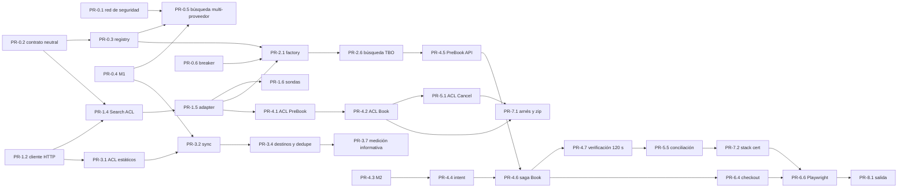

# TBO Hotels — Plan de implementación por fases

Los requisitos están en [08-requisitos-maestro.md](./08-requisitos-maestro.md). Este documento dice **en qué orden se
construyen, en qué PRs, con qué tests se cierran, cuánto esfuerzo cuestan, cuánto calendario ocupan y qué depende de
TBO**. No repite el contrato ni el diseño: cada PR enlaza la sección que lo desarrolla.

> **Cómo leer este documento.** Fuentes y convención de citas en [00-fuentes.md](./00-fuentes.md) §9: "(p. N)" es la
> página **física** del PDF V2.1; "(Postman: `<request>`)" es la colección; "(Cert, <sección>)" es el documento de
> certificación; `ruta:línea` es el repo en el commit `8972c6a` (del 2026-08-28, leído el 2026-09-23). Etiquetas: **VERIFICADO-PDF**,
> **VERIFICADO-POSTMAN**, **VERIFICADO-CERT**, **VERIFICADO-CODIGO** e **INFERIDO**. Todo archivo que este plan nombra
> y que hoy no existe es **PROPUESTA**. Las estimaciones de esfuerzo y calendario son INFERIDO por definición.
>
> **Decisiones que el plan asume.** Las cuatro que el founder firmó el 2026-09-25 —D-TBO-02 (B), sin compuerta de
> valor; D-TBO-03 (A); D-TBO-06 (A), con el requisito "me tiene que mostrar de dónde es" (RF-40); y D-TBO-07 (A)— y,
> para las otras 34, la recomendada (A) de [08](./08-requisitos-maestro.md) §7 hasta que el founder diga otra cosa
> ([Registro de decisiones](./08-requisitos-maestro.md#registro-de-decisiones)). Cada PR
> dice qué decisión lo condiciona (`D-TBO-NN`) y qué pregunta a TBO puede cambiarlo
> ([`Q-NN`](./10-preguntas-para-tbo.md)). **No se reabren** D1 (nunca PAN ni CVV; en TBO, solo `PaymentMode: "Limit"`) ni D9 (BullMQ para las
> sagas con dinero), cerradas el 2026-08-26 en `docs/sabre/10-requisitos-maestro.md` §9 (VERIFICADO-CODIGO).
>
> **Estado al 2026-09-23:** ningún PR de este plan está iniciado. No existe `providers/tbo-hotels/` ni
> `apps/api/src/providers-tbo/` (VERIFICADO-CODIGO, listado de `providers/` y de `apps/api/src/`).
>
> **Revisión del 2026-09-25.** Sin compuerta de valor (D-TBO-02 B): la Fase 2 ya no espera una decisión, PR-3.7 pasa
> a ser una medición informativa que no bloquea nada (§10) y el carril B hace el ACL de las Fases 4 y 5 antes que el
> catálogo, así que el zip sale unas tres semanas antes (§2.4). Portal, credenciales live y primera venta no se mueven.
> RF-40 entra en PR-0.5, PR-2.2, PR-2.6, PR-6.1 y PR-6.2 (§19).

---

## 0. Resumen

1. **Nueve fases, 53 PRs pequeños.** El orden es el del encargo: (0) plataforma sin TBO, (1) ACL y Search,
   (2) wiring y búsqueda, (3) catálogo, (4) PreBook y Book, (5) post-venta, (6) UI, (7) certificación y (8)
   producción. El número de fase dice **qué área** toca un PR; el grafo de dependencias (§5) dice **cuándo** se hace.
   Por eso las partes del ACL de las Fases 4 y 5 y el arnés se construyen antes que la UI: el zip de certificación
   solo necesita el ACL (D-TBO-05, opción A).
2. **Esfuerzo: ≈ 136 días-persona** (rango −15 % / +40 %: 115 a 190 d-p). Es solo mano de obra: las esperas de TBO no
   consumen d-p y sí consumen calendario (§2).
3. **Calendario.** Con **dos personas**: zip enviado en la semana 7-8, búsqueda combinada Despegar + TBO en
   desarrollo en la semana 9, portal listo en la semana 17 y primera venta real hacia la semana 22 (hasta la 26 si TBO
   usa sus plazos máximos). Con **una persona**: zip en la semana 11, portal listo en la semana 33 y primera venta
   entre la 37 y la 40. **TBO no llega al soft launch de la Ola 1** (noviembre de 2026) con ninguna de las dos
   dotaciones (§1).
4. **44 de los 53 PRs se construyen y se cierran sin credenciales de TBO**, con fixtures sacados de los ejemplos del
   PDF (normalizados y con su página en el nombre). Los 9 restantes necesitan el entorno de test o el live para su
   criterio de salida (§17).
5. **La Fase 0 no nombra a TBO en ningún archivo** y conserva todo su valor si TBO no se firma: es la misma
   generalización que necesitan Hotelbeds o RateHawk (D-TBO-01). Empieza por la red de seguridad de la vertical de
   hoteles, que hoy tiene un solo archivo de test (VERIFICADO-CODIGO, listado de `apps/api/src/hotels/`).
6. **Sin compuerta de valor (D-TBO-02 B, firmada el 2026-09-25).** Se construye todo. PR-3.7 produce las cifras de
   cobertura y precio como información para el founder y el equipo comercial; ningún PR ni fase depende de ellas
   (§10). El valor se mide en producción después del piloto.
7. **Despegar y vuelos se tocan en nueve PRs.** Cada uno tiene su protección escrita: tests de caracterización previos,
   snapshot de "contenido idéntico", comportamiento por defecto compatible y flags (§16).
8. **Qué se empieza hoy:** PR-0.1 (red de seguridad de hoteles), PR-0.7 (arregla un bug vivo de la cola) y PR-1.0
   (higiene de secretos antes de la primera credencial), más el envío del email con el pedido de credenciales
   ([Q-92](./10-preguntas-para-tbo.md#q-92)). Detalle en §23.

---

## 1. Encaje con el roadmap y con el maestro

### 1.1 Lo que dice el roadmap

`docs/discovery/07-roadmap-olas.md` fija el inicio en mayo de 2026 (Mes 0) y el lanzamiento de la Ola 1 en noviembre de
2026 (Mes 6) (`:5-6`). Para hoteles prevé (VERIFICADO-CODIGO):

| Mes | Tarea del roadmap                                | Línea  |
| --- | ------------------------------------------------ | ------ |
| 2   | Adapter HotelDo (search hoteles)                 | `:74`  |
| 2   | Temporal self-hosted + primera saga              | `:81`  |
| 3   | Adapter Hotelbeds APITUDE (búsqueda + pre-book)  | `:94`  |
| 3   | Saga de reserva multi-proveedor con compensación | `:96`  |
| 3   | Mapping Giata para deduplicar hoteles            | `:97`  |
| 4   | Cancelación + reembolso vía proveedor            | `:116` |
| 6   | Soft launch B2B Colombia + Brasil                | `:153` |

TBO no aparece. El repo tiene un solo proveedor de hoteles, `providers/despegar-hotels`, y ni HotelDo ni Hotelbeds
(VERIFICADO-CODIGO, listado de `providers/`). Temporal tampoco existe y D9 lo dejó así a conciencia. Contado desde mayo,
hoy (2026-09-23) es el Mes 4 del roadmap (INFERIDO por aritmética).

### 1.2 Cambio de alcance que el founder tiene que aprobar

- **Lo que se agrega.** Con D-TBO-01 (A), TBO ocupa el lugar de segundo bedbank que el roadmap le daba a Hotelbeds en
  el Mes 3. La Fase 0 de este plan es exactamente la "saga multi-proveedor" y la base de deduplicación que el roadmap
  ya pedía (`:96-97`): esa parte no es expansión de alcance.
- **Lo que no cabe.** La reserva TBO en producción exige la certificación completa: JSON Verification de al menos
  3 días y Portal Verification de al menos "1 weeks" (Cert, JSON Verification; Cert, Website/Portal Verification),
  VERIFICADO-CERT. Aun con dos personas, la primera venta cae hacia la semana 22 desde el arranque (§2.4). Si el
  arranque es en octubre de 2026, eso es febrero o marzo de 2027: **Ola 2** (INFERIDO).
- **Decisión que se pide.** Aprobar que la búsqueda y la reserva TBO se propongan para la Ola 2 y que en la Ola 1
  solo entre la Fase 0, o reasignar prioridades de la Ola 1 para adelantarlas. Si el founder elige D-TBO-01 (B),
  la Fase 0 sigue en pie y las Fases 1 a 8 esperan.
- **El roadmap tiene que corregirse** en el mismo pase: hoy contradice al repo en proveedores y en Temporal. Es la
  misma observación de `docs/sabre/11-plan-implementacion.md` §1.4 (VERIFICADO-CODIGO).

### 1.3 Correspondencia con las fases F0-F6 de 08

[08](./08-requisitos-maestro.md) §8 propone las fases F0 a F6 y delega en este documento el orden definitivo. La
numeración de este plan es la del encargo; la equivalencia es:

| Este plan | 08 §8                           | Diferencia y motivo                                                                                                                                                                                                                        |
| --------- | ------------------------------- | ------------------------------------------------------------------------------------------------------------------------------------------------------------------------------------------------------------------------------------------ |
| Fase 0    | F0 + parte de F3                | Los tests de caracterización (F0) y la generalización de la vertical (F3) van juntos y antes que TBO. La migración M1 (en 08, F2) se adelanta aquí porque la necesitan tanto la búsqueda (Fase 2) como el sync (Fase 3), y no nombra a TBO |
| Fase 1    | F1 (Search y cliente)           | Las operaciones del ACL de PreBook, Book, BookingDetail y Cancel viven en las Fases 4 y 5 como **carril ACL** y se ejecutan antes que la UI (§5)                                                                                           |
| Fase 2    | F3 (lo propio de TBO)           | Factory, credenciales, contexto, nacionalidad, piso y búsqueda combinada                                                                                                                                                                   |
| Fase 3    | F2                              | Sin la migración M1, que pasó a la Fase 0                                                                                                                                                                                                  |
| Fase 4    | F4                              | Sin la UI, que pasa a la Fase 6                                                                                                                                                                                                            |
| Fase 5    | F5                              | Sin la UI                                                                                                                                                                                                                                  |
| Fase 6    | UI de F3, F4 y F5               | Toda la UI junta, con la Playwright que hoy no existe (§20, P-03)                                                                                                                                                                          |
| Fase 7    | F1 (arnés) + F6 (certificación) | Arnés de sondas en PR-1.6; `run`/`zip` en PR-7.1; stack de certificación en PR-7.2                                                                                                                                                         |
| Fase 8    | F6 (salida)                     | Migración M4, runbook y habilitación piloto                                                                                                                                                                                                |

Las fases son las mismas piezas; cambia dónde se cortan. Los criterios de salida de 08 §8 siguen valiendo y están
repartidos en los criterios de salida de cada fase de este plan.

---

## 2. Cómo leer las estimaciones

### 2.1 Supuesto de dotación

| Supuesto                       | Valor                                                                 | Motivo                                                                                              |
| ------------------------------ | --------------------------------------------------------------------- | --------------------------------------------------------------------------------------------------- |
| Perfil A                       | Backend senior TypeScript/NestJS con experiencia en sagas y Postgres  | Fases 0, 2, 4 y 5 (carril plataforma)                                                               |
| Perfil B                       | Full-stack TypeScript: ACL, herramientas y Next.js                    | Fases 1 y 3, carril ACL de 4 y 5, arnés, Fase 6                                                     |
| Dotación base                  | **2 personas** (A + B). También se da el calendario con **1 persona** | `docs/discovery/08-organizacion-equipo.md`: el equipo está por contratar (mismo supuesto que Sabre) |
| Días útiles de foco por semana | **4**                                                                 | Regla de `docs/sabre/11-plan-implementacion.md` §2.1 (VERIFICADO-CODIGO)                            |
| Conversión                     | 1 semana = 4 d-p por persona                                          | Ídem                                                                                                |

### 2.2 Calidad de las estimaciones

- **Acotadas, no defendibles.** Salen del recuento de archivos y touchpoints de [06](./06-seams-integracion-repo.md)
  §6 y del precedente de Sabre, cuyas fases con código legible se estimaron con ±40 %.
- **Rango asimétrico −15 % / +40 %.** Las Fases 4 y 5 dependen de respuestas que hoy no existen: la forma de "no
  existe" de `BookingDetail` ([Q-37](./10-preguntas-para-tbo.md#q-37)), la idempotencia del Book
  ([Q-35](./10-preguntas-para-tbo.md#q-35)) y la semántica del `200` de Cancel
  ([Q-49](./10-preguntas-para-tbo.md#q-49)). Las posturas defensivas ya están diseñadas, así que una respuesta
  adversa cambia configuración y funciones puras, no la arquitectura.
- **Reserva de soporte de certificación: 4 d-p** para responder el Excel de hallazgos de TBO ("Issues, Observations and
  General queries", Cert, JSON Verification). Es una reserva, no un PR.
- **Lo que no está en ningún número:** las esperas de TBO (credenciales, agenda de verificación, sign-off), la gestión
  comercial y las decisiones del founder (§18).

### 2.3 Mapa de fases

| Fase  | Entrega                                                                                                              | Esfuerzo (d-p) | ¿Nombra a TBO? | Credenciales para cerrar               | Depende de                                                 |
| ----- | -------------------------------------------------------------------------------------------------------------------- | -------------: | -------------- | -------------------------------------- | ---------------------------------------------------------- |
| **0** | Vertical de hoteles multi-proveedor, breaker por cuenta, cola con `delay`                                            |           17,5 | **No**         | No                                     | D-TBO-06 (firmada) para PR-0.2 a 0.5; D-TBO-32 para PR-0.6 |
| **1** | ACL: cliente HTTP, errores, guardas D1, Search, arnés de sondas                                                      |          14,25 | Sí             | Solo PR-1.6 (test)                     | D-TBO-01                                                   |
| **2** | Factory BYOC, credenciales, contexto, nacionalidad, piso, búsqueda combinada con el proveedor de cada tarifa (RF-40) |             13 | Sí             | No                                     | Fin de la Fase 0; D-TBO-03 y D-TBO-06 (firmadas)           |
| **3** | Contenido estático, sync, mapa de destinos, deduplicación, medición informativa                                      |           15,5 | Sí             | PR-3.5 y 3.7 (test y acceso comercial) | D-TBO-04, D-TBO-11, D-TBO-12                               |
| **4** | PreBook, intent, Book híbrido, recuperación a 120 s, cobro `Limit`, bóveda de payloads                               |             26 | Sí             | No (la verificación real va en Fase 7) | D-TBO-07 (firmada); D-TBO-09, 20, 21, 24                   |
| **5** | Lecturas, cancelación, HCN, conciliación diaria                                                                      |           15,5 | Sí             | No                                     | D-TBO-25 a D-TBO-29                                        |
| **6** | Portal: búsqueda, detalle, PreBook, huéspedes, checkout, reservas, Playwright                                        |           19,5 | Sí             | Solo PR-6.6 (test)                     | Fases 2, 4 y 5                                             |
| **7** | Arnés `run`/`zip`, stack de certificación, entregables + soporte                                                     |             12 | Sí             | Sí (test)                              | D-TBO-05, 35, 36, 37, 38                                   |
| **8** | M4, runbook, habilitación piloto                                                                                     |            2,5 | Sí             | Sí (live)                              | Sign-off de TBO                                            |
|       | **Total**                                                                                                            |      **≈ 136** |                |                                        |                                                            |

Ninguna decisión frena ya una fase: las firmadas el 2026-09-25 lo dicen, y el resto se construye con su opción (A). La
última columna dice qué decisión obligaría a rehacer la fase si el founder elige otra opción; hasta cuándo se puede
cambiar sin retrabajo está en §18. La compuerta de valor, que ocupaba una fila entre las Fases 3 y 4, desapareció con
D-TBO-02 (B).

### 2.4 Calendario con dos personas

`█` trabajo, `▒` soporte, `░` espera de credenciales de test, `▓` espera de TBO (0 d-p). Hitos: **Z** zip enviado,
**P** portal listo, **L** credenciales live, **V** primera venta. Una columna es media semana; la semana 1 es la
primera con las dos personas trabajando.

```text
Semana                     1   3   5   7   9   11  13  15  17  19  21  23
A · Fase 0                 █████████
A · Fase 2                          ███████
A · Fase 4 (genérica)                      ███
A · Fase 4 (saga)                             ██████
A · Fase 5                                          ██████
A · 7.3 + soporte cert.                                   ▒▒▒▒
A · Fase 8                                                         █
B · Fase 1                 ██████
B · ACL 4-5 + arnés              ███████
B · Fase 3 (catálogo)                   ██████
B · Stack cert. (PR-7.2)                      ██
B · Fase 3 (contenido)                          ██
B · Fase 6                                        ██████████
TBO · credenciales test    ░░░░░░░░░░
TBO · JSON Verification                  ▓▓▓▓▓▓▓
TBO · Portal Verification                                   ▓▓▓▓▓
TBO · sign-off y live                                            ▓▓
Hitos                                   Z                   P      L V
```

Lectura del diagrama (INFERIDO, con las duraciones de [07](./07-certificacion.md) §2.9):

- **Sin compuerta, el carril B hace el ACL antes que el catálogo.** El catálogo iba primero para medir el valor antes
  de la semana 7; con D-TBO-02 (B) esa medición no decide nada, y lo que más vale adelantar es el zip, porque las
  respuestas de TBO a los huecos del contrato ([Q-35](./10-preguntas-para-tbo.md#q-35),
  [Q-37](./10-preguntas-para-tbo.md#q-37)) llegan antes de la saga de la Fase 4. El zip sale en la semana 7-8 en
  lugar de la 10-11. PR-3.7 queda al final del catálogo, hacia la semana 10, como medición informativa.
- **Las credenciales de test hacen falta a más tardar en la semana 6**, para las sondas (PR-1.6) y el arnés
  (PR-7.1), que el carril B hace después de PR-4.1, 4.2 y 5.1. La cuenta de catálogo, en la semana 9, para la corrida
  real del sync (PR-3.5). Si las de test llegan tarde, el carril B adelanta el catálogo (PR-3.1 a 3.4 no las
  necesitan) y el zip se corre.
- **La Fase 2 empieza en cuanto termina la Fase 0**, en la semana 5-6: no hay decisión que esperar. La búsqueda
  combinada queda en desarrollo en la semana 9. Las piezas genéricas de la Fase 4 (PR-4.3, 4.4, 4.9 y 4.10) van
  después, antes de la saga.
- **Camino crítico:** carril A (Fases 0, 2, 4 y 5, 62 d-p) y, al final, la Fase 6. Quitar la compuerta no lo acorta:
  el carril A solo recupera la media semana que esperaba la decisión, y el portal sigue listo en la semana 17, que es
  cuando empieza la Portal Verification (≥ 1 semana, estimada en 1-3).
- **Primera venta: semana 22 en el caso central, hasta la 26** si TBO toma el máximo de sus plazos estimados.

### 2.5 Calendario con una persona

Secuencia recomendada: PR-0.1, 0.7, 1.0, 0.2 a 0.5, Fase 1 sin 1.6, carril ACL (4.1, 4.2, 5.1), 1.6, 7.1 →
**zip (semana 11)** → catálogo (3.1, 3.2, 3.4, 3.5 y la medición informativa 3.7), 0.6, Fase 2, Fase 4, Fase 5, 7.2,
3.3, 3.6, Fase 6 → **portal listo (semana 33)** → Portal Verification → **live (semana 36-37)** → Fase 8 →
**primera venta (semana 37-40)**. Son unos 9 meses. INFERIDO. Sin compuerta (D-TBO-02 B), el catálogo ya no tiene que
ir antes del ACL: el zip se adelanta de la semana 14 a la 11 y el resto de las fechas no cambia, porque el trabajo
total antes del portal es el mismo.

---

## 3. Reglas que aplican a todos los PRs

### 3.1 Trunk-based, flags y kill-switch

- **Todo PR se mergea a `main` con TBO apagado en producción.** Tres barreras independientes:
  1. sin cuenta `tbo-hotels` `active` en la bóveda, el factory deja a TBO **ausente** (BYOC puro, D-TBO-03 A; una
     cuenta `sandbox` no resuelve, `db/migrations/0012_provider_accounts.sql:70`, VERIFICADO-CODIGO);
  2. `defaultCallPolicy: 'opt-in'` (D-TBO-18 A): sin `HOTEL_PROVIDERS_OPT_IN=tbo-hotels@<tenantId>` no hay ni una
     llamada, igual que `FLIGHT_PROVIDERS_OPT_IN` en vuelos (`apps/api/src/providers/providers.module.ts:17-48`,
     VERIFICADO-CODIGO);
  3. kill-switch `PROVIDERS_DISABLED` en dos niveles, cableado en producción por PR-0.6.
- **Ramas cortas.** Ningún PR supera 4 d-p. Los que tocan dinero se revisan con el test de la puerta pública en el
  mismo PR, nunca "en un PR de tests posterior".
- **Commits:** Conventional Commits. El título propuesto de cada PR ya lo sigue.

### 3.2 "Sin credenciales" quiere decir fixtures con procedencia

- Los fixtures viven en `providers/tbo-hotels/src/__fixtures__/pdf/` y `…/postman/`, **un archivo por ejemplo y con la
  página física en el nombre** ([06](./06-seams-integracion-repo.md) §7.2). Un `README.md` en esa carpeta registra el
  SHA-256 del PDF (`bb406ac31c5def12`, [00](./00-fuentes.md) §1), la página y la corrección aplicada.
- **Los ejemplos que no son JSON válido se normalizan y se declara la corrección** ([00](./00-fuentes.md) §8.4):
  comillas tipográficas (pp. 12, 34-35, 50-51), `}` final faltante en los dos Search (pp. 11-12), coma faltante
  (p. 40), listas truncadas (pp. 52-55), coma sobrante (p. 62), string roto (pp. 67-69). VERIFICADO-PDF.
- **Nunca entran como fixture** los Book con `NewCard` o `SavedCard` (pp. 34-35, 36-40), ni el `EmailId` de la
  persona de TBO ni el `PhoneNumber` de relleno que lo acompaña en la colección y en los ejemplos 8.1.2 y 8.1.3
  ([00](./00-fuentes.md) §3): se reemplazan por valores sintéticos.
- **"Compila y sus tests pasan" no es "funciona contra TBO".** Los mappers escritos sobre el PDF (PR-1.4, 3.1, 4.1, 4.2
  y 5.1) se reverifican con las respuestas reales que graban PR-1.6 y PR-7.1, que pasan a ser los fixtures
  (RNF-14 punto 4). Es la lección de `docs/sabre/11-plan-implementacion.md` §7.

### 3.3 Migraciones

La última migración del repo es `0040_portfolio_ledger_idempotency.sql` (VERIFICADO-CODIGO). Números tentativos: si
otro PR toma el número antes, se renumera al rebasar. El identificador estable es la letra M.

| Id  | Archivo tentativo                                     | Contenido                                                                                          | PR     |
| --- | ----------------------------------------------------- | -------------------------------------------------------------------------------------------------- | ------ |
| M1  | `db/migrations/0041_hotel_catalog_multi_provider.sql` | [05](./05-contenido-estatico-e-inventario.md) §7.3                                                 | PR-0.4 |
| M2  | `db/migrations/0042_hotel_orders.sql`                 | `orders.provider_booking_ref`, `orders.provider_account_id`, tabla satélite `hotel_order_tracking` | PR-4.3 |
| M5  | `db/migrations/0043_provider_payloads.sql`            | Bóveda cifrada de RQ/RS (sumada a 08 §9 C-10; §20 P-05)                                            | PR-4.9 |
| M3  | `db/migrations/0044_provider_reconciliation.sql`      | Corridas e ítems de conciliación                                                                   | PR-5.5 |
| M4  | `db/migrations/0045_provider_catalog_tbo_hotels.sql`  | Fila `tbo-hotels` en `provider_catalog`                                                            | PR-8.1 |

### 3.4 Definición de listo de un PR

- Tests del PR en verde en CI, incluidos los de integración con Postgres, que traen una aserción que corre sin base
  para que un salto silencioso no cuente como verde ([06](./06-seams-integracion-repo.md) §7.5).
- Ningún umbral de cobertura baja (`apps/api/vitest.config.ts:52-68`, VERIFICADO-CODIGO).
- Ninguna línea de log nueva con cabeceras, cuerpos, `username`, nombres, email ni teléfono (RNF-05).
- El PR dice en su descripción qué comportamiento cambia para Despegar o para vuelos, aunque sea "ninguno" (§16).

---

## 4. Índice de PRs

"Cred." dice qué hace falta para cerrar el criterio de salida: **—** nada, **T** credenciales de test, **L** live.

| PR      | Título                                                      | Fase |  d-p | Carril | Cred. | Depende de (PRs)    |
| ------- | ----------------------------------------------------------- | ---- | ---: | ------ | ----- | ------------------- |
| PR-0.1  | Red de seguridad de la vertical de hoteles                  | 0    |  2,5 | A      | —     | —                   |
| PR-0.2  | Contrato neutral de hotel y puertos                         | 0    |    2 | A      | —     | —                   |
| PR-0.3  | Registry de proveedores de hoteles                          | 0    |    3 | A      | —     | 0.2                 |
| PR-0.4  | Catálogo multi-proveedor (M1)                               | 0    |  1,5 | A      | —     | —                   |
| PR-0.5  | Búsqueda de hoteles multi-proveedor                         | 0    |    4 | A      | —     | 0.1, 0.3, 0.4       |
| PR-0.6  | Breaker por efecto y por cuenta; kill-switch en dos niveles | 0    |    3 | A      | —     | —                   |
| PR-0.7  | Cola con `delay` y `jobId` de tres segmentos                | 0    |  1,5 | A      | —     | —                   |
| PR-1.0  | Higiene de secretos TBO                                     | 1    | 0,25 | B      | —     | —                   |
| PR-1.1  | Paquete, configuración y errores                            | 1    |    2 | B      | —     | 1.0                 |
| PR-1.2  | Cliente HTTP y clasificación por `Status.Code`              | 1    |  3,5 | B      | —     | 1.1                 |
| PR-1.3  | Lint D1 para claves PascalCase                              | 1    |    1 | B      | —     | 1.1                 |
| PR-1.4  | Search: builder, esquema y mapper                           | 1    |    4 | B      | —     | 0.2, 1.2            |
| PR-1.5  | Adapter de búsqueda y detalle de un hotel                   | 1    |    2 | B      | —     | 1.4                 |
| PR-1.6  | Arnés: `check` y sondas sin reserva                         | 1    |  1,5 | B      | T     | 1.0, 1.5            |
| PR-2.1  | Factory BYOC, humanizador y filtro                          | 2    |    3 | A      | —     | 0.3, 0.6, 1.5       |
| PR-2.2  | Cuenta `tbo-hotels` en la bóveda y el panel                 | 2    |    2 | A      | —     | 2.1                 |
| PR-2.3  | Contexto de búsqueda en el servidor                         | 2    |    2 | A      | —     | 0.5, 2.1            |
| PR-2.4  | Nacionalidad y límites de ocupación                         | 2    |    2 | A      | —     | 2.1                 |
| PR-2.5  | Piso de precio en la cascada                                | 2    |  1,5 | A      | —     | 0.2, 0.5            |
| PR-2.6  | TBO en la búsqueda de `/hotels`                             | 2    |  2,5 | A      | —     | 0.4, 2.3, 2.4, 2.5  |
| PR-3.1  | ACL de contenido estático                                   | 3    |    3 | B      | —     | 1.2                 |
| PR-3.2  | Herramienta de sync (E0-E3, E5)                             | 3    |    4 | B      | —     | 0.4, 3.1            |
| PR-3.3  | Contenido de hotel (E4)                                     | 3    |    2 | B      | —     | 3.2                 |
| PR-3.4  | Mapa de destinos y equivalencias (E6)                       | 3    |  2,5 | B      | —     | 3.2                 |
| PR-3.5  | Workflow y despliegue del sync                              | 3    |    1 | B      | T     | 3.2                 |
| PR-3.6  | Lectura de contenido en la API                              | 3    |  1,5 | B      | —     | 0.4, 2.1, 3.1       |
| PR-3.7  | Medición informativa de valor (no bloquea)                  | 3    |  1,5 | B      | T     | 3.4, 3.5            |
| PR-4.1  | ACL PreBook                                                 | 4    |    3 | B      | —     | 1.5                 |
| PR-4.2  | ACL Book, BookingDetail y referencias                       | 4    |    4 | B      | —     | 4.1                 |
| PR-4.3  | Órdenes de hotel (M2)                                       | 4    |  1,5 | A      | —     | —                   |
| PR-4.4  | API pública de intent                                       | 4    |  2,5 | A      | —     | 4.3                 |
| PR-4.5  | PreBook en la API                                           | 4    |  2,5 | A      | —     | 2.3, 2.5, 4.1       |
| PR-4.6  | Saga de reserva y Book híbrido                              | 4    |    4 | A      | —     | 4.2, 4.4, 4.5, 4.10 |
| PR-4.7  | Verificación a los 120 s y barrido                          | 4    |    3 | A      | —     | 0.7, 4.6            |
| PR-4.8  | Retención y límite interno `Limit`                          | 4    |  2,5 | A      | —     | 4.6                 |
| PR-4.9  | Bóveda cifrada de payloads (M5)                             | 4    |  2,5 | A      | —     | —                   |
| PR-4.10 | Apagado ordenado del contenedor `api`                       | 4    |  0,5 | A      | —     | —                   |
| PR-5.1  | ACL Cancel y conciliación por fecha                         | 5    |  2,5 | B      | —     | 4.2                 |
| PR-5.2  | Lecturas y estado de órdenes de hotel                       | 5    |  2,5 | A      | —     | 4.3, 4.6, 5.1       |
| PR-5.3  | Cancelación con estados intermedios                         | 5    |    4 | A      | —     | 0.6, 5.1, 5.2       |
| PR-5.4  | Seguimiento del HCN                                         | 5    |  2,5 | A      | —     | 4.3, 4.7, 5.2       |
| PR-5.5  | Conciliación diaria (M3)                                    | 5    |    4 | A      | —     | 4.7, 5.1, 5.2       |
| PR-6.1  | Búsqueda de hoteles en la web                               | 6    |  3,5 | B      | —     | 2.2, 2.6            |
| PR-6.2  | Detalle de hotel                                            | 6    |  2,5 | B      | —     | 2.6, 3.6            |
| PR-6.3  | PreBook y condiciones                                       | 6    |    3 | B      | —     | 4.5                 |
| PR-6.4  | Huéspedes y checkout `Limit`                                | 6    |    4 | B      | —     | 4.6, 4.8            |
| PR-6.5  | Confirmación, voucher, reservas y cancelación               | 6    |  3,5 | B      | —     | 5.2, 5.3, 5.4       |
| PR-6.6  | Playwright y especificaciones U-01 a U-20                   | 6    |    3 | B      | T     | 6.1 a 6.5, 7.2      |
| PR-7.1  | Arnés: `run`, `verify`, `zip` y sondas con reserva          | 7    |    3 | B      | T     | 1.6, 4.2, 5.1       |
| PR-7.2  | Stack de certificación                                      | 7    |    4 | B      | T     | 2.2                 |
| PR-7.3  | Entregables de certificación                                | 7    |    1 | A      | T     | 7.1                 |
| PR-8.1  | M4, runbook y cableado live                                 | 8    |  1,5 | A      | L     | 7.3                 |
| PR-8.2  | Habilitación piloto                                         | 8    |    1 | A      | L     | 8.1                 |

---

## 5. Grafo de dependencias

Solo las aristas que ordenan el trabajo; la tabla de §4 tiene todas.



PR-3.7 no tiene aristas de salida: con D-TBO-02 (B) ningún PR espera la medición, y PR-2.1 depende solo de PR-0.3,
PR-0.6 y PR-1.5.

---

## 6. Fase 0 — Prerrequisitos de plataforma (sin TBO)

**Objetivo.** Que la vertical de hoteles deje de ser mono-proveedor antes de que exista el segundo proveedor, sea cual
sea. Hoy `HotelsService` inyecta la clase concreta de Despegar y fija su código (`apps/api/src/hotels/hotels.service.ts:21`,
`:24`, `:29`, VERIFICADO-CODIGO; [06](./06-seams-integracion-repo.md) §5.1).

**Regla de la fase:** ningún archivo que entregue nombra a TBO. El segundo proveedor de los tests es un stub anónimo,
como en la Fase 2.a de Sabre (`apps/api/src/providers/__fixtures__/stub-provider.factory.ts`, VERIFICADO-CODIGO). Si
TBO no se firma, la fase conserva todo su valor para Hotelbeds o RateHawk.

**Esfuerzo: 17,5 d-p. Credenciales: ninguna.**

#### PR-0.1 — `test(hotels): red de seguridad de la vertical de hoteles` · 2,5 d-p · Cred.: no

- **Objetivo.** RNF-14 punto 3 y G19 de [06](./06-seams-integracion-repo.md) §8: `apps/api/src/hotels/` tiene un solo
  test, `despegar-hotels-errors.test.ts` (VERIFICADO-CODIGO). Fijar el comportamiento actual **antes** de tocarlo.
- **Crea.** `apps/api/src/hotels/hotels.service.test.ts`, `apps/api/src/hotels/hotels.controller.test.ts`,
  `apps/api/src/hotels/hotels.schemas.test.ts`, `apps/api/src/hotels/despegar-hotels-exception.filter.test.ts` y
  `apps/api/src/hotels/__fixtures__/availability.snapshot.json` (salida actual de `/hotels/availability` con un
  adapter falso de Despegar).
- **Modifica.** `apps/api/vitest.config.ts`: trinquete `'src/hotels/**'` con el valor medido. Hoy solo existe el de
  `src/search/**` (`:52-68`, VERIFICADO-CODIGO).
- **Tests que lo cierran.** Búsqueda con cuota, breaker con `PROVIDER_CODE` y waterfall; 503 con catálogo vacío
  (`hotels.service.ts:80-86`); `resolveCityHotelIds` ordena por `hotel_id` y corta en 50 (`:131-141`); prebook y book
  son paso directo (`:165-196`); bordes del esquema: 1-8 habitaciones, hasta 6 niños, edades 0-17
  (`hotels.schemas.ts:7-10`, `:28`); el filtro traduce `DespegarApiError` a 502.
- **Salida.** Los tests pasan **contra el código de hoy sin modificarlo**. El snapshot es la referencia de "contenido
  idéntico" de PR-0.5. CI falla si baja la cobertura de `src/hotels/**`.
- **Depende de.** Nada.

#### PR-0.2 — `feat(canonical): contrato neutral de oferta de hotel y puertos` · 2 d-p · Cred.: no

- **Objetivo.** RF-35. Contrato Zod fuera del ACL de Despegar, con todo lo que [02](./02-search-y-oferta-canonica.md)
  §13.2 lista como faltante.
- **Crea.** `packages/canonical/src/hotel-offer.ts`: `HotelSearchCriteria` (con `guestNationality?` alfa-2 y moneda de
  venta), `HotelOffer`, `HotelRoompack` con `provider: ProviderRef` a nivel de pack (reutiliza `ProviderRefSchema`,
  `packages/canonical/src/offer.ts:66`, VERIFICADO-CODIGO), `rooms[j].occupancy`, `expiresAt`, `atPropertyCharges[]`,
  `includedSupplements[]`, `price.minimumSellingPrice?`, `price.extraGuestCharges?`, `price.nightly?`,
  `cancellation.policySource` y reglas con `fromLocalDateTime`, `fromDateRaw`, `penaltyAmount` y `roomIndex`,
  `boardLabel`, `mealTypeRaw`, `includesTransfers`, `inclusionText`, `promotions`. Puertos
  `packages/domain/src/ports/hotel-search.port.ts`, `hotel-prebook.port.ts`, `hotel-book.port.ts`,
  `hotel-booking-read.port.ts`, `hotel-cancel.port.ts` y `hotel-optional.port.ts` (por referencia de cliente, por
  fecha, sugerencias, tarifas por hotel, pagos, price-jump). Test `apps/api/src/canonical-hotel-offer.test.ts`.
- **Modifica.** `packages/canonical/src/index.ts` y `packages/domain/src/ports/index.ts`, barrels existentes
  ([06](./06-seams-integracion-repo.md) §5.3).
- **Tests que lo cierran.** Un pack mínimo valida; `atPropertyCharges` admite una moneda distinta de la del pack;
  `expiresAt` exige offset; `fromLocalDateTime` lo rechaza; `provider.raw` hereda las reglas de `ProviderRefSchema`.
  El test vive en `apps/api`, igual que el existente `apps/api/src/canonical-provider-ref.test.ts`, porque
  `packages/canonical` no tiene script `test` (`packages/canonical/package.json:17-22`, VERIFICADO-CODIGO).
- **Salida.** Cambio aditivo: nada lo importa todavía salvo su test; `typecheck` del monorepo en verde.
- **Depende de.** D-TBO-06 (A), D-TBO-15 (A), D-TBO-19 (A).

#### PR-0.3 — `refactor(hotels): registry de proveedores de hoteles` · 3 d-p · Cred.: no

- **Objetivo.** RF-36, parte genérica. Espejo de `FlightProviderRegistry` (`apps/api/src/providers/flight-provider.registry.ts`,
  VERIFICADO-CODIGO; [06](./06-seams-integracion-repo.md) §5.4).
- **Crea.** `apps/api/src/providers/hotel-provider.types.ts` (`HotelProviderAdapter`, `HotelProviderCapabilities`,
  `HOTEL_PROVIDER_FACTORIES`, `HOTEL_PROVIDER_FLAGS`), `apps/api/src/providers/hotel-provider.registry.ts`,
  `apps/api/src/providers/hotel-providers.module.ts` (con `EnvHotelProviderFlags` sobre `HOTEL_PROVIDERS_OPT_IN`, espejo
  de `providers.module.ts:28-48`), `apps/api/src/providers/hotel-provider.registry.test.ts`,
  `apps/api/src/providers/__fixtures__/stub-hotel-provider.factory.ts`,
  `apps/api/src/providers-despegar/despegar-hotel-provider.adapter.ts` (envoltorio que implementa
  `HotelProviderAdapter` delegando en el adapter concreto, como `SabreFlightProviderAdapter`,
  `apps/api/src/providers-sabre/sabre.factory.ts:209`, VERIFICADO-CODIGO) y su test.
- **Modifica.** `apps/api/src/providers-despegar/despegar-hotels.factory.ts` (implementa
  `TenantProviderFactory<HotelProviderAdapter>`, con `vertical: 'hotels'` y `humanizeError`; conserva su fallback a
  variables de entorno, TP-16) y `apps/api/src/providers/adapter-cache-isolation.test.ts` (caso de hoteles).
- **Tests que lo cierran.** Orden estable; `byCode` desconocido → `ProviderNotAvailableError`; `opt-in` con el flag
  apagado → cero llamadas y estado `skipped`; Despegar conserva el fallback de plataforma solo porque figura en
  `PLATFORM_DEFAULT_HOTEL_PROVIDERS`; un proveedor sin cuenta y fuera de esa lista queda ausente; el envoltorio
  devuelve lo mismo que el adapter concreto con los fixtures de `apps/api/src/providers-despegar/*.test.ts`.
- **Salida.** Registry con Despegar y el stub de test; `HotelsService` todavía no lo usa;
  `providers/despegar-hotels/` sin cambios. **El ACL de Despegar no se toca**: el mapeo al contrato neutral vive en el
  envoltorio.
- **Depende de.** PR-0.2; D-TBO-06 (A).

#### PR-0.4 — `feat(db): catálogo de hoteles multi-proveedor (M1)` · 1,5 d-p · Cred.: no

- **Objetivo.** RF-31. La migración de [05](./05-contenido-estatico-e-inventario.md) §7.3.
- **Crea.** `db/migrations/0041_hotel_catalog_multi_provider.sql`: `hotel_inventory` gana `provider_city_code`,
  `active` (`DEFAULT true`) y `last_seen_at`, con índice parcial; tablas `hotel_provider_city`,
  `hotel_destination_map`, `hotel_match`, `hotel_content` y `hotel_room_content`, globales, sin RLS y con
  `GRANT SELECT` a `app_user`.
- **Modifica.** `apps/api/src/database/database.types.ts` (`HotelInventoryTable`, `:214-228`, y las tablas nuevas).
- **Tests que lo cierran.** La migración aplica en CI, que crea `pg_trgm` y `unaccent` antes de migrar
  (`.github/workflows/ci.yml:114-122`, VERIFICADO-CODIGO); `app_user` puede leer y no escribir; un test replica el
  `DELETE` + `INSERT` de 12 columnas del sync de Despegar (`tools/sync-hotel-inventory/src/index.ts:96-136`) y
  comprueba que sigue funcionando y que las filas nuevas nacen `active`.
- **Salida.** La corrida nocturna de Despegar posterior al despliegue deja el mismo conteo de filas (verificación
  manual anotada en el PR).
- **Depende de.** D-TBO-10 (A), D-TBO-11 (A), D-TBO-13 (A); [Q-60](./10-preguntas-para-tbo.md#q-60),
  [Q-64](./10-preguntas-para-tbo.md#q-64).

#### PR-0.5 — `refactor(hotels): búsqueda multi-proveedor con degradación visible` · 4 d-p · Cred.: no

- **Objetivo.** RF-13, RF-14 (parte genérica), RF-40 (sobre de la respuesta), RNF-09 y RNF-13; TP-18 a TP-20 y
  TP-66 de [06](./06-seams-integracion-repo.md) §6.
- **Modifica.** `apps/api/src/hotels/hotels.service.ts`: registry en lugar del factory (`:21`, `:29`), sin
  `PROVIDER_CODE` (`:24`); `fanOut` (`apps/api/src/search/provider-fanout.ts:27-50`);
  `resolveCityHotelIds(providerCode, destino, límite)` con `active = true` y orden y límite declarados por cada
  proveedor; breaker en toda llamada; puerta de moneda como la de vuelos (`apps/api/src/search/search.service.ts:70-109`);
  telemetría con `breakdownOf`; la cuota cuenta una vez. `hotels.controller.ts`: tipos neutrales (`:12-22`), respuesta
  `{ hotels, providers[] }` más `showProviderInResults`, resuelto con `ProviderDisclosureService.effective` fuera del
  caché, como `apps/api/src/search/search.controller.ts:84-92` (RF-40); las rutas `payments`, `recovery` y
  `reservations/*` de Despegar quedan gateadas por capacidad. `hotels.schemas.ts`: `z` desde
  `@sales-travel/validation`, `guestNationality` opcional, moneda de venta y límites de ocupación por proveedor.
  `hotels.module.ts`: importa `HotelProvidersModule` y `ProviderDisclosureModule`.
- **Crea.** `apps/api/src/hotels/hotel-search.aggregate.ts` y su test: puerta de moneda, `providers[]` con estado
  `ok`, `empty`, `error` o `skipped` y motivo, y la agrupación por `canonical_hotel_id` preparada pero apagada hasta
  PR-2.6.
- **Tests que lo cierran.** Las suites de PR-0.1 siguen verdes; **contenido idéntico**: con Despegar solo, cada campo
  de `hotels[]` que existe hoy coincide con el snapshot de PR-0.1 y lo nuevo es aditivo; el stub falla → resultados de
  Despegar más `providers[stub].status = 'error'`; fallan todos → 502; stub `opt-in` con el flag apagado → `skipped`
  sin llamadas; dos proveedores → la cuota cuenta 1; stub en USD con búsqueda en COP → `skipped` con el motivo de
  moneda; RF-40 CA 1 a 3 (`apps/api/src/hotels/hotels-envelope-disclosure.test.ts`, espejo de
  `apps/api/src/provider-disclosure/search-envelope-disclosure.test.ts`: con el ajuste en `false` cada roompack
  conserva `provider.name`; un fallo de la divulgación responde `false` sin tumbar la búsqueda).
- **Salida.** Para Despegar el contenido es el mismo; la respuesta crece de forma aditiva; los tests de
  `apps/web-b2b` siguen verdes sin tocar la web.
- **Protección de Despegar.** Despegar declara su límite de 50 y su orden por `hotel_id`. El orden por relevancia de
  D-TBO-17 aplica a TBO; cambiarlo para Despegar es otro PR, con telemetría.
- **Depende de.** PR-0.1, PR-0.3, PR-0.4; D-TBO-06, D-TBO-13, D-TBO-15, D-TBO-17.

#### PR-0.6 — `feat(search): breaker según el efecto del error, circuito por cuenta y kill-switch en dos niveles` · 3 d-p · Cred.: no

- **Objetivo.** RNF-03 y RNF-11 con D-TBO-32 (A). Afecta también a vuelos y a Sabre, y por eso va en la Fase 0.
- **Modifica.** `apps/api/src/search/circuit-breaker.service.ts`: hoy cuenta cualquier excepción (`:90-97`) y lleva un
  circuito por clave (`:31`), VERIFICADO-CODIGO. Pasa a leer `failure.circuit` (`COUNT`, `IGNORE`, `OPEN_ACCOUNT` con
  clave `código@accountRef` y ventana propia); el kill-switch se evalúa por código con dos niveles (`código` apaga todo,
  que es el comportamiento de hoy, y `código:ventas` apaga solo Search, PreBook y Book); el rechazo local es un error
  tipado con marca "previo al envío". `apps/api/src/orders/cancel-retry-policy.ts` reconoce ese rechazo como previo al
  write (hoy cae en `UNVERIFIED`, `:130-135`). `apps/api/src/health/health.controller.ts` agrega o excluye los
  circuitos de cuenta en el snapshot público (`:50`). `infrastructure/hostinger/docker-compose.prod.yml` y
  `.github/workflows/deploy.yml` pasan `PROVIDERS_DISABLED`, `FLIGHT_PROVIDERS_OPT_IN` y `HOTEL_PROVIDERS_OPT_IN` al
  contenedor `api`, que hoy no los recibe (G13).
- **Tests que lo cierran.** Un error sin `failure` cuenta como hoy (Despegar y LATAM sin cambios); cinco `IGNORE` no
  abren; `OPEN_ACCOUNT` abre solo esa cuenta; `/health` sin ids de tenant; `x:ventas` no frena lecturas de post-venta;
  un rechazo local en Cancel se clasifica como previo al write.
- **Salida.** Suite de vuelos en verde y umbral de `src/search/**` intacto (`apps/api/vitest.config.ts:62-67`); las
  variables llegan al contenedor.
- **Depende de.** D-TBO-32 (A); [Q-91](./10-preguntas-para-tbo.md#q-91).

#### PR-0.7 — `fix(queue): delay en post-sale y jobId de tres segmentos` · 1,5 d-p · Cred.: no

- **Objetivo.** RF-38, parte genérica. Dos defectos vivos (VERIFICADO-CODIGO): `add()` no acepta `delay`
  (`apps/api/src/queue/post-sale-queue.service.ts:110`) y el `jobId` de cancelación tiene dos segmentos
  (`cancel:<orderId>`, `:80`), que BullMQ 5.78.0 rechaza; `add()` devuelve `false` y el reintento previo al write nunca
  se encola ([04](./04-post-venta-detalle-cancelacion-y-conciliacion.md) §10).
- **Modifica.** `post-sale-queue.service.ts` (`extra.delay`; `cancel:<orderId>:<intento>`),
  `apps/api/src/queue/__fixtures__/recording-queue.service.ts` (registra `delay` y valida los tres segmentos como
  BullMQ) y `.github/workflows/ci.yml` (servicio `redis:7` en el job de integración, que hoy solo tiene Postgres,
  `:55-68`).
- **Crea.** `apps/api/src/queue/post-sale-queue.integration.test.ts`: contra BullMQ real acepta todos los `jobId` que
  se usan y ejecuta un job con `delay` después del retardo; se salta sin `REDIS_URL` con una aserción que corre igual.
- **Salida.** Una cancelación con fallo transitorio previo al write encola su reintento (test).
- **Arrastra a vuelos.** El reintento automático de cancelaciones empieza a funcionar como estaba diseñado: se
  declara en el PR.
- **Depende de.** Nada.

**Criterio de salida de la Fase 0.** Búsqueda de hoteles por registry con Despegar solo y contenido idéntico; stub
anónimo que degrada con motivo visible; breaker por efecto; cola con `delay`; `grep -rnwi tbo` sobre los archivos que
entrega la fase sin resultados (con `-w`, para no contar subcadenas como `outbound`, [00](./00-fuentes.md) §8.3).

---

## 7. Fase 1 — ACL `providers/tbo-hotels`: cliente, Search y fixtures

**Objetivo.** Un paquete que, dado un criterio neutral, devuelve ofertas neutrales válidas, con errores tipados,
guardas D1 y tests por la puerta pública del cliente. Forma de Despegar, cliente de AgentCars y salvaguardas de Sabre
([06](./06-seams-integracion-repo.md) §3.3). **No toca `apps/api`.**

**Esfuerzo: 14,25 d-p. Credenciales: solo PR-1.6.**

#### PR-1.0 — `chore(tbo): higiene de secretos antes de la primera credencial` · 0,25 d-p · Cred.: no

- **Objetivo.** RC-08. `.gitignore:32` ignora solo `.env` y `.gitignore:105` solo `.env.sabre`; `.env.tbo` no está
  cubierto (VERIFICADO-CODIGO).
- **Modifica.** `.gitignore` (+ `.env.tbo`, `.tbo-cert/`).
- **Crea.** `.env.tbo.example` con la plantilla de [07](./07-certificacion.md) §6.2, sin valores.
- **Salida.** `git check-ignore .env.tbo .tbo-cert/x` devuelve las dos rutas. Se mergea **antes** de que alguien cree
  el primer `.env.tbo`.

#### PR-1.1 — `feat(tbo-hotels): paquete, configuración y errores` · 2 d-p · Cred.: no

- **Objetivo.** RF-01 y RF-04 (clases); RNF-12.
- **Crea.** `providers/tbo-hotels/package.json` (forma de [06](./06-seams-integracion-repo.md) §4.1: `types` a `dist`,
  scripts `lint` y `test`, `zod` directo), `tsconfig.json`, `tsconfig.build.json` (copia de
  `providers/sabre/tsconfig.build.json`), `src/index.ts` (superficie explícita) y `src/index.surface.test.ts` (modelo:
  `providers/sabre/src/index.surface.test.ts`); `src/config.ts` (`environment` obligatorio; `baseUrl` sin valor por
  defecto en live; `http:` solo en test y con el host `api.tbotechnology.in`; usuario sin `:`; contraseña sin `trim`;
  `parseTboConfig` con `ruta:código`; `TBO_BASE_URLS` solo con `test`); `src/errors.ts` (`TboApiError` con `status`
  HTTP separado de `tboCode`, `failure` con 14 `kind`; `TboConfigError`, `TboCredentialsMissingError`,
  `TboRequestBuildError`, `TboOfferExpiredError`, `TboResponseMappingError`, `TboCancelMappingError`,
  `TboPackageOnlyRateError`); `src/internal/decimal.ts` (decimal exacto a unidades menores, half-up, guarda de
  exponente ISO 4217); `src/internal/coerce.ts`; `src/internal/tbo-date.ts`; un test por archivo.
- **Tests que lo cierran.** RF-01 CA 1 a 5; `JSON.stringify` de la configuración sin la contraseña; `"17.22"` y
  `17.22` dan el mismo importe; una moneda de exponente distinto de 2 se rechaza.
- **Depende de.** PR-1.0; D-TBO-30 (A); [Q-03](./10-preguntas-para-tbo.md#q-03),
  [Q-04](./10-preguntas-para-tbo.md#q-04), [Q-06](./10-preguntas-para-tbo.md#q-06).

#### PR-1.2 — `feat(tbo-hotels): cliente HTTP, operaciones y clasificación por Status.Code` · 3,5 d-p · Cred.: no

- **Objetivo.** RF-02, RF-03, RNF-01, RNF-02 (limitador en memoria), RNF-05 (lista blanca de log) y la guarda de
  cliente de RNF-04.
- **Crea.** `src/http/operations.ts` (`TBO_OPERATIONS`: 11 operaciones con el casing del PDF, verbo, timeout, marca de
  dinero e intentos, tabla de RNF-01); `src/http/tbo-http.client.ts` (Basic calculado una vez en campo privado;
  `fetch`, logger, métricas, reloj, `sleep`, `random`, `uuid`, limitador y bóveda inyectables;
  `AbortSignal.timeout` que cubre el cuerpo; `redirect: 'manual'`; barrido de claves de tarjeta →
  `TboRequestBuildError`); `src/http/status-envelope.ts` ([01](./01-autenticacion-conectividad-y-errores.md) §8.3 y
  §8.4, envelope sin distinguir mayúsculas, excepción de `hotelcodelist`); `src/http/limiter.ts` (por `accountRef`,
  con cupos de ventas, dinero y fondo); `src/redaction.ts`; fixtures `src/__fixtures__/envelope/*.json`, uno por fila
  de las tablas de 01.
- **Tests que lo cierran.** Por la puerta pública y con `fetch` espiado: una fila de 01 §8.3 y §8.4 por caso (HTTP 200
  con `Code` 405 incluido); un cuerpo lento corta por timeout; `/Book` y `/Cancel` hacen **una** llamada aunque alguien
  edite la tabla (`money-paths.guard.test.ts`); el logger espía nunca recibe `Authorization`, `FirstName`, `EmailId`
  ni `PhoneNumber`; ningún literal de path fuera de `TBO_OPERATIONS`.
- **Depende de.** PR-1.1; D-TBO-17 (A); [Q-05](./10-preguntas-para-tbo.md#q-05),
  [Q-07](./10-preguntas-para-tbo.md#q-07), [Q-08](./10-preguntas-para-tbo.md#q-08),
  [Q-09](./10-preguntas-para-tbo.md#q-09), [Q-10](./10-preguntas-para-tbo.md#q-10),
  [Q-12](./10-preguntas-para-tbo.md#q-12), [Q-61](./10-preguntas-para-tbo.md#q-61).

#### PR-1.3 — `feat(lint): D1 reconoce claves de tarjeta PascalCase y los modos con tarjeta` · 1 d-p · Cred.: no

- **Objetivo.** RNF-04, capa 4. La regla D1 compara con claves camelCase sin indicador de mayúsculas
  (`eslint.config.mjs:50-75`, VERIFICADO-CODIGO) y no detecta `CardNumber`, `CvvNumber` ni `PaymentInfo` (p. 33,
  VERIFICADO-PDF).
- **Modifica.** `eslint.config.mjs`: suma las claves PascalCase de [03](./03-prebook-y-book.md) §7.3 y un bloque solo
  para `providers/tbo-hotels/**/*.request.builder.ts` con el literal de los modos `NewCard` y `SavedCard`, que **repite**
  los tres selectores D1 porque en la configuración plana el bloque posterior reemplaza al anterior.
- **Crea.** `providers/tbo-hotels/src/pan-lint-rule.guard.test.ts`: ESLint real sobre una sonda; dispara con las
  claves de TBO y con los literales; no dispara sobre `PaymentInfo?: never` ni sobre un `*.response.mapper.ts`.
- **Salida.** El guard de Sabre (`providers/sabre/src/pan-lint-rule.guard.test.ts`) sigue verde.
- **Depende de.** PR-1.1; D1; [Q-81](./10-preguntas-para-tbo.md#q-81).

#### PR-1.4 — `feat(tbo-hotels): Search — builder, esquema tolerante y mapper a la oferta neutral` · 4 d-p · Cred.: no

- **Objetivo.** RF-05, RF-07, RF-10 y RF-11 (mapper), RF-09 (cálculo de `expiresAt`).
- **Crea.** `src/search/search.request.builder.ts` (reglas S-01 a S-06 de [02](./02-search-y-oferta-canonica.md)
  §2.3; `emptyChildrenAges` configurable con `'empty-array'` por defecto; hasta 100 códigos); `src/search/response.schema.ts`
  (02 §10, cada pack con `safeParse`, nombres de claves desconocidas registrados); `src/search/response.mapper.ts`
  (pack = roompack; `provider.offerRef = BookingCode`; `raw: { searchId }`; moneda de `HotelResult` sin valor por
  defecto; `minimumSellingPrice`; `atPropertyCharges`; `expiresAt = searchSentAt + 27 min`); `src/search/meal-type.ts`;
  `src/cancellation/policy.mapper.ts`; fixtures `src/__fixtures__/pdf/search-single-room.p15.json`,
  `search-multi-room.p16.json`, `search-no-availability.p18.json` y `src/__fixtures__/postman/search.request.json`
  (con sus discrepancias anotadas); `src/__fixtures__/README.md`.
- **Tests que lo cierran.** Los casos 1 a 6 de certificación como tests del builder con el `PaxRooms` exacto de
  [07](./07-certificacion.md) §4.2 (RF-05 CA-3); RF-07 CA 1 a 6; RF-10 CA 1 y 3; RF-11 CA 1 a 4; `201` → lista vacía;
  un pack con importe negativo se descarta y se mide; un `HotelResult` sin `Currency` se descarta.
- **Salida.** Los tres fixtures producen packs válidos contra `hotel-offer.ts`; ningún tipo crudo sale del paquete.
- **Verificación diferida.** Las respuestas reales de PR-1.6 y PR-7.1 reemplazan a los fixtures del PDF.
- **Depende de.** PR-0.2, PR-1.2; D-TBO-14, 15, 16, 17 y 19; [Q-13](./10-preguntas-para-tbo.md#q-13) a
  [Q-16](./10-preguntas-para-tbo.md#q-16), [Q-18](./10-preguntas-para-tbo.md#q-18),
  [Q-20](./10-preguntas-para-tbo.md#q-20) a [Q-24](./10-preguntas-para-tbo.md#q-24),
  [Q-26](./10-preguntas-para-tbo.md#q-26) a [Q-28](./10-preguntas-para-tbo.md#q-28),
  [Q-65](./10-preguntas-para-tbo.md#q-65), [Q-88](./10-preguntas-para-tbo.md#q-88),
  [Q-89](./10-preguntas-para-tbo.md#q-89); para el hash de la fuente en el README de fixtures (RNF-15),
  [Q-01](./10-preguntas-para-tbo.md#q-01).

#### PR-1.5 — `feat(tbo-hotels): adapter de búsqueda y detalle de un hotel` · 2 d-p · Cred.: no

- **Objetivo.** RF-14 (lado ACL), D-TBO-17 y D-TBO-19.
- **Crea.** `src/tbo-hotels.adapter.ts` (`TboHotelsAdapter` implementa `HotelSearchPort`; una sola llamada de hasta 100
  códigos por defecto; lotes y concurrencia detrás de la opción `searchBatching` para D-TBO-17 B; detalle de un hotel
  con `IsDetailedResponse: true` y un solo código; un único deadline) y su test.
- **Tests que lo cierran.** 101 códigos → una llamada de 100 (opción A) o dos lotes (opción B); lote fallido →
  resultado parcial con motivo; timeout sin reintento; el detalle manda un solo código.
- **Depende de.** PR-1.4; [Q-10](./10-preguntas-para-tbo.md#q-10), [Q-15](./10-preguntas-para-tbo.md#q-15),
  [Q-19](./10-preguntas-para-tbo.md#q-19).

#### PR-1.6 — `feat(tools): arnés TBO — check y sondas sin reserva` · 1,5 d-p · Cred.: **test**

- **Objetivo.** RC-02 y RC-04 (parte sin reserva). Cerrar con evidencia las preguntas que no esperan a TBO.
- **Crea.** `tools/tbo/cert-cases.mjs` con los comandos `check` y `probe` (sondas PR-01, PR-02, PR-03, PR-04, PR-06 y
  PR-08 de [07](./07-certificacion.md) §6.8); carga `.env.tbo` como `tools/sabre/cert-probe.mjs:33-42` (VERIFICADO-CODIGO);
  `fetch` grabador de 07 §6.4; importa `providers/tbo-hotels/dist/index.js`. `tools/tbo/README.md`.
- **Salida.** `check` imprime `Status.Code`, la `Currency` del perfil de test y la latencia; las respuestas de las
  sondas se transcriben a [10](./10-preguntas-para-tbo.md) y cierran, si corresponde,
  [Q-03](./10-preguntas-para-tbo.md#q-03), [Q-05](./10-preguntas-para-tbo.md#q-05),
  [Q-07](./10-preguntas-para-tbo.md#q-07), [Q-13](./10-preguntas-para-tbo.md#q-13),
  [Q-15](./10-preguntas-para-tbo.md#q-15), [Q-18](./10-preguntas-para-tbo.md#q-18) y
  [Q-82](./10-preguntas-para-tbo.md#q-82). Si PR-01 muestra que `[]` se rechaza, cambia una línea del builder.
- **Depende de.** PR-1.0, PR-1.5; credenciales de test ([Q-92](./10-preguntas-para-tbo.md#q-92)); D-TBO-31,
  D-TBO-33. Las sondas PR-05 y PR-07 necesitan builders de la Fase 4 y se suman en PR-4.2 y PR-4.1.

**Criterio de salida de la Fase 1.** `pnpm --filter @sales-travel/tbo-hotels test` en verde; los casos 1 a 6 como
tests del builder; guardas D1 en la suite; con credenciales, `check` responde `200` y las sondas quedan transcritas.

---

## 8. Fase 2 — Wiring en `apps/api`, credenciales BYOC y búsqueda en `/hotels`

**Objetivo.** Que un tenant habilitado vea hoteles TBO junto a los de Despegar en la misma búsqueda, cada tarifa con
su proveedor (RF-40), con la cuenta del consolidador heredada, sin fallback de plataforma y con cada omisión explicada
(D-TBO-03 A y D-TBO-06 A, firmadas el 2026-09-25). **Empieza en cuanto termina la Fase 0:** no hay compuerta que
esperar (D-TBO-02 B).

**Esfuerzo: 13 d-p. Credenciales: ninguna para cerrar** (la búsqueda real contra test se ejerce en PR-7.2).

#### PR-2.1 — `feat(providers-tbo): factory BYOC, humanizador y filtro de errores` · 3 d-p · Cred.: no

- **Objetivo.** RF-36 (parte TBO), RF-04 (humanizador y filtro), RNF-06 (caché por dueño).
- **Crea.** `apps/api/src/providers-tbo/tbo-hotels.factory.ts` (`implements TenantProviderFactory<HotelProviderAdapter>`;
  `PROVIDER_CODE = 'tbo-hotels'`; capacidades que se encienden a medida que el adapter implementa cada puerto;
  `defaultCallPolicy: 'opt-in'`; BYOC puro con la puerta de credenciales **fuera** de cualquier `try` que atrape
  `NotFoundException` ([06](./06-seams-integracion-repo.md) §5.2); solo acepta cuentas cuyo dueño sea `platform` o
  `consolidator` mientras [Q-77](./10-preguntas-para-tbo.md#q-77) siga abierta, usando `tenants.tenant_type`
  (`db/migrations/0011_tenant_hierarchy.sql:11-12`, VERIFICADO-CODIGO); caché `byoc:{ownerTenantId}:{updatedAt}`),
  `tbo-hotels.module.ts`, `tbo-hotels-errors.ts` (`Record<TboFailureKind, …>` con variantes propia, heredada y de
  entorno, y campo `reason`), `tbo-hotels-exception.filter.ts` (loguea solo `toLogMeta()`) y sus tests, más
  `tbo-cancel-classification.test.ts` (los errores de TBO frente a `classifyCancelThrownFailure`: `479` no cae en la
  regla de 4xx; timeout en `/Cancel` → `UNVERIFIED`; `TboCancelMappingError` → `UNVERIFIED`).
- **Modifica.** `apps/api/package.json` y `pnpm-lock.yaml` (dependencia); `apps/api/src/providers/hotel-providers.module.ts`
  (registra el factory); `apps/api/src/hotels/hotels.controller.ts` (segundo filtro, precedente en
  `apps/api/src/search/search.controller.ts:58`); `apps/api/src/orders/order-provider-dispatch.guard.test.ts`
  (`'tbo-hotels'` en `NO_ES_VUELOS`, `:50`); `apps/api/src/search/sin-ofertas-fabricadas.guard.test.ts` (segunda raíz en
  `hotels.controller.ts`, TP-67).
- **Tests que lo cierran.** RF-36 CA 1 a 4; cuenta de una agencia → ausente con motivo; cuenta `sandbox` → ausente;
  mutación: quitar la llamada a `missingTboCredentials` pone el test en rojo; aislamiento de caché entre dueños.
- **Salida.** En producción no hay cuenta TBO en la bóveda: TBO está ausente y no sale ninguna llamada.
- **Depende de.** PR-0.3, PR-0.6, PR-1.5; D-TBO-03 (A, firmada), D-TBO-18 (A), D-TBO-32;
  [Q-77](./10-preguntas-para-tbo.md#q-77), [Q-87](./10-preguntas-para-tbo.md#q-87),
  [Q-90](./10-preguntas-para-tbo.md#q-90).

#### PR-2.2 — `feat(credentials): cuenta tbo-hotels en la bóveda y en el panel` · 2 d-p · Cred.: no

- **Objetivo.** RF-37 y RF-01 (panel).
- **Modifica.** `apps/api/src/provider-credentials/provider-specs.ts` (entrada `'tbo-hotels'` con `username` y
  `password` solo cifrados, y `environment` y `baseUrl` en `safeConfigKeys`, patrón de `:184-201`);
  `apps/api/src/provider-credentials/dto.test.ts` (casos de TP-23); `apps/web-b2b/src/lib/provider-forms.ts`
  (`PROVIDERS`, `:308`: usuario, contraseña **sin** `trim` —hoy `effectiveValue` recorta todo, `:351-355`—,
  entorno, `baseUrl` obligatoria en live, aviso ante `http`, `fallsBackToPlatformCredentials: false`, visible solo para
  nodos consolidador y plataforma); `apps/web-b2b/src/lib/provider-forms.test.ts` (lista de `PROVIDERS`);
  `apps/web-b2b/src/lib/provider-display.ts` (ficha, TP-56).
- **Tests que lo cierran.** `password` en `config` se rechaza sin eco; el formulario no recorta la contraseña; una
  cuenta nueva nace `sandbox` (`apps/api/src/provider-credentials/provider-credentials.service.ts:124`, `:140`) y la
  pantalla explica que no habilita nada hasta promoverla.
- **Depende de.** PR-2.1; D-TBO-03, D-TBO-30; [Q-04](./10-preguntas-para-tbo.md#q-04),
  [Q-06](./10-preguntas-para-tbo.md#q-06), [Q-77](./10-preguntas-para-tbo.md#q-77),
  [Q-90](./10-preguntas-para-tbo.md#q-90).

#### PR-2.3 — `feat(hotels): contexto de búsqueda en el servidor` · 2 d-p · Cred.: no

- **Objetivo.** RF-08 y RNF-06 punto 2.
- **Crea.** `apps/api/src/hotels/hotel-search-context.store.ts` y su test: clave `(tenantId, searchId)`, vencimiento
  igual al de la oferta, entradas validadas con Zod (fechas, `PaxRooms`, `GuestNationality`, `searchSentAt`, huella de
  la cuenta y, por pack, `BookingCode` y literal de `TotalFare`), sobre `CachePort`
  (`packages/core/src/ports/cache.port.ts`, VERIFICADO-CODIGO).
- **Modifica.** `apps/api/src/hotels/hotels.service.ts` (guarda el contexto tras un Search de TBO).
- **Tests que lo cierran.** RF-08 CA 1 a 5; un acierto de caché conserva `searchSentAt`; la nacionalidad no entra en
  `search_logs.criteria`.
- **Salida.** Un contexto perdido (por ejemplo, tras un despliegue) pide volver a buscar: falla hacia el lado seguro.
- **Depende de.** PR-0.5, PR-2.1; [Q-29](./10-preguntas-para-tbo.md#q-29).

#### PR-2.4 — `feat(hotels): nacionalidad del pasajero principal y límites de ocupación por proveedor` · 2 d-p · Cred.: no

- **Objetivo.** RF-06 (servidor) y los límites de [02](./02-search-y-oferta-canonica.md) §3.1.
- **Modifica.** `packages/validation/src/index.ts` (tabla ISO 3166 alfa-3 → alfa-2), `apps/api/src/hotels/hotels.schemas.ts`,
  `apps/api/src/providers-tbo/tbo-hotels.factory.ts` (capacidad `requiresGuestNationality`, hasta 4 niños) y
  `apps/api/src/hotels/hotel-search.aggregate.ts` (motivos de omisión).
- **Tests que lo cierran.** RF-06 CA 1 a 4; habitación con 5 niños → TBO `skipped` con motivo y Despegar responde;
  `'COL'` → `'CO'`.
- **Depende de.** PR-2.1; D-TBO-14 (A); [Q-14](./10-preguntas-para-tbo.md#q-14),
  [Q-17](./10-preguntas-para-tbo.md#q-17).

#### PR-2.5 — `feat(pricing): piso de precio del proveedor en la cascada` · 1,5 d-p · Cred.: no

- **Objetivo.** RF-12 con D-TBO-16 (A).
- **Modifica.** `apps/api/src/pricing/pricing.service.ts` (paso `provider_floor` después de `applyCascade`, atribuido al
  tenant que vende, y excluido del margen de los ancestros en `toTenantView`) y `apps/api/src/hotels/hotels.service.ts`
  (`withPricing` aplica el piso aunque el tenant no tenga reglas; hoy devuelve las ofertas sin `pricing`,
  [02](./02-search-y-oferta-canonica.md) §9.5).
- **Tests que lo cierran.** RF-12 CA 1 a 3 con el ejemplo de 02 §9.5 (neto 305.75, piso 321.34); sin
  `minimumSellingPrice` no hay piso, así que Despegar no cambia.
- **Depende de.** PR-0.2, PR-0.5; [Q-23](./10-preguntas-para-tbo.md#q-23).

#### PR-2.6 — `feat(hotels): TBO en la búsqueda de /hotels` · 2,5 d-p · Cred.: no

- **Objetivo.** RF-14, RF-33 (uso), RF-34 (agrupación), RF-40 (cada tarifa conserva su proveedor al agrupar), RNF-07
  y RNF-13 para TBO.
- **Modifica.** `apps/api/src/hotels/hotels.service.ts`: destino → `CityCode` de TBO por las filas `accepted` de
  `hotel_destination_map` (sin mapeo → `skipped` "sin mapeo de destino", sin tocar el breaker); hasta 100 códigos por
  relevancia; nombre, estrellas, dirección y coordenadas desde `hotel_inventory`; agrupación por `canonical_hotel_id`
  que fusiona tarifas, cada una con su proveedor; `/hotels/detail` de un hotel TBO = Search de un solo código con
  políticas "sujetas a confirmación". `apps/api/src/hotels/hotel-search.aggregate.ts`.
- **Crea.** `apps/api/src/hotels/hotels.tbo-search.integration.test.ts` (Postgres con catálogo, mapa y equivalencias
  sembrados; `fetch` falso inyectado en el módulo de test con los fixtures de PR-1.4).
- **Tests que lo cierran.** RF-14 CA 1 a 3; RF-33 CA; una tarjeta agrupada muestra las dos tarifas, cada una con su
  `provider.name` (`despegar-hotels` y `tbo-hotels`) aunque el ajuste de divulgación esté en `false` (RF-40 CA 1 y 5,
  lado API); `201` → `empty`; error de TBO → `error` con motivo y Despegar igual; una búsqueda cuenta 1 en la cuota.
- **Salida.** En un entorno de desarrollo con catálogo sembrado, `/hotels/availability` devuelve Despegar y TBO
  combinados (semana 9 en el calendario de dos personas). En producción no cambia nada.
- **Depende de.** PR-0.4, PR-2.3, PR-2.4, PR-2.5; D-TBO-10, 13, 15, 17, 18, 19;
  [Q-19](./10-preguntas-para-tbo.md#q-19), [Q-20](./10-preguntas-para-tbo.md#q-20),
  [Q-87](./10-preguntas-para-tbo.md#q-87), [Q-88](./10-preguntas-para-tbo.md#q-88).

**Criterio de salida de la Fase 2.** Búsqueda combinada con degradación visible en desarrollo, cada tarifa con su
proveedor y `showProviderInResults` en el sobre (RF-40); BYOC de agencias bloqueado mientras Q-77 siga abierta; TBO
ausente en producción.

---

## 9. Fase 3 — Contenido estático, sync de inventario y resolución de destinos

**Objetivo.** Que exista el catálogo TBO del que depende la búsqueda: "sin catálogo local no hay búsqueda TBO"
([05](./05-contenido-estatico-e-inventario.md) §0), porque Search solo acepta `HotelCodes` y no devuelve nombre ni
estrellas (pp. 10, 13-15, VERIFICADO-PDF). Y producir, como información, las cifras de valor de PR-3.7, que con
D-TBO-02 (B) no deciden nada (§10).

**Esfuerzo: 15,5 d-p. Credenciales: PR-3.5 y PR-3.7.** Herramienta aparte, no una extensión de
`tools/sync-hotel-inventory` (D-TBO-12 A; [05](./05-contenido-estatico-e-inventario.md) §6.2).

#### PR-3.1 — `feat(tbo-hotels): cliente de contenido estático y normalización` · 3 d-p · Cred.: no

- **Objetivo.** RF-32 y RNF-16.
- **Crea.** En `providers/tbo-hotels/src/static/`: builders y mappers de `CountryList`, `CityList`, `TBOHotelCodeList`,
  `HotelDetails` y `hotelcodelist`, con el borde Zod que acepta lo observado ([05](./05-contenido-estatico-e-inventario.md)
  §3); `html-sanitizer.ts` (lista blanca, texto plano derivado, servicios negados); `src/tbo-static-content.client.ts`
  (solo métodos de contenido, sin venta); fixtures `country-list.p52.json`, `city-list.p54.json`,
  `hotelcodelist.p55.json`, `hotel-details-request.p58.json`, `hotel-details.p59.json` y `tbo-hotel-code-list.p67.json`,
  con las correcciones de [00](./00-fuentes.md) §8.4 declaradas.
- **Tests que lo cierran.** RF-32 CA (`"ThreeStar"` y `5` → 3 y 5; `Map` `"0|0"` → sin coordenadas; un `script` se
  elimina al ingerir); el cliente de contenido no expone métodos de venta (test de superficie).
- **Depende de.** PR-1.2; D-TBO-12; [Q-61](./10-preguntas-para-tbo.md#q-61) a
  [Q-68](./10-preguntas-para-tbo.md#q-68).

#### PR-3.2 — `feat(tools): sync-tbo-hotel-inventory (etapas E0-E3 y E5)` · 4 d-p · Cred.: no

- **Objetivo.** RF-30, sin contenido ni mapeo.
- **Crea.** `tools/sync-tbo-hotel-inventory/` con `package.json` (con `test`, a diferencia del sync actual, que no
  tiene script `test`, `tools/sync-hotel-inventory/package.json:7-14`), `tsconfig.json`, `Dockerfile` que copia `packages/` y
  `providers/` y compila por grafo (modelo `apps/api/Dockerfile`), `src/env.ts` (Zod de `TBO_SYNC_*`), etapas E0 a E3 y
  E5 de [05](./05-contenido-estatico-e-inventario.md) §6.3, `src/writer.ts` (upsert y barrido por ciudad con guarda de
  caída máxima; **nunca `DELETE`**), tests unitarios y `writer.integration.test.ts`.
- **Tests que lo cierran.** RF-30 CA 1 a 4; lock consultivo → la segunda corrida sale con 0; N `429` seguidos →
  "ok parcial"; sin credenciales → `skip`; la herramienta ESM importa el ACL CommonJS (humo).
- **Salida.** Con `fetch` falso, una corrida sobre dos países hace upsert y barrido sin `DELETE` y sin
  `Authorization` en los logs.
- **Depende de.** PR-0.4, PR-3.1; D-TBO-04, D-TBO-11, D-TBO-12; [Q-10](./10-preguntas-para-tbo.md#q-10),
  [Q-60](./10-preguntas-para-tbo.md#q-60), [Q-63](./10-preguntas-para-tbo.md#q-63),
  [Q-64](./10-preguntas-para-tbo.md#q-64), [Q-69](./10-preguntas-para-tbo.md#q-69),
  [Q-93](./10-preguntas-para-tbo.md#q-93).

#### PR-3.3 — `feat(tools): contenido de hotel (E4)` · 2 d-p · Cred.: no

- **Objetivo.** RF-30 y RF-32 para `HotelDetails`.
- **Modifica.** La herramienta de PR-3.2: etapa E4 (lotes de 10, nunca más de 13, partición ante fallo; ES, PT y EN
  según demanda; `content_hash`; contenido de `TBOHotelCodeList` como respaldo en inglés). `hotel_room_content` queda
  apagado (N10).
- **Tests que lo cierran.** Un lote que falla se parte hasta aislar el código; el hash evita reescribir.
- **Depende de.** PR-3.2; [Q-62](./10-preguntas-para-tbo.md#q-62), [Q-65](./10-preguntas-para-tbo.md#q-65),
  [Q-66](./10-preguntas-para-tbo.md#q-66), [Q-67](./10-preguntas-para-tbo.md#q-67).

#### PR-3.4 — `feat(tools): mapa de destinos y equivalencias de hotel (E6)` · 2,5 d-p · Cred.: no

- **Objetivo.** RF-33 y RF-34 (cálculo), con los algoritmos de [05](./05-contenido-estatico-e-inventario.md) §8.3 y §9.1.
- **Crea.** `tools/sync-tbo-hotel-inventory/src/stages/e6-hotel-match.ts` y `e6-destination-map.ts`, con tests sobre
  datos sembrados; consulta de destinos buscados sin mapeo, ordenados por demanda.
- **Tests que lo cierran.** Dos candidatos → `review`; una fila `manual` no se pisa; `ambiguous` no se usa.
- **Depende de.** PR-3.2; D-TBO-10, D-TBO-13; [Q-70](./10-preguntas-para-tbo.md#q-70).

#### PR-3.5 — `ci(sync): workflow y despliegue del sync de TBO` · 1 d-p · Cred.: **test (cuenta de catálogo)**

- **Crea.** `.github/workflows/sync-tbo-hotel-inventory.yml` (horario cercano a las 08:00 UTC con corridas dentro de la
  ventana, `workflow_dispatch`, receta SSH de `.github/workflows/sync-hotel-inventory.yml:29-56`, variables pasadas con
  `-e`).
- **Modifica.** `.github/workflows/deploy.yml` (fila en la matriz, `:44`, y render de `TBO_SYNC_*` como
  `DESPEGAR_*`).
- **Salida.** Una corrida real contra el entorno de test deja filas `tbo-hotels` activas y ciudades con centroide, y la
  siguiente reanuda donde quedó.
- **Depende de.** PR-3.2 a PR-3.4; [Q-92](./10-preguntas-para-tbo.md#q-92), [Q-93](./10-preguntas-para-tbo.md#q-93);
  D-TBO-04, D-TBO-12.

#### PR-3.6 — `feat(hotels): lectura de contenido de hotel en la API` · 1,5 d-p · Cred.: no

- **Crea.** `apps/api/src/hotels/hotel-content.service.ts` y su test (lee `hotel_content` con respaldo en inglés;
  `HotelDetails` bajo demanda para un solo código, con timeout corto y caché por `CachePort`, **sin escribir** tablas
  globales, [05](./05-contenido-estatico-e-inventario.md) §6.3).
- **Modifica.** `apps/api/src/hotels/hotels.controller.ts` (`GET /hotels/content/:providerCode/:hotelId`).
- **Tests que lo cierran.** Solo HTML saneado e imágenes `https`; sin contenido → detalle sin imágenes, no error.
- **Depende de.** PR-0.4, PR-2.1, PR-3.1; [Q-66](./10-preguntas-para-tbo.md#q-66),
  [Q-67](./10-preguntas-para-tbo.md#q-67), [Q-85](./10-preguntas-para-tbo.md#q-85).

#### PR-3.7 — `chore(tbo): medición informativa de cobertura y precio` · 1,5 d-p · Cred.: **test + acceso comercial**

- **Objetivo.** Las dos cifras de [08](./08-requisitos-maestro.md) §2.3 como **información**, no como compuerta
  (D-TBO-02 B, firmada el 2026-09-25). Ningún PR depende de este, y su demora o su resultado no frenan ninguna fase.
- **Crea.** `tools/tbo/value-coverage.sql` (cobertura incremental con `hotel_match`) y el protocolo de muestreo de
  precios de [08](./08-requisitos-maestro.md) §2.3 en `tools/tbo/README.md`. El resultado se archiva como evidencia en
  `docs/tbo/evidence/valor/<fecha>.md` (D-TBO-33). La consulta se deja lista para repetirla en producción con
  tarifas live después de PR-8.2.
- **Salida.** Las dos cifras de §10, publicadas sin umbral ni recomendación de seguir o parar.
- **Depende de.** PR-3.4, PR-3.5; D-TBO-02 (B), D-TBO-33; [Q-60](./10-preguntas-para-tbo.md#q-60),
  [Q-88](./10-preguntas-para-tbo.md#q-88), [Q-94](./10-preguntas-para-tbo.md#q-94) (si se puede versionar la
  evidencia).

**Criterio de salida de la Fase 3.** Destinos habilitados con hoteles TBO activos y mapa aceptado; catálogo de
Despegar intacto. La medición de PR-3.7 no forma parte del criterio: si falta el acceso comercial, la Fase 3 cierra
igual.

---

## 10. Medición de valor, sin compuerta (D-TBO-02 B)

**Ya no es una compuerta.** El founder cerró D-TBO-02 con la opción (B) el 2026-09-25: se construye todo y el valor
se mide en producción ([08](./08-requisitos-maestro.md) §7). [08](./08-requisitos-maestro.md) §2.3 sigue señalando
que ningún documento del set cuantifica lo que TBO aporta, así que las cifras se producen igual, como información.

| Cifra                 | Qué es                                                                                                    | Fuente                                                     |
| --------------------- | --------------------------------------------------------------------------------------------------------- | ---------------------------------------------------------- |
| Cobertura incremental | % de hoteles TBO activos en los destinos habilitados **sin** equivalente en Despegar                      | PR-3.7 sobre `hotel_match`                                 |
| Precio                | En 20-30 estancias reales (CO, PE, BR y emisivos habilitados), % en que el neto TBO mejora al de Despegar | Portal comercial B2B de TBO, si existe (INFERIDO, 08 §2.3) |

- **Qué deciden:** nada por sí solas. No hay umbral (el 15 % de la versión anterior desaparece), no hay GO/NO-GO y
  ninguna fase espera las cifras.
- **Para qué sirven:** priorizar los destinos del sync (D-TBO-12), la conversación comercial con TBO y la línea base
  de la medición en producción, que repite la de precio con tarifas live después del piloto (PR-8.2).
- **Sin acceso al portal comercial:** se publica solo la cobertura y se deja escrito (§20 P-09).
- **Consecuencia aceptada** (R-26 de [08](./08-requisitos-maestro.md) §6; RP-1 de §21): si el aporte resulta bajo,
  el costo de las Fases 2 y 4 a 8 ya está gastado. Reordenar los bedbanks por esas cifras sería una decisión nueva
  del founder sobre D-TBO-01, no un efecto automático de la medición.

---

## 11. Fase 4 — PreBook y Book con órdenes, intent idempotente y recuperación

**Objetivo.** Que una reserva TBO se cree como orden **antes** del Book, que ningún desenlace incierto se pierda y que
el Book nunca se repita solo: "it is mandatory to call the BookingDetail method by using BookingReferenceId after 120
seconds of book response" (p. 42, VERIFICADO-PDF).

**Esfuerzo: 26 d-p.** Dos carriles: **ACL** (PR-4.1 y 4.2, carril B; en el calendario de §2.4 van justo después de
la Fase 1 y antes que el catálogo, para que el zip salga antes) y **plataforma** (carril A; PR-4.3, 4.4, 4.9 y 4.10
son genéricos y van después de la Fase 2; PR-4.5 a 4.8, después de ellos). D-TBO-07 (A) está firmada desde el
2026-09-25: el intent antes del Book ya no es una opción a confirmar.

#### PR-4.1 — `feat(tbo-hotels): PreBook — builder Limit, mapper y comparación de precio` · 3 d-p · Cred.: no

- **Objetivo.** RF-15 y RF-16 (ACL), RF-17 (detección), RF-09 (vencimiento sin tocar TBO).
- **Crea.** `src/prebook/prebook.request.builder.ts` (Zod `.strict()`, `PaymentMode: 'Limit'` literal,
  `PaymentInfo?: never`), `src/prebook/response.schema.ts` (exactamente un `HotelResult` y un elemento en `Rooms`;
  `CreditCardBillingOptions` sin declarar), `src/prebook/response.mapper.ts`, `src/prebook/rate-conditions.ts`
  (algoritmo de [03](./03-prebook-y-book.md) §2.4, señales críticas incluida `PACKAGE_WITH_FLIGHT_ONLY`),
  `src/prebook/compare.ts` (función pura C1/C2), `TboHotelsAdapter.prebook()`; fixtures `prebook-request-limit.p19.json`,
  `prebook-newcard-single-room.p23.json` (solo para probar que `CreditCardBillingOptions` se descarta; PreBook no lleva
  datos de tarjeta, pp. 19-20) y `prebook-limit-multi-room.p28.json` (7.2.2: el título está en la p. 27 y el JSON
  empieza en la p. 28). Suma la sonda PR-07 al arnés.
- **Tests que lo cierran.** RF-15 CA 1 a 4; RF-16 CA 1 (`&amp;lt;script&amp;gt;` termina como texto); el fixture de
  pp. 25 y 30 produce la marca de solo paquete; con reloj falso, PreBook en el minuto 27:01 → `TboOfferExpiredError` y
  cero llamadas.
- **Depende de.** PR-1.5; D-TBO-20, D-TBO-22; [Q-25](./10-preguntas-para-tbo.md#q-25),
  [Q-29](./10-preguntas-para-tbo.md#q-29) a [Q-32](./10-preguntas-para-tbo.md#q-32).

#### PR-4.2 — `feat(tbo-hotels): Book, BookingDetail y referencias de reserva` · 4 d-p · Cred.: no

- **Objetivo.** RF-18 y RF-19 (ACL), RF-24 (esquema y normalización), RF-03 CA-2, RNF-04 capas 1, 2 y 5.
- **Crea.** `src/booking/book.request.builder.ts` (un `CustomerDetails` por habitación en el orden de `PaxRooms`,
  `Title` en `Mr`, `Mrs` o `Ms`, transliteración a ASCII según D-TBO-23 A, 2 a 40 caracteres, literal exacto de
  `TotalFare` o falla cerrado, `BookingType: 'Voucher'`, `PaymentMode: 'Limit'`, `PaymentInfo?: never`);
  `src/booking/booking-reference.ts` (`ST` + entorno + 17 caracteres Crockford base32, con `random` inyectado);
  `src/booking/book.response.mapper.ts`; `src/booking/classify-book-outcome.ts` (función pura: confirmado, fallido o
  incierto, [03](./03-prebook-y-book.md) §3.9); `src/detail/booking-detail.request.builder.ts` (exactamente un
  identificador más `Limit`); `src/detail/response.schema.ts` (tolerante, [04](./04-post-venta-detalle-cancelacion-y-conciliacion.md)
  §3.7); `src/detail/booking-status.ts` (función pura; `Vouchered` equivale a `Confirmed`);
  `src/pan-egress.guard.test.ts` (bytes de PreBook, Book y BookingDetail por la puerta pública; detección de forma de
  PAN con Luhn; sonda de mutación que congela la partición, modelo `providers/sabre/src/pan-egress.guard.test.ts`);
  fixtures `book-request-limit-multi-room.p35.json` (8.1.2 con email y teléfono sintéticos),
  `book-response.p41.json` (8.2.1: título en la p. 40, JSON en la p. 41), `booking-detail-request.p44.json` y `booking-detail.p49.json` (comillas normalizadas; el `BookingDate` malformado se
  conserva como test de robustez). Métodos `book()`, `getBooking()` y `getBookingByClientReference()` del adapter. Suma
  la sonda PR-05 al arnés.
- **Tests que lo cierran.** RF-18 CA 3 y 4 en el builder; RF-19 CA 1 (propiedades del generador); RF-24 CA 1 a 3; un
  Book `200` sin `ConfirmationNumber` → incierto; tabla de clasificación de 03 §3.9 completa.
- **Depende de.** PR-4.1; D-TBO-23 (A); D1; [Q-33](./10-preguntas-para-tbo.md#q-33) a
  [Q-36](./10-preguntas-para-tbo.md#q-36), [Q-39](./10-preguntas-para-tbo.md#q-39) a
  [Q-48](./10-preguntas-para-tbo.md#q-48).

#### PR-4.3 — `feat(db): órdenes de hotel (M2)` · 1,5 d-p · Cred.: no · genérico

- **Objetivo.** RF-19 (índice), RF-26 (tabla satélite), RF-29 (columna).
- **Crea.** `db/migrations/0042_hotel_orders.sql`: `orders.provider_booking_ref TEXT` con índice único parcial
  `(provider, provider_booking_ref)` **entre tenants** ([03](./03-prebook-y-book.md) §3.3); `orders.provider_account_id`;
  tabla `hotel_order_tracking` (estado crudo del proveedor, momento y fuente, subestado, `InvoiceNumber`, campos del HCN,
  `ClientReferenceId`) con `tenant_id` y RLS forzada como `db/migrations/0021_order_operations.sql:28-34`.
- **Modifica.** `apps/api/src/database/database.types.ts` (tablas nuevas y `OrderOperationType`, `:445`, con
  `hcn-check`, `hcn-ticket` y `reconcile`).
- **Tests que lo cierran.** Dos tenants no pueden repetir una referencia (RF-19 CA-1); como `app_user`, la agencia B no
  lee el seguimiento de la A.
- **Depende de.** D-TBO-07 (A), D-TBO-28 (A); [Q-34](./10-preguntas-para-tbo.md#q-34).

#### PR-4.4 — `refactor(orders): API pública de intent para verticales externas` · 2,5 d-p · Cred.: no · genérico

- **Objetivo.** RF-20, parte de persistencia; TP-32. Hoy el intent es privado de vuelos (`insertCreateIntent`,
  `apps/api/src/orders/orders.service.ts:694`; `settleCreateIntent`, `:820`) y `recordExternalOrder` persiste después
  del proveedor (`:278`), VERIFICADO-CODIGO.
- **Crea.** `apps/api/src/orders/external-order-intent.service.ts` y su test (`openExternalCreateIntent`,
  `settleExternalCreateIntent`, `failExternalCreateIntent`), sobre primitivos extraídos de `orders.service.ts`.
- **Modifica.** `apps/api/src/orders/orders.service.ts` (vuelos usa los mismos primitivos; `recordExternalOrder` no
  cambia).
- **Tests que lo cierran.** Suite de creación de vuelos en verde sin cambios; misma clave → 409 `duplicateRequest`; CAS
  solo sobre `pending` con `provider_raw` nulo; un fallo libera la clave; la referencia se escribe en la misma
  transacción.
- **Depende de.** PR-4.3; D-TBO-07 (A), D-TBO-08 (A).

#### PR-4.5 — `feat(hotels): PreBook en la API con revalidación y snapshot` · 2,5 d-p · Cred.: no

- **Objetivo.** RF-15 (servidor), RF-12 con el valor de PreBook, RF-09 CA 2.
- **Crea.** `apps/api/src/hotels/hotel-prebook.service.ts` y su test: contexto de PR-2.3, vencimiento, breaker, C1,
  cascada con piso, snapshot aceptable guardado en el servidor (`prebookRef`), evento `HotelOfferRepriced`.
- **Modifica.** `apps/api/src/hotels/hotels.controller.ts` y `hotels.schemas.ts`: `POST /hotels/prebook` con cuerpo
  neutral `{ providerCode, offerRef, searchId }`; el cuerpo de Despegar se conserva en una unión discriminada.
- **Tests que lo cierran.** RF-15 CA 1 a 4; `315` invalida el contexto; un `searchId` de otro tenant → 400 sin llamar
  a TBO.
- **Depende de.** PR-2.3, PR-2.5, PR-4.1; D-TBO-16, D-TBO-20 (A); [Q-29](./10-preguntas-para-tbo.md#q-29),
  [Q-30](./10-preguntas-para-tbo.md#q-30).

#### PR-4.6 — `feat(hotels): saga de reserva con intent antes del Book y respuesta híbrida` · 4 d-p · Cred.: no

- **Objetivo.** RF-18 (servidor), RF-20, RF-22, RF-10 CA 2, RF-17 (bloqueo).
- **Crea.** `apps/api/src/hotels/hotel-booking.saga.ts` (decisiones puras, como `apps/api/src/orders/order-create.saga.ts`)
  y `apps/api/src/hotels/hotel-booking.service.ts`, con tests.
- **Modifica.** `hotels.controller.ts` (`POST /hotels/book` con `Idempotency-Key` y `userId`; `201`, `202` o `409`),
  `hotels.schemas.ts`, `hotels.module.ts` (importa `OrdersModule` y `AuditModule`) y
  `apps/api/src/reports/reports.service.ts` (`verticalMap`, `:48-53`, que hoy manda a "Vuelos" lo desconocido, `:62`).
- **Flujo.** Validación (huéspedes contra `PaxRooms`, margen de la ventana, `atPropertyAcknowledged`, tarifa solo
  paquete) → intent con `BookingReferenceId`, `provider_account_id` y `search_criteria.vertical = 'hotels'` → PreBook de
  revalidación (C2) y `acceptedTotal` → `OrderCreateRequested` → Book de 120 s, un intento, dentro del proceso y
  **nunca** como job de `post-sale-retry` → clasificación → CAS → `BookingDetail` de cierre → espera de hasta 25 s y
  `201` o `202`.
- **Tests que lo cierran.** RF-20 CA 1 a 6; RF-22 CA 1 y 2; espía: el Book no pasa por la cola; rechazo del breaker
  después del insert → fallo previo al envío y clave liberada; `Book.TotalFare` es el literal de C2.
- **Depende de.** PR-4.2, PR-4.4, PR-4.5, PR-4.10; D-TBO-07, 09, 20, 21, 22 y 23;
  [Q-31](./10-preguntas-para-tbo.md#q-31), [Q-33](./10-preguntas-para-tbo.md#q-33),
  [Q-35](./10-preguntas-para-tbo.md#q-35), [Q-36](./10-preguntas-para-tbo.md#q-36),
  [Q-39](./10-preguntas-para-tbo.md#q-39).

#### PR-4.7 — `feat(orders): verificación del Book incierto a los 120 s y barrido durable` · 3 d-p · Cred.: no

- **Objetivo.** RF-21, RF-38 (jobs), RNF-10.
- **Modifica.** `apps/api/src/queue/post-sale-queue.service.ts` (`POST_SALE_JOBS`, `:11-17`, con `verify-hotel-booking`
  y `post-sale-sweeper`), `apps/api/src/orders/post-sale.worker.ts` (enrutado) y el doble de pruebas.
- **Crea.** `apps/api/src/hotels/hotel-booking-verification.ts` (plan puro: `tf + 120 s`, `+5`, `+15` y `+60 min`;
  desenlaces de [03](./03-prebook-y-book.md) §4.3; con D-TBO-24 A la reserva no encontrada queda "Verificando" hasta la
  conciliación), `apps/api/src/hotels/hotel-booking-verification.service.ts` y `apps/api/src/orders/post-sale-sweeper.ts`
  (cada 15 min con `upsertJobScheduler`, tenant por tenant con `withTenant` o rol de mantenimiento).
- **Tests que lo cierran.** RF-21 CA 1 a 4 con reloj falso; sin Redis → `OrderEscalated` con `queued: false` y el
  barrido lo recoge; el esquema de "no existe" se ajusta a la captura de la sonda PR-05 (RF-21 CA 5).
- **Depende de.** PR-0.7, PR-4.6; D-TBO-24 (A), D-TBO-29 (A); [Q-37](./10-preguntas-para-tbo.md#q-37),
  [Q-38](./10-preguntas-para-tbo.md#q-38).

#### PR-4.8 — `feat(portfolios): retención antes del Book y límite interno por sub-agencia` · 2,5 d-p · Cred.: no

- **Objetivo.** RF-23 con D-TBO-21 (A).
- **Modifica.** `apps/api/src/portfolios/portfolios.service.ts` (`holdBooking`, `:339`, sobre el intent; capacidad por
  vertical en lugar del registry de vuelos) y `apps/api/src/hotels/hotel-booking.service.ts`. El límite interno usa
  `tenants.credit_limit` (`db/migrations/0007_tenant_business_rules.sql:5`, VERIFICADO-CODIGO): sin migración.
- **Tests que lo cierran.** RF-23 CA 1 y 2; un `300` emite `ProviderAccountIssueDetected` al dueño de la cuenta sin
  mostrar su saldo a la sub-agencia.
- **Fuera de este PR.** RF-23 CA 3 (link de pago que vence antes de `expiresAt`) aplica a canales donde paga el
  viajero, que no se declaran en esta certificación (D-TBO-36 A).
- **Depende de.** PR-4.6; D-TBO-03, D-TBO-21; [Q-90](./10-preguntas-para-tbo.md#q-90).

#### PR-4.9 — `feat(payloads): bóveda cifrada de RQ/RS de proveedor (M5)` · 2,5 d-p · Cred.: no · genérico

- **Objetivo.** RNF-05 punto 3 y D-TBO-31 (A): TBO pide "complete logs (JSON request and response)" para un `500`
  (p. 9, VERIFICADO-PDF) y la JSON Verification pide "all the JSON logs" (Cert, JSON Verification).
- **Crea.** `db/migrations/0043_provider_payloads.sql` (RQ y RS cifrados, `request_id`, operación, cuenta,
  vencimiento) y `apps/api/src/provider-payloads/` (servicio con escritura desde `deps.payloadVault`, exportación por
  `requestId` u orden, redactada en live con las claves de [01](./01-autenticacion-conectividad-y-errores.md) §11.3,
  lectura auditada, purga diaria). Cifra con AES-256-GCM reutilizando `apps/api/src/provider-credentials/credentials-cipher.ts`
  (`:10`, `:27`, `:35`, VERIFICADO-CODIGO) con una clave propia.
- **Tests que lo cierran.** Nada de la bóveda llega al log; la exportación en live sale redactada; toda lectura emite
  un evento de auditoría; la purga borra lo vencido.
- **Depende de.** D-TBO-31 (A); [Q-11](./10-preguntas-para-tbo.md#q-11).

#### PR-4.10 — `chore(infra): apagado ordenado del contenedor api` · 0,5 d-p · Cred.: no · genérico

- **Objetivo.** RF-22 CA 3 y R-23 de 08: hoy `infrastructure/hostinger/docker-compose.prod.yml` no declara
  `stop_grace_period` y `apps/api/src/main.ts` no llama a `enableShutdownHooks` (VERIFICADO-CODIGO, búsqueda sin
  resultados; detalle en [03](./03-prebook-y-book.md) §4.5).
- **Modifica.** `infrastructure/hostinger/docker-compose.prod.yml` (`stop_grace_period: 130s`, `init: true`) y
  `apps/api/src/main.ts` (`enableShutdownHooks`).
- **Salida.** Un despliegue con una petición larga en curso la deja terminar (verificación anotada en el PR).
- **Depende de.** D-TBO-09 (A).

**Criterio de salida de la Fase 4.** Tests en verde con fixtures y, con credenciales de test en un tenant de
desarrollo, una reserva de los casos 1 y 4 de punta a punta con su `BookingDetail` de cierre. **Las Fases 4 y 5 salen
juntas a producción:** con D-TBO-24 (A), la liberación de un Book incierto que no aparece depende de la conciliación de
PR-5.5.

---

## 12. Fase 5 — Post-venta: BookingDetail, Cancel, HCN y conciliación

**Esfuerzo: 15,5 d-p. Credenciales: ninguna para cerrar.** El HCN probablemente no se llene en test
([Q-83](./10-preguntas-para-tbo.md#q-83)): PR-5.4 se verifica con fixtures hasta producción.

#### PR-5.1 — `feat(tbo-hotels): Cancel y BookingDetailsbasedondate` · 2,5 d-p · Cred.: no

- **Objetivo.** RF-25 y RF-28 (lado ACL).
- **Crea.** `src/cancel/cancel.request.builder.ts`, `src/cancel/response.mapper.ts` (`200` y `479` → `{ success }` sin
  lanzar; fallo de esquema → `TboCancelMappingError`; `path` `/Cancel`), `src/reports/booking-by-date.request.builder.ts`
  (`FromDate` y `ToDate`, ventanas de hasta 60 días), `src/reports/booking-by-date.response.mapper.ts` (todo
  `BookingDate` dentro de la ventana o la corrida no vale; `TripName` se descarta), métodos `cancel()` (lectura previa,
  Cancel y lectura posterior, [04](./04-post-venta-detalle-cancelacion-y-conciliacion.md) §4.4) y
  `listBookingsByDate()`; fixtures `cancel-request.p41.json`, `cancel-response.p42.json`,
  `booking-by-date-request.p63.json` (15.1.1: título en la p. 62, JSON en la p. 63, con `fromdate`/`todate` en
  minúsculas frente a `FromDate`/`ToDate` de la tabla, [04](./04-post-venta-detalle-cancelacion-y-conciliacion.md)
  §5.3) y `booking-by-date.p64.json`.
- **Tests que lo cierran.** Ya cancelada → éxito idempotente sin enviar; en curso → no se envía; `479` con lectura
  `Confirmed` → `success: false`; una lectura posterior fallida no vuelve `UNVERIFIED` un `200`; ventana validada.
- **Depende de.** PR-4.2; D-TBO-25 (A); [Q-49](./10-preguntas-para-tbo.md#q-49) a
  [Q-51](./10-preguntas-para-tbo.md#q-51), [Q-56](./10-preguntas-para-tbo.md#q-56) a
  [Q-58](./10-preguntas-para-tbo.md#q-58).

#### PR-5.2 — `feat(orders): lecturas y estado de órdenes de hotel` · 2,5 d-p · Cred.: no

- **Objetivo.** RF-24, RF-26, RF-29; G7 de [06](./06-seams-integracion-repo.md) §8.
- **Modifica.** `apps/api/src/orders/orders.service.ts` (la consulta manual enruta por vertical, `:1065-1072`; la fila
  se lee con RLS **antes** de llamar a TBO); `apps/api/src/orders/orders.controller.ts` (capacidades por registry en vez
  de fijas, `:38-53`, `:237-240`; `serialize` expone subestado, estado del proveedor y HCN sin PII; filtro de TBO);
  `apps/api/src/orders/orders.module.ts`; `apps/api/src/orders/order-events.ts` (eventos nuevos de 04 §6.5) y los
  motivos nuevos de `OrderEscalated`; `apps/api/src/provider-credentials/provider-credentials.service.ts` (no se borra
  ni se desactiva una cuenta con reservas activas, RF-29 CA 2).
- **Tests que lo cierran.** La tabla de 04 §6.3 como test de función pura; RF-29 CA 1 a 3 (integración como
  `app_user`: la agencia B no lee la orden de la A aunque compartan la cuenta heredada).
- **Depende de.** PR-4.3, PR-4.6, PR-5.1; D-TBO-25, D-TBO-28; [Q-46](./10-preguntas-para-tbo.md#q-46) a
  [Q-48](./10-preguntas-para-tbo.md#q-48), [Q-59](./10-preguntas-para-tbo.md#q-59).

#### PR-5.3 — `feat(orders): cancelación de hotel con estados intermedios` · 4 d-p · Cred.: no

- **Objetivo.** RF-25 y RF-38 (`verify-cancellation`).
- **Modifica.** `orders.service.ts` (`runCancel` resuelve el registry de hoteles, `:1214-1217`; acepta "aceptada, no
  final", `:1320-1337`; cierra una cancelación `UNVERIFIED` con evidencia de lectura solo en la dirección segura,
  `:1809-1816`); `packages/domain/src/ports/order-manage.port.ts` (`OrderCancelResult`, `:79-84`, gana campos aditivos);
  cola y worker (`verify-cancellation` a 2 min, 15 min, 1 h, 6 h y 24 h); `apps/api/src/portfolios/portfolios.service.ts`
  (libera la retención cuando la verificación cierra en `cancelled`, `:481-537`).
- **Crea.** `apps/api/src/hotels/hotel-cancellation.ts` (función pura: penalidad estimada con el snapshot de PreBook en
  la hora del hotel).
- **Tests que lo cierran.** RF-25 CA 1 a 4; suite de cancelación de vuelos en verde; `refundAmount` vacío para TBO.
- **Depende de.** PR-0.6, PR-5.1, PR-5.2; D-TBO-25 (A), D-TBO-26 (A); [Q-49](./10-preguntas-para-tbo.md#q-49) a
  [Q-53](./10-preguntas-para-tbo.md#q-53).

#### PR-5.4 — `feat(orders): seguimiento del HCN` · 2,5 d-p · Cred.: no

- **Objetivo.** RF-27.
- **Crea.** `apps/api/src/hotels/hcn-plan.ts` (función pura de [04](./04-post-venta-detalle-cancelacion-y-conciliacion.md)
  §8.3, con los ejemplos E1 a E4 de §8.4 como tests), `apps/api/src/hotels/hcn-tracking.service.ts`, job `hcn-check`,
  tarea de operaciones `hcn-ticket` sin PII y eventos `HotelConfirmationNumberReceived` y `…Missing`.
- **Tests que lo cierran.** RF-27 CA; el seguimiento se detiene al cancelar, al pasar el check-in o al llegar el HCN.
- **Depende de.** PR-4.3, PR-4.7, PR-5.2; D-TBO-27, D-TBO-29; [Q-54](./10-preguntas-para-tbo.md#q-54),
  [Q-55](./10-preguntas-para-tbo.md#q-55), [Q-83](./10-preguntas-para-tbo.md#q-83).

#### PR-5.5 — `feat(orders): conciliación diaria por cuenta TBO (M3)` · 4 d-p · Cred.: no

- **Objetivo.** RF-28 y el cierre de D-TBO-24 (A).
- **Crea.** `db/migrations/0044_provider_reconciliation.sql` (corridas e ítems, con RLS del dueño);
  `apps/api/src/reconciliation/reconciliation.plan.ts` (función pura: tramos A y B, clasificador R1 a R8 de 04 §9.4),
  `reconciliation.service.ts`, job `reconcile-provider-account` diario con `upsertJobScheduler` y el botón de
  operaciones "forzar conciliación".
- **Tests que lo cierran.** RF-28 CA; un intent incierto pasa a fallido **solo** si una respuesta válida por fecha que
  cubre su día de creación tampoco lo encuentra; `ProviderBookingUnmatched` solo llega al dueño de la cuenta.
- **Depende de.** PR-4.7, PR-5.1, PR-5.2; D-TBO-24, 27, 28 y 29; [Q-56](./10-preguntas-para-tbo.md#q-56) a
  [Q-59](./10-preguntas-para-tbo.md#q-59), [Q-89](./10-preguntas-para-tbo.md#q-89).

**Criterio de salida de la Fase 5.** Cancelación con estado final por lectura, HCN planificado y conciliación que
detecta R1 a R8 sobre datos sembrados.

---

## 13. Fase 6 — UI `apps/web-b2b`

**Objetivo.** RF-39: el checklist U-01 a U-20 de [07](./07-certificacion.md) §8. Hoy la web de hoteles hace dos
llamadas a la API, sugerencias y disponibilidad (`apps/web-b2b/src/app/(app)/hoteles/actions.ts:101`, `:174`,
VERIFICADO-CODIGO): no hay detalle, PreBook, huéspedes, reserva, reservas de hotel ni cancelación. **Es la ruta
crítica de la certificación** (R-04).

**Esfuerzo: 19,5 d-p. Credenciales: solo PR-6.6.** Los componentes se desarrollan contra la API con catálogo y fixtures
sembrados; la Playwright corre contra el stack de certificación.

#### PR-6.1 — `feat(web-b2b): búsqueda de hoteles multi-proveedor` · 3,5 d-p · Cred.: no

- **Objetivo.** RF-39 (U-02 a U-08) y RF-40 en la web: "me tiene que mostrar de dónde es", con la divulgación
  existente.
- **Modifica.** `apps/web-b2b/src/app/(app)/hoteles/actions.ts` (espejo del contrato neutral, `:5-83`; nacionalidad;
  `providers[]`; `showProviderInResults` leído con `=== true`, como `cotizaciones/actions.ts:252`), `page.tsx` (texto
  neutral y corrección del texto de ayuda de G21, `:122-124`; aviso de degradación por proveedor),
  `_components/hotel-result-card.tsx` (**precio de venta** en lugar del neto, `:62`, `:118`; indicador de cargos en
  el hotel; tarifas agrupadas; pastilla de proveedor **por tarifa** con `providerTagFor` sobre
  `pack.provider.name`, como `cotizaciones/_components/flight-row.tsx:339-345`, y en el "desde" la del proveedor de
  la tarifa más barata), `_components/rooms-picker.tsx` (límites por proveedor, `:15`),
  `_components/hotel-format.ts` (etiqueta desde `boardLabel`; `policySource`) y
  `apps/web-b2b/src/app/(app)/admin/proveedores/page.tsx` (el texto de la tarjeta "Origen de las tarifas en los
  resultados", `:761` y `:812-813`, pasa a decir vuelos y hoteles; el control no cambia).
- **Tests que lo cierran.** RF-40 CA 4 a 6 sobre la función que arma las filas de tarifas: con el ajuste encendido,
  una tarjeta agrupada tiene dos pastillas distintas; apagado o ausente, ninguna.
- **Crea.** `_components/nationality-field.tsx` (prellenado desde el CRM con alfa-3 → alfa-2) y
  `_components/offer-expiry.tsx` (cuenta regresiva y aviso a los 20 minutos), con tests de sus funciones puras.
- **U-xx.** U-02 a U-08.
- **Arrastra a Despegar.** La tarjeta muestra el precio de venta también para Despegar (corrige G3): cambio visible,
  anunciado a las agencias. Y un tenant que ya tiene la divulgación en "Mostrar" por vuelos empieza a ver la pastilla
  "Despegar Hotels" en hoteles, porque el ajuste es uno solo para las dos verticales (RF-40): se anuncia junto con el
  cambio de precio.
- **Depende de.** PR-2.6, PR-2.2 (ficha `tbo-hotels` en `provider-display.ts`, TP-56); D-TBO-06 (firmada), D-TBO-13,
  14, 16 y 19; [Q-27](./10-preguntas-para-tbo.md#q-27).

#### PR-6.2 — `feat(web-b2b): detalle de hotel` · 2,5 d-p · Cred.: no

- **Crea.** `apps/web-b2b/src/app/(app)/hoteles/[hotelKey]/page.tsx` y componentes: contenido (imágenes `https`,
  horarios, secciones saneadas), tarifas por proveedor con la misma pastilla y la misma regla de PR-6.1 (RF-40 CA 4),
  políticas "sujetas a confirmación".
- **Depende de.** PR-2.6, PR-3.6; D-TBO-19; [Q-19](./10-preguntas-para-tbo.md#q-19),
  [Q-24](./10-preguntas-para-tbo.md#q-24), [Q-85](./10-preguntas-para-tbo.md#q-85).

#### PR-6.3 — `feat(web-b2b): PreBook y condiciones` · 3 d-p · Cred.: no

- **Crea.** `apps/web-b2b/src/app/(app)/hoteles/checkout/page.tsx` (paso 1) y los componentes `prebook-summary.tsx`,
  `rate-conditions.tsx` (texto plano, nunca `dangerouslySetInnerHTML`), `cancel-policy.tsx` ("hora local del hotel" y
  penalidad estimada) y el aviso de cambio de precio con aceptación explícita.
- **Tests que lo cierran.** RF-16 CA 2: búsqueda en `apps/web-b2b/src` sin `dangerouslySetInnerHTML` sobre este
  contenido.
- **U-xx.** U-09 a U-11.
- **Depende de.** PR-4.5; D-TBO-20, D-TBO-22; [Q-24](./10-preguntas-para-tbo.md#q-24),
  [Q-31](./10-preguntas-para-tbo.md#q-31), [Q-32](./10-preguntas-para-tbo.md#q-32).

#### PR-6.4 — `feat(web-b2b): huéspedes y checkout Limit` · 4 d-p · Cred.: no

- **Crea.** `_components/guest-form.tsx` (un bloque por habitación en el orden de la búsqueda; `Title`, nombre,
  apellido y tipo fijo), confirmación con los cargos `AtProperty` y su reconocimiento, envío único, espera con estado
  "confirmando" y consulta de la orden; `apps/web-b2b/src/app/api/hotels/book/route.ts` (reenvía `Idempotency-Key` y el
  cuerpo de error completo, y distingue `201` de `202`).
- **Modifica.** `apps/web-b2b/src/lib/api.ts`: un helper **nuevo** que devuelve estado y cuerpo; el existente no
  cambia, porque hoy devuelve solo el cuerpo en éxito y solo `message` en error ([03](./03-prebook-y-book.md) §4.5).
- **U-xx.** U-12 a U-14, U-18 y U-19.
- **Depende de.** PR-4.6, PR-4.8; D-TBO-09, D-TBO-23; [Q-41](./10-preguntas-para-tbo.md#q-41) a
  [Q-44](./10-preguntas-para-tbo.md#q-44).

#### PR-6.5 — `feat(web-b2b): confirmación, voucher, reservas y cancelación de hotel` · 3,5 d-p · Cred.: no

- **Crea.** `apps/web-b2b/src/app/api/orders/[id]/voucher/route.tsx` (PDF, modelo
  `apps/web-b2b/src/app/api/quotations/[id]/pdf/route.tsx`) y `apps/web-b2b/src/app/(app)/reservas/_components/hotel-order-detail.tsx`.
- **Modifica.** `apps/web-b2b/src/app/(app)/reservas/page.tsx` (`isHotelOrder` por `searchCriteria.vertical`, hoy solo
  existe `isCarOrder`, `:99`; etiquetas de subestado "Verificando" y "Cancelación en curso"),
  `reservas/order-capabilities.ts`, diálogo de cancelación con penalidad estimada y confirmación, y
  `apps/web-b2b/src/app/(app)/carteras/CarterasClient.tsx` (nombre del proveedor, TP-63).
- **U-xx.** U-15 a U-17.
- **Depende de.** PR-5.2, PR-5.3, PR-5.4; D-TBO-25, D-TBO-26; [Q-47](./10-preguntas-para-tbo.md#q-47),
  [Q-53](./10-preguntas-para-tbo.md#q-53).

#### PR-6.6 — `test(web-b2b): Playwright y especificaciones U-01 a U-20` · 3 d-p · Cred.: **test**

- **Objetivo.** RF-39 CA ("cada punto U-xx es un test E2E de Playwright contra el entorno de certificación"). Playwright
  no existe en el repo: ningún `package.json` lo declara (VERIFICADO-CODIGO, búsqueda).
- **Crea.** `apps/web-b2b/playwright.config.ts`, `apps/web-b2b/e2e/*.spec.ts` (U-01 a U-19; U-20 es la guía en inglés
  de PR-7.3) y `.github/workflows/e2e-tbo-cert.yml` (manual o nocturno contra el stack de certificación, **no** en el CI
  de cada PR, porque exige TBO real).
- **Salida.** Los 19 specs en verde contra el stack de PR-7.2.
- **Depende de.** PR-6.1 a PR-6.5, PR-7.2.

**Criterio de salida de la Fase 6.** U-01 a U-20 cumplidos en el stack de certificación; RF-40 CA 4 a 7 en verde.

---

## 14. Fase 7 — Certificación

Dos tramos que se solapan: **7.a JSON** (PR-7.1 y el envío del zip, en cuanto el ACL pasa los 8 casos, D-TBO-05 A) y
**7.b Portal** (PR-7.2, PR-6.6 y la verificación de portal). El proceso y sus plazos están en
[07](./07-certificacion.md) §2.

**Esfuerzo: 8 d-p en PRs + 4 d-p de reserva para responder hallazgos.**

#### PR-7.1 — `feat(tools): arnés TBO — run, verify, zip y sondas con reserva` · 3 d-p · Cred.: **test**

- **Objetivo.** RC-02 a RC-04.
- **Crea/Modifica.** `tools/tbo/cert-cases.mjs` (comandos `run`, `verify`, `zip` y `all`; sondas PR-09, PR-10 y PR-11),
  `tools/tbo/lib/guards.mjs` (G-1 a G-13 como funciones puras) y `tools/tbo/package.json` con `test`, para que turbo
  corra los tests de las guardas.
- **Salida.** `all` produce el zip con los 8 casos y `selfcheck.md` sin fallos de las guardas que abortan; las
  respuestas reales pasan a ser fixtures del ACL (§3.2).
- **Depende de.** PR-1.6, PR-4.2, PR-5.1; D-TBO-05, 31, 33 y 38; [Q-33](./10-preguntas-para-tbo.md#q-33),
  [Q-35](./10-preguntas-para-tbo.md#q-35), [Q-43](./10-preguntas-para-tbo.md#q-43),
  [Q-71](./10-preguntas-para-tbo.md#q-71) a [Q-75](./10-preguntas-para-tbo.md#q-75),
  [Q-82](./10-preguntas-para-tbo.md#q-82), [Q-83](./10-preguntas-para-tbo.md#q-83).

#### PR-7.2 — `feat(infra): stack de certificación sin credenciales reales` · 4 d-p · Cred.: **test**

- **Objetivo.** RC-07 con D-TBO-35 (A). Hoy hay un solo entorno desplegado y un tenant sin cuenta propia cae a
  credenciales de plataforma de Despegar y de LATAM ([07](./07-certificacion.md) §7.1).
- **Crea.** `infrastructure/hostinger/docker-compose.cert.yml` (base, Redis y red propios), `tools/seed-tbo-cert-tenant/`
  (tenant raíz `tbo-cert`, usuario `vendedor`, cuenta `tbo-hotels` `active`, cartera con saldo ficticio, reglas de
  markup, clientes ficticios, [07](./07-certificacion.md) §7.3).
- **Modifica.** `infrastructure/hostinger/Caddyfile` (subdominios de certificación) y `.github/workflows/deploy.yml`
  (job `deploy-cert` por `workflow_dispatch` con la misma imagen).
- **Salida.** El `.env` renderizado del stack no contiene variables de ningún otro proveedor (test sobre el render);
  el `vendedor` entra sin MFA y busca y reserva contra TBO test.
- **Depende de.** PR-2.2 (y, para ser útil, las Fases 4 y 5); D-TBO-35, D-TBO-36; [Q-76](./10-preguntas-para-tbo.md#q-76).

#### PR-7.3 — `docs(tbo): entregables de certificación` · 1 d-p · Cred.: **test**

- **Objetivo.** RC-01, RC-09, RC-11; RNF-15.
- **Modifica.** `docs/tbo/07-certificacion.md` (Anexo A: el paso 7 y la línea de `402` ya describen las opciones
  recomendadas de D-TBO-24 y D-TBO-32; se revisan contra lo que el founder firme; Anexo B como guía en inglés, D-TBO-37) y `docs/tbo/10-preguntas-para-tbo.md` (preguntas cerradas por
  sondas).
- **Crea.** `docs/tbo/evidence/cert/<fecha>/` con el zip enviado y, al final, la tabla de sign-off (D-TBO-33).
- **Depende de.** PR-7.1; D-TBO-33, 36, 37 y 38; [Q-72](./10-preguntas-para-tbo.md#q-72),
  [Q-78](./10-preguntas-para-tbo.md#q-78), [Q-79](./10-preguntas-para-tbo.md#q-79),
  [Q-84](./10-preguntas-para-tbo.md#q-84), [Q-86](./10-preguntas-para-tbo.md#q-86),
  [Q-94](./10-preguntas-para-tbo.md#q-94).

**Actividades sin PR (dueño: founder).** Formulario "Client's Details" (D-TBO-38); envío del workflow y del zip a
`apisupport@tbo.com` ([00](./00-fuentes.md) §7); JSON Verification; acceso al portal por canal separado; Portal
Verification; sign-off; "Production Process Form" ([Q-80](./10-preguntas-para-tbo.md#q-80)).

**Criterio de salida de la Fase 7.** Tabla de sign-off archivada con el SHA de git de la versión probada (RC-01) y
credenciales live recibidas.

---

## 15. Fase 8 — Salida a producción

**Esfuerzo: 2,5 d-p. Credenciales: live.**

#### PR-8.1 — `feat(db): tbo-hotels en provider_catalog (M4) y runbook de producción` · 1,5 d-p · Cred.: **live**

- **Crea.** `db/migrations/0045_provider_catalog_tbo_hotels.sql` (fila declarativa con las capacidades reales; hoy nadie
  lee `provider_catalog`, G4) y el runbook de producción de TBO: pase a live **por sustitución** de la cuenta (RC-10;
  `resolve_provider_account` devuelve una sola fila, `db/migrations/0012_provider_accounts.sql:75-76`), rotación de
  contraseña, incidente `500` a las dos direcciones de soporte ([00](./00-fuentes.md) §7), ticket de HCN, uso del
  kill-switch.
- **Modifica.** `.github/workflows/deploy.yml` (`TBO_SYNC_*` de la cuenta live de catálogo).
- **Salida.** Corrida del sync live completa **antes** de habilitar ventas; datos del formulario de producción (por
  ejemplo, IP de salida) entregados (RC-11).
- **Depende de.** Sign-off; D-TBO-30, D-TBO-32; [Q-04](./10-preguntas-para-tbo.md#q-04),
  [Q-06](./10-preguntas-para-tbo.md#q-06), [Q-80](./10-preguntas-para-tbo.md#q-80).

#### PR-8.2 — `feat(hotels): habilitación piloto de TBO` · 1 d-p · Cred.: **live**

- **Modifica.** `HOTEL_PROVIDERS_OPT_IN=tbo-hotels@<tenantId>` para el consolidador piloto y su red; alertas sobre
  `tbo.http.requests{kind}`, `tbo.search.pack_rejected` y escalamientos. Reversión: `PROVIDERS_DISABLED=tbo-hotels:ventas`.
- **Salida (hito V).** Primera reserva real con `BookingDetail` de cierre, conciliación limpia durante 7 días y un HCN
  recibido para un check-in a menos de 30 días. Pasar `callPolicy` a `always` solo si
  [Q-87](./10-preguntas-para-tbo.md#q-87) confirma que no hay costo por búsqueda.
- **Depende de.** PR-8.1; D-TBO-18.

---

## 16. Qué arrastra a Despegar (y a vuelos) y cómo se protege

| PR              | Qué cambia para Despegar o vuelos                                                                                                              | Riesgo                                                | Protección                                                                                                                                                                                  |
| --------------- | ---------------------------------------------------------------------------------------------------------------------------------------------- | ----------------------------------------------------- | ------------------------------------------------------------------------------------------------------------------------------------------------------------------------------------------- |
| PR-0.3          | El factory de Despegar implementa el contrato genérico; su oferta pasa por un envoltorio al contrato neutral                                   | Un mapeo mal hecho cambia precios o habitaciones      | ACL de Despegar intacto; test del envoltorio con los fixtures existentes; PR-0.1 antes                                                                                                      |
| PR-0.4          | `hotel_inventory` gana columnas con valores por defecto                                                                                        | El `DELETE` + `INSERT` nocturno falla                 | Test que replica el insert de 12 columnas; conteo de filas tras la primera corrida                                                                                                          |
| PR-0.5          | `HotelsService` por registry, respuesta con `providers[]`, puerta de moneda                                                                    | Cambian los hoteles o el contenido que ve el vendedor | Snapshot de "contenido idéntico" contra PR-0.1; Despegar conserva límite 50 y orden por `hotel_id`; un pack de Despegar en otra moneda ahora se explica en `providers[]` (cambio declarado) |
| PR-0.6          | El breaker deja de contar errores de negocio; kill-switch en dos niveles; afecta a Despegar, LATAM y Sabre                                     | Un circuito que antes abría ya no abre                | Un error sin `failure` cuenta como hoy; `PROVIDERS_DISABLED=código` conserva su semántica; umbral de `src/search/**`                                                                        |
| PR-0.7          | Los reintentos automáticos de cancelación de vuelos empiezan a encolarse                                                                       | Reintentos que antes no ocurrían                      | Es el comportamiento diseñado; test contra BullMQ real; la idempotencia sigue en `order_operations` (claim 0037)                                                                            |
| PR-4.4          | La creación de órdenes de vuelos usa primitivos extraídos                                                                                      | Regresión en el flujo que genera ingresos             | Suite de creación de vuelos sin cambios; el PR no cambia ningún test existente                                                                                                              |
| PR-5.2 / PR-5.3 | `runCancel` y la consulta manual enrutan por vertical                                                                                          | Una orden de vuelo va al adapter equivocado           | Guard de despacho (`order-provider-dispatch.guard.test.ts`); suites de cancelación de vuelos y autos                                                                                        |
| PR-6.1          | La tarjeta muestra precio de venta para Despegar (corrige G3) y, si la divulgación ya está en "Mostrar", la pastilla "Despegar Hotels" (RF-40) | Sorpresa de las agencias                              | Cambio anunciado; el neto sigue visible para el vendedor si el rol lo permite; la pastilla sigue el ajuste que el consolidador ya eligió para vuelos                                        |

Las reservas de Despegar siguen en su flujo actual (`/hotels/reservations/*`) hasta que se decida D-TBO-08 como tarea
aparte. Ningún PR de este plan hace que Despegar persista órdenes.

---

## 17. Credenciales: qué se hace sin ellas y qué no

| Necesidad                             | PRs                                    | Cuándo hace falta (2 personas)                      | Pregunta                                                                                                                         |
| ------------------------------------- | -------------------------------------- | --------------------------------------------------- | -------------------------------------------------------------------------------------------------------------------------------- |
| Ninguna                               | Los otros 44                           | —                                                   | —                                                                                                                                |
| Cuenta de test (usuario y contraseña) | PR-1.6, PR-6.6, PR-7.1, PR-7.2, PR-7.3 | Semana 6                                            | [Q-92](./10-preguntas-para-tbo.md#q-92)                                                                                          |
| Cuenta de catálogo (test)             | PR-3.5, PR-3.7                         | Semana 9                                            | [Q-93](./10-preguntas-para-tbo.md#q-93)                                                                                          |
| Acceso comercial al portal B2B de TBO | PR-3.7 (muestra de precios)            | Semana 10; sin él, PR-3.7 publica solo la cobertura | [Q-92](./10-preguntas-para-tbo.md#q-92) (d): acceso de la cuenta comercial del consolidador al portal para la muestra de precios |
| Credenciales live y URL live          | PR-8.1, PR-8.2                         | Semana 20-21                                        | [Q-04](./10-preguntas-para-tbo.md#q-04), [Q-80](./10-preguntas-para-tbo.md#q-80)                                                 |

**Postura si las credenciales de test se demoran:** el carril B hace primero PR-4.1, 4.2 y 5.1, que no las necesitan;
si todavía faltan, adelanta el catálogo (PR-3.1 a 3.4) y el zip espera. Ningún PR se mergea "a ciegas" contra un
contrato que no hayamos visto en el PDF.

---

## 18. Gestiones no técnicas y cuándo bloquean

Desde el 2026-09-25 ninguna decisión D-TBO bloquea: cuatro están firmadas y el resto se construye con su opción (A)
([08](./08-requisitos-maestro.md#registro-de-decisiones)). Para esas, "Cuándo" es la fecha hasta la que el founder
puede cambiar de opción sin rehacer trabajo, y "Bloquea" dice qué se rehace si la cambia después.

| Gestión                                                                                        | Dueño   | Bloquea                                                                      | Cuándo                                          |
| ---------------------------------------------------------------------------------------------- | ------- | ---------------------------------------------------------------------------- | ----------------------------------------------- |
| Firmar D-TBO-02 (B), D-TBO-03 (A), D-TBO-06 (A) y D-TBO-07 (A)                                 | Founder | Ya no bloquean                                                               | Hecho el 2026-09-25                             |
| Confirmar o cambiar D-TBO-01 (se aplica la A)                                                  | Founder | Nada; cambiarla después rehace desde PR-1.1                                  | Antes de la semana 1                            |
| Envío del email de [10](./10-preguntas-para-tbo.md) §12 con el pedido de credenciales (DQ-1 A) | Founder | PR-1.6, PR-7.1, PR-3.5                                                       | Hoy                                             |
| Confirmar o cambiar D-TBO-20, D-TBO-22 y D-TBO-23 (se aplica la A)                             | Founder | Nada; cambiarlas después rehace partes de PR-4.1 y PR-4.2                    | Antes de la semana 4                            |
| Confirmar o cambiar D-TBO-09, D-TBO-21 y D-TBO-24 (se aplica la A)                             | Founder | Nada; cambiarlas después rehace partes de PR-4.6 a PR-4.8                    | Antes de la semana 10                           |
| Confirmar o cambiar D-TBO-25 a D-TBO-29, D-TBO-31 y D-TBO-32 (se aplica la A)                  | Founder | Nada; cambiarlas después rehace PR-0.6, PR-4.3, PR-4.9 o partes de la Fase 5 | Antes de la semana 4 (D-TBO-32) y de la 9       |
| Formulario "Client's Details" con D-TBO-35 a D-TBO-38 (se aplica la A)                         | Founder | Envío del zip; cambiar las decisiones después rehace PR-7.2                  | Antes de la semana 7                            |
| Contratación del equipo                                                                        | Founder | Todo el calendario                                                           | La semana 1 empieza con la dotación en su lugar |

La fila del umbral de la compuerta, que el founder tenía que acordar antes de la semana 5, desapareció con D-TBO-02
(B).

---

## 19. Trazabilidad: cada requisito tiene PR

**Requisitos funcionales de [08](./08-requisitos-maestro.md) §3.**

| RF           | PR                                                                                                               |
| ------------ | ---------------------------------------------------------------------------------------------------------------- |
| RF-01        | PR-1.1 (esquema), PR-2.2 (panel)                                                                                 |
| RF-02, RF-03 | PR-1.2; RF-03 CA 2 en PR-4.2                                                                                     |
| RF-04        | PR-1.1 (clases), PR-2.1 (humanizador y filtro), PR-0.6 (rechazo local, CA 5)                                     |
| RF-05        | PR-1.4                                                                                                           |
| RF-06        | PR-0.5 (criterio neutral), PR-2.4 (servidor), PR-6.1 (UI)                                                        |
| RF-07        | PR-0.2 (contrato), PR-1.4 (mapper)                                                                               |
| RF-08        | PR-2.3                                                                                                           |
| RF-09        | PR-1.4 (`expiresAt`), PR-4.1 (vencimiento local), PR-4.5, PR-6.1 (cuenta regresiva)                              |
| RF-10        | PR-1.4, PR-4.6 (reconocimiento en el servidor), PR-6.1, PR-6.3, PR-6.4, PR-6.5                                   |
| RF-11        | PR-1.4, PR-6.1, PR-6.2                                                                                           |
| RF-12        | PR-2.5, PR-4.5 (valor de PreBook)                                                                                |
| RF-13        | PR-0.5                                                                                                           |
| RF-14        | PR-0.5 (genérico), PR-1.5, PR-2.6                                                                                |
| RF-15        | PR-4.1, PR-4.5                                                                                                   |
| RF-16        | PR-4.1, PR-6.3                                                                                                   |
| RF-17        | PR-4.1 (detección), PR-4.6 (bloqueo)                                                                             |
| RF-18        | PR-4.2, PR-4.6, PR-6.4                                                                                           |
| RF-19        | PR-4.2 (generador), PR-4.3 (índice), PR-4.6                                                                      |
| RF-20        | PR-4.4, PR-4.6                                                                                                   |
| RF-21        | PR-4.7 (y PR-5.5 para el cierre de D-TBO-24 A)                                                                   |
| RF-22        | PR-4.6, PR-4.10, PR-6.4                                                                                          |
| RF-23        | PR-4.8 (CA 3 fuera de esta ronda, §20 P-06)                                                                      |
| RF-24        | PR-4.2, PR-5.2                                                                                                   |
| RF-25        | PR-5.1, PR-5.3, PR-6.5                                                                                           |
| RF-26        | PR-4.3, PR-5.2                                                                                                   |
| RF-27        | PR-5.4                                                                                                           |
| RF-28        | PR-5.5                                                                                                           |
| RF-29        | PR-4.3, PR-4.6, PR-5.2                                                                                           |
| RF-30        | PR-3.2, PR-3.3, PR-3.5                                                                                           |
| RF-31        | PR-0.4                                                                                                           |
| RF-32        | PR-3.1, PR-3.3                                                                                                   |
| RF-33        | PR-3.4 (cálculo), PR-2.6 (uso)                                                                                   |
| RF-34        | PR-3.4 (equivalencias), PR-2.6 (agrupación), PR-6.1                                                              |
| RF-35        | PR-0.2                                                                                                           |
| RF-36        | PR-0.3, PR-2.1                                                                                                   |
| RF-37        | PR-2.2                                                                                                           |
| RF-38        | PR-0.7, PR-4.7, PR-5.3, PR-5.4, PR-5.5                                                                           |
| RF-39        | PR-6.1 a PR-6.6, PR-7.2                                                                                          |
| RF-40        | PR-0.5 (sobre, CA 1 a 3), PR-2.2 (ficha TP-56), PR-2.6 (agrupación), PR-6.1 (pastilla y panel, CA 4 a 7), PR-6.2 |

**No funcionales y de certificación.**

| Req                 | PR                                                                                            |
| ------------------- | --------------------------------------------------------------------------------------------- |
| RNF-01              | PR-1.2                                                                                        |
| RNF-02              | PR-1.2, PR-1.5, PR-3.2                                                                        |
| RNF-03, RNF-11      | PR-0.6, PR-2.1, PR-8.2                                                                        |
| RNF-04              | PR-1.2 (guarda de cliente), PR-1.3 (lint), PR-4.1 y PR-4.2 (tipo, Zod y bytes de salida)      |
| RNF-05              | PR-1.2 (log), PR-4.9 (bóveda)                                                                 |
| RNF-06              | PR-0.3, PR-2.1, PR-2.3, PR-4.3, PR-5.2, PR-5.5                                                |
| RNF-07, RNF-13      | PR-0.5, PR-1.2, PR-2.6, PR-6.1                                                                |
| RNF-08              | PR-4.5, PR-4.6, PR-4.7, PR-5.2 a PR-5.5                                                       |
| RNF-09              | PR-0.5                                                                                        |
| RNF-10              | PR-4.7, PR-5.4                                                                                |
| RNF-12, RNF-14      | Todos los PRs del ACL; PR-0.1; PR-3.2 (variables de entorno)                                  |
| RNF-15              | PR-1.4 (hash en el README de fixtures), PR-7.3                                                |
| RNF-16              | PR-3.1, PR-4.1, PR-6.3                                                                        |
| RC-01, RC-09, RC-11 | PR-7.3 y actividades de la Fase 7                                                             |
| RC-02, RC-03, RC-04 | PR-1.6, PR-7.1                                                                                |
| RC-05               | Tabla CK → requisito de [08](./08-requisitos-maestro.md) §5, cubierta por las filas de arriba |
| RC-06               | Fase 6                                                                                        |
| RC-07               | PR-7.2                                                                                        |
| RC-08               | PR-1.0                                                                                        |
| RC-10               | PR-8.1                                                                                        |

---

## 20. Contradicciones y huecos que condicionan este plan

| #    | Hueco o contradicción                                                                                                                                                                                                    | Evidencia                                                                               | Postura adoptada                                                                                                                                                      | TBO                                                                                                                   |
| ---- | ------------------------------------------------------------------------------------------------------------------------------------------------------------------------------------------------------------------------ | --------------------------------------------------------------------------------------- | --------------------------------------------------------------------------------------------------------------------------------------------------------------------- | --------------------------------------------------------------------------------------------------------------------- |
| P-01 | El encargo ordena la búsqueda (Fase 2) antes del catálogo (Fase 3); 08 §8 pone el catálogo (F2) antes de la vertical (F3), y la búsqueda TBO no funciona sin catálogo ([05](./05-contenido-estatico-e-inventario.md) §0) | 08 §8; 05 §0                                                                            | La migración M1 pasa a la Fase 0; la Fase 2 se cierra con catálogo sembrado en tests; en producción la búsqueda TBO se habilita recién después del sync real (PR-3.5) | —                                                                                                                     |
| P-02 | 08 F1 pone todo el ACL y el arnés juntos; aquí el ACL de PreBook, Book y post-venta está en las Fases 4 y 5                                                                                                              | 08 §8                                                                                   | Se ejecuta como carril ACL antes que la UI (§5): el zip sale igual en cuanto el ACL pasa los 8 casos (D-TBO-05 A)                                                     | —                                                                                                                     |
| P-03 | RF-39 exige un test E2E de Playwright por punto U-xx, pero Playwright no existe en el repo                                                                                                                               | 08 RF-39; búsqueda en `package.json` (VERIFICADO-CODIGO)                                | Infraestructura nueva en PR-6.6; corre contra el stack de certificación, fuera del CI de cada PR                                                                      | —                                                                                                                     |
| P-04 | RF-38 pide un test contra BullMQ real y el CI no tiene Redis                                                                                                                                                             | `.github/workflows/ci.yml:55-68` (VERIFICADO-CODIGO)                                    | PR-0.7 suma el servicio `redis:7`; el test se salta con aserción visible si falta                                                                                     | —                                                                                                                     |
| P-05 | La bóveda de payloads de D-TBO-31 necesita almacenamiento y 08 C-10 solo numera M1 a M4                                                                                                                                  | 08 §9 C-10                                                                              | Migración M5 en PR-4.9; ya figura en 08 §9 C-10                                                                                                                       | —                                                                                                                     |
| P-06 | RF-23 CA 3 (link de pago antes de `expiresAt`) solo aplica si paga el viajero, y esta ronda declara solo el portal B2B                                                                                                   | 08 RF-23; D-TBO-36 (A)                                                                  | Fuera de este plan; entra con el primer canal donde pague el viajero                                                                                                  | → [Q-78](./10-preguntas-para-tbo.md#q-78)                                                                             |
| P-07 | RF-12 pide que el piso alcance al componente hotel de un paquete, pero `PackagesService.addItem` recalcula con importes que envía el cliente ([02](./02-search-y-oferta-canonica.md) §9.5 punto 6)                       | 02 §9.5                                                                                 | Fuera de este plan: sin reserva de paquete (D-TBO-22 A) un hotel TBO no se reserva desde Package Studio. Tarea aparte                                                 | → [Q-23](./10-preguntas-para-tbo.md#q-23)                                                                             |
| P-08 | Con D-TBO-24 (A), cerrar un Book incierto que no aparece exige la conciliación de la Fase 5                                                                                                                              | 08 D-TBO-24                                                                             | Las Fases 4 y 5 salen juntas a producción                                                                                                                             | → [Q-37](./10-preguntas-para-tbo.md#q-37)                                                                             |
| P-09 | La medición informativa de PR-3.7 necesita precios representativos y las tarifas de test no lo son (INFERIDO, 08 §2.3); las credenciales live llegan después del sign-off                                                | 08 §2.3; Cert, Sign Off                                                                 | Muestra desde el portal comercial; sin ese acceso se publica solo la cobertura y se deja escrito. Con D-TBO-02 (B) la cifra no decide nada                            | → [Q-92](./10-preguntas-para-tbo.md#q-92) (d) (acceso comercial para la muestra, §17)                                 |
| P-10 | D-TBO-03 (A) deshabilita las cuentas TBO propias de agencias, pero 08 no dice cómo se aplica                                                                                                                             | 08 D-TBO-03                                                                             | El factory y el panel solo aceptan cuentas cuyo dueño sea `platform` o `consolidator` (`db/migrations/0011_tenant_hierarchy.sql:11-12`, VERIFICADO-CODIGO)            | → [Q-77](./10-preguntas-para-tbo.md#q-77)                                                                             |
| P-11 | El contexto de búsqueda sobre `CachePort` en memoria se pierde en un despliegue y no escala a más de una réplica                                                                                                         | `packages/core/src/ports/cache.port.ts` (VERIFICADO-CODIGO)                             | Aceptado en esta ronda: falla hacia "volver a buscar". Con una segunda réplica hace falta un `CachePort` compartido (fuera del plan)                                  | —                                                                                                                     |
| P-12 | 06 §5.5 punto 2 hace viajar el `create_request_key` como `BookingReferenceId`; 03 §3.3 y 08 C-08 lo generan aparte                                                                                                       | 08 §9 C-08                                                                              | Manda 08: generador del ACL (PR-4.2) invocado por el servidor al insertar el intent (PR-4.6)                                                                          | → [Q-34](./10-preguntas-para-tbo.md#q-34)                                                                             |
| P-13 | 04 propone extender `verify-creation`; 08 C-06 fija `verify-hotel-booking`                                                                                                                                               | 08 §9 C-06                                                                              | Manda 08 (PR-4.7)                                                                                                                                                     | → [Q-38](./10-preguntas-para-tbo.md#q-38)                                                                             |
| P-14 | El JSON puede aprobarse semanas antes de que el portal esté listo (D-TBO-05 A), y el documento de certificación no dice si hay un plazo máximo entre fases                                                               | Cert, nota final ("address any outstanding issues before progressing to the next step") | Se informa a TBO la fecha estimada del portal al enviar el zip                                                                                                        | → [Q-86](./10-preguntas-para-tbo.md#q-86) (b) y (c) (plazo máximo entre el sign-off JSON y la verificación de portal) |
| P-15 | El "Staging environment" de la verificación de portal no tiene URL                                                                                                                                                       | Cert, Website/Portal Verification                                                       | PR-7.2 configura `baseUrl` por cuenta; se asume el endpoint de integración                                                                                            | → [Q-76](./10-preguntas-para-tbo.md#q-76)                                                                             |

---

## 21. Riesgos del plan

Los riesgos del producto están en [08](./08-requisitos-maestro.md) §6. Estos son los del plan.

| #     | Riesgo                                                                                                                                                                  | Sev   | Mitigación                                                                                                                                                                                        |
| ----- | ----------------------------------------------------------------------------------------------------------------------------------------------------------------------- | ----- | ------------------------------------------------------------------------------------------------------------------------------------------------------------------------------------------------- |
| RP-1  | **Invertir en la reserva sin saber si TBO aporta** (R-26 de 08)                                                                                                         | Alta  | **Aceptado** por el founder con D-TBO-02 (B) el 2026-09-25. Queda la medición informativa de §10 y la Fase 0 genérica, que sirve a cualquier bedbank                                              |
| RP-2  | **Refactorizar el único proveedor de hoteles en producción sin red** (R-21)                                                                                             | Alta  | PR-0.1 es prerrequisito duro y pasa contra el código de hoy sin modificarlo                                                                                                                       |
| RP-3  | **El portal es la ruta crítica de la certificación** (R-04)                                                                                                             | Alta  | Zip antes que la UI (D-TBO-05 A); stack de certificación temprano (PR-7.2); UI desarrollada contra la API con fixtures                                                                            |
| RP-4  | **Credenciales de test tarde** ([Q-92](./10-preguntas-para-tbo.md#q-92))                                                                                                | Media | Pedirlas hoy; carril ACL sin credenciales como amortiguador (§17)                                                                                                                                 |
| RP-5  | **Leer "tests en verde" como "funciona contra TBO"**                                                                                                                    | Media | Verificación diferida explícita (§3.2); fixtures del PDF reemplazados por respuestas reales en PR-1.6 y PR-7.1                                                                                    |
| RP-6  | **Dotación asumida y no contratada**                                                                                                                                    | Media | §2.1 publicado; con una persona el calendario pasa de ~22 a ~40 semanas                                                                                                                           |
| RP-7  | **Regresión en vuelos por piezas compartidas** (breaker, cola, intent)                                                                                                  | Media | Tabla §16; umbral de `src/search/**`; suites de órdenes sin cambios en PR-4.4                                                                                                                     |
| RP-8  | **Respuestas de TBO que obligan a rehacer** ([Q-35](./10-preguntas-para-tbo.md#q-35), [Q-37](./10-preguntas-para-tbo.md#q-37), [Q-49](./10-preguntas-para-tbo.md#q-49)) | Media | Decisiones en funciones puras y estrategias configurables; sondas antes del primer caso                                                                                                           |
| RP-9  | **Alcance que crece con los gaps preexistentes** (21 en [06](./06-seams-integracion-repo.md) §8)                                                                        | Baja  | D-TBO-34 (A): entran G1, G2, G3 (pantallas), G7, G8 y G19; G9, G12, G13, G15 y G21 se corrigen solo porque PR-0.5, PR-0.6, PR-4.6 y PR-6.1 tocan esas mismas líneas; el resto, como tareas aparte |
| RP-10 | **Roadmap contradicho** (TBO ausente, Temporal inexistente)                                                                                                             | Baja  | §1.2: cambio de alcance declarado y corrección del roadmap en el mismo pase                                                                                                                       |

**Los tres que hay que mirar cada semana: RP-2, RP-3 y RP-4.** RP-1 salió de la lista al quedar aceptado con
D-TBO-02 (B).

---

## 22. Referencias cruzadas

- [00-fuentes.md](./00-fuentes.md): hashes, ejemplos inválidos del PDF y convención de citas (§3.2 de este plan).
- [01-autenticacion-conectividad-y-errores.md](./01-autenticacion-conectividad-y-errores.md): PR-1.1, PR-1.2, PR-0.6.
- [02-search-y-oferta-canonica.md](./02-search-y-oferta-canonica.md): PR-0.2, PR-1.4, PR-2.4, PR-2.5, PR-2.6.
- [03-prebook-y-book.md](./03-prebook-y-book.md): PR-1.3, PR-4.1, PR-4.2, PR-4.5 a PR-4.8, PR-4.10.
- [04-post-venta-detalle-cancelacion-y-conciliacion.md](./04-post-venta-detalle-cancelacion-y-conciliacion.md): PR-0.7,
  PR-4.7, Fase 5.
- [05-contenido-estatico-e-inventario.md](./05-contenido-estatico-e-inventario.md): PR-0.4, Fase 3.
- [06-seams-integracion-repo.md](./06-seams-integracion-repo.md): touchpoints de todas las fases y §16.
- [07-certificacion.md](./07-certificacion.md): PR-1.6, Fases 6 y 7.
- [08-requisitos-maestro.md](./08-requisitos-maestro.md): requisitos (§19), decisiones firmadas y aplicadas
  ([Registro de decisiones](./08-requisitos-maestro.md#registro-de-decisiones)) y medición de valor (§10).
- [10-preguntas-para-tbo.md](./10-preguntas-para-tbo.md): preguntas que condicionan cada PR.

---

## 23. Qué se puede empezar hoy

Los tres primeros PRs no dependen de ninguna decisión pendiente ni de TBO. Los tres se pueden hacer en paralelo.

### 23.1 PR-0.1 — `test(hotels): red de seguridad de la vertical de hoteles`

- **Por qué primero.** Es prerrequisito de todo lo que toca `HotelsService` (PR-0.5) y protege al único proveedor de
  hoteles en producción. Sirve igual si TBO no se firma o si el founder elige un módulo paralelo.
- **Archivos.** Crea `apps/api/src/hotels/hotels.service.test.ts`, `hotels.controller.test.ts`,
  `hotels.schemas.test.ts`, `despegar-hotels-exception.filter.test.ts` y `__fixtures__/availability.snapshot.json`;
  modifica `apps/api/vitest.config.ts`.
- **Listo cuando.** Los tests pasan sobre el commit de hoy sin tocar código de producción y el trinquete
  `src/hotels/**` está en `apps/api/vitest.config.ts`.
- **Esfuerzo.** 2,5 d-p.

### 23.2 PR-0.7 — `fix(queue): delay en post-sale y jobId de tres segmentos`

- **Por qué ahora.** Arregla un defecto vivo: el reintento automático de una cancelación previa al write nunca se encola
  (`apps/api/src/queue/post-sale-queue.service.ts:80`, `:110`; [04](./04-post-venta-detalle-cancelacion-y-conciliacion.md)
  §10). Además, la cola con `delay` es requisito de la recuperación a 120 s de TBO.
- **Archivos.** Modifica `apps/api/src/queue/post-sale-queue.service.ts`,
  `apps/api/src/queue/__fixtures__/recording-queue.service.ts` y `.github/workflows/ci.yml`; crea
  `apps/api/src/queue/post-sale-queue.integration.test.ts`.
- **Listo cuando.** El test contra BullMQ real acepta todos los `jobId` y ejecuta un job con `delay`; la cancelación con
  fallo transitorio encola su reintento.
- **Esfuerzo.** 1,5 d-p.

### 23.3 PR-1.0 — `chore(tbo): higiene de secretos antes de la primera credencial`

- **Por qué hoy.** Si el email con el pedido de credenciales sale hoy ([10](./10-preguntas-para-tbo.md) §11, DQ-1 A),
  alguien va a crear un `.env.tbo` antes de que exista el ACL, y hoy Git no lo ignora (`.gitignore:32`, `:105`).
- **Archivos.** Modifica `.gitignore`; crea `.env.tbo.example`.
- **Listo cuando.** `git check-ignore .env.tbo .tbo-cert/x` devuelve las dos rutas.
- **Esfuerzo.** 0,25 d-p.

### 23.4 Lo que sigue tras las firmas del 2026-09-25

- **D-TBO-06 (A), firmada** → PR-0.2 (contrato neutral), después PR-0.3 y PR-0.4. RF-40 entra con PR-0.5.
- **D-TBO-01 (A), aplicada sin firma** → PR-1.1 y PR-1.2, que no necesitan el contrato neutral y pueden arrancar en
  paralelo a PR-0.2.
- **D-TBO-02 (B), firmada** → nada espera la medición: la Fase 2 sigue a la Fase 0 y el carril B hace el ACL de las
  Fases 4 y 5 antes que el catálogo (§2.4).
- **Sin código, hoy:** enviar el email de [10](./10-preguntas-para-tbo.md) §12 con el pedido de credenciales de test y
  de la cuenta de catálogo ([Q-92](./10-preguntas-para-tbo.md#q-92), [Q-93](./10-preguntas-para-tbo.md#q-93)).
